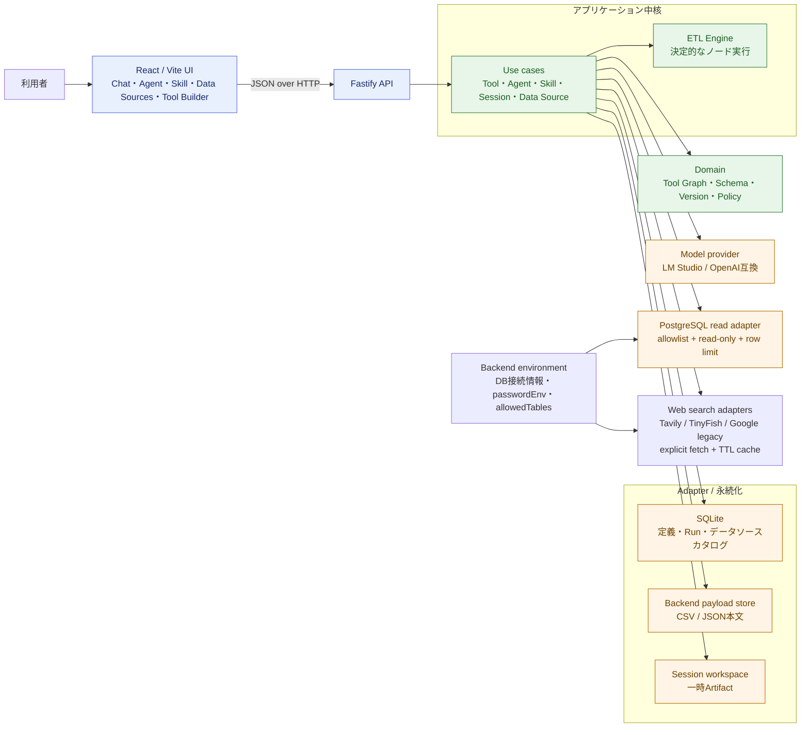
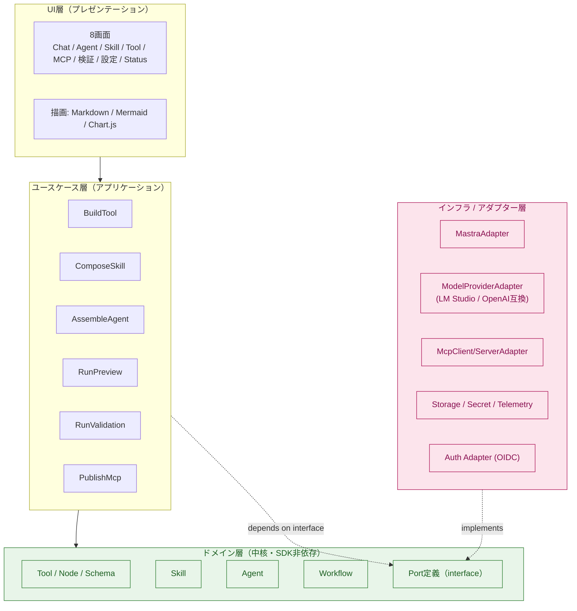
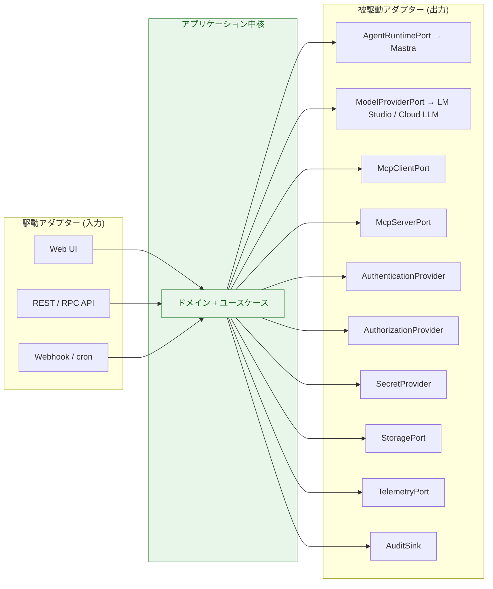
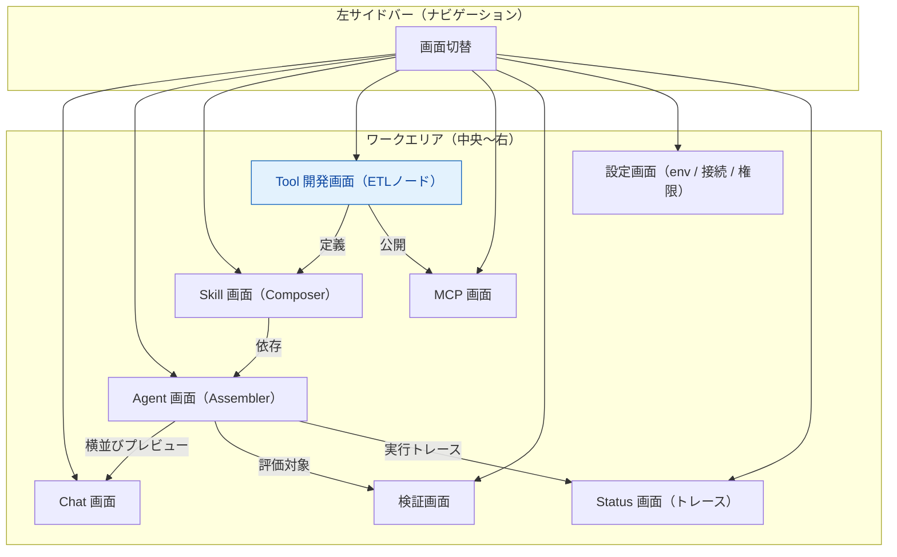
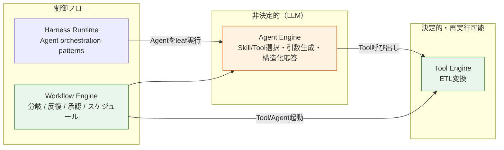
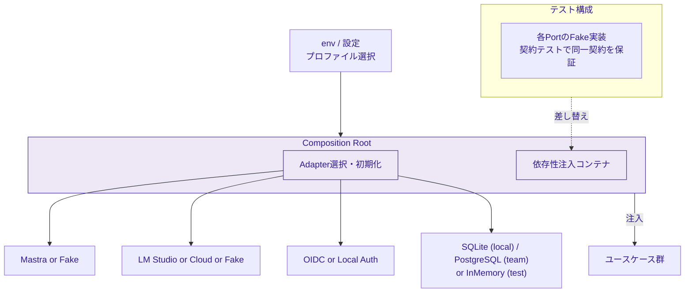

# 01. アーキテクチャ

> 参照: [README.md](./README.md)

本製品のアーキテクチャは **クリーンアーキテクチャ + ヘキサゴナル（Ports & Adapters）** を基調とする。原則は次の2点に集約される。

1. **依存は内側（ドメイン）へ向かう。** UI・ユースケース・ドメインは外部SDKを直接参照しない。
2. **外部SDKはPort（アプリ所有インターフェース）で隔離し、Adapterに閉じ込める。**

---

## 0. 現行実装の全体像

この図は、現在ローカルで実装済みの構成だけを示す。将来構想を含む後続のレイヤ図とは区別し、初見の読者が「ブラウザ操作がどの経路で保存・実行・外部データ読取へ至るか」を把握するための入口とする。

要点は次のとおり。

- UIはHTTP APIだけを呼び、資格情報・ファイル本文・DB接続文字列を保持しない。
- Tool実行時は、保存された`dataSourceId`をbackendが解決する。CSV/JSON本文とDB接続情報はTool定義へ複製しない。
- DB読取はPostgreSQL adapterに限定し、環境変数の`allowedTables`に一致するtable/viewを読み取り専用・行数上限付きで取得する。詳細は[ADR-0029](./adr/0029-data-source-registry.md)。
- Web検索は環境変数のキーが揃うproviderだけをUIへ公開する。明示取得結果は15分のサーバー内キャッシュで参照し、Toolの自動previewは外部検索を起動しない。詳細は[ADR-0030](./adr/0030-optional-web-search-providers.md)。

---

## 1. レイヤ構成

**依存方向の要点**
- `UI → APP → DOM` の一方向。`DOM` は誰も参照しない最内核。
- `INFRA` は `DOM` が定義した `Port` を **実装（implements）** する。矢印は「内向き」。
- 外部SDKの `import` は `INFRA` 層に限定する（[05-dependency-graph.md](./05-dependency-graph.md) で強制ルール化）。

---

## 2. ヘキサゴナル（Ports & Adapters）

ドメイン中核を囲む形で、駆動側（Driving / 左）と被駆動側（Driven / 右）のPortを配置する。

### 主要Port一覧（`ideas-v2.md §8` 準拠）

| Port | 責務 | 代表Adapter |
|---|---|---|
| `AgentRuntimePort` | エージェント実行・ストリーミング・Tool呼び出し仲介 | Mastra |
| `HarnessRuntimePort` | バージョン付きHarnessの開始・pause/resume・共通イベント正規化 | Local Harness Runtime / Microsoft Agent Framework Adapter（将来） |
| `ModelProviderPort` | LLM推論・埋め込み。モデルルーティング | LM Studio（開発）/ OpenAI互換 / クラウド各社 |
| `McpClientPort` | 外部MCPサーバのTool利用 | MCP SDK Client |
| `McpServerPort` | 自作ToolをMCPとして公開 | MCP SDK Server |
| `AuthenticationProvider` | ログイン・ログアウト・トークン/セッション検証 | OIDC (Entra ID / Auth0 / Keycloak / Okta) / ローカル |
| `AuthorizationProvider` | Principal×resource×action×context の許可判定 | RBAC（初期）/ ABAC（将来） |
| `SecretProvider` | 資格情報の参照保存と実行時取得 | Vault / KMS / env |
| `StoragePort` | ワークスペース・定義・実行履歴の永続化 | RDB / Object Storage |
| `TelemetryPort` | メトリクス・トレース・ログ | OpenTelemetry |
| `AuditSink` | 監査イベントの外部転送 | SIEM / ログ基盤 |

> SDK境界の実装ルールの詳細は [04-api-spec.md](./04-api-spec.md) と [08-security-auth.md](./08-security-auth.md) を参照。

---

## 3. コンポーネント構成（画面 × ビルダー）

`ideas.md §UI` の8画面をワークエリアに配置し、左サイドバーで切り替える。**Tool開発画面がノーコード体験の心臓部**（[06-etl-tool-builder.md](./06-etl-tool-builder.md)）。

v1ローカルUIでは8画面をすべて有効化する。MCP画面はversion固定manifestの構成までとし、認証・認可・監査が未接続の外部公開はfail closedとする。検証画面は単一シナリオのtest mode実行と期待Tool照合を提供し、ケース永続化・集計レポートは後続Incrementで扱う。

表示言語はUI共通コンテキストでEnglish / 日本語を切り替え、ブラウザへ保存する。内部ID、公開名、API DTO、環境変数、実行トレースの機械可読値はローカライズ対象外とする。

---

## 4. 実行エンジンの三分割

責務の異なる3つの実行規則を別エンジンに分離する（`ideas-v2.md §8`）。

- **Tool Engine**: 副作用を宣言し、プレビューでは書き込みを実行しない。外部APIは保存済みレスポンスへ切替可能。
- **Agent Engine**: LLMには要約・意図解釈・タスク計画のみを担わせ、計算・データ処理・外部実行はToolへ委譲。
- **Harness Runtime**: Agent協調に限定した型付き制御フロー。Sequential / Concurrentから段階導入し、詳細は [14-agent-harness-builder.md](./14-agent-harness-builder.md) を参照。
- **Workflow Engine**: 汎用の分岐・反復・cronをPhase 3で導入。Harness Runtimeは将来この実行基盤へ統合できるが、保存するAgent Harness契約は維持する。

---

## 5. Composition Root と依存性注入

Adapterの選択・初期化は **Composition Root** ただ1箇所に集約し、依存注入で差し替える。

- 各Portには **契約テスト（contract test）** を用意し、実SDKアダプターとテスト用Fakeが同じ契約を満たすことを検証する。
- SDKのバージョン更新による修正は原則Adapter内に限定する。
- SDK固有の差異は **Capability** として明示し、未対応機能を暗黙のフォールバックで処理しない。

---

## 6. アーキテクチャ上の不変条件（Invariants）

- [ ] ドメイン層・ユースケース層・UI層に外部SDKの `import` を持ち込まない
- [ ] 資格情報はフロー・プロンプト・生成コードに埋め込まず、`SecretProvider` 参照として保存する
- [ ] Toolの副作用（`read-only / write / external-action`）を必ず宣言する
- [ ] プレビューは固定サンプル or 明示取得キャッシュのみを使用し、行数・サイズ・実行時間を制限する
- [ ] すべてのAPI・実行要求・公開操作でサーバー側の認可判定を行う（UI非表示だけに依存しない）
- [ ] 権限未定義 or 認可プロバイダー利用不能時は既定で拒否する
