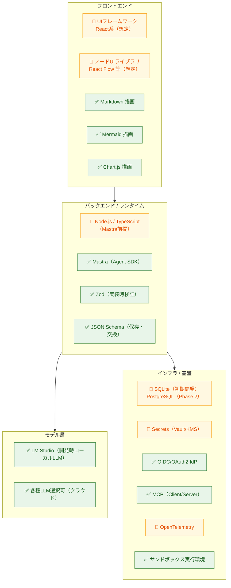
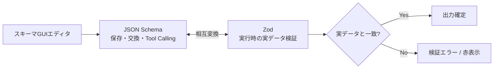

# 02. 技術スタック

> 参照: [`ideas.md` 技術スタック節](../ideas/ideas.md) / [`ideas-v2.md` §8 SDK境界](../ideas/ideas-v2.md)
>
> **凡例**: ✅ = アイデアに明記 / 🔷 = 本仕様書が補う提案（要決定） / 🔶 = 本仕様書が補完し、採用を決定した技術

---

## 1. スタック全体像

---

## 2. 確定スタック（アイデア明記）

| 領域 | 技術 | 用途・根拠 |
|---|---|---|
| **Agent SDK** | ✅ **Mastra** | エージェント実行の中核。`AgentRuntimePort` 経由で利用し、直接依存はAdapterに閉じる |
| **開発時LLM** | ✅ **LM Studio** | ローカルLLM。OpenAI互換APIを想定し `ModelProviderPort` の一実装 |
| **本番LLM** | ✅ **各種選択可** | モデルルーティングを `ModelProviderPort` で抽象化 |
| **文書描画** | ✅ **Markdown** | チャット・ドキュメント表示 |
| **図表描画** | ✅ **Mermaid** | フロー・関係図の表示 |
| **グラフ描画** | ✅ **Chart.js** | ETL出力のグラフデータを可視化 |
| **スキーマ検証** | ✅ **Zod** | 実装時の検証表現 |
| **スキーマ交換** | ✅ **JSON Schema** | 保存・交換用の標準表現 |
| **実行環境設定** | ✅ **env** | プロファイル切替（[01-architecture.md](./01-architecture.md) Composition Root） |
| **MCP** | ✅ **MCP Client / Server** | 外部Tool利用と自作Tool公開 |
| **認証** | ✅ **OIDC / OAuth 2.0** | IdP差し替え（[08-security-auth.md](./08-security-auth.md)） |
| **サンドボックス** | ✅ **分離実行環境** | カスタムコードノードの時間/メモリ/CPU/ネットワーク/FS制限 |

### Zod と JSON Schema の使い分け（`ideas-v2.md §1`）

- **Input Schema**: 引数スキーマ → LLMのTool Calling用JSON Schemaへ変換。
- **Output Schema**: 出力をTool実行後にZodで検証。推論できない場合（API/pivot/カスタムコード）は作成者が明示。

---

## 3. 採用スタック（本仕様書で補完）

アイデアに明記はないが、Mastra（TypeScript）前提から補完した以下のスタックを採用する。選択肢を併記している項目は、AdapterやPortの境界を先に固定し、具体製品・ライブラリを実装フェーズで絞り込む。

| 領域 | 提案 | 理由 / 代替 |
|---|---|---|
| 言語/ランタイム | 🔶 **TypeScript + Node.js** | MastraがTS/Node製のため整合性が高い |
| UIフレームワーク | 🔶 **React** | ノードUI・エコシステムが厚い。代替: Vue / Svelte |
| ノードエディタ | 🔶 **React Flow (xyflow)** | ETLキャンバスの標準的選択。代替: Rete.js |
| 状態管理 | 🔶 **Zustand / Redux Toolkit** | キャンバスのundo/redo・複製に対応 |
| APIスタイル | 🔶 **REST or tRPC** | [04-api-spec.md](./04-api-spec.md) 参照 |
| 永続化 | 🔶 **SQLite（初期開発）** / PostgreSQL（Phase 2） | v1は導入・運用が軽いSQLiteで定義・バージョン・実行履歴を保存。チーム利用時は`StoragePort`を介してPostgreSQLへ移行し、テナント境界を行レベルで適用 |
| Secrets | 🔶 **HashiCorp Vault / クラウドKMS** | `SecretProvider` の実装 |
| 観測 | 🔶 **OpenTelemetry** | `TelemetryPort` の実装。トレース可視化 |
| サンドボックス | 🔶 **isolated-vm / WASM / コンテナ** | カスタムコードノード（Phase 3） |
| テスト | 🔶 **Vitest + Playwright + カバレッジ計測** | ドメイン・API・UI unit/integrationはVitest、実ブラウザ縦切りはPlaywright |

---

## 4. 設計思想の参照元

`ideas.md` が参照として挙げるもの。実装判断の際の指針とする。

| 参照 | 取り込む概念 |
|---|---|
| Zenn記事「私が考えるAIアーキテクト」 | LLMは要約・意図解釈・タスク計画に集中。計算・データ処理・外部実行はツール/プログラム側へ委譲。LLMへ渡すコンテキストは最小限に |
| **Agent Skills** | 役割ごとに再利用可能なSkill単位で能力を構成。責務・入力・出力・依存ツールを定義して組み合わせる |
| **SOLID原則** | コード全般。特にSDK境界の分離（DIP）とPort/Adapter（ISP/DIP） |

---

## 5. 環境プロファイル（env）

`env` により Composition Root が注入するAdapterを切り替える。

| プロファイル | LLM | 認証 | 永続化 | 用途 |
|---|---|---|---|---|
| `local` | LM Studio | ローカルセッション | SQLite | 個人開発・縦切り検証（v1） |
| `team` | クラウドLLM | 外部OIDC | PostgreSQL | チーム利用（Phase 2） |
| `test` | Fake Provider | Fake | InMemory | 契約テスト・回帰 |

### LM Studio 接続設定（local）

| env | 既定 | 内容 |
|---|---|---|
| `LM_STUDIO_BASE_URL` | `http://127.0.0.1:1234/v1` | OpenAI互換APIのbase URL |
| `LM_STUDIO_MODEL` | 必須（Agent実行時） | ロード済みモデル識別子。未設定時は暗黙選択せず実行を拒否 |
| `LM_STUDIO_API_KEY` | 未設定 | Bearer tokenが必要な場合のみ設定 |
| `LM_STUDIO_TIMEOUT_MS` | `120000` | local推論のtimeout（正のミリ秒） |

> プレビュー・テスト・本番実行を明確に表示し、使用データと権限を分離する（`ideas-v2.md §8`）。
>
> SQLiteは初期開発の永続ストアであり、InMemoryはテスト専用とする。DB固有機能をユースケース層へ漏らさず、SQLiteとPostgreSQLのAdapterに同じ`StoragePort`契約テストを適用する。
