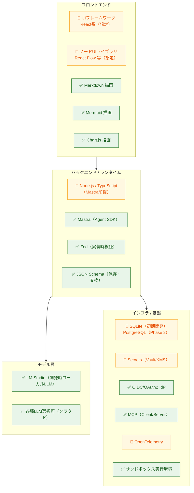
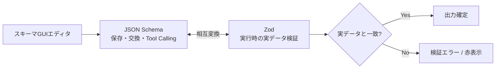

# 02. 技術スタック

> **凡例**: ✅ = アイデアに明記 / 🔷 = 本仕様書が補う提案（要決定） / 🔶 = 本仕様書が補完し、採用を決定した技術

---

## 1. スタック全体像



---

## 2. 確定スタック（アイデア明記）

| 領域 | 技術 | 用途・根拠 |
|---|---|---|
| **Agent SDK** | ✅ **Mastra** | エージェント実行の中核。`AgentRuntimePort` 経由で利用し、直接依存はAdapterに閉じる |
| **開発時LLM** | ✅ **LM Studio** | ローカルLLM。OpenAI互換APIを想定し `ModelProviderPort` の一実装 |
| **本番LLM** | ✅ **各種選択可** | モデルルーティングを `ModelProviderPort` で抽象化 |
| **文書描画** | ✅ **Markdown** | チャット・ドキュメント表示 |
| **図表描画** | ✅ **Mermaid** | フロー・関係図の表示 |
| **グラフ描画** | ✅ **Chart.js** | ETL出力のグラフデータを可視化 |
| **スキーマ検証** | ✅ **Zod** | 実装時の検証表現 |
| **スキーマ交換** | ✅ **JSON Schema** | 保存・交換用の標準表現 |
| **実行環境設定** | ✅ **env** | プロファイル切替（[01-architecture.md](./01-architecture.md) Composition Root） |
| **MCP** | ✅ **MCP Client / Server** | 外部Tool利用と自作Tool公開 |
| **認証** | ✅ **OIDC / OAuth 2.0** | IdP差し替え（[08-security-auth.md](./08-security-auth.md)） |
| **サンドボックス** | ✅ **分離実行環境** | カスタムコードノードの時間/メモリ/CPU/ネットワーク/FS制限 |

### Zod と JSON Schema の使い分け（`ideas-v2.md §1`）



- **Input Schema**: 引数スキーマ → LLMのTool Calling用JSON Schemaへ変換。
- **Output Schema**: 出力をTool実行後にZodで検証。推論できない場合（API/pivot/カスタムコード）は作成者が明示。

---

## 3. 採用スタック（本仕様書で補完）

アイデアに明記はないが、Mastra（TypeScript）前提から補完した以下のスタックを採用する。選択肢を併記している項目は、AdapterやPortの境界を先に固定し、具体製品・ライブラリを実装フェーズで絞り込む。

| 領域 | 提案 | 理由 / 代替 |
|---|---|---|
| 言語/ランタイム | 🔶 **TypeScript + Node.js** | MastraがTS/Node製のため整合性が高い |
| UIフレームワーク | 🔶 **React** | ノードUI・エコシステムが厚い。代替: Vue / Svelte |
| ノードエディタ | 🔶 **React Flow (xyflow)** | ETLキャンバスの標準的選択。代替: Rete.js |
| 状態管理 | 🔶 **Zustand / Redux Toolkit** | キャンバスのundo/redo・複製に対応 |
| APIスタイル | 🔶 **REST or tRPC** | [04-api-spec.md](./04-api-spec.md) 参照 |
| 永続化 | 🔶 **SQLite（初期開発）** / PostgreSQL（Phase 2） | v1は導入・運用が軽いSQLiteで定義・バージョン・実行履歴を保存。チーム利用時は`StoragePort`を介してPostgreSQLへ移行し、テナント境界を行レベルで適用 |
| Secrets | 🔶 **HashiCorp Vault / クラウドKMS** | `SecretProvider` の実装 |
| 観測 | 🔶 **OpenTelemetry** | `TelemetryPort` の実装。トレース可視化 |
| サンドボックス | 🔶 **isolated-vm / WASM / コンテナ** | カスタムコードノード（Phase 3） |
| テスト | 🔶 **Vitest + Playwright + カバレッジ計測** | ドメイン・API・UI unit/integrationはVitest、実ブラウザ縦切りはPlaywright |

---

## 4. 設計思想の参照元

`ideas.md` が参照として挙げるもの。実装判断の際の指針とする。

| 参照 | 取り込む概念 |
|---|---|
| Zenn記事「私が考えるAIアーキテクト」 | LLMは要約・意図解釈・タスク計画に集中。計算・データ処理・外部実行はツール/プログラム側へ委譲。LLMへ渡すコンテキストは最小限に |
| **Agent Skills** | 役割ごとに再利用可能なSkill単位で能力を構成。責務・入力・出力・依存ツールを定義して組み合わせる |
| **SOLID原則** | コード全般。特にSDK境界の分離（DIP）とPort/Adapter（ISP/DIP） |

---

## 5. 環境プロファイル（env）

`env` により Composition Root が注入するAdapterを切り替える。

| プロファイル | LLM | 認証 | 永続化 | 用途 |
|---|---|---|---|---|
| `local` | LM Studio | ローカルセッション | SQLite | 個人開発・縦切り検証（v1） |
| `team` | クラウドLLM | 外部OIDC | PostgreSQL | チーム利用（Phase 2） |
| `test` | Fake Provider | Fake | InMemory | 契約テスト・回帰 |

### LM Studio 接続設定（local）

| env | 既定 | 内容 |
|---|---|---|
| `LM_STUDIO_BASE_URL` | `http://127.0.0.1:1234/v1` | OpenAI互換APIのbase URL |
| `LM_STUDIO_MODEL` | 必須（Agent実行時） | ロード済みモデル識別子。未設定時は暗黙選択せず実行を拒否 |
| `LM_STUDIO_API_KEY` | 未設定 | Bearer tokenが必要な場合のみ設定 |
| `LM_STUDIO_TIMEOUT_MS` | `600000` | local推論の総時間timeout（正のミリ秒）。ハング検知は `LM_STUDIO_IDLE_TIMEOUT_MS`（既定60000）が担うため長めに取る |
| `LM_STUDIO_MAX_TOKENS` | 未設定 | 正の整数。未設定なら `max_tokens` を送らずモデル既定に委ねる |

judgeスロットは同じ4つを `JUDGE_` 接頭辞つきで持つ（`JUDGE_LM_STUDIO_BASE_URL` / `_MODEL` / `_API_KEY`）。
読まれているenvの全量は [.env.example](../.env.example) を参照。

### 永続化（local）

| env | 既定 | 内容 |
|---|---|---|
| `AGENTCONTEXT_DB_PATH` | `~/.agentblume/agentblume.db` | SQLiteの保存先。**未設定なら永続ファイル**を使う（親ディレクトリは自動作成）。`:memory:` を明示したときだけ揮発する。空文字は未設定と同じ扱い。起動時に実際の保存先をログへ出す |
| `AGENTCONTEXT_TENANT_ID` / `AGENTCONTEXT_WORKSPACE_ID` | `local` / `default` | 保存・参照するテナントスコープ |

SQLite接続は **プロセスにつき1本**（`src/adapters/storage/sqlite-database.ts`）。全リポジトリがこのハンドルを共有し、
起動時に以下を適用する。

| PRAGMA | 値 | 理由 |
|---|---|---|
| `journal_mode` | `WAL`（ファイルDBのみ） | 読み取りが書き込みでブロックされない。`:memory:` では意味がないので設定しない |
| `busy_timeout` | `5000` | ロック競合を即時エラーにせず待つ |
| `foreign_keys` | `ON` | SQLiteの既定はOFFのため明示する |

スキーマは `PRAGMA user_version` ベースの番号付きマイグレーション（`src/adapters/storage/migrations.ts`）で管理する。
version 1 は「全テーブル + 旧DBに欠けうる列の補完 + 全インデックス」を**冪等に**適用する定義であり、
空DBも旧スキーマのDBも同じ経路で version 1 へ収束する。DBの `user_version` がコードの最新版より新しい場合は
**起動を拒否**する（古いコードに新しいデータを触らせない）。

複数リポジトリにまたがる書き込みは `UnitOfWorkPort`（`src/application/persistence/unit-of-work.ts`）で括る。
SQLite配線では共有接続に `BEGIN` / `COMMIT` を張り、入れ子は `SAVEPOINT` で同じ単位へ合流する。
InMemory配線では `NoopUnitOfWork` がそのまま実行する。

### 秘密値の保管（local）

| env | 既定 | 内容 |
|---|---|---|
| `AGENTCONTEXT_SECRET_KEY_PATH` | `~/.agentblume/secret.key` | UIから保存したAPIキーを暗号化する鍵ファイル（AES-256-GCM・32バイト）のパス。初回利用時に自動生成する。**DBとは別の場所に置く**（DBファイルだけが流出しても平文キーを復元できないようにするため）。旧版がDBと同じディレクトリに `agentblume.secret.key` を作っている場合はそれを読み続ける |

> 鍵ファイルとDBファイルは `.gitignore` 済み。鍵を失うと保存済みAPIキーは復号できない（UIから再入力すれば復旧する）。
> Windows（NTFS）では鍵ファイルへの `chmod 0o600` が実効性を持たないため、保護はOSのACL・ディスク暗号化に依存する。

> プレビュー・テスト・本番実行を明確に表示し、使用データと権限を分離する（`ideas-v2.md §8`）。
>
> SQLiteは初期開発の永続ストアであり、InMemoryはテスト専用とする。DB固有機能をユースケース層へ漏らさず、SQLiteとPostgreSQLのAdapterに同じ`StoragePort`契約テストを適用する。

---

## 6. ビルドと起動

### ランタイム要件

| 項目 | 値 | 根拠 |
|---|---|---|
| Node.js | **>= 22.9.0**（`package.json` の `engines`、`.nvmrc` は `22.19.0`） | `node:sqlite`（組込みSQLite）が 22.5.0 以降、`.env` を読む `--env-file-if-exists` が 22.9.0 以降 |
| 起動フラグ | `--experimental-sqlite --disable-warning=ExperimentalWarning` | `node:sqlite` は Node 22 系では実験的機能でフラグが要る（ADR-0004） |

### スクリプト

| script | 内容 |
|---|---|
| `npm run build` | `build:ui` → `build:server` |
| `npm run build:ui` | `vite build` → `dist/ui`（SPA） |
| `npm run build:server` | `vite build --config vite.server.config.ts` → `dist/server`（SSRビルド） |
| `npm start` | `node ... dist/server/server.js`（本番。tsx を使わない） |
| `npm run serve` | `node ... --import tsx src/server.ts`（開発。TypeScriptを直接実行） |

### なぜサーバーのビルドが tsc ではなく vite（SSRビルド）なのか

このリポジトリの相対 import は**拡張子なし**（`import { buildServer } from './api/server'`）で書かれている。
`tsc` は import 指定子を書き換えないため、`noEmit` を外して JS を出しても Node の ESM ローダーが
`./api/server` を解決できず `ERR_MODULE_NOT_FOUND` になる。全ソースへ `.js` を足す変更は影響範囲が大きい。
そこで既存 devDependency の vite で解決済みの相対パスへ書き換える（**新規依存はゼロ**）。

出力は **`preserveModules: true`（1ファイルへまとめない）**。`src/mastra-runtime-env.ts` は
「`@mastra/*` を読み込む前に env を立てる」ための副作用専用モジュールで、各エントリポイントの
最初の import に置くことで評価順を ESM の言語仕様として固定している。単一チャンクへインライン化すると
その本体コードは「全 import の評価後」へ移動し、`import '@mastra/core'` の方が先に走ってしまう。
`package.json` の `dependencies` は vite の SSR ビルドが既定で external にするため、`node_modules` は本番でも必要。

### ビルド済みUIの配信

`npm start`（`dist/server/server.js`）は隣の `dist/ui` を探し、見つかれば **APIと同じポート**から
[`@fastify/static`](https://github.com/fastify/fastify-static)（公式プラグイン）で配信する。
自前実装ではなくプラグインを採るのは、Content-Type / ETag / Last-Modified / Range / パストラバーサル防止を
自分で持たずに済むため。`wildcard: false`（ファイル単位でルートを張る）にして、未登録パスは Fastify の
`setNotFoundHandler` へ落とす。そこで「APIの接頭辞」「拡張子つき（＝ファイル要求）」「GET/HEAD以外」を
除いたものだけを `index.html` へフォールバックさせる（綴り間違いのAPIパスにHTMLを返すと、UIは
「JSONでない応答」で失敗して原因が分からなくなる）。
`npm run serve`（開発）は `dist/ui` を探索しない。古いビルドを掴むとソースを直しても画面が変わらず、
Vite 開発サーバー（5173）との違いに気づけなくなるため。開発時のUI配信は従来どおり Vite が行う。

### env の検証（fail-fast）

`src/config/environment.ts` が **読まれているenvの全量**をzodで定義し、プロセス起動の最初に一括検証する。
1件でも不正なら「どの変数の、どの値が、何を期待されているか」を並べて `exit 1` する。
`.env.example` はこの定義と一致させる。とくに `AGENTCONTEXT_DB_CONNECTIONS` は
JSONの構文エラーも構造エラー（フィールド名の打ち間違い等）も**起動失敗**にする。
以前は adapters 側が `catch { return {}; }` で握り潰していたため、カンマ1つの間違いで
DB接続が画面から静かに消えていた。

### HTTPタイムアウト

| 設定 | 値 | 根拠 |
|---|---|---|
| `bodyLimit` | 10 MiB | チャットの画像（最大2枚・各3 MiB）をBase64化した約8 MiB + メタデータ |
| `requestTimeout` | 120000 ms | **リクエストを受信し終える**までの上限（`server.requestTimeout`）。応答＝ハンドラの実行時間は対象外なので、10分のモデル呼び出しや最大1時間のHarness実行を殺さない。Fastifyの既定は `0`（無効）で、ボディを少しずつしか送らない接続がソケットを握り続けられた |
| `keepAliveTimeout` | 72000 ms | 応答完了後のkeep-aliveソケットを閉じるまで。実行中のリクエストには影響しない（Fastify既定値の明示） |
| `connectionTimeout` | **0（無効のまま）** | 無通信でソケットを切る設定。有効にすると「モデルが長考中で何も流れていない」Agent/Harness実行が落ちる。長時間経路をワーカー化してHTTPリクエストから切り離すまでは無効を維持する |

### liveness / readiness

| エンドポイント | 内容 |
|---|---|
| `GET /health` | liveness。プロセスが生きているかだけを見る（依存は叩かない）。`{ status: 'ok', node, uptimeSeconds, revision? }` |
| `GET /ready` | readiness。必須依存（DB）への読み取りを1本通す。全て成功で `200 { status: 'ready', checks }`、1つでも失敗すれば `503 { status: 'unready', checks }` |

`revision` は `AGENTCONTEXT_SOURCE_REVISION` を設定したときだけ返す（どのビルドが動いているかの確認用）。

### graceful shutdown

SIGINT / SIGTERM を受けると `src/server.ts` が次の順で降りる。順序に意味がある。

| 順 | 処理 | 目的 |
|---|---|---|
| 1 | `server.close()` | 新規接続を止め、処理中のHTTPリクエストを終わらせる |
| 2 | `app.drainWorkers(graceMs)` | ワーカーの新規受付を止め、**実行中**のジョブを最大 `graceMs` 待つ |
| 3 | `app.mcpClient.close()` | stdio接続の子プロセスを孤児にしないよう先に閉じる |
| 4 | `app.close()` | DBハンドル等を解放（ワーカーへの最終中断も兼ねる） |
| 5 | `telemetry.shutdown()` | 未送信の span をフラッシュ（OTel有効時のみ。`BatchSpanProcessor` は既定で5秒ためるため、これが無いと落ちる直前の trace が消える） |

| env | 既定 | 内容 |
|---|---|---|
| `AGENTCONTEXT_SHUTDOWN_GRACE_MS` | `10000` | 実行中の実験・Factory Runの完了を待つ上限（0以上の整数・ミリ秒）。`0` は待たずに中断 |

以前は 2 が無く、`app.close()` が実行中のジョブを**即中断してキューごと捨てて**いた（`Ctrl+C` が
「進行中の実験・Factory Runを捨てる」操作になっていた）。猶予を過ぎたジョブは従来どおり中断する。
未実行のキューは待たずに捨てる（待っても実行しないものを抱える意味がない）。
ジョブの永続化と再起動後の再開は未実装なので、**中断されたジョブは再開されない**（次段の課題）。
猶予が長すぎる場合に備え、**2回目の SIGINT / SIGTERM で猶予を打ち切って即終了**する（exit 1）。

猶予の実体は `IdleLatch`（`src/adapters/worker/idle-latch.ts`）。`InProcessExperimentWorker` と
`InProcessFactoryWorker` は独立した実装だが、この待ち合わせだけは共有して1箇所で検証する。
待ち合わせタイマーは `unref()` する（待ちたいのはジョブであってタイマーではない）。

---

## 7. 観測（ログ・トレース）

### ログ（Fastify / pino）

`npm run serve` / `npm start` は `buildServer(app, { logger: { level } })` でロガーを有効にする。
設定の実体は `src/api/logging.ts`。

| 項目 | 内容 |
|---|---|
| レベル | `AGENTCONTEXT_LOG_LEVEL`。**既定はプロファイル依存で `local`=`info` / `test`=`silent`** |
| マスク | pino の `redact`。伏せ字は `[redacted]` 固定（値の長さも漏らさない） |
| リクエストID | Fastify がリクエストごとに `logger.child({ reqId })` を作るので**設定不要**。自動の「incoming request / request completed」にも `request.log.*` にも `reqId` が載る |

`test` プロファイルの既定を `silent` にしているのは、E2E とテスト用の手動起動で
リクエストごとに2行流れるとテスト出力が読めなくなるため。調べたいときは
`AGENTCONTEXT_LOG_LEVEL=info` を明示すれば既定より優先される（封じてはいない）。

マスク対象は「キー名で判別できるもの」に限る。

| 層 | パス |
|---|---|
| ヘッダ | `req.headers.authorization` / `.cookie` / `["proxy-authorization"]` / `["x-api-key"]` / `["x-auth-token"]`、`res.headers["set-cookie"]`、`headers.*` の同名 |
| ボディ | `req.body.apiKey` / `password` / `token` / `secret` / `accessToken` / `refreshToken` / `authorization`、`body.*` の同名 |
| ログcontext | 深さ1（`apiKey` / `password` / `token` / `secret` …）と深さ2（`*.apiKey` …） |

Fastify の**既定の `req` シリアライザはヘッダもボディも出さない**（method / url / host / remoteAddress だけ）ので、
素の状態で `Authorization` が漏れるわけではない。危ないのは「調査のために一時的にヘッダやボディを出す」
「`server.log.info({ apiKey }, …)` と直接書く」といった、その場では正しく見える変更のほうで、
**設定が無ければ静かに全部出る**。`redact` はロガー生成時にしか渡せない（fast-redact がパスを事前コンパイルする）ため、
後から足すこともできない。だから先に置く。

値の形（JWTらしき文字列など）では判定しない。例外メッセージの中に埋め込まれた秘密値は
`redactSecrets()`（`src/application/operations/logger.ts`）が正規表現で落とす。役割が違うので両方要る。

### トレース（OpenTelemetry）

計装（`agent.run` / `model.complete` / `tool.execute` / `evaluation.case` の span）は
`src/adapters/telemetry/open-telemetry-adapter.ts` に前からあったが、依存は `@opentelemetry/api` **だけ**で
SDKも exporter も初期化コードも無かった。`trace.getTracer()` は TracerProvider 未登録なら no-op を返すため、
`AGENTCONTEXT_OTEL_ENABLED=true` にしても **span は1本も出ない**（エラーにもならないので気づけない）状態だった。
`src/otel-runtime.ts` がその欠けていた側を埋める。

| env | 既定 | 内容 |
|---|---|---|
| `AGENTCONTEXT_OTEL_ENABLED` | `false` | `true` のときだけ TracerProvider を登録する |
| `OTEL_EXPORTER_OTLP_ENDPOINT` | `http://localhost:4318` | OTLP/HTTP の送信先（末尾に `/v1/traces` が足される）。**OTel標準env**で解釈するのはSDK |
| `OTEL_EXPORTER_OTLP_TRACES_ENDPOINT` | — | trace専用の完全なURL。指定すれば上より優先される |

その他の `OTEL_*`（`OTEL_EXPORTER_OTLP_HEADERS`、`OTEL_TRACES_SAMPLER` 等）もSDKがそのまま読む。
このアプリは値を解釈しない（[SDK環境変数の仕様](https://opentelemetry.io/docs/specs/otel/configuration/sdk-environment-variables/)）。
`service.name` は `agentblume` 固定、`AGENTCONTEXT_SOURCE_REVISION` があれば `service.version` に載せる。

受け口を1つ立てて確かめる最短手順:

```bash
docker run --rm -p 4318:4318 otel/opentelemetry-collector:latest
# .env に AGENTCONTEXT_OTEL_ENABLED=true と OTEL_EXPORTER_OTLP_ENDPOINT=http://127.0.0.1:4318
npm run serve
```

**採用したのは `@opentelemetry/sdk-node` ではなく trace だけの構成**
（`sdk-trace-node` + `exporter-trace-otlp-http` + `resources` + `semantic-conventions`）。
`sdk-node` は metrics / logs / prometheus / zipkin / jaeger / gRPC の exporter を全部引き連れてくるが、
使うのは trace の OTLP/HTTP 1本だけで、`@grpc/grpc-js` と `protobufjs` まで入る。
実測で `node_modules` が +39 MB（trace限定なら +23 MB）。使わないものは配らない。

**無効時はSDKパッケージを `import` すらしない**（`await import()` の手前で return する）。
exporter は生成されず、バックグラウンドの送信タイマーも立たない。オフラインファーストの前提を壊さないため、
これは `src/otel-runtime.test.ts` で固定してある。

初期化に失敗しても throw しない（観測系の障害を業務へ伝播させない、というコードベース共通の規律）。
ただし黙って無効化はせず、理由を1行出す。

> **なぜ `src/mastra-runtime-env.ts` と同じ「副作用専用モジュールを最初に import する」形にしないのか**
>
> SDKの起動は非同期（`await import()`）なので top-level await が要る。ところが
> **ESM の兄弟モジュールは async な兄弟の完了を待たない**（同期モジュール B は、TLA を持つ
> 兄弟 A より先に評価が終わる。実測で確認済み）。「最初の import に置いたから fastify より先に起動している」
> という保証は得られない。
> 代わりに `startTelemetry()` を公開し、`src/server.ts` の本体の最初で `await` する。
> この計装は自動計装（モジュールの monkey-patch）を使わず手書きの span だけなので、必要なのは
> 「**最初の span が作られる前に** provider が登録されていること」だけで、`createApp()` より前に await していれば足りる
> （`@opentelemetry/api` の ProxyTracer は span 生成のたびに delegate を引き直す）。

---

## 8. CI（GitHub Actions）

| workflow | トリガー | 内容 |
|---|---|---|
| `.github/workflows/ci.yml` | push(main) / pull_request | `npm ci` → `typecheck` → `depcruise` → `test:cov` → `build` → 本番ビルドの起動確認（`/health` `/ready`） |
| `.github/workflows/e2e.yml` | `workflow_dispatch`（手動）のみ | `playwright install --with-deps chromium` → `npm run test:e2e` |

`ubuntu-latest` で動かす。Node の版は `.nvmrc`（22.19.0）を唯一の指定にし、
`actions/setup-node` の `cache: npm` で `~/.npm` をキャッシュする。
`package.json` の `engines` の `>=22.9.0` は「動く下限」であって、CIで使う版を決めるものではない。
Windows前提のスクリプト（`scripts/*.ps1`）は呼ばない。

`node:sqlite` は Node 22.19 では**フラグ無しでも使える**（`--experimental-sqlite` は受理されるが必須ではない）。
`vitest.config.ts` の `execArgv` はそのままで Linux でも同じ挙動になる。

e2e を CI 本体に入れず手動トリガーの別ワークフローにしたのは、この構成をまだ Actions 上で
一度も実行できていないため。`continue-on-error: true` で ci.yml に同居させると
「壊れているのにチェックは緑」が常態化してそのうち誰も見なくなるうえ、毎 push で
ブラウザ取得＋サーバー2本の起動＋シナリオ実行の数分を必ず払うのにシグナルはゼロになる。
別ワークフローなら「まだ検証中」が状態として正しく見え、ci.yml を巻き込まずに何度でも回して直せる。
安定して緑になることを確認できたら `on:` に `pull_request` を足す。
