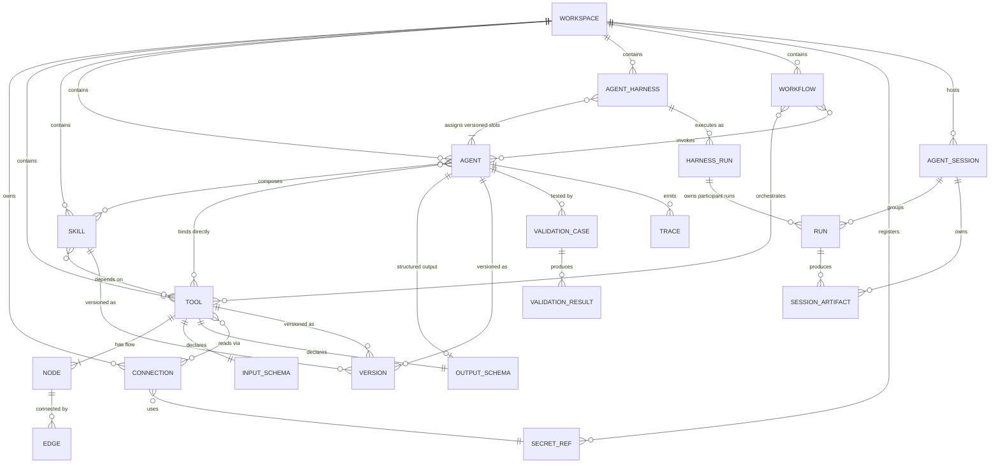
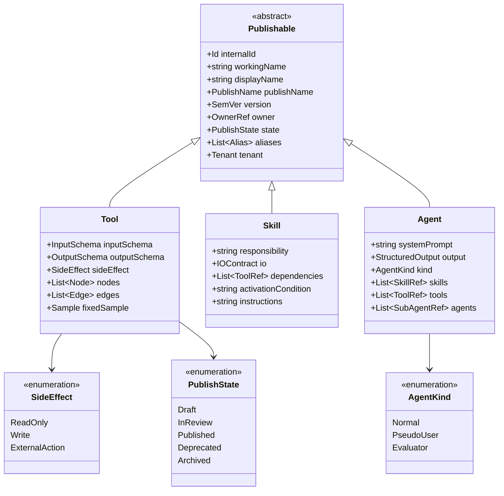
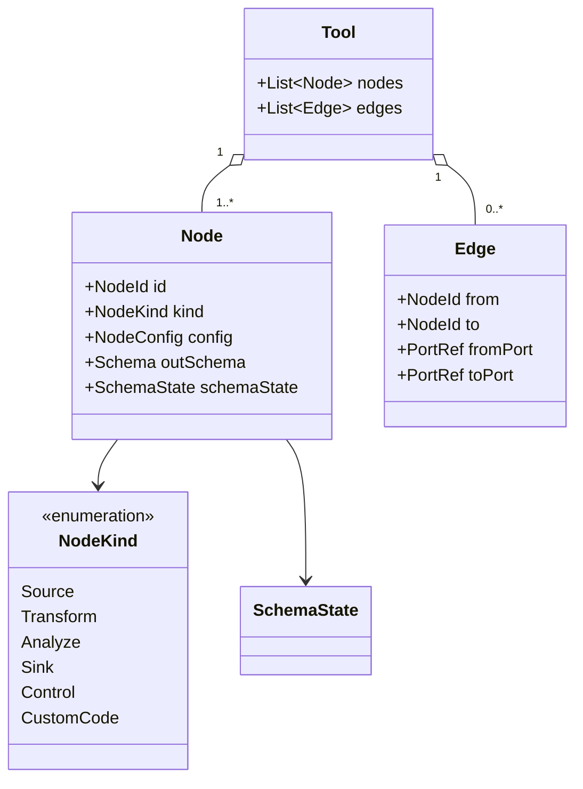
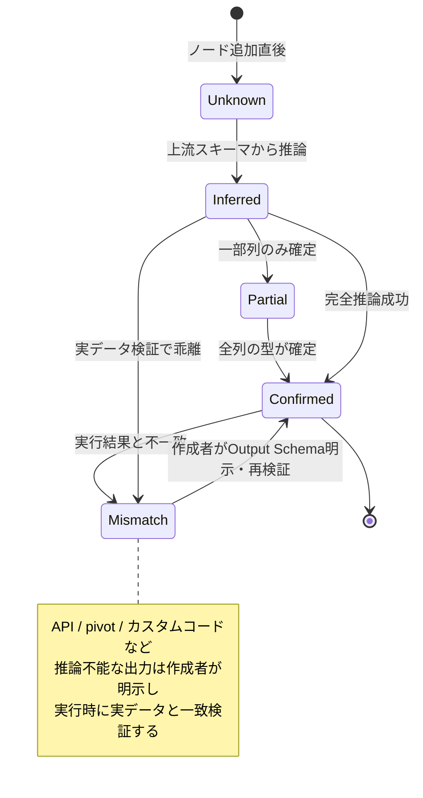
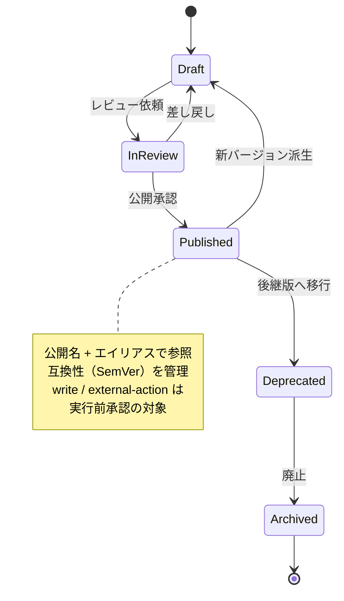
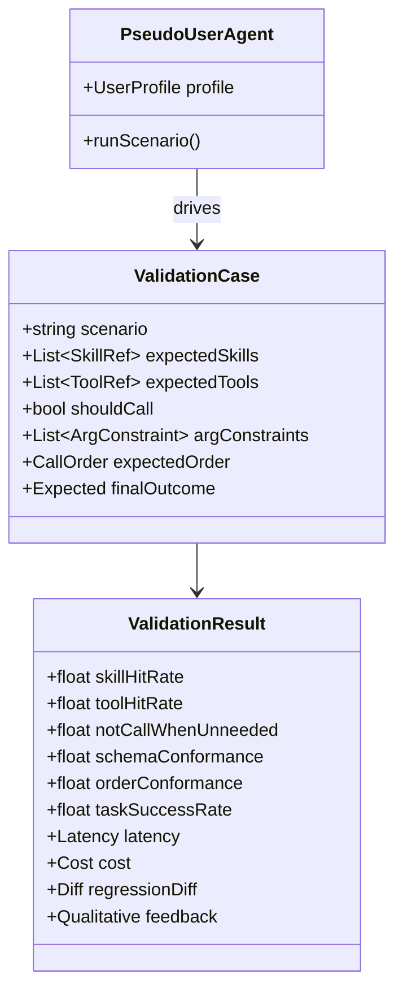
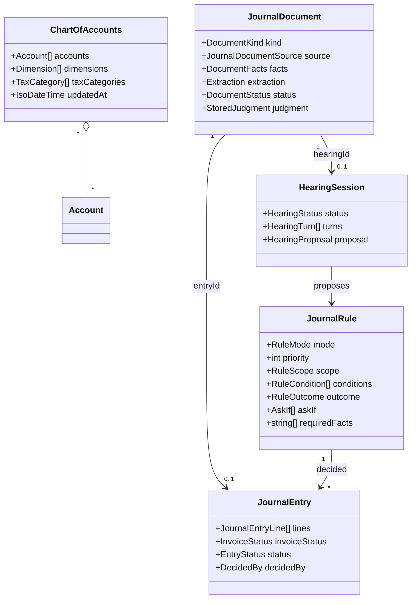

# 03. ドメインモデル

ドメイン層は外部SDKに非依存（[01-architecture.md](./01-architecture.md)）。ここではエンティティ・値オブジェクト・状態遷移を定義する。

---

## 1. エンティティ関係（ER図）

---

## 2. 共通メタデータ（Tool / Skill / Agent 共通）

`ideas.md` は「内部識別子・表示名・公開名・バージョン・所有者・公開状態」の分離を要求する。複数人開発と公開名の衝突管理のため、これを共通値オブジェクト化する。共通値オブジェクト化は実装済み（[ADR-0036](./adr/0036-shared-publishable-metadata.md)、`src/domain/shared/publishable.ts`）。図中の `aliases` は未実装の後続課題である。

### 命名の分離ルール（`ideas.md`）
- **開発画面**: 内部識別子（`internalId`）・作業用名称（`workingName`）を扱う。
- **エージェントに見せる**: 公開名（`publishName`）のみ。
- **公開時**: エイリアス・名前衝突・互換性を管理する仕組みを持つ（[04-api-spec.md](./04-api-spec.md) の Publish API）。

### 列挙値の意味
- `SideEffect`: `ReadOnly`（副作用なし）/ `Write`（書き込み）/ `ExternalAction`（外部操作）。`Write`・`ExternalAction` は実行前承認の対象。
- `AgentKind`: `Normal`（通常）/ `PseudoUser`（ユーザープロファイル駆動の疑似ユーザー）/ `Evaluator`（評価用）。

v1の`StructuredOutput`はJSON object直下の`string / number / integer / boolean` fieldに限定し、requiredとdescriptionを保持する。nested object、array、enumは後続で拡張する。

v1の`Skill`は責務・発火条件・入出力説明・編集可能なinstructionsを持ち、依存Toolを`internalId + SemVer`で固定する。latest参照は保存しないため、Tool更新後も既存Skillの再現性を維持する。AgentへのSkill組み込みは後続Incrementで扱う。

`Agent.agents`（サブエージェント参照 = `internalId + SemVer + usage委譲基準`）によるマルチエージェント合成は [12-multi-agent.md](./12-multi-agent.md) を参照。バージョン固定参照のため循環は構造的に不可能で、合成体も通常のAgentと同一の抽象として扱う（[ADR-0018](./adr/0018-multi-agent-sub-agent-delegation.md)）。

`AgentHarness`はSequential、Concurrent、Handoff、Group Chat、Magenticのように制御フロー自体を保存・可視化する集約である。pattern別の型付きtopology、Agent versionを割り当てるslot、実行policyを保持し、Compilerが共通の実行グラフへ変換する。単純委譲には引き続き`Agent.agents`を使う。詳細は [14-agent-harness-builder.md](./14-agent-harness-builder.md) を参照。

`AgentSession`は1つのルート会話または評価ケースを表し、複数Runと一時`SessionArtifact`を束ねる。Project Workspaceや長期Wikiとは寿命・認可境界を分け、サブAgentだけが親Sessionを継承する。詳細は [ADR-0027](./adr/0027-tool-output-and-session-workspace.md) を参照。

---

## 3. Tool の内部構造（ノードフロー）

ノード分類の詳細は [06-etl-tool-builder.md](./06-etl-tool-builder.md) を参照。

### Tool の作られ方: 1から組む / テンプレートから作る

`Tool`（上記）を作る経路は、空のノードフローから1つずつ組む従来の経路に加え、外部ファイル（`templates/tools/*.json`）の **`ToolTemplate`** を選んでスロット（データソース・列・少数の選択肢）を埋める経路がある（[ADR-0049](./adr/0049-tool-templates.md) / [implementation/v43](../implementation/v43-tool-templates.md)）。Agent Factory とTool Builderの「テンプレートから作成」は同じファイル・同じ実体化を使う。`ToolTemplate` は**エンティティではない**: DBへ保存せず版管理もしない。ファイル（JSON）そのものが正本で、スロットの値を埋めてノード・エッジへ展開する「実体化」は副作用のない純関数である。

Agent Factory の段階的ツール生成（[ADR-0048](./adr/0048-staged-tool-generation.md) / [implementation/v42](../implementation/v42-staged-tool-generation.md)）はテンプレートに当てはまる形が無いときの経路で、モデルには `ToolSpec`（結合・期間・カテゴリ絞り込み・計算列・出力の**決定だけ**を持つ閉じた語彙）の断片だけを決めさせ、決定的なコンパイラがグラフを組む。`ToolSpec` も**エンティティではない**: 保存されるのは生成後の`Tool`であり、`ToolSpec`は生成過程の中間表現（要約は`tool_generated`イベントに残る）。

---

## 4. スキーマ状態の遷移

`ideas-v2.md §1` は「確定 / 部分確定 / 推論 / 不明 / 実行結果と不一致」の5状態を区別することを要求する。これはスキーマ自動伝播とインライン検証の基盤。

- 型不一致は接続線を赤く表示（インライン検証）。
- `Mismatch` はスナップショットテストの差分検知にも使う。

---

## 5. 公開・バージョンのライフサイクル

- 公開状態の遷移は監査ログへ記録（[08-security-auth.md](./08-security-auth.md)）。
- `Published` への遷移は認可（`publish` アクション）の対象。

---

## 6. 検証（Validation）モデル

`ideas-v2.md §2, §11` に基づき、検証は「呼び出し率」だけでなく期待Skill/Tool・順序・引数・成否をケース単位で定義する。

検証指標の一覧は [09-roadmap.md §4](./09-roadmap.md#4-検証指標) を参照。

---

## 7. 仕訳（Journal）

伝票・帳票から仕訳を起こす境界づけられたコンテキスト（詳細は [20-journal.md](./20-journal.md) / [ADR-0038](./adr/0038-journal-two-stage-judgment.md)）。他の BC と資産を共有せず、`domain/journal` に閉じている。

| 集約 | 役割と不変条件 |
|---|---|
| `ChartOfAccounts` | ワークスペースに 1 つの科目マスタ（勘定科目 / 税区分 / 補助軸）。**科目体系はコードに持たずデータとして持つ**。科目 id・科目コード・税区分コード・補助軸 id はそれぞれ一意、`defaultTaxCode` は実在する税区分を指す。削除は論理削除（`enabled: false`）。 |
| `JournalDocument` | 取込んだ 1 証憑。帳票種別を問わず `facts`（正規化済み事実）を同じ形で持ち、**判定はここだけを見る**。証憑本体（画像 data URL / 原文 / CSV 行）は `source` に同梱（1 件 8 MiB 上限）。状態は `extracted` → `decided` / `undecided` → `hearing` → `decided` / `skipped` / `exported`。`decided` の文書は必ず `entryId` を持つ。 |
| `JournalRule` | 自動仕訳ルール。**科目を id で参照**し、名称変更に追従する。`mode: auto` は Stage 1 で確定してよく、`suggest` は一致しても Stage 2 へ回す。競合解決は priority → 特異度 → createdAt。 |
| `JournalEntry` | 仕訳。**借方合計 = 貸方合計**が不変条件。各行は科目 id と**確定時の科目名**の両方を持つ（マスタを改名しても過去の仕訳は当時の名前を保つ）。状態は `draft` → `confirmed` → `exported`。 |
| `HearingSession` | Stage 2 のヒアリング（質問と回答の列 + 提案）。フェーズ 1 では集約とリポジトリだけを用意し、質問生成はフェーズ 2。 |

判定（Stage 1）は `judgeDocument(document, rules, chart, now)` という**純粋関数**で、確定できないことはエラーではなく結果（`undecided` + 理由コード）として返す。理由コードは UI が「原因 → 次の一手 → 修正場所」を出すための情報になる。

疑似ユーザーの種別（Persona）・複数ターン会話・アンケート/感想を含む**シナリオ検証**の詳細モデル（Persona / Scenario / ScenarioRun / SurveyQuestion）は [11-scenario-validation.md](./11-scenario-validation.md) を参照。v16では疑似ユーザーは検証コンテキストの `Persona` として実装（[ADR-0017](./adr/0017-scenario-validation-pseudo-users.md)）、**v18でPersona登録から `AgentKind.PseudoUser` のAgentへ実体化する統合**を行う（[ADR-0019](./adr/0019-persona-pseudo-user-agent-integration.md)。Agentは出所 `persona@version` を保持し、シナリオの疑似ユーザー選択はAgent参照に統一）。