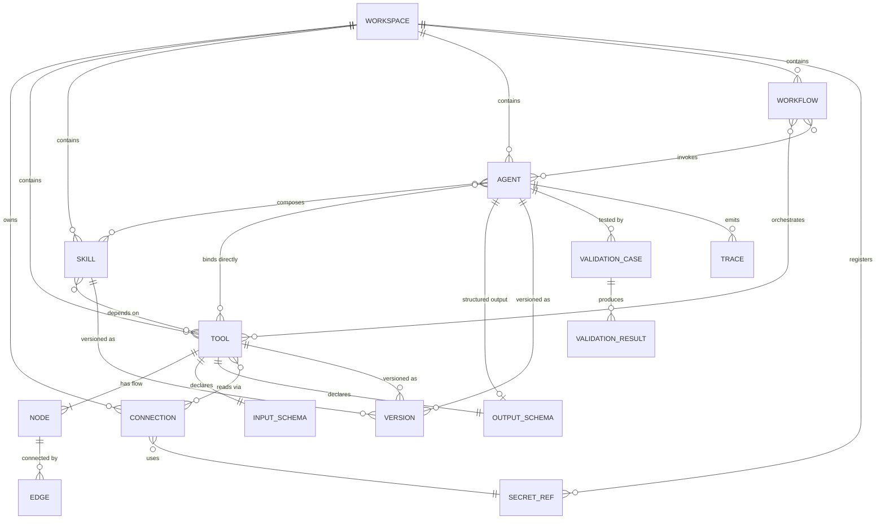
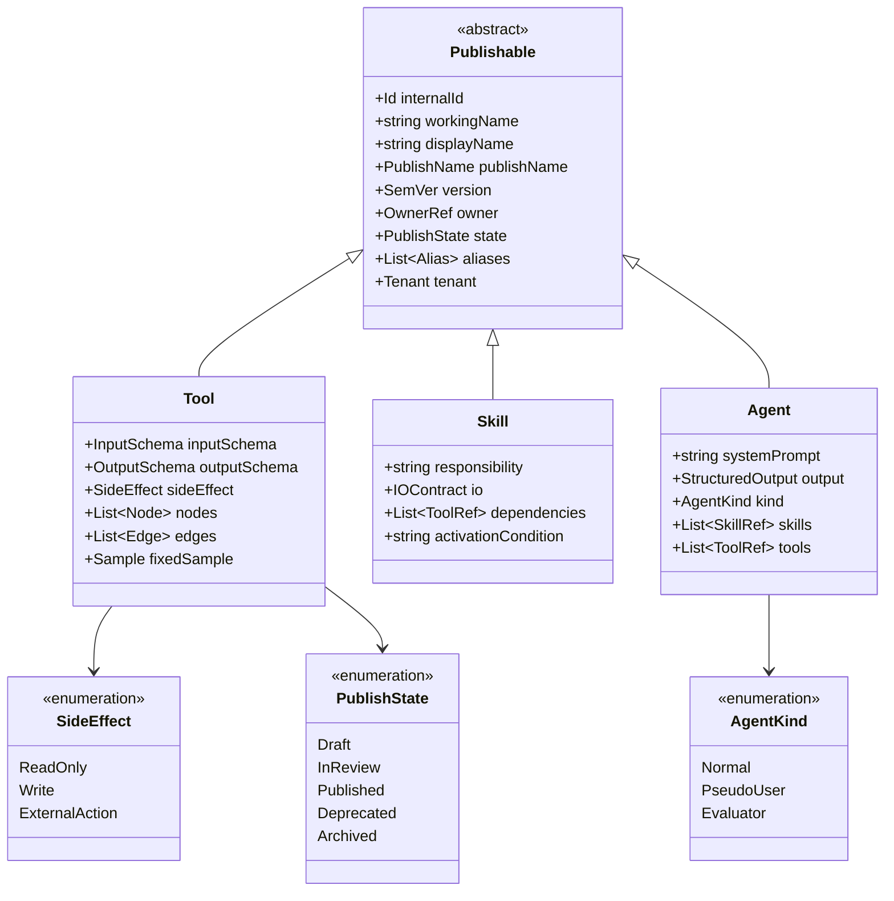
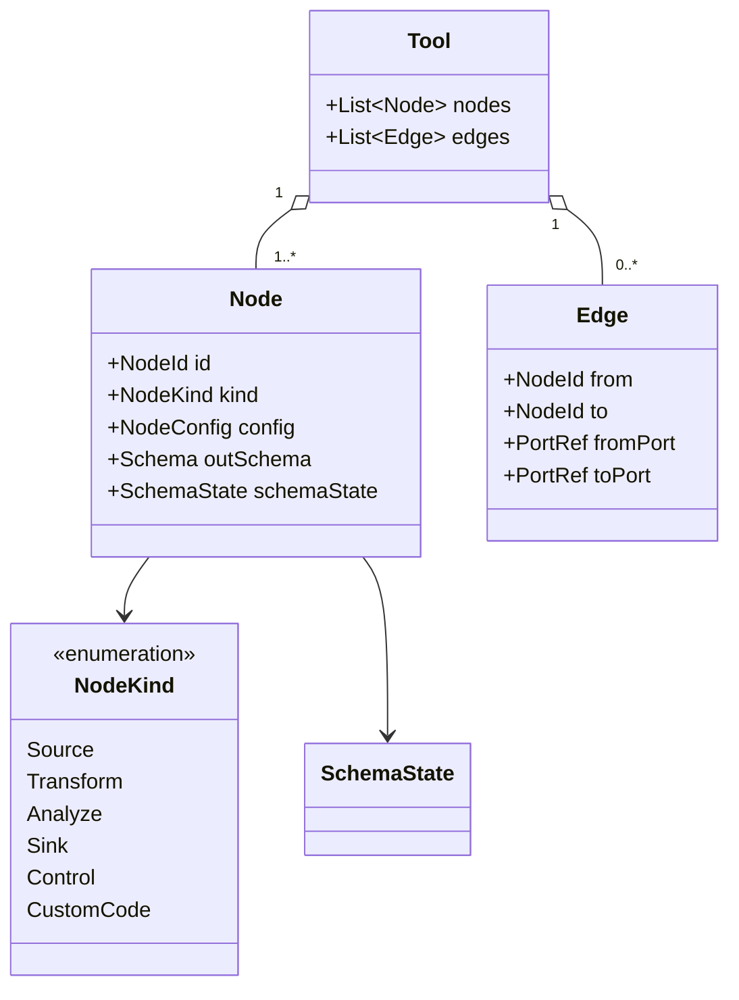
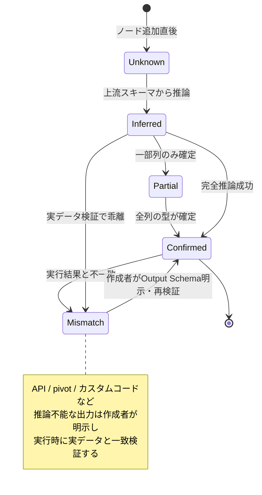
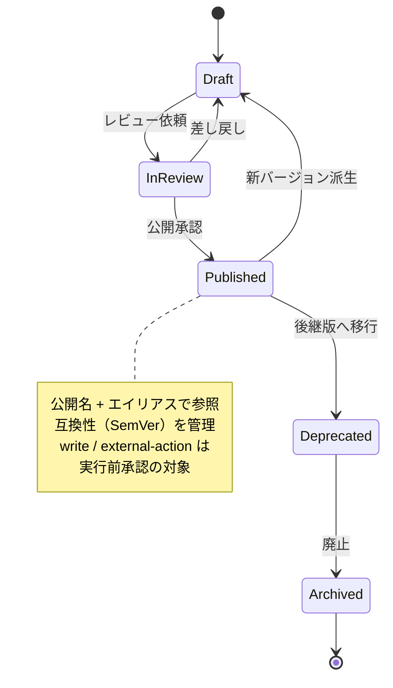
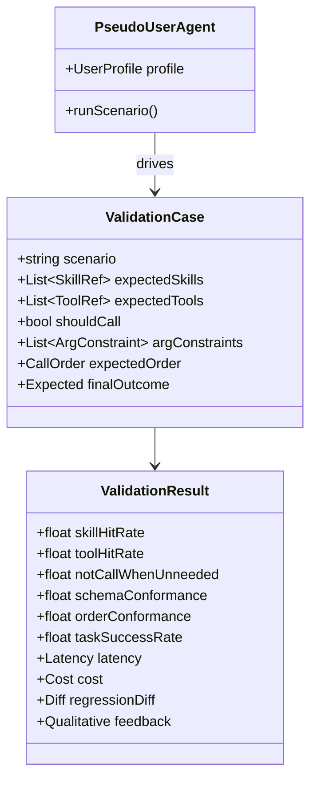

# 03. ドメインモデル

> 参照: [`ideas.md` 機能節](../ideas/ideas.md) / [`ideas-v2.md` §1〜§3](../ideas/ideas-v2.md)

ドメイン層は外部SDKに非依存（[01-architecture.md](./01-architecture.md)）。ここではエンティティ・値オブジェクト・状態遷移を定義する。

---

## 1. エンティティ関係（ER図）

---

## 2. 共通メタデータ（Tool / Skill / Agent 共通）

`ideas.md` は「内部識別子・表示名・公開名・バージョン・所有者・公開状態」の分離を要求する。複数人開発と公開名の衝突管理のため、これを共通値オブジェクト化する。

### 命名の分離ルール（`ideas.md`）
- **開発画面**: 内部識別子（`internalId`）・作業用名称（`workingName`）を扱う。
- **エージェントに見せる**: 公開名（`publishName`）のみ。
- **公開時**: エイリアス・名前衝突・互換性を管理する仕組みを持つ（[04-api-spec.md](./04-api-spec.md) の Publish API）。

### 列挙値の意味
- `SideEffect`: `ReadOnly`（副作用なし）/ `Write`（書き込み）/ `ExternalAction`（外部操作）。`Write`・`ExternalAction` は実行前承認の対象。
- `AgentKind`: `Normal`（通常）/ `PseudoUser`（ユーザープロファイル駆動の疑似ユーザー）/ `Evaluator`（評価用）。

---

## 3. Tool の内部構造（ノードフロー）

ノード分類の詳細は [06-etl-tool-builder.md](./06-etl-tool-builder.md) を参照。

---

## 4. スキーマ状態の遷移

`ideas-v2.md §1` は「確定 / 部分確定 / 推論 / 不明 / 実行結果と不一致」の5状態を区別することを要求する。これはスキーマ自動伝播とインライン検証の基盤。

- 型不一致は接続線を赤く表示（インライン検証）。
- `Mismatch` はスナップショットテストの差分検知にも使う。

---

## 5. 公開・バージョンのライフサイクル

- 公開状態の遷移は監査ログへ記録（[08-security-auth.md](./08-security-auth.md)）。
- `Published` への遷移は認可（`publish` アクション）の対象。

---

## 6. 検証（Validation）モデル

`ideas-v2.md §2, §11` に基づき、検証は「呼び出し率」だけでなく期待Skill/Tool・順序・引数・成否をケース単位で定義する。

検証指標の一覧は [09-roadmap.md](./09-roadmap.md#検証指標) を参照。
