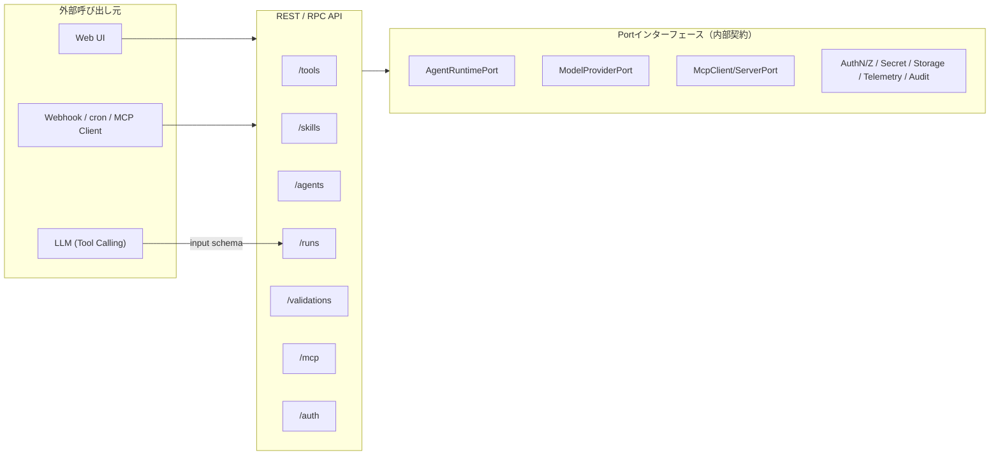
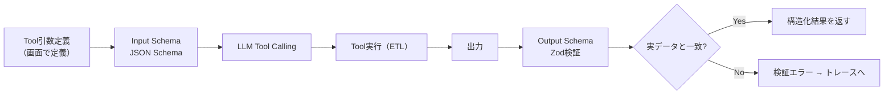

# 04. API仕様

> 参照: [01-architecture.md](./01-architecture.md)

APIは3層に分かれる。
1. **Portインターフェース** — アプリケーションが所有する外部SDK境界（内部契約）。
2. **REST/RPC API** — Web UIやWebhookからユースケースを駆動する外部API。
3. **Tool Callingスキーマ** — LLMがToolを呼ぶための引数スキーマ（Input/Output Schema）。

> 型記法はTypeScriptを想定（`ideas.md` のMastra前提）。`Result<T, E>` は成功/失敗を型で表す想定の値。

---

## 1. API表層マップ



---

## 2. Portインターフェース定義

外部SDKはこれらのPortを介してのみ利用する。SDK固有の型・例外・ストリームイベント・認証設定は内部共通型へ変換する。

### 2.1 実行・モデル系

```typescript
interface AgentRuntimePort {
  run(input: {
    agentRef: PublishRef;
    messages: Message[];
    context: MinimalContext;      // LLMへ渡すコンテキストは最小限
    mode: "preview" | "test" | "production";
  }): AsyncIterable<RuntimeEvent>; // ストリーミングは内部イベントへ正規化

  cancel(runId: RunId): Promise<void>;
}

interface HarnessRuntimePort {
  start(input: StartHarnessInput, signal?: AbortSignal): Promise<HarnessRunSnapshot>;
  resume(input: ResumeHarnessInput, signal?: AbortSignal): Promise<HarnessRunSnapshot>;
}

interface ModelProviderPort {
  // v1 Agent previewはTool Callingを含む正規化済みcompletionを返す。
  // token streamingは後続のAgentRuntimePort実装で共通RuntimeEventへ拡張する。
  complete(req: CompletionRequest, signal?: AbortSignal): Promise<ModelCompletion>;
  capabilities(): ModelCapability[]; // 未対応機能は暗黙フォールバックしない
}
```

`ModelProviderPort` のcapabilityは `chat` / `tool-calling` / `structured-output` / `vision` である。`vision` を持つproviderには、ユーザー入力をテキストpartと`image_url` partの配列として渡せる。LM Studio adapterは画像のデータURLをOpenAI互換の`image_url.url`へ変換する。埋め込みはRAG導入時に `embed` capabilityと要求型を追加する。

AgentにStructured Outputがある場合、completion requestへ`responseFormat: { name, strict, schema }`を指定する。LM Studio adapterはOpenAI互換`response_format.json_schema`へ変換し、最終contentはアプリケーション側でも再検証する。

### 2.2 MCP系

```typescript
interface McpClientPort {
  listTools(server: McpServerRef): Promise<ToolDescriptor[]>;
  callTool(server: McpServerRef, name: string, args: Json): Promise<Json>;
}

interface McpServerPort {
  publish(tool: ToolRef, exposeAs: PublishName): Promise<McpEndpoint>;
  unpublish(endpoint: McpEndpoint): Promise<void>;
  // 既定で未認証公開にしない
}
```

### 2.3 認証・認可・秘密（詳細は 08 参照）

```typescript
interface AuthenticationProvider {
  login(req: LoginRequest): Promise<Session>;
  logout(session: SessionRef): Promise<void>;
  handleCallback(cb: OidcCallback): Promise<Session>;
  verify(token: Token | SessionRef): Promise<Principal>;
}

interface AuthorizationProvider {
  // 権限未定義 or プロバイダー利用不能時は既定で拒否
  decide(input: {
    principal: Principal;
    resource: ResourceRef;   // workspace | connection | secret-ref | tool | skill | agent | workflow | deployment | audit-log
    action: Action;          // read | create | edit | execute | approve | publish | manage-access | delete
    context?: PolicyContext;
  }): Promise<Decision>;      // Allow | Deny(reason)
}

interface PrincipalMapper {
  toPrincipal(claims: IdpClaims): Principal; // subject/tenant/displayName/groups/claims/authenticationMethod
}

interface SecretProvider {
  resolve(ref: SecretReference): Promise<SecretValue>; // 実行時のみ取得
  register(ref: SecretReference, value: SecretValue): Promise<void>;
  // 管理者でも標準画面から秘密値そのものは読み出せない
}
```

### 2.4 永続化・観測・監査

```typescript
interface StoragePort {
  // すべての問い合わせに tenant/workspace 境界を適用
  save<T>(entity: T, scope: TenantScope): Promise<Id>;
  load<T>(id: Id, scope: TenantScope): Promise<T | null>;
  listVersions(ref: PublishRef, scope: TenantScope): Promise<Version[]>;
}

interface TelemetryPort {
  startSpan(name: string, attrs: Attrs): Span;
  metric(name: string, value: number, attrs: Attrs): void;
}

interface AuditSink {
  // 実行者・対象バージョン・入力参照・使用Tool・承認・結果・エラーを記録
  // 秘密情報・個人情報はマスキング
  record(event: AuditEvent): Promise<void>;
}
```

### 2.5 認証機能・UIのCapability拡張

```typescript
interface AuthFeatureProvider {
  supports(feature: AuthFeature): Capability; // registration/invite/emailVerify/passwordReset/mfa/socialLogin/sessionList ...
  execute(feature: AuthFeature, req: Json): Promise<Json>;
}

interface AuthUiExtension {
  routes(): UiRoute[];                 // login/register/account/session/member管理
  component(route: UiRoute): UiComponent;
}
```

> **契約テスト**: 各Portには契約テストを用意し、実SDKアダプターとFakeが同じ契約を満たすことを検証する（[01-architecture.md](./01-architecture.md#5-composition-root-と依存性注入)）。

---

## 3. REST / RPC API

Web UI・Webhookからユースケースを駆動する外部API。**すべてのエンドポイントでサーバー側の認可判定を行う**。

> 実装では、ルート → 必要権限の対応表を `src/api/authorization.ts` の `ROUTE_RULES` が1箇所で持ち、`onRequest` フックが全ルートへ機械的に適用する。下表は主要エンドポイントの抜粋で、**正本は `ROUTE_RULES`**（登録済みの全ルートが載っていることをテストが強制する）。ロールとアクションの対応は [08-security-auth.md §3.2](./08-security-auth.md#32-rbac-ロール--アクション初期実装)。

| メソッド | パス | ユースケース | 認可アクション |
|---|---|---|---|
| `POST` | `/tools` | Tool作成（ノードフロー） | `tool:create` |
| `GET` | `/tools` | workspace内のTool latest一覧 | `tool:read` |
| `PUT` | `/tools/{id}` | Toolフロー更新 | `tool:edit` |
| `POST` | `/tools/{id}/preview` | 固定サンプルでプレビュー実行 | `tool:execute` |
| `POST` | `/tools/{id}/infer-schema` | スキーマ伝播・推論 | `tool:edit` |
| `POST` | `/tool-drafts/diagnose` | 未保存Toolのプリフライト診断（`POST /tools` と同じbodyを受け、保存せずに検査。§3.1） | `tool:execute` |
| `POST` | `/tool-checks/run` | ツール検証: 保存済みToolを引数付きで単体実行し、期待との合否を返す（保存しない。§3.2） | `tool:execute` |
| `GET` | `/tool-checks/cases` | ツール検証ケースの一覧（`toolId` で絞り込み。新しい定義が先） | `tool:read` |
| `POST` | `/tool-checks/cases` | ツール検証ケースの保存（`id` 省略で新規、指定で上書き） | `tool:edit` |
| `DELETE` | `/tool-checks/cases/{id}` | ツール検証ケースの削除 | `tool:edit` |
| `POST` | `/tool-checks/cases/{id}/run` | 保存済みケースを実行し `lastResult` を更新 | `tool:execute` |
| `POST` | `/tool-checks/cases/run-all` | 全ケース（または `toolId` のケース）を逐次実行 | `tool:execute` |
| `POST` | `/tool-checks/suggest` | LLM による 正常 / 境界 / 異常 のケース案（保存しない。モデル未設定は 502。§3.2） | `tool:execute` |
| `GET` | `/runtime/capabilities` | UI の機能フラグ: `{ analysisAssistant: { enabled }, toolCheckSuggestions: { enabled }, judge: { configured, provider?, model? }, journal: { extraction: { enabled, vision }, hearing: { enabled } } }`（現在のモデル設定を毎回見る。`judge` は judge スロットが判定に使える状態か、`journal` は仕訳の LLM 抽出・ヒアリングの可否） | `workspace:read` |
| `GET` | `/journal/chart` | 科目マスタの取得（未保存なら標準セット。保存はしない。§3.4） | `workspace:read` |
| `PUT` | `/journal/chart` | 科目マスタの全体保存 | `workspace:edit` |
| `POST` | `/journal/chart/reset` | 科目マスタを標準セットへ戻す | `workspace:edit` |
| `GET` | `/journal/chart/export` | 科目 CSV の出力（`{ content }`） | `workspace:read` |
| `POST` | `/journal/chart/import` | 科目 CSV の取込（勘定科目の一覧だけを置き換え） | `workspace:edit` |
| `GET` | `/journal/rules` | 自動仕訳ルールの一覧（priority 降順） | `workspace:read` |
| `POST` | `/journal/rules` | ルールの保存（`id` 省略で新規、指定で上書き） | `workspace:edit` |
| `DELETE` | `/journal/rules/{id}` | ルールの削除 | `workspace:edit` |
| `POST` | `/journal/rules/test` | ルール草案を保存せずに文書群へ照合 | `workspace:read` |
| `GET` | `/journal/documents` | 文書一覧（**要約**。証憑本体を含まない。`status` / `kind` / `from` / `to` / `limit`） | `workspace:read` |
| `POST` | `/journal/documents` | 文書の作成（facts 直接 / JSON 貼付） | `workspace:edit` |
| `GET` | `/journal/documents/{id}` | 文書の取得（証憑本体つき） | `workspace:read` |
| `PUT` | `/journal/documents/{id}` | 文書の更新（facts が変われば未判定へ戻る） | `workspace:edit` |
| `DELETE` | `/journal/documents/{id}` | 文書の削除（下書きの仕訳も消す） | `workspace:edit` |
| `POST` | `/journal/documents/import-csv` | 銀行 / カード明細 CSV の取込（1 行 = 1 文書。読めない行は `skippedRows`） | `workspace:edit` |
| `POST` | `/journal/documents/judge` | Stage 1 判定（`documentIds` 省略で未判定の全件） | `workspace:edit` |
| `GET` | `/journal/csv-presets` | CSV プリセットの一覧（列名署名つき） | `workspace:read` |
| `GET` | `/journal/entries` | 仕訳一覧（`status` / `from` / `to` / `documentId`） | `workspace:read` |
| `POST` | `/journal/entries` | 仕訳の手入力（作成） | `workspace:edit` |
| `PUT` | `/journal/entries/{id}` | 仕訳の更新 | `workspace:edit` |
| `POST` | `/journal/entries/{id}/confirm` | 仕訳の確定（draft → confirmed） | `workspace:edit` |
| `DELETE` | `/journal/entries/{id}` | 仕訳の削除（紐づく文書は未判定へ戻る） | `workspace:edit` |
| `GET` | `/journal/export` | 仕訳 CSV の出力（`format` / `status` / `from` / `to` / `markExported`） | `workspace:read` |
| `POST` | `/journal/documents/extract` | 画像 / テキストから facts を LLM 抽出（**保存しない**。§3.4） | `workspace:edit` |
| `POST` | `/journal/hearings` | Stage 2 ヒアリングの開始（既に開いていればそれを返す） | `workspace:edit` |
| `GET` | `/journal/hearings` | ヒアリングの一覧（`documentId` で絞れる） | `workspace:read` |
| `GET` | `/journal/hearings/{id}` | ヒアリングの取得 | `workspace:read` |
| `POST` | `/journal/hearings/{id}/answers` | 回答 → 次の質問か提案 | `workspace:edit` |
| `POST` | `/journal/hearings/{id}/accept` | 提案の受け入れ（**選んだ id だけ**登録 → ルール保存 → 再判定） | `workspace:edit` |
| `POST` | `/journal/hearings/{id}/cancel` | ヒアリングの中止（文書は未判定へ戻る） | `workspace:edit` |
| `POST` | `/tools/{id}/publish` | 公開（エイリアス/互換性管理） | `tool:publish` |
| `POST` | `/tools/{id}/expose-mcp` | MCPサーバとして公開 | `deployment:publish` |
| `POST` | `/skills` | Skill作成 | `skill:create` |
| `GET` | `/skills` | workspace内のSkill latest一覧 | `skill:read` |
| `GET` | `/skills/{id}` | Skill取得（latest / version固定） | `skill:read` |
| `GET` | `/skills/{id}/versions` | Skill version一覧 | `skill:read` |
| `POST` | `/skill-drafts/generate-prompt` | 未保存Skillの責務・Toolメタからprompt草案生成 | `skill:edit` |
| `POST` | `/skills/{id}/generate-prompt` | 発火条件からプロンプト草案生成 | `skill:edit` |
| `POST` | `/agents` | Agent作成 | `agent:create` |
| `GET` | `/agents` | workspace内のAgent latest一覧 | `agent:read` |
| `GET` | `/agents/{id}` | Agent取得（latest / version固定） | `agent:read` |
| `GET` | `/agents/{id}/diagnostics` | Tool呼び出しのプリフライト診断（参照解決・function定義・スキーマ整合・データソース・ドライランの段階別検査。§3.1） | `agent:execute` |
| `GET` | `/agents/{id}/versions` | Agent version一覧 | `agent:read` |
| `POST` | `/agent-drafts/diagnose` | 未保存Agentのプリフライト診断（`POST /agents` と同じbodyを受け、保存せずに検査。§3.1） | `agent:execute` |
| `POST` | `/agent-drafts/generate-prompt` | 未保存AgentのToolメタからsystem prompt草案生成 | `agent:edit` |
| `POST` | `/agents/{id}/generate-prompt` | Skill/Toolメタからsystem prompt自動生成 | `agent:edit` |
| `POST` | `/agents/{id}/export` | Mastraコードへ一方向エクスポート | `agent:edit` |
| `POST` | `/runs` | Agent実行（chat / preview / test） | `agent:execute` |
| `GET` | `/runs` | workspace内のRun履歴一覧 | `agent:read` |
| `GET` | `/runs/{id}/trace` | 実行トレース取得 | `agent:read` |
| `POST` | `/validations` | 検証ケース定義 | `agent:edit` |
| `POST` | `/validations/{id}/run` | 疑似ユーザーで検証実行 | `agent:execute` |
| `GET` | `/validations/{id}/report` | 検証指標・定性評価取得 | `agent:read` |
| `POST` | `/connections` | 接続先登録（SecretReference参照） | `connection:create` |
| `GET` | `/operations/audit` | 監査ログの参照（誰が何をしたか） | `audit-log:read` |
| `GET`/`POST` | `/auth/*` | ログイン/コールバック/セッション | — |
| `POST` | `/webhooks/{trigger}` | Webhookトリガー（Phase3） | Service Principal |

### 3.1 プリフライト診断（diagnostics）

「作ったToolがAgentから呼び出せない」原因は複数の層に潜むが、実行時には最初に踏んだ1つしか見えない。診断は**実行経路と同じ判定関数**で各段階を個別に検査し、モデル呼び出し・副作用なしで一覧を返す（ドライランは設計時サンプル値で行う）。保存済みは `GET /agents/{id}/diagnostics`、未保存は `POST /agent-drafts/diagnose`（body は `POST /agents` と同じ）と `POST /tool-drafts/diagnose`（body は `POST /tools` と同じ）。draft の `version` は未保存の印として `0.0.0` で報告する。

```jsonc
// GET /agents/{id}/diagnostics ・ POST /agent-drafts/diagnose → { "diagnostics": AgentDiagnostics }
{
  "agent": { "internalId": "assistant", "version": "1.0.0" },
  "status": "error",                       // ok | warning | error（配下すべての最悪値）
  "checks": [ { "id": "skills", "status": "ok" }, { "id": "model", "status": "error", "detail": "configured model provider does not support tool-calling" } ],
  "tools": [ ToolDiagnostics ]
}
// POST /tool-drafts/diagnose → { "diagnostics": ToolDiagnostics }
{
  "internalId": "scores", "version": "0.0.0", "source": "direct", // skill経由なら "skill" + skillId
  "functionName": "filter_scores",         // function definition を組めた場合のみ
  "status": "error",
  "checks": [ { "id": "graph", "status": "error", "detail": "sel: unknown column: missing", "nodeId": "sel" } ]
}
```

`detail` は実行時エラーと同じ英文（UI側で日本語化する）。`nodeId` は失敗がグラフ内の特定ノード由来のとき（`graph` / `execution`）だけ付く。

| 対象 | check id | 意味（error になる条件 / warning になる条件） |
|---|---|---|
| Agent | `skills` | Skill参照が解決できない |
| Agent | `tool-versions` | 直付けとSkill由来で同一Toolの版が食い違う（実行時 ambiguous tool versions） |
| Agent | `sub-agents` | サブエージェント参照切れ / `ask_{publishName}` が既存Tool・サブエージェントと衝突 / `ask_` 名が function 名の形式（`^[A-Za-z0-9_-]{1,64}$`）でない |
| Agent | `function-names` | LLMへ公開する function 名の重複（後のToolへ永久に届かない） |
| Agent | `mcp-servers` | 参照MCPサーバーが未登録（error） / disabled で実行時にスキップされる（warning）。実行時は黙ってスキップするため診断でしか見えない |
| Agent | `model` | 設定中モデルが tool-calling（呼び出し可能物があり functionInvocation が有効なとき）/ structured output（`output` 指定時）を持たない、または設定を解決できない。モデル配線が無い環境では項目自体を出さない |
| Agent | `harness` | warning のみ: webSearch 有効だが検索プロバイダ未設定 / fileMemory 有効だが Wiki 参照が無い |
| Tool | `resolved` | 参照先の Tool version が存在しない（Agent診断のみ） |
| Tool | `state` | `archived`（Agentに付けるべきでない: error） / `deprecated`（今後 archived になり得る: warning） |
| Tool | `function-definition` | function definition を組めない（名前の形式・input列の重複） |
| Tool | `agent-input` | inputSchema に列があるのに agent-input ノードが無い / ノードの schema が inputSchema と一致しない（実行時 graphWithArguments と同一判定。保存時にも同じ規則で拒否する） |
| Tool | `data-sources` | データソース参照が解決できない |
| Tool | `graph` | 解決済みグラフのスキーマ伝播エラー・構造違反（`nodeId` は最初のエラーノード） |
| Tool | `execution` | 設計時サンプル値でのドライランがノード実行エラーになる（`nodeId` は投げたノード） |
| Tool | `output-schema` | 宣言 outputSchema が推論終端と不整合（実行後に落ちる。再保存で更新） |
| Tool | `operator-arguments` | opBinding の許可リストが空・既定演算子の不一致・引数型が string でない（error） / 引数が inputSchema に無く実行時に不活性（warning） |
| Tool | `side-effect` | warning のみ: 非 read-only は承認ゲートで停止する |

### 3.2 ツール検証（tool checks）

保存済み Tool を「Agent が渡すのと同じ引数」で**単体実行**し、出力・ノード別行数・所要時間を見せ、期待（行数 / 必須列 / セル値 / 所要時間上限）との合否を返す。引数の検証・グラフへの束縛・全行実行は Agent 経路と**同じ関数**（`validateToolArguments` → `graphWithArguments` → データソース解決 → `engine.preview`）を通すので、ここで通れば Agent から呼んでも同じ結果になる。出力ディスパッチャ（セッション成果物の書き込み）は呼ばず、`engine.preview` 内の sink ノードは表を通すだけなので、`write` の Tool も副作用なしに実行できる。

実行自体の失敗（引数不正 `TOOL_ARGUMENTS`・inputSchema と agent-input の不整合 `AGENT_RUN`・ノードの実行エラー `ETL_*`＋`nodeId`）は HTTP エラーではなく **200 で `status: "error"`** の結果になる（画面の仕事は「実行すると何が起きるか」を見せること）。Tool が存在しなければ 404 `TOOL_NOT_FOUND`。

```jsonc
// POST /tool-checks/run
{ "scope": {…}, "toolId": "sales", "version": "1.2.0",          // version 省略で最新版
  "arguments": { "region": "Tokyo", "minimum": 10 },              // JSON セル（string / number / boolean / null）のみ
  "expectations": {
    "rowCount": { "op": "gte", "value": 1 },                       // op: eq | gte | lte
    "columns": ["region", "amount"],
    "cells": [{ "column": "region", "op": "eq", "value": "Tokyo", "mode": "all" }], // op: eq | neq | gte | lte | contains、mode: any | all
    "maxDurationMs": 5000,
    "outcome": "success"                                          // success | error（省略可。後述）
  },
  "rowLimit": 100 }                                                    // 表示用スナップショットの行数（既定 100、0 で本文なし）
// → 200 { "result": ToolCheckRunResult }
{ "tool": { "internalId": "sales", "version": "1.2.0", "publishName": "sales_search" },
  "status": "failed",                                                 // passed | failed | error
  "assertions": [
    { "kind": "rowCount", "passed": true,  "expected": "row count >= 1", "actual": "row count 2" },
    { "kind": "column",   "passed": false, "expected": "column 'amount' exists", "actual": "columns: region, total" },
    { "kind": "cell",     "passed": true,  "expected": "every row has region == \"Tokyo\"", "actual": "2 of 2 rows match" },
    { "kind": "duration", "passed": true,  "expected": "duration <= 5000ms", "actual": "12ms" }
  ],
  "output": Table,                                                     // 先頭 rowLimit 行のスナップショット
  "rowCount": 2,                                                       // 全行数（期待の評価もこちら）
  "nodes": [{ "nodeId": "data", "rowCount": 3 }, { "nodeId": "filter", "rowCount": 2 }],
  "durationMs": 12, "checkedAt": "2026-09-12T09:00:00.000Z",
  "error": { "code": "TOOL_ARGUMENTS", "message": "…", "nodeId": "…" } }  // status = error のときだけ
```

`expected` / `actual` は英語の定型文で UI が正規表現で日本語化する（`row count <sym> <n>` / `column '<name>' exists` / `some row has <col> <sym> <json>` / `every row has …` / `<matched> of <total> rows match` / `column '<name>' not in output` / `duration <= <ms>ms` / `outcome success` / `outcome error (<code>)`）。セル比較は eq / neq が JSON 表現の一致（Date は ISO 文字列化）、gte / lte は数値同士だけ、contains は文字列化した部分一致。null セルは `eq null` にだけ一致する。

**結末の期待（`expectations.outcome`）** で異常系ケースを表現する。`"error"` は「引数不正・inputSchema の不整合・ノードエラーで**失敗すること**」自体を期待する: 実行が失敗すれば `status: "passed"`、assertions は `[{ kind: "outcome", passed: true, expected: "outcome error", actual: "outcome error (TOOL_ARGUMENTS)" }]` の 1 件だけ（他の期待は出力が無いので評価しない）、`error` は表示のために残る。失敗するはずが成功したら `status: "failed"` で結末の assertion（`actual: "outcome success"`）が不合格になり、残りの期待も評価して「実際に何が起きたか」を見せる。`"success"` を明示すると合格の結末 assertion が先頭に付き、実行が失敗したときは従来どおり `status: "error"` のまま不合格の結末 assertion（`actual: "outcome error (<code>)"`）を添える。省略時は従来どおり（結末の assertion は出ない）。要約は合格した異常系で `passed 1/1 (expected error: <message>)` になる。

ケース（`ToolCheckCase`）は `{ id, toolId, toolVersion?, name, arguments, expectations, lastResult?, createdAt, updatedAt }`。版を持たず `id` で上書きし、上書きでは `createdAt` と `lastResult` を引き継ぐ。`lastResult` は `{ status, checkedAt, toolVersion, summary }` の要約だけ（`passed 3/3` / `failed 1/3: row count == 3 → row count 5` / `error: <message>`）で、実行（`/cases/{id}/run`・`/cases/run-all`）のたびに更新される。一括実行は一覧順に逐次実行し、1件が error でも止まらない。版を固定したケースの Tool が削除されていても 404 にせず `status: "error"`（`TOOL_NOT_FOUND`）の結果として返す。ケース定義の不変条件違反は 400 `TOOL_CHECK_VALIDATION`、未知のケースは 404 `TOOL_CHECK_NOT_FOUND`。

#### ケース案の生成（`POST /tool-checks/suggest`）

保存済み Tool の公開契約（inputSchema・`agentTool` の名前と説明・outputSchema）、グラフの要約（ノード id / type と、filter 条件が Agent 引数を束縛している箇所）、agent-input ノードの設計時サンプルでの 1 回の実行結果（出力列・先頭 5 行・全行数）を文脈としてモデルへ渡し、カテゴリ（`normal` / `boundary` / `abnormal`）ごとに `perCategory` 件のケース案を JSON（structured output、temperature 0）で返させる。**保存はしない**（利用者がレビューして `/tool-checks/run` で試し、`/tool-checks/cases` へ保存する）。分析アシスタントと同じ有効判定・同じモデル（main スロット）を使い、`GET /runtime/capabilities` の `toolCheckSuggestions.enabled` で UI に有無を伝える。

```jsonc
// POST /tool-checks/suggest
{ "scope": {…}, "toolId": "sales", "version": "1.2.0",   // version 省略で最新版
  "perCategory": 2,                                        // 1〜5、省略時 2（範囲外は 400）
  "focus": "価格の境界を重点的に" }                          // 任意・500 文字まで
// → 200 { "suggestions": ToolCheckSuggestions }
{ "tool": { "internalId": "sales", "version": "1.2.0", "publishName": "sales_search" },
  "suggestions": [
    { "category": "normal", "name": "Tokyo rows", "rationale": "…",
      "arguments": { "region": "Tokyo", "minimum": 0 }, "expectations": { "rowCount": { "op": "gte", "value": 1 } },
      "warnings": ["argument 'minimum' was \"0\" (string); converted to number 0"] },
    { "category": "abnormal", "name": "missing region", "rationale": "…",
      "arguments": { "minimum": 0 }, "expectations": { "outcome": "error" }, "warnings": [] }
  ],
  "model": { "provider": "lm-studio", "model": "…" },        // 分かるときだけ
  "warnings": ["model returned 4 normal cases; kept the first 2"] }
```

モデルの出力は信用せず、サーバーで検証・修復する（落とした・直した点は各案の `warnings`、全体の注意は応答の `warnings`）: 未知のカテゴリは捨てる。カテゴリごとの超過分は切り詰める。名前は空・120 文字超なら `<category> case N` に置き換える。引数は inputSchema に無いキーを落とす（**異常系で `outcome: "error"` のときだけ未宣言キーを 1 つ残す**＝それが検証の狙い）、曖昧でない型違いは列の型へ寄せる（`"12"` → `12`、`"true"` → `true`、`12` → `"12"`）、nullable でない列への `null` は正常・境界では落とす（異常系では残す）。期待は保存時と同じドメイン検証をキーごとに通し、不正なものだけ落とす。`cells[].column` は出力列（宣言 outputSchema、無ければサンプル実行の列）に無ければ落とす。サンプル実行が失敗しても提案は続け、`warnings` に `sample run failed (…)` を残す。

エラー: Tool が無ければ 404 `TOOL_NOT_FOUND`。モデル未設定・structured output 非対応は 502 `MODEL_PROVIDER`（`tool check suggestions are not configured`）、JSON でない／形の違う応答は `tool check suggestions returned invalid JSON`、使えるケースが 0 件なら `tool check suggestions returned no usable case`（いずれも 502）。

### 3.3 評価: 実験と Judge ルーブリック（experiments / judge rubrics）

LLM-as-Judge の採点は **基準別**（[ADR-0037](./adr/0037-criterion-level-judging.md)）。判定者はルーブリックの基準ごとに「理由 → 段階スコア」を返し、サーバーが重み付きで合成する。実装は `src/adapters/evaluation/structured-judge-evaluator.ts`、使い方の解説は [11-scenario-validation.md §9](./11-scenario-validation.md#9-llm-判定基準別採点判定契約自己一貫性)。

| メソッド | パス | ユースケース | 認可アクション |
|---|---|---|---|
| `POST` | `/judge-rubrics` | ルーブリック保存（版は自動採番） | `evaluation:create` |
| `GET` | `/judge-rubrics` / `/judge-rubrics/{id}` / `/judge-rubrics/{id}/versions` | 一覧 / 取得（`version` 省略で最新）/ 版一覧 | `evaluation:read` |
| `POST` | `/experiments` | 実験の起票（202。worker が非同期に実行） | `evaluation:execute` |
| `GET` | `/experiments` / `/experiments/{id}` / `/experiments/{id}/results` | 一覧 / 取得 / 事例ごとの結果 | `evaluation:read` |

```jsonc
// POST /judge-rubrics
{ "scope": {…}, "internalId": "quality", "workingName": "…", "displayName": "…", "publishName": "quality", "owner": "…",
  "instructions": "Judge factual correctness against the reference.",
  "criteria": [{ "id": "accuracy", "label": "Accuracy", "description": "…", "weight": 2,
                 "levels": [{ "score": 0, "label": "Wrong", "description": "…" }, { "score": 0.5, "label": "Partial", "description": "…" }, { "score": 1, "label": "Correct", "description": "…" }] }],
  "referencePolicy": "required",          // optional | required | forbidden: 参照解答を渡すか
  "tracePolicy": "optional" }             // optional | required | forbidden: ツール呼び出し列と会話履歴を渡すか（省略時 optional）
// POST /experiments
{ "scope": {…}, "target": { "agentId": "agent", "version": "1.2.0" }, "dataset": { "id": "set", "version": "1.0.0" }, "evaluatorProfile": { "id": "profile", "version": "1.0.0" },
  "repetitions": 1,                       // 1〜10
  "judgeSamples": 3 }                     // 1〜5（省略時 1）。2 以上で判定を独立に複数回行い中央値とばらつきを記録する
// → 202 { "experiment": { …, "repetitions": 1, "judgeSamples": 3, "status": "queued", … } }
```

`tracePolicy` と `judgeSamples` は後付けの項目で、保存済みのルーブリック・実験は `optional` / `1` として読める。範囲外（`judgeSamples` 0 や 6、未知の `tracePolicy`）は 400。

**判定レコード（`GET /experiments/{id}/results` の `judgeEvaluations[]`）**

```jsonc
{ "scorer": "llm-as-judge", "metricId": "judge", "rubric": { "id": "quality", "version": "1.0.0" }, "required": true,
  "model": { "provider": "…", "model": "…", "modelConfigHash": "…" },
  "status": "succeeded",
  "score": 0.667,                                                    // 重み付き合成 Σ(weight×score)/Σ(weight)。判定不能（null）の基準は分母から外す。judgeSamples>1 なら各サンプルの合成の中央値
  "reason": "…",                                                     // 全体の理由（judgeSamples>1 なら中央値に最も近いサンプルのもの）
  "criteria": [{ "id": "accuracy", "score": 1, "reason": "…" },      // 基準別。score は基準の levels のいずれか、null = 判定不能（理由は必須）
                { "id": "tone", "score": null, "reason": "…" }],
  "samples": 3,                                                      // 実際に判定を得られたサンプル数（失敗したサンプルは数えない）
  "dispersion": { "min": 0.5, "max": 0.833, "stddev": 0.136 },       // サンプル合成スコアの範囲と母標準偏差（samples=1 なら min=max=score, stddev 0）
  "uncertain": true,                                                 // max − min ≥ 0.25 のとき true。UI は「判定が割れている」と示す
  "usage": { "promptTokens": 1830, "completionTokens": 240, "totalTokens": 2070 },   // 修復呼び出し・全サンプル分の合計（provider が返した分だけ）
  "contract": { "promptHash": "9f1c0b2a7d3e4f56", "rubricId": "quality", "rubricVersion": "1.0.0" } }   // 判定契約の指紋（後述）
```

- **派生指標**: 事例の `scores[]` には合成スコアが `metricId` で、基準別スコアが **`"<metricId>:<criterionId>"`**（例 `judge:accuracy`）で並ぶ（null の基準は出さない）。実験比較（`/experiments/compare`）や品質ゲートの `metric-threshold` / `max-regression` はこの名前で基準ごとに拾える。
- **判定契約**: `contract.promptHash` はシステムプロンプトの版マーカー + ルーブリック JSON（id・版・文面・基準）+ 応答スキーマの sha256 先頭 16 hex。判定者側のプロンプト更新やルーブリック改版は指紋の変化として結果に残り、スコアのドリフトを説明できる。
- **判定者が見るもの**: `input` / `output` / `reference`（`referencePolicy` に従う）に加え、`tracePolicy` が `forbidden` でなければ turn 事例では Run の `tool-call` / `tool-result`（引数と出力プレビュー先頭 10 行の JSON、上限 20 件・各 2,000 文字）、scenario 事例では最終応答を除く会話履歴（上限 20 件・各 2,000 文字）を **untrusted data ブロックの中に** 渡す。scenario 事例には軌跡が無いため、`tracePolicy: "required"` のルーブリックを scenario 事例に使うと判定は `JUDGE_INPUT` で失敗する。
- **修復 1 回**: 判定者の出力がスキーマ・基準 id・段階に合わないときは、違反内容を添えて **1 回だけ** 修正を求める。それでも合わなければ `JUDGE_SCHEMA`。

**判定の失敗コード（`status: "failed"` の `error.code`）** — 判定の失敗は事例の失敗にはせず、その指標のスコアを欠損（`scores[]` に出さない）として記録する。

| code | 意味 |
|---|---|
| `JUDGE_INPUT` | 入力が契約を満たさない: ルーブリックが見つからない、`referencePolicy: required` で参照解答が無い、`tracePolicy: required` で軌跡が無い、`judgeSamples` が範囲外 |
| `JUDGE_PROVIDER` | judge スロットのモデルが未設定・structured output 非対応・呼び出し失敗（一時障害の再試行は実験側） |
| `JUDGE_SCHEMA` | 出力が応答契約に合わず、修復 1 回でも直らなかった |
| `JUDGE_UNASSESSABLE` | 判定者が全基準を `null`（判定不能）にした。合成スコアを出せないので失敗として記録する |

**起票時の判定ガード（`POST /experiments` の 409）** — 走らせれば必ず全事例が判定失敗になる組み合わせは実験を作らない。

| code | 意味 | 本文 |
|---|---|---|
| `JUDGE_MODEL_NOT_CONFIGURED` | プロファイルに judge 指標があるが judge スロットにモデルが無い。設定画面で judge を保存すると直る | `{ error: { code, message } }` |
| `JUDGE_TRACE_UNAVAILABLE` | `tracePolicy: required` のルーブリックを scenario 事例を含むデータセットに使った。ルーブリックの `tracePolicy` を `optional` にすると直る | `{ error: { code, message, rubric: { id, version } } }` |

### 3.4 仕訳（journal）

伝票・帳票を取り込み、**2 段階判定**（① 既存ルールで決定的に仕訳できるか / ② できなければヒアリングでルール化）で仕訳を起こし、汎用 CSV へ出す（[docs/20-journal.md](./20-journal.md) / [ADR-0038](./adr/0038-journal-two-stage-judgment.md)）。LLM 抽出（`/journal/documents/extract`）と Stage 2 ヒアリング（`/journal/hearings*`）も登録済み。画面は `GET /runtime/capabilities` の `journal`（`extraction: { enabled, vision }` / `hearing: { enabled }`）を見て、モデルが無い環境では導線を出さない。

応答の文書 / ルール / 仕訳は永続化用の形から `tenant` を除いたもの（スコープは Principal 由来なので返さない）。すべて `{ chart } / { rules } / { rule } / { documents } / { document } / { entries } / { entry } / { presets } / { content } / { result }` のいずれかで包み、削除は 204。

#### 科目マスタ（`/journal/chart`）

**勘定科目・税区分・補助軸はコードに持たず、ワークスペースのデータとして持つ**（ADR-0038）。保存したことが無いワークスペースは `GET` で標準セットを返すが**保存はしない**（参照が書き込みを起こすと、読み取り権限しか無い利用者が失敗し、標準セットの改善が焼き付く）。

```jsonc
// GET /journal/chart?tenantId&workspaceId → 200 { chart }
{ "accounts": [{ "id": "expense.supplies", "name": "消耗品費", "category": "expense", "defaultTaxCode": "JP-IN-10-S", "aliases": ["消耗品", "事務用品"], "enabled": true, "sortOrder": 140 }],
  "dimensions": [{ "id": "sub_account", "name": "補助科目", "values": [] }, { "id": "department", "name": "部門", "values": [] }],
  "taxCategories": [{ "code": "JP-IN-10-S", "name": "課税仕入 10%", "side": "in", "rate": 10, "enabled": true, "mapping": { "yayoi": "課対仕入込10%" } }],
  "updatedAt": "2026-09-13T00:00:00.000Z" }
// PUT /journal/chart  { scope, accounts, dimensions, taxCategories } → 200 { chart }（全体を置き換え）
// POST /journal/chart/reset  { scope } → 200 { chart }（標準セットを保存して返す）
```

科目 CSV は `id,code,name,category,defaultTaxCode,aliases,enabled`（`aliases` は `;` 区切り、`enabled` は `true|false`、BOM 付き CRLF）。**取込は勘定科目の一覧だけを置き換え、税区分と補助軸は既存のものを残す**（科目 CSV に税区分の定義が無いため、全体上書きと解釈すると既存のルールと仕訳が一斉に壊れる）。行の不正は 400 `JOURNAL_DOMAIN` で、メッセージに**行番号（1 始まり・ヘッダ込み）**を含める。

削除は論理削除（`enabled: false`）。ルールと仕訳は科目を **id** で参照するので改名に追従し、仕訳の各行は確定時の科目名も写して持つ（過去の仕訳は当時の名前のまま）。

#### ルール（`/journal/rules`）

```jsonc
// POST /journal/rules  { scope, rule } → 200 { rule }
{ "scope": {…},
  "rule": { "id": "…",                       // 省略で新規。更新は createdAt を保つ（優先順が入れ替わらない）
    "name": "Amazon は消耗品費", "enabled": true, "mode": "auto", "priority": 100,
    "scope": { "documentKinds": ["card_statement"], "direction": "out", "accountHints": ["楽天カード"] },
    "conditions": [{ "field": "descriptionNorm", "op": "contains", "value": "アマゾン" }],
    "outcome": { "lines": [
        { "side": "debit",  "accountId": "expense.supplies", "taxCode": "JP-IN-10-S", "amount": "total", "partnerFrom": "issuerName" },
        { "side": "credit", "accountId": "liability.other_payables", "taxCode": "JP-NA", "amount": "total" }],
      "descriptionTemplate": "{issuerName} {description}", "invoiceStatus": "auto" },
    "askIf": [{ "conditions": [{ "field": "grandTotal", "op": "gte", "value": 100000 }], "questionId": "fixed_asset_check", "prompt": "固定資産の確認" }],
    "requiredFacts": ["grandTotal"] } }
```

`op` は `equals | contains | startsWith | endsWith | regex | between | gte | lte | in | exists | notExists | isTrue | isFalse`。`amount` は `total | taxable:10 | taxable:8 | tax:10 | tax:8 | remainder | { fixed } | { ratio }`。保存時に **outcome が参照する科目 id と税区分コードが現在のマスタにあり有効か**を確かめ、無ければ 400 `JOURNAL_DOMAIN`（ここで弾かないと、保存は通るのに判定のたびに `unknown-account` で止まるルールが溜まる）。

`POST /journal/rules/test` は草案 × 文書 id の一覧を受け、**保存せずに**判定と同じ関数で照合する（`{ result: [{ documentId, matched, specificity?, entry?, reasons? }] }`）。見つからない文書 id は結果に現れない。

#### 文書（`/journal/documents`）

一覧は**要約**を返す（`sourceType` / `fileName` / `transactionDate` / `issuerName` / `grandTotal` / `judgment` など）。証憑本体（画像 data URL・原文テキスト・CSV 1 行の生値）は含まれないので、一覧の応答が数 MiB になることはない。本体は `GET /journal/documents/{id}` で 1 件ずつ読む。`source.dataUrl` と `source.text` は 1 件 8 MiB が上限。

保存時に facts を正規化する（`descriptionNorm` を作り直し、`registrationNumber` を `T` + 13 桁へ寄せ、`counterpartyHint` を摘要から切り出す）。**facts が変わった更新は `judgment` と `entryId` を落として `extracted`（未判定）へ戻す** — 帳票を直したのに古い判定結果と仕訳が残ると、画面には「確定済み」と出るのに中身が食い違う。facts が同じなら状態は保つ。

`DELETE` は紐づく仕訳が **`draft` のときだけ**一緒に消す（判定が作った下書きは元の証憑が消えれば残す意味が無い）。`confirmed` / `exported` の仕訳は会計上の記録なので残す。

#### CSV 取込（`POST /journal/documents/import-csv`）

```jsonc
{ "scope": {…}, "content": "日付,摘要,出金,入金,残高\r\n…",  // 5 MiB まで
  "preset": "rakuten-bank",        // 省略時は columnMapping →列名署名の自動判定の順
  "columnMapping": { "date": "取引日", "description": "摘要", "amount": "入出金" },
  "fileName": "202609.csv", "accountHint": "楽天銀行" }
// → 200 { result }
{ "preset": "rakuten-bank", "imported": [ JournalDocumentSummary ],
  "skippedRows": [{ "row": 12, "reason": "CSV row 12: date is missing or unreadable" }],
  "warnings": ["detected preset: rakuten-bank", "skipped 1 of 40 rows"] }
```

**1 行の失敗で取込全体を捨てない**。明細 CSV には合計行・注記行が混ざるので、読めなかった行は `skippedRows`（行番号 + 理由）へ積み、残りを保存する。行番号は**ヘッダ行を 1 とした 1 始まり**（表計算ソフトの行番号と一致する）。全列が空白の行は黙って捨てる。プリセットが決まらない（列名がどれにも一致せず列マッピングも無い）ときだけ、行の問題ではなく取込全体の前提の問題として 400 `JOURNAL_CSV_IMPORT`（`row` なし）で断る。引用符の閉じ忘れは `row` つきで返る。

`GET /journal/csv-presets` は `{ presets: [{ id, name, description, headerSignature, kind }] }`（楽天銀行・MUFG・SMBC・ゆうちょ・楽天カード・汎用）。

#### 判定（`POST /journal/documents/judge`）

`{ scope, documentIds? }` → `{ result: { judged: [JournalDocumentSummary], decided, undecided, skipped } }`。`documentIds` 省略時は状態が `extracted` / `undecided` の全件。判定は純粋関数（`judgeDocument`）で、確定できないことは**エラーではなく結果**として返る。

```jsonc
"judgment": { "stage": "undecided", "judgedAt": "…", "candidates": [{ "ruleId": "…", "ruleName": "…", "mode": "suggest", "priority": 100, "specificity": 4 }],
  "reasons": [{ "code": "multiple-rules", "ruleIds": ["r1", "r2"] }] }
```

理由コードは `no-rule` / `multiple-rules` / `missing-fact` / `ask-if` / `rule-suggest-mode` / `unknown-account` / `unbalanced`。UI はこれを「原因 → 次の一手 → 修正場所へのボタン」に写す。

**確定済みの仕訳は再判定で上書きしない**。`confirmed` / `exported` の仕訳が紐づく文書は判定結果だけを更新し、仕訳には触れない（利用者が確認・修正した内容を黙って消さない）。`exported` の文書は判定の対象外（明示指定でも飛ばす）。

#### 仕訳と出力（`/journal/entries`・`/journal/export`）

仕訳は借方合計 = 貸方合計を不変条件に持ち、状態は `draft` → `confirmed` → `exported`。保存時に**各行の科目名をマスタから写し直す**（クライアントの申告を採らない。id と名前が食い違う行は CSV の中身を壊す）。マスタに無い / 無効な科目は 400 `JOURNAL_DOMAIN`。`DELETE` は紐づく文書を `extracted` へ戻す（参照切れの `entryId` を残さない）。

```jsonc
// GET /journal/export?format=generic&status=confirmed&from&to&markExported=true → 200 { result }
{ "format": "generic", "fileName": "journal-2026-09-13.csv", "content": "entry_id,line_no,…", "entryCount": 12 }
```

汎用 CSV は 25 列・UTF-8 BOM・CRLF・`YYYY/MM/DD`・税込整数（列は docs/20 §8）。単純仕訳（借方 1 行 × 貸方 1 行）は 1 行に両側を出し、複合仕訳は行ごとに片側だけを出して同じ `entry_id` で束ねる。`markExported=true` は出力した仕訳を `exported` にする（既定 off。中身を確かめるだけのダウンロードで状態を動かさない）。弥生 / freee / MF は列写像を `src/application/journal/export-presets.ts` にデータとして置いてあるだけで**変換はまだ無く、`generic` 以外は 400 `JOURNAL_EXPORT`**（空の CSV を返して会計ソフトの取込画面で初めて失敗させない）。

#### 帳票の LLM 読取（`POST /journal/documents/extract`）

```jsonc
{ "scope": {…}, "images": ["data:image/jpeg;base64,…"],  // 最大 4 枚・1 枚 4,200,000 文字。SVG と外部 URL は不可
  "text": "メール本文…",                                   // 最大 100,000 文字。画像とテキストはどちらか一方でよい
  "fileName": "receipt.jpg", "hintKind": "simplified_invoice" }
// → 200 { result }
{ "kind": "simplified_invoice",
  "facts": { "issuerName": "サンプルマート 霞が関店", "transactionDate": "2026-08-31", "issueDate": "2026-09-05", "grandTotal": 1230, … },
  "extraction": { "method": "llm", "model": { "provider": "…", "model": "…" }, "confidence": 0.82,
    "warnings": ["税率別の内訳の合計（1430 円）が総額（1230 円）と 200 円ずれている…"],
    "fieldEvidence": { "grandTotal": { "sourceText": "合計 ¥1,230", "confidence": 0.9 } } } }
```

**保存しない**（利用者が確認・修正してから `POST /journal/documents`）。読み取った値はサーバー側で正規化し（和暦 → ISO、全角・カンマ → 整数、登録番号 → `T` + 13 桁）、通らない項目は落として理由を `extraction.warnings` に残す。抽出後の整合チェック（税率別合計 vs 総額 ±税率行数、明細合計 vs 総額、単価 × 数量、お預り − お釣、8% 行の軽減記号、請求書なのに登録番号が無い）も同じ `warnings` に積む。**値を勝手に補正はしない**（帳簿の数字を推測で書き換えない）。UI は warnings を一覧で見せ、`fieldEvidence` の信頼度が低い項目を強調する。

モデルが 1 枚 20〜230 秒かかることがあるので、クライアント切断で処理ごと中断する（`clientAbortSignal`）。

#### ヒアリング（Stage 2。`/journal/hearings`）

```jsonc
// POST /journal/hearings  { scope, documentId } → 200 { hearing }
// 文書は undecided か hearing であること。既に開いているセッションがあればそれを返す（二重に作らない）。
{ "id": "…", "documentId": "…", "status": "open",
  "turns": [{ "role": "assistant", "question": { "id": "meal_purpose", "text": "誰と・何の目的の飲食でしたか？",
    "kind": "single", "options": [{ "value": "internal-meeting", "label": "社内打合せ" }], "factPath": "extra.purpose", "catalogId": "meal_purpose" }, "at": "…" }],
  "createdAt": "…", "updatedAt": "…" }

// POST /journal/hearings/{id}/answers  { scope, answers: [{ questionId, value }] } → 200 { hearing, warnings }
// 回答は question.factPath（`extra.<key>` のみ）へ書き戻す。次の質問か proposal が付く。
// POST /journal/hearings/{id}/accept  { scope, registerAccountIds?, registerDimensionValueIds?, registerTaxCodes?, rule?, entry? }
//   → 200 { hearing, rule, entry?, chart }
// POST /journal/hearings/{id}/cancel  { scope } → 200 { hearing }（文書は undecided へ戻る）
```

一度に聞くのは最大 3 問、1 セッションの発話は 60 件まで（超えたら打ち切ってセッションを閉じ、文書を未判定へ戻す）。聞いていない `questionId` への回答と、`extra.` 以外への書き戻しは 400 `JOURNAL_DOMAIN`。

**提案は検証を通ったものだけ保存する**: 科目 id・税区分コード・補助軸の値がマスタか同じ提案の `newAccounts` などにあること、仕訳の貸借が一致すること、ルールがドメインの検証（条件の演算子・金額指定・置換子）を通ること、条件の `field` が facts のパスであること。壊れていれば 1 回だけ修復を求め、それでも駄目なら**提案の無いセッション**として保存し、理由を `warnings` と assistant の発話で返す（壊れた提案を保存すると「登録」を押せてしまう）。

`accept` が科目マスタへ書き込むのは **`register*` に明示された id だけ**で、提案に無い id を指定すると 400。モデルが科目体系を勝手に増やす経路は存在しない。受け入れ後はルールを `provenance: { origin: 'hearing', hearingId, exampleDocumentIds }` で保存し、対象文書を再判定する（当たれば `decided` + 仕訳の下書き）。

#### エラー

| 例外 | status | code |
|---|---|---|
| `JournalDocumentNotFoundError` ほか参照切れ | 404 | `JOURNAL_DOCUMENT_NOT_FOUND` / `JOURNAL_RULE_NOT_FOUND` / `JOURNAL_ENTRY_NOT_FOUND` / `JOURNAL_HEARING_NOT_FOUND` |
| `JournalExtractionUnavailableError`（モデル未設定 / structured output・vision 非対応） | 409 | `JOURNAL_EXTRACTION_UNAVAILABLE`（設定画面で直せる） |
| `JournalExtractionSchemaError`（修復後もスキーマ違反） | 502 | `JOURNAL_EXTRACTION_SCHEMA` |
| `JournalDomainError`（不変条件違反） | 400 | `JOURNAL_DOMAIN` |
| `JournalCsvImportError` | 400 | `JOURNAL_CSV_IMPORT`（**本文に `row`**。行が特定できるときだけ） |
| `JournalExportError` | 400 | `JOURNAL_EXPORT` |

### プロンプト自動生成（目玉機能）のリクエスト/レスポンス例

```jsonc
// POST /agents/{id}/generate-prompt
// request
{
  "skills": ["skill:rag-qa@1.2.0"],
  "tools":  ["tool:search-docs@2.0.0"],
  "regenerate": ["skill-description", "tool-usage-guide"]
}
// response — 生成物は必ず人がレビュー・編集できる（エスケープハッチ）
{
  "systemPromptDraft": "あなたは... （自動生成）",
  "sections": {
    "skillDescription": "...",
    "toolUsageGuide": "..."
  },
  "editable": true,
  "sources": ["skill:rag-qa の責務・発火条件", "tool:search-docs の入出力"]
}
```

保存済みAgent実行では、system promptとTool候補をAgent versionから解決する。
v1の実行上限はTool call 4回、model round 5回であり、実際の呼び出し順はRun traceと`tools`へ保存する。

複数Agentの制御フローは`/harnesses`と`/harness-runs`で分離する。Harnessはpattern別の型付き定義を保存し、Handoffの追加入力やMagenticの計画承認は`POST /harness-runs/:runId/responses`の型付きrequest/responseで再開する。完全な契約は [14-agent-harness-builder.md §9](./14-agent-harness-builder.md#9-rest-api) を参照。

```jsonc
// POST /runs
{
  "scope": { "tenantId": "local", "workspaceId": "default" },
  "agent": { "internalId": "assistant-agent", "version": "1.0.0" },
  "message": "Aliceのスコアを確認して",
  "mode": "preview"
}
```

---

## 4. Tool Callingスキーマ（Input / Output）

`ideas-v2.md §1` の I/O契約化。引数スキーマ = Input Schema、出力スキーマ = Output Schema。



### Input Schema 例（LLMへ提示）

```json
{
  "name": "sales_summary",
  "description": "月次売上サマリを返す。read-only。",
  "input_schema": {
    "type": "object",
    "properties": {
      "month":  { "type": "string", "pattern": "^\\d{4}-\\d{2}$" },
      "region": { "type": "string", "enum": ["east", "west", "all"] }
    },
    "required": ["month"]
  },
  "x-side-effect": "read-only"
}
```

### Output Schema 例（アプリ側で検証）

```json
{
  "type": "object",
  "properties": {
    "rows": {
      "type": "array",
      "items": {
        "type": "object",
        "properties": {
          "region": { "type": "string" },
          "total":  { "type": "number" }
        },
        "required": ["region", "total"]
      }
    },
    "chart": { "$ref": "#/definitions/ChartJsData" }
  },
  "required": ["rows"]
}
```

- 出力を推論できない（API / pivot / カスタムコード）場合は作成者が Output Schema を明示し、実行時に実データと一致検証する。
- `x-side-effect` により `write` / `external-action` は実行前承認の対象（[08-security-auth.md](./08-security-auth.md)）。

---

## 5. API横断の規約

- **エラー**: SDK固有例外はAdapterで内部エラー型へ変換して返す（`ideas-v2.md §8`）。
- **テナント境界**: すべての永続API呼び出しに `tenant/workspace` スコープを適用。
- **実行モード**: `preview / test / production` を明示し、使用データと権限を分離。
- **冪等性**: `write` を伴う操作は冪等キーを推奨（`ideas-v2.md §1` 副作用宣言と対応）。
- **監査**: すべての実行・承認・公開・認可拒否を `AuditSink` へ記録。