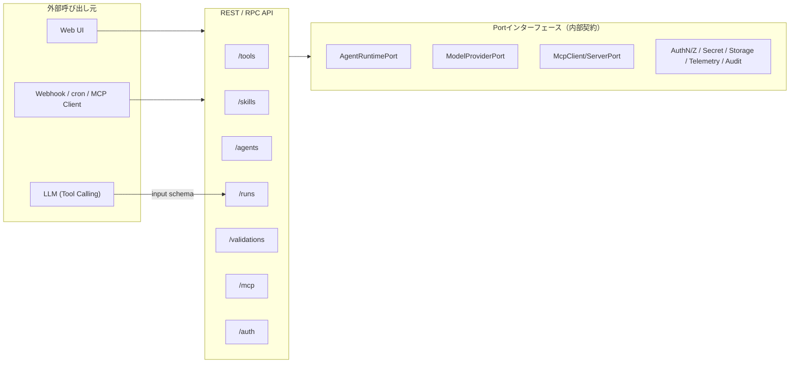
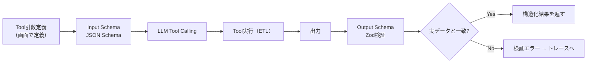

# 04. API仕様

> 参照: [01-architecture.md](./01-architecture.md)

APIは3層に分かれる。
1. **Portインターフェース** — アプリケーションが所有する外部SDK境界（内部契約）。
2. **REST/RPC API** — Web UIやWebhookからユースケースを駆動する外部API。
3. **Tool Callingスキーマ** — LLMがToolを呼ぶための引数スキーマ（Input/Output Schema）。

> 型記法はTypeScriptを想定（`ideas.md` のMastra前提）。`Result<T, E>` は成功/失敗を型で表す想定の値。

---

## 1. API表層マップ



---

## 2. Portインターフェース定義

外部SDKはこれらのPortを介してのみ利用する。SDK固有の型・例外・ストリームイベント・認証設定は内部共通型へ変換する。

### 2.1 実行・モデル系

```typescript
interface AgentRuntimePort {
  run(input: {
    agentRef: PublishRef;
    messages: Message[];
    context: MinimalContext;      // LLMへ渡すコンテキストは最小限
    mode: "preview" | "test" | "production";
  }): AsyncIterable<RuntimeEvent>; // ストリーミングは内部イベントへ正規化

  cancel(runId: RunId): Promise<void>;
}

interface HarnessRuntimePort {
  start(input: StartHarnessInput, signal?: AbortSignal): Promise<HarnessRunSnapshot>;
  resume(input: ResumeHarnessInput, signal?: AbortSignal): Promise<HarnessRunSnapshot>;
}

interface ModelProviderPort {
  // v1 Agent previewはTool Callingを含む正規化済みcompletionを返す。
  // token streamingは後続のAgentRuntimePort実装で共通RuntimeEventへ拡張する。
  complete(req: CompletionRequest, signal?: AbortSignal): Promise<ModelCompletion>;
  capabilities(): ModelCapability[]; // 未対応機能は暗黙フォールバックしない
}
```

`ModelProviderPort` のcapabilityは `chat` / `tool-calling` / `structured-output` / `vision` である。`vision` を持つproviderには、ユーザー入力をテキストpartと`image_url` partの配列として渡せる。LM Studio adapterは画像のデータURLをOpenAI互換の`image_url.url`へ変換する。埋め込みはRAG導入時に `embed` capabilityと要求型を追加する。

AgentにStructured Outputがある場合、completion requestへ`responseFormat: { name, strict, schema }`を指定する。LM Studio adapterはOpenAI互換`response_format.json_schema`へ変換し、最終contentはアプリケーション側でも再検証する。

### 2.2 MCP系

```typescript
interface McpClientPort {
  listTools(server: McpServerRef): Promise<ToolDescriptor[]>;
  callTool(server: McpServerRef, name: string, args: Json): Promise<Json>;
}

interface McpServerPort {
  publish(tool: ToolRef, exposeAs: PublishName): Promise<McpEndpoint>;
  unpublish(endpoint: McpEndpoint): Promise<void>;
  // 既定で未認証公開にしない
}
```

### 2.3 認証・認可・秘密（詳細は 08 参照）

```typescript
interface AuthenticationProvider {
  login(req: LoginRequest): Promise<Session>;
  logout(session: SessionRef): Promise<void>;
  handleCallback(cb: OidcCallback): Promise<Session>;
  verify(token: Token | SessionRef): Promise<Principal>;
}

interface AuthorizationProvider {
  // 権限未定義 or プロバイダー利用不能時は既定で拒否
  decide(input: {
    principal: Principal;
    resource: ResourceRef;   // workspace | connection | secret-ref | tool | skill | agent | workflow | deployment | audit-log
    action: Action;          // read | create | edit | execute | approve | publish | manage-access | delete
    context?: PolicyContext;
  }): Promise<Decision>;      // Allow | Deny(reason)
}

interface PrincipalMapper {
  toPrincipal(claims: IdpClaims): Principal; // subject/tenant/displayName/groups/claims/authenticationMethod
}

interface SecretProvider {
  resolve(ref: SecretReference): Promise<SecretValue>; // 実行時のみ取得
  register(ref: SecretReference, value: SecretValue): Promise<void>;
  // 管理者でも標準画面から秘密値そのものは読み出せない
}
```

### 2.4 永続化・観測・監査

```typescript
interface StoragePort {
  // すべての問い合わせに tenant/workspace 境界を適用
  save<T>(entity: T, scope: TenantScope): Promise<Id>;
  load<T>(id: Id, scope: TenantScope): Promise<T | null>;
  listVersions(ref: PublishRef, scope: TenantScope): Promise<Version[]>;
}

interface TelemetryPort {
  startSpan(name: string, attrs: Attrs): Span;
  metric(name: string, value: number, attrs: Attrs): void;
}

interface AuditSink {
  // 実行者・対象バージョン・入力参照・使用Tool・承認・結果・エラーを記録
  // 秘密情報・個人情報はマスキング
  record(event: AuditEvent): Promise<void>;
}
```

### 2.5 認証機能・UIのCapability拡張

```typescript
interface AuthFeatureProvider {
  supports(feature: AuthFeature): Capability; // registration/invite/emailVerify/passwordReset/mfa/socialLogin/sessionList ...
  execute(feature: AuthFeature, req: Json): Promise<Json>;
}

interface AuthUiExtension {
  routes(): UiRoute[];                 // login/register/account/session/member管理
  component(route: UiRoute): UiComponent;
}
```

> **契約テスト**: 各Portには契約テストを用意し、実SDKアダプターとFakeが同じ契約を満たすことを検証する（[01-architecture.md](./01-architecture.md#5-composition-root-と依存性注入)）。

---

## 3. REST / RPC API

Web UI・Webhookからユースケースを駆動する外部API。**すべてのエンドポイントでサーバー側の認可判定を行う**。

> 実装では、ルート → 必要権限の対応表を `src/api/authorization.ts` の `ROUTE_RULES` が1箇所で持ち、`onRequest` フックが全ルートへ機械的に適用する。下表は主要エンドポイントの抜粋で、**正本は `ROUTE_RULES`**（登録済みの全ルートが載っていることをテストが強制する）。ロールとアクションの対応は [08-security-auth.md §3.2](./08-security-auth.md#32-rbac-ロール--アクション初期実装)。

| メソッド | パス | ユースケース | 認可アクション |
|---|---|---|---|
| `POST` | `/tools` | Tool作成（ノードフロー） | `tool:create` |
| `GET` | `/tools` | workspace内のTool latest一覧 | `tool:read` |
| `PUT` | `/tools/{id}` | Toolフロー更新 | `tool:edit` |
| `POST` | `/tools/{id}/preview` | 固定サンプルでプレビュー実行 | `tool:execute` |
| `POST` | `/tools/{id}/infer-schema` | スキーマ伝播・推論 | `tool:edit` |
| `POST` | `/tool-drafts/diagnose` | 未保存Toolのプリフライト診断（`POST /tools` と同じbodyを受け、保存せずに検査。§3.1） | `tool:execute` |
| `POST` | `/tools/{id}/publish` | 公開（エイリアス/互換性管理） | `tool:publish` |
| `POST` | `/tools/{id}/expose-mcp` | MCPサーバとして公開 | `deployment:publish` |
| `POST` | `/skills` | Skill作成 | `skill:create` |
| `GET` | `/skills` | workspace内のSkill latest一覧 | `skill:read` |
| `GET` | `/skills/{id}` | Skill取得（latest / version固定） | `skill:read` |
| `GET` | `/skills/{id}/versions` | Skill version一覧 | `skill:read` |
| `POST` | `/skill-drafts/generate-prompt` | 未保存Skillの責務・Toolメタからprompt草案生成 | `skill:edit` |
| `POST` | `/skills/{id}/generate-prompt` | 発火条件からプロンプト草案生成 | `skill:edit` |
| `POST` | `/agents` | Agent作成 | `agent:create` |
| `GET` | `/agents` | workspace内のAgent latest一覧 | `agent:read` |
| `GET` | `/agents/{id}` | Agent取得（latest / version固定） | `agent:read` |
| `GET` | `/agents/{id}/diagnostics` | Tool呼び出しのプリフライト診断（参照解決・function定義・スキーマ整合・データソース・ドライランの段階別検査。§3.1） | `agent:execute` |
| `GET` | `/agents/{id}/versions` | Agent version一覧 | `agent:read` |
| `POST` | `/agent-drafts/diagnose` | 未保存Agentのプリフライト診断（`POST /agents` と同じbodyを受け、保存せずに検査。§3.1） | `agent:execute` |
| `POST` | `/agent-drafts/generate-prompt` | 未保存AgentのToolメタからsystem prompt草案生成 | `agent:edit` |
| `POST` | `/agents/{id}/generate-prompt` | Skill/Toolメタからsystem prompt自動生成 | `agent:edit` |
| `POST` | `/agents/{id}/export` | Mastraコードへ一方向エクスポート | `agent:edit` |
| `POST` | `/runs` | Agent実行（chat / preview / test） | `agent:execute` |
| `GET` | `/runs` | workspace内のRun履歴一覧 | `agent:read` |
| `GET` | `/runs/{id}/trace` | 実行トレース取得 | `agent:read` |
| `POST` | `/validations` | 検証ケース定義 | `agent:edit` |
| `POST` | `/validations/{id}/run` | 疑似ユーザーで検証実行 | `agent:execute` |
| `GET` | `/validations/{id}/report` | 検証指標・定性評価取得 | `agent:read` |
| `POST` | `/connections` | 接続先登録（SecretReference参照） | `connection:create` |
| `GET` | `/operations/audit` | 監査ログの参照（誰が何をしたか） | `audit-log:read` |
| `GET`/`POST` | `/auth/*` | ログイン/コールバック/セッション | — |
| `POST` | `/webhooks/{trigger}` | Webhookトリガー（Phase3） | Service Principal |

### 3.1 プリフライト診断（diagnostics）

「作ったToolがAgentから呼び出せない」原因は複数の層に潜むが、実行時には最初に踏んだ1つしか見えない。診断は**実行経路と同じ判定関数**で各段階を個別に検査し、モデル呼び出し・副作用なしで一覧を返す（ドライランは設計時サンプル値で行う）。保存済みは `GET /agents/{id}/diagnostics`、未保存は `POST /agent-drafts/diagnose`（body は `POST /agents` と同じ）と `POST /tool-drafts/diagnose`（body は `POST /tools` と同じ）。draft の `version` は未保存の印として `0.0.0` で報告する。

```jsonc
// GET /agents/{id}/diagnostics ・ POST /agent-drafts/diagnose → { "diagnostics": AgentDiagnostics }
{
  "agent": { "internalId": "assistant", "version": "1.0.0" },
  "status": "error",                       // ok | warning | error（配下すべての最悪値）
  "checks": [ { "id": "skills", "status": "ok" }, { "id": "model", "status": "error", "detail": "configured model provider does not support tool-calling" } ],
  "tools": [ ToolDiagnostics ]
}
// POST /tool-drafts/diagnose → { "diagnostics": ToolDiagnostics }
{
  "internalId": "scores", "version": "0.0.0", "source": "direct", // skill経由なら "skill" + skillId
  "functionName": "filter_scores",         // function definition を組めた場合のみ
  "status": "error",
  "checks": [ { "id": "graph", "status": "error", "detail": "sel: unknown column: missing", "nodeId": "sel" } ]
}
```

`detail` は実行時エラーと同じ英文（UI側で日本語化する）。`nodeId` は失敗がグラフ内の特定ノード由来のとき（`graph` / `execution`）だけ付く。

| 対象 | check id | 意味（error になる条件 / warning になる条件） |
|---|---|---|
| Agent | `skills` | Skill参照が解決できない |
| Agent | `tool-versions` | 直付けとSkill由来で同一Toolの版が食い違う（実行時 ambiguous tool versions） |
| Agent | `sub-agents` | サブエージェント参照切れ / `ask_{publishName}` が既存Tool・サブエージェントと衝突 / `ask_` 名が function 名の形式（`^[A-Za-z0-9_-]{1,64}$`）でない |
| Agent | `function-names` | LLMへ公開する function 名の重複（後のToolへ永久に届かない） |
| Agent | `mcp-servers` | 参照MCPサーバーが未登録（error） / disabled で実行時にスキップされる（warning）。実行時は黙ってスキップするため診断でしか見えない |
| Agent | `model` | 設定中モデルが tool-calling（呼び出し可能物があり functionInvocation が有効なとき）/ structured output（`output` 指定時）を持たない、または設定を解決できない。モデル配線が無い環境では項目自体を出さない |
| Agent | `harness` | warning のみ: webSearch 有効だが検索プロバイダ未設定 / fileMemory 有効だが Wiki 参照が無い |
| Tool | `resolved` | 参照先の Tool version が存在しない（Agent診断のみ） |
| Tool | `state` | `archived`（Agentに付けるべきでない: error） / `deprecated`（今後 archived になり得る: warning） |
| Tool | `function-definition` | function definition を組めない（名前の形式・input列の重複） |
| Tool | `agent-input` | inputSchema に列があるのに agent-input ノードが無い / ノードの schema が inputSchema と一致しない（実行時 graphWithArguments と同一判定。保存時にも同じ規則で拒否する） |
| Tool | `data-sources` | データソース参照が解決できない |
| Tool | `graph` | 解決済みグラフのスキーマ伝播エラー・構造違反（`nodeId` は最初のエラーノード） |
| Tool | `execution` | 設計時サンプル値でのドライランがノード実行エラーになる（`nodeId` は投げたノード） |
| Tool | `output-schema` | 宣言 outputSchema が推論終端と不整合（実行後に落ちる。再保存で更新） |
| Tool | `operator-arguments` | opBinding の許可リストが空・既定演算子の不一致・引数型が string でない（error） / 引数が inputSchema に無く実行時に不活性（warning） |
| Tool | `side-effect` | warning のみ: 非 read-only は承認ゲートで停止する |

### プロンプト自動生成（目玉機能）のリクエスト/レスポンス例

```jsonc
// POST /agents/{id}/generate-prompt
// request
{
  "skills": ["skill:rag-qa@1.2.0"],
  "tools":  ["tool:search-docs@2.0.0"],
  "regenerate": ["skill-description", "tool-usage-guide"]
}
// response — 生成物は必ず人がレビュー・編集できる（エスケープハッチ）
{
  "systemPromptDraft": "あなたは... （自動生成）",
  "sections": {
    "skillDescription": "...",
    "toolUsageGuide": "..."
  },
  "editable": true,
  "sources": ["skill:rag-qa の責務・発火条件", "tool:search-docs の入出力"]
}
```

保存済みAgent実行では、system promptとTool候補をAgent versionから解決する。
v1の実行上限はTool call 4回、model round 5回であり、実際の呼び出し順はRun traceと`tools`へ保存する。

複数Agentの制御フローは`/harnesses`と`/harness-runs`で分離する。Harnessはpattern別の型付き定義を保存し、Handoffの追加入力やMagenticの計画承認は`POST /harness-runs/:runId/responses`の型付きrequest/responseで再開する。完全な契約は [14-agent-harness-builder.md §9](./14-agent-harness-builder.md#9-rest-api) を参照。

```jsonc
// POST /runs
{
  "scope": { "tenantId": "local", "workspaceId": "default" },
  "agent": { "internalId": "assistant-agent", "version": "1.0.0" },
  "message": "Aliceのスコアを確認して",
  "mode": "preview"
}
```

---

## 4. Tool Callingスキーマ（Input / Output）

`ideas-v2.md §1` の I/O契約化。引数スキーマ = Input Schema、出力スキーマ = Output Schema。



### Input Schema 例（LLMへ提示）

```json
{
  "name": "sales_summary",
  "description": "月次売上サマリを返す。read-only。",
  "input_schema": {
    "type": "object",
    "properties": {
      "month":  { "type": "string", "pattern": "^\\d{4}-\\d{2}$" },
      "region": { "type": "string", "enum": ["east", "west", "all"] }
    },
    "required": ["month"]
  },
  "x-side-effect": "read-only"
}
```

### Output Schema 例（アプリ側で検証）

```json
{
  "type": "object",
  "properties": {
    "rows": {
      "type": "array",
      "items": {
        "type": "object",
        "properties": {
          "region": { "type": "string" },
          "total":  { "type": "number" }
        },
        "required": ["region", "total"]
      }
    },
    "chart": { "$ref": "#/definitions/ChartJsData" }
  },
  "required": ["rows"]
}
```

- 出力を推論できない（API / pivot / カスタムコード）場合は作成者が Output Schema を明示し、実行時に実データと一致検証する。
- `x-side-effect` により `write` / `external-action` は実行前承認の対象（[08-security-auth.md](./08-security-auth.md)）。

---

## 5. API横断の規約

- **エラー**: SDK固有例外はAdapterで内部エラー型へ変換して返す（`ideas-v2.md §8`）。
- **テナント境界**: すべての永続API呼び出しに `tenant/workspace` スコープを適用。
- **実行モード**: `preview / test / production` を明示し、使用データと権限を分離。
- **冪等性**: `write` を伴う操作は冪等キーを推奨（`ideas-v2.md §1` 副作用宣言と対応）。
- **監査**: すべての実行・承認・公開・認可拒否を `AuditSink` へ記録。
