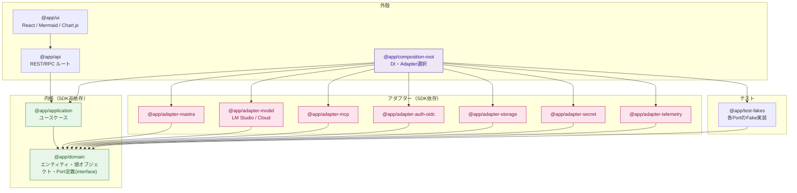
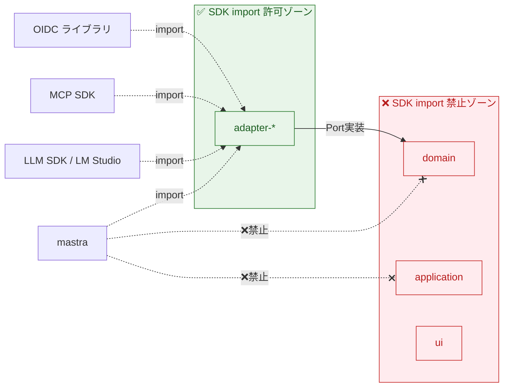
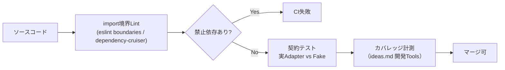
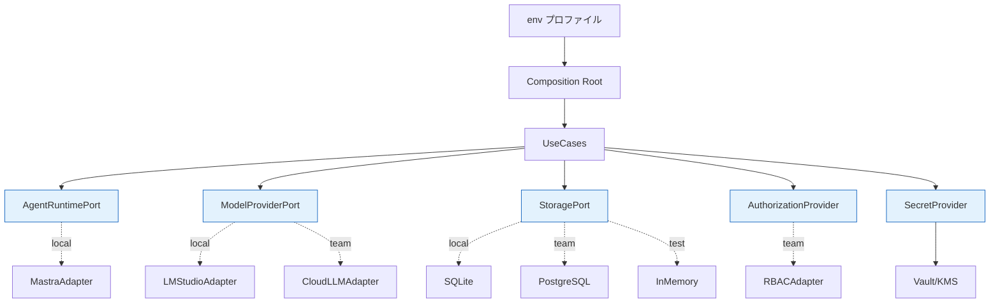

# 05. 依存グラフとレイヤ依存ルール

> 参照: [`ideas-v2.md` §0(原則5), §8 SDK境界ルール](../ideas/ideas-v2.md) / [01-architecture.md](./01-architecture.md)

SOLID原則（特にDIP: 依存性逆転）を機構として強制するための、パッケージ依存と `import` 制約を定義する。**依存は常に内側（ドメイン）へ向かう。**

---

## 1. パッケージ依存グラフ（モノレポ想定）

**読み方**
- すべての矢印は「依存する先」を指す。`@app/domain` は何も指さない（最内核）。
- アダプターは `domain` が定義した **Port（interface）を実装** するために `domain` へ依存する。SDKへの依存はアダプター内部に閉じる。
- `composition-root` だけがアダプターとFakeの両方を知り、実行時に注入する。

---

## 2. 外部SDKの隔離境界

`ideas-v2.md §8`「SDKのimportはinfrastructure/adapter層に限定する」を図示。

---

## 3. レイヤ依存ルール表

| From ↓ \ To → | domain | application | adapter | api | ui | composition |
|---|:---:|:---:|:---:|:---:|:---:|:---:|
| **domain** | — | ❌ | ❌ | ❌ | ❌ | ❌ |
| **application** | ✅ | — | ❌※ | ❌ | ❌ | ❌ |
| **adapter** | ✅ | ❌ | ❌ | ❌ | ❌ | ❌ |
| **api** | ✅ | ✅ | ❌ | — | ❌ | ❌ |
| **ui** | 型のみ | ✅(API経由) | ❌ | ✅ | — | ❌ |
| **composition** | ✅ | ✅ | ✅ | ✅ | ✅ | — |

- ※ `application → adapter` は禁止。アプリケーションは **Port（interface）にのみ依存** し、実装は注入で受け取る。
- 外部SDKへの `import` は **adapter 行のみ**が許される。

---

## 4. 依存ルールの機械的強制

ルールをレビュー任せにせず、CIで機械検証する（🔷 提案）。

- **import境界Lint**: `domain`/`application`/`ui` からのSDK importと、レイヤ違反を検出。
- **契約テスト**: 各Portで実SDKアダプターとFakeが同一契約を満たすことを保証（[04-api-spec.md](./04-api-spec.md)）。
- **カバレッジ計測**: `ideas.md §開発Tools` の要件。

---

## 5. ランタイム依存（実行時のオブジェクトグラフ）

静的なパッケージ依存とは別に、実行時にComposition Rootが組み立てる依存グラフ。

プロファイル（`local` / `team` / `test`）ごとの実装割り当ては [02-tech-stack.md](./02-tech-stack.md#5-環境プロファイルenv) を参照。

---

## 6. 依存に関する不変条件

- [ ] `domain` はいかなる他パッケージにも依存しない
- [ ] `application` は Port（interface）にのみ依存し、具体Adapterへ依存しない
- [ ] 外部SDKの `import` は `adapter-*` パッケージ内に限定する
- [ ] Adapterの生成・選択は `composition-root` 以外で行わない
- [ ] SDKバージョン更新の影響範囲は原則Adapter内に収める。共通契約変更時は影響ユースケースを明示する
