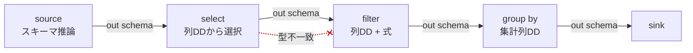
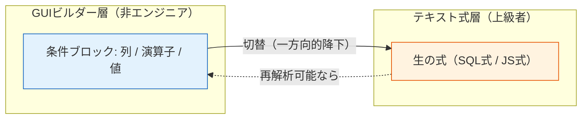
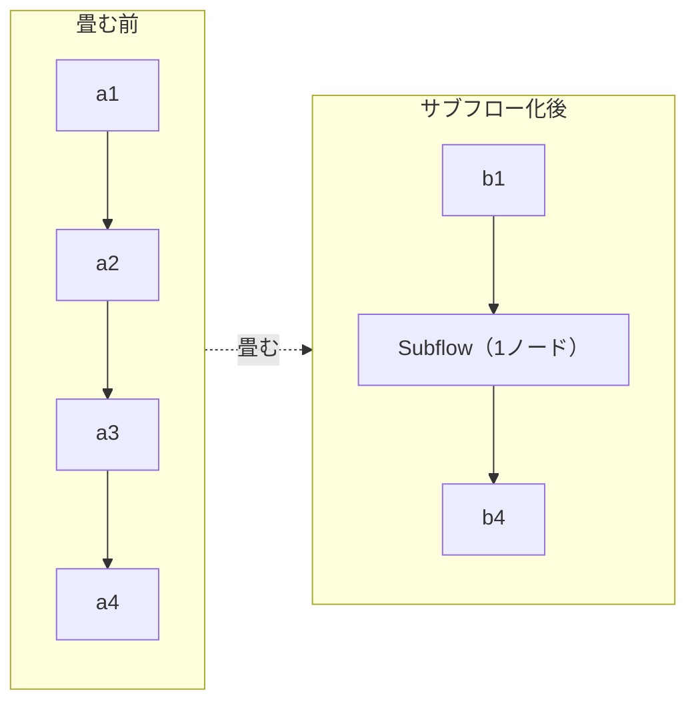
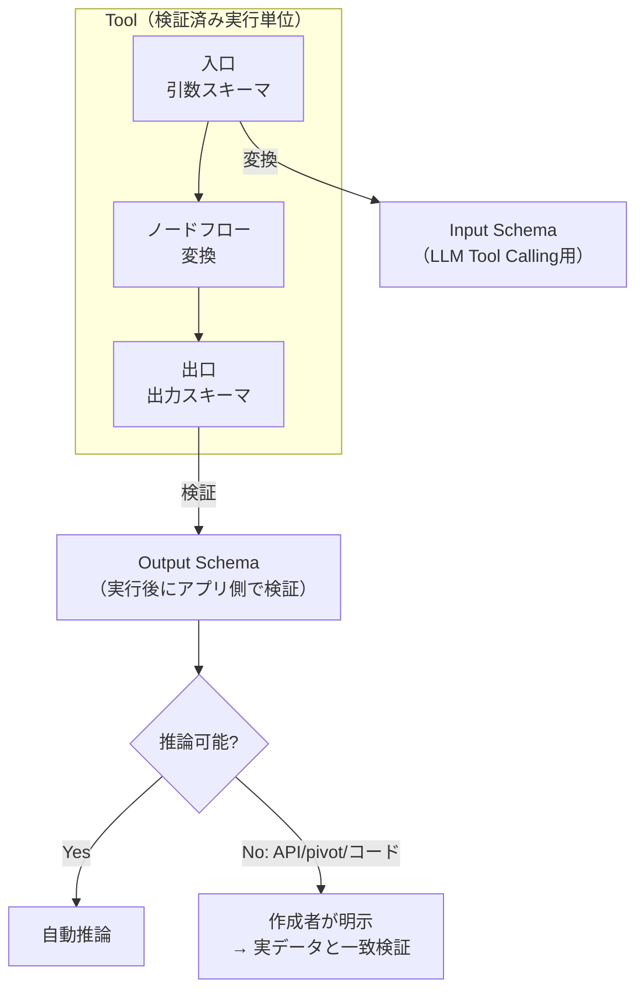

# 06. ETL ツールビルダー詳細仕様

> **ノーコード体験の心臓部。** 全体イメージは Azure のデータパイプラインのような機能性と操作感を目指す。

Tool = 「**入力スキーマ → 変換 → 出力スキーマ**」の検証済み実行単位。

---

## 1. ノード分類の全体像

```mermaid
flowchart LR
  subgraph SRC["入力 (source)"]
    S1["DB"]
    S2["ファイル CSV/JSON"]
    S3["API"]
    S4["エージェント引数"]
  end
  subgraph TRN["変換 (transform)"]
    T1["結合系: join / union"]
    T2["行操作: filter / sort / 重複排除"]
    T3["列操作: select / rename / cast / 計算列"]
    T4["整形: null処理 / 置換 / 文字列整形"]
    T5["集計: group by / ウィンドウ関数"]
    T6["表変換: pivot / unpivot / split / merge"]
    T7["時系列: 日付変換 / リサンプリング"]
  end
  subgraph ANL["分析 (analyze)"]
    A1["基本統計"]
    A2["相関分析"]
    A3["時系列分析"]
    A4["外れ値の検出・除外"]
  end
  subgraph SNK["出力 (sink)"]
    O1["可視化Chart Artifact"]
    O2["LLMへ渡す"]
    O3["ワークスペース格納"]
    O4["property graph Artifact"]
    O5["MCP公開"]
  end

  SRC --> TRN --> ANL --> SNK

  subgraph EXT["拡張ノード（Phase3）"]
    C1["制御: if/switch / foreach / try-catch<br/>→ Workflow Builderの責務"]
    C2["カスタムコード<br/>サンドボックス実行"]
  end

  classDef ext fill:#fff3e0,stroke:#e65100,color:#bf360c;
  class C1,C2 ext;
  style TRN fill:#e3f2fd,stroke:#1565c0,color:#0d47a1
```



> **重要**: 制御ノード（分岐/ループ/try-catch）はETLのデータ変換と実行規則が異なるため、Tool Builderへ混在させず **Workflow Builder** の責務とする（[01-architecture.md](./01-architecture.md#4-実行エンジンの三分割)）。

---

## 2. ノードリファレンス

### 2.1 入力 (source)

| ノード | 設定 | 出力スキーマ | v1 |
|---|---|---|:---:|
| ファイル | CSV / JSON、固定サンプル参照 | 推論 | ✅ |
| エージェント引数 | 画面で定義した引数 = 入力源 | 引数スキーマから確定 | ✅ |
| 現在日時（`current-datetime`） | timezone（IANA、省略時はサーバーローカル） | 固定1行（`now` / `date` / `yearMonth` / `time` / `weekday`） | ✅ |
| 仕訳（`journal-entries`） | status（draft / confirmed / exported）、期間（from / to）、件数上限 | 固定 14 列（1 行 = 1 仕訳行。[20-journal.md §14](./20-journal.md)） | ✅ |
| DB | 接続（SecretReference）、クエリ | 推論 / 明示 | Phase2 |
| API | エンドポイント、保存済みレスポンス切替 | 明示（推論不可） | Phase2 |
| Web検索 | 有効化済みprovider、検索語、取得件数 | 正規化済み検索結果 | ✅ 初期実装 |

### 2.2 変換 (transform)

| 分類 | ノード | 実装状況 |
|---|---|---|
| 結合 | `join`（inner/left/right/full）, `union` | **v15（次増分）** |
| 行 | `filter` | ✅ 実装済み |
| 行 | `sort`, 重複排除（`distinct`） | **v15（次増分）** |
| 列 | `select`, `rename`, `cast` | ✅ 実装済み |
| 列 | 計算列 — 関数電卓（`calculate`） | ✅ 実装済み（[§3.14](#314-関数電卓ノード数式で計算列を足す)） |
| 列 | 期間の解釈（`parse-period`） | ✅ 実装済み（[§3.15](#315-期間の解釈ノード期間ラベルを開始日と粒度にする)） |
| 整形 | null処理（`fill-null`）, 値の置換（`replace`） | **v15（次増分）** |
| 整形 | 文字列整形 | v16以降 |
| 集計 | `group by` 集計, ウィンドウ関数 | v16以降 |
| 表形式 | `pivot`, `unpivot`, `split`, `merge` | v16以降 |
| 時系列 | 日付変換, リサンプリング | v16以降 |
| 判定 | AI判定（`ai-judge`） | ✅ 実装済み |

> v15 のスコープと各ノードの詳細契約は [implementation/v15-etl-transforms.md](../implementation/v15-etl-transforms.md)（[ADR-0015](./adr/0015-etl-transform-expansion.md)）。2入力ノード（join/union）は `EtlNode.inputArity=2` と `GraphEdge.toInput` を使う（エンジンは対応済み）。

### 2.3 分析 (analyze)

分析結果は通常の`Table`として後続ETLへ渡す。保存済みToolの計算は決定的に実行し、LLMは実行時の**計算**には使わない。唯一の例外が `ai-judge`（AI判定。[§3.13](#313-ai-判定ノード判断条件に-ai-を使う)）で、LLMは集計や数値計算を一切せず、行が判定基準に当てはまるかを読んで答えるだけに限定される。その判定結果はノード自身ではなく決定的なグラフ解決ステップが検証・注入してから使うため、ノードの`execute`はここでも純粋関数のままである（[§5](#5-プレビュー実行規則)）。

| ノード | 主な設定 | 出力 |
|---|---|---|
| `summary-statistics` | 対象列、group、平均・標準偏差・四分位など | group/対象列ごとのlong形式統計表 |
| `correlation-analysis` | 対象列、Pearson/Spearman、欠損処理 | 列pairごとの係数・有効件数 |
| `time-series-analysis` | 時刻列、値列、timezone、interval、集計、欠損bucket補完、window/lag | bucket/seriesごとのlong形式時系列表 |
| `outlier-filter` | IQR/z-score/MAD、閾値、flag/exclude | 判定列付き、または除外済みの表 |

外れ値は監査しやすい`flag`を推奨し、`exclude`時も除外前後の件数と規則を診断へ残す。時系列はIANA timezoneの暦境界（DSTを含む）を使用し、`zero`/`forward`で欠損bucketを補完できる（補完はパーティションあたり100,000 bucketまで。超えると期間を狭めるか粗いintervalを選ぶよう促すエラーになる）。アルゴリズム、上限、欠損値、timezone、LLM設定補助の詳細は [ADR-0031](./adr/0031-analytical-nodes-chart-output-and-local-llm-assistance.md) と [v31実装計画](../implementation/v31-analytics-chart-output-llm-assistance.md) を参照。

### 2.4 出力 (sink)

| ノード | 内容 |
|---|---|
| `agent-output` | 列・shape・表現・上限を指定し、結果をAgentへ直接返す |
| `workspace-output` | Agent Session WorkspaceへArtifactとして一時保存し、Agentへ参照を返す |
| `chart-output` | 型付けした可視化仕様をChart Artifactへ保存する。ヒストグラム、箱ひげ図、散布図、相関ヒートマップ、時系列、外れ値overlayを扱う |
| `graph-output` | 入力行をedgeへ変換するか、相関表を無向networkへ変換し、property graph Artifactへ保存する。相関networkでは係数・有効ペア数の下限を指定できる |
| 互換Chart.js出力 | 既存`agent-output`のchartjs形式、または`workspace-output`のchart Artifactとして扱う |
| MCP公開 | 作成ToolをMCPサーバとして公開 |

出力は「Agentへ直接渡す」系統と「Session Workspaceへ格納する」系統の2系統をサポートする。可視化チャートは`chart-output`、関係探索用property graphは`graph-output`と明確に分ける。新規Toolは終端にどれか1つの明示sinkを持つ。既存Toolの終端Transformは後方互換のため暗黙`agent-output`として扱う。

Session Workspaceは既存のProject Workspace（`TenantScope.workspaceId`）とは別物で、1会話/評価ケース内だけで使う一時Artifact領域である。大量payloadをLLM contextやRun traceへ埋め込まず、表・JSON・可視化・property graph・blobをcatalog + payload storeで管理する。詳細は [ADR-0027](./adr/0027-tool-output-and-session-workspace.md) と [v28実装計画](../implementation/v28-tool-output-session-workspace.md) を参照。

---

## 3. ノーコードを成立させる仕掛け

### 3.1 スキーマ自動伝播

各ノードの出力スキーマを推論し、下流ノードの列選択をドロップダウンで提示する。



> 型不一致の接続線は赤で表示する（上図の点線）。スキーマ状態は5値（`確定 / 部分確定 / 推論 / 不明 / 不一致`）で区別する。状態遷移は [03-domain-model.md](./03-domain-model.md#4-スキーマ状態の遷移) を参照。

### 3.2 式エディタ（GUI ↔ テキストの二層）

filter条件・計算列を **GUIビルダーで組む → 上級者は生の式に切替**。ここが no-code / code の境界。

filter条件は文字列比較（`eq` / `neq` / `contains` / `in` / `notIn`）に限り `caseInsensitive: true` を指定でき、大文字小文字を区別せず照合する（既定は区別する。数値・日付・大小比較・isNull/notNull には作用しない）。UIでは該当演算子を選んだときだけ「大文字と小文字を区別しない」チェックボックスが現れる。

#### 複数の値を一度に指定する（`in` / `notIn`）

演算子は `eq | neq | gt | gte | lt | lte | contains | in | notIn | isNull | notNull` の11種。このうち **`in`（いずれかに一致） / `notIn`（いずれにも一致しない）** は `value` ではなく **`values`（値の並び。1〜100件）** を読む。「東京都・大阪府・北海道」を1条件・1回のTool呼び出しで絞り込むための形で、単値演算子しか無かった頃はAgentが県ごとにToolを呼び、1実行あたりのTool呼び出し上限に当たっていた。

```jsonc
{ "column": "地域", "op": "in", "values": ["東京都", "大阪府", "北海道"] }
```

- `in` は「セルが `values` のいずれかと等しい」。等価判定は `eq` と同じ（Dateは時刻値、`caseInsensitive` も効く）。ただし **null セルは `in` に一致しない**（`values` に null を混ぜても一致しない）。
- `notIn` は `in` の単純否定で、`neq` と同じく **null セルは残る**（`values` に null を入れたときだけ落ちる）。
- 日付列・数値列の `values` は文字列で書ける（`"2016-01-01"` / `"1400"`）。読めない要素は**その要素を名指しして**エラーにする（`filter: values for date column '<列>' must be ISO dates (YYYY-MM-DD): <値>` / `... must be numbers: <値>`）。
- 値が空（`values` 無し・空配列）の `in` / `notIn` は設計時に error issue、実行時に `ETL_SCHEMA` で止める（黙って全滅・素通しにしない）。ただし `valueBinding` を持つ条件は実行時に引数で埋まるため、設計時サンプルが無いだけなら warning（プレビューが0件になることだけを知らせる）。
- 101件以上の `values` は設定として拒否する（`ETL_CONFIG`）。
- `in` / `notIn` 以外の演算子に `values` が残っていても実行は続く（演算子に無関係な設定キーは無視する既存の規約）。ただし「効いていない」ことが分かるよう warning issue を出す。
- UIでは演算子に「いずれかに一致 / いずれにも一致しない」を選ぶと、値欄が複数行の入力欄（カンマ・読点・セミコロン・改行のどれで区切ってもよい）に変わり、解析した件数と値を直下に表示する。



### 3.3 データプロファイリング

入力データの **件数・null率・値分布・型** を自動表示。変換設計の前提が一目で分かる。

### 3.4 サブフロー化

複雑なフローの一部を1ノードに畳んで再利用（ツールの再帰的合成）。



### 3.5 サンプル固定 & スナップショットテスト（ツール検証）

代表入力を保存し、変更で出力が変わったら差分検知する（回帰の最小手段）。左ナビ「確かめる → **ツール検証** (Tool Check)」（`#/toolcheck`）で提供する。

- **単体実行**: 保存済みツールを選び、`inputSchema` の列から自動生成された引数フォーム（number → 数値入力、boolean → true/false、date → ISO 文字列、nullable 列は「未指定(null)」トグル）に値を入れて実行する。エージェント実行と同じ経路（全行で計算・副作用なし）で動き、`agentTool.description` があればエージェントに見せている説明も並べて表示する。`inputSchema` の無いツールは「引数なし」として `{}` で実行する。
- **期待 (expectations)**: すべて任意。行数（`== / >= / <=`）、存在すべき列、セル条件（列・演算子 `eq / neq / gte / lte / contains`・値・「いずれかの行 / すべての行」）、**行を特定した期待**、**AI判定への期待**、所要時間上限 (ms)、**実行の結末**（指定なし / 成功すること / 失敗すること）。埋めた項目だけをサーバーへ送り、結果は `passed / failed / error` と項目ごとの ✓ / ✕（期待・実測は英語定型文をUIで日本語化）で返る。「失敗すること」（`outcome: 'error'`）は異常系ケース用で、引数不正やノードエラーで実行が失敗したら **合格** になる（他の期待は評価しない）。このとき結果は合格バナーのまま失敗の内容を情報として添え、直すボタンは出さない。
  - **行を特定した期待**（最大50件）: `id が E1 の行` のように列＝値で終端出力の1行を特定し（`where`）、その行が「無いこと」（`present: false`）、または列ごとのセル条件（1行あたり最大20件）を確かめる。行数・セル条件が「表全体」を見るのに対し、こちらは「この1行がどうなっているか」をピンポイントで書ける。
  - **AI判定への期待**（最大100件）: `ai-judge` ノードの**入力行**を `nodeId` + `where` で特定し、その行の判定（`verdict`）が期待どおりかを確かめる。終端出力ではなくノードの判定表を見るので、`keep` / `exclude` で行が消えていても「その行が no と判定されたこと」を検証できる。AIの答えは表記ゆれうるので `verdict` には複数の値（any-of、最大21件。例 `["no", "unclear"]`）を書いておくと安定する。結果には判定に使ったモデル（`judgedBy`）も付くので、ケースが赤くなったときにモデルの変更が原因かを追える。
- **結果**: 合否バナー → 期待の表 → 出力（スキーマ帯 + 先頭 100 行、全行数が多いときは「全 N 行のうち M 行を表示」）→ ノード別の行数 → 所要時間。`error` のときは他画面と同じ並び（次の一手 → 原因 → 失敗箇所 → 「ツール「x」のノード「n」を開いて直す」ボタン）で、Tool Builder の該当ノードへ一手で戻れる。`TOOL_ARGUMENTS` は該当の引数欄を赤く示し、「引数「x」の欄へ」ボタンで戻す。
- **ケース**: 引数と期待に名前を付けて保存する（版を固定するか最新版を追うかを選べる）。左列の一覧から 実行 / 開く / 削除 でき、直近の結果チップ（合格 / 不合格 / エラー / 未実行）と実行日時を持つ。「すべて実行」で全ケース（または選択中のツールのケース）をまとめて再実行し、合格 / 不合格 / エラーの件数と各ケースの結果を出す。1件がエラーでも残りは続行する。
- 編集中の引数・期待はケースとして保存するまで「未保存」として扱い、ツールの切り替え・別ケースを開く・画面遷移で確認を挟む。
- **LLM によるケース提案**: エディタの「**LLMでケースを提案**」で、設定中のモデルがツール定義（入力・出力スキーマ、エージェント向け説明）から **正常 / 境界 / 異常** のケース案（カテゴリごと 1〜5 件、既定 2 件。「重点」を自由文で指定できる）を作る。提案はサーバーに保存されず、カードごとに **実行して確認**（合否チップを表示）→ **エディタに読み込む**（直してから保存）→ **保存**（提案名のままケースに追加、保存済みチップ）と進む。「すべて実行」「すべて保存」でまとめて扱える。異常系の提案は「失敗が期待値」（`outcome: 'error'`）を持つことが多く、実行して失敗すれば合格になる。サーバー側で落とした・直した点（未宣言の引数の除去、型変換など）は ⚠ で示す。構造化出力（JSON スキーマ）に対応したモデルが必要で、対応していない設定ではボタンが無効になり、設定画面への導線を出す（`GET /runtime/capabilities` の `toolCheckSuggestions.enabled`）。

API は `POST /tool-checks/run`（即時実行）、`GET/POST /tool-checks/cases`、`DELETE /tool-checks/cases/:id`、`POST /tool-checks/cases/:id/run`、`POST /tool-checks/cases/run-all`、`POST /tool-checks/suggest`（LLM 提案。失敗は 502 `MODEL_PROVIDER`）。DTO は `src/ui/api/types.ts` 末尾（`RunToolCheckDto` / `ToolCheckRunResultDto` / `ToolCheckCaseDto` / `ToolCheckSuggestionsDto`）と `src/application/tool-check` を対で保守する。

### 3.6 副作用の宣言

各Toolを `read-only / session-write / write / external-action` としてメタデータ宣言する。`session-write`は一時Artifactだけを書き、preview/testで許可する。Project Workspaceや外部状態への書き込みは従来どおり承認対象とする。エージェント実行時の安全性（承認要否・冪等性）に直結（[08-security-auth.md](./08-security-auth.md)）。

### 3.7 構造化設定UIと段階的ダイアログ

Node設定の通常操作では`column:type`やカンマ区切りを入力させず、上流schemaから生成したcombobox、multi-select、型別value input、Rule Tableを使う。

- 右Inspector: node概要、schema状態、1〜3項目のquick settings、validation、設定Dialogへの導線。
- 設定Dialog: join/rename/cast/sort/replace、入力schema、source payload、Output deliveryなど、横幅や反復行を必要とする編集。
- Dialog内の変更はlocal draftへ保持し、Apply時に1操作でgraphへ反映する。Cancelでは元configを保持する。
- raw JSON/CSVや一括文字列編集はAdvancedタブのescape hatchとして残す。
- schema不明時を除き、列名の自由入力は既定で許可しない。上流変更で消えた列はinvalid chipとして可視化する。

control対応、Dialog layout、accessibility、node別配置は [ADR-0028](./adr/0028-structured-node-configuration-ui.md) を参照。

### 3.8 Agent Input の条件バインドと公開契約

`agent-input`は、行データのsourceとして接続する用途に加え、未接続ならTool Callingの引数宣言として使える。たとえばデータsource → `filter` のフローに対し、`filter.valueBinding = { source: 'agent-input', field: 'minimumScore' }` を設定すると、呼び出しごとの`minimumScore`で行を絞り込める。

- 設計時previewはFilterに保持した固定`value`をサンプルとして使う。Agent実行時は同じ値を指定フィールドの実引数で上書きする。
- 保存時にbinding先がInput Schemaに存在することを検証する。存在しないフィールドは保存できない。

**複数値（`in` / `notIn`）の引数は「区切り文字で連結した1つの文字列」で受け取る。** Tool Calling の引数に配列を要求すると小さいモデルが形を外しやすいため、契約を1本にする。

- binding先の引数は **string型**で宣言する（保存時に検証。`number`/`date` で宣言すると値を1つしか渡せないため拒否する）。nullable にすれば「絞り込まない」も選べる。
- 実行時は `,`（半角カンマ）・`、`（読点）・`，`（全角カンマ）・`;`・改行のいずれでも分割し、各要素の前後の空白を落とし、空要素を捨て、重複を除いて `values` にする。`"東京都, 大阪府,北海道"` も `"東京都、大阪府、北海道"` も同じ3件になる。
- 分割結果が空（`""` や区切り文字だけ）なら**引数が省略されたときと同じ**扱いで、その条件を実行時にスキップする。
- 100件を超えたら `TOOL_ARGUMENTS`（`argument '<引数>' has too many values (<件数>); pass at most 100 values separated by commas`）でモデルへ差し戻す。
- 公開するJSON Schemaでは、その引数の `description` に「カンマ区切りで複数の値を1回で渡すこと」と設計時 `values` から作った例（最大3件）を書く。設計時の `values` はプレビューのサンプル兼この例になる。
- 桁区切りのカンマ（`1,000`）は値の区切りとして解釈される。数値列の複数値指定では桁区切りを付けない。

値に加えて**演算子そのもの**もAgent引数にできる。filter条件の `opBinding = { source: 'agent-input', field, allowed? }` を設定すると、Agentは呼び出しごとに比較方法（「以降/以前」「ちょうど/含む」など）を選べる。

- binding先の引数はInput Schema上 **string型**で宣言する（保存時に検証。違反は保存できない）。
- `allowed` はAgentが選べる演算子の許可リスト（省略時は全演算子）。同一引数を複数条件がバインドする場合、Tool Calling契約のJSON Schemaには**全条件の積集合**が `enum` として公開され、実行時の検証とエラーメッセージも同じ積集合に基づく（公開enumに載る演算子は必ず実行できる）。許可外・不正な値は引数エラーとしてモデルの修復ループへ返す。
- 設計時の `op` は設計previewのサンプルであり、引数が任意（nullable）で実行時に省略された場合の**既定演算子**にもなる（`op` は `allowed` に含まれている必要がある）。同一引数をバインドする複数条件の既定演算子は**全条件で一致**していなければならない（保存時に検証）。
- 列型がnumber|date以外の列では、`allowed`（省略時は全演算子）に `gt/gte/lt/lte` を含められない（設計時スキーマ検証でerror）。UIはnumber|date列の初期許可リストから `contains`（String化部分一致）を外す — 必要ならチェックボックスで明示的に戻せる。
- `allowed`（省略時も含む）に **`in` / `notIn` は入れられない**（値の形が `value` と `values` で異なり、1つの引数をどちらとしても解釈できない）。設計時検証で error にし、公開enumからも常に除外する。複数値の絞り込みをAgentに任せたい条件は、演算子を `in` に固定したうえで**値**の側を引数化する。
- **同一の引数を条件値（valueBinding）と演算子（opBinding）の両方にはバインドできない**（保存時に拒否。値引数と演算子引数は別々に宣言する）。
- `allowed` に `isNull`/`notNull` を含める場合、同じ条件の値引数（valueBinding先）は**nullableで宣言**しなければならない（保存時に検証）。opBinding経由で演算子が `isNull`/`notNull` へ解決された条件は値を使わない（値側のnullable引数が省略されていても条件はスキップされない）。opBindingを持たない条件は従来どおり「nullable引数の省略＝条件スキップ」が働く。
- Input Schemaに宣言されていないフィールドを参照するopBinding（旧データ等）は実行時に不活性となり、設計時の `op` がそのまま使われる。
- Toolの表示名・公開名と、Agentへ提示するFunction名・説明は分ける。`agentTool.name`と`agentTool.description`が設定されていれば、Function Calling定義とAgent promptはそれを使用する。
- Tool BuilderにはETL設計用previewだけを置く。以前のAgent chat preview領域は、Agentが受け取るTool Calling契約の編集パネルに置き換える。ここで`agentTool.name`、`agentTool.description`、Agent Input由来の引数名・型・必須性、推論済みの返却schema、side effectを確認できる。LLMを使う会話previewはAgent BuilderまたはChatで実行する。

#### 日付列の条件値はISO文字列で書く

保存済みTool定義はJSONなので `Date` リテラルを持てず、Agent Tool の引数も文字列で届く。そのため `filter` は、列が日付（設計時は入力スキーマの型、実行時はスキーマ + 実データのセルが `Date` か）のとき `eq/neq/gt/gte/lt/lte` の**文字列値をISO日付として解釈**してから比較する（`2008-01-01` はUTC 0時。`2008-01-01T00:00:00Z` のような日時も可。`contains` は従来どおり文字列包含）。`valueBinding` でAgent引数から届いた文字列にも同じ規則が働くので、日付範囲の絞り込みをAgentに任せられる。

ISOとして読めない文字列（`2008/01/01`、`昨日` など）は**エラーにする**: 設計時スキーマ検証は `filter: value for date column '<列>' must be an ISO date (YYYY-MM-DD): <値>` のerror issue、実行時は同じ文言の `ETL_SCHEMA`。以前はここがNaN同士の比較になり、**エラーも出さずに0行**を返していた（日付範囲がTool BuilderからもLLMが書いたグラフからも使えなかった）。UIの条件値入力は、列が日付なら日付ピッカー（`type="date"`）になり `YYYY-MM-DD` を書き戻す。

### 3.9 新規フォームの初期表示

新規作成フォームには実運用の値や英語サンプルを初期入力しない。値は空欄とし、入力例だけをプレースホルダーで示す。プレースホルダーはUIの言語設定に従い、日本語では日本語の例示へ切り替える。既存の保存済み定義を読み込んだ場合だけ、保存されている実値をフォームへ表示する。

### 3.10 再利用データソース

サイドバーの「データソース」でCSV/JSONファイルとDB接続を管理する。Tool Builderのsourceノードでは、インライン編集に加えて登録済みソースを選択できる。

- CSV/JSON: Tool定義には`dataSourceId`だけを保存する。本文はbackendのpayload storeにあり、未保存preview・保存時検証・保存済みTool実行の直前にだけ展開する。
- DB: `database-source`は登録済みのDBデータソース、環境変数で許可したtable/view、最大行数を指定する。任意SQL・書き込み・allowlist外のtable/viewは許可しない。
- DBクエリはbackendが読み取り専用トランザクションで実行し、行数を1〜10,000へ制限する。接続文字列とパスワードはブラウザ、Tool定義、Run traceへ含めない。
- DB資格情報は`AGENTCONTEXT_DB_CONNECTIONS`と`passwordEnv`でbackendだけが解決する。設定例はリポジトリ直下の[.env.example](../.env.example)を参照する。

詳細な安全境界は[ADR-0029](./adr/0029-data-source-registry.md)を参照。

### 3.11 任意のWeb検索データソース

Tavily、TinyFish、Google Custom Searchを、ETLの行データを生成する任意providerとして扱う。検索APIのキーはbackend環境変数だけで解決し、Tool定義、ブラウザ、Run traceへ含めない。

- `TAVILY_API_KEY`、`TINYFISH_API_KEY`、またはGoogle用の`GOOGLE_CUSTOM_SEARCH_API_KEY`と`GOOGLE_CUSTOM_SEARCH_ENGINE_ID`がすべて存在するproviderだけを有効にする。APIは有効providerの`id`、表示名、能力だけをUIへ返す。
- 有効providerが0件なら、Tool Builderのノードパレット、source選択、設定DialogにWeb検索を表示しない。既存定義で無効providerを参照した実行は、UI非表示に頼らずbackendで拒否する。
- `web-search-source`は`provider`、固定文字列またはAgent Inputにbindした`query`、`maxResults`、任意の許可domain・鮮度条件を持つ。出力は`title`、`url`、`snippet`、`score`、`provider`、`retrievedAt`へ正規化した表とする。
- 自動draft previewは外部検索を起動しない。作成者が`検索結果を取得`を明示したときだけbackendが実行し、結果はprovider、検索条件、取得時刻、15分TTLを持つサーバー内キャッシュへ保存する。Tool graphは結果本文ではなく`cacheKey`だけを保持し、previewとTool実行はそのキャッシュだけを読む。
- 初期実装は最大10件、10秒timeout、64KiB応答上限をbackendで強制する。キャッシュはプロセス再起動で失われる。キャッシュ永続化、呼出頻度・予算の組織ポリシー、本番実行時の明示更新は後続範囲とする。検索結果本文の無制限な収集や任意URLのfetchは初期範囲に含めない。

Google Custom Searchは公開されている移行予定を踏まえ、互換providerとして隔離する。新規の標準providerにはせず、画面にも`Google Custom Search（legacy）`と表示する。詳細なPort、API、失敗時の扱い、実装順序は[ADR-0030](./adr/0030-optional-web-search-providers.md)を参照。

### 3.12 ローカルLLMによる分析設定補助

基本統計、相関、時系列、外れ値の設定Dialogでは、schemaと決定的data profileから推奨初期値を作れる。`LM_STUDIO_MODEL`が設定され、structured outputを利用できる場合だけ「ローカルLLMで設定案」を表示する。

- LLMへ渡す既定情報はschema、型、null率、distinct数、範囲、現在設定、ユーザーの分析目的に限定する。
- raw sampleは明示opt-inとし、マスキング後に最大20行かつ8 KiBへ制限する。
- LLMは厳格なJSON形式の設定案を返し、backendがnode設定、schema伝播、bounded previewを検証する。
- 設定案は自動適用・自動保存しない。現在値との差分、仮定、警告、previewを確認してからユーザーがApplyする。
- 保存済みToolの実行計算にはLLMを使わない。

詳細は[ADR-0031](./adr/0031-analytical-nodes-chart-output-and-local-llm-assistance.md)を参照。

### 3.13 AI 判定ノード（判断条件に AI を使う）

`ai-judge`（AI判定）は、Difyの「質問分類器」「LLM条件分岐」に相当する transform ノードで、各行を**利用者が日本語で書いた判定基準**に照らして振り分ける。1入力。

#### 設定

| 設定 | 内容 |
|---|---|
| question（判定基準） | 「この問い合わせはクレームですか？」のような日本語の質問文 |
| categories（カテゴリ） | 空なら**はい/いいえ**モード、1つ以上なら**分類**モード。最大20件。`unclear` は予約語で名乗れない |
| columns（対象列） | モデルに見せる列。空なら入力の全列 |
| outputColumn | 判定列名（既定 `aiVerdict`） |
| reasonColumn | 理由列名（既定 `aiReason`）。`null` にすると理由列を出さない |
| action | `flag`（判定列・理由列を足して全行を通す）/ `keep`（一致した行だけ残す）/ `exclude`（一致した行を除く） |
| matchValues | `keep` / `exclude` で「一致」とみなす判定値（既定 `['yes']`） |
| maxItems | 1回の実行で判定できる重複除外後の件数上限（既定50、上限200） |

判定値は、はい/いいえモードなら `yes` / `no` / `unclear`、分類モードならカテゴリ名のどれか、または `unclear`。`unclear`（判断できなかった行）は `matchValues` に明示的に含めない限り「一致しない」扱いになる — AIの不確かな回答がフィルタを黙って通過しない、という安全側の既定である。

#### flag → filter の分岐パターン

`ai-judge` 自体には分岐や制御フローの概念を持たせない。`ai-judge(action=flag)` で判定列を足したのち、後続の `filter`（`aiVerdict eq yes` など）で**決定的に**分岐する。`keep` / `exclude` は「判定列を足してすぐ絞り込む」典型パターンの1ノードショートカットに過ぎず、内部で同じ判定結果を使う。これにより、AIの判断条件をノードグラフへ持ち込みながらも、単一終端DAGの原則（[§1](#1-ノード分類の全体像)）と制御ノードをWorkflow Builderへ残す境界は崩さない。

#### 実行時にLLMを呼ばない理由と解決の流れ

`EtlNode` は同期・純粋関数である。`ai-judge` のドメイン実装（`execute`）もこれに従い、LLMを直接呼ばず、`config.resolved.verdicts` に**注入済みの判定**を決定的に適用するだけである。LLMの呼び出しは、database / web-search などの行ソースと同じ「事前解決」の仕組みで、アプリ層の `ResolveAiJudgmentsUseCase` が `engine.preview` の直前に行う。

1. グラフを `ai-judge` ノードのトポロジカル順に処理し、各ノードについて上流までの祖先サブグラフを実行して入力行を得る（先行する `ai-judge` は解決済みの設定で走る）。
2. 行を列の値で同一視して重複を除き（同じ内容の行は1回だけ判定する）、`maxItems` を超えていないか検査する。
3. モデル + 判定設定（question・categories・columns）+ 行内容をキーに、再利用できる判定はキャッシュから取り、残りを20件ずつのバッチでモデルへ問う（温度0、厳格なJSON Schemaの構造化出力、スキーマ不一致は1回だけ修復を試みる）。
4. `config.resolved.verdicts` を注入したグラフを返す（保存済みToolの定義そのものは変えない）。

この解決ステップは、下書きプレビュー・保存済みToolのプレビュー・ツール検証（Tool Check）・呼び出し診断（[§4](#4-io-契約化検証可能な境界)）・エージェントのTool実行の**すべてで**通す。スキーマ点検（列の推論だけを行う経路）は通さない。

#### 安全性・限界

- 判定結果は常に明示的（`yes`/`no`/カテゴリ名/`unclear`）で、失敗しても黙って全行を通す・落とすことはない。
- モデルが使えない（メインスロット未設定、または構造化出力非対応）ときは、対象ノードの`nodeId`付き `ConfigError` で止まり、UIはノードへの導線と「設定 > モデル」への案内を出す。
- 重複除外後の判定対象行が `maxItems` を超えたら、`nodeId` 付きのエラーで止まり、上流を `filter` / `limit` などで絞り込むよう促す。
- モデルの応答が壊れている・接続に失敗した（1回の修復ラウンド後も含む）ときは、`nodeId` を含む502 `MODEL_PROVIDER` として失敗する。
- 行の値はプロンプト内で `<untrusted-rows>` タグに囲んだ「引用データ」として渡し、指示として実行しないようモデルへ明示する（プロンプトインジェクション対策）。
- モデルが渡していない `id` を返しても無視し、回答が無かった行は `unclear` として扱う（回答の穴を握りつぶさない）。
- 非決定性（LLMの応答揺らぎ）は `ai-judge` ノード1つに閉じ込め、判定結果自体は解決ステップが決定的に検証・適用するので、グラフの残りは従来どおり決定的に動く。

#### UI

右Inspector sidebarには判定基準の要約（question の先頭部分）、モード（はい/いいえ or 分類N件）、actionを表示する。詳細設定は設定Dialog（[§3.7](#37-構造化設定uiと段階的ダイアログ)の型に従う）で、question のテキストエリア、カテゴリの追加/削除リスト（名前 + 説明）、対象列のmulti-select combobox、出力列名・理由列名のinput、action の選択、`keep`/`exclude`時のmatchValuesの選択（許容される判定値からのmulti-select）、maxItemsのnumber inputを編集する。

#### 検証

`ai-judge` を含むToolは、ツール検証（[§3.5](#35-サンプル固定--スナップショットテストツール検証)）の期待で「**入力行 → 判定値**」を直接確かめられる。期待の `judgments` に `nodeId` と行の特定条件（`where`）を書けば、その行がノードでどう判定されたか（`verdict`）を、`flag`/`keep`/`exclude` のどのactionでも検証できる（`keep`/`exclude`で行が終端出力から消えていても、ノードの判定表を見るので追跡できる）。AIの答えは同じ入力でも表記ゆれうるので、`verdict` には複数の値（any-of）を書いておくのが安全（例: 「除外されるはず」なら `["no", "unclear"]`）。結果には判定に使ったモデル（`judgedBy`、provider/model）が付くので、ケースが赤くなったときにモデルの入れ替えが原因かをその場で切り分けられる。判定はモデル+設定+行内容でキャッシュされるため、同じモデルでの再実行は安定して同じ結果になる。

#### 非スコープ（将来）

- 判定基準をAgent Inputの引数へバインドすること（[§3.8](#38-agent-input-の条件バインドと公開契約)の仕組みをそのまま流用する設計は未着手）。
- 判定に加えて確信度などの多列出力を返すこと。
- 真のif/elseファンアウト（1ノードから複数分岐を出す制御フロー）— これはWorkflow Builderの責務のまま。

設計判断の詳細は[ADR-0044](./adr/0044-ai-judge-node.md)、実装契約は[implementation/v38-ai-judge-node.md](../implementation/v38-ai-judge-node.md)を参照。

---

### 3.14 関数電卓ノード（数式で計算列を足す）

`calculate` は、入力の各行について**数式を 1 つ評価し、結果を 1 列**として足す変換ノード。「税込金額 = 金額 × 1.1」「単価 = 金額 ÷ 数量」「対数変換」「角度の変換」のような、表計算のセルに書く程度の計算のためのもの（[ADR-0045](./adr/0045-calculator-node.md)）。

設定ダイアログは関数電卓の見た目で、演算子や関数名を覚えていなくても組める。

| 要素 | 内容 |
|---|---|
| 式の表示欄 | 組み立て中の式。直接編集もできる。ボタンはカーソル位置へ挿入する |
| AI に式を書かせる（✨） | 式のすぐ下のキー。押すと「計算したいこと」の指示文欄と「式を提案」・提案結果（式・根拠・警告・プレビュー要約・適用ボタン）の区画が開閉する。ローカル LLM が未設定のときはキーを無効化した状態で出し、設定箇所への案内を添える（隠さない）。指示文を編集中は「値として使える入力」のキーが式ではなく指示文へ `[列名]` を入れる。すでに式があるときは AI がその式を直す |
| キーパッド | 数字・小数点・`( )`・`+ − × ÷`・`^`（べき乗）・`%`（剰余）・`π`・`e`・`←`（1 文字消す）・`C`（全部消す） |
| 関数 | 4 群。**基本**: `abs` `sign` `sqrt` `cbrt` `pow` `mod` `min` `max` `hypot` / **丸め**: `round(x[, 桁])` `floor` `ceil` `trunc` / **指数・対数**: `exp` `ln` `log10` `log2` `log(x, 底)` / **三角**（ラジアン）: `sin` `cos` `tan` `asin` `acos` `atan` `atan2(y, x)` `sinh` `cosh` `tanh` `deg`（→度）`rad`（→ラジアン） |
| 値として使える入力 | 式の直下に、上流の列を **型と例の値**（プレビューの先頭から null を除いた相異なる値を 3 つ）つきのキーとして並べる。押すと `[列名]` がカーソル位置に入る。`number` 型を先に、それ以外は薄く出し、数値として使うには上流に型変換を置く旨を添える。サイドバーの要約にも同じ入力を `[列名]` で出す |
| 出力列 | 結果を入れる列名。同名の列があればその位置で置き換える。型は常に number（null あり） |
| 評価できないとき | `null`（既定。その行の結果を空にして続ける）/ `fail`（実行を止め、行番号・式・理由を出す） |
| 小数桁 | 指定すると四捨五入する。空なら丸めない |

**列の参照**は `[金額]` のように角括弧で囲む（日本語・空白・記号を含む列名のため）。英数字だけの列名は裸で書いてもよいが、関数名・定数名と重ならず、上流に実在するときだけ列として読む。打ち間違いは「未知の名前」として設定画面の問題一覧に出る（黙って 0 や空にはしない）。

**受け付けないもの**: 比較・条件分岐・文字列・日付演算・代入。行を条件で絞るのは [フィルタ](#2-ノードリファレンス) と [AI 判定](#313-ai-判定ノード判断条件に-ai-を使う) の役目で、ここには持ち込まない。集計は `group-by`。エージェント引数を式で参照する束縛は今のところ無い。

**評価の規則**: 参照した列が空（null）なら結果も空。0 除算・負の平方根・`ln(0)` のように有限の数にならない場合も空（`fail` を選べば止まる）。`number` 以外の型の列は実行時に数値へ寄せる（数値の文字列だけ通し、他は空）。設定画面では型ごとに注意が出る。全角の数字や `×` `÷` もそのまま読む。

**0 除算の扱い**: `1 / 0` も `0 / 0` も `5 % 0` も `0 ^ -1` も、すべて結果は空にする。セルに「エラー値」という型が無いので（表計算ソフトの `#DIV/0!` に当たるものが無い）、空にするしかない。1 行の 0 除算で数千行の計算を止める方が害が大きいため、**既定では行を落とさず空のまま先へ流す**。

止めたい場合は「評価できないとき」を `fail` にする。そのとき出る文言は**原因ごとに変わり、直す先まで書く**。

| 原因 | 文言 | 次の一手 |
|---|---|---|
| 0 で割った | 0 で割っています | 分母が 0 になる行を上流の行フィルターで除く |
| 参照列が空・数値でない | 参照している列が空か、数値にできない値です | 上流の null 処理で既定値を入れる |
| 定義域の外 | 関数の定義域の外です | 式を見直すか、該当行を上流で除く |
| 桁あふれ | 計算結果が大きすぎて扱えません | 桁数の小さい列を使う |
| 丸めの桁数が範囲外 | 引数が不正です | 桁数を 0〜15 の整数にする |

どの行で止まったかは行番号（1 起点）と式が一緒に出る。

**上限**: 式は 1,000 文字、括弧や関数の入れ子は 64 段、トークンは 500 個まで。超えると設定画面の問題一覧に出る。`round(x, 桁)` と「小数桁」の桁は 0〜15 の整数。それ以外は評価不能（空、`fail` なら停止）。

**結合の規則**: 単項のマイナスはべき乗より先に結ぶ。`-3^2` は `(-3)^2 = 9` になる（表計算ソフトと同じで、数学の記法とは逆）。`-(3^2)` が欲しければ括弧で囲む。`^` は右結合で、`2^3^2` は `2^(3^2) = 512`。

浮動小数の計算なので、`0.1 + 0.2` のような誤差は避けられない。通貨の丁寧な丸めが要る場合は「小数桁」で揃えたうえで、表示側や後段の変換で扱う。

**式を LLM に任せる**: 式の表示欄のすぐ下に「✨ AIに式を書かせる」キーがある（有効化条件は[§3.12の分析設定補助](#312-ローカルllmによる分析設定補助)と同じ）。ローカル LLM が未設定のときもキー自体は隠さず、無効化した状態で「ローカルLLMが未設定です。設定 > モデル で main スロットを設定して再読み込みすると、AIに式を書かせられます。」と直し方を添える（隠すと機能に気づけないため）。

有効なときにキーを押すと区画が開く。「計算したいこと」に日本語で書いて「式を提案」を押すと、上流の列名と標本行（最大5行）から検証済みの式を1本提案する。**指示文を編集しているあいだは、下の「値として使える入力」キーは式ではなく指示文へ `[列名]` を挿入する**（列名を打ち間違えずに指示へ書けるように）。式の表示欄へフォーカスを戻すと、キーは元どおり式へ挿入する。

検証は3段階: ① `validateExpression` で構文・列参照を判定し、② 落ちれば診断（種別・列名・候補列）を渡して**1回だけ**再提案し、③ 通れば `previewExpression` で標本行を実際に計算し、全行失敗や数値でない列への依存が無いかを確認する。2回目の判定も通らなければ、最後の診断と直し方の候補を添えて失敗を返す。

**すでに式が書かれているときは、AI はその式を直す。** 指示文の欄の置き文字（プレースホルダー）も「いまの式を税込（10%）にして小数 0 桁で丸める」のような改訂の例に変わる。指示が今の式を指して直す・変える・広げることを求めていれば、指示が触れていない部分は保ったまま改訂した式を返す。式がまだ空なら、指示文だけから新しい式を書く。

提案は自動適用・自動保存しない。式・根拠・プレビュー要約（何行計算できたか）・警告を確認してから「この式をダイアログへ適用」を押した時だけ、式と出力列名をダイアログへ取り込む（評価できないときの扱い・小数桁は現在値を保つ）。詳細は [ADR-0046](./adr/0046-calculate-expression-assistant.md) を参照。

**この電卓で表せない指示は、式を作らずに断る**: 文字数を数える・条件で値を変える・別の表を引く、といった指示は演算子と関数だけでは書けない。そのときは式を作らず、「なぜ書けないか」（モデルの説明）と「次にやること」（数値列の計算に言い換えるか、別のノードで前処理する）を添えて失敗を返す。それらしい定数（`0` など）で埋めた式は返さない。もし入力列を 1 つも使わない式（定数だけ）が提案されたら、拒みはしないが「式が入力列を参照していません」と警告に出すので、適用前に結果を確かめる。

**空（null）の扱いには注意が要る**: 「割引率が空の行は割引なしにしたい」のような**空を既定値へ倒す**指示は、いまの式言語に `coalesce` 相当が無いため正しく表せない。提案は `[単価] * [数量] * (1 - [割引率])` のような式になり、割引率が空の行は結果も空になる。プレビュー要約に `2/4 行が計算できません（内訳: missing-value 2）` と出るので、適用前に気づける。空の行を埋めてから電卓へ渡すか、対象行を絞る。

**実測の目安**（LM Studio、12B 級、GPU 1 枚、モデル 1 つだけ読み込み）: 素直な指示で 4〜35 秒、差し戻しが入ると 50〜120 秒。2 つ以上のモデルを同時に読み込んでいると VRAM の取り合いで 10 倍以上遅くなることがある。

### 3.15 期間の解釈ノード（期間ラベルを開始日と粒度にする）

`parse-period` は、文字列の**期間ラベル**を読んで **開始日**と**粒度**の 2 列を足す変換ノード。

**動機（混在粒度の罠）**: 政府統計（e-Stat）の CSV は、時点を表す 1 つの列（`時点`）の中に粒度の違うラベルが混ざる — 「1975年10月」（月）・「2024年1-3月期」（四半期）・「2024年」（暦年）・「2024年度」（年度）。文字列のままでは

- 「2008年から2010年まで」のような**範囲の絞り込みができない**（`filter` の大小比較は `number|date` の列を要求する）、
- **時系列順に並べ替えられない**（文字列順だと「2024年1-3月期」が「2024年10月」より前に来る等）、
- **年の行と月の行が同じ表に並んだまま**集計され、合計すると二重計上になる、

という 3 つの事故が起きる。このノードはその 1 列を決定的に読み替えて、以降の `filter` / `sort` が普通の日付列として扱えるようにする。

**設定**

| 項目 | 既定 | 内容 |
|---|---|---|
| 期間ラベルの列 | （必須） | 読み取る列。上流の列から選ぶ |
| 開始日の列 | `periodStart` | 足す列の名前。型は `date`（読めなければ空） |
| 粒度の列 | `periodGranularity` | 足す列の名前。型は `string`（必ず値が入る） |
| 年度の開始月 | `4` | 1〜12。`2024年度`・`2024年度第1四半期`・`2024年度上期`・`FY2024` の起点 |

**出力**: 入力の全列 + 開始日（`date` / null あり）+ 粒度（`string` / null なし）。開始日は**その期間の初日の UTC 深夜 0 時**（`2024年度` は 2024-04-01、`2024年1-3月期` は 2024-01-01）。粒度は `day` / `month` / `quarter` / `half` / `year` / `fiscal-year` / `unknown` のいずれか。**読めないラベル・空のセルでも実行は止まらない**（開始日は空、粒度は `unknown`）。1 セルの表記ゆれで数千行の変換を止める方が害が大きいため（`cast` の「変換不能 → null」と同じ規律）。

**読めるラベル**（全角の数字・空白、`〜 ～ − ‐ –` などのダッシュは先に半角へ寄せる。前後の空白は落とす）

| 形 | 例 | 開始日 | 粒度 |
|---|---|---|---|
| `YYYY年M月D日` | `2024年3月15日` | 2024-03-15 | `day` |
| `YYYY年M月` | `1975年10月` | 1975-10-01 | `month` |
| `YYYY年` | `2024年` | 2024-01-01 | `year` |
| `YYYY年度` | `2024年度` | 2024-04-01 | `fiscal-year` |
| `YYYY年M-N月期` / `YYYY年M～N月期` / `YYYY年M月～N月` | `2024年1-3月期` | 2024-01-01 | 3 か月なら `quarter` / 6 か月なら `half` / それ以外は `unknown`（開始日は入れる） |
| `YYYY年第N四半期` | `2024年第4四半期` | 2024-10-01 | `quarter` |
| `YYYY年度第N四半期` | `2024年度第4四半期` | 2025-01-01 | `quarter`（年度の開始月から数え、年をまたぐ） |
| `YYYY年度上期` / `下期` | `2024年度下期` | 2024-10-01 | `half` |
| 和暦（`明治`/`大正`/`昭和`/`平成`/`令和`、`元年`可） | `平成20年4月` / `令和元年度` | 2008-04-01 / 2019-04-01 | 上の各形と同じ |
| `YYYY-MM-DD` / `YYYY/MM/DD` | `2024-03-15` | 2024-03-15 | `day` |
| `YYYY-MM` / `YYYY/MM` / `YYYYMM` | `2024-03` / `202403` | 2024-03-01 | `month` |
| `YYYYQn` / `YYYY-Qn` | `2024Q2` | 2024-04-01 | `quarter` |
| `YYYY` | `2024` | 2024-01-01 | `year` |
| `FYYYYY` / `FY YYYY` | `FY2024` | 2024-04-01 | `fiscal-year` |
| セルがすでに日付（`Date`） | — | その日付 | `day` |
| セルが数値 | `2024` / `202403` | 文字列と同じ規則 | `year` / `month` |

月は 1〜12、日はその月に実在する日、年は 1〜9999 だけを受ける。範囲外（`2024年13月`・`2024年2月30日`・`202413`・`第5四半期`）は**黙って繰り上げず** `unknown` にする。

**推奨の並び**（期間で絞って時系列に並べる定石）

```
parse-period → filter  periodGranularity eq month     ← 粒度の違う行を落とす（これを省くと二重計上）
             → filter  periodStart gte/lte            ← 期間で絞る
             → sort    periodStart asc                ← 正しい時系列順
```

粒度で絞る `filter` を**先に**置くのが要点。年・年度・四半期の行が残ったまま `group-by` で合計すると、同じ数字を粒度違いで何重にも足してしまう。

> **日付の範囲指定に渡す値の形**: `filter` の大小比較（`gt` / `gte` / `lt` / `lte`）は値を数値（`Date#getTime()`）へ寄せてから比べる。したがって `periodStart` に対する条件の `value` は **`Date` そのもの**（`new Date('2008-01-01T00:00:00.000Z')`）でなければならない。`'2008-01-01'` のような **ISO 文字列を渡すと比較が NaN になり、エラーも出ないまま 1 行も残らない**。エージェント引数から受け取る場合は、引数の列型を `date` で宣言しておけば実行時に `Date` へ変換されてから束縛される。

**問題として出るもの**（すべて error。設定画面の問題一覧に出て、実行時は同じ文言の例外になる）

| 文言 | 直し方 |
|---|---|
| `parse-period: column not found: X` | 「期間ラベルの列」を上流に実在する列へ選び直す |
| `parse-period: start column already exists: X` | 開始日の列名を変える（上流に同名の列がある） |
| `parse-period: granularity column already exists: X` | 粒度の列名を変える |
| `parse-period: start column and granularity column must differ: X` | 2 つの出力列名を別々にする |

**UI**: 設定はサイドバーに直接置く（ダイアログ無し）。列の選択・2 つの出力列名・年度の開始月と、上の推奨の並びの案内を同じ画面に出す。

### 3.16 テンプレートから作成（外部ファイル）

ツール一覧の「テンプレートから作成」は、**できあいのツールの形（テンプレート）を選び、スロット（データソース・列・少数の選択肢）を埋めるだけ**で Tool を作る入口。空のキャンバスから分析ノードの設定（`interval` / `comparison.lag` / `groupBy` の組み合わせ）を正しく組むのは人にも難しく、前期比・期間内の統計・相関・2 ソースの比のような構成は、ノードとしては在るのに誰も作れていなかった（ADR-0049 / [ADR-0047](./adr/0047-factory-lessons-from-estat.md) の実測）。

**テンプレートは外部ファイル**（`templates/tools/*.json`）で、Agent Factory（[docs/16](./16-agent-factory.md)）とこの画面が**同じファイル・同じ候補・同じ実体化**を使う。コードを変えずに足せる。

**流れ**

1. **テンプレートを選ぶ** — タイトル・要約・使いどころ・タグ・要るデータソースの数が並ぶ。絞り込み欄はタイトル・要約・タグ・id に当たる。
2. **データソースを選ぶ** — そのテンプレートの `dataSource` スロットの数だけ、宣言順にラベル付きで選ぶ（登録済みのファイルデータソースから）。
3. **スロットを埋める** — 残りのスロットが種類ごとの入力欄になる。候補は**プロファイルから決定的に**作られ、選ぶ根拠を一緒に出す:

   | スロット | 入力欄 | 添える根拠 |
   |---|---|---|
   | `column`（単一） | ドロップダウン | 列の型。カテゴリ列は実在値の例、期間列は粒度ごとの行数と開始日の範囲 |
   | `column`（複数） | チェックボックス | 何個選べるか（min〜max） |
   | `joinKeys` | チェックボックス | 値の重なり（%）。選び残し・一意にならない組み合わせは警告を出す |
   | `choice` | ドロップダウン | 固定の選択肢は日英のラベル、`granularities:` はデータに在る粒度だけ |
   | `number` | 数値入力 | 最小・最大 |
   | `text` / `intent` | 入力欄 / テキストエリア | テンプレートの help |

   任意のスロットには「（任意）」と「（指定しない）」が付く。データソースや列を変えると、それに依存する候補は**部分的な値を送って取り直す**（文字入力では取り直さない）。

4. **名前を決める** — 「**ツール名**」（表示名。日本語可）と「**関数名**」（モデルに見える名前。英数字・`_`・`-` で1〜64文字）を**必ず入力する**。テンプレート側の名前を既定にしない理由は、同じテンプレートから作った2本目が1本目と同じ内部ID・公開名になり、**別のToolのつもりで保存すると既存Toolの新しいバージョンになってしまう**ため。保存済みToolと同じ関数名はその場で弾く（保存まで待たない）。関数名は内部ID・公開名・関数名の3つに、ツール名は表示名・作業名に入る。
5. **作成** — サーバーが実体化し、**手で組んだ Tool と同じ検査**（構造・列の存在・設計時プレビュー）を通してからグラフを返す。画面はそれをキャンバスへ展開し、表示名・公開名・Agent Tool 契約（名前と説明）を埋める。保存はしない（所有者を入れて明示的に保存する）。
6. 展開後、どのテンプレートから作ったか（`id@version`）を通知として出す。

**式を AI に書かせるテンプレート**（`custom-computation` のような `intent` スロットを持つもの）は、`calculate` の式を空のまま返す。画面はそのノードを選択状態にして、[§3.14 の関数電卓](#314-関数電卓ノード数式で計算列を足す)の「AIに式を書かせる」へ意図文を入れておく（人は式を書かされず、提案を押すだけでよい）。ローカルLLMが未設定のときは意図文を消費しない（設定して開き直せば、そのとき入る）。

**スロットの指摘**: 選んだ値がデータに合わなければ 422 が返り、**どの欄を直せばよいか**が欄の真下に出る（「列『世帯数』はこのデータソースの数値の列ではありません。人口 から選んでください」）。その欄を触ると指摘は消える。

**読み込めなかったテンプレート**: 壊れた JSON・形式違反のファイルは読み飛ばし、一覧の下の「読み込めなかったテンプレート」（既定は畳んである）にファイル名と**理由と直し方**を出す。ファイルを直してダイアログを開き直せば反映される（再起動は不要）。

**ファイルの置き場所と書き方**

- 同梱の標準テンプレート: `templates/tools/*.json`（10 本。時系列の取り出し・最新値・ランキング・前期比・期間内の統計・自由な計算列・横並びの結合 2/3 ソース・2 ソースの比・相関）。
- 自分のテンプレートを足す: 同じフォルダに置くか、環境変数 `AGENTCONTEXT_TOOL_TEMPLATES_DIR`（`;` か `:` 区切りで複数可）で別のフォルダを足す。**同じ `id` は後勝ち**なので、標準テンプレートを自分のもので置き換えられる。
- 書き方は [`templates/tools/README.md`](../templates/tools/README.md)、形式の契約は [implementation/v43](../implementation/v43-tool-templates.md)、決定は [ADR-0049](./adr/0049-tool-templates.md)。
- API は [docs/04 §3](./04-api-spec.md) の `/tool-templates` 3 本。実装は `src/application/tool-template/template-use-cases.ts`（一覧・候補・実体化）、`src/api/tool-template-routes.ts`、`src/ui/tool-builder/TemplateDialog.tsx`。

## 4. I/O 契約化（検証可能な境界）



- フロー入口 = **引数スキーマ**、出口 = **出力スキーマ**。
- 引数スキーマ → LLM Tool Calling 用 **Input Schema** に変換。
- Agent向けTool契約の **name / description** は、画面表示用metadataと別に保存できる。未設定の既存Toolは公開名・表示名から後方互換で導出する。
- 出力スキーマ → 実行後にアプリ側で検証する **Output Schema**。
- **保存時に契約を検証する**: モデルへ公開する function 名（`agentTool.name`、未設定なら公開名）が `[A-Za-z0-9_-]{1,64}` に合うこと、引数スキーマと Agent Input ノードの列が一致すること、宣言した出力スキーマがグラフの推論結果と矛盾しないこと。いずれも実行時と同じ判定関数で検査し、違反は保存ボタンの横に「何を直すか」付きで表示する（実行して初めて分かる状態を作らない）。
- **呼び出し診断**（保存前の下書きに対する事前検査）: Tool Builder の「呼び出し診断」ボタンは `POST /tool-drafts/diagnose` で function 定義・引数整合・データソース解決・グラフ検証・サンプル実行・出力スキーマ整合・演算子引数・副作用・公開状態を段階別に検査し、問題のある項目には直す場所（ノード／エージェント向けコンテキスト／出力）を開くボタンを付ける。検査項目の一覧は [19-troubleshooting.md](./19-troubleshooting.md#実行前に見つける-組み込みチェック--呼び出し診断)。
- **失敗箇所への導線**: エージェント実行でツールが失敗すると、失敗したツールとノードIDが Run のトレース（`error` イベントの `tool` / `nodeId`）に残り、チャット・動作確認・ステータス画面から「ツール「…」のノード「…」を開いて直す」で該当ノードを選択した状態の Tool Builder へ移動できる。
- Zod（実装時検証）と JSON Schema（保存・交換）の使い分けは [02-tech-stack.md](./02-tech-stack.md#zod-と-json-schema-の使い分けideas-v2-1) 参照。
- スキーマ・APIの詳細は [04-api-spec.md](./04-api-spec.md#4-tool-callingスキーマinput--output) 参照。

---

## 5. プレビュー実行規則

`ideas-v2.md §8` に基づく安全なプレビュー。

| 規則 | 内容 |
|---|---|
| データソース | 固定サンプル or 明示取得キャッシュのみ |
| 制限（表示） | `rowLimit`（既定 100 行）は画面へ返すスナップショットの行数だけを絞る。計算は常に全行で行い、各ノードは全行数 `rowCount` と `truncated` を返す（UI は「全 1,250 行のうち 100 行を表示」と示す）。終端の全行（`fullOutput`）はブラウザへ送らない |
| 制限（実行） | 1 ノードの生成行数の上限は 250,000 行（`DEFAULT_MAX_EXECUTION_ROWS`）。超過は切り捨てず `nodeId` 付きの `ETL_SCHEMA`（422）で止める。`join` は出力 100,000 行（`MAX_JOIN_ROWS`）、`time-series-analysis` の欠損 bucket 補完はパーティションあたり 100,000 bucket（`MAX_TIME_SERIES_FILL_BUCKETS`）で先に止まる。Agent 実行の Tool call も同じ規則で全行を計算する（[07 §3](./07-execution-model.md#3-agentチャット実行tool-calling)） |
| 書き込み | プレビューでは実行しない。代わりに入力と予想操作内容を表示 |
| 外部API | 保存済みレスポンスへ切替可能（課金・レート制限・外部状態に非依存） |
| モード表示 | preview / test / production を明確に表示し、使用データと権限を分離 |
| AI判定の解決 | `ai-judge`（[§3.13](#313-ai-判定ノード判断条件に-ai-を使う)）を含むグラフは、`engine.preview` へ渡す前に `ResolveAiJudgmentsUseCase` がノードの判定を解決し、`config.resolved.verdicts` を注入した後のグラフを実行する。この解決自体は書き込みを伴わない読み取り専用のモデル呼び出しで、下書き/保存済みプレビュー・ツール検証・呼び出し診断・Agent実行のすべての経路で同じ解決を通す |

プレビュー実行のシーケンスは [07-execution-model.md](./07-execution-model.md#2-toolプレビュー実行) を参照。

---

## 6. 横断機能（キャンバス操作）

`ideas-v2.md §5` より。

- undo / redo・複製・コピー（キャンバスの基本作法）
- インライン・ドキュメント / ツールチップ（各ノード・設定の説明をその場で）
- 実行トレースの最小可視化（どのノード・どのサンプル行で落ちたかを色で示す）
- テンプレートギャラリー（ツール/スキル/エージェント/ワークフローの雛形）— Tool は §3.16「テンプレートから作成」で実装済み（外部ファイル。Factory と共通）

---

## 7. エスケープハッチ（この画面の出口）

| ノーコード | エスケープハッチ（コード） |
|---|---|
| ノード + GUI式 | 生SQL / JS式 → **カスタムコードノード** |
| ノードフロー全体 | **Mastraツールとしてコード書き出し** |

- カスタムコードノードは「ノーコードプロジェクト内の不透明な1ノード」として保存・再編集可能。
- サンドボックス提供条件: 実行時間・メモリ・CPU・ネットワーク・ファイルアクセス・利用可能パッケージの制限（[08-security-auth.md](./08-security-auth.md)）。
