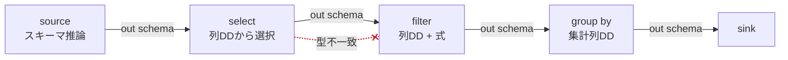
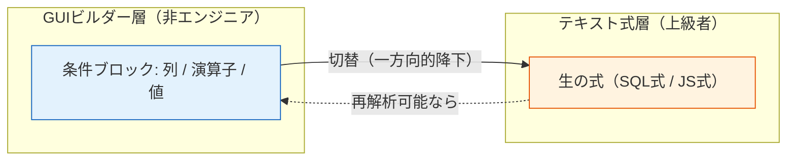
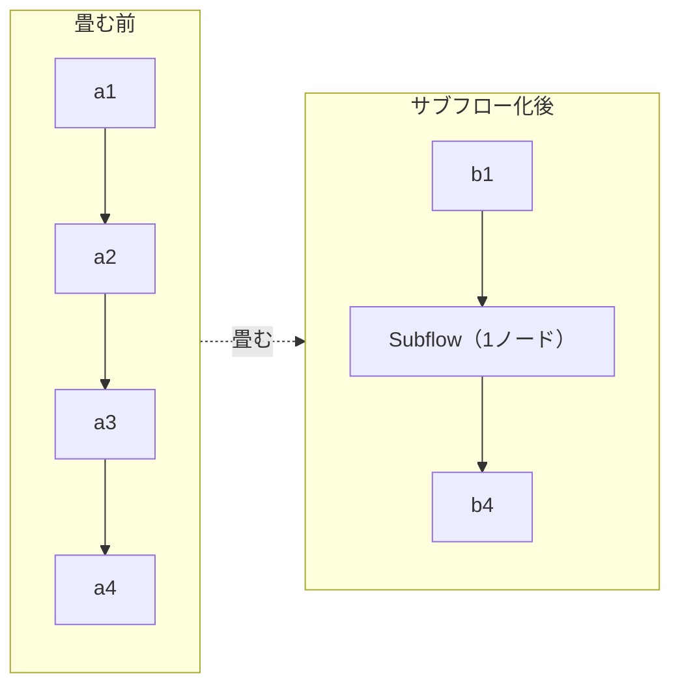
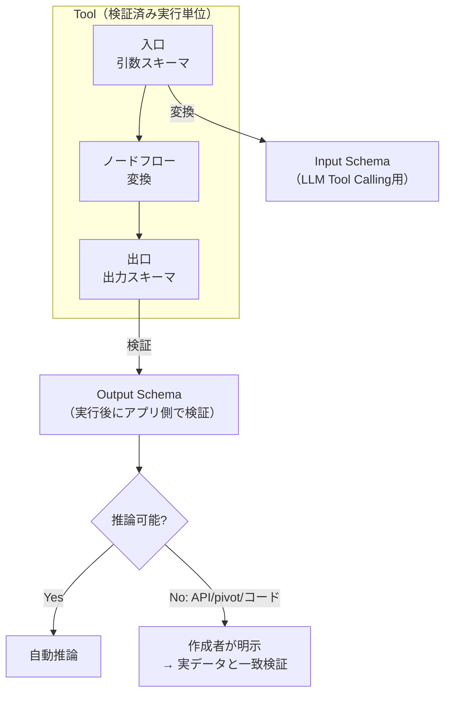

# 06. ETL ツールビルダー詳細仕様

> **ノーコード体験の心臓部。** 全体イメージは Azure のデータパイプラインのような機能性と操作感を目指す。

Tool = 「**入力スキーマ → 変換 → 出力スキーマ**」の検証済み実行単位。

---

## 1. ノード分類の全体像

```mermaid
flowchart LR
  subgraph SRC["入力 (source)"]
    S1["DB"]
    S2["ファイル CSV/JSON"]
    S3["API"]
    S4["エージェント引数"]
  end
  subgraph TRN["変換 (transform)"]
    T1["結合系: join / union"]
    T2["行操作: filter / sort / 重複排除"]
    T3["列操作: select / rename / cast / 計算列"]
    T4["整形: null処理 / 置換 / 文字列整形"]
    T5["集計: group by / ウィンドウ関数"]
    T6["表変換: pivot / unpivot / split / merge"]
    T7["時系列: 日付変換 / リサンプリング"]
  end
  subgraph ANL["分析 (analyze)"]
    A1["基本統計"]
    A2["相関分析"]
    A3["時系列分析"]
    A4["外れ値の検出・除外"]
  end
  subgraph SNK["出力 (sink)"]
    O1["可視化Chart Artifact"]
    O2["LLMへ渡す"]
    O3["ワークスペース格納"]
    O4["property graph Artifact"]
    O5["MCP公開"]
  end

  SRC --> TRN --> ANL --> SNK

  subgraph EXT["拡張ノード（Phase3）"]
    C1["制御: if/switch / foreach / try-catch<br/>→ Workflow Builderの責務"]
    C2["カスタムコード<br/>サンドボックス実行"]
  end

  classDef ext fill:#fff3e0,stroke:#e65100,color:#bf360c;
  class C1,C2 ext;
  style TRN fill:#e3f2fd,stroke:#1565c0,color:#0d47a1
```

> **重要**: 制御ノード（分岐/ループ/try-catch）はETLのデータ変換と実行規則が異なるため、Tool Builderへ混在させず **Workflow Builder** の責務とする（[01-architecture.md](./01-architecture.md#4-実行エンジンの三分割)）。

---

## 2. ノードリファレンス

### 2.1 入力 (source)

| ノード | 設定 | 出力スキーマ | v1 |
|---|---|---|:---:|
| ファイル | CSV / JSON、固定サンプル参照 | 推論 | ✅ |
| エージェント引数 | 画面で定義した引数 = 入力源 | 引数スキーマから確定 | ✅ |
| 現在日時（`current-datetime`） | timezone（IANA、省略時はサーバーローカル） | 固定1行（`now` / `date` / `yearMonth` / `time` / `weekday`） | ✅ |
| DB | 接続（SecretReference）、クエリ | 推論 / 明示 | Phase2 |
| API | エンドポイント、保存済みレスポンス切替 | 明示（推論不可） | Phase2 |
| Web検索 | 有効化済みprovider、検索語、取得件数 | 正規化済み検索結果 | ✅ 初期実装 |

### 2.2 変換 (transform)

| 分類 | ノード | 実装状況 |
|---|---|---|
| 結合 | `join`（inner/left/right/full）, `union` | **v15（次増分）** |
| 行 | `filter` | ✅ 実装済み |
| 行 | `sort`, 重複排除（`distinct`） | **v15（次増分）** |
| 列 | `select`, `rename`, `cast` | ✅ 実装済み |
| 列 | 計算列（式エディタ） | v16以降（式エディタと同時） |
| 整形 | null処理（`fill-null`）, 値の置換（`replace`） | **v15（次増分）** |
| 整形 | 文字列整形 | v16以降 |
| 集計 | `group by` 集計, ウィンドウ関数 | v16以降 |
| 表形式 | `pivot`, `unpivot`, `split`, `merge` | v16以降 |
| 時系列 | 日付変換, リサンプリング | v16以降 |

> v15 のスコープと各ノードの詳細契約は [implementation/v15-etl-transforms.md](../implementation/v15-etl-transforms.md)（[ADR-0015](./adr/0015-etl-transform-expansion.md)）。2入力ノード（join/union）は `EtlNode.inputArity=2` と `GraphEdge.toInput` を使う（エンジンは対応済み）。

### 2.3 分析 (analyze)

分析結果は通常の`Table`として後続ETLへ渡す。保存済みToolの計算は決定的に実行し、LLMは実行時の計算には使わない。

| ノード | 主な設定 | 出力 |
|---|---|---|
| `summary-statistics` | 対象列、group、平均・標準偏差・四分位など | group/対象列ごとのlong形式統計表 |
| `correlation-analysis` | 対象列、Pearson/Spearman、欠損処理 | 列pairごとの係数・有効件数 |
| `time-series-analysis` | 時刻列、値列、timezone、interval、集計、欠損bucket補完、window/lag | bucket/seriesごとのlong形式時系列表 |
| `outlier-filter` | IQR/z-score/MAD、閾値、flag/exclude | 判定列付き、または除外済みの表 |

外れ値は監査しやすい`flag`を推奨し、`exclude`時も除外前後の件数と規則を診断へ残す。時系列はIANA timezoneの暦境界（DSTを含む）を使用し、`zero`/`forward`で欠損bucketを補完できる（補完はパーティションあたり100,000 bucketまで。超えると期間を狭めるか粗いintervalを選ぶよう促すエラーになる）。アルゴリズム、上限、欠損値、timezone、LLM設定補助の詳細は [ADR-0031](./adr/0031-analytical-nodes-chart-output-and-local-llm-assistance.md) と [v31実装計画](../implementation/v31-analytics-chart-output-llm-assistance.md) を参照。

### 2.4 出力 (sink)

| ノード | 内容 |
|---|---|
| `agent-output` | 列・shape・表現・上限を指定し、結果をAgentへ直接返す |
| `workspace-output` | Agent Session WorkspaceへArtifactとして一時保存し、Agentへ参照を返す |
| `chart-output` | 型付けした可視化仕様をChart Artifactへ保存する。ヒストグラム、箱ひげ図、散布図、相関ヒートマップ、時系列、外れ値overlayを扱う |
| `graph-output` | 入力行をedgeへ変換するか、相関表を無向networkへ変換し、property graph Artifactへ保存する。相関networkでは係数・有効ペア数の下限を指定できる |
| 互換Chart.js出力 | 既存`agent-output`のchartjs形式、または`workspace-output`のchart Artifactとして扱う |
| MCP公開 | 作成ToolをMCPサーバとして公開 |

出力は「Agentへ直接渡す」系統と「Session Workspaceへ格納する」系統の2系統をサポートする。可視化チャートは`chart-output`、関係探索用property graphは`graph-output`と明確に分ける。新規Toolは終端にどれか1つの明示sinkを持つ。既存Toolの終端Transformは後方互換のため暗黙`agent-output`として扱う。

Session Workspaceは既存のProject Workspace（`TenantScope.workspaceId`）とは別物で、1会話/評価ケース内だけで使う一時Artifact領域である。大量payloadをLLM contextやRun traceへ埋め込まず、表・JSON・可視化・property graph・blobをcatalog + payload storeで管理する。詳細は [ADR-0027](./adr/0027-tool-output-and-session-workspace.md) と [v28実装計画](../implementation/v28-tool-output-session-workspace.md) を参照。

---

## 3. ノーコードを成立させる仕掛け

### 3.1 スキーマ自動伝播

各ノードの出力スキーマを推論し、下流ノードの列選択をドロップダウンで提示する。

> 型不一致の接続線は赤で表示する（上図の点線）。スキーマ状態は5値（`確定 / 部分確定 / 推論 / 不明 / 不一致`）で区別する。状態遷移は [03-domain-model.md](./03-domain-model.md#4-スキーマ状態の遷移) を参照。

### 3.2 式エディタ（GUI ↔ テキストの二層）

filter条件・計算列を **GUIビルダーで組む → 上級者は生の式に切替**。ここが no-code / code の境界。

filter条件は文字列比較（`eq` / `neq` / `contains`）に限り `caseInsensitive: true` を指定でき、大文字小文字を区別せず照合する（既定は区別する。数値・日付・大小比較・isNull/notNull には作用しない）。UIでは該当演算子を選んだときだけ「大文字と小文字を区別しない」チェックボックスが現れる。

### 3.3 データプロファイリング

入力データの **件数・null率・値分布・型** を自動表示。変換設計の前提が一目で分かる。

### 3.4 サブフロー化

複雑なフローの一部を1ノードに畳んで再利用（ツールの再帰的合成）。

### 3.5 サンプル固定 & スナップショットテスト（ツール検証）

代表入力を保存し、変更で出力が変わったら差分検知する（回帰の最小手段）。左ナビ「確かめる → **ツール検証** (Tool Check)」（`#/toolcheck`）で提供する。

- **単体実行**: 保存済みツールを選び、`inputSchema` の列から自動生成された引数フォーム（number → 数値入力、boolean → true/false、date → ISO 文字列、nullable 列は「未指定(null)」トグル）に値を入れて実行する。エージェント実行と同じ経路（全行で計算・副作用なし）で動き、`agentTool.description` があればエージェントに見せている説明も並べて表示する。`inputSchema` の無いツールは「引数なし」として `{}` で実行する。
- **期待 (expectations)**: すべて任意。行数（`== / >= / <=`）、存在すべき列、セル条件（列・演算子 `eq / neq / gte / lte / contains`・値・「いずれかの行 / すべての行」）、所要時間上限 (ms)、**実行の結末**（指定なし / 成功すること / 失敗すること）。埋めた項目だけをサーバーへ送り、結果は `passed / failed / error` と項目ごとの ✓ / ✕（期待・実測は英語定型文をUIで日本語化）で返る。「失敗すること」（`outcome: 'error'`）は異常系ケース用で、引数不正やノードエラーで実行が失敗したら **合格** になる（他の期待は評価しない）。このとき結果は合格バナーのまま失敗の内容を情報として添え、直すボタンは出さない。
- **結果**: 合否バナー → 期待の表 → 出力（スキーマ帯 + 先頭 100 行、全行数が多いときは「全 N 行のうち M 行を表示」）→ ノード別の行数 → 所要時間。`error` のときは他画面と同じ並び（次の一手 → 原因 → 失敗箇所 → 「ツール「x」のノード「n」を開いて直す」ボタン）で、Tool Builder の該当ノードへ一手で戻れる。`TOOL_ARGUMENTS` は該当の引数欄を赤く示し、「引数「x」の欄へ」ボタンで戻す。
- **ケース**: 引数と期待に名前を付けて保存する（版を固定するか最新版を追うかを選べる）。左列の一覧から 実行 / 開く / 削除 でき、直近の結果チップ（合格 / 不合格 / エラー / 未実行）と実行日時を持つ。「すべて実行」で全ケース（または選択中のツールのケース）をまとめて再実行し、合格 / 不合格 / エラーの件数と各ケースの結果を出す。1件がエラーでも残りは続行する。
- 編集中の引数・期待はケースとして保存するまで「未保存」として扱い、ツールの切り替え・別ケースを開く・画面遷移で確認を挟む。
- **LLM によるケース提案**: エディタの「**LLMでケースを提案**」で、設定中のモデルがツール定義（入力・出力スキーマ、エージェント向け説明）から **正常 / 境界 / 異常** のケース案（カテゴリごと 1〜5 件、既定 2 件。「重点」を自由文で指定できる）を作る。提案はサーバーに保存されず、カードごとに **実行して確認**（合否チップを表示）→ **エディタに読み込む**（直してから保存）→ **保存**（提案名のままケースに追加、保存済みチップ）と進む。「すべて実行」「すべて保存」でまとめて扱える。異常系の提案は「失敗が期待値」（`outcome: 'error'`）を持つことが多く、実行して失敗すれば合格になる。サーバー側で落とした・直した点（未宣言の引数の除去、型変換など）は ⚠ で示す。構造化出力（JSON スキーマ）に対応したモデルが必要で、対応していない設定ではボタンが無効になり、設定画面への導線を出す（`GET /runtime/capabilities` の `toolCheckSuggestions.enabled`）。

API は `POST /tool-checks/run`（即時実行）、`GET/POST /tool-checks/cases`、`DELETE /tool-checks/cases/:id`、`POST /tool-checks/cases/:id/run`、`POST /tool-checks/cases/run-all`、`POST /tool-checks/suggest`（LLM 提案。失敗は 502 `MODEL_PROVIDER`）。DTO は `src/ui/api/types.ts` 末尾（`RunToolCheckDto` / `ToolCheckRunResultDto` / `ToolCheckCaseDto` / `ToolCheckSuggestionsDto`）と `src/application/tool-check` を対で保守する。

### 3.6 副作用の宣言

各Toolを `read-only / session-write / write / external-action` としてメタデータ宣言する。`session-write`は一時Artifactだけを書き、preview/testで許可する。Project Workspaceや外部状態への書き込みは従来どおり承認対象とする。エージェント実行時の安全性（承認要否・冪等性）に直結（[08-security-auth.md](./08-security-auth.md)）。

### 3.7 構造化設定UIと段階的ダイアログ

Node設定の通常操作では`column:type`やカンマ区切りを入力させず、上流schemaから生成したcombobox、multi-select、型別value input、Rule Tableを使う。

- 右Inspector: node概要、schema状態、1〜3項目のquick settings、validation、設定Dialogへの導線。
- 設定Dialog: join/rename/cast/sort/replace、入力schema、source payload、Output deliveryなど、横幅や反復行を必要とする編集。
- Dialog内の変更はlocal draftへ保持し、Apply時に1操作でgraphへ反映する。Cancelでは元configを保持する。
- raw JSON/CSVや一括文字列編集はAdvancedタブのescape hatchとして残す。
- schema不明時を除き、列名の自由入力は既定で許可しない。上流変更で消えた列はinvalid chipとして可視化する。

control対応、Dialog layout、accessibility、node別配置は [ADR-0028](./adr/0028-structured-node-configuration-ui.md) を参照。

### 3.8 Agent Input の条件バインドと公開契約

`agent-input`は、行データのsourceとして接続する用途に加え、未接続ならTool Callingの引数宣言として使える。たとえばデータsource → `filter` のフローに対し、`filter.valueBinding = { source: 'agent-input', field: 'minimumScore' }` を設定すると、呼び出しごとの`minimumScore`で行を絞り込める。

- 設計時previewはFilterに保持した固定`value`をサンプルとして使う。Agent実行時は同じ値を指定フィールドの実引数で上書きする。
- 保存時にbinding先がInput Schemaに存在することを検証する。存在しないフィールドは保存できない。

値に加えて**演算子そのもの**もAgent引数にできる。filter条件の `opBinding = { source: 'agent-input', field, allowed? }` を設定すると、Agentは呼び出しごとに比較方法（「以降/以前」「ちょうど/含む」など）を選べる。

- binding先の引数はInput Schema上 **string型**で宣言する（保存時に検証。違反は保存できない）。
- `allowed` はAgentが選べる演算子の許可リスト（省略時は全演算子）。同一引数を複数条件がバインドする場合、Tool Calling契約のJSON Schemaには**全条件の積集合**が `enum` として公開され、実行時の検証とエラーメッセージも同じ積集合に基づく（公開enumに載る演算子は必ず実行できる）。許可外・不正な値は引数エラーとしてモデルの修復ループへ返す。
- 設計時の `op` は設計previewのサンプルであり、引数が任意（nullable）で実行時に省略された場合の**既定演算子**にもなる（`op` は `allowed` に含まれている必要がある）。同一引数をバインドする複数条件の既定演算子は**全条件で一致**していなければならない（保存時に検証）。
- 列型がnumber|date以外の列では、`allowed`（省略時は全演算子）に `gt/gte/lt/lte` を含められない（設計時スキーマ検証でerror）。UIはnumber|date列の初期許可リストから `contains`（String化部分一致）を外す — 必要ならチェックボックスで明示的に戻せる。
- **同一の引数を条件値（valueBinding）と演算子（opBinding）の両方にはバインドできない**（保存時に拒否。値引数と演算子引数は別々に宣言する）。
- `allowed` に `isNull`/`notNull` を含める場合、同じ条件の値引数（valueBinding先）は**nullableで宣言**しなければならない（保存時に検証）。opBinding経由で演算子が `isNull`/`notNull` へ解決された条件は値を使わない（値側のnullable引数が省略されていても条件はスキップされない）。opBindingを持たない条件は従来どおり「nullable引数の省略＝条件スキップ」が働く。
- Input Schemaに宣言されていないフィールドを参照するopBinding（旧データ等）は実行時に不活性となり、設計時の `op` がそのまま使われる。
- Toolの表示名・公開名と、Agentへ提示するFunction名・説明は分ける。`agentTool.name`と`agentTool.description`が設定されていれば、Function Calling定義とAgent promptはそれを使用する。
- Tool BuilderにはETL設計用previewだけを置く。以前のAgent chat preview領域は、Agentが受け取るTool Calling契約の編集パネルに置き換える。ここで`agentTool.name`、`agentTool.description`、Agent Input由来の引数名・型・必須性、推論済みの返却schema、side effectを確認できる。LLMを使う会話previewはAgent BuilderまたはChatで実行する。

### 3.9 新規フォームの初期表示

新規作成フォームには実運用の値や英語サンプルを初期入力しない。値は空欄とし、入力例だけをプレースホルダーで示す。プレースホルダーはUIの言語設定に従い、日本語では日本語の例示へ切り替える。既存の保存済み定義を読み込んだ場合だけ、保存されている実値をフォームへ表示する。

### 3.10 再利用データソース

サイドバーの「データソース」でCSV/JSONファイルとDB接続を管理する。Tool Builderのsourceノードでは、インライン編集に加えて登録済みソースを選択できる。

- CSV/JSON: Tool定義には`dataSourceId`だけを保存する。本文はbackendのpayload storeにあり、未保存preview・保存時検証・保存済みTool実行の直前にだけ展開する。
- DB: `database-source`は登録済みのDBデータソース、環境変数で許可したtable/view、最大行数を指定する。任意SQL・書き込み・allowlist外のtable/viewは許可しない。
- DBクエリはbackendが読み取り専用トランザクションで実行し、行数を1〜10,000へ制限する。接続文字列とパスワードはブラウザ、Tool定義、Run traceへ含めない。
- DB資格情報は`AGENTCONTEXT_DB_CONNECTIONS`と`passwordEnv`でbackendだけが解決する。設定例はリポジトリ直下の[.env.example](../.env.example)を参照する。

詳細な安全境界は[ADR-0029](./adr/0029-data-source-registry.md)を参照。

### 3.11 任意のWeb検索データソース

Tavily、TinyFish、Google Custom Searchを、ETLの行データを生成する任意providerとして扱う。検索APIのキーはbackend環境変数だけで解決し、Tool定義、ブラウザ、Run traceへ含めない。

- `TAVILY_API_KEY`、`TINYFISH_API_KEY`、またはGoogle用の`GOOGLE_CUSTOM_SEARCH_API_KEY`と`GOOGLE_CUSTOM_SEARCH_ENGINE_ID`がすべて存在するproviderだけを有効にする。APIは有効providerの`id`、表示名、能力だけをUIへ返す。
- 有効providerが0件なら、Tool Builderのノードパレット、source選択、設定DialogにWeb検索を表示しない。既存定義で無効providerを参照した実行は、UI非表示に頼らずbackendで拒否する。
- `web-search-source`は`provider`、固定文字列またはAgent Inputにbindした`query`、`maxResults`、任意の許可domain・鮮度条件を持つ。出力は`title`、`url`、`snippet`、`score`、`provider`、`retrievedAt`へ正規化した表とする。
- 自動draft previewは外部検索を起動しない。作成者が`検索結果を取得`を明示したときだけbackendが実行し、結果はprovider、検索条件、取得時刻、15分TTLを持つサーバー内キャッシュへ保存する。Tool graphは結果本文ではなく`cacheKey`だけを保持し、previewとTool実行はそのキャッシュだけを読む。
- 初期実装は最大10件、10秒timeout、64KiB応答上限をbackendで強制する。キャッシュはプロセス再起動で失われる。キャッシュ永続化、呼出頻度・予算の組織ポリシー、本番実行時の明示更新は後続範囲とする。検索結果本文の無制限な収集や任意URLのfetchは初期範囲に含めない。

Google Custom Searchは公開されている移行予定を踏まえ、互換providerとして隔離する。新規の標準providerにはせず、画面にも`Google Custom Search（legacy）`と表示する。詳細なPort、API、失敗時の扱い、実装順序は[ADR-0030](./adr/0030-optional-web-search-providers.md)を参照。

### 3.12 ローカルLLMによる分析設定補助

基本統計、相関、時系列、外れ値の設定Dialogでは、schemaと決定的data profileから推奨初期値を作れる。`LM_STUDIO_MODEL`が設定され、structured outputを利用できる場合だけ「ローカルLLMで設定案」を表示する。

- LLMへ渡す既定情報はschema、型、null率、distinct数、範囲、現在設定、ユーザーの分析目的に限定する。
- raw sampleは明示opt-inとし、マスキング後に最大20行かつ8 KiBへ制限する。
- LLMは厳格なJSON形式の設定案を返し、backendがnode設定、schema伝播、bounded previewを検証する。
- 設定案は自動適用・自動保存しない。現在値との差分、仮定、警告、previewを確認してからユーザーがApplyする。
- 保存済みToolの実行計算にはLLMを使わない。

詳細は[ADR-0031](./adr/0031-analytical-nodes-chart-output-and-local-llm-assistance.md)を参照。

---

## 4. I/O 契約化（検証可能な境界）

- フロー入口 = **引数スキーマ**、出口 = **出力スキーマ**。
- 引数スキーマ → LLM Tool Calling 用 **Input Schema** に変換。
- Agent向けTool契約の **name / description** は、画面表示用metadataと別に保存できる。未設定の既存Toolは公開名・表示名から後方互換で導出する。
- 出力スキーマ → 実行後にアプリ側で検証する **Output Schema**。
- **保存時に契約を検証する**: モデルへ公開する function 名（`agentTool.name`、未設定なら公開名）が `[A-Za-z0-9_-]{1,64}` に合うこと、引数スキーマと Agent Input ノードの列が一致すること、宣言した出力スキーマがグラフの推論結果と矛盾しないこと。いずれも実行時と同じ判定関数で検査し、違反は保存ボタンの横に「何を直すか」付きで表示する（実行して初めて分かる状態を作らない）。
- **呼び出し診断**（保存前の下書きに対する事前検査）: Tool Builder の「呼び出し診断」ボタンは `POST /tool-drafts/diagnose` で function 定義・引数整合・データソース解決・グラフ検証・サンプル実行・出力スキーマ整合・演算子引数・副作用・公開状態を段階別に検査し、問題のある項目には直す場所（ノード／エージェント向けコンテキスト／出力）を開くボタンを付ける。検査項目の一覧は [19-troubleshooting.md](./19-troubleshooting.md#実行前に見つける-組み込みチェック--呼び出し診断)。
- **失敗箇所への導線**: エージェント実行でツールが失敗すると、失敗したツールとノードIDが Run のトレース（`error` イベントの `tool` / `nodeId`）に残り、チャット・動作確認・ステータス画面から「ツール「…」のノード「…」を開いて直す」で該当ノードを選択した状態の Tool Builder へ移動できる。
- Zod（実装時検証）と JSON Schema（保存・交換）の使い分けは [02-tech-stack.md](./02-tech-stack.md#zod-と-json-schema-の使い分けideas-v2-1) 参照。
- スキーマ・APIの詳細は [04-api-spec.md](./04-api-spec.md#4-tool-callingスキーマinput--output) 参照。

---

## 5. プレビュー実行規則

`ideas-v2.md §8` に基づく安全なプレビュー。

| 規則 | 内容 |
|---|---|
| データソース | 固定サンプル or 明示取得キャッシュのみ |
| 制限（表示） | `rowLimit`（既定 100 行）は画面へ返すスナップショットの行数だけを絞る。計算は常に全行で行い、各ノードは全行数 `rowCount` と `truncated` を返す（UI は「全 1,250 行のうち 100 行を表示」と示す）。終端の全行（`fullOutput`）はブラウザへ送らない |
| 制限（実行） | 1 ノードの生成行数の上限は 250,000 行（`DEFAULT_MAX_EXECUTION_ROWS`）。超過は切り捨てず `nodeId` 付きの `ETL_SCHEMA`（422）で止める。`join` は出力 100,000 行（`MAX_JOIN_ROWS`）、`time-series-analysis` の欠損 bucket 補完はパーティションあたり 100,000 bucket（`MAX_TIME_SERIES_FILL_BUCKETS`）で先に止まる。Agent 実行の Tool call も同じ規則で全行を計算する（[07 §3](./07-execution-model.md#3-agentチャット実行tool-calling)） |
| 書き込み | プレビューでは実行しない。代わりに入力と予想操作内容を表示 |
| 外部API | 保存済みレスポンスへ切替可能（課金・レート制限・外部状態に非依存） |
| モード表示 | preview / test / production を明確に表示し、使用データと権限を分離 |

プレビュー実行のシーケンスは [07-execution-model.md](./07-execution-model.md#2-toolプレビュー実行) を参照。

---

## 6. 横断機能（キャンバス操作）

`ideas-v2.md §5` より。

- undo / redo・複製・コピー（キャンバスの基本作法）
- インライン・ドキュメント / ツールチップ（各ノード・設定の説明をその場で）
- 実行トレースの最小可視化（どのノード・どのサンプル行で落ちたかを色で示す）
- テンプレートギャラリー（ツール/スキル/エージェント/ワークフローの雛形）

---

## 7. エスケープハッチ（この画面の出口）

| ノーコード | エスケープハッチ（コード） |
|---|---|
| ノード + GUI式 | 生SQL / JS式 → **カスタムコードノード** |
| ノードフロー全体 | **Mastraツールとしてコード書き出し** |

- カスタムコードノードは「ノーコードプロジェクト内の不透明な1ノード」として保存・再編集可能。
- サンドボックス提供条件: 実行時間・メモリ・CPU・ネットワーク・ファイルアクセス・利用可能パッケージの制限（[08-security-auth.md](./08-security-auth.md)）。
