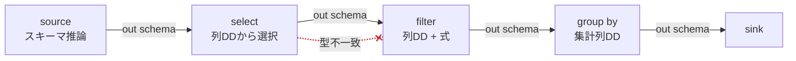
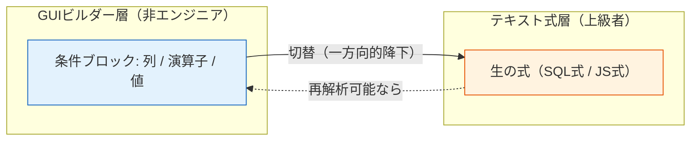
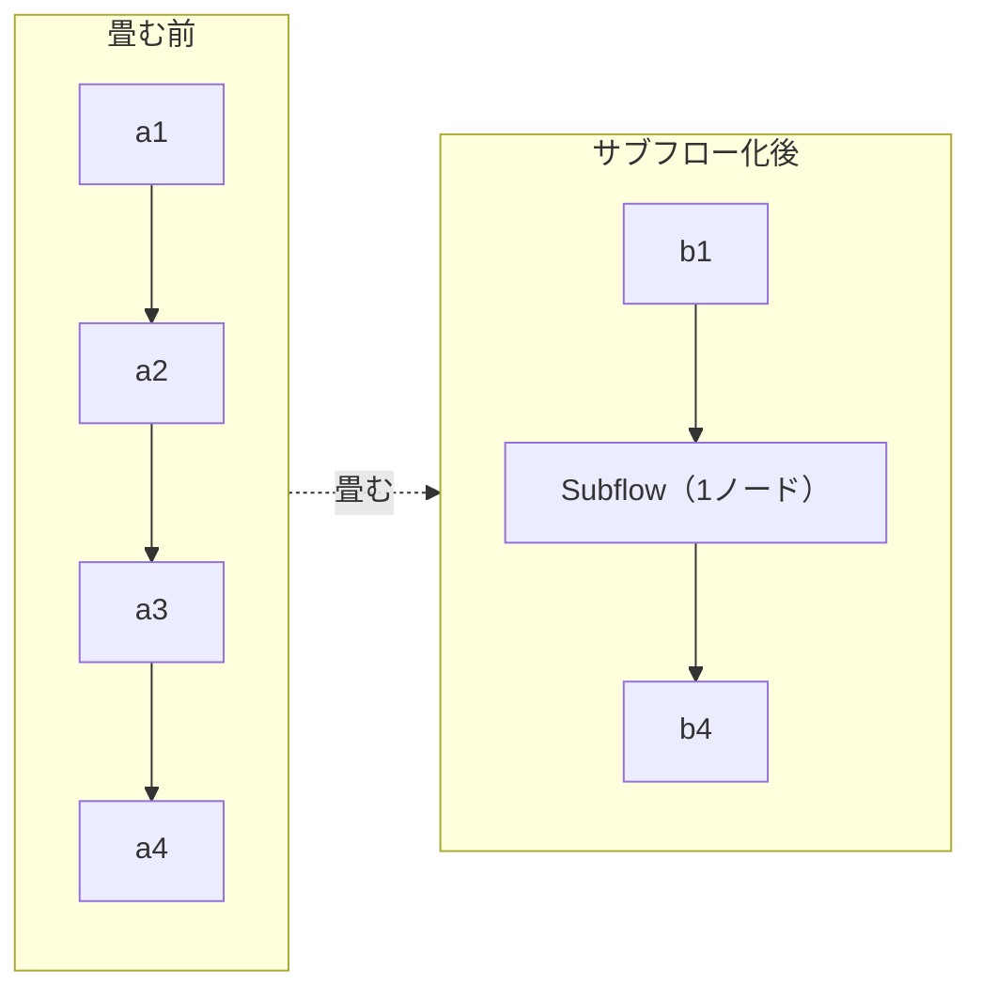
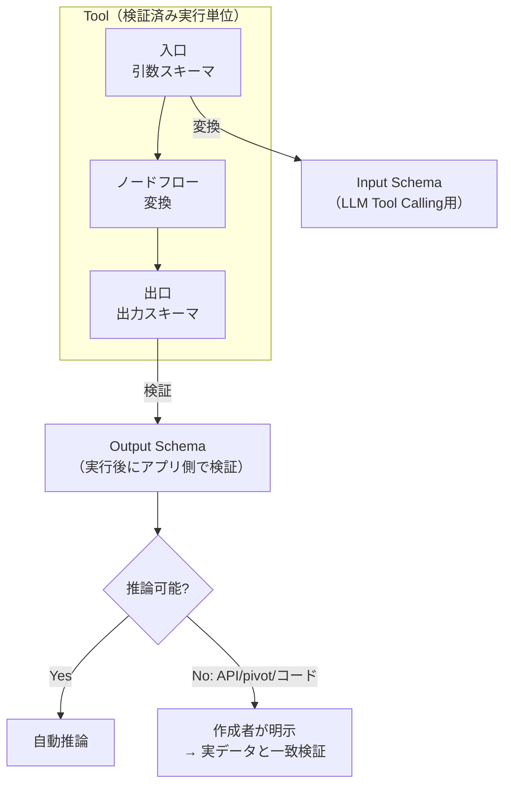

# 06. ETL ツールビルダー詳細仕様

> **ノーコード体験の心臓部。** 全体イメージは Azure のデータパイプラインのような機能性と操作感を目指す。

Tool = 「**入力スキーマ → 変換 → 出力スキーマ**」の検証済み実行単位。

---

## 1. ノード分類の全体像

```mermaid
flowchart LR
  subgraph SRC["入力 (source)"]
    S1["DB"]
    S2["ファイル CSV/JSON"]
    S3["API"]
    S4["エージェント引数"]
  end
  subgraph TRN["変換 (transform)"]
    T1["結合系: join / union"]
    T2["行操作: filter / sort / 重複排除"]
    T3["列操作: select / rename / cast / 計算列"]
    T4["整形: null処理 / 置換 / 文字列整形"]
    T5["集計: group by / ウィンドウ関数"]
    T6["表変換: pivot / unpivot / split / merge"]
    T7["時系列: 日付変換 / リサンプリング"]
  end
  subgraph ANL["分析 (analyze)"]
    A1["基本統計"]
    A2["相関分析"]
    A3["時系列分析"]
  end
  subgraph SNK["出力 (sink)"]
    O1["Chart.js グラフデータ"]
    O2["LLMへ渡す"]
    O3["ワークスペース格納"]
    O4["MCP公開"]
  end

  SRC --> TRN --> ANL --> SNK

  subgraph EXT["拡張ノード（Phase3）"]
    C1["制御: if/switch / foreach / try-catch<br/>→ Workflow Builderの責務"]
    C2["カスタムコード<br/>サンドボックス実行"]
  end

  classDef ext fill:#fff3e0,stroke:#e65100,color:#bf360c;
  class C1,C2 ext;
  style TRN fill:#e3f2fd,stroke:#1565c0,color:#0d47a1
```

> **重要**: 制御ノード（分岐/ループ/try-catch）はETLのデータ変換と実行規則が異なるため、Tool Builderへ混在させず **Workflow Builder** の責務とする（[01-architecture.md](./01-architecture.md#4-実行エンジンの三分割)）。

---

## 2. ノードリファレンス

### 2.1 入力 (source)

| ノード | 設定 | 出力スキーマ | v1 |
|---|---|---|:---:|
| ファイル | CSV / JSON、固定サンプル参照 | 推論 | ✅ |
| エージェント引数 | 画面で定義した引数 = 入力源 | 引数スキーマから確定 | ✅ |
| DB | 接続（SecretReference）、クエリ | 推論 / 明示 | Phase2 |
| API | エンドポイント、保存済みレスポンス切替 | 明示（推論不可） | Phase2 |

### 2.2 変換 (transform)

| 分類 | ノード | 実装状況 |
|---|---|---|
| 結合 | `join`（inner/left/right/full）, `union` | **v15（次増分）** |
| 行 | `filter` | ✅ 実装済み |
| 行 | `sort`, 重複排除（`distinct`） | **v15（次増分）** |
| 列 | `select`, `rename`, `cast` | ✅ 実装済み |
| 列 | 計算列（式エディタ） | v16以降（式エディタと同時） |
| 整形 | null処理（`fill-null`）, 値の置換（`replace`） | **v15（次増分）** |
| 整形 | 文字列整形 | v16以降 |
| 集計 | `group by` 集計, ウィンドウ関数 | v16以降 |
| 表形式 | `pivot`, `unpivot`, `split`, `merge` | v16以降 |
| 時系列 | 日付変換, リサンプリング | v16以降 |

> v15 のスコープと各ノードの詳細契約は [implementation/v15-etl-transforms.md](../implementation/v15-etl-transforms.md)（[ADR-0015](./adr/0015-etl-transform-expansion.md)）。2入力ノード（join/union）は `EtlNode.inputArity=2` と `GraphEdge.toInput` を使う（エンジンは対応済み）。

### 2.3 分析 (analyze)

基本統計 / 相関分析 / 時系列分析。ETLフロー内でも設定・実行できる。

### 2.4 出力 (sink)

| ノード | 内容 |
|---|---|
| `agent-output` | 列・shape・表現・上限を指定し、結果をAgentへ直接返す |
| `workspace-output` | Agent Session WorkspaceへArtifactとして一時保存し、Agentへ参照を返す |
| Chart.js グラフデータ | `agent-output`のchartjs形式、または`workspace-output`のchart Artifactとして扱う |
| MCP公開 | 作成ToolをMCPサーバとして公開 |

出力は「Agentへ直接渡す」系統と「Session Workspaceへ格納する」系統の2系統をサポートする。新規Toolは終端にどちらか1つの明示sinkを持つ。既存Toolの終端Transformは後方互換のため暗黙`agent-output`として扱う。

Session Workspaceは既存のProject Workspace（`TenantScope.workspaceId`）とは別物で、1会話/評価ケース内だけで使う一時Artifact領域である。大量payloadをLLM contextやRun traceへ埋め込まず、表・JSON・可視化・property graph・blobをcatalog + payload storeで管理する。詳細は [ADR-0027](./adr/0027-tool-output-and-session-workspace.md) と [v28実装計画](../implementation/v28-tool-output-session-workspace.md) を参照。

---

## 3. ノーコードを成立させる仕掛け

### 3.1 スキーマ自動伝播

各ノードの出力スキーマを推論し、下流ノードの列選択をドロップダウンで提示する。

> 型不一致の接続線は赤で表示する（上図の点線）。スキーマ状態は5値（`確定 / 部分確定 / 推論 / 不明 / 不一致`）で区別する。状態遷移は [03-domain-model.md](./03-domain-model.md#4-スキーマ状態の遷移) を参照。

### 3.2 式エディタ（GUI ↔ テキストの二層）

filter条件・計算列を **GUIビルダーで組む → 上級者は生の式に切替**。ここが no-code / code の境界。

### 3.3 データプロファイリング

入力データの **件数・null率・値分布・型** を自動表示。変換設計の前提が一目で分かる。

### 3.4 サブフロー化

複雑なフローの一部を1ノードに畳んで再利用（ツールの再帰的合成）。

### 3.5 サンプル固定 & スナップショットテスト

代表入力を保存し、変更で出力が変わったら差分検知する（回帰の最小手段）。

### 3.6 副作用の宣言

各Toolを `read-only / session-write / write / external-action` としてメタデータ宣言する。`session-write`は一時Artifactだけを書き、preview/testで許可する。Project Workspaceや外部状態への書き込みは従来どおり承認対象とする。エージェント実行時の安全性（承認要否・冪等性）に直結（[08-security-auth.md](./08-security-auth.md)）。

### 3.7 構造化設定UIと段階的ダイアログ

Node設定の通常操作では`column:type`やカンマ区切りを入力させず、上流schemaから生成したcombobox、multi-select、型別value input、Rule Tableを使う。

- 右Inspector: node概要、schema状態、1〜3項目のquick settings、validation、設定Dialogへの導線。
- 設定Dialog: join/rename/cast/sort/replace、入力schema、source payload、Output deliveryなど、横幅や反復行を必要とする編集。
- Dialog内の変更はlocal draftへ保持し、Apply時に1操作でgraphへ反映する。Cancelでは元configを保持する。
- raw JSON/CSVや一括文字列編集はAdvancedタブのescape hatchとして残す。
- schema不明時を除き、列名の自由入力は既定で許可しない。上流変更で消えた列はinvalid chipとして可視化する。

control対応、Dialog layout、accessibility、node別配置は [ADR-0028](./adr/0028-structured-node-configuration-ui.md) を参照。

### 3.8 Agent Input の条件バインドと公開契約

`agent-input`は、行データのsourceとして接続する用途に加え、未接続ならTool Callingの引数宣言として使える。たとえばデータsource → `filter` のフローに対し、`filter.valueBinding = { source: 'agent-input', field: 'minimumScore' }` を設定すると、呼び出しごとの`minimumScore`で行を絞り込める。

- 設計時previewはFilterに保持した固定`value`をサンプルとして使う。Agent実行時は同じ値を指定フィールドの実引数で上書きする。
- 保存時にbinding先がInput Schemaに存在することを検証する。存在しないフィールドは保存できない。
- Toolの表示名・公開名と、Agentへ提示するFunction名・説明は分ける。`agentTool.name`と`agentTool.description`が設定されていれば、Function Calling定義とAgent promptはそれを使用する。
- Tool BuilderにはETL設計用previewだけを置く。以前のAgent chat preview領域は、Agentが受け取るTool Calling契約の編集パネルに置き換える。ここで`agentTool.name`、`agentTool.description`、Agent Input由来の引数名・型・必須性、推論済みの返却schema、side effectを確認できる。LLMを使う会話previewはAgent BuilderまたはChatで実行する。

### 3.9 新規フォームの初期表示

新規作成フォームには実運用の値や英語サンプルを初期入力しない。値は空欄とし、入力例だけをプレースホルダーで示す。プレースホルダーはUIの言語設定に従い、日本語では日本語の例示へ切り替える。既存の保存済み定義を読み込んだ場合だけ、保存されている実値をフォームへ表示する。

---

## 4. I/O 契約化（検証可能な境界）

- フロー入口 = **引数スキーマ**、出口 = **出力スキーマ**。
- 引数スキーマ → LLM Tool Calling 用 **Input Schema** に変換。
- Agent向けTool契約の **name / description** は、画面表示用metadataと別に保存できる。未設定の既存Toolは公開名・表示名から後方互換で導出する。
- 出力スキーマ → 実行後にアプリ側で検証する **Output Schema**。
- Zod（実装時検証）と JSON Schema（保存・交換）の使い分けは [02-tech-stack.md](./02-tech-stack.md#zod-と-json-schema-の使い分けideas-v2-1) 参照。
- スキーマ・APIの詳細は [04-api-spec.md](./04-api-spec.md#4-tool-callingスキーマinput--output) 参照。

---

## 5. プレビュー実行規則

`ideas-v2.md §8` に基づく安全なプレビュー。

| 規則 | 内容 |
|---|---|
| データソース | 固定サンプル or 明示取得キャッシュのみ |
| 制限 | 行数・データサイズ・実行時間を制限 |
| 書き込み | プレビューでは実行しない。代わりに入力と予想操作内容を表示 |
| 外部API | 保存済みレスポンスへ切替可能（課金・レート制限・外部状態に非依存） |
| モード表示 | preview / test / production を明確に表示し、使用データと権限を分離 |

プレビュー実行のシーケンスは [07-execution-model.md](./07-execution-model.md#2-toolプレビュー実行) を参照。

---

## 6. 横断機能（キャンバス操作）

`ideas-v2.md §5` より。

- undo / redo・複製・コピー（キャンバスの基本作法）
- インライン・ドキュメント / ツールチップ（各ノード・設定の説明をその場で）
- 実行トレースの最小可視化（どのノード・どのサンプル行で落ちたかを色で示す）
- テンプレートギャラリー（ツール/スキル/エージェント/ワークフローの雛形）

---

## 7. エスケープハッチ（この画面の出口）

| ノーコード | エスケープハッチ（コード） |
|---|---|
| ノード + GUI式 | 生SQL / JS式 → **カスタムコードノード** |
| ノードフロー全体 | **Mastraツールとしてコード書き出し** |

- カスタムコードノードは「ノーコードプロジェクト内の不透明な1ノード」として保存・再編集可能。
- サンドボックス提供条件: 実行時間・メモリ・CPU・ネットワーク・ファイルアクセス・利用可能パッケージの制限（[08-security-auth.md](./08-security-auth.md)）。
