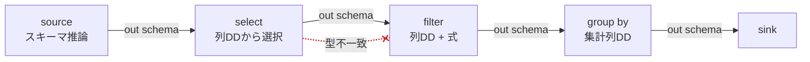
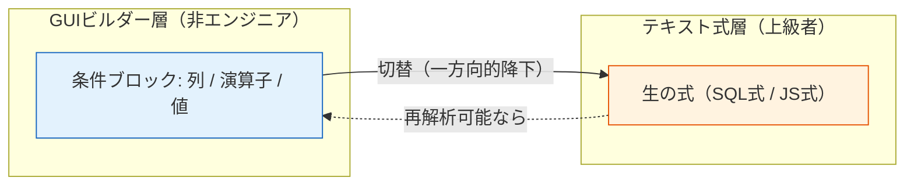
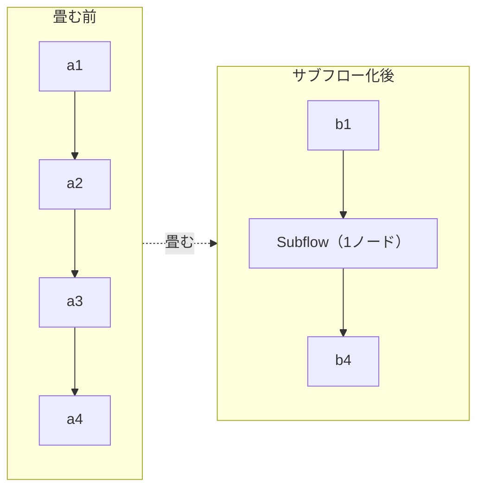
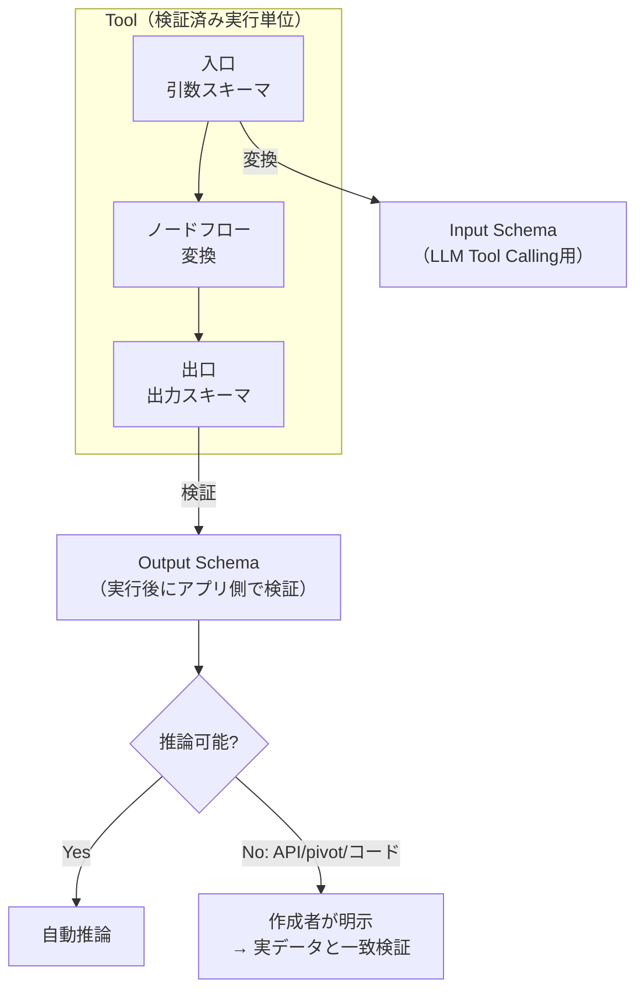

# 06. ETL ツールビルダー詳細仕様

> 参照: [`ideas.md` ETL節](../ideas/ideas.md) / [`ideas-v2.md` §1](../ideas/ideas-v2.md)
>
> **ノーコード体験の心臓部。** 全体イメージは Azure のデータパイプラインのような機能性と操作感を目指す。

Tool = 「**入力スキーマ → 変換 → 出力スキーマ**」の検証済み実行単位。

---

## 1. ノード分類の全体像

```mermaid
flowchart LR
  subgraph SRC["入力 (source)"]
    S1["DB"]
    S2["ファイル CSV/JSON"]
    S3["API"]
    S4["エージェント引数"]
  end
  subgraph TRN["変換 (transform)"]
    T1["結合系: join / union"]
    T2["行操作: filter / sort / 重複排除"]
    T3["列操作: select / rename / cast / 計算列"]
    T4["整形: null処理 / 置換 / 文字列整形"]
    T5["集計: group by / ウィンドウ関数"]
    T6["表変換: pivot / unpivot / split / merge"]
    T7["時系列: 日付変換 / リサンプリング"]
  end
  subgraph ANL["分析 (analyze)"]
    A1["基本統計"]
    A2["相関分析"]
    A3["時系列分析"]
  end
  subgraph SNK["出力 (sink)"]
    O1["Chart.js グラフデータ"]
    O2["LLMへ渡す"]
    O3["ワークスペース格納"]
    O4["MCP公開"]
  end

  SRC --> TRN --> ANL --> SNK

  subgraph EXT["拡張ノード（Phase3）"]
    C1["制御: if/switch / foreach / try-catch<br/>→ Workflow Builderの責務"]
    C2["カスタムコード<br/>サンドボックス実行"]
  end

  classDef ext fill:#fff3e0,stroke:#e65100,color:#bf360c;
  class C1,C2 ext;
  style TRN fill:#e3f2fd,stroke:#1565c0,color:#0d47a1
```

> **重要**: 制御ノード（分岐/ループ/try-catch）はETLのデータ変換と実行規則が異なるため、Tool Builderへ混在させず **Workflow Builder** の責務とする（[01-architecture.md](./01-architecture.md#4-実行エンジンの三分割)）。

---

## 2. ノードリファレンス

### 2.1 入力 (source)

| ノード | 設定 | 出力スキーマ | v1 |
|---|---|---|:---:|
| ファイル | CSV / JSON、固定サンプル参照 | 推論 | ✅ |
| エージェント引数 | 画面で定義した引数 = 入力源 | 引数スキーマから確定 | ✅ |
| DB | 接続（SecretReference）、クエリ | 推論 / 明示 | Phase2 |
| API | エンドポイント、保存済みレスポンス切替 | 明示（推論不可） | Phase2 |

### 2.2 変換 (transform)

| 分類 | ノード |
|---|---|
| 結合 | `join`（inner/left/right/full）, `union` |
| 行 | `filter`, `sort`, 重複排除（distinct） |
| 列 | `select`, `rename`, `cast`, 計算列（式エディタ） |
| 整形 | null処理, 値の置換, 文字列整形 |
| 集計 | `group by` 集計, ウィンドウ関数 |
| 表形式 | `pivot`, `unpivot`, `split`, `merge` |
| 時系列 | 日付変換, リサンプリング |

### 2.3 分析 (analyze)

基本統計 / 相関分析 / 時系列分析。ETLフロー内でも設定・実行できる。

### 2.4 出力 (sink)

| ノード | 内容 |
|---|---|
| Chart.js グラフデータ | 可視化用データ生成。ETLフローに組み込み可 |
| LLMへ渡す | 出力結果をLLMコンテキストへ（最小限に絞る） |
| ワークスペース格納 | データ永続化 |
| MCP公開 | 作成ToolをMCPサーバとして公開 |

出力は「LLMへ渡す」系統と「ワークスペース格納」系統の2系統をサポート。

---

## 3. ノーコードを成立させる仕掛け

### 3.1 スキーマ自動伝播

各ノードの出力スキーマを推論し、下流ノードの列選択をドロップダウンで提示する。

> 型不一致の接続線は赤で表示する（上図の点線）。スキーマ状態は5値（`確定 / 部分確定 / 推論 / 不明 / 不一致`）で区別する。状態遷移は [03-domain-model.md](./03-domain-model.md#4-スキーマ状態の遷移) を参照。

### 3.2 式エディタ（GUI ↔ テキストの二層）

filter条件・計算列を **GUIビルダーで組む → 上級者は生の式に切替**。ここが no-code / code の境界。

### 3.3 データプロファイリング

入力データの **件数・null率・値分布・型** を自動表示。変換設計の前提が一目で分かる。

### 3.4 サブフロー化

複雑なフローの一部を1ノードに畳んで再利用（ツールの再帰的合成）。

### 3.5 サンプル固定 & スナップショットテスト

代表入力を保存し、変更で出力が変わったら差分検知する（回帰の最小手段）。

### 3.6 副作用の宣言

各Toolを `read-only / write / external-action` としてメタデータ宣言する。エージェント実行時の安全性（承認要否・冪等性）に直結（[08-security-auth.md](./08-security-auth.md)）。

---

## 4. I/O 契約化（検証可能な境界）

- フロー入口 = **引数スキーマ**、出口 = **出力スキーマ**。
- 引数スキーマ → LLM Tool Calling 用 **Input Schema** に変換。
- 出力スキーマ → 実行後にアプリ側で検証する **Output Schema**。
- Zod（実装時検証）と JSON Schema（保存・交換）の使い分けは [02-tech-stack.md](./02-tech-stack.md#zod-と-json-schema-の使い分けideas-v2-1) 参照。
- スキーマ・APIの詳細は [04-api-spec.md](./04-api-spec.md#4-tool-callingスキーマinput--output) 参照。

---

## 5. プレビュー実行規則

`ideas-v2.md §8` に基づく安全なプレビュー。

| 規則 | 内容 |
|---|---|
| データソース | 固定サンプル or 明示取得キャッシュのみ |
| 制限 | 行数・データサイズ・実行時間を制限 |
| 書き込み | プレビューでは実行しない。代わりに入力と予想操作内容を表示 |
| 外部API | 保存済みレスポンスへ切替可能（課金・レート制限・外部状態に非依存） |
| モード表示 | preview / test / production を明確に表示し、使用データと権限を分離 |

プレビュー実行のシーケンスは [07-execution-model.md](./07-execution-model.md#2-toolプレビュー実行) を参照。

---

## 6. 横断機能（キャンバス操作）

`ideas-v2.md §5` より。

- undo / redo・複製・コピー（キャンバスの基本作法）
- インライン・ドキュメント / ツールチップ（各ノード・設定の説明をその場で）
- 実行トレースの最小可視化（どのノード・どのサンプル行で落ちたかを色で示す）
- テンプレートギャラリー（ツール/スキル/エージェント/ワークフローの雛形）

---

## 7. エスケープハッチ（この画面の出口）

| ノーコード | エスケープハッチ（コード） |
|---|---|
| ノード + GUI式 | 生SQL / JS式 → **カスタムコードノード** |
| ノードフロー全体 | **Mastraツールとしてコード書き出し** |

- カスタムコードノードは「ノーコードプロジェクト内の不透明な1ノード」として保存・再編集可能。
- サンドボックス提供条件: 実行時間・メモリ・CPU・ネットワーク・ファイルアクセス・利用可能パッケージの制限（[08-security-auth.md](./08-security-auth.md)）。
