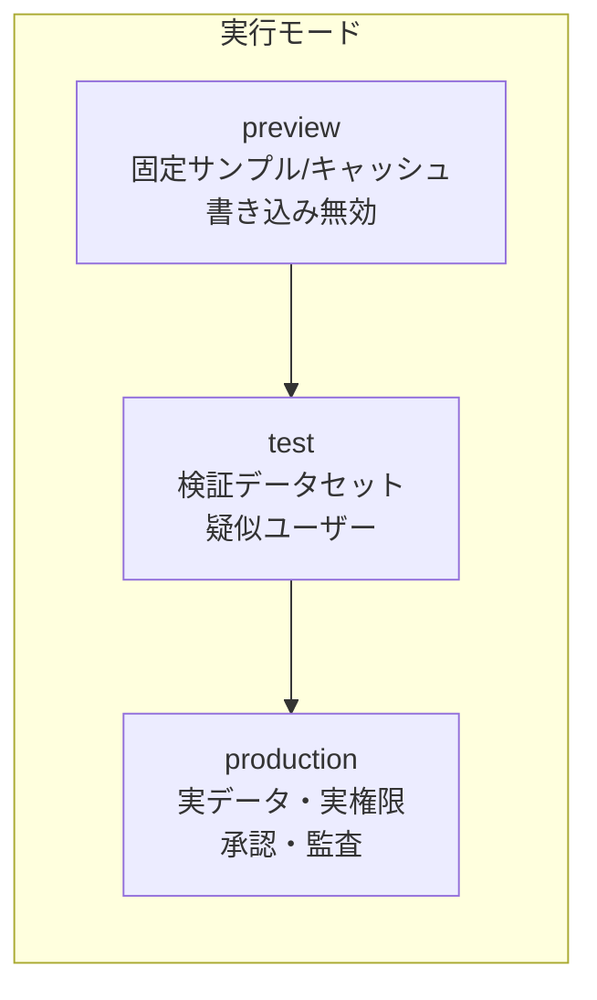
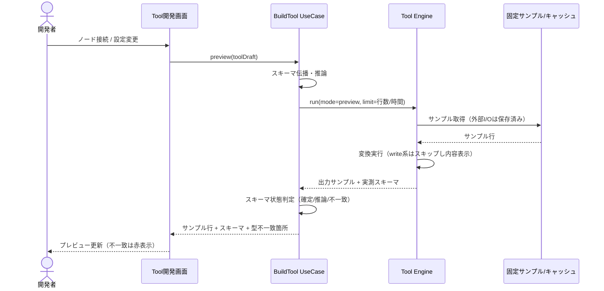
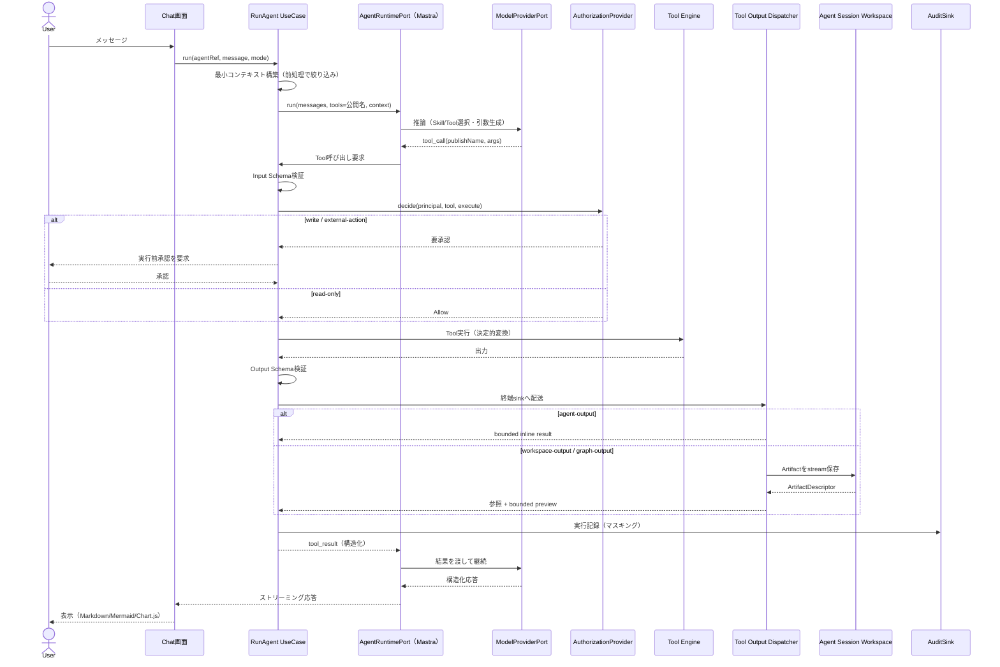
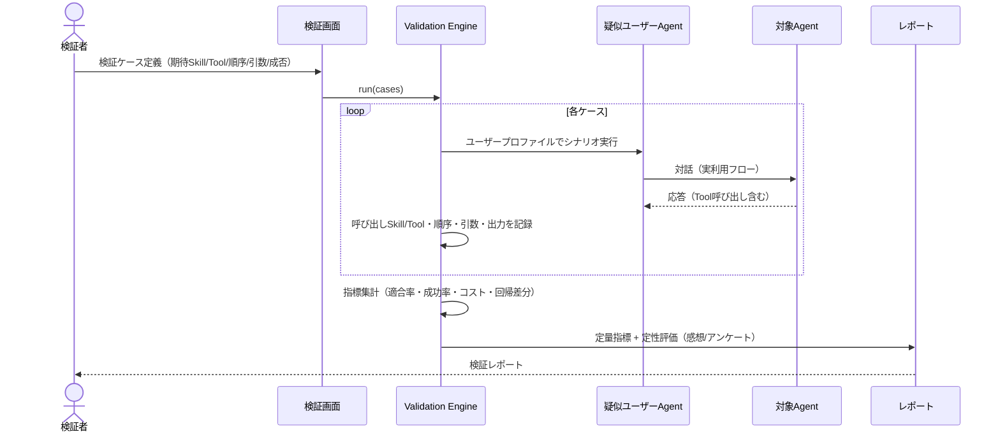
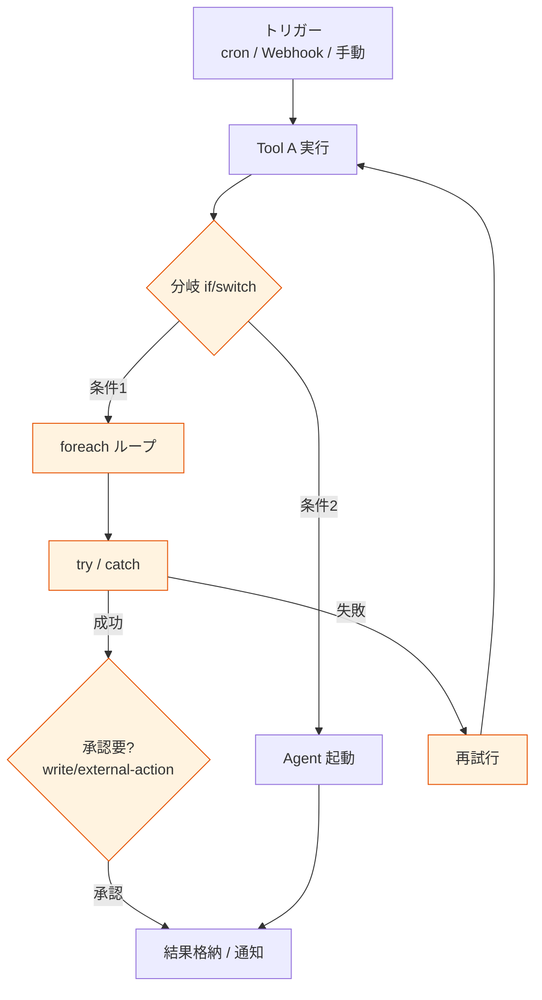
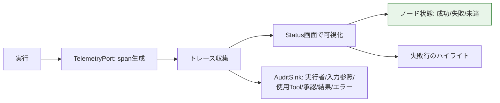

# 07. 実行モデル・データフロー

> 参照: [01-architecture.md](./01-architecture.md#4-実行エンジンの三分割)

3つの実行規則（Tool / Workflow / Agent）ごとにデータフローを示す。共通原則は「プレビューは副作用を実行しない」「LLMへ渡すコンテキストは最小限」。

---

## 1. 実行モードの分離

> 3モードは使用データと権限を分離して表示する。

| モード | データ | 副作用 | 権限 |
|---|---|---|---|
| `preview` | 固定サンプル / 明示キャッシュ | write系は実行せず内容表示のみ | 開発者権限 |
| `test` | 検証データセット | Fake / 保存済みレスポンス | テスト権限 |
| `production` | 実データ | 承認後に実行、監査記録 | 実行権限 + 認可 |

---

## 2. Toolプレビュー実行

ノード接続・設定変更のたびに、出力スキーマとサンプル行を制限付きで更新する（プレビュー駆動）。

- 書き込み・副作用API・通知はプレビューで実行しない。代わりに入力と予想操作内容を表示。
- 実測スキーマが宣言と乖離したら `Mismatch` としてトレースへ（[03-domain-model.md](./03-domain-model.md#4-スキーマ状態の遷移)）。

---

## 3. Agentチャット実行（Tool Calling）

LLMは意図解釈・タスク計画・Skill/Tool選択に集中し、計算・データ処理・外部実行はToolへ委譲する。

v1のAgent preview/testは停止性を保証するため、1 RunあたりTool call最大4回・model round最大5回とする。各roundでは保存済みAgent versionに固定された同じTool集合を提示し、preview/testは候補集合全体がread-onlyの場合だけ実行する。
Structured Outputを持つAgentは最終contentをJSON parseし、required、primitive型、追加field禁止を検証してからRunへ保存する。

Toolの終端は`agent-output`、`workspace-output`、または`graph-output`で明示する。後二者では同一Agent Session内の複数RunとサブAgentがArtifactを再利用できるが、payload全体はLLMへ自動注入しない。`graph-output`は入力行をedge、指定列をnodeとして保存する。Session、Artifact、quota、TTLの境界は [ADR-0027](./adr/0027-tool-output-and-session-workspace.md) を参照。

---

## 4. 検証（疑似ユーザー）実行

`ideas.md §機能` / `ideas-v2.md §11`。疑似ユーザーエージェントに実際に利用させ、期待Skill/Tool・順序・引数・成否を測る。

測定指標は [09-roadmap.md](./09-roadmap.md#検証指標) を参照。

複数ターン会話の終了条件（疑似ユーザーの `endConversation` / `maxUserTurns` 上限 / エラー）とアンケート取得の詳細シーケンスは [11-scenario-validation.md §4-§5](./11-scenario-validation.md) を参照。対象Agentの1ターンには本ドキュメントの実行上限（Tool call 4回 / model round 5回）と read-only 制約がそのまま適用される。

---

## 5. Workflow実行（Phase 3）

複数Toolの接続・分岐・反復・再試行・承認・スケジュール実行。制御ノードはここに属する。

---

## 6. 実行トレースの可視化

最小版（v1）: どのノード・どのサンプル行で落ちたかを色で示す。フル観測（Status画面の本格版）はPhase 4。

- トレースは `TelemetryPort` 経由（[04-api-spec.md](./04-api-spec.md#24-永続化観測監査)）。
- 監査ログは秘密情報・個人情報をマスキングして `AuditSink` へ。
- v1ローカル実装は成功/失敗Runと最小traceを `RunRepository`（SQLite）へ保存し、Status画面から再取得する。OpenTelemetry exportとretention policyは後続で追加する。
