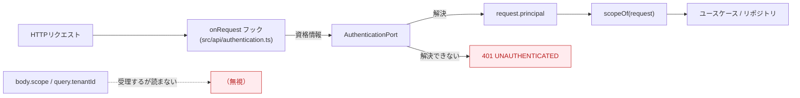
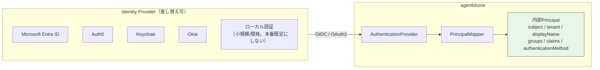
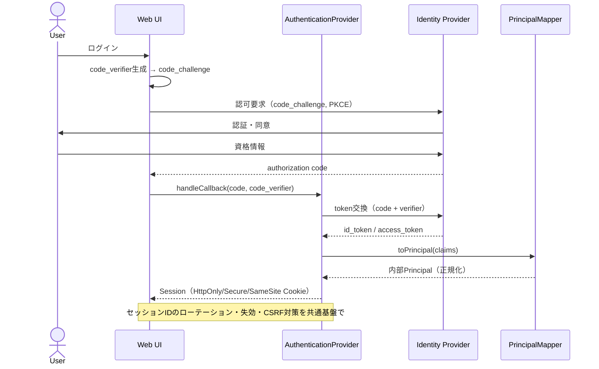
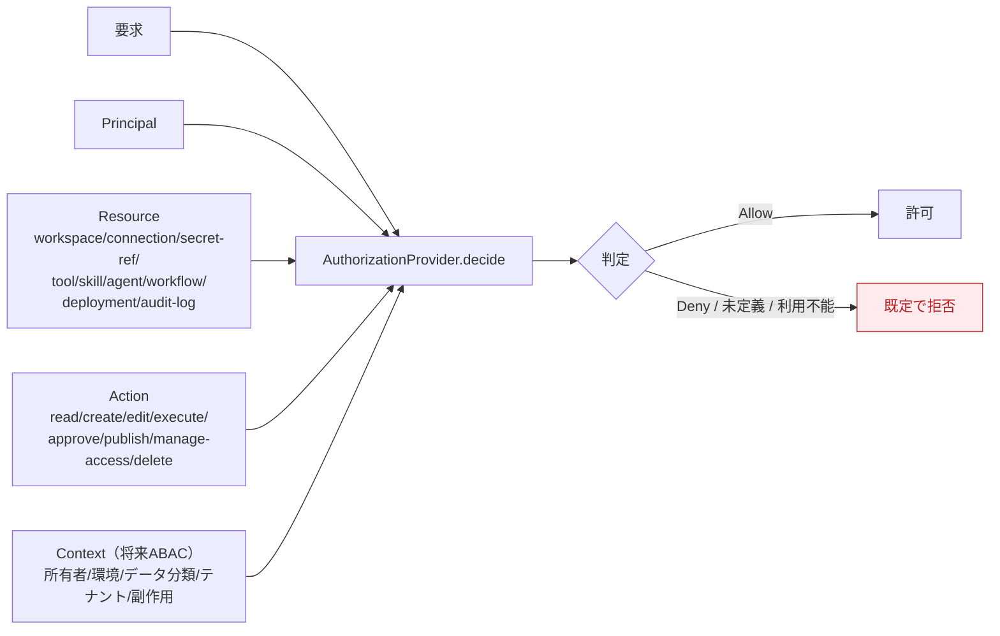
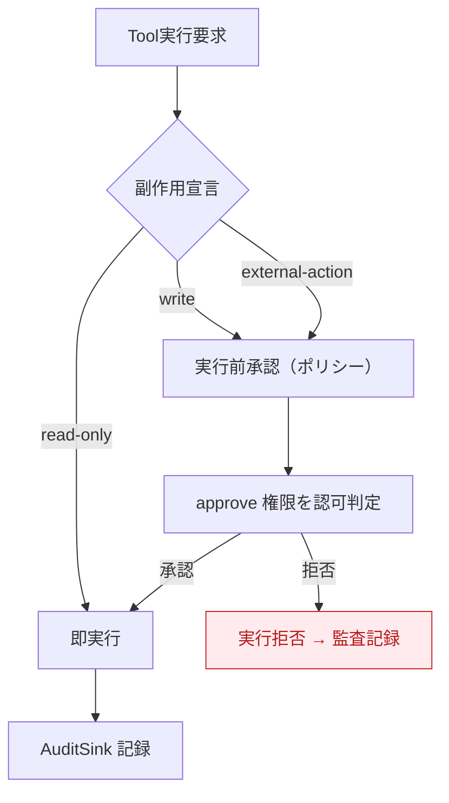
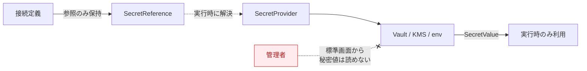
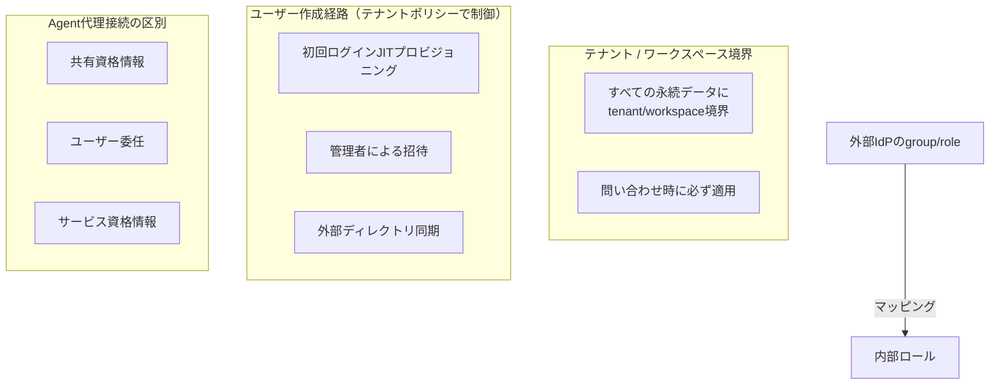
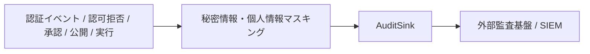

# 08. セキュリティ・認証認可設計

本製品独自のユーザー管理へ固定せず、一般的なWebアプリの認証・認可機能を **アダプターとして挿入** できる構造にする。認証画面だけを挿してAPIが無防備になる状態を防ぐため、認証・認可は「画面 + HTTPミドルウェア + APIルート + サーバー側ポリシー判定 + 監査」を一つの構成単位として登録する。

---

## 0. 実装状況（2026-07）

このドキュメントは目標像を書いている。**認証・テナント境界・認可（RBAC）・監査ログまでが動いている**。残るのは外部IdP（OIDC）とアカウント機能のCapability化。

| 項目 | 状態 | 実体 |
|---|---|---|
| `AuthenticationPort` | ✅ 実装 | `src/application/security/authentication.ts`（Port）/ `src/adapters/security/*`（実装2種） |
| `Principal` | ✅ 実装 | `src/domain/security/principal.ts` |
| テナント境界の決定 | ✅ 実装 | `scopeOf(request)`（`src/api/authentication.ts`）が唯一の供給源 |
| 単一ユーザーモード | ✅ 実装 | `SingleUserAuthentication`。**ループバック以外へのバインドでは起動を拒否** |
| 共有トークン認証 | ✅ 実装 | `TokenAuthentication`（Bearer・人ごとに1本・ロール付き） |
| OIDC / PKCE | ❌ 未実装 | `AuthenticationPort` の別実装として追加できる |
| `AuthorizationPort`（RBAC） | ✅ 実装 | 判定表 `src/domain/security/authorization.ts` / Port `src/application/security/authorization.ts` / 実装 `RoleMatrixAuthorization` / 適用 `src/api/authorization.ts` |
| `AuditSink` | ✅ 実装 | Port `src/application/security/audit.ts` / 台帳 `audit_log`（スキーマ version 3）/ 参照 `GET /operations/audit` |
| `AuthFeatureProvider` / `AuthUiExtension` / `PrincipalMapper` | ❌ 未実装 | — |

### 0.0 認可の効き方（重要）

権限は **Principal のロール**だけで決まる。認証方式は権限に関与しない。

- **単一ユーザーモード**: Principal は**全ロール**を持つ（`SINGLE_USER_ROLES`）。資格情報を求めない構成では権限を絞る相手がいないため。既存のローカル利用は一切変わらない。
- **トークン認証**: `AGENTCONTEXT_AUTH_TOKENS` の各エントリに `roles` を書く。**省略時は `editor`**（作成・編集・実行はできるが、削除・承認・公開・運用操作はできない）。綴りが違うロール名は**起動時に落とす**（権限を付けたつもりで付いていないトークンを配らないため）。
- **MCPサーバー設定（作成・置換・削除・接続テスト）は `operate`**（Operator / Workspace Admin）。stdio の設定はサーバーホスト上で子プロセスを起動する設定で、保存できる主体はホスト上で任意コードを実行できる。`roles` 省略時の `editor` では**設定できない**（§3.2 の但し書き）。
- ルートごとの必要権限は `src/api/authorization.ts` の `ROUTE_RULES` が持ち、`onRequest` フックが機械的に適用する。**登録済みの全ルートが表に載っていること**をテストが強制するので、ルートを足して権限を決め忘れると赤くなる。
- 拒否は **403 `FORBIDDEN`** で、メッセージは必要な権限（`tool:delete` など）だけを含む。保持しているロールや主体名は出さない。

### 0.1 テナント境界の決まりかた（重要）

以前は**全APIがボディ／クエリの `tenantId` / `workspaceId` をそのまま境界として使っていた**。リポジトリ層は正しく `WHERE tenant_id = ? AND workspace_id = ?` を適用していたので、壊れていたのは「境界の実装」ではなく **「境界を決める主体」** だった。`tenantId` を書き換えれば任意テナントのデータを読み書き・削除できた。

現在の流れ:

- リクエストの `scope` は**後方互換のために受理を続けるが、どのルートからも参照されない**。
  「不一致なら403」ではなく「無視」を選んだのは、安全性が同じ（どちらもクライアントの申告を権威にしない）一方で、403 は全クライアントに「送信前に自分のテナントIDを知っている」ことを強いるため。詳細な根拠は `src/api/schemas.ts` の `tenantScopeSchema` にある。
- 認証不要なのは `/health` `/ready` と、APIが所有しないパスへの GET/HEAD（＝ビルド済みUIのシェル）だけ。ここを閉じるとトークン入力画面そのものが開けなくなる。
- `GET /auth/session` は**認証必須**。401 が返ること自体が「トークンが要る構成だ」という合図になり、UIはこれで単一ユーザーモードかを判別する。

### 0.2 バインドアドレスと認証の関係

「ローカルだから無認証でよい」という前提は、`AGENTCONTEXT_HOST` を変えた瞬間に破綻する。そこで `serverSettings`（`src/config/environment.ts`）が起動時に次を強制する。

| バインド先 | 認証未設定 | 認証あり（`AGENTCONTEXT_AUTH_TOKENS`） |
|---|---|---|
| `127.0.0.0/8` · `::1` · `localhost` | ✅ 単一ユーザーモードで起動 | ✅ 起動 |
| それ以外（`0.0.0.0` · LAN IP · ホスト名） | ❌ **起動を拒否** | ✅ 起動 |

ホスト名は解決しない。解決結果に依存させると、DNSの都合で認証の要否が変わってしまうため。

---

## 1. セキュリティ最低要件

DB/API接続・カスタムコード・MCP公開・Webhookを提供する前に、次を満たす。

| # | 要件 |
|---|---|
| 1 | 資格情報はフロー・プロンプト・生成コードへ埋め込まず、`SecretProvider` の参照として保存する |
| 2 | カスタムコードは時間・メモリ・CPU・ネットワーク・ファイルアクセス・利用可能パッケージを制限した分離環境で実行する |
| 3 | Toolは副作用を `read-only / write / external-action` として宣言し、`write` と `external-action` は実行前承認を要求する |
| 4 | MCP・Webhook・公開Agentのエンドポイントは未認証公開を既定にしない |
| 5 | 実行者・対象バージョン・入力参照・使用Tool・承認・結果・エラーを監査ログへ記録し、秘密情報・個人情報はマスキングする（§7.1） |
| 6 | ワークスペース・接続・Tool・Skill・Agent・公開エンドポイントごとにアクセス制御を適用できる |

> #5 のうち**サーバーログのマスキング**は配線済み。pino の `redact`（`src/api/logging.ts`）が
> Authorization / Cookie / APIキーの各ヘッダと、ボディ・ログcontextの `apiKey` / `password` / `token` /
> `secret` 系を `[redacted]` へ落とす。例外メッセージに埋め込まれた秘密値は
> `redactSecrets()`（`src/application/operations/logger.ts`）が別途正規表現で落とす。
> 設定内容と「何を守らないか」は [02-tech-stack.md](./02-tech-stack.md#7-観測ログトレース) を参照。
> 監査ログ本体（誰が何をしたか）は §7.1 で別の台帳として記録する。

---

## 2. 認証（Authentication）

### 2.1 標準接続境界

- **Web UI**: Authorization Code Flow + PKCE を基本。
- **API**: 短寿命アクセストークン or 安全なサーバーサイドセッション。
- **Webhook / MCP / サービス間**: ユーザー認証と分離した Service Principal / Client Credentials / 署名付きトークン。

### 2.2 Authorization Code Flow + PKCE

### 2.3 アカウント機能のCapability化

ログイン/ログアウト/登録/招待/メール確認/パスワード再設定/MFA・パスキー/ソーシャルログイン/セッション失効/アカウント無効化を **任意機能（Capability）** として宣言する。外部IdPが担当する機能をアプリ側で重複実装しない（`AuthFeatureProvider`、[04-api-spec.md](./04-api-spec.md#25-認証機能uiのcapability拡張)）。

---

## 3. 認可（Authorization）

認証済みPrincipalに対して認可する。認証の有無だけで操作を許可しない。初期実装はRBAC、将来ABAC/Policy Engineへ拡張できるインターフェースを用意する。

### 3.1 認可判定モデル

> **フェイルセーフ**: 権限が未定義、または認可プロバイダーが利用不能な場合は既定で拒否する。UI非表示だけに依存せず、すべてのAPI・実行要求・公開操作でサーバー側判定を行う。

### 3.2 RBAC ロール × アクション（初期実装）

ロールはワークスペース単位で割り当てる。

| リソース \ ロール | Viewer | Editor | Publisher | Operator | Workspace Admin |
|---|:---:|:---:|:---:|:---:|:---:|
| tool / skill / agent（read） | ✅ | ✅ | ✅ | ✅ | ✅ |
| tool / skill / agent（create/edit） | — | ✅ | ✅ | ✅ | ✅ |
| 実行（execute） | — | ✅ | ✅ | ✅ | ✅ |
| 承認（approve） | — | — | ✅ | ✅ | ✅ |
| 公開（publish / deployment） | — | — | ✅ | — | ✅ |
| 運用・実行監視（operate） | — | — | — | ✅ | ✅ |
| MCPサーバー設定・接続テスト（mcp-server:operate） | — | — | — | ✅ | ✅ |
| アクセス管理（manage-access） | — | — | — | — | ✅ |
| 削除（delete） | — | 自作のみ | 自作のみ | — | ✅ |
| audit-log（read） | — | — | — | ✅ | ✅ |

> 判定操作は `read / create / edit / execute / approve / publish / operate / manage-access / delete` に分離。将来、所有者・環境・データ分類・テナント・Toolの副作用を条件にできるABACを追加。

#### 実装上の但し書き

- **`delete` の「自作のみ」は現状効かない**。資産に作成者の `subject` を保存していないため所有者を判定できず、§3.1 のフェイルセーフに従って**拒否**する。結果として削除は実質 Workspace Admin のみ。`AuthorizationResource.ownerSubject` を渡せば Editor / Publisher にも開く実装は入っている（作成時に所有者を記録する改修が入れば有効になる）。
- **セッション成果物の削除だけは `edit` 扱い**。実行の副産物でセッションと一緒に消える一時データなので、版管理された資産の削除と同じ重みで縛ると通常の後片付けができなくなる（監査には残す）。
- **`operate`（運用・実行監視）に含めたもの**: `/operations/*`（稼働状況・保持期限・バックアップ）、モデル設定の変更と接続テスト（APIキーを預かるため）、サンプルデータ投入、MCPサーバー設定の変更と接続テスト（次項）。保持期間を0日にして適用すれば全実行履歴が消えるので、実行系とは別の権限にしてある。
- **MCP設定権限はホストでのコード実行権限に等しい。** `POST /mcp-servers` / `PUT /mcp-servers` / `DELETE /mcp-servers/:name` / `POST /mcp-servers/:name/test` は `mcp-server:operate` を要求する（`GET /mcp-servers` は資格情報をマスクして返すので `read`）。stdio トランスポートの設定は**サーバーホスト上で子プロセスを起動する設定**で、接続テストは Agent 実行を伴わず即プロセスを起動する。起動コマンドの許可リスト（`AGENTCONTEXT_MCP_ALLOWED_COMMANDS`、既定は `npx,uvx,bunx,cmd`）は綴り間違いと「MCPサーバーではないもの」の起動を落とすための安全策であって RCE の対策ではない — `npx` は任意のパッケージを取ってきて実行するし、許可リストに `node` を足せば `node -e` が通る。したがって**この設定を保存できる主体は、許可リストの有無に関わらずホスト上で任意コードを実行できる**。以前は `create` / `edit` / `delete` / `execute`（Editor 以上）で通していたが、`roles` を書かないトークンの既定が `editor` なので「トークンを持つ全員がホストでコードを実行できる」状態だった。併せて、子プロセスの実行内容を差し替える環境変数（`PATH` / `NODE_OPTIONS` / `LD_PRELOAD` / `PYTHONPATH` など、`src/domain/mcp/command-policy.ts` の `PROTECTED_ENVIRONMENT_NAMES`）は `transport.env` で上書きできない（`*` で許可リストを外しても拒否する）。単一ユーザーモードの Principal は全ロールを持つので、ローカル利用は変わらない。画面（MCP）は権限の無いセッションでは保存・テスト・削除・適用のボタンを無効化して理由を出すが、判定はサーバーが行う。
- **`approve` に含めたもの**: ツール実行の事前承認（`POST /runs/:runId/resume`）、昇格の採否、記憶提案の採否、Factoryの計画承認。Harnessの応答（`POST /harness-runs/:runId/responses`）は「追加入力」と「計画承認」が同居するため、ルートは `execute` を要求し、本文が承認だったときにハンドラが `approve` を追加判定する。

---

## 4. 副作用と実行前承認

副作用宣言はTool側のメタデータ（[06-etl-tool-builder.md](./06-etl-tool-builder.md#36-副作用の宣言)）で行い、実行シーケンスは [07-execution-model.md](./07-execution-model.md#3-agentチャット実行tool-calling) を参照。

---

## 5. 秘密情報（Secrets）

- 接続情報は **参照（SecretReference）** として保存し、実行時に `SecretProvider` が解決する。
- 管理者であっても秘密値そのものを標準画面から読み出せない設計を基本とする。

---

## 6. テナントと権限境界

- すべての永続データにtenant/workspace境界を持たせ、問い合わせ時に必ず適用する。
- 外部IdPのgroup/roleを内部ロールへマッピングできるようにする。
- Agentが利用者の代理で外部接続する場合、共有資格情報・ユーザー委任・サービス資格情報を区別して表示・監査する。

### 6.1 ツールテンプレートはテナント境界の外にある（運用者が置く資産）

ツールテンプレート（[ADR-0049](./adr/0049-tool-templates.md)）は永続データではなく、**サーバーのファイルシステムに置かれた外部ファイル**（`templates/tools/*.json` と `AGENTCONTEXT_TOOL_TEMPLATES_DIR`）である。カタログはテナント/ワークスペースを引数に取らず、**全テナントが同じ一覧を見る**。上の「すべての永続データにtenant/workspace境界」の唯一の例外で、意図的にそうしている（構成の共有が目的のため）。

そのうえで、境界は次の3点で守る。

- **置けるのは運用者だけ**。テンプレートはファイルを置くことでしか増えず、APIからは登録できない。利用者が投稿した内容がテンプレートになる経路は無い。テンプレートは実行可能なToolの形を定義するので、**ファイルを1つ置くことは全ワークスペースへ新しいToolの形を配ることに等しい**。出所の分からないテンプレートを置かない。
- **データはスコープ内に閉じる**。スロット候補も実体化も、呼び出し元のscopeで解決したデータソースのプロファイルだけを見る。他テナントのデータソースIDを渡しても解決できない。
- **抜け道を作らない**。実体化したグラフは手で組んだToolと同じ検査（構造・列の存在・設計時プレビュー・保存時の検証）を通る。テンプレートがノードの許可語彙や出力上限を迂回することはない。

権限は既存のTool権限に乗せる（一覧・候補は `read`、実体化は設計時プレビューでデータを読むため `execute`）。

### 6.2 プロンプトファイルも運用者が置く資産である（利用者が投稿する経路は無い）

モデルへ送る指示文（[ADR-0052](./adr/0052-prompt-files.md)）も、§6.1のツールテンプレートと同じ性質を持つ: **サーバーのファイルシステムに置かれた外部ファイル**（`prompts/**/*.md` と `AGENTCONTEXT_PROMPTS_DIR`）で、置けるのは運用者だけである。チャットの発話・データソースの値・アンケートの自由記述のような**利用者が入力した文字列がプロンプトファイルへ書き戻る経路は無い**（画面にもAPIにも「プロンプトを編集する」機能を持たない）。

- **文をファイルへ出しても、untrusted dataの隔離は崩れない。** どの節をどの順に使うか・条件での入れ替え・`wrapUntrusted`によるuntrusted dataの隔離・JSON schemaはコード側に残り、ファイルには文だけが乗る。ファイルを書き換えられても、隔離そのもの（利用者データをsystemに混ぜない規律）はコードが守り続ける。
- **設計アシスタント（[docs/06 §3.17](./06-etl-tool-builder.md#317-設計アシスタント文章で指示するとノードが増える)）も同じ規律に従う。** 利用者の指示文・直近の会話・グラフの列名やプロファイルの値は、すべて untrusted data 側（user message）に置かれ、system 側にはプロンプトファイルの規則とノードカタログだけが乗る。
- **起動時の検査は、プロンプトファイルにも監査の性質を持たせる。** コードが宣言した id と節が揃っていなければ起動しないため、`AGENTCONTEXT_PROMPTS_DIR` に置いた上書きファイルの節が1つ欠けただけでも起動時に気づける（黙って別の指示でモデルが動く方が見つけにくく高くつくため）。

---

## 7. 監査（Audit）

記録対象: 実行者・対象バージョン・入力参照・使用Tool・承認・結果・エラー。関連Portは [04-api-spec.md](./04-api-spec.md#24-永続化観測監査) を参照。

### 7.1 実装（2026-07）

`AuditEntry`（`src/domain/security/audit.ts`）は `at / subject / tenantId / workspaceId / action / resource / outcome / detail?` を持ち、SQLiteの `audit_log`（スキーマ version 3）へ追記する。**Run trace は監査の代替にならない**——traceは「モデルとツールが何をしたか」であって実行者の概念が無く、保持期限（既定14日）で伏せ字になる。監査は独立した保持期間（既定365日・`RetentionPolicy.auditDays`。**下限30日**——0を許すと「保持期限を変更した記録」ごと即座に消せてしまうため）を持つ。

主体不明の401（＝資格情報を持たない相手からの試行）は**送信元ごと・分ごとに上限件数まで**しか書かない。ここは誰でも無制限に到達できる位置なので、1件1行で書くと台帳がリモートからの書き込み増幅装置になる。抑制した件数は次の記録時に集約行として残す（規模は捨てない）。併せてレート制限フックを**認証より前**に置き、401・403も計数対象にしてある（後ろに置くと `reply.sent` により一切数えられない）。

**何を記録するか**（`ROUTE_RULES` の `audit` フラグ）。全リクエストを記録すると台帳が実行ログの写しになり、肝心の行が埋もれるので、「後から必ず問われる操作」だけを残す。

| 記録する | 記録しない |
|---|---|
| 認証の失敗（401・`subject` は `(unauthenticated)`） | 参照（GET） |
| 認可の拒否（403・必要だった権限を `detail.reason` に） | 資産の作成・更新（バージョン履歴が別に残る） |
| 削除 | プレビュー実行・スキーマ推論 |
| 承認（ツール承認・昇格の採否・記憶提案・Factory計画） | 実験の中断・再開 |
| 実行の開始（Agent / Harness / Factory / シナリオ） | — |
| 運用操作（保持期限の保存と適用・バックアップ・モデル設定・MCP設定） | — |

**秘密は入らない**。`detail` はドメイン側で機械的にマスクする——`token` / `secret` / `password` / `apiKey` / `authorization` / `cookie` などを名前に含むキーは捨て、値は文字列・数値・真偽値のみ、長い文字列は500文字で切る。「呼び出し側が気をつける」には頼らない。

**監査の失敗は本処理を止めない**。台帳への書き込みに失敗しても、利用者の操作は既に成功（あるいは既に拒否）している。そこで500を返すと監査DBが一杯になった瞬間に全機能が止まるので、api層が握り潰して運用ログへ落とす。

**参照**は `GET /operations/audit`（`audit-log:read` ＝ Operator / Workspace Admin のみ）。`from` / `to` / `subject` / `action` / `outcome` / `resourceKind` / `limit` で絞れる。UIはステータス画面に直近20件を出し、権限が無ければパネルごと表示しない。

### 7.2 承認者・申請者の記録

`Principal` から取り、**クライアントからは受け取らない**。

| 場所 | 記録先 |
|---|---|
| ツール実行の事前承認 | Run trace の `approval-resolved.decidedBy` ＋ 監査ログ |
| 昇格の申請・採否 | `PromotionRequest.requestedBy` / `decidedBy` ＋ 監査ログ |
| Harness / Factory の応答 | 監査ログ（`detail.decision` / `detail.respondedBy`） |

`POST /agents/{id}/versions/{v}/promotion-requests` と `POST /promotion-requests/{id}/{approve,reject}` の body にある `requestedBy` / `decidedBy` は**後方互換のために受理するが読まない**（`scope` と同じ流儀）。以前はここが自由入力で、「reviewer が承認した」という証跡を誰でも作れた。

---

## 8. 認証・認可の拡張インターフェース一覧

| インターフェース | 責務 | 状態 |
|---|---|---|
| `AuthenticationPort` | 資格情報 → 内部Principal の解決 | ✅ 実装（`single-user` / `token`） |
| `AuthorizationPort` | Principal・action・resource → 許可/拒否 | ✅ 実装（`RoleMatrixAuthorization`） |
| `AuditSink` | 認証イベント・認可拒否・承認・公開・実行を記録（将来はSIEMへ転送） | ✅ 実装（SQLite `audit_log`） |
| `PrincipalMapper` | IdP固有claimを内部Principalへ変換 | ❌ OIDC実装時 |
| `AuthFeatureProvider` | 登録・招待・メール確認・パスワード再設定・MFA・セッション一覧の対応可否と実行 | ❌ 未着手 |
| `AuthUiExtension` | ログイン・登録・アカウント・セッション・メンバー管理画面の差し替え | ❌ 未着手 |
| `SecretProvider` | 接続情報の参照と実行時取得 | 部分実装（`SecretCipherPort` が保存時の封緘のみ担当） |

以下は当初の設計時に想定していた分割（参考）。

| インターフェース | 責務 |
|---|---|
| `AuthenticationProvider` | ログイン・ログアウト・コールバック・セッション/トークン検証 |
| `AuthFeatureProvider` | 登録・招待・メール確認・パスワード再設定・MFA・セッション一覧の対応可否と実行 |
| `AuthUiExtension` | ログイン・登録・アカウント・セッション・メンバー管理画面の差し替え |
| `PrincipalMapper` | IdP固有claimを内部Principalへ変換 |
| `AuthorizationProvider` | Principal・resource・action・context → 許可/拒否 |
| `SecretProvider` | 接続情報の参照と実行時取得（資格情報の保管を認証認可から分離） |
| `AuditSink` | 認証イベント・認可拒否・承認・公開・実行を外部監査基盤へ転送 |

型定義は [04-api-spec.md](./04-api-spec.md#23-認証認可秘密詳細は-08-参照) を参照。
