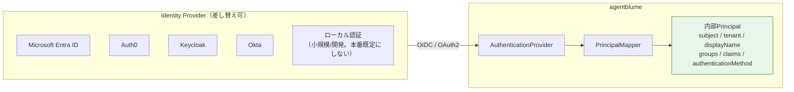
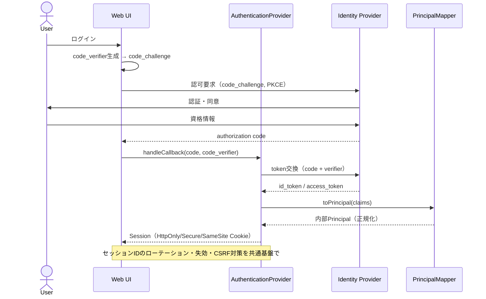
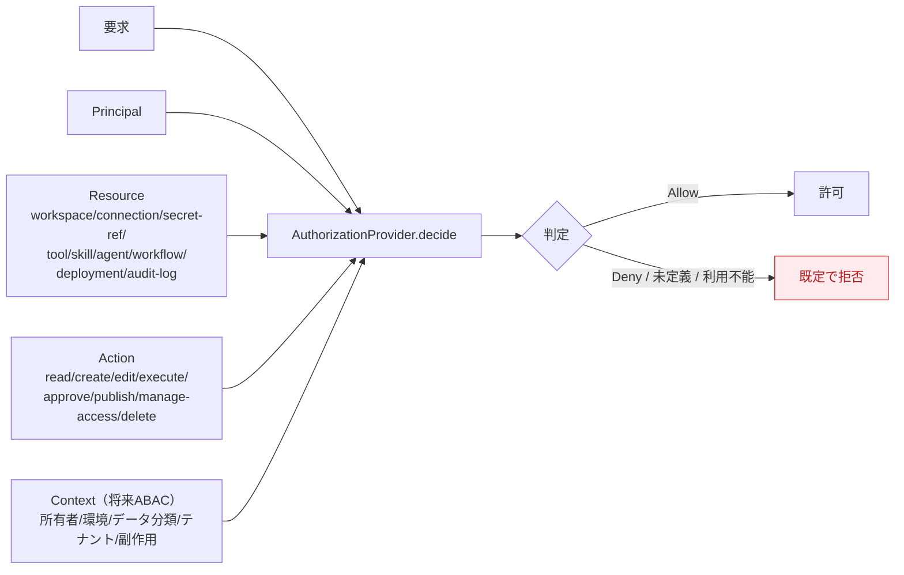
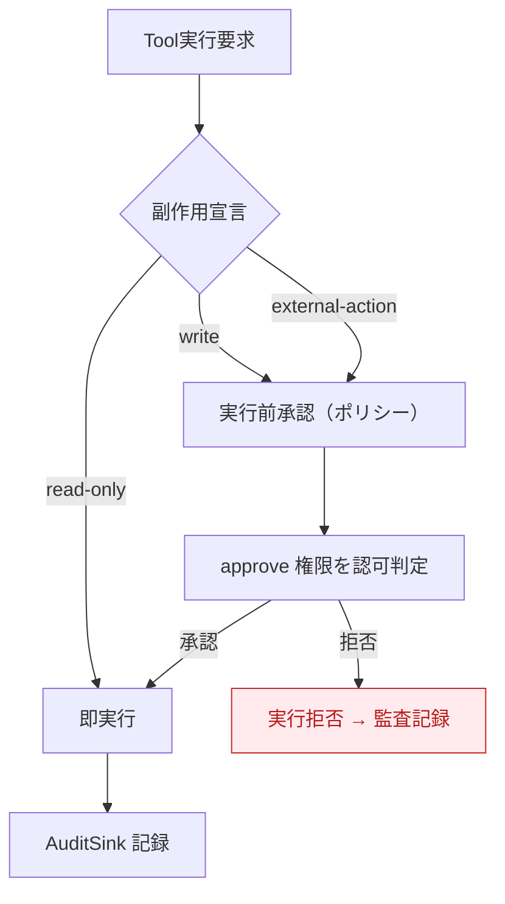
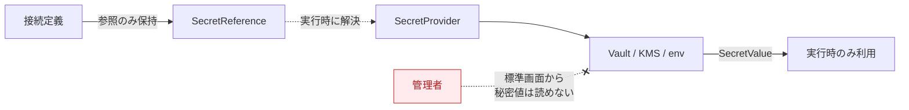
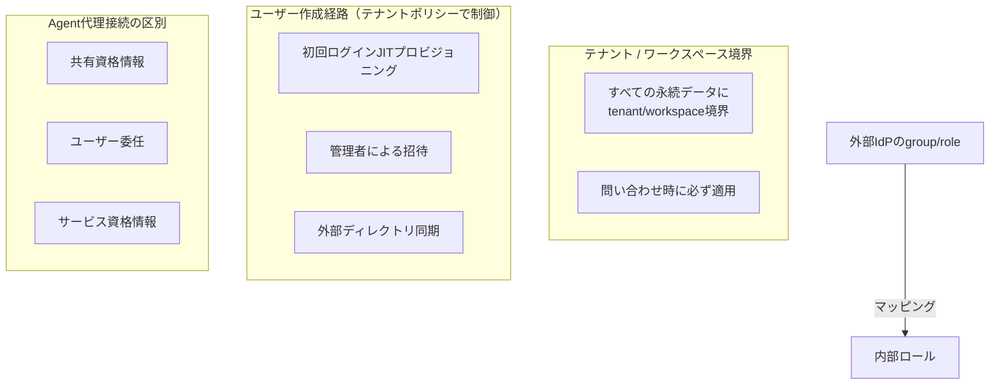
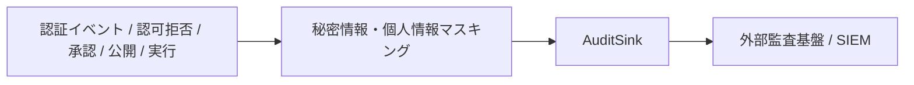

# 08. セキュリティ・認証認可設計

> 参照: [`ideas-v2.md` §9 セキュリティ最低要件, §10 認証・認可](../ideas/ideas-v2.md)

本製品独自のユーザー管理へ固定せず、一般的なWebアプリの認証・認可機能を **アダプターとして挿入** できる構造にする。認証画面だけを挿してAPIが無防備になる状態を防ぐため、認証・認可は「画面 + HTTPミドルウェア + APIルート + サーバー側ポリシー判定 + 監査」を一つの構成単位として登録する。

---

## 1. セキュリティ最低要件

DB/API接続・カスタムコード・MCP公開・Webhookを提供する前に、次を満たす。

| # | 要件 |
|---|---|
| 1 | 資格情報はフロー・プロンプト・生成コードへ埋め込まず、`SecretProvider` の参照として保存する |
| 2 | カスタムコードは時間・メモリ・CPU・ネットワーク・ファイルアクセス・利用可能パッケージを制限した分離環境で実行する |
| 3 | Toolは副作用を `read-only / write / external-action` として宣言し、`write` と `external-action` は実行前承認を要求する |
| 4 | MCP・Webhook・公開Agentのエンドポイントは未認証公開を既定にしない |
| 5 | 実行者・対象バージョン・入力参照・使用Tool・承認・結果・エラーを監査ログへ記録し、秘密情報・個人情報はマスキングする |
| 6 | ワークスペース・接続・Tool・Skill・Agent・公開エンドポイントごとにアクセス制御を適用できる |

---

## 2. 認証（Authentication）

### 2.1 標準接続境界

- **Web UI**: Authorization Code Flow + PKCE を基本。
- **API**: 短寿命アクセストークン or 安全なサーバーサイドセッション。
- **Webhook / MCP / サービス間**: ユーザー認証と分離した Service Principal / Client Credentials / 署名付きトークン。

### 2.2 Authorization Code Flow + PKCE

### 2.3 アカウント機能のCapability化

ログイン/ログアウト/登録/招待/メール確認/パスワード再設定/MFA・パスキー/ソーシャルログイン/セッション失効/アカウント無効化を **任意機能（Capability）** として宣言する。外部IdPが担当する機能をアプリ側で重複実装しない（`AuthFeatureProvider`、[04-api-spec.md](./04-api-spec.md#25-認証機能uiのcapability拡張)）。

---

## 3. 認可（Authorization）

認証済みPrincipalに対して認可する。認証の有無だけで操作を許可しない。初期実装はRBAC、将来ABAC/Policy Engineへ拡張できるインターフェースを用意する。

### 3.1 認可判定モデル

> **フェイルセーフ**: 権限が未定義、または認可プロバイダーが利用不能な場合は既定で拒否する。UI非表示だけに依存せず、すべてのAPI・実行要求・公開操作でサーバー側判定を行う。

### 3.2 RBAC ロール × アクション（初期実装）

ロールはワークスペース単位で割り当てる。

| リソース \ ロール | Viewer | Editor | Publisher | Operator | Workspace Admin |
|---|:---:|:---:|:---:|:---:|:---:|
| tool / skill / agent（read） | ✅ | ✅ | ✅ | ✅ | ✅ |
| tool / skill / agent（create/edit） | — | ✅ | ✅ | ✅ | ✅ |
| 実行（execute） | — | ✅ | ✅ | ✅ | ✅ |
| 承認（approve） | — | — | ✅ | ✅ | ✅ |
| 公開（publish / deployment） | — | — | ✅ | — | ✅ |
| 運用・実行監視（operate） | — | — | — | ✅ | ✅ |
| アクセス管理（manage-access） | — | — | — | — | ✅ |
| 削除（delete） | — | 自作のみ | 自作のみ | — | ✅ |
| audit-log（read） | — | — | — | ✅ | ✅ |

> 判定操作は `read / create / edit / execute / approve / publish / manage-access / delete` に分離。将来、所有者・環境・データ分類・テナント・Toolの副作用を条件にできるABACを追加。

---

## 4. 副作用と実行前承認

副作用宣言はTool側のメタデータ（[06-etl-tool-builder.md](./06-etl-tool-builder.md#36-副作用の宣言)）で行い、実行シーケンスは [07-execution-model.md](./07-execution-model.md#3-agentチャット実行tool-calling) を参照。

---

## 5. 秘密情報（Secrets）

- 接続情報は **参照（SecretReference）** として保存し、実行時に `SecretProvider` が解決する。
- 管理者であっても秘密値そのものを標準画面から読み出せない設計を基本とする。

---

## 6. テナントと権限境界

- すべての永続データにtenant/workspace境界を持たせ、問い合わせ時に必ず適用する。
- 外部IdPのgroup/roleを内部ロールへマッピングできるようにする。
- Agentが利用者の代理で外部接続する場合、共有資格情報・ユーザー委任・サービス資格情報を区別して表示・監査する。

---

## 7. 監査（Audit）

記録対象: 実行者・対象バージョン・入力参照・使用Tool・承認・結果・エラー。関連Portは [04-api-spec.md](./04-api-spec.md#24-永続化観測監査) を参照。

---

## 8. 認証・認可の拡張インターフェース一覧

| インターフェース | 責務 |
|---|---|
| `AuthenticationProvider` | ログイン・ログアウト・コールバック・セッション/トークン検証 |
| `AuthFeatureProvider` | 登録・招待・メール確認・パスワード再設定・MFA・セッション一覧の対応可否と実行 |
| `AuthUiExtension` | ログイン・登録・アカウント・セッション・メンバー管理画面の差し替え |
| `PrincipalMapper` | IdP固有claimを内部Principalへ変換 |
| `AuthorizationProvider` | Principal・resource・action・context → 許可/拒否 |
| `SecretProvider` | 接続情報の参照と実行時取得（資格情報の保管を認証認可から分離） |
| `AuditSink` | 認証イベント・認可拒否・承認・公開・実行を外部監査基盤へ転送 |

型定義は [04-api-spec.md](./04-api-spec.md#23-認証認可秘密詳細は-08-参照) を参照。
