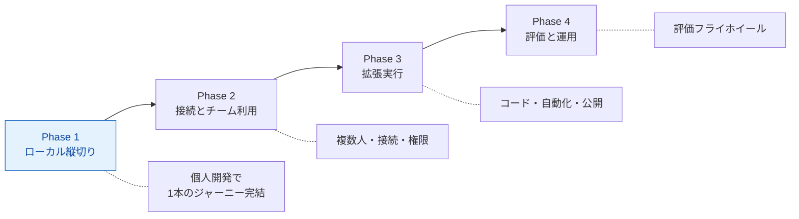
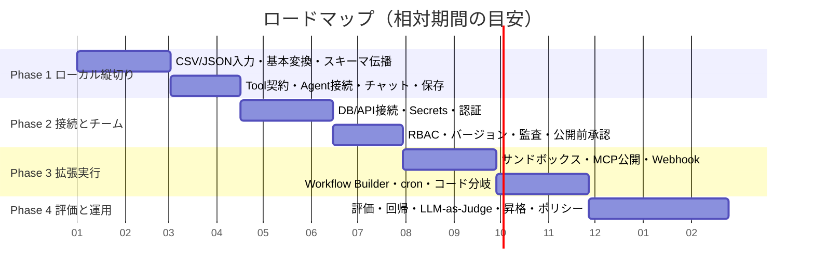
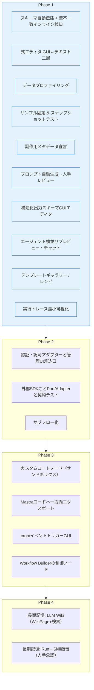
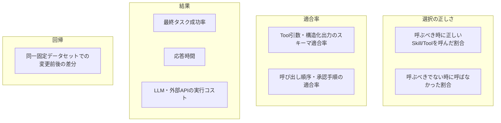
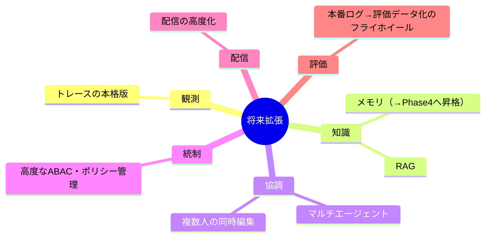

# 09. ロードマップと検証指標

段階的リリース。**拡張点は先に用意するが、初期リリースへ機能を詰め込まない**（`ideas-v2.md §7`）。

---

## 1. フェーズ全体像

### 相対タイムライン（イメージ・確定日程ではない）

> 日付はプレースホルダ。実期間は体制により変動する。

---

## 2. フェーズ別スコープ

### Phase 1: ローカル縦切り（= v1）
CSV/JSON入力、基本変換、スキーマ伝播、固定サンプルプレビュー、Tool契約、Agent接続、チャット、最小トレース、保存。

代表ジャーニーは [README.md](./README.md#7-v1スコープ縦切り一本) を参照。

### Phase 2: 接続とチーム利用
DB/API接続、Secrets Provider、認証アダプター、ワークスペースRBAC、バージョン、監査ログ、公開前承認。

### Phase 3: 拡張実行
カスタムコードのサンドボックス、MCP公開、Webhook、Workflow Builder、cron、コードプロジェクトへの分岐。

### Phase 4: 評価と運用
データセット評価、回帰、LLM-as-Judge、本番ログからの評価データ化、環境昇格、高度なポリシー制御。
加えて **長期記憶（`ideas-v3`）**: LLM Wiki（WikiPage + 検索）と Skillsベースの蒸留（Run → 提案 → 人手承認 → Skill.instructions 改訂）。詳細は [10-memory.md](./10-memory.md)。

---

## 3. 機能 → フェーズ対応（`ideas-v2.md §6` チェックリスト）

> 契約テストとPort/Adapterの骨格（`F12`）はPhase 1から用意し、Phase 2で実Adapterを充実させる。サブフロー化（`F13`）はコアが安定してから。

---

## 4. 検証指標

`ideas-v2.md §11`。テストケースごとに期待Skill/Tool・呼び出し要否・入力制約・順序・期待出力を定義し、次を測定する。

| 指標 | 内容 | 対応データモデル |
|---|---|---|
| Skill/Tool選択率 | 呼ぶべき場合に正しく呼んだ割合 | `ValidationResult.skillHitRate / toolHitRate` |
| 非呼び出し率 | 呼ぶべきでない場合に呼ばなかった割合 | `notCallWhenUnneeded` |
| スキーマ適合率 | 引数・構造化出力のスキーマ適合 | `schemaConformance` |
| 順序適合率 | 呼び出し順序・承認手順の適合 | `orderConformance` |
| タスク成功率 | 最終タスクの成否 | `taskSuccessRate` |
| コスト・応答時間 | LLM/外部API実行コスト、レイテンシ | `cost / latency` |
| 回帰差分 | 固定データセットの変更前後差分 | `regressionDiff` |
| 定性評価 | フィードバック・アンケート・感想 | `feedback` |

検証の実行フローは [07-execution-model.md](./07-execution-model.md#4-検証疑似ユーザー実行)、データモデルは [03-domain-model.md](./03-domain-model.md#6-検証validationモデル) を参照。

---

## 5. 保留（別軸・将来）

ノーコード体験の深掘りからは外れるが、いずれ必要になるもの（`ideas-v2.md §13`）。

> **昇格**: 「メモリ」は `ideas-v3` により **長期記憶（LLM Wiki + Skillsベース）** として具体化され、Phase 4 の計画に昇格した（[10-memory.md](./10-memory.md)）。RAG（埋め込み検索）はその M4 段階に含む。
>
> **昇格**: 「マルチエージェント」は **サブエージェント委譲**（Agent集約への参照追加・ツール委譲実行・単一チャット面）として具体化され、v17 実装計画に昇格した（[12-multi-agent.md](./12-multi-agent.md) / [ADR-0018](./adr/0018-multi-agent-sub-agent-delegation.md)）。

---

## 6. リリース判断のゲート

各フェーズは次を満たしてから次へ進む。

- [ ] **Phase 1 → 2**: 代表ジャーニー7ステップが縦切りで完結し、最小トレースで落ちた箇所を特定できる
- [ ] **Phase 2 → 3**: 認証・認可・監査・Secrets参照が全API経路で有効。契約テストが緑
- [ ] **Phase 3 → 4**: カスタムコードがサンドボックス制限下で実行され、公開エンドポイントが未認証既定でない
- [ ] **Phase 4**: 回帰差分とLLM-as-Judgeで品質を定量比較でき、本番ログを評価データへ還流できる
