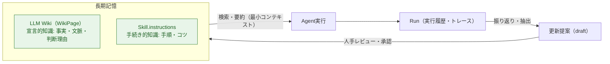
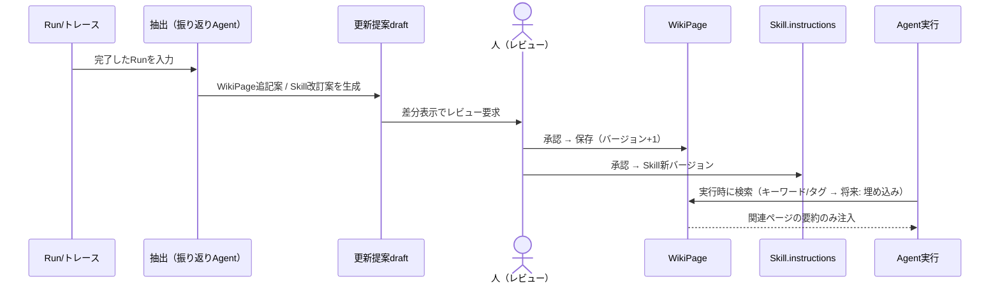
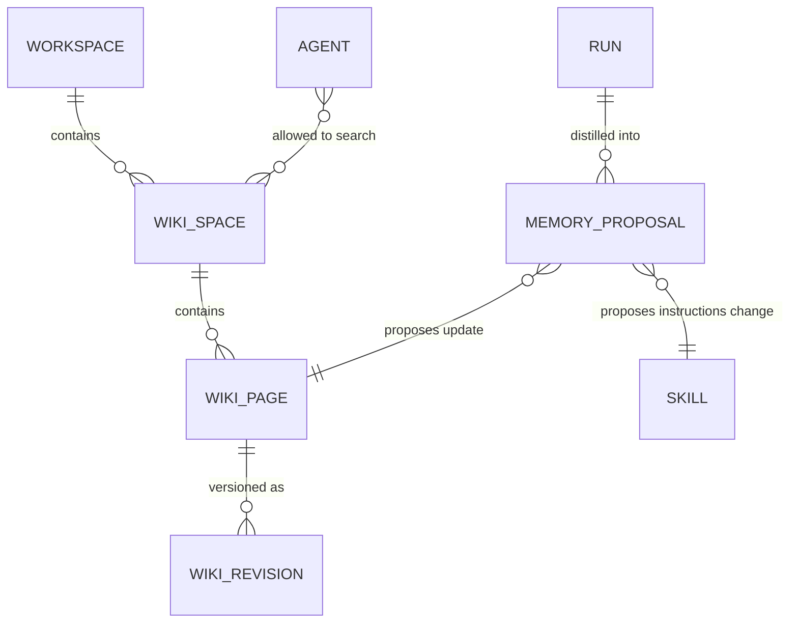

# 10. 長期記憶（LLM Wiki + Skillsベース）

> 参照: [03-domain-model.md](./03-domain-model.md) / [07-execution-model.md](./07-execution-model.md)
>
> **凡例**: ✅ = `ideas-v3.md` に明記 / 🔷 = 本仕様書が補う提案

`ideas-v2.md §13` で保留とされていた「メモリ・RAG」を、`ideas-v3.md` が **長期記憶** として具体化した。本ドキュメントはその設計仕様。実装は Phase 4（[09-roadmap.md](./09-roadmap.md)）。

---

## 1. 出典（ideas-v3 の要求）✅

1. **長期記憶の組み込み**: エージェントが過去の経験や学習内容を保持し、将来の意思決定・行動に活用できるようにする。環境との相互作用を通じて得た情報を蓄積し、必要に応じて取り出せる能力を提供する。
2. **手法**: **LLM Wiki** と **Skillsベースのアプローチ** の組み合わせ。
   - LLM Wiki — エージェントが自然言語での知識を理解・活用するための基盤。
   - Skillsベース — 特定のタスクやスキルに関する専門知識を強化する。

---

## 2. 二本柱の設計（🔷 具体化）

認知科学の記憶分類に対応させ、2種類の記憶を別の器で扱う。

| 柱 | 記憶の種類 | 器 | 内容 |
|---|---|---|---|
| **LLM Wiki** | 宣言的知識（事実・文脈） | `WikiSpace` + `WikiPage` | 顧客・業務・環境ごとに分離した名前付きWikiへ、業務知識・用語・判断理由をMarkdownページとして蓄積 |
| **Skillsベース** | 手続き的知識（やり方） | 既存 `Skill.instructions` | 実行経験から得た手順・コツ・注意点を、該当Skillの `instructions` への**改訂提案**として蒸留 |

> 既存の `Skill` は責務・発火条件・編集可能な `instructions` を持ち依存Toolをバージョン固定する（[03-domain-model.md §2](./03-domain-model.md)）。Skillsベースの長期記憶は**新しい仕組みを作らず、この Skill 資産を成長させる**アプローチを取る。



---

## 3. 記憶ループ（🔷）



設計原則との整合:
- **人手レビュー必須**: 記憶への書き込みは自動確定しない。プロンプト自動生成と同じ「生成→人がレビュー・編集」の原則（エスケープハッチ）。
- **最小コンテキスト**: Wiki全文をLLMへ渡さない。検索で絞り、要約・行数制限つきで注入（`ideas.md` のコンテキスト最小化原則）。
- **副作用宣言**: 記憶書き込みは `write` 副作用として扱い、承認・監査の対象（[08-security-auth.md](./08-security-auth.md)）。

---

## 4. ドメインモデル追加（🔷）



```typescript
interface WikiSpace {
  readonly id: string;
  readonly tenant: TenantScope;
  readonly name: string;
  readonly description: string;
}

interface WikiPage {
  readonly id: WikiPageId;
  readonly tenant: TenantScope;        // テナント境界必須
  readonly wikiId: string;             // 1つの名前付きWikiへ所属
  readonly title: string;
  readonly tags: readonly string[];
  readonly body: string;               // Markdown
  readonly version: number;            // 改訂番号（SemVer不要・単調増加）
  readonly sourceRuns: readonly RunId[]; // 出典Run（監査・出所追跡）
}

interface Agent {
  readonly wikis: readonly { wikiId: string }[]; // 実行時検索のallowlist
}

type MemoryProposalState = 'draft' | 'approved' | 'rejected';
interface MemoryProposal {
  readonly target: { kind: 'wiki'; pageId: WikiPageId } | { kind: 'skill'; skillId: ToolId };
  readonly diff: string;               // 人がレビューする差分
  readonly state: MemoryProposalState;
  readonly sourceRun: RunId;
}
```

---

## 5. MemoryPort（🔷）

ヘキサゴナル原則に従い、検索実装（v1: キーワード/タグ。将来: 埋め込みベクトル検索）はPortで隔離する。

```typescript
interface MemoryPort {
  search(scope: TenantScope, query: string, limit: number): Promise<WikiPageSummary[]>;
  load(scope: TenantScope, id: WikiPageId): Promise<WikiPage | null>;
  saveRevision(page: WikiPage): Promise<void>;            // 承認済み提案のみが到達
  listProposals(scope: TenantScope, state?: MemoryProposalState): Promise<MemoryProposal[]>;
}
```

- 埋め込み検索へ拡張する際は `ModelProviderPort` に `embed` capability を追加して接続する（[04-api-spec.md §2.1](./04-api-spec.md) の注記どおり capability 明示・暗黙フォールバックなし）。
- 永続化は既存方針どおり SQLite（local）→ PostgreSQL（team）。`WikiRepository` は `ToolRepository` と同じ契約テスト方式。

---

## 6. フェーズ計画（🔷）

| 段階 | 内容 |
|---|---|
| **M1**（Phase 4 前半） | WikiPage CRUD + タグ/キーワード検索 + 手動編集UI。Agent実行時の手動アタッチ（ページ指定注入） |
| **M1b** | 複数`WikiSpace`、AgentごとのWiki allowlist、allowlist内の自動検索・最小context注入 |
| **M2** | Run からの抽出（振り返りAgent）→ MemoryProposal → 差分レビューUI → 承認保存 |
| **M3** | Skill.instructions への蒸留提案（Skill新バージョン発行フローに接続） |
| **M4** | 埋め込み検索（`embed` capability）+ 自動関連ページ注入（最小コンテキスト制限つき） |

**非目標（当面）**: エージェント自身による無承認の記憶書き込み / ユーザー個人プロファイルの自動学習 / ワークスペース横断の記憶共有。
