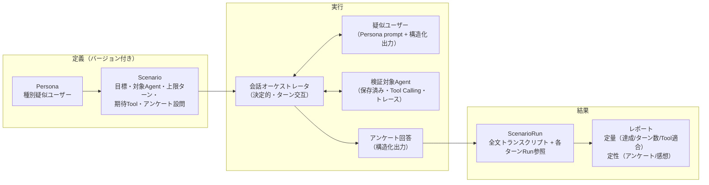
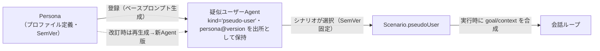
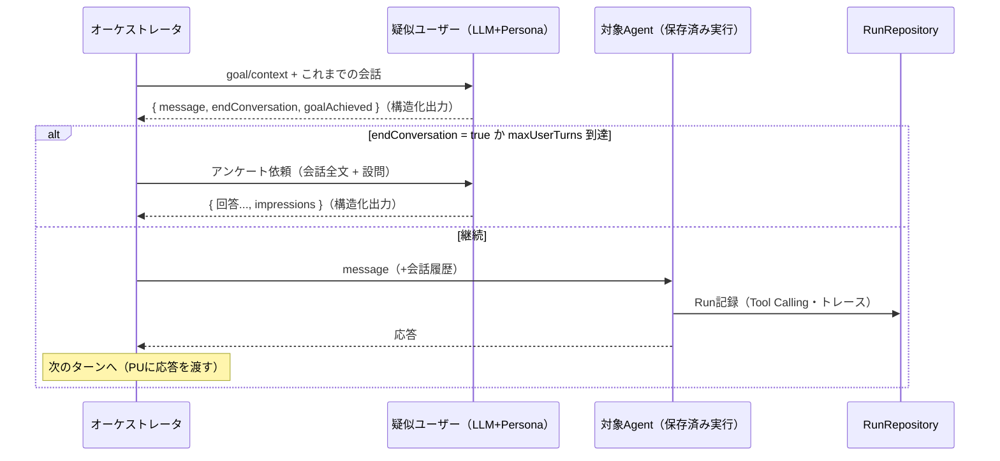

# 11. シナリオ検証（種別疑似ユーザー × 複数ターン会話 × アンケート）

> 参照: [03-domain-model.md §6](./03-domain-model.md) / [07-execution-model.md §4](./07-execution-model.md)
>
> **凡例**: ✅ = ideasに明記 / 🔷 = 本仕様書が補う具体化

検証対象のAgentに対し、**種別（ペルソナ）を持つ疑似ユーザー**が**複数ターンの会話**で実際にタスクを試み、終了後に**アンケート（定量）と感想（定性）**を回答する仕組み。実装は Increment 16（[ADR-0017](./adr/0017-scenario-validation-pseudo-users.md) / [implementation/v16-scenario-validation.md](../implementation/v16-scenario-validation.md)）。

---

## 1. 全体像



- 疑似ユーザーの各発話・終了判断・アンケートはすべて **構造化出力**（既存の Structured Output 機構）で受け取り、アプリ側で検証する。
- 検証対象Agentの各ターンは既存の **保存済みAgent実行**（bounded tool loop・Runトレース永続化）をそのまま使う。1ターン = 1 Run。

---

## 2. Persona（種別疑似ユーザー）✅→🔷

`ideas.md`「ユーザープロファイルで動作する疑似ユーザーエージェント」の具体化。**種別プリセット + カスタム属性**で定義する。

### 種別プリセット（archetype）

| 種別 | 挙動の型 |
|---|---|
| `novice`（初心者） | 用語を知らない。説明を求める。曖昧な表現で依頼する |
| `expert`（専門家） | 正確な用語で具体的に要求。回答の粗を突く |
| `busy`（せっかち） | 短文。結論を急ぐ。冗長な回答に不満を示す |
| `vague`（曖昧） | 要件を小出しにする。目標を最初に明かさない |
| `skeptical`（懐疑的） | 回答の根拠を求める。誤りを疑って確認する |
| `custom` | プリセットなし。属性と追加指示のみで構成 |

### Persona 属性（🔷）

```typescript
interface Persona {
  metadata: /* internalId / 名称 / SemVer / owner / tenant — Tool/Skill/Agentと同じ共通形 */;
  archetype: 'novice' | 'expert' | 'busy' | 'vague' | 'skeptical' | 'custom';
  knowledgeLevel: 'low' | 'mid' | 'high';
  patience: 'low' | 'mid' | 'high';       // 何ターンで諦めるかの傾向（プロンプトに反映）
  tone: string;                            // 口調（例: 丁寧・くだけた・事務的）
  verbosity: 'terse' | 'normal' | 'chatty';
  language: 'ja' | 'en';
  extraInstructions?: string;              // 自由記述の追加人物設定
}
```

Persona から疑似ユーザーの system prompt を**決定的に生成**する（テンプレート合成。LLMは使わない）。生成結果は画面でプレビュー・上書き可能（エスケープハッチ原則）。

### Persona登録 → 疑似ユーザーAgentへの統合（v18・[ADR-0019](./adr/0019-persona-pseudo-user-agent-integration.md)）

Persona は「ユーザープロファイル」として存続し、**登録操作で `kind='pseudo-user'` の Agent として実体化**する。



- Agentの `systemPrompt` = Personaから生成した**目標非依存のベースプロンプト**（編集可）。goal/context はシナリオ実行時に合成 → 1つの疑似ユーザーAgentを複数シナリオで再利用できる。
- v18時点の疑似ユーザーAgentは Tools / Skills / サブエージェントを持てない（将来解除）。
- シナリオの疑似ユーザー選択は **Agent参照に統一**（既存のPersona直接参照は後方互換として読み込み・実行のみ維持、deprecated）。

---

## 3. Scenario（検証パターン）🔷

```typescript
interface Scenario {
  metadata: /* SemVer付き共通形 */;
  target: { agentId: string; version: SemVer };   // 検証対象（バージョン固定）
  pseudoUser?: { agentId: string; version: SemVer }; // 疑似ユーザーAgent（v18〜。kind='pseudo-user' 検証）
  persona?: { personaId: string; version: SemVer };  // 直接参照（deprecated・後方互換）。pseudoUserと排他でどちらか必須
  goal: string;                 // 疑似ユーザーが達成したいこと（例: 先月の売上サマリを得る）
  context?: string;             // 状況設定（例: 経理締め前で急いでいる）
  maxUserTurns: number;         // 1..8（既定4）— LLM同士の無限対話の防止
  expectedTools?: string[];     // 期待するTool公開名（適合率算出用, ideas-v2 §11）
  survey: SurveyQuestion[];     // アンケート設問（既定テンプレをコピーして編集可）
}
```

**再現性**: 対象Agent・Persona・Scenario はすべて **SemVer固定**で参照する。同じ Scenario バージョンの再実行が回帰比較の単位（`ideas-v2.md §11` の「変更前後の回帰差分」）。

---

## 4. 会話ループ（複数ターン）🔷



- **終了条件**は3つ: ①疑似ユーザーが `endConversation:true` を返す（目標達成 or 諦め）②`maxUserTurns` 到達 ③エラー。ステータスとして記録する。
- **失敗はどの段で起きたかを残す**（v41）。疑似ユーザー段（`pseudo-user`）と対象Agent段（`agent`）の失敗は `status:'error'` のまま `error: { stage, message }` を記録する。Tool実行由来の失敗はどのTool・どのノードかまで `message` に載せる。中断（AbortSignal）は失敗ではないのでそのまま呼び出し元へ投げ、ScenarioRun は保存しない。
- 対象Agentの1ターンには既存の上限（Tool call 最大4回・model round 最大5回）がそのまま適用される。
- preview/test 実行の既存規則に従い、**対象AgentのTool集合が read-only の場合のみ実行**する（[07-execution-model.md](./07-execution-model.md)）。

---

## 5. アンケート（定量）と感想（定性）✅→🔷

会話終了後、**疑似ユーザー自身が Persona として**回答する（self-report）。第三者採点（LLM-as-Judge / Evaluator agent）は Phase 4 で追加。

### 設問型

| kind | 回答 | 例 |
|---|---|---|
| `scale` | 整数 min..max（既定1..5） | 満足度は? |
| `boolean` | yes/no | 目的は達成できたか? |
| `text` | 自由記述 | 感想・不満だった点は? |

### 既定テンプレート（DEFAULT_SURVEY）

1. 目的を達成できましたか（boolean）
2. 総合満足度（scale 1-5）
3. 回答のわかりやすさ（scale 1-5）
4. 手間の少なさ — 少ないほど高評価（scale 1-5）
5. 回答をどの程度信頼できましたか（scale 1-5）
6. 良かった点（text）
7. 不満・困った点（text）
8. **感想（自由記述）**（text）— `impressions` として独立フィールドにも保持

### 回答の検証と修復（v41）

- `scale` の範囲は**構造化出力スキーマの `minimum` / `maximum`** として渡す。説明文だけに書いていた頃は、不満なペルソナが `0` を返して検証に落ち、会話1本分の記録ごと `error` になっていた。
- 検証に落ちたら、**同じ依頼を送り直さない**。直前の回答と「どの検証に落ちたか」（`ValidationDomainError` の文言）を添えて1回だけ直してもらう（契約レビューの修復と同じ型）。
- それでも回収できなければ**アンケートだけを諦める**。会話の結末（`completed` / `max-turns`）と `goalAchieved` はそのまま残し、`error: { stage: 'survey', message }` に理由を記録する（`survey: []` だけでは「不満で低評価だった利用者」と区別できない）。

---

## 6. ScenarioRun（結果の記録）🔷

```typescript
interface ScenarioRun {
  id: string; scope: TenantScope;
  scenario: { id: string; version: SemVer };   // 実行時点の固定参照
  status: 'completed' | 'max-turns' | 'error';
  error?: { stage: 'pseudo-user' | 'agent' | 'survey'; message: string };  // 失敗/アンケート未回収の理由（v41）
  goalAchieved: boolean | null;                 // 疑似ユーザー申告
  transcript: Turn[];                           // { speaker: 'user'|'agent', message, runId?(agentターン) }
  survey: { questionId: string; value: number | boolean | string }[];
  impressions: string;                          // 感想
  metrics: {
    userTurns: number; agentRuns: number; totalToolCalls: number;
    expectedToolHit?: { expected: string[]; called: string[]; hitRate: number };
    durationMs: number; usage: RunUsage;        // トークン合計
  };
  startedAt: string; finishedAt: string;
}
```

- `transcript` の各Agentターンは既存 `RunRepository` の Run を `runId` で参照 → Status画面のトレースへドリルダウン可能。
- `expectedToolHit` は期待Tool集合と実呼び出し集合（トレース由来）の比較（`ideas-v2.md §11` の選択率指標の会話版）。
- `error` は `status:'error'`、またはアンケートを回収できなかったときに入る。Runs画面の詳細に「どの段で何が起きたか」として1行で出す。`stage:'survey'` の実行は会話としては成立しており、Agent Factory のメトリクス（`errorRate`）にも**エラーとして数えない**。

---

## 7. 検証画面の拡張 🔷

| タブ | 内容 |
|---|---|
| **Personas** | 種別プリセットから作成・属性編集・生成プロンプトのプレビュー/上書き・バージョン保存 |
| **Scenarios** | 対象Agent+バージョン選択・Persona選択・goal/context・上限ターン・期待Tool・アンケート設問編集・実行ボタン |
| **Runs** | 実行履歴一覧 → トランスクリプト全文・各ターンのRunトレースリンク・アンケート結果（スケールはバー表示）・感想 |

同一Scenarioの複数Run比較（回帰ビュー）は次段。

---

## 8. 非目標

- ~~LLM-as-Judge / Evaluator agent による第三者採点（Phase 4）~~ → 実験の judge 指標として実装（§9）。残る非目標: 判定者の較正（AutoCalibrate 系）
- 複数Persona一括実行・統計集計（次段。まず1実行を確実に）
- ~~疑似ユーザーの完全なAgent化~~ → **v18で統合**（[ADR-0019](./adr/0019-persona-pseudo-user-agent-integration.md)）。残る非目標: 疑似ユーザーAgentへの Tools / Skills / サブエージェント付与（将来解除）
- write/external-action Tool を含むAgentへのシナリオ実行

---

## 9. LLM 判定（基準別採点・判定契約・自己一貫性）

実験（Experiment）の judge 指標は、ルーブリック（Judge Rubric）を渡した LLM に応答を採点させる。単一の「0〜1 の点」を返させる方式は、根拠が後付けになり、長い・自信ありげな応答を高く付けやすく、なぜその点かを後から検証できない。以下の設計に置き換えた（[ADR-0037](./adr/0037-criterion-level-judging.md)）。

### 9.1 基準別に採点し、重みで合成する

- 判定者はルーブリックの**基準ごと**に `{ id, reason, score }` を返す。`score` はその基準に定義した段階（levels）の値のいずれか、`null` は「与えられた情報では判定できない」（理由は必須）。
- 合成スコア = Σ(weight × score) / Σ(weight)。**null の基準は分母からも外す**（判定できた基準だけで平均する）。全基準が null なら合成できないので `JUDGE_UNASSESSABLE` として失敗レコードにする。
- 基準別スコアは事例の `scores[]` に `"<metric>:<criterion>"` で並ぶ。実験比較・品質ゲートはこの名前で「どの基準が退行したか」を見られる。

### 9.2 根拠先出しと長さ・体裁への中立

システムプロンプトと応答スキーマは、各基準で **理由（reason）を先に書いてから段階を選ぶ** 順にしてある（結論を先に出すと理由が後付けになる）。プロンプトは「長さ・冗長さ・体裁・断定口調・専門用語それ自体に報酬を与えない。ルーブリックだけで判定する」「基準は互いに独立に判定する」「情報不足なら null」を明示する。出力が契約（スキーマ・基準 id の過不足・段階に無い値・空の理由）に合わなければ、違反を列挙して **1 回だけ** 修正を求め、それでも合わなければ `JUDGE_SCHEMA`。

### 9.3 判定契約（contract）とコスト（usage）

判定レコードは `contract = { promptHash, rubricId, rubricVersion }` を持つ。`promptHash` はプロンプト文面の版・ルーブリック JSON・応答スキーマから作る指紋で、判定者側の更新（プロンプト改訂・ルーブリック改版）が結果に痕跡として残る。スコアが動いたとき「エージェントが変わった」のか「判定者が変わった」のかを切り分ける土台になる。`usage` は判定に使ったトークン（修復・全サンプル分の合計）。

### 9.4 判定者に軌跡と履歴を渡す（tracePolicy）

最終応答だけでは「正しいツールを正しい引数で呼んだか」「会話の流れに沿っているか」を判定できない。ルーブリックの `tracePolicy`（`optional` / `required` / `forbidden`、既定 `optional`）に従って次を渡す。

| 事例 | 渡すもの |
|---|---|
| turn | Run の `tool-call` / `tool-result` を対応付けた `trace.toolCalls[{ name, arguments, resultSummary }]`（結果は出力プレビュー先頭 10 行の JSON。結果が無い呼び出しは `no tool result recorded`） |
| scenario | 最終応答（判定対象）を除く会話 `history[{ role: user \| assistant, content }]`。軌跡は ScenarioRun が保持しないため渡さない |

上限は tool 呼び出し 20 件・履歴 20 件（古い側を落とす）・本文各 2,000 文字（超過は印を付けて切る）。`required` で軌跡が無ければ `JUDGE_INPUT`（scenario 事例では常にそうなる）。`forbidden` なら何も渡さない（応答だけを見せたいとき）。軌跡も履歴も **untrusted data ブロックの内側** に入れ、命令としては扱わない。

**起票時に止める矛盾（`POST /experiments` の 409）** — 「走らせれば必ず全事例が判定失敗になる」組み合わせは実験を作らずに返す。どちらも利用者の設定変更で直せる。

| code | 原因 | 直し方 |
|---|---|---|
| `JUDGE_MODEL_NOT_CONFIGURED` | 評価プロファイルに judge 指標があるのに judge スロットにモデルが無い（設定未保存かつ `JUDGE_LM_STUDIO_MODEL` 未設定） | 設定画面で judge スロットのモデルを選んで保存する（`GET /runtime/capabilities` の `judge.configured` で起票前に分かる） |
| `JUDGE_TRACE_UNAVAILABLE` | `tracePolicy: required` のルーブリックを、scenario 事例を含むデータセットに使った（scenario 事例は軌跡を持たない）。本文の `rubric: { id, version }` が対象 | そのルーブリックの `tracePolicy` を `optional` にするか、データセットを turn 事例だけにする |

実行中に judge が未設定だと分かった場合（起票後に設定を消したなど）は、判定レコードを `JUDGE_PROVIDER`（`Judge model is not configured; set the judge slot in Settings`）の失敗にして事例は完了させる。事例そのものは落とさない。

### 9.5 自己一貫性（judgeSamples）

実験の `judgeSamples`（1〜5、既定 1）を 2 以上にすると、同じ入力で判定を独立に複数回行い（温度 0.5。1 回判定は温度 0）:

- 合成スコアは各サンプルの合成の**中央値**、基準別スコアは判定できたサンプルの中央値（どのサンプルでも null なら null）、理由は中央値に最も近いサンプルのもの。
- `dispersion = { min, max, stddev }`（母標準偏差）を記録し、`max − min ≥ 0.25` なら `uncertain: true`（判定が割れている。ルーブリックの曖昧さ・事例の難しさの信号）。
- サンプルの一部が失敗しても残りで集約し、`samples` に実際の数を残す。全滅なら最後の失敗コードで失敗レコード。

コストはサンプル数に比例する（`usage` に合計が残る）。まずは `uncertain` が出る事例を絞り込む目的で 3 程度から使う。
