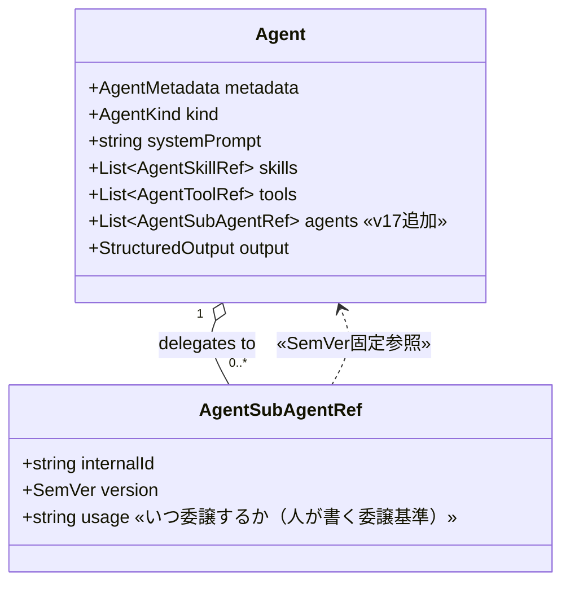
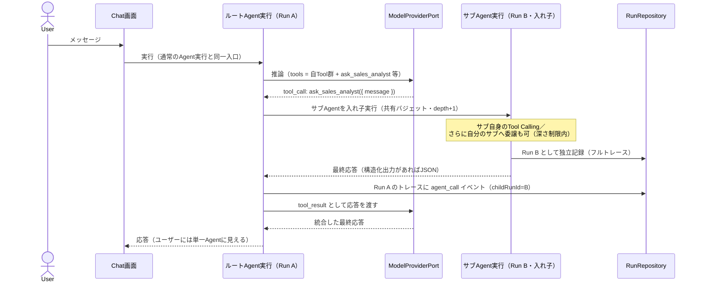
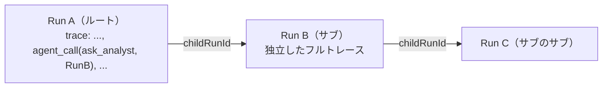

# 12. マルチエージェント（サブエージェント委譲）

> 参照: [`ideas-v2.md` §13 保留（マルチエージェント）](../ideas/ideas-v2.md) / [03-domain-model.md](./03-domain-model.md) / [07-execution-model.md](./07-execution-model.md) / [11-scenario-validation.md](./11-scenario-validation.md)
>
> **凡例**: 🔷 = 本仕様書による設計（`ideas-v2.md §13` で保留だった「マルチエージェント」の具体化）

作成済みのAgent同士を協調させる仕組み。**設計の憲法は次の2点**:

1. **ユーザーが会話する相手は常に1つのAgent**（ルートAgent）。マルチエージェントであることはチャットUIに現れない。
2. **合成された関係は通常のAgentと同一の抽象**。サブエージェントを持つAgentも、Chat・検証・バージョニング・公開のすべてで普通のAgentとして扱える。新しい「チーム」エンティティは作らない。

---

## 1. 中核アイデア: Agent集約への第3の能力リスト

Agent は現在 `skills` と `tools` の2つの参照リストを持つ。ここに **`agents`（サブエージェント参照）** を加えるだけで、マルチエージェントは既存抽象の内側に収まる。

- 参照は Tool / Skill と同じく **SemVer固定**。「latest」参照は保存しない（再現性、既存方針どおり）。
- `usage` はスキルの発火条件と同格の**委譲基準**（例:「売上の数値分析が必要なとき」）。LLMに提示するツール説明文になり、検証画面で選択率を測る対象にもなる。

### 循環参照は構造的に不可能 🔷

参照は保存済みバージョンにしか張れない。「A@1 → B@1」を保存するには B@1 が先に存在し、B@1 が A@1 を参照するには A@1 が先に存在する必要がある — 両立しないため、**バージョングラフは構築時からDAG**。追加の禁止則は「同一 `internalId` への自己参照禁止」（旧バージョンの自分への委譲は無意味なので明示的に拒否）のみでよい。

---

## 2. 実行モデル: サブエージェント = Tool Calling の1ツール

ルートAgentのLLMには、サブエージェントが **`ask_{publishName}` という名前のツール**として提示される。LLMがそのツールを呼ぶと、ランタイムはサブエージェントを**通常のAgent実行**（自身のTool・Skill・bounded loop・トレース記録つき）として走らせ、最終応答をツール結果として返す。

### ツール定義への写像 🔷

| 項目 | 内容 |
|---|---|
| name | `ask_{publishName}`（保存時に Tool 公開名との衝突を検証） |
| description | 参照の `usage`（委譲基準）+ サブAgentの表示名 |
| input schema | `{ message: string }`（required）— 委譲内容は自然言語で渡す |
| result | サブの応答テキスト。構造化出力を持つサブはそのJSON |

LLMから見れば ETL Tool もサブエージェントも「ツール」で区別がない。**計算・データ処理はToolへ、判断・言語処理はサブエージェントへ**という委譲の使い分けは `usage` 文で表現する。

---

## 3. 暴走とコストの制御 🔷

入れ子実行は乗算的にコストが増えるため、**Runツリー全体で共有するバジェット**を導入する。

| 制御 | 規則 | 既定 |
|---|---|---|
| 委譲深さ | ルート=0。`maxDelegationDepth` を超える委譲は実行せずエラー結果を親へ返す | 2（上限3） |
| 合計モデルラウンド | ツリー全体の model round 合計上限（既存の per-Agent 上限 5 はそのまま各ノードに適用） | 12 |
| 合計Tool呼び出し | ツリー全体の tool call 合計上限（per-Agent 上限 4 は維持） | 16 |
| バジェット枯渇時 | 実行中のサブRunは `error` で確定し、親にはエラーをツール結果として返す（親LLMは謝罪・要約等で応答を続けられる） | — |

- **副作用の伝播**: Agentの実効副作用 = 自身のTool群 ∪ 全サブAgentの実効副作用の最大値（再帰・メモ化）。preview / test の「read-onlyのみ実行」は**実効副作用**で判定する。
- 深さ・バジェットは実行入力で上書き可能（検証時に絞る等）だが、既定上限を超える緩和はできない。

---

## 4. トレースと観測 🔷

- サブエージェント実行は**独立した Run** として永続化（既存のRunRepository）。
- 親Runのトレースに `agent_call` イベント（`ask_名 / childRunId / 要約`）を記録。
- Status画面は既存のRunドリルダウンがそのまま効く: 親トレース → `agent_call` → 子Runのフルトレース（シナリオ検証のターン→Runリンクと同じ方式）。

---

## 5. 均一抽象がもたらす無償の機能

「サブエージェント持ちAgentも普通のAgent」なので、以下は**追加実装なしに**成立する:

| 機能 | 効果 |
|---|---|
| Chat画面 | ルートAgentを選ぶだけ。UI変更不要 |
| シナリオ検証（[11](./11-scenario-validation.md)） | 検証対象にマルチエージェント構成をそのまま指定可能。疑似ユーザー×アンケートも動く |
| バージョニング | ルートの構成変更は普通のAgentバージョン発行。サブ差し替え＝参照の版上げ |
| ネスト | サブ自身がサブを持てる（深さ制限内）。「チームのチーム」も同じ抽象 |
| エクスポート/公開 | Mastraエクスポート・MCP公開の対象としても単一Agentとして扱える（各機能の実装状況に従う） |

**検証指標の拡張（将来）**: `usage`（委譲基準）の良し悪しは、期待サブエージェント呼び出しの適合率としてシナリオ検証の指標に追加できる（期待Toolと同型）。

---

## 6. Agent Builder の拡張 🔷

- **Sub-agentsピッカー**: Toolピッカーと同型（Agent一覧から選択・バージョン固定・自分自身は除外）+ 各参照の `usage` テキスト入力（必須）。
- **プロンプト自動生成**: 既存のSkillセクションと同様に「協働者」セクションを自動生成（サブの表示名と `usage` から）。生成結果は人がレビュー・編集（既存原則）。
- **実効副作用の表示**: サブを追加した時点で実効副作用（read-only / write / external-action）をバッジ表示し、preview不可になる構成を保存前に警告（即時バリデーション原則）。

---

## 7. 非目標（v17時点）と設計済みの拡張路

以下はv17では実装しないが、**本設計の延長線上で追加可能**なことを確認済み。抽象を支える3つの性質 —（a）サブエージェント=Tool Callingループ上の1ツール、（b）委譲はステートレスな `message` 往復、（c）深さ・バジェットの実行時ガードが静的DAGに依存しない — が拡張の土台になる。

| 非目標 | 拡張可能性 | 追加が必要なもの / 条件 |
|---|---|---|
| **並列委譲** | ◎ 設計変更不要 | 同一ラウンドの複数 `ask_*` tool_calls を並列実行するだけ（委譲はステートレスなので意味論不変）。共有バジェットの**事前予約**のみ注意 |
| **動的エージェント発見** | ○ メタツール追加 | 組み込みツール `discover_agents`（Published限定検索）+ `ask_agent`（汎用委譲）。**条件**: Agentごとのopt-inフラグ / 呼び先agent@versionのトレース記録（実行時再現性へ切替）/ 実効副作用の委譲時動的チェック。動的化で循環が可能になるが、（c）のガードにより有界な再帰に収まる |
| **サブ同士のP2P対話（有界）** | ○ v16機構の一般化 | [11-scenario-validation.md](./11-scenario-validation.md) の交互対話オーケストレータ（history注入・決定的終了）を `convene({ participants, topic, maxTurns })` 組み込みツールとして一般化。P2Pは1ツール呼び出しの内側で起き、単一チャット面の憲法は保たれる |
| **自律スウォーム**（Run外の自由通信） | △ 憲法と衝突 | 「単一窓口・決定的オーケストレーション」（[ADR-0018](./adr/0018-multi-agent-sub-agent-delegation.md)）の改訂が前提。ドメインモデル・ストレージ上の障害はない |
| 会話状態のサブ間共有 | ○ | 各委譲は独立 `message` で開始（v17）。継続文脈は `convene` 導入時に対話スコープの共有履歴として扱う |
