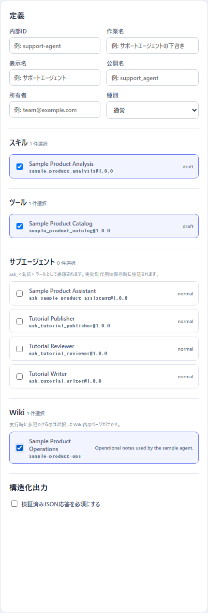
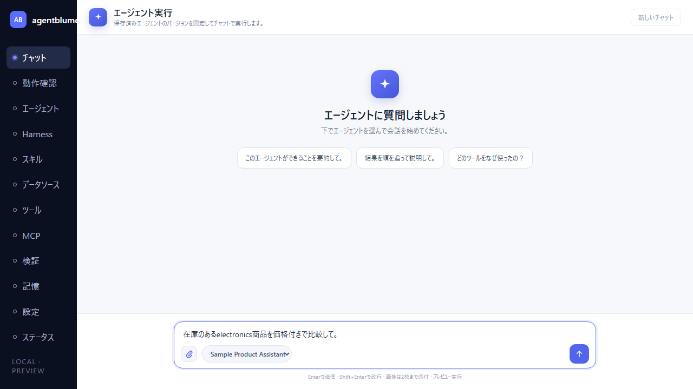
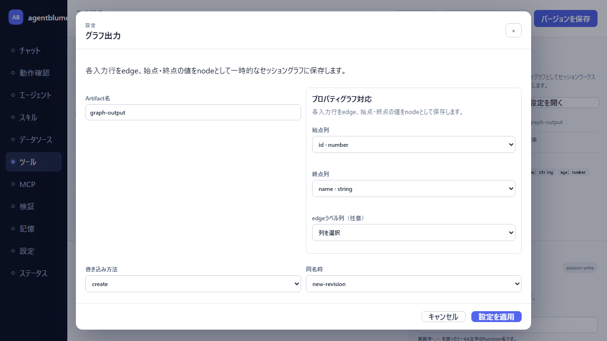

# デモデータ操作マニュアル

この資料では、agentblumeをデモデータ付きで起動し、データソース、Tool、Skill、Wiki、Agentを確認して、保存済みAgentを実際に動かすまでの手順を説明する。

掲載画像は2026年7月13日にPlaywrightで実画面を操作して取得した。データの存在やToolプレビューの行内容を画面ごとに検証してから撮影している。最後のチャット結果は、ローカルのLM Studioへ実際に問い合わせた結果である。

## 1. 事前準備

Node.jsと依存パッケージを準備する。初回だけPlaywright用Chromiumもインストールする。

```powershell
npm install
npm run test:e2e:install
```

Tool Builderやデータソースだけを確認する場合、モデル設定は不要である。Agentチャットまで確認する場合は、LM StudioでOpenAI互換サーバーとTool Calling対応モデルを起動し、ローカル設定を作成する。

```powershell
.\scripts\set-lm-studio-config.ps1 `
  -BaseUrl http://127.0.0.1:1234/v1 `
  -Model <LM Studioに表示されるモデルID>
```

設定はGit管理対象外の`scripts/lm-studio.local.ps1`へ保存される。APIキーや接続情報をブラウザーへ入力する必要はない。

## 2. デモ環境を起動する

```powershell
npm run dev:sample
```

起動後、`http://127.0.0.1:5173`を開く。既定ポートを変更する場合は次のように起動する。

```powershell
.\scripts\start-dev.ps1 -SampleData -ApiPort 3031 -UiPort 5174
```

デモデータは同じIDが存在するときには再作成されない。`AGENTCONTEXT_DB_PATH`を指定していない場合はメモリ上に保存されるため、APIを停止すると消える。

投入されるデータは次のとおり。

| 種別 | IDまたは名前 | 用途 |
|---|---|---|
| CSV | `sample-products.csv` | 商品3件のファイルデータソース |
| JSON | `sample-customers.json` | 顧客2件のファイルデータソース |
| CSV | `sample-monthly-sales.csv` | 月次売上6行（2リージョン×3ヶ月）のファイルデータソース。Agent Factory（§10）で使う |
| Tool | `sample-product-catalog` | 商品カタログ3件をAgentへ返す |
| Skill | `sample-product-analysis` | カタログに基づく回答規則 |
| Wiki | `sample-product-ops` | 在庫・価格・カテゴリの判断規則 |
| Agent | `sample-product-assistant` | Tool、Skill、Wikiを割り当てたデモAgent |

## 3. データソースを確認する

1. 左サイドバーの「データソース」を選択する。
2. 「登録済みソース」に`sample-products.csv`と`sample-customers.json`が表示されることを確認する。
3. 新しいCSV/JSONを追加するときは、「ファイルをアップロード」でファイルとソース名を指定する。
4. DB接続はブラウザーへ接続文字列を入力せず、バックエンドで構成済みの接続IDだけを選択する。


実測時にはCSVが161 B、JSONが185 Bとして登録され、画面へHTMLではなくJSON APIの結果が正常に表示された。

## 4. 保存済みToolを読み込み、プレビューする

1. 左サイドバーの「ツール」を選択する。
2. 上部の「メタデータ」を開く。
3. 「内部ID」に`sample-product-catalog`を入力する。
4. 「バージョン」を押し、「バージョン履歴」から`1.0.0`を選択する。
5. キャンバスに`JSON source -> Agent output`が表示されることを確認する。
6. 下部のプレビューで商品3件を確認する。


実際のプレビュー結果は次の3行だった。

| id | name | category | price | inStock |
|---|---|---|---:|---|
| `p-100` | Wireless Headphones | electronics | 12900 | true |
| `p-200` | Mechanical Keyboard | electronics | 15800 | true |
| `p-300` | Desk Lamp | home | 4200 | false |

ToolのプレビューはLLMを呼ばず、ETL Engineが決定的に実行する。そのため、LM Studioが停止していてもこの結果は確認できる。

## 5. AgentへSkill、Tool、Wikiを割り当てる

1. 左サイドバーの「エージェント」を選択する。
2. 「スキル」で`Sample Product Analysis`を選択する。
3. 「ツール」で`Sample Product Catalog`を選択する。
4. 「Wiki」で`Sample Product Operations`を選択する。
5. 新規Agentとして保存する場合は、上部の定義とシステムプロンプトを入力して「バージョンを保存」を押す。



Wikiは複数作成でき、AgentにチェックしたWikiだけが実行時の検索対象になる。顧客や業務領域ごとにWikiを分けることで知識の混線を防げる。

## 6. Wikiの内容を確認・編集する

1. 左サイドバーの「記憶」を選択する。
2. 「選択中のWiki」で`Sample Product Operations`を選択する。
3. 左側の`Product catalog response guide`を開く。
4. タイトル、タグ、本文を確認する。
5. 修正した場合は「ページを保存」を押す。


デモWikiには「在庫のある商品のみを推奨し、代替案を示す前に価格とカテゴリを比較する」という規則が登録されている。

## 7. 保存済みAgentを実行する

1. LM StudioのOpenAI互換サーバーと対象モデルを起動する。
2. 左サイドバーの「チャット」を選択する。
3. 「チャット対象エージェント」で`Sample Product Assistant · 1.0.0`を選択する。
4. 必要に応じてクリップの「画像を添付」ボタンから画像を選ぶ。
5. 質問を入力して送信する。

画像を添付する場合は、画像入力対応のモデルをLM Studioで読み込んでおく。PNG、JPEG、WebP、GIFを最大2枚、各3 MiBまで添付できる。選択した画像はチャットとAPIの間でのみデータURLとして渡され、外部URLの取得は行わない。画像だけでは送信できないため、たとえば「この画像の内容を説明して」のように指示も入力する。

次の例では「在庫のあるelectronics商品を価格付きで比較して。」と入力している。



実際に送信すると、Agentは`sample_product_catalog`を呼び出し、3行のTool結果を取得した。その後のモデル応答では、在庫がありカテゴリがelectronicsの商品だけを次のように比較した。

- Wireless Headphones: 12,900円
- Mechanical Keyboard: 15,800円


画面のトレースでは次の順序を確認できる。

1. モデル要求 step 1
2. `sample_product_catalog({})`のTool呼び出し
3. `catalog:3`、`agent-result:3`のTool結果
4. モデル要求 step 2
5. 最終モデル応答

この実行では614 tokensが記録された。Toolの出力は直接Agentへ返す`agent-output`だったため、セッションワークスペースの一時Artifactは0件だった。

## 8. 専用グラフ出力ノードを設定する

1. Tool Builderで、2列以上を持つ上流ノードを選択する。
2. ノードパレットの「出力」から「グラフ出力」を追加する。
3. 「設定を開く」を押す。
4. Artifact名、始点列、終点列、任意のedgeラベル列を指定する。
5. 書き込み方法と同名時の扱いを指定し、「設定を適用」を押す。



上流スキーマに2列以上ある場合、追加時に先頭2列が始点・終点へ自動設定される。グラフ出力を追加するとToolの副作用分類は`session-write`になり、実行時にはproperty graph ArtifactとしてAgent Session Workspaceへ保存される。

## 9. スクリーンショットと操作検証を再実行する

外部モデルを使わず、デモデータと画面操作を決定的に再検証する場合は次を実行する。

```powershell
npm run docs:screenshots
```

このコマンドは専用のAPI/UIを一時起動し、Playwrightで次を検証してから画像01〜06を更新する。

- CSV/JSONデータソースが表示される。
- 保存済みTool v1.0.0を読み込める。
- 商品3行がプレビューされる。
- Skill、Tool、WikiをAgentへ選択できる。
- Wikiページ本文を読み込める。
- デモAgentがチャット選択肢に表示される。
- グラフ出力で`id -> name`の列対応が初期設定される。

LM Studioを含めて実際のAgent応答まで再取得する場合は次を実行する。

```powershell
npm run docs:screenshots:live
```

ライブ撮影は`scripts/lm-studio.local.ps1`を使用し、画像07も更新する。モデルの応答文、token数、Run IDは実行ごとに変わる可能性がある。

## 10. Agent Factory を試す

Agent Factory（[docs/16-agent-factory.md](./16-agent-factory.md)）は、データソースと「やりたいこと」の自然文だけからTool・Skill・Agent・検証資産（Persona/Scenario）一式を自動生成し、疑似ユーザー検証の結果から自動で改訂を繰り返す機能である。構造化出力（`structured-output` capability）に対応したモデルがLM Studio側で必要になる。`.\scripts\start-dev.ps1 -SampleData`でデモデータ付き起動し、LM Studioを起動してから次の手順を試す。

1. 左サイドバーの「Factory」タブを開く。
2. 「やりたいこと」に例えば「月次売上について質問に答え傾向を要約するアシスタント」と入力する。
3. データソース選択で`sample-monthly-sales.csv`を選ぶ。
4. 「生成を開始」を押す。
5. 実行タイムラインで各Stage（Profile → Plan → Tools → Skills → Agent → Validate → Analyze…）の進行を確認する。
6. `requirePlanApproval`を有効にしていて`waiting-approval`で停止した場合は、提示された計画を確認し承認する。
7. `succeeded`になったら、レポート（最良イテレーション・候補Agent版・イテレーション別メトリクス）を確認する。
8. 生成されたTool/Skill/Agent/Scenarioは、それぞれのBuilder画面（ツール/スキル/エージェント/検証）にdraftとして現れる。生成物はすべてdraftのままであり、昇格は行われない。公開・昇格したい場合は既存の品質ゲート画面から人手で承認する。

## 11. トラブルシューティング

### チャットでモデル未設定エラーになる

`LM_STUDIO_MODEL`が設定されているか、LM Studioの`GET /v1/models`に同じモデルIDが表示されるかを確認する。ローカル設定は`set-lm-studio-config.ps1`で作り直せる。

### デモデータが表示されない

通常起動ではなく`npm run dev:sample`または`start-dev.ps1 -SampleData`を使う。既存APIが起動している場合は停止してから起動し直す。

### DB接続が表示されない

DB接続は`.env.example`を参考に`AGENTCONTEXT_DB_CONNECTIONS`と、`passwordEnv`で参照するパスワード環境変数をバックエンドへ設定する。ブラウザー側だけの設定では表示されない。

### Web検索ノードが表示されない

Tavily、TinyFish、Google Custom Searchのいずれかに必要な環境変数が揃った場合だけ表示される。未設定時に非表示なのは仕様である。
