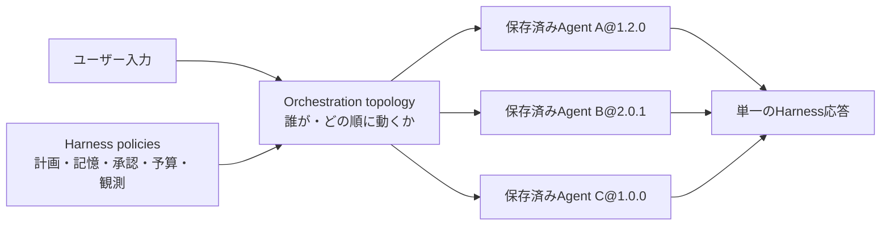
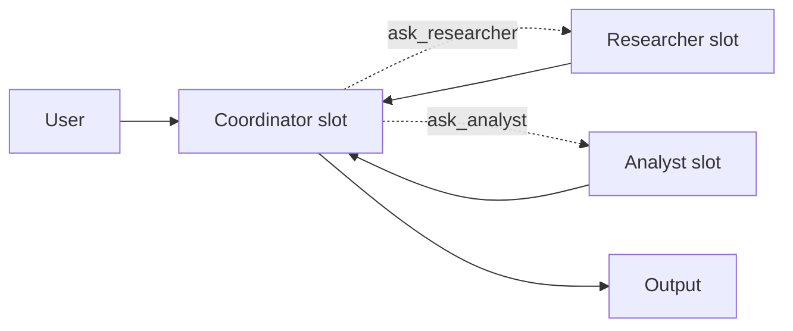
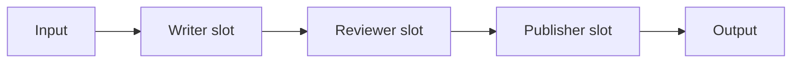
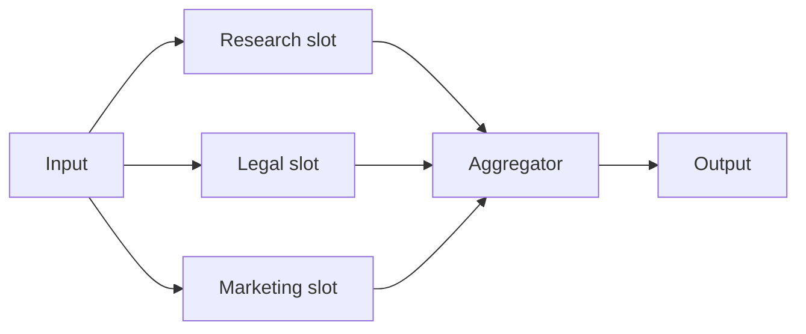
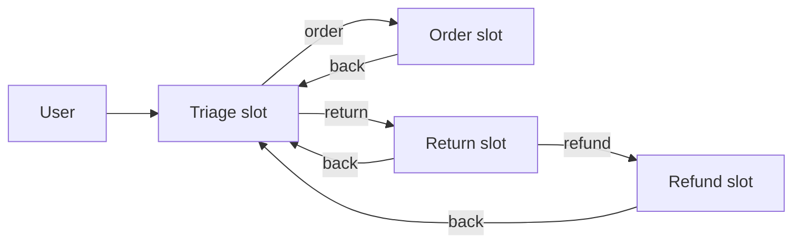
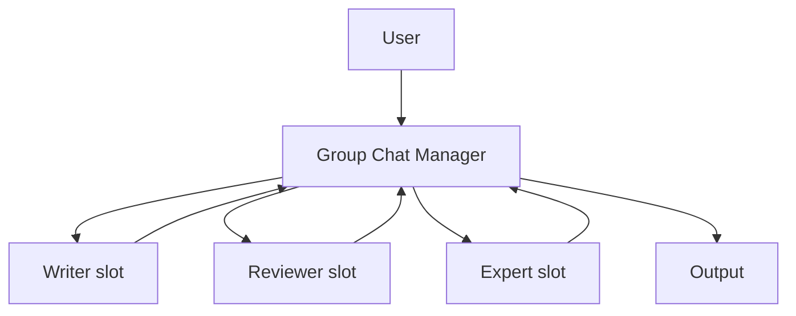
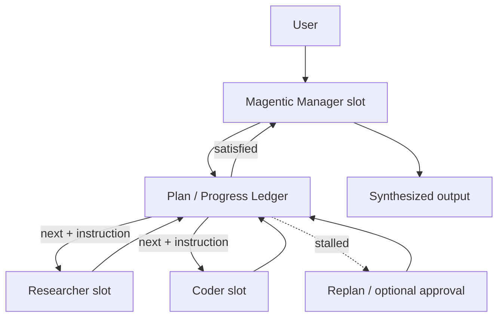
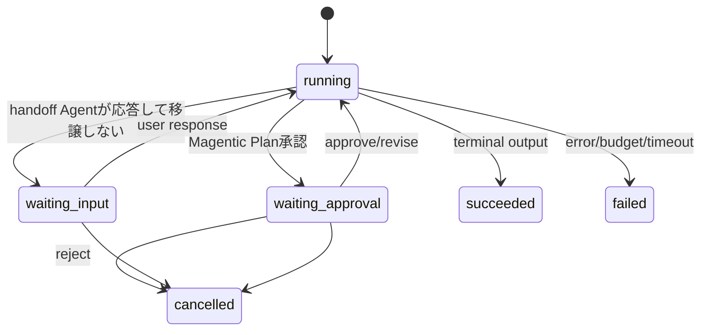

# 14. マルチエージェントビルダー（Agent Harness Builder）

> Status: Implemented (M1–M5 core preview、および interactive runtime の Handoff会話再開・Magentic計画承認・永続checkpoint)。
>
> 関連: [12-multi-agent.md](./12-multi-agent.md) / [07-execution-model.md](./07-execution-model.md) / [ADR-0032](./adr/0032-versioned-agent-harness-orchestration.md)

> **用語について**
>
> - UI表記は「**マルチエージェント**」、英語UIでは `Multi-Agent` である。本書が使う `Harness` / `AgentHarness` は型名・API・ドメイン用語として残す。画面IDは `Harness`、ルートは `#/harness` のまま変更しない。
> - **別概念の注意**: Agent単位の実行時機能トグル（ファイルメモリ／TODO／コンパクション／Web検索／ツール承認／ツール自動実行）は、以前「ハーネス」と呼んでいたが、現在のUIでは「**実行オプション（`Runtime options`）**」である。Agentビルダー内のダイアログであり、本書が扱うマルチエージェント（`AgentHarness`）とは**別概念**である。
> - ファイル名を変更しないのは、バックエンドのソースコメント（`sqlite-harness-repository.ts`、`delete-harness.ts`、`harness-repository.ts`）が `docs/14-agent-harness-builder.md` を参照しているためである。

操作手順は[マルチエージェントの操作チュートリアル](./15-agent-harness-tutorial.md)を参照する。

保存済みAgentを図上の役割へ割り当て、複数のオーケストレーション方式をノーコードで構成・検証・実行する機能を定義する。

Microsoft Agent Frameworkの記事でいう「harness」は、モデルをTools、計画、記憶、承認、観測で囲む実行ループである。一方、Sequential、Concurrent、Handoff、Group Chat、Magenticは複数Agent間の制御方式である。本機能ではこの2軸を分離する。



## 1. 設計目標

1. テンプレートの図へ保存済みAgent versionを割り当てられる。
2. Agent-as-Tools、Sequential、Concurrent、Handoff、Group Chat、Magenticを同じ編集・保存・実行・観測の流れで扱う。
3. チャット利用者からは1つの実行対象に見せ、内部の参加Agentはトレースで確認できる。
4. 外部SDKの型をドメインへ持ち込まず、ローカル実行とMicrosoft Agent Framework adapterを差し替え可能にする。
5. 停止条件、共有文脈、副作用、承認、予算を保存時と実行時の両方で検証する。

自由配線だけを先に提供しない。パターンごとに意味のある制約が異なり、見た目が接続されていても停止不能・文脈不整合になり得るためである。編集値から型付きCompilerが実行グラフを生成し、Canvasはその投影として扱う。

## 2. 既存マルチエージェントとの境界

[12-multi-agent.md](./12-multi-agent.md) の `Agent.agents` はAgent-as-Tools方式である。親Agentがサブタスクを委譲し、処理後は必ず親へ制御が戻る。この単純な委譲は引き続きAgent Builderで構成する。

マルチエージェント（`AgentHarness`）は次の場合に使用する。

| 要求 | 使用する構成 |
|---|---|
| 親が必要時だけ専門家へ問い合わせる | Agentのサブエージェント（Agent-as-Tools） |
| 順序、並列、話者選択、所有権移譲を図で明示する | マルチエージェント |
| 複雑なタスクをManagerが計画・再計画する | マルチエージェントのMagenticパターン |
| Tool、分岐、ループ、cronを含む業務自動化 | 将来の汎用Workflow Builder（未実装） |

Harnessは「Team」という会話主体ではなく、複数Agentを1つの実行対象へコンパイルするバージョン付き定義である。将来はHarnessを通常のAgent interfaceへ包み、他AgentからToolとして呼べるようにする。初期版ではHarnessの入れ子を許可しない。

## 3. 対応パターン

| Pattern | 制御主体 | 参加者が受け取る文脈 | 終了 | 主用途 |
|---|---|---|---|---|
| `agent-as-tools` | Coordinator Agent | 委譲messageのみ | Coordinatorの最終応答 | 動的な部分委譲 |
| `sequential` | Graph | 全履歴または直前応答 | 最終slot完了 | 作成→レビュー→整形 |
| `concurrent` | Graph + Aggregator | 同じ初期入力を独立受信 | 全branch完了後に集約 | 多角的分析、投票 |
| `handoff` | 現在の担当Agent | User/Agent会話履歴 | 終了条件、ユーザー終了 | 問い合わせの専門部署転送 |
| `group-chat` | Manager/Selector | 共有会話履歴 | 最大roundまたはManager判定 | 討議、反復レビュー |
| `magentic` | Planner/Manager Agent | 計画・進捗台帳・共有結果 | 満足判定または上限 | 解法が事前に決まらない複雑タスク |

`claw` は独立した制御方式にはしない。`agent-as-tools` または `magentic` のテンプレートに、計画、記憶、承認、background実行、観測のPolicyを設定したStarter Templateとして提供する。**未実装**（§13のM7で扱う。現在のUIのパターン一覧には上記6パターンだけが並び、Claw用のStarterは存在しない）。

### 3.1 Agent-as-Tools



Coordinator slotへ参加slotを一時的な委譲Toolとして渡す。Coordinatorが必要な専門Agentだけを呼び出し、子Runの結果を受け取って最終応答を返す。Harnessのslot割り当てはCoordinator Agentの保存済み定義を書き換えない。

### 3.2 Sequential



- slotは2個以上。順序は左から右の並び順である。ドラッグによる並べ替えは**未実装**で、現在は末尾への追加と削除だけを行える。
- `contextMode` は `full-conversation` または `previous-response`。UIから保存する場合は `full-conversation` 固定である。
- 各段の失敗は既定で停止。詳細設定で `continue-with-error` を選べる。

### 3.3 Concurrent



- 参加Agentは同じ入力を独立して受け取り、相互の中間結果を見ない。
- 集約は `collect`、`vote`、`agent` のいずれか。`agent` では集約用Agent versionを割り当てる。
- 結果順は完了時刻ではなくslot順で固定し、再現可能にする。

### 3.4 Handoff



- start slotを1つ指定する。one-shot previewでは、担当Agentが応答末尾の`[[handoff:slot-id]]`で次の担当を指定する。
- 有向edgeが許可された移譲先を表す。RuntimeはTopologyにない移譲先を拒否する。
- 移譲後は受け手がタスク所有者になる。呼び出し元へ自動的には戻らない。
- `autonomous: true`ではhandoffしない通常応答を最終応答にする。`autonomous: false`では同じ応答を`waiting-input`として保存し、現在の担当slot、会話Ledger、残予算をcheckpointへ保存する。
- ユーザーが同じRun IDへ`input` responseを送ると、保存済みHarness versionとactive slotで実行を再開する。再開後も担当がhandoffしなければ、次の`waiting-input` checkpointを作る。

### 3.5 Group Chat



- `selector` は `round-robin`、`agent`、`fixed-order`。いずれも`maxRounds`まで実行できる。
- `agent` selectorではManager Agent versionを割り当て、`[[speaker:slot-id]]`で次の参加者を選ぶ。
- 全参加者はUser/Agentの共有会話履歴を見る。Tool callの内部イベントは共有しない。
- `maxRounds` は必須。Manager判定を使う場合もhard limitを外せない。

### 3.6 Magentic



- Manager Agentと2個以上のparticipantを割り当てる。Managerは`[[delegate:slot-id]]`で作業を委譲し、`[[final]]`で最終応答を宣言する。
- `maxRounds`、`maxStalls`、`maxResets` を必須上限として持つ。
- Managerの公開可能なPlan/Progress Ledgerだけをイベントへ保存する。非公開の思考過程は要求・保存しない。
- `requirePlanSignoff: true`では、許可されたparticipantとinstructionを`waiting-approval` checkpointとして停止する。人は`approve`、`revise`、`reject`を送れる。`approve`は保存済みinstructionを実行し、`revise`はfeedbackをLedgerに加えてManagerへ再計画させ、`reject`はRunを`cancelled`にする。

## 4. ドメインモデル

```typescript
type HarnessPattern =
  | 'agent-as-tools'
  | 'sequential'
  | 'concurrent'
  | 'handoff'
  | 'group-chat'
  | 'magentic';

interface AgentHarness {
  metadata: HarnessMetadata;       // internalId / names / SemVer / owner / state / tenant
  pattern: HarnessPattern;
  slots: readonly AgentSlot[];
  topology: HarnessTopology;
  policies: HarnessPolicies;
  output: HarnessOutputPolicy;
}

interface AgentSlot {
  id: string;                      // Harness内で安定なID
  label: string;
  purpose: string;
  assignment: {
    internalId: string;
    version: string;               // 保存時は必ずSemVer固定
  };
}

interface HarnessPolicies {
  budget: {
    maxDurationMs: number;
    maxParticipantRuns: number;
    maxModelRounds: number;
    maxToolCalls: number;
    maxParallelism: number;
  };
  context: 'task-only' | 'previous-response' | 'full-conversation';
  planning: { enabled: boolean; requireApproval: boolean };
  memory: { wikiIds: readonly string[]; sessionWorkspace: boolean };
  approvals: { mode: 'inherit-agent' | 'always' | 'disabled-in-preview' };
  failure: { mode: 'fail-fast' | 'collect' | 'continue-with-error' };
}
```

`HarnessTopology` はpattern別のdiscriminated unionとする。たとえばSequentialは`orderedSlotIds`、Handoffは`startSlotId + transitions`、Group Chatは`selector + participantSlotIds`、Magenticは`managerSlotId + participantSlotIds + stall limits`を持つ。

編集Draftでは未割り当てslotを許すが、保存済みversionでは全必須slotにAgent versionが必要である。Agentの`latest`参照は保存しない。

### 4.1 Authoring modelとExecutable graph

保存するのは上記の型付きAuthoring modelである。実行前に`CompileHarnessUseCase`が共通のread-only IRへ変換する。

```typescript
interface ExecutableHarness {
  harnessRef: { internalId: string; version: string };
  nodes: readonly HarnessNode[];
  edges: readonly HarnessEdge[];
  entryNodeId: string;
  outputNodeId: string;
  effectiveSideEffect: 'read-only' | 'session-write' | 'write' | 'external-action';
  requiredCapabilities: readonly HarnessCapability[];
}
```

Canvasも同じIRから描画する。UIの操作は直接edge配列を壊すのではなく、pattern別command（slot追加、並べ替え、handoff追加、Manager変更）へ変換する。

## 5. 保存時バリデーション

共通検証に加えてpattern固有の検証を行う。

| 検証 | 規則 |
|---|---|
| Agent参照 | 同一tenant/workspaceに対象versionが存在する |
| slot | ID重複なし、label/purpose非空、必須slotは割当済み |
| 副作用 | 全割当Agentから推移的に実効副作用を計算する |
| 能力 | Tool Calling、Structured Output、vision等の必要能力を解決する |
| Sequential | 2 slot以上、順序に重複・未参照なし |
| Concurrent | 2 participant以上、agent集約時はAggregator必須 |
| Handoff | start必須、到達不能slotなし、全transitionの両端が存在する |
| Group Chat | 2 participant以上、hard `maxRounds` 必須 |
| Magentic | Manager 1、participant 2以上、round/stall/reset上限必須 |
| 再帰 | 初期版はHarness参照を許可しないため発生しない |

モデル判定だけを停止条件にしない。必ずhard budgetを併設し、上限を超えたRunは失敗理由を記録して停止する。

## 6. 実行モデル

### 6.1 Port境界

```typescript
interface HarnessRuntimePort {
  start(input: StartHarnessInput, signal?: AbortSignal): Promise<HarnessRunSnapshot>;
  resume(input: ResumeHarnessInput, signal?: AbortSignal): Promise<HarnessRunSnapshot>;
}

interface AgentRunnerPort {
  run(input: {
    agent: AgentVersionRef;
    messages: readonly HarnessMessage[];
    session: ParticipantSessionRef;
    workspace: HarnessWorkspaceRef;
    budget: SharedHarnessBudget;
  }): Promise<ParticipantResult>;
}
```

application層がPortを所有する。初期Adapterは既存`RunAgentPreviewUseCase`をleaf実行として呼ぶLocal Harness Runtimeとし、Microsoft Agent Framework adapterは同じイベント・状態へ正規化する。Magentic等の外部SDK機能がexperimentalでも、保存形式をSDK固有型へ依存させない。

### 6.2 Context ledger

Harness Sessionは共有Conversation LedgerとSession Workspaceを所有する。参加Agentごとに会話sessionを分け、実行直前に`ContextProjector`が渡すメッセージを決定する。

- `full-conversation`: User/Agentメッセージを全て渡す。
- `previous-response`: 直前Agentの応答と元タスクだけを渡す。
- `task-only`: 元タスクだけを渡す。Concurrentの既定。
- Tool call、Tool result、内部Manager protocolは他participantへbroadcastしない。
- Artifactは共通Workspaceで共有できるが、payloadは自動注入せずdescriptorだけを渡す。

### 6.3 Runとイベント



Harness Runはroot recordを持ち、各参加Agent実行は既存Runとして保存する。root eventから`childRunId`で辿れる。

主なイベントは次のとおり。

- `harness_started`, `harness_resumed`, `harness_completed`, `harness_failed`, `harness_cancelled`
- `participant_started`, `participant_completed`, `participant_failed`
- `handoff_requested`, `speaker_selected`
- `plan_created`, `plan_revised`, `progress_updated`, `stall_detected`
- `approval_requested`, `input_requested`, `checkpoint_saved`
- `intermediate_output`

waiting状態のRunには`checkpoint`を同じroot recordへ保存する。checkpointはactive slotまたは承認対象slot、公開会話Ledger、残りのparticipant/model/tool budget、期限、利用者に表示するprompt/planだけを含む。初期TTLは24時間で、再開ごとに実行時間budgetを新しく開始する。Prompt全文や非公開思考過程はイベントへ保存しない。

### 6.4 共有予算と並列性

- Harness全体でmodel round、Tool call、participant run、時間を共有する。
- Concurrent開始前にbranchごとの最低予算を予約し、先着branchによる予算独占を防ぐ。
- `maxParallelism`を超えるbranchはslot順のqueueへ入れる。
- abort時は実行中の全childへSignalを伝播する。
- retryは同じAgent versionと入力snapshotで行い、回数をイベントへ残す。

## 7. マルチエージェントビルダーUI

ナビゲーションの「作る」グループへ `Multi-Agent` / `マルチエージェント` を置く。画面IDは `Harness`、ルートは `#/harness` である（英語ラベルだけを `App.tsx` の `NAV_LABEL_EN_OVERRIDES` で差し替えている）。実装は `src/ui/harness-builder/HarnessBuilder.tsx` にある。

画面は一覧（Layer 1）と編集（Layer 2）の2層である。空の自由Canvasは提供しない。

### 7.1 Layer 1: 一覧

eyebrowは `Multi-Agent Builder` / `マルチエージェントビルダー`、見出しは `Multi-Agents` / `マルチエージェント一覧`、右上に `New multi-agent` / `新規作成` を置く。各行は表示名、`{publishName}@{latestVersion}`、`{pattern} · {state}` を示し、`Open` / `開く` と `Delete` / `削除` を持つ。削除は確認ダイアログを経由し、一覧から消えるだけで保存済みversionは履歴に残る（§10の論理削除）。

保存済みが無い場合は `No multi-agents yet.` / `マルチエージェントはまだありません。` と、各slotに保存済みAgentが要る旨、そして `Open the Agent screen` / `エージェント画面を開く` のリンクを出す。

### 7.2 Layer 2: 編集

`Back to list` / `一覧へ戻る` で一覧へ戻る。見出しは表示名、未入力なら `New Multi-Agent` / `新しいマルチエージェント`。ヘッダ操作は `Validate` / `検証` と `Save version` / `バージョンを保存` の2つである。

```text
┌ Patterns ────────┬──── Multi-agent canvas ─────┬ Pattern inspector ───┐
│ Agent as tools   │ 内部ID / 表示名 / 所有者     │ Sequential           │
│ Sequential       │                             │ Failure policy       │
│ Concurrent       │ [入力]→[作成者]→[レビュアー] │  fail-fast (固定)    │
│ Handoff          │      →[公開担当]→[出力]     │ Max parallelism      │
│ Group Chat       │  各slot: 名前 / 目的 /       │  4 (固定)            │
│ Magentic         │  Assign saved Agent… / 未割当│ Aggregation (※)      │
│                  │ [+ 参加者を追加]             │ previewで実行可能    │
├──────────────────┴─────────────────────────────┴──────────────────────┤
│ 保存済みマルチエージェントのプレビュー  {internalId}@{version}          │
│ [マルチエージェントへ依頼…]                        [previewを実行]     │
└───────────────────────────────────────────────────────────────────────┘
※ Aggregation行はConcurrentのときだけ表示する。
```

### 7.3 左レール（Patterns）

見出しは `Patterns` / `パターン`。ボタンは6つで、ラベルは日本語UIでも英語のままである: `Agent as tools`、`Sequential`、`Concurrent`、`Handoff`、`Group Chat`、`Magentic`。各ボタンは1行の説明を併記する。Agentを検索して置くPaletteやドラッグ&ドロップは持たない。パターンを切り替えるとslotのpresetを入れ替え、割当は先頭から位置単位で引き継ぐ。

### 7.4 Canvas

`aria-label` は `Multi-agent canvas` / `マルチエージェントキャンバス`。canvasの上に内部ID、表示名、所有者の必須入力を置く。内部IDは保存済みを開いた場合は読み取り専用である（変更すると別資産になるため）。

slotカードはpatternごとに異なる2D配置で描く（sequentialは一列、concurrentはfan-out、agent-as-tools／group-chat／magenticはhub&spoke、handoffは分岐）。各カードは編集可能なslot名とslot目的、割当用の `<select>`、割当結果の `{internalId}@{version}` または `unassigned` / `未割当` を持つ。`<select>` の `aria-label` は `Assign agent to {slot.label}` / `Agentを割り当て {slot.label}`、先頭optionは `Assign saved Agent…` / `保存済みAgentを割り当て…` である。

参加者の増減は `+ Add participant` / `+ 参加者を追加` と、カード右上の `Remove slot {label}` / `Slotを削除 {label}` で行う。pattern最小slot数を下回る削除と、固定先頭slot（coordinator／start／manager）の削除は許可しない。固定先頭slotにはロールバッジを出す: `Coordinator` / `調整役`、`Start` / `開始`、`Manager` / `マネージャ`。Concurrentで `agent` 集約を選んだときだけ、fan-in位置に `Aggregator` / `集約役` カードが加わる。

### 7.5 Pattern inspector

eyebrowは `Pattern inspector` / `パターン設定`、`<h2>` は選択中パターンの英語ラベルである。表示する項目は次のとおり。

| 項目 | 表示 | 備考 |
|---|---|---|
| `Failure policy` / `失敗時の方針` | `fail-fast` | 読み取り専用。§4の他modeはUI未実装 |
| `Max parallelism` / `最大並列数` | `4` | 読み取り専用 |
| `Aggregation` / `集約方法` | `Concatenate mechanically (collect)` / `機械的に連結 (collect)`、`Majority vote (vote)` / `投票で決定 (vote)`、`Synthesize with an Agent (agent)` / `Agentで統合 (agent)` | Concurrentのときだけ表示し、唯一編集できる |
| status行 | `Executable in preview` / `previewで実行可能`、`Validation failed` / `検証エラーあり`、`Not validated yet` / `未検証`、`Definition incomplete` / `定義が未完成` | 検証結果と入力充足から決まる |
| topology要約 | `contextMode`、`Selector` / `話者選択`、`Max rounds` / `最大round` 等 | pattern別の読み取り専用行 |

`maxRounds`、`maxStalls`、`maxResets`、handoff transition、selectorを編集するUIは**未実装**である。現在は§4のtopology既定値（Group Chatは `round-robin` と `maxRounds: 3`、Magenticは `maxRounds: 6` / `maxStalls: 2` / `maxResets: 1` / `requirePlanSignoff: false`、Handoffは `autonomous: false`）で保存する。`agent-as-tools` を選んだときだけ、同じことをAgent画面のサブエージェントでも作れる旨の補足文を出す。

### 7.6 検証、保存、プレビュー

保存できない理由（必須入力の空、未割当slot、集約役の未割当）は `Validate` を押さなくてもボタン近傍へ常時表示する。`Validate` は `POST /harness-drafts/validate` を呼び、結果を `path: message` の一覧として画面下へ出す。Canvas上のslot/edgeを赤表示する強調は**未実装**である。保存が成功すると `Saved · version {version}` / `保存しました バージョン {version}` を出し、下書きを消す。

プレビュー欄のeyebrowは `Saved multi-agent preview` / `保存済みマルチエージェントのプレビュー`。`<h2>` は保存前が `Save to run` / `保存後に実行`、保存後は `{internalId}@{version}` になる。入力欄のplaceholderは `Ask the multi-agent…` / `マルチエージェントへ依頼…`、実行は `Run preview` / `previewを実行` である。結果はstatus、応答本文、`participant runs` / `参加Agent実行` の件数を表示する。実行中node、待機、失敗、budgetをCanvasへ重ねる表示は**未実装**である。

### 7.7 下書きと離脱防止

編集内容（pattern、slot構成、内部ID、表示名、所有者、集約設定）はlocalStorageへ自動保存する。キーは `agentblume.draft.v1.harness-builder.<tenant>.<workspace>.<targetId|__new__>` である。下書きは自動適用せず、復元バナーで「復元／破棄」を選ばせる。未保存の編集を残したまま画面を離れようとすると確認ダイアログを出す。

Agentの割当を変更しても元Agentは変更しない。保存すると新しいHarness versionが発行される。

## 8. ChatとStatus

Chatの対象選択をAgentとマルチエージェントを含むRunnable一覧へ拡張する。ユーザーは常に1つのRunnableへ話しかける。

対象選択の`<select>`は `aria-label` が `Chat agent` / `チャット対象エージェント`、先頭optionが `Select an agent` / `エージェントを選択` である。構成は次のとおりである。

- 単体Agentはトップレベルのoptionとして `{displayName} · {latestVersion}` の形で並べる。単体Agent用の`optgroup`は作らない。
- `optgroup`は1つだけで、ラベルは `Multi-Agents` / `マルチエージェント`。項目は `{displayName} · {latestVersion} · {pattern}` の形で、option値は `harness:` 接頭辞を付ける。保存済みマルチエージェントが0件のときは`optgroup`ごと出さない。

実行の扱いは次のとおりである。

- Agent選択時は既存`POST /runs`を使う。
- マルチエージェント選択時はroot Harness Runを開始する。`waiting-input`なら次の送信を同じRun IDの`input` responseとして送る。`waiting-approval`では`Approve plan` / `計画を承認`、`Reject and cancel` / `却下して中止`のボタンを出し、テキスト送信は`revise`（修正依頼）として扱う。
- 実行中は送信ボタンを中断ボタンへ差し替える。`aria-label`と`title`は `Stop run` / `実行を中断` である。中断すると入力内容をコンポーザーへ戻し、`Run cancelled. Your message is back in the composer.` / `実行を中断しました。入力内容はそのまま残しています。` をシステム通知行として出す（エラー表示にはしない）。
- 中間の参加Agent実行はイベント種別（`participant_started` など）とslot IDのチップ列として並べ、最終応答だけを通常のAssistant bubbleにする。折り畳みUIは持たない。
- `waiting-input` のときはcheckpointのpromptをバナーへ出し、コンポーザーのplaceholderを `Reply to continue the handoff…` / `Handoffを続ける返信を入力…` に変える。`Cancel run` / `実行を中止` でRunを打ち切れる。
- Assistant bubbleの名前は常にチャット相手のマルチエージェントの表示名である。Handoffで現在の担当Agent名を出し分ける表示は**未実装**である。
- 画像添付はマルチエージェントpreviewでは使えない。
- StatusはHarness root → participant child Run → Tool traceの3段ドリルダウンを提供する。

## 9. REST API

```text
POST   /harnesses
GET    /harnesses
GET    /harnesses/:internalId?version=
GET    /harnesses/:internalId/versions
POST   /harness-drafts/validate
POST   /harness-drafts/compile

POST   /harness-runs
GET    /harness-runs/:runId
GET    /harness-runs/:runId/events
POST   /harness-runs/:runId/responses
POST   /harness-runs/:runId/cancel
```

開始要求:

```json
{
  "scope": { "tenantId": "local", "workspaceId": "default" },
  "harness": { "internalId": "content-review", "version": "1.0.0" },
  "message": "製品紹介文を作成してレビューして",
  "mode": "preview",
  "sessionId": "optional"
}
```

Resume要求はcheckpoint種別と一致する型付きresponseだけを受け付ける。保存済みのactive slot、Ledger、残予算、Harness versionを自由形式で書き換えることはできない。

```json
{
  "scope": { "tenantId": "local", "workspaceId": "default" },
  "response": { "kind": "input", "message": "対象は企業の管理者です" }
}
```

```json
{
  "scope": { "tenantId": "local", "workspaceId": "default" },
  "response": { "kind": "approval", "decision": "revise", "feedback": "法務レビュー後の表現へ修正して" }
}
```

## 10. Repositoryと永続化

- `AgentHarnessRepository`: definition/versionの保存と取得。
- `HarnessRunRepository`: root状態、入力snapshot、最終出力、checkpoint、残予算。
- `HarnessEventRepository`: sequence付きappend-only event。
- checkpointは`HarnessRunRepository`のroot recordへ埋め込む。SQLiteでは既存のrecord JSONとして原子的に保存する。
- 参加Agentの詳細は既存`RunRepository`へ保存し、Harness eventは`childRunId`だけを持つ。

保存済みHarness（マルチエージェント）の削除は参照Runを壊さない論理削除とする。一覧の `Delete` / `削除` はこの論理削除を呼ぶため、保存済みversionは履歴に残る。Agent versionを削除する場合はHarness参照を調べ、使用中なら拒否する。

## 11. セキュリティと承認

- 実効副作用は全参加Agent、Tool、入れ子Sub-Agentから推移的に算出する。
- preview/testでは`write`と`external-action`を実行せずfail closedとする。
- productionではTool単位の承認に加え、Magentic計画承認を別request typeで扱う。
- 承認はHarness全体への包括許可にせず、対象Tool call、引数hash、Agent version、期限へ束縛する。
- Handoff edgeは保存時allowlistであり、Agentが任意の未接続Agentへ移譲することを禁止する。
- Manager出力はJSON Schemaで検証し、未知slot、負数budget、未許可transitionを拒否する。

## 12. 検証と評価

ScenarioへHarness ref（マルチエージェントの参照）を指定できるようにし、最終品質だけでなく経路も評価する。以下は**未実装**である。現在のScenario実行は単体Agentだけを対象にしており、evaluation側にHarnessの取り扱いは無い。

- 必須participantが呼ばれたか、禁止participantが呼ばれていないか。
- Sequentialの順序適合率。
- Handoffの遷移適合率と不要handoff率。
- Group Chatのround数、重複発話、Manager選択分布。
- Magenticのplan承認率、stall/reset数、完了率。
- Concurrentのbranch成功率、集約欠落率。
- Harness全体のtoken、latency、cost、Tool call、承認待ち時間。

Fake runtimeで経路を決定的に再現するcontract testを各patternに用意し、実モデル評価とは分離する。

## 13. 実装順序

1. **M1 Definition**: Domain、serialization、repository、CRUD、型付きCompiler、Validation。
2. **M2 Builder**: パターン一覧（Patterns rail）、Canvas、Agent割当、pattern inspector、一覧・保存。
3. **M3 Deterministic patterns**: Sequential、Concurrent、root/child trace、Preview。
4. **M4 Interactive patterns**: Handoff／Group Chatのone-shot preview、許可transition、話者選択、round上限を実装。
5. **M5 Magentic**: Plan/Progress protocol、delegate/final、stall/reset、最終合成を実装。
6. **M6 Interactive runtime**: Handoffの会話再開、Magenticの計画承認、24時間の永続checkpoint、resume/cancel APIとChat操作を実装。
7. **M7 Harness policies**（未実装）: Claw Starter、memory、Tool approval、background実行、観測強化。
8. **M8 Adapter/export**（未実装）: Microsoft Agent Framework adapterまたはコードexport。Local Runtimeとのcontract testを共有する。

全patternはversion固定のAgent slot、共通予算、時間上限、root/child Runイベントを使ってpreviewできる。interactive runtimeはHandoffとMagenticに限定して同じRun契約を実装済みであり、Group ChatやTool承認は同じcheckpoint unionを拡張して追加する。

## 14. 非目標

- 任意コードで書くtermination predicate。
- Harness内から別Harnessを再帰呼び出しする構成。
- Agent間の自由なP2Pネットワーク通信。
- SDK固有Workflowオブジェクトをそのまま永続化すること。
- 非公開のChain-of-Thoughtを収集・表示すること。
- 初期版でのcron、Webhook、汎用if/foreach/try-catch。これらはWorkflow Builderで扱う。

## 15. 参考資料

- [Build your own claw and agent harness with Microsoft Agent Framework](https://devblogs.microsoft.com/agent-framework/build-your-own-claw-and-agent-harness-with-microsoft-agent-framework/)
- [Workflow orchestrations in Agent Framework](https://learn.microsoft.com/en-us/agent-framework/workflows/orchestrations/)
- [Sequential](https://learn.microsoft.com/en-us/agent-framework/workflows/orchestrations/sequential)
- [Concurrent](https://learn.microsoft.com/en-us/agent-framework/workflows/orchestrations/concurrent)
- [Handoff](https://learn.microsoft.com/en-us/agent-framework/workflows/orchestrations/handoff)
- [Group Chat](https://learn.microsoft.com/en-us/agent-framework/workflows/orchestrations/group-chat)
- [Magentic](https://learn.microsoft.com/en-us/agent-framework/workflows/orchestrations/magentic)
- [Workflows journey: agents as tools vs workflows](https://learn.microsoft.com/en-us/agent-framework/journey/workflows)
