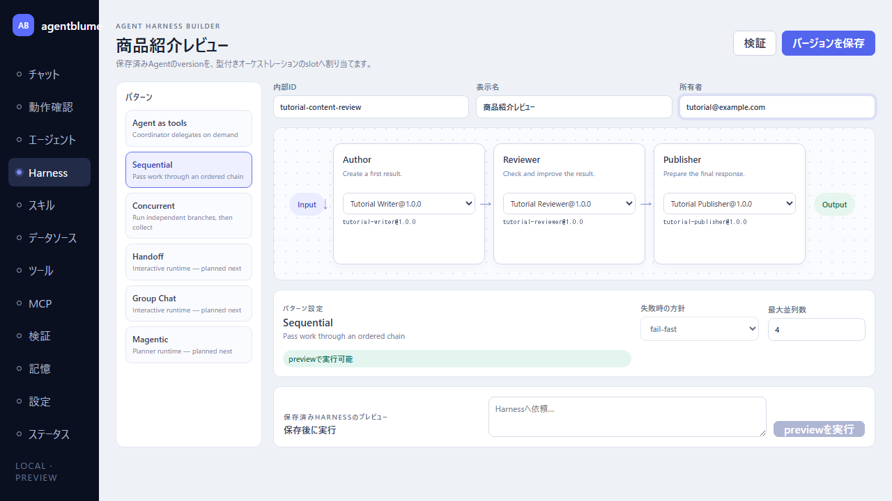
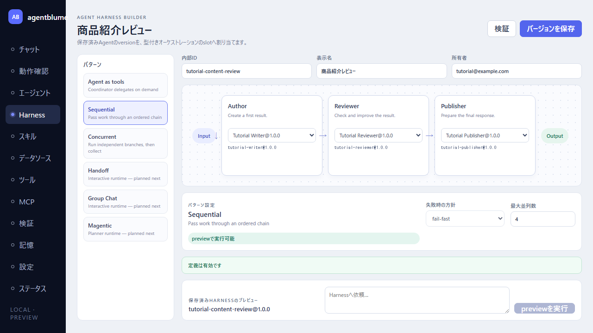
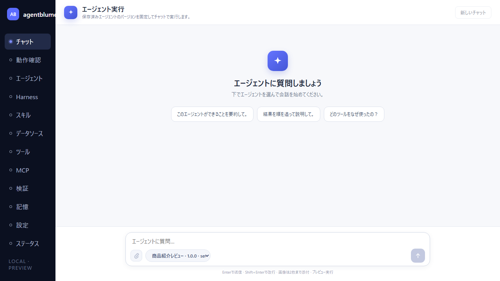

# マルチエージェントHarnessチュートリアル

このチュートリアルでは、保存済みAgentを3つの役割へ割り当て、Sequential Harnessとして保存し、チャットの実行対象に選ぶまでを説明する。対象は、すでにAgent BuilderでAgentを保存した利用者である。

初期リリースでは`sequential`と`concurrent`をpreview実行できる。`handoff`、`group-chat`、`magentic`は定義とAgent割り当てを保存できるが、対話型の実行runtimeは後続リリースで追加する。

掲載画像は2026年7月16日にPlaywrightで実画面を操作して取得した。画像では、Writer、Reviewer、Publisherの3 Agentを新規作成して各slotへversion固定で割り当てている。モデルへの実際の問い合わせ結果は含めない。

## 1. このチュートリアルで作る構成

Sequential Harnessは、前の役割の出力を次の役割へ渡す固定順序の構成である。ここでは商品紹介文を作成し、レビューして、公開用の最終文に整える流れを作る。

```text
入力 → Writer → Reviewer → Publisher → 最終応答
```

| slot | 割り当てるAgentの責務 | 受け取るもの |
|---|---|---|
| Writer | 商品紹介文の初稿を作る | ユーザーの依頼 |
| Reviewer | 表現や事実関係を確認する | 初稿と元の依頼 |
| Publisher | 最終回答を整える | レビュー結果と元の依頼 |

この順序をHarnessへ保存するため、各slotはAgentの`internalId`だけでなく保存済みversionを参照する。Agentの新versionを後で作っても、Harnessの既存versionの実行内容は変わらない。

## 2. 事前準備

Node.jsと依存パッケージを準備する。初回だけPlaywright用Chromiumもインストールする。

```powershell
npm install
npm run test:e2e:install
```

次に、Writer、Reviewer、Publisherとして使う通常Agentを3つ保存する。各Agentには最低限、表示名、公開名、所有者、システムプロンプトを指定する。ToolやSkillは必要な場合だけ割り当てればよい。

Harnessの定義・保存・画面確認だけならモデルは不要である。preview実行まで行う場合は、Tool Calling対応モデルをLM Studioで起動し、[デモデータ操作マニュアル](./13-demo-operation-manual.md#1-事前準備)と同じ手順でローカル設定を作成する。

## 3. Sequentialパターンを選び、Agentを割り当てる

1. 左サイドバーの「Harness」を選択する。
2. Patternsから「Sequential」を選択する。
3. `内部ID`、`表示名`、`所有者`を入力する。この例では`tutorial-content-review`、`商品紹介レビュー`を使う。
4. AuthorへWriter、ReviewerへReviewer、PublisherへPublisherの保存済みAgentを選ぶ。



canvasは保存形式そのものではなく、選択したパターンとslot割り当ての投影である。Sequentialでは左から右へ進む順序が`orderedSlotIds`として保存される。Agentを割り当てていないslotがある場合は保存できない。

## 4. 定義を検証してversion保存する

1. 「検証」を押す。
2. 「定義は有効です」と表示されたら「バージョンを保存」を押す。
3. Saved Harness previewに`<内部ID>@1.0.0`が表示されることを確認する。



検証では、slot IDの重複、Sequentialの順序、参照したAgent versionの存在、予算と失敗方針を確認する。保存済みAgentが見つからない場合は、該当slotの割り当てを修正してから再検証する。

## 5. チャットからHarnessを選ぶ

1. 左サイドバーの「チャット」を選択する。
2. 「チャット対象エージェント」のHarnessグループから`商品紹介レビュー · 1.0.0 · sequential`を選択する。
3. 依頼を入力して送信する。



Sequential実行ではWriter、Reviewer、Publisherの順にchild Runが作られ、Harness Runが最終応答と参加Agentのイベントを保持する。チャット画面では最終応答を表示し、中間の参加結果はHarness Runのイベントとして追跡できる。

## 6. Concurrentを使う場合

複数の観点を独立して集めたいときは、Patternsから「Concurrent」を選ぶ。たとえば、編集、法務、マーケティングの各Agentへ同じ依頼を渡し、結果をslot順で収集する。

`collect`では各Agentの結果をまとめて返す。集約用Agentを割り当てる`agent`集約は、独立した結果を渡して最終回答を作る。並列数はHarness policyの`maxParallelism`で上限を持つ。

## 7. 実行前の確認項目

- すべてのslotに保存済みAgent versionを割り当てた。
- Sequentialでは順序、Concurrentでは参加Agentと集約方法を確認した。
- preview実行で副作用を持つToolを使う場合は、既存Agentのpreview制約も確認した。
- 長い処理はparticipant run数、model round数、並列数の上限内に収めた。

## 8. スクリーンショットと画面操作を再実行する

次のコマンドはデモデータを含む専用API/UIを起動し、このチュートリアルの画面操作を検証して画像を更新する。

```powershell
npm run docs:screenshots
```

自動E2Eだけを実行する場合は次を使う。

```powershell
npm run test:e2e
```

Harnessの割り当て、検証、保存、チャット選択を確認するE2Eは[builder-flows.spec.ts](../e2e/builder-flows.spec.ts)にある。スクリーンショット用の操作は[harness-tutorial-screenshots.spec.ts](../e2e/harness-tutorial-screenshots.spec.ts)にある。
