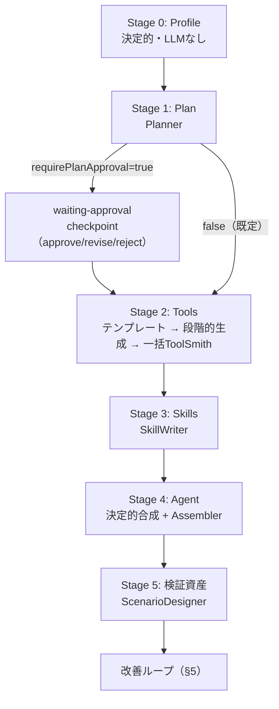
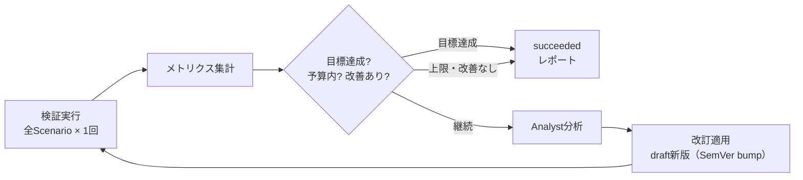

# 16. Agent Factory（自動生成と自動改善ループ）

> Status: Implemented (M1–M5)。実装は [implementation/v33-agent-factory.md](../implementation/v33-agent-factory.md)。
>
> 関連: [ADR-0033](./adr/0033-agent-factory-generation-loop.md) / [ADR-0047](./adr/0047-factory-lessons-from-estat.md)（実データで回して分かった欠陥と対策） / [11-scenario-validation.md](./11-scenario-validation.md) / [14-agent-harness-builder.md](./14-agent-harness-builder.md) / [implementation/llmops-roadmap.md](../implementation/llmops-roadmap.md)

**データソースと「やりたいこと」を入力すると、Tool・Skill・システムプロンプト・Agent・検証資産（Persona / Scenario）を自動生成し、疑似ユーザー検証の結果から自動で改訂を繰り返す**機能を定義する。生成と改善は専門ロールに分かれた複数のLLMエージェント（内蔵ロール）が担い、その協調は決定的なパイプラインとしてオーケストレートする。


## 1. 設計目標

1. 登録済みデータソース（CSV / JSON / PostgreSQL read-only）と目的の自然文だけを入力に、動くAgent一式をdraftとして生成する。
2. 生成物はすべて既存の資産型（Tool / Skill / Agent / Persona / Scenario）の**通常のSemVer版**として保存し、専用の保存形式を作らない。既存のBuilder画面でそのまま開ける・編集できる。
3. 検証は既存のシナリオ検証（疑似ユーザー × 複数ターン × アンケート）をそのまま使い、1イテレーション = 「検証 → 分析 → 改訂 → 新版」の回帰比較可能な単位とする。
4. ループはdraft空間で全自動に回る。公開・昇格・write系副作用は既存どおり人手承認（fail closed）。
5. すべてのLLM出力は構造化出力で受け、アプリ側で再検証する（ETLエンジン検証・スキーマ検証・参照整合）。検証に落ちた提案は破棄または修復ループへ回す。
6. hard budget（イテレーション数・LLM呼び出し数・シナリオ実行数・時間）を必須とし、モデル判定だけを停止条件にしない。

## 2. 既存機能との関係（再利用マップ）

本機能は新しい実行基盤をほぼ作らない。生成・検証・評価の各段は既存ユースケースの呼び出しで構成する。

| 段階 | 再利用する既存実装 | 新規 |
|---|---|---|
| データソース参照 | `DataSourceRepository` / `ResolveDataSourceGraphUseCase` | プロファイル要約（決定的） |
| Tool生成 | `EtlEngine.propagateSchemas / preview`、`SaveToolUseCase`、`SuggestAnalysisConfigUseCase` の「LLM提案 → エンジン再検証」パターン | ToolSmithロール + 修復ループ |
| Skill生成 | `SaveSkillUseCase` | SkillWriterロール |
| プロンプト生成 | `GenerateAgentPromptUseCase`（決定的合成） | 役割文・実行規則のLLM起草 |
| Agent保存 | `SaveAgentUseCase` | — |
| Persona / 疑似ユーザー | `SavePersonaUseCase` / `RegisterPseudoUserAgentUseCase` | ScenarioDesignerロール |
| Scenario | `SaveScenarioUseCase` / `DEFAULT_SURVEY` | 同上 |
| 検証実行 | `RunScenarioUseCase`（1ターン = 1 Run、トレース永続化。`input.target` で対象Agent版を上書き可能） | メトリクス集計 |
| 分析・改訂 | — | Analystロール + 改訂提案の型 + 適用 |
| 非同期実行 | `InProcessExperimentWorker`（v23）の queue / cancel / 進捗パターン | `InProcessFactoryWorker` |
| 昇格 | 品質ゲート・昇格（v24）、LLM-as-Judge（v25） | —（接続のみ） |

[llmops-roadmap.md](../implementation/llmops-roadmap.md) の改善ループ図で人手だった「IMPROVE: Prompt / Skill / Tool改善」を、本機能がdraft空間内で自動化する。運用ログからの還流（v27・EvaluationCaseProposal）は独立した後続増分であり、本機能は依存しない。

## 3. 内蔵ロール（生成・改善マルチエージェント）

パイプラインの各段は、責務を絞った**内蔵ロール**が担う。各ロールは「system prompt テンプレート + 構造化出力スキーマ + 温度0の1回呼び出し（修復時のみ再試行）」であり、`ModelProviderPort` を通じて実行する。

| ロール | 責務 | 入力 | 構造化出力 |
|---|---|---|---|
| **Planner** | 目的とデータプロファイルから構成計画を立てる | goal / targetUsers / DataProfile[] | `FactoryPlan`（Agent像・Tool計画・Skill計画・Persona/Scenario計画） |
| **ToolSmith** | Tool計画1件をETLグラフへ具体化する | Tool計画 / ノードカタログ / 上流スキーマ | `ToolGraph` + `agentTool`契約 + 引数スキーマ |
| **SkillWriter** | Skill計画1件のinstructions等を起草する | Skill計画 / 依存Toolの契約 | responsibility / activationCondition / instructions / 入出力説明 |
| **Assembler** | 役割文・実行規則を目的に合わせて起草する | goal / 決定的合成の草稿 | 役割セクション・追加規則（差分のみ） |
| **ScenarioDesigner** | 検証用のPersona属性とScenarioを設計する（初期実装ではPlannerの計画に統合。§4 Stage 5参照） | goal / targetUsers / Tool契約一覧 | Persona属性[] / Scenario定義[]（goal・context・expectedTools） |
| **Analyst** | 検証結果を分析し改訂を提案する | メトリクス / アンケート / 感想 / 失敗トランスクリプト抜粋 / 現行資産の契約 | `Finding[]` + `ImprovementProposal[]` |

規則:

- ロールのプロンプトはアプリのコード資産として管理し、**保存済みAgentにしない**（[ADR-0033](./adr/0033-agent-factory-generation-loop.md)）。生成対象と生成主体を分離し、自己改変とbootstrap循環を防ぐ。
- ロール間の受け渡しはすべて型付きの中間成果物で行う。ロール同士の自由会話・共有チャット履歴は持たない。順序・分岐・再試行はアプリの決定的パイプラインが制御する。
- データソースの値・サンプル行・疑似ユーザーの発話・アンケート自由記述は、v25 Judgeと同じく **untrusted data として隔離**して渡す（system命令に混ぜない）。
- `structured-output` capability がないモデル構成では Factory 全体を利用不可として公開しない（`SuggestAnalysisConfigUseCase.available()` と同じ扱い）。

## 4. 生成パイプライン



### Stage 0: データプロファイル（決定的）

各 `dataSourceId` について、`ResolveDataSourceGraphUseCase` と `EtlEngine` でスキーマとサンプルを取得し、`DataProfile { schema, sampleRows(≤20), 列ごとの基本統計 }` を作る。LLMは使わない。ここで解決に失敗したデータソースがあればRun全体を早期に失敗させる。

プロファイルは「列名と型」だけでは足りない（[ADR-0047](./adr/0047-factory-lessons-from-estat.md)）。次の3つも**全行を走査して**決定的に付ける（サンプル20行では、年次と月次の混在のように末尾にしか現れない性質を取りこぼす。プレビューが既に計算済みの全行を使うので追加コストは無い）。

| フィールド | 中身 | 後段での使われ方 |
|---|---|---|
| `rowCount` | データソース全体の行数 | 「引数なしの呼び出しが `agent-output` を溢れさせないか」の判断材料 |
| `periodColumns[]` | `parsePeriodLabel`（`parse-period` ノードと同じ関数）が非nullの値の**90%以上**を解釈できた文字列列。`{ column, granularities: 粒度別件数, minStart, maxStart, mixed }` | 期間列は文字列なので完全一致しか引けない。範囲・時系列順が要るなら `parse-period` を挟ませる。`mixed: true` なら粒度フィルタを必須にする |
| `categoricalColumns[]` | distinctが**60以下**の文字列列と、その全値（例: `全国` + 47都道府県） | Tool説明へ「有効な値」を書かせ、存在しない値で0行を引かせない |
| `joinCandidates[]` | **ソースをまたぐ**結合候補。同名・同型で値が**50%以上**重なる列を結合キーとして挙げ、`overlap`（重なり）と `uniqueLeft` / `uniqueRight`（そのキーで行が一意に決まるか）を持つ。期間列・コードらしい列（`コード`/`code`/`id`/`番号`）を先に並べる。**どちらかの側に空の値がある列は候補にしない**（null のキーは結合でマッチせず行が黙って落ちる。e-Stat の `注記`） | 「1ソース1Tool」に割らず、1つのToolで結合させる（§4 Stage 1）。一意でないキーは結合で行が増えるため警告として渡す |

`joinCandidates` は **Run全体で1つの一覧**で、`executeAll` が返す全プロファイルが同じ内容を持つ（単体の `execute` では空。1ソースだけでは相手が分からない）。Plannerへは1回だけ載せる。

これらはPlanner（Stage 1）とToolSmith（Stage 2）のプロンプトへ、他のプロファイル同様 untrusted data として渡す。

### Stage 1: 構成計画（Planner）

`FactoryPlan` を得る。検証規則: Tool計画は各データソースを最低1回参照する必要はないが、**参照はすべて入力の `dataSourceIds` 内**であること。Tool数・Skill数・Scenario数は上限（既定: Tool ≤ 4、Skill ≤ 3、Persona ≤ 3、Scenario ≤ 6）内であること。`write` / `external-action` を要する計画は拒否する。

#### 複数データソースを結合するTool計画（`additionalDataSourceIds`）

Tool計画は `dataSourceId`（主ソース）に加えて `additionalDataSourceIds`（**最大2件**）を持てる。指定すると Stage 2 は「各ソースを読んで共有キーで結合し、値を同じ行に並べて返す」1つのToolを作る（[ADR-0047](./adr/0047-factory-lessons-from-estat.md) 第3ラウンド）。

- 検証規則: 全て Run の `dataSourceIds` 内・重複なし・`dataSourceId` 自身を含まない・再利用計画（`reuse`）とは併用できない。
- Plannerの構造化出力では、主idと同じく**列挙（enum）**で縛り、緩いプロバイダ向けに編集距離での写し間違い補正（`repairDataSourceIds`）も主idと同じ規則で掛ける。
- 結合先の書き忘れは決定的に補う（`inferAdditionalDataSources`）: 再利用でも結合でもないToolの displayName / purpose / argumentSummary が、**別のソースにしか無い列名**（単位の注記 `【円】` を外した名前でも照合）を名指ししていれば、結合候補のあるそのソースを `additionalDataSourceIds` に足してから検証する。実測で、文章に「A ÷ B」と書きながら結合先を出さず、A だけを返すToolができてエージェントが誤答した（[ADR-0047](./adr/0047-factory-lessons-from-estat.md) 第6ラウンド）。
- 判断材料は Stage 0 の `joinCandidates`。**同じキー（同じ時点・同じ地域）で値を並べる**答えが要るときだけ結合し、無関係なソースは従来どおり別Toolにする。
- 後付けの任意フィールドなので、これを持たない既存の保存済みRunはそのまま読める。

`requirePlanApproval: true` の場合、計画を `waiting-approval` checkpointとして停止する（Magentic計画承認と同じ応答型: `approve` / `revise(feedback)` / `reject`）。既定は `false`（全自動）。

#### 既存ツールの再利用（新規作成の前に考える）

Plannerへは、同じworkspaceに保存済みのToolの要約（**既存ツールカタログ**）を渡す。取得は use case 側（`buildExistingToolCatalog`）の責務で、ロールは値として受け取る。

- 収録対象: `sideEffect` が `read-only` / `session-write` かつ `state` が `deprecated` / `archived` でないTool。1件あたり `{ internalId, latestVersion, publishName, displayName, agentTool契約（name/description）, inputSchemaの列（name:type）, sideEffect }`。件数は上限20件（超過分は切り捨て、総数だけ `existingToolsOmitted` として伝える）。並びは決定的（組み込み → publishName昇順）で、組み込みツールは切り捨てられない。
- 判断: 計画する各Toolについて「既存カタログに目的を満たすToolがあるか」を先に考える。説明が目的に合致し、引数が過不足なく使えるなら**新規作成せず再利用**し、`tools[].reuse = { internalId, rationale }` を設定する（迷ったら新規作成）。現在日時が必要な場合は組み込みの `current_datetime` を再利用する。
- 再利用計画は既存Toolのグラフをそのまま使うため、`dataSourceId` は空文字を許す（データソースを読まないToolも選べる）。カタログ本体は利用者が書いた表示名・説明を含むため、プロファイル同様 untrusted data として user message 側へ隔離する。

### Stage 2: Tool生成（テンプレート → 段階的生成 → 一括ToolSmith）

Tool計画に `reuse.internalId` があり、渡された既存ツールカタログで解決できる場合はToolSmithを呼ばず、その既存Toolの**最新版**を `toolRefs` / Tool契約 / 公開名の対応へそのまま載せる（`tool_reused` イベント。既存Toolに新版は作らない）。解決できない場合（削除済み・カタログ外・再利用できない副作用）は理由をイベントへ残して、以下の新規生成へフォールバックする。

新規作成は**3つの経路**を順に試す: **テンプレート → 段階的生成 → 一括ToolSmith**。前の経路が諦めるたびに理由をイベントへ残して次へ落ちる。`FactoryOptions.toolGeneration` の `'one-shot'` を指定すると、テンプレートも段階的生成も使わず従来の一括ToolSmithだけになる（既定は `'staged'` = テンプレートを先に試す。`'template'` という値は足さない）。

#### テンプレート経路（最初に試す・[ADR-0049](./adr/0049-tool-templates.md) / [implementation/v43](../implementation/v43-tool-templates.md)）

前年比・期間内の統計・相関・2ソースの比のような構成は、ノードとしては既にあるのに Factory からは作れなかった（`ToolSpec` の語彙に無いため）。これらは**外部ファイルのテンプレート**（`templates/tools/*.json`）が構成ごと持っているので、モデルの仕事は「どれを使うか」と「スロットを候補から埋めるか」の2つだけになる。

```
FactoryToolPlan + DataProfile[]
  └─ applicableTemplates（決定的）… 必須スロットに候補が無いテンプレートは外す。0件なら段階的生成へ
  └─ select-template    候補の id / summary / whenToUse / notFor だけを見て 1 つ選ぶ（"none" も選べる）
  └─ fill-slots         スロットごとの候補（enum・件数・範囲）から埋める。dataSource スロットは訊かない
       ↓  instantiateTemplate（純関数・LLMなし）→ ToolGraph + inputSchema + Tool契約
       ↓  `intent` スロットがあれば v41 の式提案が calculate の式を書く
  既存の決定的検査（スキーマ伝播 → 設計時プレビュー → 構造 → 結合の設計 → 意味 → 既定呼び出しの溢れ）
       ↓ 違反をスロットへ引けたら fill-slots へ1回だけ差し戻す
       ↓ それでも駄目なら段階的生成へフォールバック
```

| タスク | 決めること | 渡す材料（最小） | 選択肢の閉じ方 |
|---|---|---|---|
| `select-template` | どのテンプレートで作るか（`none` 可） | 目的・目標と、候補ごとの `id` / `summary` / `whenToUse` / `notFor`（目標の言語） | `templateId` は候補の id + `"none"` の `enum` |
| `fill-slots` | スロットごとの値 | 目的・目標と、スロットの `label` / `help` / 種類 / 任意か + 候補（カテゴリ列は実在値8件、期間列は粒度内訳と範囲、結合キーは重なりと一意性） | 列・キー・選択肢は `enum`（複数選ぶ列は `minItems`/`maxItems` つきの配列）、数値は `minimum`/`maximum`、自由記述は `maxLength` |

- **どのソースを読むかは訊かない**。`dataSource` スロットは計画の順（主ソース → `additionalDataSourceIds` の順）で決定的に割り当てる。
- **実体化は純関数**（`instantiateTemplate`）。置換（`$slot` / `{{ }}` / `$each` / `$concat` / `$number` / `$profile` / `$argument` / `$intent`）と `when`（任意スロットが空ならノードを外して前後を繋ぐ）だけで、テンプレートに式や制御構文は持たせない。
- **抜け道は作らない**。実体化したグラフは手で組んだToolと同じ検査を通す。テンプレートが使うノード種別（`calculate` / `time-series-analysis` / `summary-statistics` / `correlation-analysis` / `group-by` …）はそのグラフが実際に使っている種別として形の検査へ渡し、残りの形の規則（ソースを1回ずつ・終端は `agent-output` 1つ・合流は `join` だけ・枝分かれ禁止）はそのまま効かせる。集計・分析ノードを持つToolは「期間ラベル列と値の列が終端まで残ること」「`periodStart` で並べ替えること」の対象から外す（統計・相関・前期比は正しく落とすため）。
- **意図文の式が書けなければ、そのToolはテンプレート経路を失敗にする**（計算列だけ落とすことはしない。式はテンプレートの中心だから）。段階的生成へ落ちる。
- **差し戻しは `fill-slots` へ1回だけ**。違反の文面から直すべきスロットを引く（列名 → その列を選んだスロット、結合の違反 → `joinKeys` スロット）。引けない違反・2回目の失敗は諦める。
- **フォールバック**: `tool_repair_attempted` に `template <id> failed: <理由>; falling back to staged generation` を残す。テンプレートを選ぶ前に諦めた場合は `no template fits this tool: <理由>; …`、当てはまるテンプレートが0件でモデルを一度も呼んでいない場合はイベントを出さない（試していないものを「失敗した」と書かない）。
- **会計**: タスク1回 = ロール呼び出し1回。テンプレートで作ったToolは **2回**（選ぶ + 埋める）、意図文つきのテンプレートは +1〜2回（式提案）。
- **イベント**: `tool_generated` の message は `<key> (template: period-change@1.1.0; slots: periodColumn=時点, valueColumns=[売上]; repaired: fill-slots)`。どの構成の・どの版から作られたToolかを後から追える。
- **Planner へのヒント**: Stage 1 の材料に「このデータで使えるテンプレートの `id` と要約（目標の言語）」を足し、「テンプレートで作れる形のToolを優先する／2ソースのテンプレートには `additionalDataSourceIds` が要る」という規則を1行だけ足す（計画の形は変えない）。適用可否は決定的かつ小さく数える: 1ソースずつ・結合候補が挙げた2ソースの組・結合できるソースの先頭3件。

#### 段階的生成（テンプレートが使えないとき・[ADR-0048](./adr/0048-staged-tool-generation.md) / [implementation/v42](../implementation/v42-staged-tool-generation.md)）

一括ToolSmithは1回のプロンプトで**グラフ全体**（ノード・エッジ・config・引数宣言・説明文）を書く。ローカル12Bでは試行のたびに別の機械的な書き間違いが出て、3試行でToolが1本もできないRunが続いた（ADR-0047）。書かせる範囲が広すぎるのが原因なので、**モデルには決定だけを書かせ、グラフはコードが組む**。

```
FactoryToolPlan + DataProfile[]
  └─ decide-join       （結合するToolだけ）どのキーで・どう結合するか
  └─ decide-filters    期間の扱い（粒度・範囲）/ どのカテゴリ列を引数にするか
  └─ decide-computations 計算列が要るか（名前と「何を計算したいか」の1文だけ。式は書かせない）
  └─ decide-output     返す列 / 並び / 件数
       ↓  ToolSpec（宣言的な仕様。グラフではない）
  compileToolSpec（決定的・LLMなし）→ ToolGraph + inputSchema + 説明文
       ↓  calculate ノードは式が空のまま置かれる
  write-expression × 計算列の数（v41 の式提案ユースケースを再利用）
       ↓
  既存の決定的検査（構造 → 結合の設計 → スキーマ伝播 → 意味 → 既定呼び出しの溢れ）
       ↓ 違反したら担当タスクへ1回だけ差し戻して再コンパイル
       ↓ それでも駄目なら一括ToolSmithへフォールバック
```

| タスク | 決めること | 渡す材料（最小） | 選択肢の閉じ方 |
|---|---|---|---|
| `decide-join` | 結合キーと `inner`/`left` | 目的・各ソース名・`joinCandidates` | キーは候補の列名の `enum` |
| `decide-filters` | 期間列・粒度（固定 / `argument`）・範囲引数の有無・カテゴリ引数 | 目的・目標・期間列の粒度内訳と範囲・カテゴリ列の値の先頭8件 | 列名と粒度は `enum`。自由記述は引数名だけ |
| `decide-computations` | 計算列の名前と「何を計算したいか」の1文 | 目的・目標・数値列の名前 | 0件を明示的に許す。**式は書かせない** |
| `decide-output` | 返す列・並び・件数 | 目的・結合/計算後の列一覧・行数の目安 | 列名と並びは `enum` |

- **組み立ては決定的**（`compileToolSpec`）。ノードid・エッジ・`toInput`・`valueBinding`・引数の型と nullable・設計時サンプル・説明文はコードが作る。同じ入力なら必ず同じグラフになり、既存の構造検査・意味検査を**必ず通る**（通らない組み合わせは `validateToolSpec` が先に弾く）。説明文には引数の意味と形式・実在値の例・データの期間範囲・返す列を機械的に書く。
- **粒度が混ざるデータでは `granularity` を必須引数にする**。省略できる引数にすると、省略時に条件が無効化されて月次と年次が混ざった数字が返る。必須にして構造的に防ぐ（説明文に選べる値と「迷ったら既定」を書く）。
- **式は専用プロンプトへ**（v41 / ADR-0046）。計算列ごとに式提案ユースケースを呼び、文法・関数表・検証・標本試算つきで式を作ってノードへ入れる。辞退・検証失敗・モデル失敗のときは**その計算列だけを落として**Toolは作る（`tool_generated` の message に `dropped computation: <列> (<理由>)` が残る）。式提案が使えない構成では計算列を全て落とす。計算列は段階的経路だけの機能で、一括ToolSmithには許可しない（式をグラフのプロンプトに混ぜない）。
- **差し戻しは担当タスクへ1回だけ**。`validateToolSpec` の違反はその決定を下したタスクへ、検査の違反は下表に従って戻す。全体で `maxRepairAttempts + 1` 回のコンパイルを超えたら諦める。

| 違反 | 差し戻すタスク |
|---|---|
| `validateToolSpec` の issue | issue が持つタスク名 |
| 結合で行が増えた / キーが無い・型が違う | `decide-join` |
| 引数なし（必須引数だけ）の呼び出しが `maxRows` を超える | `decide-output`（`limit`）→ それでも超えるなら `decide-filters` |
| 形・スキーマ伝播・証拠列の欠落 | 差し戻さない（コンパイラのバグとして失敗させ、単体テストで防ぐ） |

- **フォールバック**: `ok: false` になった / 中断以外の例外が出た場合は `tool_repair_attempted` に `staged generation failed: <理由>; falling back to one-shot ToolSmith` を残して、以下の一括経路をそのまま回す。
- **会計**: タスク1回 = ロール呼び出し1回として `budget.maxRoleCalls` に数える。単一ソース・計算列1つのToolは 4 回（decide-filters / decide-computations / decide-output / write-expression）。
- **イベント**: `tool_generated` の message に `<key> (staged: decide-filters, decide-computations, decide-output, write-expression×1; repaired: decide-output)` の形で「走ったタスク・やり直したタスク・落とした計算列」を残す。

#### 一括ToolSmith + 修復ループ（フォールバック経路 / `toolGeneration: 'one-shot'`）

新規作成するTool計画ごとに:

1. ToolSmithへノードカタログ（登録済みノード型・config契約）・対象データソースのプロファイル・引数計画を渡し、`ToolGraph` を提案させる。許可する変換ノードは `SAFE_TRANSFORM_TYPES` = `select` / `filter` / `sort` / `distinct` / `limit` / `parse-period` / `rename` / `join` / `summary-statistics`。各ノードのconfig契約をプロンプトへカタログとして列挙する。
2. source ノードは計画の `dataSourceId`（結合Toolでは `additionalDataSourceIds` も）を参照する。sink は `agent-output`（必要に応じ `chart-output` / `workspace-output`）。
3. **正規化**（決定的・検査より手前。`normalizeProposedGraph`）: 機械的な書き間違いだけを直す（下記）。直した内容は `tool_generated` イベントの message に `normalized: …` として残す。
4. **構造検査**（決定的・エンジンより手前）: 許可ノード語彙内か、計画の各データソースを**ちょうど1回ずつ**読んでいるか（種別も計画どおりか）、`agent-output` がちょうど1つか、`agent-input` が1つ以下で未接続か、データ経路が下記の木になっているか。違反は「どのノード・どのエッジをどう直すか」を添えて修復ループへ回す（エンジンのスキーマエラーだけでは直し方が伝わらず修復が空回りする）。
5. `EtlEngine.propagateSchemas` + `preview(rowLimit)` で検証する。エラー時はエラー内容を添えて再提案させる（`maxRepairAttempts` 回、既定2）。
6. **意味の検査**（決定的・スキーマ確定後）: 構造とスキーマが通っても「答えに使えないTool」はできる。下表を検査し、違反は直し方を添えて修復ループへ回す。
7. **既定呼び出しの溢れガード**: 生成Toolの引数は全て省略可能なので、エージェントの最初の呼び出しは「引数なし」になる。実行時と同じ `graphWithArguments` で全引数を省略した2本目のプレビューを回し、終端 `agent-output` が `shape:'rows'` かつ `overflow:'error'` で `rows > maxRows` になるなら、直し方（末尾に `limit` を足す / 集計する / `shape:"summary"` にする）を添えて修復ループへ回す（[ADR-0047](./adr/0047-factory-lessons-from-estat.md)）。
8. 検証を通過したら `SaveToolUseCase` でdraft保存する。`sideEffect` は `read-only` または `session-write` のみ許可する。

#### 正規化（`normalizeProposedGraph`）— 書き間違いは差し戻さずに直す

ローカル12Bモデルの実測（ADR-0047 第4ラウンド）では、**計画は正しいのに** ToolSmith が修復試行を「書き方の癖」で使い切った。意味が一意に決まる崩れ方は、モデルへ差し戻す前にここで直す。

| 直すもの | 規則 |
|---|---|
| `join` のポート | 片方だけ `toInput` が無ければ残りのポートを入れる。両方無ければ**計画の主データソースから伸びる枝**を左（0）に（辿れなければエッジ順）。同じポートが2本なら2本目を空いている側へ。 |
| `join` の左右（推測時のみ） | 推測したポートでキー列が片側に見つからず伝播が落ちる場合、左右を入れ替えた版を1回だけ試し、通ればそちらを採る。**モデルが 0/1 を明示していた場合は入れ替えない**（`left` 結合の向き・列順という意味に関わるため）。 |
| `in` / `notIn` の `values` | `values` が空で `value` に文字列/配列があれば、実行時と同じ区切り（`parseFilterValueList`）で `values` へ移す。引数バインド済みで値が無ければ、Stage 0 プロファイルの**実在値を最大2件**だけ種として置く（実行時は引数で上書き）。 |
| filter config の別名 | `operator`→`op`、`field`/`columnName`→`column`、1条件を包んだ `condition`/`filters`/`where`/`criteria`→`conditions`。 |
| 演算子の別表記 | `equals`/`=`/`==`→`eq`、`!=`→`neq`、`>=`→`gte`、`<=`→`lte`、`>`→`gt`、`<`→`lt`、`includes`→`contains`、`IN`→`in`（大文字だけの違いも吸収）。 |
| ノード種別の綴り | `parse_period` / `parsePeriod` / `Parse-Period` / `csv_source` / `agent_output` / `agentInput` → 正規の種別。小文字化し `_`・空白・camelCase の切れ目を `-` と見なして**完全一致**した場合だけ。**許可語彙の外へは寄せない**（寄せた先で構造検査に落ちるだけ）。 |
| source の `dataSourceId` | 書かれていない source へ、計画の並び（主ソース先頭）で id を割り当てる。ソース数が計画と一致し、未記入の数と残りの計画idの数が合うときだけ。**書かれているが計画外の id は上書きしない**（Planner と同じ編集距離 ≤3 の写し間違いだけ直す）。 |
| `agent-input` の形 | `schema` の中に書かれた `sample` を外へ出す。`sample` が無ければ `{}`（全引数が省略可能なので有効）。 |
| `agent-input` の欠落 | `valueBinding` / `opBinding` があるのに宣言ノードが無ければ、バインドから**合成**する。引数名は `field`、型は `in`/`notIn`・`opBinding` なら `string`、それ以外はバインド先の列型、すべて `nullable: true`、`sample` は条件の設計時の値（並びはカンマ連結）。 |
| 引数の宣言型（伝播後） | 引数が**同じ型の列だけ**にバインドされているなら、宣言型をその型へ直す（`periodStart` の gte/lte に繋いだ `string` 引数 → `date`）。`parse-period` が足す列はスキーマ伝播後でないと型が分からないので、この1つだけ伝播の後で走る。型が混ざる引数は意味検査へ委ねる。 |

**正規化しないもの**（意味を触らない）: ノードを足さない・消さない、列名を変えない、**値を発明しない**（実在値が分からなければ何も置かない）、認識できない崩れ方は触らずに修復ループへ流す。純粋関数で、二度掛けても結果は変わらない。

#### 差し戻し文面（何を書いたか・正しい形・繰り返しの指摘）

- ノード設定の検証に落ちたときは、エラー文面に加えて**そのノードに実際に書かれた config JSON**（約400文字で切り詰め、`<untrusted-data>` で隔離）と、その種別の**最小の正しい config 例**を添える。「`column: expected string, received undefined`」だけでは何を直すか分からず、実測では同じ崩し方が繰り返された。
- 直前の試行と**同じ違反**を繰り返したら、文面の先頭に「同じ間違いを繰り返している」と明示する（同じ文面をそのまま返すと同じ出力が返ってくる）。
- **違反はまとめて1回で返す**。構造検査と結合の設計検査は同じ段で、意味検査と既定呼び出しの溢れガードは同じプレビューから、それぞれ全違反を連結して差し戻す（1回の試行で複数直せるようにする）。
- **結合するTool（`additionalDataSourceIds` あり）は修復試行を1回多く回す**（単一ソースは従来どおり）。枝の数・ポート・キー・suffix と部品が多く、実測では試行ごとに**別の**問題へ進んでいた（同じ失敗の反復ではない）。Run全体は `budget.maxRoleCalls` が引き続き縛る。

#### グラフの形（木）と結合（`join`）

データ経路は「各データソースが自分の短い枝を持ち、枝は `join` でだけ合流し、最後は1本になって `agent-output` へ落ちる**木**」とする。単一ソースのToolはその特殊形（枝が1本＝従来どおりの単一チェーン）。

- **分岐（fan-out）は禁止**: 1つのノードが2つ以上のノードへ流れてはならない。枝は合流するだけで、分かれない。
- **合流できるのは `join` だけ**: 2入力で、2本のエッジが `toInput: 0`（左）/ `1`（右）を明示すること。
- `agent-input`（引数宣言）は1つまでで、従来どおりデータ経路の外（未接続）。
- 孤立ノードは許さない。

結合の規律（ToolSmithへのプロンプト）:

| 規律 | 理由 |
|---|---|
| 共有キーを**全部**使って結合する（`時点` だけでなく `地域コード` も） | 片方だけで結合すると、同じ期間の全地域×全地域に増える |
| 既定は `mode: "inner"`（片側にしか無い行が要るときだけ `left`） | 「並べて答える」は両側に値がある行のこと |
| `select` / `rename` は結合の**前**に置く | 両側の値列が同名だと `値` と `値_right` になって読めない。不要な `注記_right` も持ち回らない |
| 引数のfilterは最後の結合の**後**（または全枝に同一条件で） | 1つの引数が結合後の表を1回だけ絞る |
| `uniqueLeft` / `uniqueRight` が false の側は先に絞る | キーが一意でないと結合で行が増え、出力が溢れる |
| `parse-period` は**最後の結合の後で1回だけ** | 枝ごとに走らせると各枝へ `periodStart` が増え、2つ目の結合が `still conflicts after suffix` で落ちる。期間ラベル列はキーとして結合後も残る |
| 枝の中は `select` / `rename` だけ | それ以外は結合の後に置く。枝が短いほど衝突も行の増殖も起きにくい |
| キーは `joinCandidates[].keys` から採る | `注記` のような自由記述列をキーにすると、値が揃わない行が**黙って**消える（「データなし」に見える）。コードと名前が両方あるならコードだけで足りる |
| 3ソースは2段の結合で、各結合に**別の** `rightSuffix` | 同じ suffix だと2つ目の結合で名前が再び衝突する |

#### 複数カテゴリを1回の呼び出しで（`in` 演算子）

カテゴリ列（`categoricalColumns` の列）を絞る引数は、`filter` の複数値演算子 `in` で束縛する。引数は **nullable な string 1つ**で、実行時はカンマ区切りの一覧（`東京都,大阪府,北海道`）を受け取る。省略・空文字なら条件ごと無効化されて全カテゴリが返る。`agentTool.description` には「カンマ区切りの一覧（例つき）」と「省略すれば全カテゴリ」の両方を書かせる。

`in` / `notIn` は `opBinding.allowed` には入れない（値の演算子であって、選ばせる演算子ではない）。

> **この配線の `filter` が複数値演算子を持たない場合**、ToolSmithへ `in` を勧める規則も、「カテゴリ引数を `in` で束縛せよ」という検査も**出さない**（`supportsMultiValueFilterOps()` が `FILTER_OPS` から決定的に判定する）。エンジンが受け付けない演算子を書かせると、生成Toolが毎回修復ループで落ちてRunごと失敗するため。その場合は round 2 の言い回し（「カテゴリ引数は省略可能にし、省略すれば全件返す」）に留まる。

#### 意味の検査（`describeToolSemanticViolations`）

行を返すTool（`shape` が `rows` / `first-row`、集計ノードなし）にだけ掛ける。いずれも実測で生成された「答えられないTool」から起こした規則（[ADR-0047](./adr/0047-factory-lessons-from-estat.md)）。

| 検査 | 内容 | 直し方として返す文面 |
|---|---|---|
| 証拠列（期間） | プロファイルに期間列があるなら、終端の表に**元の期間ラベル列**（`時点` 等）が残っていること。`periodStart` は代替にならない | `select.columns` へ加える / `select` を外す |
| 証拠列（値） | **結合する各ソースについて**、その数値列が終端の表に最低1つ残っていること（`rename` の写像と `join` の `rightSuffix` を追って判定する。`distinct` を使うToolは対象外） | 目的が問う値の列を残す／同名なら結合前に改名する |
| 結合キー | `join` のキー列が左右の枝に実在し、型が一致すること（キー0件も拒否） | キー列を直す／型を揃える |
| 行の増殖 | inner / left の `join` が、設計時プレビューで入力行数の最大を超える行を出していないこと | `key is not unique: join also on <列>`（不足キーを結合候補から名指し） |
| カテゴリ引数 | `in` / `notIn` で束縛する引数は `type: "string"` で宣言されていること。`filter` が複数値演算子を持つビルドでは、カテゴリ列を `eq` で束縛していないこと | 複数値で受ける形へ直す |
| 引数の型 | `date` 列を絞る引数は `type: "date"` で宣言されていること（`string` だと日付比較が文字列比較になる） | `{ "type": "date", "nullable": true }` で宣言し直す |
| 範囲 | 同じ引数を下限（`gt`/`gte`）と上限（`lt`/`lte`）の**両方**へ束縛していないこと（完全一致の変装になる） | `*_from` / `*_to` の2つのnullable引数へ分ける |
| 並べ替え | `parse-period` を使うなら開始日列で `sort` していること。目的が「最新・直近・latest」を求めるならその向きが `desc` であること | `{ "keys": [{ "column": "periodStart", "direction": "desc" }] }` を `limit` の前へ |

注記列（`注記` / remarks / 備考）の保全は**プロンプト規則**にとどめる（目的次第で落として良い場合があるため、Runを止める検査にはしない）。「最新なら降順」の強制も、目的の文言に最新系のキーワードがある場合だけに限る（言い回しの取りこぼしはプロンプト規則が拾う）。

#### 期間（粒度が混在する文字列ラベル列）の扱い

`時点` のような期間列は文字列なので、`eq` では1ラベルしか引けず、`gte`/`lte` の範囲指定も時系列順の並べ替えもできない。Stage 0 が `periodColumns` を報告した計画では、ToolSmithへ次の定石を教える（[docs/06 §3.15](./06-etl-tool-builder.md)）。

```text
source → parse-period → filter(periodGranularity eq <粒度: 固定または引数>) → filter(periodStart gte <from> / lte <to>) → sort(periodStart asc) → limit → agent-output
```

- `parse-period` は元の列を壊さず `periodStart`（`date`）と `periodGranularity`（`string`）の2列を**足す**。
- 日付の範囲引数は `agent-input` へ `type: "date"` で宣言し、`valueBinding` で gte / lte 条件へ束縛する。エージェントはISO日付文字列（`2008-01-01`）で渡し、`validateToolArguments` が `Date` へ正規化する。
- `mixed: true` の期間列では粒度フィルタを**必須**とする（月次と年次の行を混ぜて集計させない）。
- 日付は常に**期間の開始日**を意味する（年次の2023年は `periodStart` が 2023-01-01。`from` に 2023-10-01 を渡すとその行は外れる）。これは `agentTool.description` に書かせる。
- `agentTool.description` には、受け付ける引数の書式と有効な値（`categoricalColumns` の値、または値域の説明）、返す粒度、データが覆う期間（`minStart` / `maxStart`）、省略時の挙動を書かせる。

#### 1回の呼び出しで複数カテゴリを返せること

1会話で呼べるツールは `MAX_TOOL_CALLS`（現行4回）までである。「東京都・大阪府・北海道を比較」を県ごとに1回ずつ呼ぶ設計は、この上限に当たって**会話ごと失敗**する（実測: `RunFailedError: tool call limit exceeded: maximum 4`）。

- カテゴリ引数（地域・区分など）は `in` で束縛し、**カンマ区切りの一覧を1回で渡せる**こと。nullable のままなので、省略すればその期間の全カテゴリが返る（上記「複数カテゴリを1回の呼び出しで」）。
- 「一度に一つの都道府県のみ」のような説明・規則を書かせない（ToolSmith・Analyst・Assemblerの全てで禁じる）。
- 上限の数字は Analyst / Assembler のペイロードへ `toolCallBudget` として渡し、ロールが「1対象1呼び出し」の設計を提案しないようにする。

修復上限まで失敗したToolは欠落として記録し、計画から除外して続行する（依存するSkill計画も縮退）。全Toolが欠落した場合はRunを失敗させる。

#### Tool引数（エージェントが渡す検索条件）

計画の `purpose` / `argumentSummary` が絞り込みを示す場合、ToolSmithは**未接続の `agent-input` ノードを1つだけ**置いてTool引数を宣言できる（`EtlEngine` は未接続の `agent-input` を終端候補から外すため、データ経路は source → … → `agent-output` の単一チェーンのまま）。

- 宣言: `{ "schema": { "columns": [{ "name", "type": "string"|"number"|"boolean", "nullable": false }] }, "sample": { <各列の代表値> } }`。
- 消費: filter条件に `"valueBinding": { "source": "agent-input", "field": "<引数名>" }` を付け、`value` には設計時サンプルとなる代表値を残す。1条件のフラットconfigでも `{ conditions, combine }` の各条件でも使える。
- 演算子の消費: 比較方法自体をAgentに選ばせる場合は、filter条件に `"opBinding": { "source": "agent-input", "field": "<引数名>", "allowed": [...] }` を付ける。binding先の引数はstring型で宣言し、設計時の `op` は `allowed` 内の既定演算子として残す（`gt/gte/lt/lte` を許可できるのは対象列がnumber|dateのときだけ。`contains` を許可するのはstring列のときだけ）。opBindingで消費される引数は「filterから参照されない引数」エラーの対象外。値引数と演算子引数は必ず別々に宣言する（同一引数の二重バインドは保存時に拒否）。`allowed` に `isNull`/`notNull` を含めるなら同じ条件の値引数はnullableで宣言し、同一の演算子引数を複数条件で使うなら既定演算子は全条件で一致させる。
- 省略可能な引数: 絞り込みが任意（地域を指定しなければ全地域）の引数は `"nullable": true` で宣言する（`sample` への記載は不要）。JSON Schemaの `required` から外れるためエージェントは自然に省略でき、省略／null時は `RunAgentPreviewUseCase` が該当filter条件へ内部マーカー `disabled: true` を注入して**その条件だけをスキップ**する（条件が0件になったfilterは全行を通す）。`"all"` のようなマジック値をエージェントに渡させない（完全一致filterが0行になる）ための仕組み。
- 保存: `GenerateAgentAssetsUseCase` が `agent-input` の `config.schema` をそのまま `SaveToolDto.inputSchema` にする。これによりTool Calling契約（`toolToModelDefinition` がinputSchemaから導出するJSON Schema）とTool使用ガイドの `input [...]` 表記が引数付きになる。引数を宣言しないToolは従来どおり `inputSchema` 無しで保存する。
- 検証: agent-inputが2つ以上/引数宣言が壊れている/宣言したのに filter から参照されない引数がある場合は修復ループへ回す。バインド先が `inputSchema` に無い場合は `SaveToolUseCase` が拒否する。実行時は `RunAgentPreviewUseCase` がツール呼び出しの実引数で `valueBinding` の `value` を差し替える。

### Stage 3: Skill生成（SkillWriter）

Skill計画ごとにinstructions等を起草し、依存Toolを**生成済み版のSemVerで固定**して `SaveSkillUseCase` でdraft保存する。

### Stage 4: Agent組み立て（決定的合成 + Assembler）

`GenerateAgentPromptUseCase` でSkill/Toolガイドを決定的に合成し、Assemblerが起草した役割文・追加規則を役割セクションへ結合して `SaveAgentUseCase` でdraft保存する（`kind: 'normal'`、参照は全てSemVer固定）。Tool使用ガイド・Skillガイド・協働者ガイドはLLM起草で上書きしない（出所が機械的に追跡できる部分を保つ）。

**回答の規律ブロック（決定的・LLM非関与）** — 合成の最後尾へ、言語非依存の見出し `# Answer discipline / 回答の規律 (factory-managed)` を持つブロックを必ず付ける（[ADR-0047](./adr/0047-factory-lessons-from-estat.md)）。内容は「数値はツールが返した行から引き写す」「0件なら0件と伝え、実在する値を挙げて次の条件を提案する（0件を『値が0』に書き換えない）」「数値には時点と単位を併記する（粒度が混ざるデータでは粒度も）」「注記があれば引用する」「引数は説明が示す書式・値で渡し、分からなければ利用者に確認する」。

「複数の対象を比べるときの頼み方」は、このRunで保存したToolの契約から `describeMultiCategoryStrategy` が決定的に選ぶ（グラフは防御的に読む）。守れない指示を書くと他の規律まで薄まるため、条件は契約から導く。

| 判定 | 条件 | 書く規律 |
|---|---|---|
| `in-list` | `in` / `notIn` で束縛された **nullable** な引数がある | 「カテゴリの引数に対象をカンマ区切りで並べて1回だけ呼ぶ。省略すれば全カテゴリ」 |
| `omit-filter` | 省略できる引数はあるが単一値（`eq`）しか受けない | 「絞り込み引数を省略して1回だけ呼び、返った行から選ぶ」（round 2 の言い回し） |
| なし | 省略できる引数が無い | どちらも書かない |

このブロックはAssemblerの起草物ではないため、§5.3 の `system-prompt-revision`（役割文・実行規則をまるごと差し替える提案）を適用しても残る。`ApplyImprovementsUseCase` は、起点Agentが持っていた文面があればそれを引き継ぐ（利用者が手を入れた規律を既定文へ戻さない）。強化モードの `rewrite` でも同じ規律で付ける。

### Stage 5: 検証資産生成（計画のマテリアライズ）

Stage 1 の Planner が既に `FactoryPlan.personas` / `FactoryPlan.scenarios` を設計しているため、初期実装ではこの段を**決定的マテリアライズ**とする（別途LLM生成しない。ScenarioDesignerロールによる後段の追い込みは後続スライス）。

- 各 `plan.personas` を `SavePersonaUseCase` → `RegisterPseudoUserAgentUseCase` で疑似ユーザーAgent化する。`personaKey → 疑似ユーザーAgent版` を対応付ける。
- 各 `plan.scenarios` を `SaveScenarioUseCase` で保存する。`target` は生成Agent版、`pseudoUser` は対応する疑似ユーザーAgent版へSemVer固定。`expectedTools` は `expectedToolKeys` を**エージェントがそのToolを呼ぶときの関数名**（`agentTool.name ?? publishName`）へ解決したもの（生成できなかったToolのキーは除外）。`survey` は `DEFAULT_SURVEY`。`maxUserTurns` は計画値。

> **期待Tool名は `publishName` ではない。** `RunScenarioUseCase` が `metrics.expectedToolHit.called` に入れるのはトレースの `tool-call` 名、すなわち `toolToModelDefinition` がモデルへ公開する関数名である。`publishName` を期待名に入れると、Factory生成Toolは必ず `agentTool.name` を持つため `toolHitRate` が構造的に常に0になる（[ADR-0047](./adr/0047-factory-lessons-from-estat.md)）。再利用した既存Toolも同じ導出（既存ツールカタログの `toolName`）で入れる。

#### 検証の前提（scenario grounding。決定的合成）

擬似ユーザーに渡るのは人物設定と目標の 1 行だけで、**相手が何のデータを持つエージェントなのか**は誰も教えていなかった。実測（12B）では、擬似ユーザーが「総支給額 320,000円・165時間で時間当たり給与を算出して」と自分で数値を作って渡したり、データに無い「製造業の従業者数」を尋ねたり、正しい回答を自作の試算と比べて誤りだと言い張ったりして、正しく動いているエージェントが `below-targets` になった（[ADR-0050](./adr/0050-scenario-grounding.md) / [implementation/v44](../implementation/v44-scenario-grounding.md)）。

Stage 5 は Scenario を保存するとき、`context` を **計画の context + 「検証の前提」ブロック**にする（`composeScenarioContext` / `describeScenarioGrounding`。LLM には書かせない）。

| 前提ブロックの中身 | 出どころ |
|---|---|
| 自分のデータは持たない。数値を作って渡したり、その数値での計算を頼んだりしない | 固定文 |
| アシスタントが持つデータ（1 ソース 1 行）: 名前・行数 / 値の列 / 期間の列と範囲・粒度別件数 / カテゴリの値の例 | そのシナリオの `expectedToolKeys` が指す Tool の `dataSourceId` + `additionalDataSourceIds` の Stage 0 プロファイル（解決できなければ Run の全プロファイル） |
| 質問は上の期間とカテゴリの範囲内にする。データに無い指標は尋ねない（目標が明示的に求める場合を除く） | 固定文 |
| データの値つきの回答を、自作の試算と比べて誤りだと主張しない | 固定文 |
| 目標に書かれた内容にデータの値で答えが得られたら達成とする（`goalAchieved` / `endConversation` を true）。目標に無い追加の分析を求めて会話を延ばさない | 固定文（実測: 答えを得た後も要因分析や別の比較を求め続けて `max-turns` → `goalAchieved: false`） |

- 見出しは `# Validation premises / 検証の前提 (factory-managed)`。既に見出しを含む context には二重に付けない（再開・再試行で冪等）。
- カテゴリの例には、コードらしい列と、**値の最大長が 30 文字を超える列**（e-Stat の `注記` のような自由記述）を出さない。
- 上限: ソース 3 件・値の列 6・カテゴリ 2 列 × 8 値。全体が 1,800 文字を超えたら上限を半分にして作り直す。
- `Scenario.context` は擬似ユーザーの system prompt とアンケートの両方へ入る既存の項目で、Scenario 画面で読めて直せる。ドメインは変えていない。

Planner 側には対になる 2 つを入れてある（Stage 1）: (1) `personas[].extraInstructions` は**ユーザーがどんな人か**だけを書く（エージェント向けの指示を書くと、擬似ユーザーがそれを自分の要求として繰り返す）。(2) シナリオの `goal` / `context` が**データの期間外の年**を名指ししていたら、既存の修復ラウンドで理由つきに 1 回だけ出し直させる（`describeScenarioGroundingViolations`。年度表記のずれを見て下限 −1 年までは許す）。2 回目にも残っていたら計画は受理する — 柔らかい違反で Run は落とさず、前提ブロックが実際の範囲を伝える。

**Scenario集合はRun内で凍結する。** 以降のイテレーションでScenarioを書き換えない（回帰比較の成立条件）。新Agent版の再検証は `RunScenarioUseCase` の既存の対象上書き（`input.target`）で行うため、Scenario版の改訂は不要である。Analystがシナリオ自体の欠陥を検出した場合はFindingとしてレポートに残すのみとする。

### 既存Agentの強化モード（`input.baseAgent`）

`FactoryRun.input.baseAgent = { internalId, version? }` を指定したRunは、**0→1生成ではなく既存Agentの強化**として走る（`version` 省略時は最新版が起点）。ステージ構成・イベント種別・停止条件は生成モードと同一で、各段の意味だけを読み替える。新しい `FactoryStage` / `FactoryEventKind` は追加しない。

| ステージ | 生成モード | 強化モード |
|---|---|---|
| Stage 0 Profile | `dataSourceIds`（1..5）をプロファイル | 起点Agentをロードして現有能力を把握 + `dataSourceIds`（**0..5**）をプロファイル。存在しない／`kind` が `normal` でないAgentはRunを失敗させる |
| Stage 1 Plan | Agent一式を設計 | **ギャップ計画**: Plannerへ `currentAgent`（displayName / systemPrompt / Tool契約 / Skill責務）を渡し、既にある能力は再計画させず不足分だけを計画させる。Tool/Skillとも0件の計画が正当（プロンプト改善だけのRun） |
| Stage 2-3 Tools/Skills | 計画どおり生成 | 同じ（計画された**追加分のみ**）。1件も作れなくてもRunは失敗させない（既存Agentはそのまま動くため） |
| Stage 4 Agent | 新しいAgentをdraft保存 | 起点Agentの**patch新版**。Tool/Skill参照は既存との和集合（同 internalId は新版優先）、systemPromptの扱いは `options.promptStrategy` で選ぶ（下記）。追加が0件かつ `preserve` なら新版を作らず既存版をそのまま起点にする |
| Stage 5 検証資産 | 生成Agent版を `target` に | 起点Agent（または統合後の新版）を `target` に。以降は無改修 |
| 改善ループ | 既存どおり | 既存どおり（`ApplyImprovementsUseCase` が既存Agentの設定を保全して新版を作る） |

**systemPromptの扱い（`options.promptStrategy`、既定 `preserve`）** — 強化モードでのみ効く（生成モードは元からAssemblerが役割文・実行規則を起草するため無視される）:

| 値 | 挙動 | ロール呼び出し |
|---|---|---|
| `preserve`（既定） | 起点Agentの `systemPrompt` を利用者が書いた資産として扱い、決定的合成の「Skillガイド」「Tool使用ガイド」節だけを差し替える。役割文・実行規則・利用者が書き足した節はそのまま残す（Assemblerを呼ばない） | 増えない |
| `rewrite` | Assemblerへ既存プロンプト全文を `currentPrompt`（untrusted data）として渡し、**改訂**として役割文・実行規則を書き直させ、生成モードと同じ組み立て（役割文 → Skillガイド → Tool使用ガイド →〈協働者ガイド〉→ 実行規則）で作り直す。利用者が書き足した独自の節は引き継がれない。Assemblerが失敗した場合はRunを落とさず `preserve` へフォールバックし、`proposal_rejected` イベントへ理由を残す | +1 |

制約:

- **既存Agentのメタデータ・設定を潰さない**: `displayName` / `publishName` / `owner`（`agent-factory` で上書きしない）/ `kind` / `state` / サブエージェント / `mcpServers` / `harness` / `output` / `persona` / `wikis` は起点版の値をそのまま引き継ぐ（`promptStrategy` によらず）。
- `preserve` で Builder標準の見出し（`# Skillガイド` / `# Tool使用ガイド`）が見つからない場合は、`# 実行規則` の手前（無ければ末尾）へガイドを差し込む。
- 起点Agentの `systemPrompt` はプロンプト注入の観点で untrusted data として扱い、Plannerへは user message 側（`<untrusted-data>`）で渡す。
- 強化モードであることは既存のイベント／レポートで表す: `stage_started`(profiling) の `message` が `enhancing agent <displayName>@<version>`、`stage_started`(assembling-agent) の `message` が統合結果、`FactoryReport.summary` の先頭が `Enhanced existing agent <displayName>@<version>.`。
- 失敗Runの `retry` は `baseAgent` も引き継ぐ（強化のつもりのRunを0→1生成として再実行しない）。

## 5. 改善ループ



### 5.1 メトリクス

イテレーションごとに `IterationMetrics` を集計する。

| 指標 | 出所 |
|---|---|
| `goalAchievedRate` | `ScenarioRun.goalAchieved` の平均（**主指標**） |
| `avgSatisfaction` | アンケート「総合満足度」（scale 1..5）の平均。**回収できたRunだけの平均**（欠測は平均に現れない） |
| `toolHitRate` | `ScenarioRun.metrics.expectedToolHit.hitRate` の平均（期待名は Stage 5 の規約どおり Tool契約名） |
| `errorRate` | status = `error` の割合。**会話（疑似ユーザー / Agent）の失敗だけ**を数える。アンケートだけ取れなかったRunは `completed` / `max-turns` のまま `error` に含めない |
| `surveyMissingCount` | `q2`（総合満足度）を回収できなかったScenarioRunの件数。`avgSatisfaction` は欠測を平均へ反映しないので、「満足度が低い」と「測れていない」はこの数字でしか区別できない（[ADR-0047](./adr/0047-factory-lessons-from-estat.md)） |
| `avgUserTurns` / usage / durationMs | `ScenarioRun.metrics` |

### 5.2 停止条件（いずれか成立で終了）

1. **目標達成**: `goalAchievedRate ≥ targets.minGoalAchievedRate`（既定 0.75）かつ `avgSatisfaction ≥ targets.minAvgSatisfaction`（既定 4.0）。
2. **改善停滞**: 主指標が前イテレーションから改善せず、`avgSatisfaction` も改善しない。
3. **上限**: `maxIterations`（既定3）、`budget`（時間・LLM呼び出し・シナリオ実行数）のいずれか到達。

4. **改訂の打ち切り**: Analystが提案を1件も返さない、または返した提案が全て却下された。どちらも理由をイベントへ必ず残す（下記）。

終了時は**最良イテレーションの資産版**を候補としてレポートへ記載する（最終イテレーションが最良とは限らない）。選択規則は優先順に **`goalAchievedRate` 大 → `errorRate` 小 → `avgSatisfaction` 大 → index 小**。`errorRate` を満足度より先に見るのは、会話が落ちたイテレーションは「観測できていない」のであって「満足度が高い」わけではないため。全て同点なら早いイテレーションを残す（同じ成績なら改訂の少ない版を採る）。

#### Analystが提案を返さなかった場合（ロール失敗として扱う）

実測では、総括に「system promptを改訂する」と書きながら `proposals` が空で返り、`maxIterations` に余裕があるのにループが1回で静かに終わった（[ADR-0047](./adr/0047-factory-lessons-from-estat.md)）。

- `proposals` が空なら、明示的な差し戻し文言を untrusted payload 側へ添えて**1回だけ**再依頼する（`budget.maxRoleCalls` に余裕があるときだけ。無ければ再依頼しない）。
- それでも空ならループを打ち切るが、`no_proposals` を接頭辞に持つ `proposal_rejected` イベント（stage: `analyzing`）で理由を残す。
- 提案はあったが1件も適用できなかった場合も同様に `no_applied_proposals` で残す。

新しい `FactoryEventKind` は追加しない（イベント語彙を増やさず、messageで説明する）。

#### Analystへ渡す材料（Scenario別サマリ）

Analystは status / goalAchieved / 感想だけでは失敗の原因を推測するしかなく、実測では毎回「Toolを呼んでいない → プロンプトを簡素化」という誤診に落ちた。次を必ず載せる（いずれも決定的な事実で、解釈はAnalystに委ねる）。

| フィールド | 出所 | 取り違えを防ぐもの |
|---|---|---|
| `errorStage` / `errorMessage` | `ScenarioRun.error` | `survey` 段の失敗は会話が成立していること |
| `expectedTools` / `calledTools` | `metrics.expectedToolHit` | 「名前が違う」と「呼んでいない」 |
| `surveyCollected` | `q2` の有無 | 「満足度が低い」と「測れていない」 |
| `toolCalls[]`（`name` / `arguments` / `rowCount` / `noMatch` / `error`） | `transcript[].runId` からAgent Runのトレースを引いて畳む。トレースは**防御的に**読む（`rowCount` も `noMatch` も古いRunには無い） | 「引数の書式・値が違って0行」 |
| `answeredWithNumbersAfterZeroRows` | 0行（または該当なし）の直後に数字入りで答えたターンがあるか | 「データに無い数字を作文した」 |
| `regressions[]` | 前イテレーションからの**悪化**を決定的に列挙した文字列（主指標・満足度・ツール命中率の低下、エラー率・アンケート欠測の増加、前に無かった失敗段の出現）。悪化が無ければキーごと渡さない | 「良くなったのか悪くなったのか」を数字から読み取らせない |
| `toolCallBudget` | 1会話で呼べるツールの上限（`MAX_TOOL_CALLS`） | 「対象ごとに1回ずつ呼ぶ」改訂を提案させない |

Analystのsystemプロンプトには、これらの**読み方**も書く（欠測は不満ではない / 名前違いは不使用ではない / 0行は引数の問題であってプロンプトの問題ではない / `regressions` の各項目は必ず findings に反映し、空の findings で返さない / カテゴリ引数を単一値へ絞らない）。

### 5.3 改訂提案（ImprovementProposal）

Analystの出力は型付きunionで受け、適用前にアプリが検証する。

```typescript
type ImprovementProposal =
  | { kind: 'system-prompt-revision'; agentId: string; sections: { role?: string; rules?: string }; rationale: string }
  | { kind: 'skill-instructions-revision'; skillId: string; instructions: string; activationCondition?: string; rationale: string }
  | { kind: 'tool-contract-revision'; toolId: string; agentTool: { name?: string; description?: string }; rationale: string }
  | { kind: 'tool-graph-revision'; toolId: string; graph: ToolGraph; rationale: string }
  | { kind: 'add-tool'; plan: FactoryToolPlan; rationale: string }
  | { kind: 'add-skill'; plan: FactoryAddSkillPlan; rationale: string };
```

適用規則:

- `tool-graph-revision` / `add-tool` はStage 2と同じエンジン検証・修復ループ・副作用制限を通す。`add-tool` の再提案回数はRunの `budget.maxRepairAttempts` に従う。
- 改訂はすべて既存Save系ユースケース経由のdraft新版として保存し、Agentの参照を新版へ差し替えた**新Agent版**を作る。既存版は不変（回帰比較・巻き戻しが常に可能）。新Agent版は起点Agentの設定（`kind` / サブエージェント / `mcpServers` / `harness` / `output` / `persona` / `wikis` / 公開状態）をすべて引き継ぐ。
- `add-tool` / `add-skill` は「無い能力を足す」提案で、Tool/Skillを新規保存した上でAgent新版の参照へ**追加**する（既存参照の版差替とは別経路）。`add-skill` の `plan.toolRefs` は「対象Agentが今持つTool」か「同一イテレーションの `add-tool`」だけを指せる（internalId / publishName / Tool契約名 / `add-tool` の `plan.key` の順で解決し、1つでも解決できなければ提案ごと却下）。
- `add-tool` は Analyst へ `availableDataSources`（Stage 0 プロファイルの要約）が渡っている場合だけ提案でき、そこに無い `dataSourceId` を指す提案は破棄する。1イテレーションの追加系（`add-tool` + `add-skill`）は合計2件までに絞る（改訂の枠を食い潰さないため）。
- 1イテレーションで適用する提案数に上限を設ける（既定4）。`system-prompt-revision` は1イテレーションにつき1件のみ。検証に落ちた提案は破棄し、`proposal_rejected` イベントへ理由を残す。
- `system-prompt-revision` は役割文・実行規則を差し替えるが、§4 Stage 4 の**回答の規律ブロックは決定的に付け直す**（起点Agentが持っていた文面があればそれを引き継ぐ）。LLMに書かせた規律はLLMに消されるため、規律は合成側の責務として固定する（[ADR-0047](./adr/0047-factory-lessons-from-estat.md)）。

## 6. ドメインモデル

```typescript
type FactoryRunStatus = 'queued' | 'running' | 'waiting-approval' | 'succeeded' | 'failed' | 'cancelled';

type FactoryStage =
  | 'profiling' | 'planning' | 'generating-tools' | 'generating-skills'
  | 'assembling-agent' | 'generating-validation' | 'validating' | 'analyzing' | 'improving' | 'reporting';

interface FactoryRun {
  id: string;
  scope: TenantScope;
  input: {
    goal: { goal: string; targetUsers?: string; constraints?: string; language: 'ja' | 'en' };
    dataSourceIds: readonly string[];        // 生成モード 1..5 / 強化モード 0..5
    options: FactoryOptions;
    baseAgent?: { internalId: string; version?: string };  // 指定時は既存Agent強化モード（§4）
  };
  status: FactoryRunStatus;
  stage: FactoryStage;
  plan?: FactoryPlan;                        // Stage 1確定後のsnapshot
  artifacts: {                               // 生成資産の出所台帳（SemVer固定参照）
    tools: readonly VersionRef[];
    skills: readonly VersionRef[];
    agentVersions: readonly VersionRef[];    // イテレーションごとの版履歴
    personas: readonly VersionRef[];
    pseudoUsers: readonly VersionRef[];
    scenarios: readonly VersionRef[];
  };
  iterations: readonly FactoryIteration[];
  report?: FactoryReport;
  checkpoint?: FactoryPlanCheckpoint;        // waiting-approval時のみ
  budget: { consumed: FactoryBudgetSnapshot; limits: FactoryBudgetLimits };
  failure?: { stage: FactoryStage; reason: string };
  startedAt: string; finishedAt?: string;
}

interface FactoryIteration {
  index: number;                             // 1..maxIterations
  agentVersion: SemVer;
  scenarioRunIds: readonly string[];
  metrics: IterationMetrics;
  analysis?: { findings: readonly Finding[]; applied: readonly AppliedProposal[]; rejected: readonly RejectedProposal[] };
}

interface FactoryReport {
  bestIteration: number;
  candidate: { agentId: string; version: SemVer };
  summary: string;                           // Analystによる総括（人間向け）
  openFindings: readonly Finding[];          // 未解決の指摘（シナリオ欠陥等を含む）
  metricsByIteration: readonly IterationMetrics[];
  quality: 'met-targets' | 'below-targets' | 'unverified';  // 決定的な品質判定（§6.1）
  qualityReasons: readonly string[];         // その根拠（met-targetsで目標を満たしていれば空）
}
```

### 6.1 Runの状態と成果物の質は別物（`report.quality`）

`FactoryRunStatus` は**パイプラインが最後まで走ったか**しか表さない。`succeeded` は「生成 → 検証 → 分析 → レポートが完走した」であり、できあがったAgentが使い物になるかは何も言っていない。実測では `errorRate: 1` / `avgSatisfaction: 0` のRunが `succeeded` + 自信のある総括で終わった（[ADR-0047](./adr/0047-factory-lessons-from-estat.md)）。

そこで `report.quality` を、**最良イテレーションのメトリクスと `options.targets` だけから決定的に**算出する（LLMの総括は見ない）。

| 値 | 条件 | 意味 |
|---|---|---|
| `met-targets` | `goalAchievedRate ≥ minGoalAchievedRate` かつ `avgSatisfaction ≥ minAvgSatisfaction` | 目標を満たした |
| `below-targets` | 測れたうえで、どちらかが目標に届かない | 未達 |
| `unverified` | イテレーション0件 / シナリオ0件 / `errorRate` が1（全シナリオが会話段で失敗）/ アンケート全欠測 | **そもそも測れていない**（未達とは断定しない） |

`qualityReasons` には人間向けの短文を入れる（「全シナリオがエラーで挙動を観測できていない」「`avgSatisfaction` は低いのではなく欠測」「`goalAchievedRate` が目標を下回る」など）。一部だけアンケート欠測でも目標自体を満たしていれば `met-targets` のままで、欠測の事実だけを理由として残す。

`quality` はAPI / UIのDTOにも出し、Factory画面ではレポート見出しの直下に「成功」とは別の行として表示する。イテレーション別メトリクスの表にも `surveyMissingCount`（アンケート未回収 / シナリオ数）の列を出す。

- 生成資産の出所は `FactoryRun.artifacts` が台帳として一元管理する。Tool / Skill / Agent 側の共通メタデータへは出所フィールドを追加しない（資産側の型を変えない）。
- イベントは append-only の `FactoryEvent`（sequence付き）として **`FactoryRun` レコード内に埋め込む**（Harness run と同じ形。別テーブルにしない）。主なkind: `stage_started` / `stage_completed` / `plan_proposed` / `approval_requested` / `approval_resolved` / `tool_generated` / `tool_reused` / `tool_repair_attempted` / `artifact_saved` / `scenario_run_completed` / `analysis_completed` / `proposal_applied` / `proposal_rejected` / `iteration_completed` / `budget_exceeded` / `run_completed` / `run_failed` / `run_cancelled`。`GET /factory-runs/:runId/events` はRunレコードの `events` を返す。
- checkpointはRun record内へ埋め込み、TTL 24時間・型付き応答のみ受け付ける（Harness checkpointと同じ規則）。
- `FactoryRunRepository` は Harness run と同じ `save`（upsert）/ `find` / `list` 契約とする。workerは進捗のたびに `save` で全レコードを置き換える。

## 7. 実行モデル

- `POST /factory-runs` は `202` を返し、`InProcessFactoryWorker` が逐次実行する（v23 Experimentと同じPort設計。将来は外部queue adapterへ差し替え）。
- 同時実行は1 workerあたり1 Runとする。キャンセルは実行中Stageの完了を待って反映し、`AbortSignal` を各LLM呼び出し・シナリオ実行へ伝播する。
- 検証実行は既存規則に従う: 生成AgentのTool集合は `read-only` / `session-write` のみなのでシナリオ実行可能（[11-scenario-validation.md §4](./11-scenario-validation.md)）。
- LLM呼び出しはロール実行・疑似ユーザー・対象Agentすべて `ModelProviderPort` を共有する。Factory自身のロール呼び出し回数は `budget.maxRoleCalls` で、シナリオ実行回数は `maxScenarioRuns` で制限する。
- 失敗時も生成済みdraft資産と部分レポートを保持する（資産のロールバックはしない。draftのため実害がなく、失敗解析に有用）。

## 8. セキュリティと自律性の境界

| 論点 | 規則 |
|---|---|
| 副作用 | 生成Toolは `read-only` / `session-write` のみ。`write` / `external-action` の計画・提案は保存前に拒否する |
| 公開状態 | 生成資産はすべて `draft`。昇格は既存の品質ゲート + 人手承認のみ（Factoryは昇格APIを呼ばない） |
| プロンプト注入 | データ値・疑似ユーザー発話・アンケート自由記述はuntrusted dataとして隔離。ロール命令はアプリ管理のテンプレートのみ |
| 参照整合 | 生成物の相互参照はすべて同一Run内で生成された資産のSemVer固定参照。外部資産の書き換えはしない |
| 予算 | 時間・ロール呼び出し・シナリオ実行・イテレーションのhard limit必須。超過は `budget_exceeded` を記録して停止 |
| 資格情報 | 既存どおりbackend環境変数のみ。ロールへ渡すのはプロファイル（スキーマ・サンプル行）だけで接続情報は渡さない |
| 命名 | `publishName` は決定的slug + 衝突時連番。既存資産の名前空間を汚染しないようFactory生成物は `displayName` に出所ラベルを付す |

## 9. REST API

```text
POST   /factory-runs                     # 202 { runId }
GET    /factory-runs
GET    /factory-runs/:runId
GET    /factory-runs/:runId/events
POST   /factory-runs/:runId/responses    # 計画承認: { kind: 'plan-approval', decision, feedback? }
POST   /factory-runs/:runId/retry        # 202 失敗Run（failed）を同じ入力の新しいRunとして起票する
POST   /factory-runs/:runId/cancel
```

開始要求:

```json
{
  "scope": { "tenantId": "local", "workspaceId": "default" },
  "goal": {
    "goal": "月次の売上データについて質問に答え、傾向を要約できるアシスタントが欲しい",
    "targetUsers": "経理担当者。SQLは書けない",
    "language": "ja"
  },
  "dataSourceIds": ["ds-sales-csv"],
  "options": { "maxIterations": 3, "requirePlanApproval": false }
}
```

既存Agentの強化（§4「既存Agentの強化モード」）は `baseAgent` を添える。このとき `dataSourceIds` は0件（または省略）でよく、既存Agentのプロンプト改善だけのRunも成立する。`version` を省略すると最新版が起点になる。

```json
{
  "scope": { "tenantId": "local", "workspaceId": "default" },
  "goal": { "goal": "回答に根拠の行を必ず示せるようにしたい", "language": "ja" },
  "baseAgent": { "internalId": "agent-sales-assistant" },
  "dataSourceIds": []
}
```

`options` 省略時の既定: `maxIterations: 3` / `personaCount: 2` / `scenarioCount: 4` / `requirePlanApproval: false` / `promptStrategy: 'preserve'` / `toolGeneration: 'staged'` / `targets: { minGoalAchievedRate: 0.75, minAvgSatisfaction: 4 }` / `budget: { maxDurationMs: 30分, maxRoleCalls: 40, maxScenarioRuns: 20, maxRepairAttempts: 2, maxProposalsPerIteration: 4 }`。

`options.promptStrategy`（`'preserve' | 'rewrite'`）は**強化モードでのみ効く**、既存Agentの systemPrompt の扱い（§4「既存Agentの強化モード」）。`'rewrite'` はAssembler呼び出しを1回追加で消費する。生成モードでは無視される。

`options.toolGeneration`（`'staged' | 'one-shot'`、既定 `'staged'`）は新規Toolの作り方（§4 Stage 2）。`'staged'` は**まずツールテンプレート**（構成ごと外部ファイルが持つ。選んでスロットを埋めるだけ）を試し、当てはまらなければ小さな目的別タスク + 決定的コンパイラで組み、それも駄目なら `'one-shot'`（従来の一括ToolSmith）へ自動でフォールバックする。`'one-shot'` はテンプレートも段階的生成も使わない。改善ループの `add-tool` 提案は当面いつでも一括ToolSmithを使う。

## 10. UI（Factory画面）

ナビゲーションへ「Factory」を追加する。

```text
┌ 入力 ────────────────┬──────── 実行タイムライン ────────┬ 生成物 / レポート ──┐
│ やりたいこと(必須)     │ ● Profile    ✓ 2 sources        │ Agent: 売上アシス   │
│ 想定利用者            │ ● Plan       ✓ Tool3 Skill2     │  タント@0.3.0 (best)│
│ データソース(複数選択) │ ● Tools      ✓ 3/3 (修復1)      │ Tools: 3件 → 開く   │
│ 詳細オプション ▸      │ ● Agent      ✓ v0.1.0           │ Scenarios: 4件      │
│                      │ ● Validate   it.1  ▮▮▮▯ 3/4     │ ─ レポート ─        │
│ [生成を開始]          │ ● Analyze    it.1  提案3適用     │ goalAchieved 50→75% │
│                      │ ● Validate   it.2  ▮▮▮▮ 4/4     │ 満足度 3.2→4.1      │
│ 実行履歴              │ ✔ 完了 (it.2が最良)             │ [検証画面で開く]     │
└──────────────────────┴──────────────────────────────────┴─────────────────────┘
```

1. 入力はgoal必須・データソース1件以上（強化モードでは対象Agent必須・データソース任意）。`requirePlanApproval` 有効時は計画カードに承認・修正・却下ボタンを表示する。詳細オプションには、ツールの作り方（`toolGeneration`: 段階的（推奨）/ 一括）を常に出し、強化モードのときだけ systemPrompt の扱い（`promptStrategy`: 既存プロンプトを保つ / モデルに役割・ルールを書き直させる）を足す。
2. タイムラインはevents購読（ポーリング）で更新する。生成物の一覧（Agent / Tool / Skill / Validation）は、それぞれの**画面を開くボタン**（`ScreenLink`）が並ぶだけで、生成したAgentやToolを個別に直接開くわけではない — 開いた先の一覧・検索から自分で見つける（`src/ui/factory/FactoryPage.tsx`）。
3. レポートは**品質判定（`report.quality` とその理由）**を先頭に出し、続けてイテレーション別メトリクスの推移（アンケート未回収件数を含む）、最良候補版、未解決Findingを表示する。Runの状態（成功）と成果物の質を同じ画面で必ず並べて読ませる（§6.1）。**昇格ボタンは置かない**（既存のQuality画面へ誘導する）。

## 11. 検証と評価

- 各ロールは `ScriptedModelProvider` のシナリオ台本で決定的にテストする（正常・構造化出力破損・検証不合格 → 修復・修復失敗）。
- パイプライン全体の統合テスト: scripted台本で「生成 → 検証(低スコア) → 改訂適用 → 検証(改善) → 成功終了」と「改善停滞での早期終了」「予算超過終了」「計画却下」を通す。
- Repository契約テスト（InMemory / SQLite共通）を `FactoryRunRepository` / `FactoryEventRepository` へ追加する。
- E2E: testプロファイルでFactory実行 → タイムライン表示 → 生成AgentがAgent画面に現れることをsmokeで確認する。
- Factory自体の品質は既存指標で観測できる: 生成Runの `goalAchievedRate` 初期値、収束までのイテレーション数、Tool修復率、提案却下率。
- **実測（e-Stat 実データ + ローカル12B、[ADR-0050](./adr/0050-scenario-grounding.md)）**: 2パターン（完全失業者の前年同月比 / 現金給与総額 ÷ 総実労働時間）とも、検証の前提（scenario grounding）と評点の向きの明示を入れる前は目標達成率 0.5・満足度 2.0〜2.5 で `below-targets`。入れた後は達成率 1.0・満足度 5.0 と 4.0 になり、いずれも1周目から `met-targets`（1周目で満たすため改善ループが回らず）。Runの所要時間は約20分 → 4〜6分に縮んだ。ツール生成はテンプレート経路（[ADR-0049](./adr/0049-tool-templates.md)）でモデル呼び出し2回（`select-template` + `fill-slots`。この2パターンは意図文つきテンプレートではないので式提案の分は増えない。§4 の会計を参照）。
  なお各数値は**各条件 1 Run ずつ**の実測で、平均ではない（擬似ユーザーも生成も確率的なので同じ設定でも振れる）。

## 12. 実装順序

1. **M1 基盤**: Domain（FactoryRun / Plan / Iteration / Proposal / events）、serialization、repository（InMemory / SQLite + 契約テスト）、Worker Port、API skeleton、Stage 0–1（Profile / Planner）、計画承認checkpoint。
2. **M2 生成**: ToolSmith + 修復ループ、SkillWriter、Assembler、Stage 2–4の資産保存、Factory画面の入力・タイムライン最小版。
3. **M3 検証接続**: ScenarioDesigner、Stage 5、シナリオ一括実行とメトリクス集計（イテレーション1回のみ = ループなし）。
4. **M4 改善ループ**: Analyst、ImprovementProposal検証・適用、停止条件、レポート、UI完成。
5. **M5 接続強化（後続）**: 生成ScenarioのEvaluationDataset化（v22資産へのexport）、Judge指標のループ組み込み、v27還流との接続、Harness対象の生成。

## 13. 非目標

- 生成資産の自動昇格・自動公開。
- `write` / `external-action` Toolの生成。
- Harness（マルチエージェント構成）自体の自動生成。初期対象は単体Agentのみ（M5候補）。
- ループ内でのScenario自動改訂（テストを動かして合格させる方向の最適化を防ぐ）。
- 疑似ユーザーAgentへのTool / Skill付与（[11-scenario-validation.md §8](./11-scenario-validation.md)の非目標を踏襲）。
- 本番ログ・実利用フィードバックからの還流（v27で扱う）。
- 内蔵ロールの保存済みAgent化・ユーザーによるロールプロンプト編集（エスケープハッチは生成後の資産編集で提供する）。
