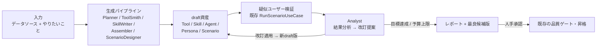
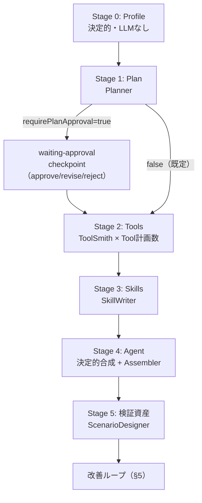
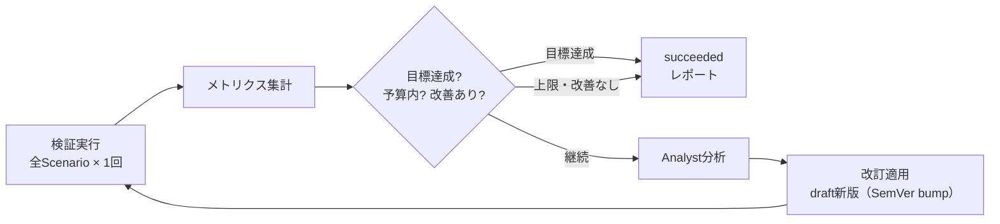

# 16. Agent Factory（自動生成と自動改善ループ）

> Status: Implemented (M1–M5)。実装は [implementation/v33-agent-factory.md](../implementation/v33-agent-factory.md)。
>
> 関連: [ADR-0033](./adr/0033-agent-factory-generation-loop.md) / [11-scenario-validation.md](./11-scenario-validation.md) / [14-agent-harness-builder.md](./14-agent-harness-builder.md) / [implementation/llmops-roadmap.md](../implementation/llmops-roadmap.md)

**データソースと「やりたいこと」を入力すると、Tool・Skill・システムプロンプト・Agent・検証資産（Persona / Scenario）を自動生成し、疑似ユーザー検証の結果から自動で改訂を繰り返す**機能を定義する。生成と改善は専門ロールに分かれた複数のLLMエージェント（内蔵ロール）が担い、その協調は決定的なパイプラインとしてオーケストレートする。



## 1. 設計目標

1. 登録済みデータソース（CSV / JSON / PostgreSQL read-only）と目的の自然文だけを入力に、動くAgent一式をdraftとして生成する。
2. 生成物はすべて既存の資産型（Tool / Skill / Agent / Persona / Scenario）の**通常のSemVer版**として保存し、専用の保存形式を作らない。既存のBuilder画面でそのまま開ける・編集できる。
3. 検証は既存のシナリオ検証（疑似ユーザー × 複数ターン × アンケート）をそのまま使い、1イテレーション = 「検証 → 分析 → 改訂 → 新版」の回帰比較可能な単位とする。
4. ループはdraft空間で全自動に回る。公開・昇格・write系副作用は既存どおり人手承認（fail closed）。
5. すべてのLLM出力は構造化出力で受け、アプリ側で再検証する（ETLエンジン検証・スキーマ検証・参照整合）。検証に落ちた提案は破棄または修復ループへ回す。
6. hard budget（イテレーション数・LLM呼び出し数・シナリオ実行数・時間）を必須とし、モデル判定だけを停止条件にしない。

## 2. 既存機能との関係（再利用マップ）

本機能は新しい実行基盤をほぼ作らない。生成・検証・評価の各段は既存ユースケースの呼び出しで構成する。

| 段階 | 再利用する既存実装 | 新規 |
|---|---|---|
| データソース参照 | `DataSourceRepository` / `ResolveDataSourceGraphUseCase` | プロファイル要約（決定的） |
| Tool生成 | `EtlEngine.propagateSchemas / preview`、`SaveToolUseCase`、`SuggestAnalysisConfigUseCase` の「LLM提案 → エンジン再検証」パターン | ToolSmithロール + 修復ループ |
| Skill生成 | `SaveSkillUseCase` | SkillWriterロール |
| プロンプト生成 | `GenerateAgentPromptUseCase`（決定的合成） | 役割文・実行規則のLLM起草 |
| Agent保存 | `SaveAgentUseCase` | — |
| Persona / 疑似ユーザー | `SavePersonaUseCase` / `RegisterPseudoUserAgentUseCase` | ScenarioDesignerロール |
| Scenario | `SaveScenarioUseCase` / `DEFAULT_SURVEY` | 同上 |
| 検証実行 | `RunScenarioUseCase`（1ターン = 1 Run、トレース永続化。`input.target` で対象Agent版を上書き可能） | メトリクス集計 |
| 分析・改訂 | — | Analystロール + 改訂提案の型 + 適用 |
| 非同期実行 | `InProcessExperimentWorker`（v23）の queue / cancel / 進捗パターン | `InProcessFactoryWorker` |
| 昇格 | 品質ゲート・昇格（v24）、LLM-as-Judge（v25） | —（接続のみ） |

[llmops-roadmap.md](../implementation/llmops-roadmap.md) の改善ループ図で人手だった「IMPROVE: Prompt / Skill / Tool改善」を、本機能がdraft空間内で自動化する。運用ログからの還流（v27・EvaluationCaseProposal）は独立した後続増分であり、本機能は依存しない。

## 3. 内蔵ロール（生成・改善マルチエージェント）

パイプラインの各段は、責務を絞った**内蔵ロール**が担う。各ロールは「system prompt テンプレート + 構造化出力スキーマ + 温度0の1回呼び出し（修復時のみ再試行）」であり、`ModelProviderPort` を通じて実行する。

| ロール | 責務 | 入力 | 構造化出力 |
|---|---|---|---|
| **Planner** | 目的とデータプロファイルから構成計画を立てる | goal / targetUsers / DataProfile[] | `FactoryPlan`（Agent像・Tool計画・Skill計画・Persona/Scenario計画） |
| **ToolSmith** | Tool計画1件をETLグラフへ具体化する | Tool計画 / ノードカタログ / 上流スキーマ | `ToolGraph` + `agentTool`契約 + 引数スキーマ |
| **SkillWriter** | Skill計画1件のinstructions等を起草する | Skill計画 / 依存Toolの契約 | responsibility / activationCondition / instructions / 入出力説明 |
| **Assembler** | 役割文・実行規則を目的に合わせて起草する | goal / 決定的合成の草稿 | 役割セクション・追加規則（差分のみ） |
| **ScenarioDesigner** | 検証用のPersona属性とScenarioを設計する（初期実装ではPlannerの計画に統合。§4 Stage 5参照） | goal / targetUsers / Tool契約一覧 | Persona属性[] / Scenario定義[]（goal・context・expectedTools） |
| **Analyst** | 検証結果を分析し改訂を提案する | メトリクス / アンケート / 感想 / 失敗トランスクリプト抜粋 / 現行資産の契約 | `Finding[]` + `ImprovementProposal[]` |

規則:

- ロールのプロンプトはアプリのコード資産として管理し、**保存済みAgentにしない**（[ADR-0033](./adr/0033-agent-factory-generation-loop.md)）。生成対象と生成主体を分離し、自己改変とbootstrap循環を防ぐ。
- ロール間の受け渡しはすべて型付きの中間成果物で行う。ロール同士の自由会話・共有チャット履歴は持たない。順序・分岐・再試行はアプリの決定的パイプラインが制御する。
- データソースの値・サンプル行・疑似ユーザーの発話・アンケート自由記述は、v25 Judgeと同じく **untrusted data として隔離**して渡す（system命令に混ぜない）。
- `structured-output` capability がないモデル構成では Factory 全体を利用不可として公開しない（`SuggestAnalysisConfigUseCase.available()` と同じ扱い）。

## 4. 生成パイプライン



### Stage 0: データプロファイル（決定的）

各 `dataSourceId` について、`ResolveDataSourceGraphUseCase` と `EtlEngine` でスキーマとサンプルを取得し、`DataProfile { schema, sampleRows(≤20), 列ごとの基本統計 }` を作る。LLMは使わない。ここで解決に失敗したデータソースがあればRun全体を早期に失敗させる。

### Stage 1: 構成計画（Planner）

`FactoryPlan` を得る。検証規則: Tool計画は各データソースを最低1回参照する必要はないが、**参照はすべて入力の `dataSourceIds` 内**であること。Tool数・Skill数・Scenario数は上限（既定: Tool ≤ 4、Skill ≤ 3、Persona ≤ 3、Scenario ≤ 6）内であること。`write` / `external-action` を要する計画は拒否する。

`requirePlanApproval: true` の場合、計画を `waiting-approval` checkpointとして停止する（Magentic計画承認と同じ応答型: `approve` / `revise(feedback)` / `reject`）。既定は `false`（全自動）。

#### 既存ツールの再利用（新規作成の前に考える）

Plannerへは、同じworkspaceに保存済みのToolの要約（**既存ツールカタログ**）を渡す。取得は use case 側（`buildExistingToolCatalog`）の責務で、ロールは値として受け取る。

- 収録対象: `sideEffect` が `read-only` / `session-write` かつ `state` が `deprecated` / `archived` でないTool。1件あたり `{ internalId, latestVersion, publishName, displayName, agentTool契約（name/description）, inputSchemaの列（name:type）, sideEffect }`。件数は上限20件（超過分は切り捨て、総数だけ `existingToolsOmitted` として伝える）。並びは決定的（組み込み → publishName昇順）で、組み込みツールは切り捨てられない。
- 判断: 計画する各Toolについて「既存カタログに目的を満たすToolがあるか」を先に考える。説明が目的に合致し、引数が過不足なく使えるなら**新規作成せず再利用**し、`tools[].reuse = { internalId, rationale }` を設定する（迷ったら新規作成）。現在日時が必要な場合は組み込みの `current_datetime` を再利用する。
- 再利用計画は既存Toolのグラフをそのまま使うため、`dataSourceId` は空文字を許す（データソースを読まないToolも選べる）。カタログ本体は利用者が書いた表示名・説明を含むため、プロファイル同様 untrusted data として user message 側へ隔離する。

### Stage 2: Tool生成（ToolSmith + 修復ループ）

Tool計画に `reuse.internalId` があり、渡された既存ツールカタログで解決できる場合はToolSmithを呼ばず、その既存Toolの**最新版**を `toolRefs` / Tool契約 / 公開名の対応へそのまま載せる（`tool_reused` イベント。既存Toolに新版は作らない）。解決できない場合（削除済み・カタログ外・再利用できない副作用）は理由をイベントへ残して、以下の新規生成へフォールバックする。

新規作成するTool計画ごとに:

1. ToolSmithへノードカタログ（登録済みノード型・config契約）・対象データソースのプロファイル・引数計画を渡し、`ToolGraph` を提案させる。
2. source ノードは計画の `dataSourceId` を参照する。sink は `agent-output`（必要に応じ `chart-output` / `workspace-output`）。
3. `EtlEngine.propagateSchemas` + `preview(rowLimit)` で検証する。エラー時はエラー内容を添えて再提案させる（`maxRepairAttempts` 回、既定2）。
4. 検証を通過したら `SaveToolUseCase` でdraft保存する。`sideEffect` は `read-only` または `session-write` のみ許可する。

修復上限まで失敗したToolは欠落として記録し、計画から除外して続行する（依存するSkill計画も縮退）。全Toolが欠落した場合はRunを失敗させる。

#### Tool引数（エージェントが渡す検索条件）

計画の `purpose` / `argumentSummary` が絞り込みを示す場合、ToolSmithは**未接続の `agent-input` ノードを1つだけ**置いてTool引数を宣言できる（`EtlEngine` は未接続の `agent-input` を終端候補から外すため、データ経路は source → … → `agent-output` の単一チェーンのまま）。

- 宣言: `{ "schema": { "columns": [{ "name", "type": "string"|"number"|"boolean", "nullable": false }] }, "sample": { <各列の代表値> } }`。
- 消費: filter条件に `"valueBinding": { "source": "agent-input", "field": "<引数名>" }` を付け、`value` には設計時サンプルとなる代表値を残す。1条件のフラットconfigでも `{ conditions, combine }` の各条件でも使える。
- 省略可能な引数: 絞り込みが任意（地域を指定しなければ全地域）の引数は `"nullable": true` で宣言する（`sample` への記載は不要）。JSON Schemaの `required` から外れるためエージェントは自然に省略でき、省略／null時は `RunAgentPreviewUseCase` が該当filter条件へ内部マーカー `disabled: true` を注入して**その条件だけをスキップ**する（条件が0件になったfilterは全行を通す）。`"all"` のようなマジック値をエージェントに渡させない（完全一致filterが0行になる）ための仕組み。
- 保存: `GenerateAgentAssetsUseCase` が `agent-input` の `config.schema` をそのまま `SaveToolDto.inputSchema` にする。これによりTool Calling契約（`toolToModelDefinition` がinputSchemaから導出するJSON Schema）とTool使用ガイドの `input [...]` 表記が引数付きになる。引数を宣言しないToolは従来どおり `inputSchema` 無しで保存する。
- 検証: agent-inputが2つ以上/引数宣言が壊れている/宣言したのに filter から参照されない引数がある場合は修復ループへ回す。バインド先が `inputSchema` に無い場合は `SaveToolUseCase` が拒否する。実行時は `RunAgentPreviewUseCase` がツール呼び出しの実引数で `valueBinding` の `value` を差し替える。

### Stage 3: Skill生成（SkillWriter）

Skill計画ごとにinstructions等を起草し、依存Toolを**生成済み版のSemVerで固定**して `SaveSkillUseCase` でdraft保存する。

### Stage 4: Agent組み立て（決定的合成 + Assembler）

`GenerateAgentPromptUseCase` でSkill/Toolガイドを決定的に合成し、Assemblerが起草した役割文・追加規則を役割セクションへ結合して `SaveAgentUseCase` でdraft保存する（`kind: 'normal'`、参照は全てSemVer固定）。Tool使用ガイド・Skillガイド・協働者ガイドはLLM起草で上書きしない（出所が機械的に追跡できる部分を保つ）。

### Stage 5: 検証資産生成（計画のマテリアライズ）

Stage 1 の Planner が既に `FactoryPlan.personas` / `FactoryPlan.scenarios` を設計しているため、初期実装ではこの段を**決定的マテリアライズ**とする（別途LLM生成しない。ScenarioDesignerロールによる後段の追い込みは後続スライス）。

- 各 `plan.personas` を `SavePersonaUseCase` → `RegisterPseudoUserAgentUseCase` で疑似ユーザーAgent化する。`personaKey → 疑似ユーザーAgent版` を対応付ける。
- 各 `plan.scenarios` を `SaveScenarioUseCase` で保存する。`target` は生成Agent版、`pseudoUser` は対応する疑似ユーザーAgent版へSemVer固定。`expectedTools` は `expectedToolKeys` を生成済みToolの公開名へ解決したもの（生成できなかったToolのキーは除外）。`survey` は `DEFAULT_SURVEY`。`maxUserTurns` は計画値。

**Scenario集合はRun内で凍結する。** 以降のイテレーションでScenarioを書き換えない（回帰比較の成立条件）。新Agent版の再検証は `RunScenarioUseCase` の既存の対象上書き（`input.target`）で行うため、Scenario版の改訂は不要である。Analystがシナリオ自体の欠陥を検出した場合はFindingとしてレポートに残すのみとする。

### 既存Agentの強化モード（`input.baseAgent`）

`FactoryRun.input.baseAgent = { internalId, version? }` を指定したRunは、**0→1生成ではなく既存Agentの強化**として走る（`version` 省略時は最新版が起点）。ステージ構成・イベント種別・停止条件は生成モードと同一で、各段の意味だけを読み替える。新しい `FactoryStage` / `FactoryEventKind` は追加しない。

| ステージ | 生成モード | 強化モード |
|---|---|---|
| Stage 0 Profile | `dataSourceIds`（1..5）をプロファイル | 起点Agentをロードして現有能力を把握 + `dataSourceIds`（**0..5**）をプロファイル。存在しない／`kind` が `normal` でないAgentはRunを失敗させる |
| Stage 1 Plan | Agent一式を設計 | **ギャップ計画**: Plannerへ `currentAgent`（displayName / systemPrompt / Tool契約 / Skill責務）を渡し、既にある能力は再計画させず不足分だけを計画させる。Tool/Skillとも0件の計画が正当（プロンプト改善だけのRun） |
| Stage 2-3 Tools/Skills | 計画どおり生成 | 同じ（計画された**追加分のみ**）。1件も作れなくてもRunは失敗させない（既存Agentはそのまま動くため） |
| Stage 4 Agent | 新しいAgentをdraft保存 | 起点Agentの**patch新版**。Tool/Skill参照は既存との和集合（同 internalId は新版優先）、systemPromptの扱いは `options.promptStrategy` で選ぶ（下記）。追加が0件かつ `preserve` なら新版を作らず既存版をそのまま起点にする |
| Stage 5 検証資産 | 生成Agent版を `target` に | 起点Agent（または統合後の新版）を `target` に。以降は無改修 |
| 改善ループ | 既存どおり | 既存どおり（`ApplyImprovementsUseCase` が既存Agentの設定を保全して新版を作る） |

**systemPromptの扱い（`options.promptStrategy`、既定 `preserve`）** — 強化モードでのみ効く（生成モードは元からAssemblerが役割文・実行規則を起草するため無視される）:

| 値 | 挙動 | ロール呼び出し |
|---|---|---|
| `preserve`（既定） | 起点Agentの `systemPrompt` を利用者が書いた資産として扱い、決定的合成の「Skillガイド」「Tool使用ガイド」節だけを差し替える。役割文・実行規則・利用者が書き足した節はそのまま残す（Assemblerを呼ばない） | 増えない |
| `rewrite` | Assemblerへ既存プロンプト全文を `currentPrompt`（untrusted data）として渡し、**改訂**として役割文・実行規則を書き直させ、生成モードと同じ組み立て（役割文 → Skillガイド → Tool使用ガイド →〈協働者ガイド〉→ 実行規則）で作り直す。利用者が書き足した独自の節は引き継がれない。Assemblerが失敗した場合はRunを落とさず `preserve` へフォールバックし、`proposal_rejected` イベントへ理由を残す | +1 |

制約:

- **既存Agentのメタデータ・設定を潰さない**: `displayName` / `publishName` / `owner`（`agent-factory` で上書きしない）/ `kind` / `state` / サブエージェント / `mcpServers` / `harness` / `output` / `persona` / `wikis` は起点版の値をそのまま引き継ぐ（`promptStrategy` によらず）。
- `preserve` で Builder標準の見出し（`# Skillガイド` / `# Tool使用ガイド`）が見つからない場合は、`# 実行規則` の手前（無ければ末尾）へガイドを差し込む。
- 起点Agentの `systemPrompt` はプロンプト注入の観点で untrusted data として扱い、Plannerへは user message 側（`<untrusted-data>`）で渡す。
- 強化モードであることは既存のイベント／レポートで表す: `stage_started`(profiling) の `message` が `enhancing agent <displayName>@<version>`、`stage_started`(assembling-agent) の `message` が統合結果、`FactoryReport.summary` の先頭が `Enhanced existing agent <displayName>@<version>.`。
- 失敗Runの `retry` は `baseAgent` も引き継ぐ（強化のつもりのRunを0→1生成として再実行しない）。

## 5. 改善ループ



### 5.1 メトリクス

イテレーションごとに `IterationMetrics` を集計する。

| 指標 | 出所 |
|---|---|
| `goalAchievedRate` | `ScenarioRun.goalAchieved` の平均（**主指標**） |
| `avgSatisfaction` | アンケート「総合満足度」（scale 1..5）の平均 |
| `toolHitRate` | `ScenarioRun.metrics.expectedToolHit.hitRate` の平均 |
| `errorRate` | status = `error` の割合 |
| `avgUserTurns` / usage / durationMs | `ScenarioRun.metrics` |

### 5.2 停止条件（いずれか成立で終了）

1. **目標達成**: `goalAchievedRate ≥ targets.minGoalAchievedRate`（既定 0.75）かつ `avgSatisfaction ≥ targets.minAvgSatisfaction`（既定 4.0）。
2. **改善停滞**: 主指標が前イテレーションから改善せず、`avgSatisfaction` も改善しない。
3. **上限**: `maxIterations`（既定3）、`budget`（時間・LLM呼び出し・シナリオ実行数）のいずれか到達。

終了時は**最良イテレーションの資産版**を候補としてレポートへ記載する（最終イテレーションが最良とは限らない）。

### 5.3 改訂提案（ImprovementProposal）

Analystの出力は型付きunionで受け、適用前にアプリが検証する。

```typescript
type ImprovementProposal =
  | { kind: 'system-prompt-revision'; agentId: string; sections: { role?: string; rules?: string }; rationale: string }
  | { kind: 'skill-instructions-revision'; skillId: string; instructions: string; activationCondition?: string; rationale: string }
  | { kind: 'tool-contract-revision'; toolId: string; agentTool: { name?: string; description?: string }; rationale: string }
  | { kind: 'tool-graph-revision'; toolId: string; graph: ToolGraph; rationale: string }
  | { kind: 'add-tool'; plan: FactoryToolPlan; rationale: string }
  | { kind: 'add-skill'; plan: FactoryAddSkillPlan; rationale: string };
```

適用規則:

- `tool-graph-revision` / `add-tool` はStage 2と同じエンジン検証・修復ループ・副作用制限を通す。`add-tool` の再提案回数はRunの `budget.maxRepairAttempts` に従う。
- 改訂はすべて既存Save系ユースケース経由のdraft新版として保存し、Agentの参照を新版へ差し替えた**新Agent版**を作る。既存版は不変（回帰比較・巻き戻しが常に可能）。新Agent版は起点Agentの設定（`kind` / サブエージェント / `mcpServers` / `harness` / `output` / `persona` / `wikis` / 公開状態）をすべて引き継ぐ。
- `add-tool` / `add-skill` は「無い能力を足す」提案で、Tool/Skillを新規保存した上でAgent新版の参照へ**追加**する（既存参照の版差替とは別経路）。`add-skill` の `plan.toolRefs` は「対象Agentが今持つTool」か「同一イテレーションの `add-tool`」だけを指せる（internalId / publishName / Tool契約名 / `add-tool` の `plan.key` の順で解決し、1つでも解決できなければ提案ごと却下）。
- `add-tool` は Analyst へ `availableDataSources`（Stage 0 プロファイルの要約）が渡っている場合だけ提案でき、そこに無い `dataSourceId` を指す提案は破棄する。1イテレーションの追加系（`add-tool` + `add-skill`）は合計2件までに絞る（改訂の枠を食い潰さないため）。
- 1イテレーションで適用する提案数に上限を設ける（既定4）。`system-prompt-revision` は1イテレーションにつき1件のみ。検証に落ちた提案は破棄し、`proposal_rejected` イベントへ理由を残す。

## 6. ドメインモデル

```typescript
type FactoryRunStatus = 'queued' | 'running' | 'waiting-approval' | 'succeeded' | 'failed' | 'cancelled';

type FactoryStage =
  | 'profiling' | 'planning' | 'generating-tools' | 'generating-skills'
  | 'assembling-agent' | 'generating-validation' | 'validating' | 'analyzing' | 'improving' | 'reporting';

interface FactoryRun {
  id: string;
  scope: TenantScope;
  input: {
    goal: { goal: string; targetUsers?: string; constraints?: string; language: 'ja' | 'en' };
    dataSourceIds: readonly string[];        // 生成モード 1..5 / 強化モード 0..5
    options: FactoryOptions;
    baseAgent?: { internalId: string; version?: string };  // 指定時は既存Agent強化モード（§4）
  };
  status: FactoryRunStatus;
  stage: FactoryStage;
  plan?: FactoryPlan;                        // Stage 1確定後のsnapshot
  artifacts: {                               // 生成資産の出所台帳（SemVer固定参照）
    tools: readonly VersionRef[];
    skills: readonly VersionRef[];
    agentVersions: readonly VersionRef[];    // イテレーションごとの版履歴
    personas: readonly VersionRef[];
    pseudoUsers: readonly VersionRef[];
    scenarios: readonly VersionRef[];
  };
  iterations: readonly FactoryIteration[];
  report?: FactoryReport;
  checkpoint?: FactoryPlanCheckpoint;        // waiting-approval時のみ
  budget: { consumed: FactoryBudgetSnapshot; limits: FactoryBudgetLimits };
  failure?: { stage: FactoryStage; reason: string };
  startedAt: string; finishedAt?: string;
}

interface FactoryIteration {
  index: number;                             // 1..maxIterations
  agentVersion: SemVer;
  scenarioRunIds: readonly string[];
  metrics: IterationMetrics;
  analysis?: { findings: readonly Finding[]; applied: readonly AppliedProposal[]; rejected: readonly RejectedProposal[] };
}

interface FactoryReport {
  bestIteration: number;
  candidate: { agentId: string; version: SemVer };
  summary: string;                           // Analystによる総括（人間向け）
  openFindings: readonly Finding[];          // 未解決の指摘（シナリオ欠陥等を含む）
  metricsByIteration: readonly IterationMetrics[];
}
```

- 生成資産の出所は `FactoryRun.artifacts` が台帳として一元管理する。Tool / Skill / Agent 側の共通メタデータへは出所フィールドを追加しない（資産側の型を変えない）。
- イベントは append-only の `FactoryEvent`（sequence付き）として **`FactoryRun` レコード内に埋め込む**（Harness run と同じ形。別テーブルにしない）。主なkind: `stage_started` / `stage_completed` / `plan_proposed` / `approval_requested` / `approval_resolved` / `tool_generated` / `tool_reused` / `tool_repair_attempted` / `artifact_saved` / `scenario_run_completed` / `analysis_completed` / `proposal_applied` / `proposal_rejected` / `iteration_completed` / `budget_exceeded` / `run_completed` / `run_failed` / `run_cancelled`。`GET /factory-runs/:runId/events` はRunレコードの `events` を返す。
- checkpointはRun record内へ埋め込み、TTL 24時間・型付き応答のみ受け付ける（Harness checkpointと同じ規則）。
- `FactoryRunRepository` は Harness run と同じ `save`（upsert）/ `find` / `list` 契約とする。workerは進捗のたびに `save` で全レコードを置き換える。

## 7. 実行モデル

- `POST /factory-runs` は `202` を返し、`InProcessFactoryWorker` が逐次実行する（v23 Experimentと同じPort設計。将来は外部queue adapterへ差し替え）。
- 同時実行は1 workerあたり1 Runとする。キャンセルは実行中Stageの完了を待って反映し、`AbortSignal` を各LLM呼び出し・シナリオ実行へ伝播する。
- 検証実行は既存規則に従う: 生成AgentのTool集合は `read-only` / `session-write` のみなのでシナリオ実行可能（[11-scenario-validation.md §4](./11-scenario-validation.md)）。
- LLM呼び出しはロール実行・疑似ユーザー・対象Agentすべて `ModelProviderPort` を共有する。Factory自身のロール呼び出し回数は `budget.maxRoleCalls` で、シナリオ実行回数は `maxScenarioRuns` で制限する。
- 失敗時も生成済みdraft資産と部分レポートを保持する（資産のロールバックはしない。draftのため実害がなく、失敗解析に有用）。

## 8. セキュリティと自律性の境界

| 論点 | 規則 |
|---|---|
| 副作用 | 生成Toolは `read-only` / `session-write` のみ。`write` / `external-action` の計画・提案は保存前に拒否する |
| 公開状態 | 生成資産はすべて `draft`。昇格は既存の品質ゲート + 人手承認のみ（Factoryは昇格APIを呼ばない） |
| プロンプト注入 | データ値・疑似ユーザー発話・アンケート自由記述はuntrusted dataとして隔離。ロール命令はアプリ管理のテンプレートのみ |
| 参照整合 | 生成物の相互参照はすべて同一Run内で生成された資産のSemVer固定参照。外部資産の書き換えはしない |
| 予算 | 時間・ロール呼び出し・シナリオ実行・イテレーションのhard limit必須。超過は `budget_exceeded` を記録して停止 |
| 資格情報 | 既存どおりbackend環境変数のみ。ロールへ渡すのはプロファイル（スキーマ・サンプル行）だけで接続情報は渡さない |
| 命名 | `publishName` は決定的slug + 衝突時連番。既存資産の名前空間を汚染しないようFactory生成物は `displayName` に出所ラベルを付す |

## 9. REST API

```text
POST   /factory-runs                     # 202 { runId }
GET    /factory-runs
GET    /factory-runs/:runId
GET    /factory-runs/:runId/events
POST   /factory-runs/:runId/responses    # 計画承認: { kind: 'plan-approval', decision, feedback? }
POST   /factory-runs/:runId/retry        # 202 失敗Run（failed）を同じ入力の新しいRunとして起票する
POST   /factory-runs/:runId/cancel
```

開始要求:

```json
{
  "scope": { "tenantId": "local", "workspaceId": "default" },
  "goal": {
    "goal": "月次の売上データについて質問に答え、傾向を要約できるアシスタントが欲しい",
    "targetUsers": "経理担当者。SQLは書けない",
    "language": "ja"
  },
  "dataSourceIds": ["ds-sales-csv"],
  "options": { "maxIterations": 3, "requirePlanApproval": false }
}
```

既存Agentの強化（§4「既存Agentの強化モード」）は `baseAgent` を添える。このとき `dataSourceIds` は0件（または省略）でよく、既存Agentのプロンプト改善だけのRunも成立する。`version` を省略すると最新版が起点になる。

```json
{
  "scope": { "tenantId": "local", "workspaceId": "default" },
  "goal": { "goal": "回答に根拠の行を必ず示せるようにしたい", "language": "ja" },
  "baseAgent": { "internalId": "agent-sales-assistant" },
  "dataSourceIds": []
}
```

`options` 省略時の既定: `maxIterations: 3` / `personaCount: 2` / `scenarioCount: 4` / `requirePlanApproval: false` / `promptStrategy: 'preserve'` / `targets: { minGoalAchievedRate: 0.75, minAvgSatisfaction: 4 }` / `budget: { maxDurationMs: 30分, maxRoleCalls: 40, maxScenarioRuns: 20, maxRepairAttempts: 2, maxProposalsPerIteration: 4 }`。

`options.promptStrategy`（`'preserve' | 'rewrite'`）は**強化モードでのみ効く**、既存Agentの systemPrompt の扱い（§4「既存Agentの強化モード」）。`'rewrite'` はAssembler呼び出しを1回追加で消費する。生成モードでは無視される。

## 10. UI（Factory画面）

ナビゲーションへ「Factory」を追加する。

```text
┌ 入力 ────────────────┬──────── 実行タイムライン ────────┬ 生成物 / レポート ──┐
│ やりたいこと(必須)     │ ● Profile    ✓ 2 sources        │ Agent: 売上アシス   │
│ 想定利用者            │ ● Plan       ✓ Tool3 Skill2     │  タント@0.3.0 (best)│
│ データソース(複数選択) │ ● Tools      ✓ 3/3 (修復1)      │ Tools: 3件 → 開く   │
│ 詳細オプション ▸      │ ● Agent      ✓ v0.1.0           │ Scenarios: 4件      │
│                      │ ● Validate   it.1  ▮▮▮▯ 3/4     │ ─ レポート ─        │
│ [生成を開始]          │ ● Analyze    it.1  提案3適用     │ goalAchieved 50→75% │
│                      │ ● Validate   it.2  ▮▮▮▮ 4/4     │ 満足度 3.2→4.1      │
│ 実行履歴              │ ✔ 完了 (it.2が最良)             │ [検証画面で開く]     │
└──────────────────────┴──────────────────────────────────┴─────────────────────┘
```

1. 入力はgoal必須・データソース1件以上（強化モードでは対象Agent必須・データソース任意）。`requirePlanApproval` 有効時は計画カードに承認・修正・却下ボタンを表示する。詳細オプションには、強化モードのときだけ systemPrompt の扱い（`promptStrategy`: 既存プロンプトを保つ / モデルに役割・ルールを書き直させる）を出す。
2. タイムラインはevents購読（ポーリング）で更新し、各StageからArtifact（Tool / Agent / ScenarioRun）の既存画面へリンクする。
3. レポートはイテレーション別メトリクスの推移、最良候補版、未解決Findingを表示する。**昇格ボタンは置かない**（既存のQuality画面へ誘導する）。

## 11. 検証と評価

- 各ロールは `ScriptedModelProvider` のシナリオ台本で決定的にテストする（正常・構造化出力破損・検証不合格 → 修復・修復失敗）。
- パイプライン全体の統合テスト: scripted台本で「生成 → 検証(低スコア) → 改訂適用 → 検証(改善) → 成功終了」と「改善停滞での早期終了」「予算超過終了」「計画却下」を通す。
- Repository契約テスト（InMemory / SQLite共通）を `FactoryRunRepository` / `FactoryEventRepository` へ追加する。
- E2E: testプロファイルでFactory実行 → タイムライン表示 → 生成AgentがAgent画面に現れることをsmokeで確認する。
- Factory自体の品質は既存指標で観測できる: 生成Runの `goalAchievedRate` 初期値、収束までのイテレーション数、Tool修復率、提案却下率。

## 12. 実装順序

1. **M1 基盤**: Domain（FactoryRun / Plan / Iteration / Proposal / events）、serialization、repository（InMemory / SQLite + 契約テスト）、Worker Port、API skeleton、Stage 0–1（Profile / Planner）、計画承認checkpoint。
2. **M2 生成**: ToolSmith + 修復ループ、SkillWriter、Assembler、Stage 2–4の資産保存、Factory画面の入力・タイムライン最小版。
3. **M3 検証接続**: ScenarioDesigner、Stage 5、シナリオ一括実行とメトリクス集計（イテレーション1回のみ = ループなし）。
4. **M4 改善ループ**: Analyst、ImprovementProposal検証・適用、停止条件、レポート、UI完成。
5. **M5 接続強化（後続）**: 生成ScenarioのEvaluationDataset化（v22資産へのexport）、Judge指標のループ組み込み、v27還流との接続、Harness対象の生成。

## 13. 非目標

- 生成資産の自動昇格・自動公開。
- `write` / `external-action` Toolの生成。
- Harness（マルチエージェント構成）自体の自動生成。初期対象は単体Agentのみ（M5候補）。
- ループ内でのScenario自動改訂（テストを動かして合格させる方向の最適化を防ぐ）。
- 疑似ユーザーAgentへのTool / Skill付与（[11-scenario-validation.md §8](./11-scenario-validation.md)の非目標を踏襲）。
- 本番ログ・実利用フィードバックからの還流（v27で扱う）。
- 内蔵ロールの保存済みAgent化・ユーザーによるロールプロンプト編集（エスケープハッチは生成後の資産編集で提供する）。
