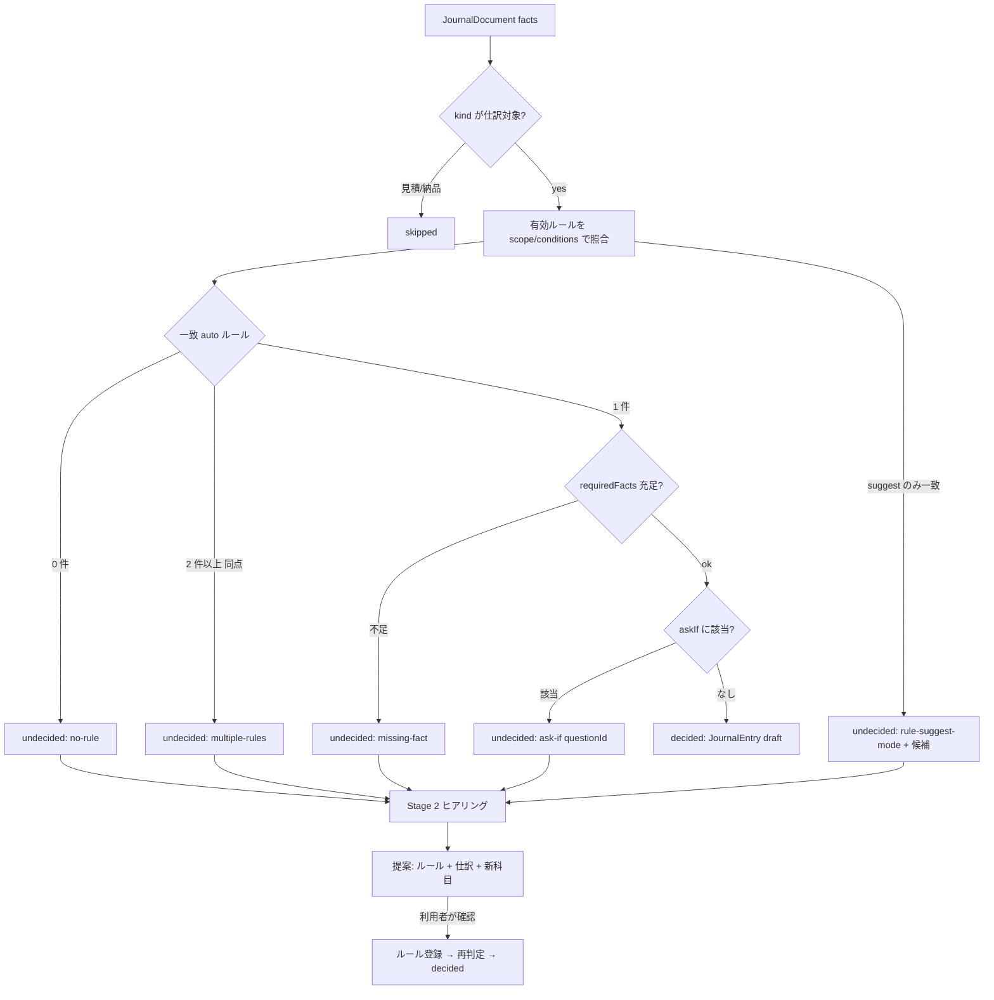

# 20. 仕訳（入力系・仕訳系）

伝票・帳票を取り込み、**2 段階判定**（① 既存ルールで迷わず仕訳できるか / ② できなければヒアリングでルール化）で仕訳を起こし、汎用 CSV に出力する機能。サイドバー「作る」の **仕訳** タブ。

- 関連: [04-api-spec.md](./04-api-spec.md)（REST）/ [ADR-0038](./adr/0038-journal-two-stage-judgment.md) / [18-quickstart.md §7](./18-quickstart.md)
- 調査メモ（設計根拠）: 国税庁 適格請求書 Q&A（問18/54/57/58/94/104/113-3）、freee / マネーフォワード / 弥生 の自動仕訳ルール仕様、各社の仕訳インポート列。URL は本書末尾。

## 1. 目的とスコープ

| 目的 | 内容 |
|---|---|
| 入力 | 3 系統: **画像/PDF**（vision モデルで読取）、**構造化データ**（CSV/JSON/手入力。銀行・カード明細 CSV は銀行別プリセットで正規化）、**テキスト**（メール本文・メモから LLM 抽出） |
| 判定 | **Stage 1**: 決定的なルール照合。一意に確定できれば仕訳ドラフトを作る。**Stage 2**: 確定できない理由（該当ルール無し / 複数ルール競合 / 必要項目不足 / 「迷うケース」該当）を出し、LLM ヒアリングで質問→回答→**新ルールと必要項目の提案**→利用者が確認して登録→再判定 |
| 出力 | 汎用仕訳 CSV（UTF-8 BOM, CRLF）。列は弥生 25 項目を最大公約数に取引先・品目・インボイス区分・税額を加えた 25 列（§8）。弥生 / freee / MF 形式への写像はプリセットとして追加可能な構造 |
| 保持 | SQLite（`journal_*` テーブル、migration v5）。証憑本体（画像 data URL / PDF 由来の画像 / テキスト）は `journal_documents.record_json` に同梱（1 件 8 MiB 上限） |
| ツール化 | 判定・出力は組込みツール（`builtin-journal-judge` / `builtin-journal-export`）としてエージェントからも呼べる（フェーズ 3） |

**科目体系は固定しない**（利用者指示）。勘定科目・税区分・補助軸（補助科目 / 部門 / プロジェクト / タグ…）はワークスペース単位のマスタで、標準セットは初期値に過ぎない。追加・改名・無効化・並び替え・CSV 取込 / 出力ができ、ヒアリングが既存マスタに無い科目を提案したときは「新しい科目として登録するか」を確認してから登録する。ルールは科目を **id** で参照し、名称変更に追従する。

## 2. 概念モデル

```mermaid
classDiagram
  class ChartOfAccounts { accounts[] ; dimensions[] ; taxCategories[] ; updatedAt }
  class Account { id ; code? ; name ; category ; defaultTaxCode? ; aliases[] ; enabled ; sortOrder ; note? }
  class Dimension { id ; name ; values[] }
  class TaxCategory { code ; name ; side ; rate? ; deductionRate? ; enabled ; mapping{yayoi,freee,mf}? }
  class JournalDocument { id ; kind ; source ; facts ; extraction ; status ; entryId? ; hearingId? }
  class JournalRule { id ; name ; enabled ; mode ; priority ; scope ; conditions[] ; outcome ; askIf[] ; requiredFacts[] ; provenance }
  class JournalEntry { id ; documentId? ; ruleId? ; date ; lines[] ; description ; invoiceStatus ; status ; decidedBy ; confidence }
  class HearingSession { id ; documentId ; status ; turns[] ; proposal? }
  ChartOfAccounts "1" o-- "*" Account
  ChartOfAccounts "1" o-- "*" Dimension
  ChartOfAccounts "1" o-- "*" TaxCategory
  JournalDocument "1" --> "0..1" JournalEntry
  JournalDocument "1" --> "0..1" HearingSession
  JournalRule "1" --> "*" JournalEntry : decided
  HearingSession --> JournalRule : proposes
```

### 2.1 JournalDocument（取込んだ 1 証憑）

| 項目 | 内容 |
|---|---|
| `kind` | `invoice` / `simplified_invoice`（レシート）/ `receipt`（手書き領収書）/ `delivery_note` / `quotation` / `bank_statement` / `card_statement` / `expense_report` / `payslip` / `slip_transfer` / `slip_cash_in` / `slip_cash_out` / `other` / `unknown`。`quotation` と `delivery_note` は判定キューに乗せない（`skipped`） |
| `source` | `{ type: 'image' | 'pdf' | 'text' | 'structured' | 'csv-row', fileName?, mime?, dataUrl?（画像）, text?（原文）, row?（CSV 1 行の生値）, preset?（CSV プリセット id） }` |
| `facts` | **正規化済み事実**（§2.2）。判定はここだけを見る |
| `extraction` | `{ method: 'manual' | 'llm' | 'csv-preset' | 'structured', model?, confidence?（0..1）, warnings[], fieldEvidence?{ field → { sourceText, confidence } } }` |
| `status` | `extracted` → `decided`（Stage 1 で確定、entryId あり）/ `undecided`（理由付き）→ `hearing`（Stage 2 進行中）→ `decided` / `skipped` / `exported` |
| `judgment` | 直近の判定結果（§3）。`undecided` の理由はここに残す |

### 2.2 DocumentFacts（正規化済み事実）

帳票種別を問わず同じ形。無いものは `undefined`。金額は **税込整数（円）**、日付は `YYYY-MM-DD`（和暦は取込時に変換）。

| フィールド | 型 | 由来 |
|---|---|---|
| `direction` | `'in' \| 'out'` | 収入 / 支出（銀行明細の入出金列、請求書の宛名/発行者から） |
| `issuerName` / `recipientName` | string | 発行者（登録番号・住所がある側）/ 宛名（御中・様がある側） |
| `registrationNumber` | `T` + 13 桁 or undefined | ハイフン除去して正規化 |
| `issueDate` / `transactionDate` / `dueDate` | date | 取引日は経過措置の判定に使う |
| `grandTotal` | integer | 税込合計 |
| `totalsByRate[]` | `{ rate: 10 \| 8 \| 0, taxableAmount, taxAmount?, amountIncludesTax }` | 税率ごとの集計欄 |
| `lines[]` | `{ description, quantity?, unitPrice?, amount, taxRate?, reducedRateMark }` | 明細 |
| `paymentMethod` | `cash \| credit_card \| bank_transfer \| qr \| e_money \| direct_debit \| unknown` | |
| `accountHint` | string | 銀行口座 / カード名（CSV プリセット由来） |
| `description` / `descriptionNorm` | string | 摘要原文 / 正規化（NFKC、半角カナ→全角、`ｶ)`・`(株)` 等の法人略号除去、連続空白圧縮、数字列除去はしない） |
| `counterpartyHint` | string | 摘要から切り出した相手先 |
| `extra` | `Record<string, JsonValue>` | 帳票固有の追加項目（参加人数、目的など、ヒアリングで埋まる） |

### 2.3 JournalRule

freee / MF / 弥生 の自動仕訳ルールの共通形。

| 項目 | 内容 |
|---|---|
| `mode` | `auto`（Stage 1 で確定してよい）/ `suggest`（一致しても Stage 2 に回す＝freee の「推測」） |
| `priority` | 整数。大きいほど優先（同点は特異度 → 作成順） |
| `scope` | `{ documentKinds?[], direction?: 'in' \| 'out', accountHints?[] }`（空は共通） |
| `conditions[]` | AND。`{ field, op, value }`。`field` は facts のパス（`descriptionNorm`, `issuerName`, `grandTotal`, `registrationNumber`, `paymentMethod`, `transactionDate`, `lines[].description`, `extra.<key>` …）。`op` は `equals \| contains \| startsWith \| endsWith \| regex \| between \| gte \| lte \| in \| exists \| notExists \| isTrue \| isFalse` |
| `outcome` | `lines[]`: `{ side: 'debit' \| 'credit', accountId, dimensionValues?{ dimId: valueId }, taxCode, amount: 'total' \| 'taxable:10' \| 'taxable:8' \| 'tax:10' \| 'tax:8' \| 'remainder' \| { fixed } \| { ratio }, partnerFrom?: 'issuerName' \| 'counterpartyHint' \| { fixed } }`、`descriptionTemplate`（`{issuerName}` 等の置換）、`invoiceStatus?`（`qualified \| transitional \| none \| not_required \| auto`。`auto` は登録番号の有無と取引日から決める。ただし銀行・カード明細・給与・伝票のように**そもそも登録番号を載せない帳票**は `not_required` とし、「番号が無い＝免税事業者」と誤って経過措置にしない。経過措置になるのは請求書・レシート・領収書・経費精算書で番号が無いときだけ） |
| `askIf[]` | 条件を満たしても確定させない追加質問のトリガ: `{ conditions[], questionId, prompt }`（例: 金額 ≥ 100,000 → 固定資産確認） |
| `requiredFacts[]` | 確定に必要な facts パス。欠けていれば `undecided(missing-fact)` |
| `provenance` | `{ origin: 'manual' \| 'hearing' \| 'seed', hearingId?, exampleDocumentIds[] }` |

**特異度**: 条件数 + `equals` 2 点 / `startsWith` `endsWith` 1.5 点 / `contains` `regex` 1 点 + scope 指定ごとに 1 点。競合解決は priority → 特異度 → createdAt。

### 2.4 JournalEntry

| 項目 | 内容 |
|---|---|
| `lines[]` | `{ side, accountId, accountName（確定時の名称を写す）, dimensionValues?, taxCode, amount, taxAmount?, partner? }`。借方合計 = 貸方合計 を不変条件にする |
| `status` | `draft` → `confirmed` → `exported` |
| `decidedBy` | `rule` / `hearing` / `manual` |
| `invoiceStatus` / `registrationNumber` | インボイス区分と登録番号（CSV に出す） |

### 2.5 HearingSession（Stage 2）

| 項目 | 内容 |
|---|---|
| `turns[]` | `{ role: 'assistant', question: { id, text, kind: 'single' \| 'multi' \| 'text' \| 'number' \| 'confirm', options?[{ value, label, hint? }], factPath? } }` と `{ role: 'user', answer: { questionId, value } }` の列 |
| `proposal` | `{ rule: JournalRule 草案, entry: JournalEntry 草案, newAccounts?[], newDimensionValues?[], newTaxCategories?[], rationale }` |
| `status` | `open` → `proposed` → `accepted` / `cancelled` |

質問は「帳票外の判定軸」を聞く（§4 迷うケースカタログ）。回答は `facts.extra` にも書き戻し、提案ルールの条件（`extra.purpose equals 'internal-meeting'` 等）に使えるようにする。

## 3. 2 段階判定



`judgeDocument(facts, rules, chart, now)` は **純粋関数**（`src/domain/journal/judgment.ts`）。結果:

```ts
type Judgment =
  | { stage: 'decided'; ruleId: string; entry: JournalEntryDraft; specificity: number; candidates: RuleMatch[] }
  | { stage: 'undecided'; reasons: UndecidedReason[]; candidates: RuleMatch[] }   // candidates は一致した suggest ルールや同点ルール
  | { stage: 'skipped'; reason: 'document-kind' };
type UndecidedReason =
  | { code: 'no-rule' }
  | { code: 'multiple-rules'; ruleIds: string[] }
  | { code: 'missing-fact'; ruleId: string; facts: string[] }
  | { code: 'ask-if'; ruleId: string; questionId: string; prompt: string }
  | { code: 'rule-suggest-mode'; ruleIds: string[] }
  | { code: 'unknown-account'; ruleId: string; accountIds: string[] }   // マスタから消えた/無効化された科目
  | { code: 'unbalanced'; ruleId: string };
```

UI は理由ごとに「原因 → 次の一手 → 修正場所へのボタン」を出す（`no-rule` → ヒアリング開始 / `multiple-rules` → ルール一覧で優先度調整 / `missing-fact` → 帳票の項目編集 / `unknown-account` → 科目マスタ）。

## 4. 「迷うケース」カタログ（ヒアリングの質問テンプレート）

`src/domain/journal/ambiguity-catalog.ts` に定数として持ち、Stage 2 のプロンプトと `askIf` の雛形に使う。抜粋:

| id | トリガ | 質問 | 分岐 |
|---|---|---|---|
| `meal_purpose` | 飲食店・カフェ・居酒屋 / 支出 | 誰と・何の目的の飲食でしたか？（参加人数） | 接待交際費 / 会議費 / 福利厚生費 / 事業主貸。1 人あたり 10,000 円以下（2024/4/1 以後）は交際費から除外可 |
| `ec_item_type` | Amazon・楽天・ヨドバシ等 | 何を買いましたか？（書籍 / 文具・消耗品 / 機材 / 商品仕入 / 私用） | 新聞図書費 / 消耗品費 / 工具器具備品 / 仕入高 / 事業主貸 |
| `fixed_asset_check` | 1 品 100,000 円以上 | 1 単位の取得価額と取得日、青色・中小か | 消耗品費 / 一括償却資産 / 少額減価償却資産（<30 万、2026/4/1 以後は <40 万）/ 固定資産 |
| `transport_kind` | 交通機関・タクシー | 出張ですか、近距離移動ですか、通勤ですか | 旅費交通費 / 交通費 / 通勤費 |
| `prepaid_period` | 年払い・サブスク・保険 | サービス期間はいつからいつまでですか（1 年以内か） | 前払費用 / 短期前払費用特例で全額費用 |
| `withholding_check` | 個人への報酬・士業 | 相手は個人ですか、報酬の種類は | 外注費 + 預り金（10.21% / 100 万円超 20.42%） |
| `invoice_registration` | 登録番号なし | 相手は適格請求書発行事業者ですか（番号を確認できますか） | 経過措置 80% / 70% / 50% / 30% / 控除なし（取引日で自動） |
| `tax_exempt_kind` | 保険料・地代・切手・行政手数料 | 取引の性質は | 非課税仕入 / 不課税・対象外 / 課税 |
| `household_ratio` | 家賃・光熱費・通信費（個人） | 事業利用の按分率は | 費用 × 按分率 + 事業主貸 |
| `bank_transfer_in` | 銀行摘要「振込 ｶ)…」入金 | どの請求の入金ですか | 売掛金回収 / 売上 / 前受金 / 借入金 |
| `account_transfer` | 口座間振替・カード引落 | 相手口座は自社管理ですか | 資金移動 / 未払金消込 |
| `reduced_rate_check` | 8% 対象行あり | 店内飲食ですか持ち帰りですか | 8%（軽減）/ 10% |

経過措置の控除割合は取引日で決める定数表（80%: 〜2026/9/30、70%: 〜2028/9/30、50%: 〜2030/9/30、30%: 〜2031/9/30、以後 0%）。

## 5. 科目マスタ（ChartOfAccounts）

- **標準セット**（seed）: 青色申告決算書（一般用）の科目 + 会計ソフト慣用科目（会議費・新聞図書費・支払手数料・車両費・研修費・諸会費・寄付金・支払報酬料）+ 資産・負債・純資産の仕訳相手科目（現金・普通預金・売掛金・未払金・預り金・事業主貸/借・資本金 など）。`category` は `asset | liability | equity | revenue | expense | other`。
- **税区分**（seed）: 内部コード `JP-{IN|OUT|NA}-{RATE}-{KIND}[-D{割合}]`（例 `JP-IN-10-S`, `JP-IN-8R-S`, `JP-IN-10-S-D80`, `JP-IN-EXEMPT`, `JP-IN-NA`, `JP-OUT-10-S`, `JP-OUT-8R-S`, `JP-OUT-EXEMPT`, `JP-OUT-EXPORT`, `JP-NA`）。`mapping` に弥生 / freee / MF の表示名を持てる（空でもよい）。
- **補助軸**（dimensions）: seed は `sub_account`（補助科目）と `department`（部門）を空の値リストで用意。利用者が軸自体を追加できる。
- **柔軟性の担保**: すべて string id。削除は論理（`enabled: false`）で、ルール・仕訳からの参照は残る（判定時に `unknown-account` として検出し導線を出す）。CSV 取込 / 出力（`id,code,name,category,defaultTaxCode,aliases,enabled`）。
- ヒアリング提案の `newAccounts[]` は利用者が「登録」を押したときだけマスタに入る。

## 6. 取込（3 系統）

| 系統 | 経路 | 備考 |
|---|---|---|
| 画像 | UI で縮小（長辺 2000px、JPEG）→ data URL → `POST /journal/documents/extract`（vision + 構造化出力、スキーマ = DocumentFacts + kind + fieldEvidence）→ 利用者が確認・修正して保存 | vision 非対応モデルなら機能フラグで案内 |
| PDF | **ブラウザ側**で `pdfjs-dist` によりページを画像化（テキスト層があればテキストも添付）→ 画像系統と同じ | サーバーに PDF ライブラリを持ち込まない（ADR-0038） |
| テキスト | `POST /journal/documents/extract` に `text` を渡して LLM 抽出 | メール本文・メモ |
| 構造化 | 手入力フォーム（facts を直接編集）/ JSON 貼付（DocumentFacts）/ **CSV プリセット**（楽天銀行 4 列、MUFG 9 列、SMBC 7 列、ゆうちょ 12 列、楽天カード、汎用「日付,摘要,出金,入金,残高」、全銀協固定長は対象外）→ 1 行 1 document | 列名署名でプリセット自動判定、失敗時は列マッピング UI |

抽出プロンプトの要点: 帳票にある情報だけ・無いものは null、金額は整数・日付は ISO・登録番号は `T`+13 桁に正規化、`amountIncludesTax` を必ず出す、「御中/様＝宛名」「登録番号・印・住所がある側＝発行者」、お預り/お釣を合計と混同しない。抽出後に整合チェック（税率別合計 = 合計 ± 税率行数、明細合計 ≒ 合計）を行い `warnings[]` に残す。

## 7. ヒアリング（Stage 2）

1. `POST /journal/hearings`（documentId）: 判定理由 + facts + 迷うケースカタログ + マスタ（有効科目一覧）を LLM に渡し、最初の質問（最大 3 問）を構造化出力で得る。
2. `POST /journal/hearings/:id/answers`: 回答を facts.extra に書き、LLM に次の質問か **提案** を出させる（`proposal`: rule + entry + newAccounts + rationale）。提案は検証（科目 id がマスタか newAccounts にある、貸借一致、税区分が有効）し、壊れていれば 1 回修復を試みる。
3. `POST /journal/hearings/:id/accept`: newAccounts をマスタへ登録（利用者が選んだものだけ）→ ルール保存 → 対象 document を再判定 → decided。
4. LLM 非対応 / 無効時は「手動でルールを作る」導線（ルール編集フォームに facts から条件を事前入力）。

## 8. 汎用 CSV

1 行 = 1 仕訳行。複合仕訳は同一 `entry_id`。UTF-8 BOM、CRLF、`YYYY/MM/DD`、金額は税込整数。

`entry_id, line_no, date, debit_account, debit_sub_account, debit_department, debit_partner, debit_tax_code, debit_amount, debit_tax_amount, credit_account, credit_sub_account, credit_department, credit_partner, credit_tax_code, credit_amount, credit_tax_amount, description, invoice_status, registration_number, item, tags, closing_flag, source_document_id, rule_id`

`GET /journal/export?format=generic&status=confirmed&from&to` は `{ format, fileName, content }` を返し、UI は Blob でダウンロードする（従来の textarea 表示も残す）。弥生 / freee / MF プリセットは `format` を増やすだけで済むよう `src/application/journal/export-presets.ts` に列写像を置く。

## 9. REST API（抜粋。詳細は 04-api-spec §3.4）

| Method | Path | 内容 |
|---|---|---|
| GET/PUT | `/journal/chart` | 科目マスタの取得 / 全体保存 |
| POST | `/journal/chart/reset` | 標準セットに戻す |
| GET/POST | `/journal/chart/export` `/journal/chart/import` | 科目 CSV |
| GET/POST/DELETE | `/journal/rules`, `/journal/rules/:id` | ルール CRUD |
| POST | `/journal/rules/test` | ルール草案を保存せずに文書群へ照合 |
| GET/POST/PUT/DELETE | `/journal/documents`, `/journal/documents/:id` | 文書 CRUD（POST は facts 直接 / JSON） |
| POST | `/journal/documents/import-csv` | CSV + preset → 文書群 |
| POST | `/journal/documents/extract` | 画像 / テキストから facts を LLM 抽出（保存しない） |
| POST | `/journal/documents/judge` | 指定文書（省略時は未判定全件）を Stage 1 判定 |
| GET/PUT/POST/DELETE | `/journal/entries`, `/journal/entries/:id`, `/journal/entries/:id/confirm` | 仕訳 CRUD・確定 |
| POST/GET | `/journal/hearings`, `/journal/hearings/:id`, `/journal/hearings/:id/answers`, `/journal/hearings/:id/accept`, `/journal/hearings/:id/cancel` | Stage 2 |
| GET | `/journal/export` | 仕訳 CSV |
| GET | `/runtime/capabilities` | `journal: { extraction: { enabled, vision }, hearing: { enabled } }` |

## 10. 画面（仕訳タブ）

| サブタブ | 内容 |
|---|---|
| 取込 | 画像 / PDF / テキスト / CSV / 手入力。抽出結果の確認・修正フォーム（fieldEvidence の信頼度が低い項目を強調） |
| 判定 | 文書一覧（状態フィルタ）。「未判定を判定」ボタン。行ごとに Stage 1 の結果と理由、`ヒアリングを開始` / `ルールを開く` / `科目を開く` の導線。ヒアリングパネル（質問カード → 提案カード → 登録） |
| ルール | 一覧（優先度・特異度・最終適用）、編集フォーム、「文書でテスト」 |
| 科目 | 科目 / 税区分 / 補助軸の編集、CSV 取込 / 出力、標準に戻す |
| 出力 | 仕訳一覧（draft / confirmed）、確定、CSV ダウンロード |

ディープリンク: `OpenTarget { internalId: <id>, section: 'document' | 'rule' | 'account' | 'hearing' }`。

## 11. 保存（SQLite v5）

`journal_chart(tenant_id, workspace_id, record_json)`、`journal_documents(tenant_id, workspace_id, id, kind, status, transaction_date, created_at, record_json)`、`journal_rules(tenant_id, workspace_id, id, enabled, priority, record_json)`、`journal_entries(tenant_id, workspace_id, id, document_id, status, entry_date, record_json)`、`journal_hearings(tenant_id, workspace_id, id, document_id, status, record_json)`。

## 12. サンプル帳票

`samples/journal/` に同梱:

- 合成: 銀行明細 CSV（楽天型 / MUFG 型 / SMBC 型 / ゆうちょ型 / 汎用）、カード明細 CSV、適格請求書・簡易適格請求書・手書き領収書・立替金精算書の JSON（DocumentFacts）と HTML → PNG/PDF（`scripts/render-journal-samples.mts`、Playwright で描画）、メール本文テキスト。
- 公開物: 国税庁 Q&A 記載例（問54 / 57 / 58 / 94、公共データ利用規約 PDL1.0、出典明記）。JP PINT の UBL 例や自治体様式は再配布条件が確認できないため URL のみ `samples/journal/SOURCES.md` に記載。

### 12.1 サンプルの使い方

- 一覧と各ファイルの期待結果（Stage 1 の判定・該当する「迷うケース」・提案ルール例）は `samples/journal/README.md` にまとめてある。
- CSV は取込タブ → CSV で読み込む。列名は §6 のプリセット署名と一致させてあり、`*.sjis.csv`（Shift-JIS）・BOM 付き・LF 改行（`bank-smbc.csv`）で文字コード / 改行の自動判定を試せる。
- JSON は `SaveJournalDocumentDto`（`src/ui/api/types.ts`）の形。取込タブ → JSON 貼り付けにそのまま貼る。`quotation.json` / `delivery-note.json` は `skipped` になることの確認用。
- `rendered/*.png|pdf` は `templates/*.html` を `npx tsx scripts/render-journal-samples.mts` で描画したもので、同名の JSON が vision 抽出テストの正解データ。テンプレートの金額を変えたら JSON も直して再描画する（スクリプトが不一致を検出して失敗する）。
- `*.txt` はテキスト取込（LLM 抽出）用。期待する facts は README §3 に書いてある。
- `public/` の国税庁 PDF は出典明記のうえ同梱（`public/SOURCES.md`）。JP PINT の UBL 例は再配布せず、意味を写した `pint-invoice-minimal.json` だけ置いている。

## 13. フェーズ

| フェーズ | 内容 |
|---|---|
| 1 | ドメイン・保存・API・画面（取込は構造化 / CSV / テキスト保存のみ）、Stage 1 判定、科目マスタ、汎用 CSV、サンプル CSV/JSON |
| 2 | LLM 抽出（画像 / PDF / テキスト）、ヒアリング（Stage 2）、抽出整合チェック |
| 3 | 組込みツール（判定 / 出力）、弥生・freee・MF プリセット、画像サンプル描画、e2e、docs/CHANGELOG |

## 参考 URL

国税庁 No.6625 <https://www.nta.go.jp/taxes/shiraberu/taxanswer/shohi/6625.htm> / Q&A 問18・54・57・58・94・104・113-3 <https://www.nta.go.jp/taxes/shiraberu/zeimokubetsu/shohi/keigenzeiritsu/qa_invoice_mokuji.htm> / 青色申告決算書 <https://www.nta.go.jp/taxes/shiraberu/shinkoku/yoshiki/01/shinkokusho/pdf/r03/10.pdf> / freee 自動登録ルール <https://support.freee.co.jp/hc/ja/articles/202848350> / MF 自動仕訳ルール <https://biz.moneyforward.com/support/account/guide/journal02/jo24.html> / 弥生 仕訳データ項目 <https://support.yayoi-kk.co.jp/subcontents.html?page_id=18545> / freee 仕訳インポート <https://support.freee.co.jp/hc/ja/articles/50792412666137> / MF 仕訳帳インポート <https://biz.moneyforward.com/support/account/guide/import-books/ib01.html> / 楽天銀行 CSV <https://help-business.rakuten-bank.net/> / 交際費改正 <https://www.nta.go.jp/publication/pamph/hojin/kaisei_gaiyo2024/pdf/J.pdf>
