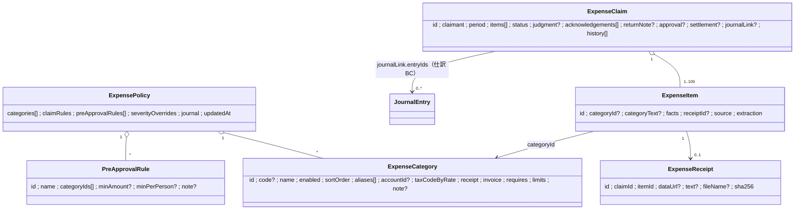
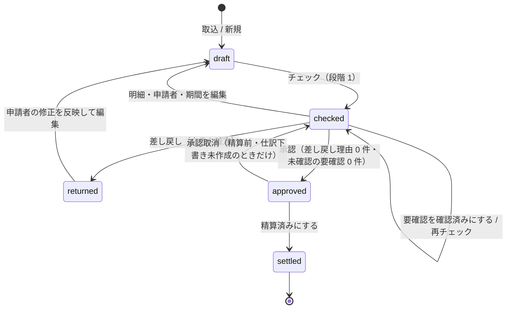
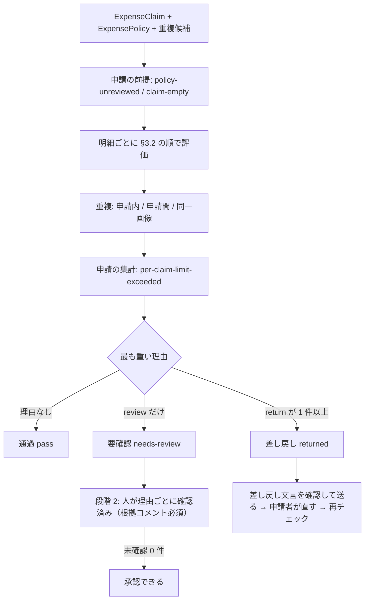
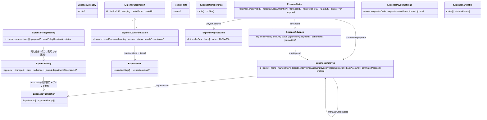
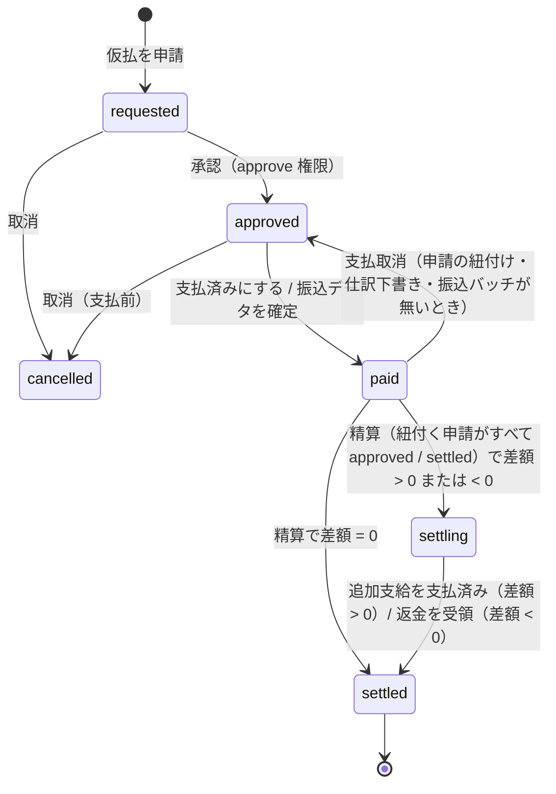
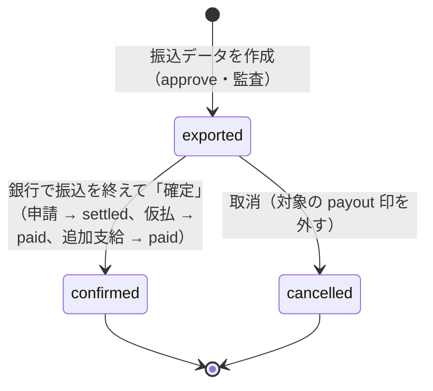
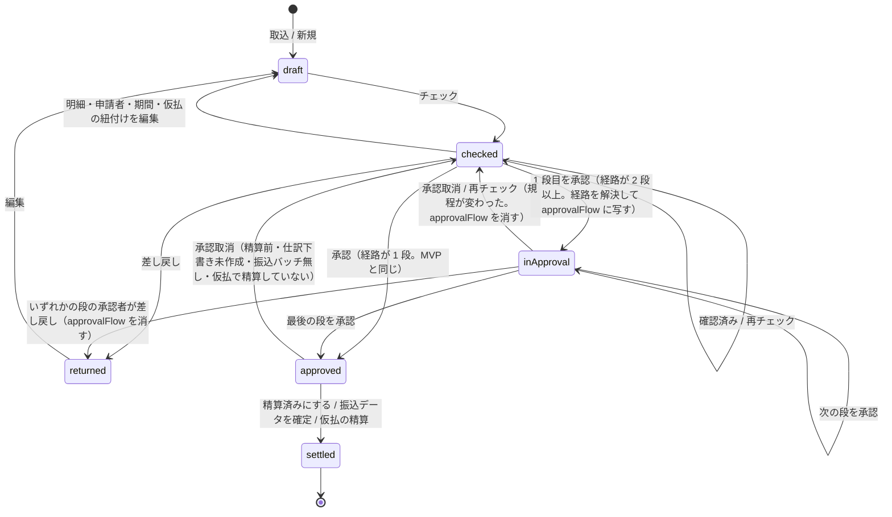

# 21. 経費精算（立替経費の規程チェック・承認・精算）

従業員が立て替えた経費（領収書・レシート）を**会社の規程**に照らしてチェックし、**通過 / 要確認 / 差し戻し** の判定を出し、人が承認して精算 CSV と仕訳下書きへ流す機能。

入口は仕訳と同じくサイドバー「作る」の **業務テンプレート**（`#/templates`）で、画面は独立した `#/expense`（画面 ID `Expense`）。業務を業務別ファイルだけで足す登録点（[ADR-0039](./adr/0039-business-feature-registration.md)）に乗せる業務の 1 つで、仕訳（[20-journal.md](./20-journal.md)）の設計の型をそのまま踏襲する。

- 関連: [ADR-0040](./adr/0040-expense-policy-check.md)（規程チェックの判定モデル）/ [ADR-0038](./adr/0038-journal-two-stage-judgment.md)（仕訳の 2 段階判定）/ [ADR-0039](./adr/0039-business-feature-registration.md)（業務の登録点）
- 設計根拠: 国税庁 交際費等（飲食費）の 1 人当たり 10,000 円基準（令和 6 年度改正）、適格請求書 Q&A（帳簿のみ保存で仕入税額控除が認められる取引: 3 万円未満の公共交通機関・出張旅費等）、電子帳簿保存法の電子取引データ保存の検索要件（取引年月日・取引金額・取引先）。URL は本書末尾。

## 1. 目的とスコープ

| 目的 | 内容 |
|---|---|
| 規程 | 費目ごとの上限（1 件 / 1 申請 / 1 人あたり / 1 日・1 泊あたり）、証憑とインボイスの要否、目的・参加人数の必須、事前承認が要る条件、理由コードごとの重さ。**すべてワークスペースのデータ**で、数値は利用者が編集する（§5） |
| 取込 | 3 系統: **画像 / PDF**（仕訳の読取ユースケースを再利用）、**手入力**、**CSV**（汎用の経費明細 CSV、列名の別名で自動対応） |
| 判定 | **段階 1**: 決定的なチェック（純粋関数）で明細ごと・申請ごとに理由コードを出し、最も重い理由で「通過 / 要確認 / 差し戻し」を決める。**段階 2**: 人が要確認の理由を 1 件ずつ「確認済み（根拠コメント）」にするか、差し戻しへ格上げする（§3, §7） |
| 承認 | 人が画面で押す。差し戻しの理由が残る申請・未確認の要確認が残る申請は承認できない（§7） |
| 出力 | **精算 CSV**（振込用の申請者別合計 / 明細）と、承認済み申請の **仕訳下書き**（費用 / 未払金。仕訳側の `SaveJournalEntryUseCase` へポート経由で渡す。§8, §9） |
| ツール化 | **参照のみ**の組込みツール 3 本（`expense_check_receipt` / `expense_claims` / `expense_policy`）。判定の保存・承認・差し戻し・出力はツールにしない（§13.4） |

**規程は固定しない**（仕訳の科目体系と同じ方針）。費目・上限・必須項目・事前承認条件・理由コードの重さはワークスペース単位のマスタで、初期テンプレート（§5.3）は初期値に過ぎない。交際費の「1 人 10,000 円以下」も初期値として入れるだけで、コードに数値を持たない。費目は **id** で参照し、名称変更に追従する。削除は論理（`enabled: false`）。

### 1.1 MVP（今回実装する範囲）

仕訳の初回〜2 回目のコミット（`470b46b` / `33fd84a`）程度の規模を目安にする。

| 区分 | MVP に入れる | 後回し（§16） |
|---|---|---|
| 規程 | 規程の取得 / 全体保存 / 初期テンプレートへ戻す、費目 CSV の取込 / 出力、理由コードの重さの上書き | **ヒアリングによる規程生成**（社内規程の文書や質問への回答から規程案を作る）、規程の版管理（申請時点の規程で再判定）（→ ヒアリングは §20 UC9 で設計） |
| 取込 | 画像 / PDF（仕訳の `ExtractJournalDocumentUseCase` を composition で注入）、手入力、汎用 CSV（列名の別名で自動対応、行単位で読み飛ばし） | 経費精算専用の抽出プロンプト（参加人数・目的の読取）、カード明細との突合、交通系 IC 履歴、電子取引データ（メール添付 PDF）の自動取込（→ 専用の追加読取は §20 UC7、カード明細は §20 UC5 で設計） |
| 判定 | §4 の全理由コード、重複検出（申請内・申請間・同一画像）、電帳法の検索要件 | 経路検索による交通費の妥当性、為替換算、仮払金の精算、按分（→ 交通費は運賃マスタ照合として §20 UC8、仮払金は §20 UC4 で設計） |
| 承認 | 要確認の確認済み化、差し戻し（申請者向け文言つき）、承認、承認取消 | 多段承認（部門長 → 経理）、承認経路の規程化、申請者本人のログインと提出（→ 多段承認と承認経路は §20 UC2 で設計） |
| 出力 | 精算 CSV（申請者別合計 / 明細）、精算済みの印、仕訳下書きの作成 | 全銀協フォーマット、給与システム連携、仕訳下書きの取り消し連動（→ 全銀協フォーマットは §20 UC3 で設計） |
| ツール | `expense_check_receipt` / `expense_claims` / `expense_policy`（すべて read-only） | 画面の絞り込みから用途別ツールを作る（仕訳 §14.2 相当）、ツールへの引数（費目・人数）の受け渡し（→ 追加ツールは §20.11 で設計） |

## 2. 概念モデル



集約は 3 つ。**規程**（ワークスペースに 1 つ）、**申請**（明細を内包）、**証憑本体**（申請から分離。画像 data URL を申請の一覧・判定で読み込まないため）。形は仕訳と同じく「domain の型 = UI の DTO と同型（`tenant` を除く）」で、`create*` が不変条件を課し、`serialization.ts` が zod で形だけを見て `create*` を通す。

### 2.1 識別子（`src/domain/expense/ids.ts`）

ADR-0034 の Flavor パターン: `ExpenseClaimId` / `ExpenseItemId`（申請内で一意）/ `ExpenseReceiptId` / `ExpenseCategoryId` / `PreApprovalRuleId`。実行時表現は素の文字列。

### 2.2 ExpenseClaim（申請）

| 項目 | 内容 |
|---|---|
| `claimant` | `{ name, employeeCode?, department? }`。申請者（従業員）。**ログイン主体（Principal）とは限らない**（MVP は経理担当が代理で取り込む）。`name` は必須・前後空白除去 |
| `period` | `{ from, to }`（`YYYY-MM-DD`、`from <= to`、最長 366 日）。申請期間 |
| `title` | 任意（例「2026 年 9 月 立替精算」） |
| `items[]` | 1〜100 件（下書きは 0 件可。0 件は判定で `claim-empty`） |
| `status` | §2.5 |
| `judgment` | 直近の判定結果（§3.3 `StoredClaimJudgment`）。明細・規程の変更で古くなる（`judgment.policyUpdatedAt` と `itemsFingerprint` で検出） |
| `acknowledgements[]` | 要確認の確認済み: `{ itemId?, code, note（必須・1〜500 字）, by（subject）, at }` |
| `returnNote` | 差し戻し: `{ message（申請者向け文言。既定は理由コードの文言から組み立て、人が編集できる）, reasons[]（その時点の理由の写し）, by, at }` |
| `approval` | `{ by, displayName?, at, comment? }` |
| `settlement` | `{ settledAt, by, exportFileName? }` |
| `journalLink` | `{ entries: [{ itemId, entryId }], draftedAt, by, warnings[] }` |
| `history[]` | `{ type: 'created' \| 'edited' \| 'checked' \| 'acknowledged' \| 'returned' \| 'approved' \| 'unapproved' \| 'settled' \| 'journal-drafted', by?, at, note? }`（最大 200 件。溢れたら古いものから落とし、監査ログ側に正本がある） |
| `submittedBy` | 取り込んだ主体の `subject` |
| `createdAt` / `updatedAt` | ISO 日時 |

### 2.3 ExpenseItem（明細 = 1 証憑）

| 項目 | 内容 |
|---|---|
| `categoryId` / `categoryText` | 費目 id。解決できなかったときは取込時の文字列を `categoryText` に残す（`category-missing` の文言に使う） |
| `facts` | **ReceiptFacts**（§2.4）。判定はここだけを見る |
| `receiptId` | 証憑本体（`ExpenseReceipt`）への参照。手入力・CSV で証憑が無ければ undefined |
| `source` | `{ type: 'image' \| 'pdf' \| 'manual' \| 'csv-row', fileName?, row?（CSV の生値） }` |
| `extraction` | `{ method: 'llm' \| 'manual' \| 'csv', model?, confidence?, warnings[], documentKind?（読取時の仕訳 `DocumentKind` の写し）, rejectedRegistrationNumber?（形の合わない登録番号の生の文字列。§6.1 の変更要求 R-1 が入るまでは undefined） }` |

### 2.4 ReceiptFacts（正規化済み事実）

金額は **税込整数（円）**、日付は `YYYY-MM-DD`。無いものは undefined。**値を推測で埋めない**（仕訳 §6 と同じ）。

| フィールド | 型 | 由来 / 備考 |
|---|---|---|
| `transactionDate` | date | 取引日。**期間・提出期限・重複・経過措置の判定はこの値だけを使う**（読取側が発行日で代用した場合は、その警告が `receipt-extraction-warning` として残る。§6.1） |
| `issueDate` | date | 発行日（参考。判定の日付には使わない — 取り違えの実測があるため） |
| `payeeName` | string | 支払先（店舗・事業者）。仕訳の `issuerName` に対応。**電帳法の検索要件「取引先」** |
| `registrationNumber` | `T` + 13 桁 | 正規化は仕訳 domain の `normalizeRegistrationNumber` |
| `amount` | integer > 0 | 税込の支払額。**電帳法の検索要件「取引金額」** |
| `totalsByRate[]` | 仕訳の `TotalsByRate` と同形 | 仕訳下書きの税率別の行に使う。無ければ全額を費目の既定税率で扱う |
| `paymentMethod` | 仕訳の `PaymentMethod` と同じ値域 | `nonReimbursablePaymentMethods` の判定に使う |
| `corporatePayment` | boolean | 会社払い（法人カード・会社の口座から支払済み）。`PaymentMethod` では個人カードと法人カードを区別できないため別に持つ。true なら `payment-not-reimbursable` |
| `description` | string | 品目・但し書き |
| `purpose` | string | 目的・用途（誰と何のために） |
| `attendees` | `{ count?: integer ≥ 1, names?: string[], relation?: string }` | 飲食費の参加人数・参加者（氏名 / 社名と関係） |
| `unitCount` | integer ≥ 1 | 日数・泊数（費目に `limits.perUnit` があるとき） |
| `preApprovalRef` | string | 事前承認の番号・記録（稟議番号など） |
| `dateSource` | `'read' \| 'manual' \| 'issue-copied'` | 読取値のまま / 人が入力・修正した / 画面の「発行日を取引日にする」で写した。`issue-copied` は明細 CSV（§9 `detail`）にも出し、経過措置の判定根拠を後から追えるようにする |

`validateReceiptFacts` が不変条件（日付の実在・整数・登録番号の形・人数 ≥ 1）を課す。形の合わない登録番号は保存時に 400 にせず、仕訳と同じく**落として警告**を `extraction.warnings` に残す（手入力でも同じ規則）。

### 2.5 状態遷移



| 遷移 | 関数（`src/domain/expense/claim.ts`。すべて純粋で新しい値を返す） | 拒否条件（`ExpenseTransitionError` 409） |
|---|---|---|
| 編集 | `editClaim(claim, patch, by, at)` | `approved` / `settled` は編集不可（承認取消が先）。`checked` / `returned` を編集すると `draft` へ戻し `judgment` / `acknowledgements` を落とす |
| チェック | `withJudgment(claim, judgment, at)` | `approved` / `settled` は再チェックしない（結果は見せるが保存しない） |
| 確認済み | `acknowledge(claim, { itemId?, code, note }, by, at)` | `checked` 以外。該当する `review` 理由が判定に無い。`note` が空 |
| 差し戻し | `returnClaim(claim, message, by, at)` | `checked` 以外。`message` が空 |
| 承認 | `approveClaim(claim, policy, by, at, comment?)` | `checked` 以外 / 判定が古い（`isJudgmentStale`）/ `return` 理由が 1 件でもある / 未確認の `review` 理由がある / `policy.claimRules.forbidSelfApproval` かつ `by === submittedBy` |
| 承認取消 | `unapproveClaim(claim, by, at, note)` | `approved` 以外 / `journalLink` あり / `settlement` あり |
| 精算済み | `markSettled(claim, by, at, fileName?)` | `approved` 以外（`settled` は冪等） |
| 仕訳連携 | `withJournalLink(claim, link, by, at)` | `approved` / `settled` 以外 / 既に `journalLink` あり |

`isJudgmentStale(claim, policy)`: `judgment.policyUpdatedAt !== policy.updatedAt` または `judgment.itemsFingerprint !== fingerprint(claim)`（明細の facts・費目・申請者・期間を正規化 JSON にした SHA-256 ではなく、**domain で計算できる安定な文字列連結のハッシュ**。domain は `node:crypto` を使わない）。

### 2.6 ExpenseReceipt（証憑本体）

`{ tenant, id, claimId, itemId, source: { type: 'image' | 'pdf', fileName?, mime?, dataUrl（画像。PDF はブラウザでページ画像化したもの）, text?（PDF のテキスト層） }, sha256, createdAt }`。1 件 8 MiB 上限（仕訳の `DOCUMENT_PAYLOAD_MAX_BYTES` と同じ値を expense 側の定数として持つ）。`sha256` は application 層が画像のバイト列から計算して渡す（同一画像の重複検出 `duplicate-receipt-image` に使う）。**申請を削除したら証憑本体も削除**する。電帳法の保存期間（7 年等）の管理は MVP では持たない（§17 リスク）。

### 2.7 層とファイル

| 層 | ファイル | 責務 |
|---|---|---|
| domain | `src/domain/expense/ids.ts`, `errors.ts`, `receipt-facts.ts`, `policy.ts`, `default-policy.ts`, `claim.ts`, `reason-codes.ts`, `check.ts`, `duplicates.ts`, `journal-draft.ts`, `settlement-csv.ts`, `claim-csv.ts`, `repositories.ts`, `serialization.ts` | 型・不変条件・純粋関数（判定・重複キー・仕訳下書き・CSV の行組み立て）。依存は `domain/shared` と、**仕訳 domain の純関数・値型だけ**（§2.8） |
| application | `src/application/expense/manage-policy.ts`, `policy-transfer.ts`, `manage-claims.ts`, `import-csv.ts`, `extract-receipt.ts`（`ReceiptReaderPort`）, `check-claims.ts`, `review-claims.ts`（確認済み・差し戻し・承認・承認取消）, `export-settlement.ts`, `draft-journal-entries.ts`（`JournalDraftSink`）, `receipt-check-rows.ts`, `claim-rows.ts`, `policy-rows.ts`, `capabilities.ts`, `errors.ts` | ユースケース。ポートを定義し、実装は composition が注入 |
| adapters | `src/adapters/storage/expense-migrations.ts`（`EXPENSE_STATEMENTS` / `EXPENSE_MIGRATION` = version 6）, `sqlite-expense-repositories.ts`, `in-memory-expense-repositories.ts`, `expense-*-repository.contract.ts`, `expense-repository.fixtures.ts` | 永続化と共有契約 |
| api | `src/api/expense-routes.ts`（`registerExpenseRoutes` / `ExpenseRouteDeps` / `expenseRuntimeCapabilities`）, `expense-authorization.ts`（`EXPENSE_ROUTE_RULES`）, `expense-error-mapping.ts`（`expenseHttpError`）, `expense-schemas.ts` | REST・認可・エラー写像・入力スキーマ |
| etl | `src/domain/etl/nodes/expense-nodes.ts`（`registerExpenseNodes`）と `expense-receipt-check.ts`, `expense-claims-source.ts`, `expense-policy-source.ts`。行ソースの宣言は `src/application/expense/row-sources.ts`（`expenseRowSources(ports)`） | ツール用ソースノード（固定スキーマ。実行直前に行ソースが書き換える） |
| composition / 組込みツール | `src/composition/expense.ts`（`composeExpense(context)` → `{ feature: ExpenseAppFeature, rowSources }`。App のキーは `expense` で始める）, `src/builtin-tools/expense.ts`（`EXPENSE_BUILTIN_TOOLS` と `EXPENSE_*_TOOL_ID`） | 仕訳ユースケースへの橋渡し（`ReceiptReaderPort` / `JournalDraftSink` の実装）を**ここだけ**で行う（§18.1 S-1） |
| ui | `src/ui/expense/expense-business.ts`（`expenseBusiness`。完成したら `listed: true`）, `ExpensePage.tsx`（`BusinessStepper` を使う）, `expense.css`（クラスは `expense-`）, `PolicyTab.tsx`, `IngestTab.tsx`, `CheckTab.tsx`, `ApproveTab.tsx`, `SettleTab.tsx`, `expense-model.ts`, `expense-shared.tsx`、`src/ui/api/expense-api.ts`（`expenseApi(transport)`）, `expense-types.ts`, `expense-error-messages.ts`（`EXPENSE_ERROR_MESSAGES`） | 画面・API クライアント・エラー見出し |

ファイル名と export 名は ADR-0039 の表に従う。共有ファイル（`root.ts` / `server.ts` / `authorization.ts` / `error-mapping.ts` / `migrations.ts` / `nodes/index.ts` / `resolve-data-source-graph.ts` / `row-sources.ts` / `builtin-tools.ts` / `App.tsx` / `TemplatesPage.tsx` など）と他業務のファイルは触らない。唯一の例外要求は §18.1 S-1。

### 2.8 仕訳 BC との依存の向き

- **expense → journal の一方向のみ**。journal は expense を一切 import しない。
- expense **domain** が import してよいのは仕訳 domain の**純関数と値型だけ**: `normalize.ts`（`normalizeRegistrationNumber` / `normalizeDescription` / `parseJapaneseDate` / `parseAmount`）、`document.ts` の `isIsoDate` / `REGISTRATION_NUMBER_PATTERN` / `PaymentMethod` / `TotalsByRate` 型、`tax.ts`（`resolveInvoiceStatus` / `transitionalDeductionRate` / `taxCodeForTransitional` / `splitTotalsByRate`）、`csv.ts`（`parseCsv` / `toCsv` / `stripBom` / `rowToRecord`）。これらは将来 `domain/shared` 側へ移す候補で、移しても expense 側は import 先を変えるだけで済む。
- expense **application** は仕訳の application を import しない。仕訳の読取・仕訳保存は **ポート**（`ReceiptReaderPort` / `JournalDraftSink`）越しに使い、実装は composition が仕訳ユースケースを包んで注入する。

## 3. 判定（通過 / 要確認 / 差し戻し）



### 3.1 2 段階の意味

- **段階 1（決定的チェック）**: `checkClaim(input)`（`src/domain/expense/check.ts`）は **申請・規程・重複候補・時刻だけを引数に取る純粋関数**。モデル呼び出しも I/O も無い。同じ入力からは必ず同じ判定が出る（ADR-0038 の Stage 1 と同じ土台）。
- **段階 2（人の確認）**: 要確認（`review`）の理由は「規程上は人の判断が要る」ことの表明で、承認者が 1 件ずつ**確認済み（根拠コメント）**にするか、差し戻しへ回す。差し戻し（`return`）の理由は確認済みにできない（申請者が直して再チェックするしかない）。**LLM は判定に関与しない**（読取だけ。§6）。
- 確認済みは判定結果を書き換えない（`verdict` は `needs-review` のまま）。承認の可否は `acknowledgements` と突き合わせて決める。明細を直して再チェックすると確認済みは消える（別の事実に対する確認だったため）。

### 3.2 評価順と打ち切り

明細は `items[]` の順、1 明細の中は下表の順で評価し、理由もこの順に並べる（画面は根本の原因から見せる）。前提が欠けたときは**依存するチェックを打ち切る**（「金額が無い」明細に上限超過なしと出すと、通ったように見えるため）。

| 順 | グループ | コード | 打ち切り |
|---|---|---|---|
| 0 | 申請の前提 | `policy-unreviewed`, `claim-empty` | `claim-empty` なら明細の評価なし |
| 1 | 費目 | `category-missing`, `category-unknown` | どちらかが出たら費目に依存する 2 の目的・3 の証憑要否・5 のインボイス要否・6 を飛ばす。費目を指定しない事前承認条件（7）は評価する |
| 2 | 必須項目（電帳法の検索要件を含む） | `amount-missing`, `date-missing`, `payee-missing`, `purpose-missing` | `amount-missing` なら 3 の閾値と不一致・5 の閾値・6・7 の金額条件・8 を飛ばす（閾値のある要否は「必要」とみなす）。`date-missing` なら 4 と 8 を飛ばす |
| 3 | 証憑 | `receipt-missing`, `receipt-extraction-warning`, `receipt-amount-mismatch` | — |
| 4 | 日付 | `date-in-future`, `date-outside-period`, `submission-late` | `date-in-future` が出たら他の期間系は出さない |
| 5 | 支払方法・インボイス | `payment-not-reimbursable`, `registration-number-missing` | — |
| 6 | 規程の上限 | `per-item-limit-exceeded`, `attendees-missing`, `per-person-limit-exceeded`, `attendee-details-missing`, `unit-count-missing`, `per-unit-limit-exceeded` | `attendees-missing` なら `per-person-limit-exceeded` を、`unit-count-missing` なら `per-unit-limit-exceeded` を飛ばす |
| 7 | 事前承認 | `pre-approval-missing` | — |
| 8 | 重複 | `duplicate-in-claim`, `duplicate-across-claims`, `duplicate-receipt-image` | — |
| 9 | 申請の集計 | `per-claim-limit-exceeded` | 金額のある明細だけで費目別に合計 |

### 3.3 型

```ts
type Severity = 'review' | 'return';
type Verdict = 'pass' | 'needs-review' | 'returned';
/** 電帳法の検索要件のどれに当たるか（当たらない理由は undefined）。 */
type SearchKey = 'date' | 'amount' | 'payee';

interface CheckReason {
  readonly code: ExpenseReasonCode;          // §4 の列挙（REASON_CODES as const）
  readonly severity: Severity;               // 規程の severityOverrides を反映済み
  readonly itemId?: string;                  // 申請単位の理由は undefined
  readonly params: Readonly<Record<string, string | number | boolean | null>>; // 文言の差し込み値
  readonly searchKey?: SearchKey;
}
interface ItemCheck { readonly itemId: string; readonly verdict: Verdict; readonly reasons: readonly CheckReason[] }
interface ClaimJudgment {
  readonly verdict: Verdict;
  readonly items: readonly ItemCheck[];
  readonly claimReasons: readonly CheckReason[];
  readonly totals: { readonly amount: number; readonly byCategory: readonly { readonly categoryId: string; readonly amount: number }[] };
  /** 全明細で取引年月日・取引金額・取引先が揃っているか（電帳法の検索要件）。 */
  readonly searchKeysComplete: boolean;
}
/** 申請へ保存する形。古さの検出に使う指紋と時刻を足す。 */
type StoredClaimJudgment = ClaimJudgment & { readonly policyUpdatedAt: string; readonly itemsFingerprint: string; readonly checkedAt: string };

interface CheckClaimInput {
  readonly claim: ExpenseClaim;
  readonly policy: ExpensePolicy;
  /** 規程が保存済みか（未保存 = 初期テンプレートのまま）。 */
  readonly policySaved: boolean;
  /** 同じ取引日 x 金額、または同じ画像ハッシュを持つ他の申請の明細（application が索引で集める。§12）。 */
  readonly duplicateCandidates: readonly DuplicateCandidate[];
  /**
   * 判定日（YYYY-MM-DD）。application が業務のタイムゾーン（既定 Asia/Tokyo）で求めて渡す。
   * `Date#toISOString()` の UTC 日付にすると、日本時間 0〜9 時に当日のレシートが `date-in-future` になる。
   */
  readonly today: string;
}
interface DuplicateCandidate {
  readonly claimId: string; readonly itemId: string; readonly claimStatus: ClaimStatus; readonly claimantName: string;
  readonly payeeKey?: string; readonly transactionDate?: string; readonly amount?: number; readonly receiptSha256?: string;
}
```

### 3.4 重複の鍵

`duplicateKey(item)`（`src/domain/expense/duplicates.ts`。純粋）:

- **強い鍵**: `payeeKey | transactionDate | amount`。`payeeKey` は仕訳の `normalizeDescription`（NFKC・法人略号除去・空白圧縮）をさらに空白除去・小文字化したもの。「サンプルマート 霞が関店」と半角カナ表記は同じ鍵になる。
- **弱い鍵**: 支払先が無いとき `transactionDate | amount | categoryId`。精算書の読取で支払先が空になる実測があるため、弱い鍵の一致は重さの設定に関係なく**常に `review`**（誤って差し戻さない）。
- **同一画像**: `ExpenseReceipt.sha256` の一致。鍵の組が違っても出す（同じレシートを別費目で二重申請する型）。
- 申請間の一致で相手の申請が `draft` のときは `review` に下げる（同じファイルを 2 回取り込んだだけのことが多い）。相手が `checked` / `returned` / `approved` / `settled` なら規程の重さ（既定 `return`）。
- 金額の許容差は持たない（1 円違いは別の取引。端数の違う二重申請は画像ハッシュか人の目で拾う）。

### 3.5 1 人あたり・日数あたりの計算

- 1 人あたり超過は**割り算をしない**: `basisAmount > limit * 人数` のとき超過（端数処理の揺れを避ける）。
- `basisAmount` は費目の `limits.perPersonBasis` で決める: `tax-included`（既定）は `amount`、`tax-excluded` は仕訳の `splitTotalsByRate` で税額を除いた額（税抜経理の会社向け）。税率別の内訳が無く税抜にできないときは税込で判定し、`params.basisFallback = true` を文言に出す（黙って税込にしない）。
- 人数に申請者自身を含めるかは `claimRules.attendeesIncludeClaimant`（既定 `true` = 入力された人数に申請者も含む）。`false` なら `count + 1` を人数にする。
- 日当・宿泊は `amount > limits.perUnit.amount * unitCount` で超過。単位の表示名（日・泊）は費目のデータ（`limits.perUnit.label`）で、コードは単位の種類を知らない。

## 4. 理由コード（完全な列挙）

`src/domain/expense/reason-codes.ts` に `REASON_CODES`（`as const`、27 件）と、コードごとの **対象（明細 / 申請）・既定の重さ・上書きできる値・検索要件・導線先** を持つ `REASON_CATALOG` を置く。利用者向けの文言は画面（`src/ui/expense/expense-model.ts` の `summarizeCheck`。日英）と、申請者向け・ツール向けの日本語（`src/application/expense/reason-messages.ts`）の 2 か所にあり、**両方が全コードを網羅していることをテストで固定する**（§15）。

「重さ」: **差** = 差し戻し（`return`）/ **要** = 要確認（`review`）。「変更可」は規程の `severityOverrides` で選べる値（`off` = 出さない）。「—」は変更不可。

導線先（`ExpenseFixTarget`）: `item`（明細の編集フォーム、該当項目へフォーカス）/ `item-category`（明細の費目選択）/ `receipt`（証憑の画像ビューア）/ `policy-category`（規程の費目の該当行）/ `policy-rules`（規程の申請ルール）/ `policy-pre-approval`（事前承認条件）/ `policy-save`（規程タブの保存ボタン）/ `other-claim`（重複相手の申請）。ディープリンクは `OpenTarget { internalId: <claimId | categoryId>, section: 'claim' | 'item:<itemId>' | 'receipt:<itemId>' | 'category' | 'rules' | 'pre-approval' }`。

### 4.1 申請の前提・集計

| コード | 既定 | 変更可 | 原因（画面） | 直し方（画面） | 導線 | 申請者向け（差し戻し文言の既定） |
|---|---|---|---|---|---|---|
| `policy-unreviewed` | 要 | off | 規程が初期テンプレートのまま保存されていません。上限額などが自社の規程と違う可能性があります | 規程ステップで費目と上限額を確認して「保存」を押し、もう一度チェックしてください | 規程を開く（`policy-save`） | （経理側の問題なので差し戻し文言に含めない） |
| `claim-empty` | 差 | — | この申請には明細がありません | 取込ステップで領収書か明細を追加してください | 取込を開く（`item`） | 明細が 1 件もありません。精算する領収書を添付してください |
| `per-claim-limit-exceeded` | 差 | 要 / 差 | 費目「{category}」の申請内合計 {total} 円が上限 {limit} 円を {over} 円超えています | 規程の上限が正しいか確認し、正しければ申請者へ差し戻してください | 規程の費目を開く（`policy-category`） | 「{category}」の合計が 1 回の申請の上限 {limit} 円を超えています。対象の明細を見直してください |

### 4.2 明細: 費目・必須項目（電帳法の検索要件）

| コード | 検索要件 | 既定 | 変更可 | 原因（画面） | 直し方（画面） | 導線 | 申請者向け |
|---|---|---|---|---|---|---|---|
| `category-missing` | — | 差 | 要 / 差 | 費目が決まっていません（取込時の値「{categoryText}」に一致する費目がありません） | 明細の費目を選んでください。いつも同じ書き方なら、規程の費目の「別名」に「{categoryText}」を足すと次から自動で当たります | 費目を選ぶ（`item-category`）/ 規程の費目を開く（`policy-category`） | 明細「{description}」が何の費用か分かりません。用途（交通費・会議費など）を記入してください |
| `category-unknown` | — | 差 | — | 費目「{categoryId}」が規程に無いか、無効になっています | 別の費目を選び直すか、規程でその費目を有効に戻してください | 費目を選ぶ（`item-category`）/ 規程の費目を開く（`policy-category`） | （経理側の問題なので既定文言には含めない） |
| `amount-missing` | 金額 | 差 | — | 金額がありません（0 円以下も含む）。電子帳簿保存法の検索要件「取引金額」を満たしません | 領収書を見て税込の支払額を入力してください | 金額を入力（`item`）/ 領収書を見る（`receipt`） | 明細「{description}」の金額が読み取れません。金額が見えるように領収書を添付し直してください |
| `date-missing` | 日付 | 差 | — | 取引日がありません{issueDateNote}。電子帳簿保存法の検索要件「取引年月日」を満たしません | 領収書の取引日を入力してください。発行日と同じなら「発行日を取引日にする」を押してください | 取引日を入力（`item`）/ 領収書を見る（`receipt`） | 明細「{description}」の利用日が分かりません。利用日を記入してください |
| `payee-missing` | 取引先 | 要 | 要 / 差 | 支払先（店名・事業者名）がありません。電子帳簿保存法の検索要件「取引先」を満たしません{readerNote} | 領収書の発行者名（店舗名・支店名まで）を入力してください | 支払先を入力（`item`）/ 領収書を見る（`receipt`） | 明細「{description}」の支払先（お店・会社の名前）を記入してください |
| `purpose-missing` | — | 要 | off / 要 / 差 | 費目「{category}」は目的の記入が必要ですが、空欄です | 誰と・何のための支出かを入力してください | 目的を入力（`item`） | 明細「{description}」の目的（誰と・何のために）を記入してください |

`{issueDateNote}` は発行日だけがあるとき「（発行日 {issueDate} はあります）」。`{readerNote}` は読取時の帳票種別が経費精算書・伝票のとき「（精算書・伝票の読取では支払先が空になりやすいため、元の領収書を確認してください）」。

### 4.3 明細: 証憑・日付・支払方法・インボイス

| コード | 既定 | 変更可 | 原因（画面） | 直し方（画面） | 導線 | 申請者向け |
|---|---|---|---|---|---|---|
| `receipt-missing` | 差 | 要 / 差 | 費目「{category}」は {exemptBelow} 円以上で領収書が必要ですが、添付がありません | 領収書の画像を添付してください。領収書が出ない支払い（IC カードなど）の費目なら、規程の費目で「領収書の要否」を見直してください | 画像を添付（`item`）/ 規程の費目を開く（`policy-category`） | 明細「{description}」の領収書を添付してください |
| `receipt-extraction-warning` | 要 | — | 読み取りに注意点があります: {warnings} | 領収書の画像と見比べて、金額・日付・登録番号が正しいか確かめてください。値は自動で直していません | 領収書と並べて開く（`receipt`） | （確認は経理側で行うので既定文言には含めない） |
| `receipt-amount-mismatch` | 要 | 要 / 差 | 税率別の内訳の合計 {sum} 円が金額 {amount} 円と {diff} 円ずれています（許容 {tolerance} 円） | どちらかの読み取り・入力の誤りです。領収書を見て正しい方に直してください | 領収書と並べて開く（`receipt`） | 明細「{description}」の金額と内訳が合いません。領収書の合計金額を確認してください |
| `date-in-future` | 差 | — | 取引日 {date} が今日より後です | 取引日の入力（年の打ち間違い・和暦の換算）を確認してください | 取引日を入力（`item`） | 明細「{description}」の利用日 {date} が未来の日付です。正しい日付を記入してください |
| `date-outside-period` | 差 | 要 / 差 | 取引日 {date} が申請期間 {from}〜{to} の外です | 申請期間を直すか、この明細を該当期間の申請へ移してください | 申請の期間を編集（`item`） | 明細「{description}」（{date}）は今回の精算期間 {from}〜{to} の対象外です。該当する期間の申請で出してください |
| `submission-late` | 要 | off / 要 / 差 | 取引日 {date} から取込まで {days} 日経っています（規程の期限 {limitDays} 日） | 遅れの理由を確認し、認めるなら確認済みにしてください | 規程の申請ルールを開く（`policy-rules`） | 明細「{description}」は提出期限（利用日から {limitDays} 日）を過ぎています。遅れた理由を記入してください |
| `payment-not-reimbursable` | 差 | 要 / 差 | 支払方法「{paymentMethod}」は立替精算の対象外です（会社のカード等は会社側の明細から計上されるため二重計上になります） | 支払方法の入力を確認し、会社払いならこの明細を削除してください | 支払方法を入力（`item`）/ 規程の申請ルールを開く（`policy-rules`） | 明細「{description}」は会社のカード等で支払われているため精算できません。立替えた場合は支払方法を訂正してください |
| `registration-number-missing` | 要 | off / 要 / 差 | 登録番号（T + 13 桁）がありません{rawNote}。適格請求書でなければ、仕入税額控除は取引日 {date} 時点の経過措置（{deductionRate}%）になります | 領収書に登録番号があれば入力してください。無ければ相手が免税事業者か確認して確認済みにしてください。登録番号の要らない費目（3 万円未満の公共交通機関など）なら規程の費目で設定を見直してください | 登録番号を入力（`item`）/ 領収書を見る（`receipt`）/ 規程の費目を開く（`policy-category`） | 明細「{description}」の領収書に登録番号（T から始まる番号）が見当たりません。インボイス対応の領収書があれば添付し直してください |

`{rawNote}` は読取で形の合わない番号を落としたとき「（読み取った「{raw}」は数字 {digits} 桁のため採用していません）」。登録番号の桁数誤りは実測で最も多い失敗なので、**落とした生の文字列を必ず見せる**（読取の警告文から `extraction.rejectedRegistrationNumber` に写しておく。§6.1）。

### 4.4 明細: 規程の上限・事前承認

| コード | 既定 | 変更可 | 原因（画面） | 直し方（画面） | 導線 | 申請者向け |
|---|---|---|---|---|---|---|
| `per-item-limit-exceeded` | 差 | 要 / 差 | 費目「{category}」の 1 件上限 {limit} 円を {over} 円超えています（{amount} 円） | 規程の上限が正しいか確認してください。例外として認める運用なら、重さを「要確認」に変えるか事前承認条件で扱ってください | 規程の費目を開く（`policy-category`） | 明細「{description}」は「{category}」の 1 件あたりの上限 {limit} 円を超えています。事前承認があれば番号を記入してください |
| `attendees-missing` | 差 | 要 / 差 | 費目「{category}」は参加人数の記入が必要ですが、空欄です | 参加人数を入力してください（申請者を含めるかは規程の申請ルールに従う） | 参加人数を入力（`item`） | 明細「{description}」の参加人数を記入してください |
| `per-person-limit-exceeded` | 差 | 要 / 差 | 1 人あたり {perPerson} 円（{basis}、{count} 人）が費目「{category}」の基準 {limit} 円を超えています{basisFallbackNote} | 人数の入力を確認してください。基準を超える飲食費は交際費になるため、費目を変える必要がないか確認してください | 参加人数を入力（`item`）/ 費目を選ぶ（`item-category`）/ 規程の費目を開く（`policy-category`） | 明細「{description}」は 1 人あたり {limit} 円の基準を超えています。参加人数と費目が正しいか確認してください |
| `attendee-details-missing` | 要 | off / 要 / 差 | 費目「{category}」は参加者の氏名（社名）と関係の記入が必要ですが、{missing} がありません | 参加者の氏名または社名と、自社との関係（取引先・社内など）を入力してください | 参加者を入力（`item`） | 明細「{description}」の参加者（お名前・会社名）と関係を記入してください |
| `unit-count-missing` | 差 | 要 / 差 | 費目「{category}」は{unitLabel}数の記入が必要ですが、空欄です | {unitLabel}数を入力してください | {unitLabel}数を入力（`item`） | 明細「{description}」の{unitLabel}数を記入してください |
| `per-unit-limit-exceeded` | 差 | 要 / 差 | 1 {unitLabel}あたり {perUnit} 円が上限 {limit} 円を超えています（{amount} 円 / {unitCount} {unitLabel}） | {unitLabel}数の入力と規程の上限を確認してください | {unitLabel}数を入力（`item`）/ 規程の費目を開く（`policy-category`） | 明細「{description}」は 1 {unitLabel}あたりの上限 {limit} 円を超えています |
| `pre-approval-missing` | 差 | 要 / 差 | 事前承認の条件「{ruleName}」に当たりますが、事前承認の番号・記録がありません | 事前承認の番号（稟議番号など）を入力してください。条件が広すぎるなら規程の事前承認条件を見直してください | 事前承認番号を入力（`item`）/ 事前承認条件を開く（`policy-pre-approval`） | 明細「{description}」は事前承認が必要な支出です（{ruleName}）。承認番号を記入してください |

### 4.5 明細: 重複

| コード | 既定 | 変更可 | 原因（画面） | 直し方（画面） | 導線 | 申請者向け |
|---|---|---|---|---|---|---|
| `duplicate-in-claim` | 差 | 要 / 差 | この申請の明細「{otherDescription}」と支払先・取引日・金額が同じです{weakNote} | 同じ領収書を 2 回取り込んでいないか確認し、重複ならどちらかを削除してください | 相手の明細を開く（`item`） | 明細「{description}」が同じ申請の中で二重に計上されている可能性があります。重複していれば 1 件にしてください |
| `duplicate-across-claims` | 差 | 要 / 差 | {claimantName} さんの申請 {otherClaimId}（{otherStatus}）の明細と支払先・取引日・金額が同じです{weakNote} | 相手の申請を開き、同じ支出が既に精算されていないか確認してください。別の支出なら確認済みにしてください | 相手の申請を開く（`other-claim`） | 明細「{description}」は過去の申請（{otherClaimId}）と同じ内容です。既に精算済みでないか確認してください |
| `duplicate-receipt-image` | 差 | 要 / 差 | 添付の画像が申請 {otherClaimId} の明細の画像と同じファイルです | 同じ領収書を別の明細・別の申請で使っていないか確認してください | 相手の申請を開く（`other-claim`）/ 領収書を見る（`receipt`） | 明細「{description}」の領収書は別の申請で使われたものと同じ画像です。正しい領収書を添付してください |

`{weakNote}` は弱い鍵（支払先なし）での一致のとき「（支払先が空のため、取引日・金額・費目だけで照合しています）」。

### 4.6 判定の外で扱うもの（理由コードにしない）

- **入力の形の不正**（日付の形・負の人数・101 件目の明細）は `ExpenseDomainError`（400）。直す場所が明確で、判定結果として保存する意味が無い。
- **読取が使えない**（モデル未設定・vision 非対応）は仕訳の `JournalExtractionUnavailableError`（409）をそのまま返す。文言に「何が足りず設定画面のどこで直すか」が入っている（仕訳 §6）。
- **状態遷移の拒否**（差し戻し理由が残る申請の承認など）は `ExpenseTransitionError`（409）。`blockingReasons[]`（コードと明細 id）を持ち、画面は承認ボタンの横に「承認できない理由」と各理由の導線を並べる。
- **仕訳連携の失敗**（費目に科目が無い・科目がマスタで無効）は `ExpenseJournalLinkError`（409。§8）。判定の後の工程なので判定には混ぜない。

## 5. 規程マスタ（ExpensePolicy）

### 5.1 構造

ワークスペースに 1 つ（`src/domain/expense/policy.ts`）。**数値・費目・条件はすべてデータ**で、コードに上限額や費目名の列挙を持たない（`default-policy.ts` の初期テンプレートだけが例外で、そこは初期値に過ぎない）。

| 項目 | 型 | 内容 |
|---|---|---|
| `categories[]` | `ExpenseCategory[]`（最大 200） | 費目（§5.2） |
| `claimRules.submissionDeadlineDays` | integer 1〜3650 / 省略 | 取引日から取込までの期限。省略で `submission-late` を出さない |
| `claimRules.nonReimbursablePaymentMethods` | 仕訳の `PaymentMethod[]` | この支払方法の明細は `payment-not-reimbursable`。明細の `corporatePayment: true` も同じ扱い |
| `claimRules.attendeesIncludeClaimant` | boolean | 入力された参加人数に申請者を含むか（§3.5） |
| `claimRules.forbidSelfApproval` | boolean | 取り込んだ本人（`submittedBy`）の承認を禁じる |
| `preApprovalRules[]` | `{ id, name, enabled, categoryIds[]（空 = 全費目）, minAmount?, minPerPerson?, note? }`（最大 50） | 条件は AND。`categoryIds` が空で金額条件も無い規則は**全明細に当たる**ので作成時に拒否する |
| `severityOverrides` | `{ [code]: 'review' \| 'return' \| 'off' }` | `REASON_CATALOG[code].adjustable` に無い値は拒否（`ExpenseDomainError` にコードと選べる値を載せる） |
| `journal.creditAccountId` | string | 仕訳下書きの貸方科目 id（初期値 `liability.other_payables` = 未払金。立替金・現金へ変えられる） |
| `journal.creditTaxCode` | string | 貸方の税区分コード（初期値 `JP-NA`） |
| `journal.partnerFrom` | `'claimant' \| 'payee'` | 貸方の取引先に申請者名と支払先のどちらを入れるか |
| `journal.descriptionTemplate` | string（最大 200 字） | 摘要。`{claimant}` `{payee}` `{category}` `{purpose}` `{description}` `{claimId}` を置換 |
| `updatedAt` | ISO 日時 | 判定の古さの検出に使う（§2.5） |

### 5.2 ExpenseCategory（費目）

| 項目 | 型 | 内容 |
|---|---|---|
| `id` | `^[a-z0-9_.-]{1,64}$` | 一意。明細・事前承認条件から参照される |
| `code?` / `name` | string | 表示名は有効な費目の中で一意（NFKC・大小無視） |
| `enabled` / `sortOrder` / `note?` | | 削除は論理のみ |
| `aliases[]` | string[] | 読取・CSV の費目文字列から当てる別名。有効な費目の間で重複を拒否（どちらに当てるか決められないため） |
| `accountId?` | string | 仕訳の科目 id。**規程側では存在を検証しない**（科目マスタは仕訳 BC のデータ）。画面は仕訳の科目マスタを読んで選択肢と「マスタに無い」印を出し、仕訳連携の時点で検証する（§8） |
| `defaultTaxRate` | `10 \| 8 \| 0` | 税率別の内訳が無い明細の税率 |
| `taxCodeByRate` | `{ '10'?, '8'?, '0'? }` | 仕訳下書きの借方税区分コード |
| `receipt` | `{ required: boolean, exemptBelow?: integer }` | 領収書の要否。`exemptBelow` 未満は不要 |
| `invoice` | `{ required: boolean, exemptBelow?: integer }` | 登録番号の要否（3 万円未満の公共交通機関など、帳簿のみ保存で足りる取引を利用者が設定する） |
| `requires` | `{ purpose, attendees, attendeeDetails }`（boolean） | 必須項目 |
| `limits` | `{ perItem?, perClaim?, perPerson?, perPersonBasis: 'tax-included' \| 'tax-excluded', perUnit?: { label（1〜4 字）, amount } }` | 金額は 1〜100,000,000 の整数。`perPerson` を使うなら `requires.attendees` が true であること（人数が無いと判定できない） |

費目の当て方 `resolveCategory(policy, text)`（純粋）: 有効な費目の id 完全一致 → 名前 → 別名（NFKC・前後空白除去・小文字化）。複数に当たる・どれにも当たらないときは `undefined`（`category-missing`、取込時の文字列は `categoryText` に残す）。

### 5.3 初期テンプレート（`src/domain/expense/default-policy.ts`）

科目 id は仕訳の標準セット（`default-chart.ts`）の id。**数値はすべて初期値**で、画面の最初の案内は「自社の規程と見比べて保存してください」（保存するまで `policy-unreviewed`）。税区分は全費目 `{ '10': 'JP-IN-10-S', '8': 'JP-IN-8R-S', '0': 'JP-IN-NA' }`。

| id | 名前 | 科目 | 税率 | 領収書 | 登録番号 | 必須 | 上限（初期値） | 備考（`note`） |
|---|---|---|---|---|---|---|---|---|
| `transport.public` | 電車・バス | `expense.travel` | 10 | 不要 | 30,000 円未満は不要 | 目的 | — | 3 万円未満の公共交通機関は帳簿のみ保存で控除可 |
| `transport.taxi` | タクシー | `expense.travel` | 10 | 必要 | 必要 | 目的 | 1 件 10,000 | |
| `travel.long` | 新幹線・航空券 | `expense.travel` | 10 | 必要 | 必要 | 目的 | — | |
| `travel.lodging` | 宿泊費 | `expense.travel` | 10 | 必要 | 必要 | 目的 | 1 泊 12,000 | |
| `travel.per_diem` | 日当 | `expense.travel` | 10 | 不要 | 不要 | 目的 | 1 日 3,000 | 出張旅費規程に基づく支給は帳簿のみ保存で控除可 |
| `meal.meeting` | 会議費（打合せの飲食） | `expense.meetings` | 10 | 必要 | 必要 | 目的・人数 | — | 1 人あたりの基準を決めている会社は上限を入れる |
| `meal.entertainment` | 交際費（接待の飲食） | `expense.entertainment` | 10 | 必要 | 必要 | 目的・人数・参加者 | 1 人 10,000（税込） | 1 人 10,000 円以下の飲食費は交際費から除外できる（2024-04-01 以後。税抜経理なら基準を税抜に変える） |
| `supplies` | 消耗品・事務用品 | `expense.supplies` | 10 | 必要 | 必要 | — | 1 件 100,000 | 10 万円以上は固定資産の確認が要る |
| `books` | 書籍・資料 | `expense.books` | 10 | 必要 | 必要 | — | — | |
| `communication` | 通信費・切手 | `expense.communication` | 10 | 必要 | 必要 | — | — | |
| `shipping` | 送料・宅配 | `expense.shipping` | 10 | 必要 | 必要 | — | — | |
| `misc` | その他 | `expense.misc` | 10 | 必要 | 必要 | 目的 | 1 件 30,000 | |

事前承認条件: `entertainment-50000`（交際費で 1 件 50,000 円以上）、`any-100000`（全費目で 1 件 100,000 円以上）。申請ルール: 期限 90 日、対象外の支払方法なし、人数に申請者を含む、自己承認の禁止は **off**（ローカルで 1 人で使うと承認できなくなるため。規程タブに「複数人で運用するなら on を推奨」と出す）。仕訳: 未払金 / `JP-NA` / 取引先 = 申請者 / 摘要 `立替精算 {claimant} {payee} {category}`。

### 5.4 保存・初期化・CSV

- **保存したことが無いワークスペースは初期テンプレートを返すが保存しない**（仕訳の科目マスタと同じ理由。ADR-0038 §2）。応答に `saved: boolean` を付け、画面と判定（`policy-unreviewed`）が見る。
- 全体保存（`PUT`）/ 初期テンプレートへ戻す（`POST reset`）。部分更新はしない。
- **費目 CSV**（UTF-8 BOM・CRLF）: `id,code,name,enabled,accountId,defaultTaxRate,taxCode10,taxCode8,taxCode0,receiptRequired,receiptExemptBelow,invoiceRequired,invoiceExemptBelow,requiresPurpose,requiresAttendees,requiresAttendeeDetails,perItemLimit,perClaimLimit,perPersonLimit,perPersonBasis,perUnitLabel,perUnitLimit,aliases,note`。真偽は `true|false`、空欄の上限は「上限なし」、`aliases` は `;` 区切り。
- **取込は費目の一覧だけを置き換え**、申請ルール・事前承認条件・重さ・仕訳設定は残す（科目 CSV と同じ規律）。事前承認条件が参照する費目が CSV から消える場合は、行番号ではなく**条件名と費目 id を並べて拒否**する（「無効（enabled=false）にして残すか、条件から外してから取り込んでください」）。行の不正は行番号（ヘッダ = 1）付きの `ExpenseDomainError`。
- 規程全体（申請ルール等を含む）の持ち出しは `GET /expense/policy` の JSON で足りるので、MVP では専用の形式を作らない。

## 6. 取込（3 系統）

| 系統 | 経路 | 保存 |
|---|---|---|
| 画像 / PDF | UI で縮小（長辺 2000px・JPEG）、PDF は `src/ui/journal/pdf-raster.ts` の `rasterizePdf` でページ画像化 → `POST /expense/receipts/extract` → 明細の下書き（1 件、精算書なら明細行ごと）→ 利用者が確認・修正して `POST /expense/claims/:id/items` | 抽出は**保存しない**。明細の保存時に証憑本体（`expense_receipts`）も保存 |
| 手入力 | 明細フォーム（ReceiptFacts を直接編集、画像は任意で添付） | `POST /expense/claims/:id/items` |
| CSV | `POST /expense/claims/import-csv`（申請者ごとに申請を作る） | 行ごとに保存。読めない行は `skippedRows` |

### 6.1 画像 / PDF: 仕訳の読取ユースケースを composition で注入する

**仕訳の `ExtractJournalDocumentUseCase` をそのまま使う**。帳票の読取は業務が違っても同じ事実（発行者・日付・金額・税率別内訳・登録番号）で、プロンプトには実測で詰めた誤読対策（登録番号 13 桁・発行日と取引日の区別・0 円税率行を作らない・経費精算書の発行者は申請者・お預り/お釣を合計に入れない）が既に入っている。経費用に別のプロンプトを作ると、その対策を二重に保守することになる。

```ts
// src/application/expense/extract-receipt.ts（expense は仕訳の application を import しない）
export interface ReceiptReadResult {
  readonly documentKind: string;                  // 仕訳の DocumentKind の値（文字列として受ける）
  readonly facts: ReceiptSourceFacts;             // 仕訳 DocumentFacts のうち経費が使う部分（構造的に同形）
  readonly warnings: readonly string[];
  readonly confidence?: number;
  readonly model?: { readonly provider: string; readonly model: string };
}
export interface ReceiptReaderPort {
  read(input: { readonly images: readonly string[]; readonly text?: string; readonly fileName?: string }, signal?: AbortSignal): Promise<ReceiptReadResult>;
}
export class ExtractReceiptUseCase {
  constructor(private readonly reader: ReceiptReaderPort, private readonly policies: ExpensePolicyRepository) {}
  execute(input: ExtractReceiptInput, signal?: AbortSignal): Promise<ExtractReceiptResult>;  // { drafts: ExpenseItemDraft[], claimantHint?, warnings[] }
}
```

`composeExpense` は `read = (input, signal) => journal.extractJournalDocument.execute({ images, text, fileName }, signal)` を包むだけ（仕訳の組み立て結果の受け取り方は §18.1 S-1）。`hintKind` は渡さない（経費だからといって種別を決めつけると分類がずれる）。モデル未設定・vision 非対応の `JournalExtractionUnavailableError`（409）とスキーマ違反の `JournalExtractionSchemaError`（502）はそのまま通す（エラー写像は既存のまま効く）。中断は api の `clientAbortSignal` を `signal` へ通す（1 枚 17〜229 秒の実測）。可否は `GET /runtime/capabilities` の `expense.extraction`: `expenseRuntimeCapabilities(deps)` が `{ expense: { extraction: { enabled, vision } } }` を返す。判定は仕訳と同じく「main モデルが設定済み かつ structured output あり（画像は vision も）」で、`context.mainModelConfigured` / `context.mainModelCapabilities` から毎回求め、`context.profile === 'test'` では使えない側へ倒す。画面は `expenseApi` が自分の型で読む（共有の `RuntimeCapabilitiesDto` は触らない）。

**事実の写し方**（`src/application/expense/receipt-drafts.ts`。純粋、仕訳 domain の型だけを import）:

| 経費の項目 | 仕訳の読取結果から | 注意 |
|---|---|---|
| `payeeName` | `issuerName` | **`expense_report` / `slip_*` のときは写さない**（読取プロンプトの定義で発行者 = 申請者 / 作成者）。代わりに `claimantHint` へ入れ、申請者欄の候補として画面に出す（自動では入れない） |
| `transactionDate` / `issueDate` | 同名 | 仕訳側は取引年月日が読めないと発行日で代用し警告を積む。経費はその警告を `receipt-extraction-warning` として人に見せる（値は補正しない） |
| `amount` / `totalsByRate` / `registrationNumber` / `paymentMethod` / `description` | `grandTotal` / 同名 | 仕訳側で正規化・整合チェック済み |
| `purpose` / `attendees.count` | `extra.purpose`（文字列のとき）/ `extra.headcount`（1 以上の整数のとき） | 読めたときだけの**候補**。警告「参加人数は読取値です。確認してください」を足す |
| 明細の分割 | `documentKind === 'expense_report'` かつ `lines` が 2 行以上 | 行ごとに下書きを作る（金額 = 行の金額、税率 = 行の税率、説明 = 行の文言）。精算書の行には日付欄が無いので**日付は空**にし「精算書の明細には日付が無いため入力してください」を警告に足す（行の文言から日付を推測しない）。1 枚の画像を共有する明細どうしは同一画像の重複にしない |

`extraction.warnings` には仕訳側の警告をそのまま写す（税率別合計 ≠ 総額の差額、登録番号の桁数と生の文字列、0 円税率行の削除など）。**値は自動補正しない**。

### 6.2 手入力

明細フォームは ReceiptFacts の全項目と費目選択。費目を選ぶと、その費目で必須の項目（目的・人数・参加者・日数）に印を付け、上限を入力欄の横に出す（チェックを押す前に分かるように）。画像を添付した明細は、画像と入力欄を左右に並べる。

### 6.3 CSV（汎用の経費明細）

`POST /expense/claims/import-csv { content, period: { from, to }, claimId?, fileName? }`。文字コードは画面で判定して UTF-8 にしてから送る（仕訳の `decodeCsvText` を再利用）。列はヘッダ名で引き、**別名**（NFKC・空白除去・小文字化で照合）で揃える。

| 項目 | 列名の別名 | 必須 |
|---|---|---|
| 申請者 | 申請者, 氏名, 社員名, 従業員名, claimant, employee | `claimId` 指定が無ければ必須 |
| 社員番号 / 部署 | 社員番号, 従業員番号, employee_code / 部署, 部門, department | |
| 取引日 | 日付, 利用日, 取引日, date | 列は必須（値の空欄は `date-missing`） |
| 支払先 | 支払先, 店名, 取引先, 支払先名, payee, vendor | |
| 金額 | 金額, 税込金額, 支払金額, amount | 列は必須 |
| 費目 | 費目, 経費科目, 勘定科目, category | |
| 目的 | 目的, 用途, 内容, purpose | |
| 参加人数 / 参加者 / 関係 | 人数, 参加人数, attendees / 参加者, 同席者, attendee_names（`;` 区切り）/ 関係, relation | |
| 日数・泊数 | 日数, 泊数, unit_count | |
| 支払方法 / 会社払い | 支払方法, payment_method（現金・カード・振込・QR・電子マネー → 仕訳の値）/ 会社払い, corporate（true, false, はい, いいえ, 1, 0） | |
| 登録番号 / 事前承認番号 / 摘要 | 登録番号, インボイス番号, registration_number / 事前承認番号, 稟議番号, pre_approval_ref / 摘要, 備考, description | |

- 申請者（氏名 + 社員番号）ごとに `draft` の申請を 1 件作る（`claimId` 指定時はその申請へ追記し、申請者列は無視）。
- 日付は仕訳の `parseJapaneseDate`、金額は `parseAmount`。読めない値は**その行を捨てずに項目を空にして**警告を積む（空欄は判定が理由コードで拾う）。行そのものが壊れている（列数不一致など）ときだけ `skippedRows { row, reason }`（行番号はヘッダ = 1）。
- 取引日・金額の列が無い / 申請者の列も `claimId` も無いときは取込全体の前提違反として `ExpenseCsvImportError`（400、行番号なし。「取引日の列が見つかりません。列名を『日付』にするか…」）。
- 上限: 本文 5 MiB・2,000 行・1 申請 100 明細（101 件目以降は `skippedRows`「1 つの申請に入る明細は 100 件までです。期間を分けてください」）。

## 7. チェック・確認・差し戻し・承認

| 操作 | API | 内容 |
|---|---|---|
| チェック | `POST /expense/claims/check { claimIds? }` | 省略時は `draft` と `checked`（判定が古いもの）全件。重複候補をリポジトリの索引で集め（§12）、`checkClaim` → `withJudgment` で保存。`approved` / `settled` は対象外（指定されても飛ばし、`skipped` に数える） |
| 確認済み | `POST /expense/claims/:id/acknowledge { itemId?, code, note }` | 要確認の理由 1 件ごと。根拠コメント必須 |
| 差し戻し文言の下書き | `GET /expense/claims/:id/return-draft` | `buildReturnMessage`（§4 の申請者向け文言。差し戻し理由と未確認の要確認理由を明細ごとに番号付きで並べ、経理側の問題のコードは含めない）。保存しない |
| 差し戻し | `POST /expense/claims/:id/return { message }` | 人が編集した文言を `returnNote` に保存。MVP に通知は無く、画面の「文言をコピー」で申請者へ伝える |
| 承認 | `POST /expense/claims/:id/approve { comment? }` | §2.5 の拒否条件。拒否は `ExpenseTransitionError`（409）に `blockingReasons` を載せる |
| 承認取消 | `POST /expense/claims/:id/unapprove { note }` | 精算済み・仕訳下書き作成済みは不可 |

差し戻し文言の既定形:

```
{claimant} さん
{period.from}〜{period.to} の経費精算（{claimId}）を差し戻します。次の点を直して、もう一度提出してください。

1. 明細「09/05 会議用弁当」: 参加人数を記入してください。
2. 明細「タクシー代」: 領収書を添付してください。
```

## 8. 仕訳連携（承認済み申請 → 仕訳下書き）

### 8.1 ポート

expense の application 層にポートを置き、仕訳 BC の実装は composition だけが知る。

```ts
// src/application/expense/draft-journal-entries.ts
export interface ExpenseJournalDraftLine {
  readonly side: 'debit' | 'credit';
  readonly accountId: string;
  readonly taxCode: string;
  readonly amount: number;          // 税込整数、正
  readonly partner?: string;
}
export interface ExpenseJournalDraft {
  readonly itemId: string;
  readonly date: string;            // YYYY-MM-DD
  readonly description: string;
  readonly invoiceStatus: 'qualified' | 'transitional' | 'none' | 'not_required';
  readonly registrationNumber?: string;
  readonly lines: readonly ExpenseJournalDraftLine[];
  readonly tags: readonly string[]; // ['expense', 'expense-claim:<claimId>', 'expense-item:<itemId>']
}
export interface JournalDraftSink {
  /** 仕訳の下書きを 1 件作る。科目がマスタに無い / 無効なら JournalDraftRejectedError を投げる。 */
  createDraft(scope: TenantScope, draft: ExpenseJournalDraft): Promise<{ readonly entryId: string }>;
}
export class JournalDraftRejectedError extends Error { readonly detail: string }
```

`composeExpense` の実装（`journal` は仕訳の組み立て結果。受け取り方は §18.1 S-1）:

```ts
const journalDraftSink: JournalDraftSink = {
  async createDraft(scope, draft) {
    try {
      const entry = await journal.saveJournalEntry.execute({
        scope, date: draft.date, description: draft.description, invoiceStatus: draft.invoiceStatus,
        ...(draft.registrationNumber === undefined ? {} : { registrationNumber: draft.registrationNumber }),
        // accountName は SaveJournalEntryUseCase が科目マスタから必ず写し直す（クライアント申告を採らない設計）。
        lines: draft.lines.map((line) => ({ ...line, accountName: '' })),
        tags: draft.tags, decidedBy: 'manual',
      });
      return { entryId: entry.id };
    } catch (error) {
      if (error instanceof JournalDomainError) throw new JournalDraftRejectedError(error.message);
      throw error;
    }
  },
};
```

**呼ぶのは `SaveJournalEntryUseCase`（`src/application/journal/manage-entries.ts`）**。id 省略で新規、状態は `createJournalEntry` の既定で `draft`、科目名は保存時にマスタから写し、科目が無い・無効なら `JournalDomainError`、貸借一致は domain が課す。判定ユースケース（`JudgeJournalDocumentsUseCase`）は仕訳の「文書」を前提にしているので使わない（経費の明細を仕訳の文書として二重に保存しない）。`decidedBy` は既存の値域に経費が無いので `manual` とし、出所は `tags` で表す。**仕訳側のコード変更は不要**。

### 8.2 下書きの組み立て（`src/domain/expense/journal-draft.ts`。純粋）

`buildJournalDrafts(claim, policy)` → `{ drafts: ExpenseJournalDraft[], problems: JournalLinkProblem[] }`。**1 明細 = 1 仕訳**（明細ごとに支払先・登録番号・インボイス区分が違い、仕訳の 1 エントリはインボイス区分を 1 つしか持てないため）。

| 行 | 内容 |
|---|---|
| 借方 | 費目の `accountId`。税率別の内訳があれば税率ごとに 1 行（仕訳の `splitTotalsByRate` で税込額に揃える）、無ければ `defaultTaxRate` で 1 行。税区分は `taxCodeByRate[rate]`。取引先 = `payeeName` |
| 借方の経過措置 | インボイス区分が `transitional` / `none` の 10% 行は、仕訳の `taxCodeForTransitional(transitionalDeductionRate(date))` のコードにする。8% の経過措置コードは標準セットに無いので `taxCodeByRate['8']` のまま、problems ではなく**警告**に「軽減税率の経過措置の税区分が無いため 8% の通常の税区分で作成しました。仕訳画面で直してください」を積む |
| 貸方 | `policy.journal.creditAccountId` / `creditTaxCode`、金額 = 明細の `amount`、取引先 = `partnerFrom` に従う |
| インボイス区分 | 費目の `invoice.required` が false、または `amount < invoice.exemptBelow` なら `not_required`。それ以外は仕訳の `resolveInvoiceStatus({ registrationNumber, transactionDate, direction: 'out', kind: 'receipt' })` |
| 摘要 | `descriptionTemplate` を置換し、空になれば費目名 |

`problems`（1 件でもあれば**1 件も作らない**。途中まで作ってから止まるのを避けるため、先に全明細を検査する）: 費目に `accountId` が無い / 費目が見つからない / 取引日・金額が無い / 税率別内訳の税込合計が金額と一致しない（端数を黙って寄せない）/ `taxCodeByRate` に該当税率のコードが無い。

### 8.3 ユースケースと失敗

`DraftJournalEntriesUseCase.execute({ scope, claimId, by })`:

1. 申請が `approved` か `settled`、`journalLink.complete` でないこと（`ExpenseTransitionError`）。
2. 規程を読み `buildJournalDrafts`。`problems` があれば `ExpenseJournalLinkError`（409）。明細ごとに原因と導線（規程の費目の科目 → `policy-category`、明細 → `item`）を載せる。
3. `journalLink.entries` に無い明細だけを順に `createDraft`。科目がマスタに無い・無効で拒否されたら（`JournalDraftRejectedError`）、それまでに作れた分を `journalLink`（`complete: false`）として保存してから `ExpenseJournalLinkError` を投げる。文言は「N 件は仕訳画面に下書きとして作成済みです。費目『…』の科目『…』が科目マスタに無いか無効です。規程の費目で科目を選び直すか、仕訳の科目マスタで有効にしてから『続きを作成』を押してください」+ 導線 2 つ（規程の費目 / 仕訳の科目タブ `#/journal`）。
4. 全件そろえば `complete: true` と `journal-drafted` の履歴。

作った下書きの確定は**仕訳画面の出力タブで人が押す**。仕訳側で下書きを削除しても経費側の `journalLink` は MVP では追従しない（§17）。

## 9. 精算出力

`GET /expense/export?format=payout|detail&status=approved|settled&from&to`（`from` / `to` は申請期間の重なり）は `{ format, fileName, content, claimCount, itemCount, totalAmount, warnings[] }` を返す。UTF-8 BOM・CRLF・日付 `YYYY/MM/DD`・金額は税込整数（仕訳 §8 と同じ流儀）。**GET は状態を変えない**（仕訳の `markExported` と違い、精算済みの印は別の POST にする。支払いが済んだかは CSV を作った瞬間には分からないため）。

| 形式 | 1 行 | 列 |
|---|---|---|
| `payout`（振込用） | 1 申請 | `claim_id, claimant, employee_code, department, period_from, period_to, item_count, total_amount, approved_by, approved_at` |
| `detail`（明細・監査用） | 1 明細 | `claim_id, item_id, claimant, employee_code, department, transaction_date, payee, category_id, category, account_id, amount, tax_10_amount, tax_8_amount, registration_number, invoice_status, payment_method, purpose, attendees, attendee_names, unit_count, pre_approval_ref, description, receipt_file, acknowledged_codes, approved_by, approved_at, journal_entry_id` |

`warnings`（黙って埋めない）: 支払先が無い明細（電帳法の検索要件を満たさない）/ 仕訳下書きを作っていない申請 / 規程の変更後に承認した判定のまま（判定時の `policyUpdatedAt` が現在と違う）。

精算済みの印: `POST /expense/claims/settle { claimIds, exportFileName? }` → 各申請 `markSettled`（`approved` 以外が混ざれば全体を 409 で断り、その申請 id と状態を並べる）。

## 10. REST API

応答の申請・規程は Serialized から `tenant` を除いた形（仕訳と同じ。scope は Principal 由来）。明細の証憑本体（data URL）は申請の応答に含めず、`hasReceipt` だけを返す。一覧は**要約**（`ExpenseClaimSummary`: `id, claimant, period, title?, status, verdict?, stale, itemCount, totalAmount, reasonCounts { return, review, acknowledged }, journalLinked: 'none' | 'partial' | 'complete', approvedAt?, settledAt?, createdAt, updatedAt`）。

| Method | Path | 入力の要点 | 出力 | 主なエラー | 認可 | 監査 |
|---|---|---|---|---|---|---|
| GET | `/expense/policy` | — | `{ policy, saved }`（未保存は初期テンプレート。保存しない） | — | read | |
| PUT | `/expense/policy` | `{ categories, claimRules, preApprovalRules, severityOverrides, journal }`（全体） | `{ policy }` | 400 `EXPENSE_DOMAIN` | edit | ✅ |
| POST | `/expense/policy/reset` | — | `{ policy }` | — | edit | ✅ |
| GET | `/expense/policy/export` | — | `{ content, fileName }`（費目 CSV） | — | read | |
| POST | `/expense/policy/import` | `{ content }` | `{ policy }` | 400 `EXPENSE_DOMAIN`（行番号 / 参照している事前承認条件） | edit | ✅ |
| GET | `/expense/claims` | `status?, verdict?, claimant?`（部分一致）`, from?, to?`（申請期間の重なり）`, limit?`（≤ 500） | `{ claims }`（要約。作成日時の降順） | 400 | read | |
| POST | `/expense/claims` | `{ claimant, period, title? }` | `{ claim }`（`draft`） | 400 | edit | |
| GET | `/expense/claims/:id` | — | `{ claim }` | 404 `EXPENSE_CLAIM_NOT_FOUND` | read | |
| PUT | `/expense/claims/:id` | `{ claimant, period, title? }` | `{ claim }`（判定済みなら `draft` へ戻る） | 400 / 404 / 409 `EXPENSE_TRANSITION` | edit | |
| DELETE | `/expense/claims/:id` | — | 204（証憑本体も削除） | 404 / 409（`approved` / `settled` は削除不可） | edit | ✅ |
| POST | `/expense/claims/:id/items` | `{ itemId?, categoryId?, categoryText?, facts, source, extraction?, receipt?: { dataUrl, fileName?, text? } }` | `{ claim }` | 400 / 404 / 409 | edit | |
| DELETE | `/expense/claims/:id/items/:itemId` | — | `{ claim }` | 404 `EXPENSE_ITEM_NOT_FOUND` / 409 | edit | |
| GET | `/expense/claims/:id/items/:itemId/receipt` | — | `{ receipt: { dataUrl, fileName?, text? } }` | 404 `EXPENSE_RECEIPT_NOT_FOUND` | read | |
| POST | `/expense/claims/import-csv` | `{ content（≤ 5 MiB）, period, claimId?, fileName? }` | `{ result: { claims, skippedRows[], warnings[], columnMatches } }` | 400 `EXPENSE_CSV_IMPORT`（`row` 付きのことがある） | edit | |
| POST | `/expense/receipts/extract` | `{ images（≤ 4、画像 data URL）, text?, fileName? }` | `{ result: { drafts, claimantHint?, warnings } }`（**保存しない**） | 400 / 409 `JOURNAL_EXTRACTION_UNAVAILABLE` / 502 `JOURNAL_EXTRACTION_SCHEMA` | edit（モデルを回すため） | |
| POST | `/expense/claims/check` | `{ claimIds? }` | `{ result: { checked, pass, needsReview, returned, skipped } }` | 400 | edit | |
| POST | `/expense/claims/:id/acknowledge` | `{ itemId?, code, note }` | `{ claim }` | 404 / 409 | edit | ✅ |
| GET | `/expense/claims/:id/return-draft` | — | `{ message }` | 404 / 409（`checked` 以外） | read | |
| POST | `/expense/claims/:id/return` | `{ message（1〜4,000 字） }` | `{ claim }` | 404 / 409 | edit | ✅ |
| POST | `/expense/claims/:id/approve` | `{ comment? }` | `{ claim }` | 404 / 409 `EXPENSE_TRANSITION`（`blockingReasons`） | **approve** | ✅ |
| POST | `/expense/claims/:id/unapprove` | `{ note }` | `{ claim }` | 404 / 409 | **approve** | ✅ |
| POST | `/expense/claims/:id/journal-drafts` | — | `{ claim, entryIds, warnings }` | 404 / 409 `EXPENSE_TRANSITION` / 409 `EXPENSE_JOURNAL_LINK`（`problems`） | edit | ✅ |
| GET | `/expense/export` | `format=payout\|detail, status?, from?, to?` | `{ result: { format, fileName, content, claimCount, itemCount, totalAmount, warnings } }`（状態を変えない） | 400 | read | ✅ |
| POST | `/expense/claims/settle` | `{ claimIds（1〜500）, exportFileName? }` | `{ claims }` | 409（`approved` 以外を含む） | edit | ✅ |
| GET | `/runtime/capabilities` | — | 既存応答に `expense: { extraction: { enabled, vision } }` が加わる（`expenseRuntimeCapabilities`） | — | 既存のまま | |

### 10.1 エラー写像（`src/api/expense-error-mapping.ts` の `expenseHttpError`。code は `EXPENSE_` で始める）

| 例外 | HTTP | code | 付加情報 |
|---|---|---|---|
| `ExpenseDomainError` | 400 | `EXPENSE_DOMAIN` | `row?`（CSV） |
| `ExpenseCsvImportError` | 400 | `EXPENSE_CSV_IMPORT` | `row?` |
| `ExpenseClaimNotFoundError` / `ExpenseItemNotFoundError` / `ExpenseReceiptNotFoundError` | 404 | `EXPENSE_*_NOT_FOUND` | |
| `ExpenseTransitionError` | 409 | `EXPENSE_TRANSITION` | `blockingReasons[]: { code, itemId? }`、`nextStep`（「再チェックしてください」など） |
| `ExpenseJournalLinkError` | 409 | `EXPENSE_JOURNAL_LINK` | `problems[]: { itemId?, code, message, fixTarget }`、`createdEntryIds[]` |
| `JournalExtractionUnavailableError` / `JournalExtractionSchemaError` | 409 / 502 | 仕訳と同じ | 読取の失敗はそのまま通す（`expenseHttpError` は `undefined` を返し、共有の `toHttpError` が仕訳の写像で扱う） |

`blockingReasons` / `problems` / `row` は `HttpError.body.error` の追加キーとして載せ、画面は `ApiError.details` から読む。見出しは `src/ui/api/expense-error-messages.ts` の `EXPENSE_ERROR_MESSAGES`。

### 10.2 認可（`src/api/expense-authorization.ts` の `EXPENSE_ROUTE_RULES`。仕訳ルールの流儀）

- リソース種別は `workspace`（経費は専用の種別を持たない）。参照は全ロール、変更は Editor 以上。
- **承認と承認取消だけ `approve`（Publisher 以上）**。仕訳の「確定」は `edit` だが、経費の承認は職務分掌（入力する人と支払いを認める人を分ける）の要で、既存の認可モデルに `approve` アクションがあるのでそれを使う。自己承認の禁止は認可ではなく規程（`forbidSelfApproval`）で扱う（ロールの問題ではなく会社のルールなので）。
- 監査（`audit: true`）は「後から必ず問われる操作」だけ: 規程の保存・初期化・CSV 取込（以後の判定の基準が変わる）、申請の削除（証憑の抹消）、確認済み（規程違反を誰がどう認めたか）、差し戻し、承認と承認取消、仕訳下書きの作成（帳簿側に記録が増える）、精算 CSV の出力（個人名と金額の持ち出し）、精算済みの印。明細の保存・取込・チェックの実行は結果が承認側の監査に現れるので対象外。
- 抽出（`/expense/receipts/extract`）は保存しないがモデルを回すので `edit`（仕訳と同じ理由）。
- 表は `EXPENSE_ROUTE_RULES`（`rule()` は `./route-rule`）に全ルートを載せる。共有の `authorization.ts` が連結し、`authorization.test.ts` の網羅検査が経費のルートも検査する。

## 11. 画面（`#/expense`）

入口は「業務テンプレート」の一覧。左上の「← 業務テンプレート」で戻る。画面内は横並びのステップ（**規程 → 申請取込 → チェック → 承認 → 精算出力**）で、各ステップにキャプションと件数バッジ（例: チェック「要確認 3」）を付ける。仕訳画面のステッパーと同じ部品を使い、「未保存」「0 件」を**失敗として赤くしない**（`f86e90d` の方針）。

| ステップ | 要素 | 空状態 | エラー時の導線 |
|---|---|---|---|
| 規程 | 未保存バナー（「初期テンプレートのままです。自社の規程と見比べて保存してください」+ 保存）、費目の表（名前・科目・税率・領収書 / 登録番号の要否・必須項目・上限・別名・有効）、申請ルール、事前承認条件、理由コードの重さの表（コード・説明・`adjustable` だけの選択肢）、仕訳設定、費目 CSV の取込 / 出力、「初期テンプレートに戻す」（確認ダイアログ） | 規程は常にある（未保存なら初期テンプレート）ので空状態は無い | 科目の選択肢は仕訳の科目マスタ（`GET /journal/chart`）から出し、マスタに無い id には「仕訳の科目マスタに無い」印 +「科目を開く」（`#/journal` の科目タブ）。保存の 400 はメッセージのパスから該当セルを強調。CSV 取込の失敗は行番号を表示 |
| 申請取込 | 申請一覧（申請者・期間・状態）と「新しい申請」（申請者・期間）。選んだ申請に対して 画像 / PDF・手入力・CSV の 3 タブ。画像は複数選択 → 1 枚ずつ読取（進捗と「中断」）→ 画像と確認フォームを左右に並べ、警告のある項目・確信度の低い項目を強調、`claimantHint` は「申請者に使う」チップ、精算書の分割は行ごとのプレビュー。CSV は先頭 5 行のプレビュー、**どの列がどの項目に当たったか**（当たらなかった列も）、取込結果の `skippedRows` | 「まだ申請がありません。領収書の画像か経費明細の CSV を取り込んで始めます」+ サンプル（`samples/expense/`）の案内 | 読取不可（409）は「モデル設定で vision 対応モデルを選んでください」+「設定を開く」（Settings）。502 は「別のモデルで試す」案内。CSV の前提違反は足りない列名と別名の一覧 |
| チェック | 「未チェックをチェック」、申請一覧（判定チップ 通過 / 要確認 / 差し戻し、`stale` なら「規程か明細が変わりました。再チェックが必要です」）。詳細は明細カードごとに理由カード（**原因 → 次の一手 → 導線ボタン**、§4 の文言）、電帳法の検索要件の 3 点表示（日付・金額・取引先 ✓ / ✗）、領収書ビューア | 「チェックする申請がありません」+「申請取込を開く」 | 導線ボタンは `fixTarget` ごとに: 明細フォームの該当欄へフォーカス / 規程の該当費目の行 / 相手の申請 / 領収書ビューア |
| 承認 | 判定済みの申請一覧（要確認の残り件数）。要確認の理由ごとに「確認済みにする（コメント必須）」。差し戻しは `return-draft` を下書きにした文言エディタ +「文言をコピー」+「差し戻す」。承認ボタンは押せないとき**押せない理由の一覧**（各行に導線）を横に出す。承認済みの一覧に「承認取消」 | 「承認待ちの申請はありません」+「チェックを開く」 | 409 `EXPENSE_TRANSITION` の `blockingReasons` をそのまま理由カードで表示。自己承認禁止は「取り込んだ人とは別の人が承認してください（規程の申請ルールで変更できます）」+「規程を開く」 |
| 精算出力 | 承認済みの申請一覧（合計額）、形式（振込用 / 明細）、CSV ダウンロード（Blob）、警告一覧、「精算済みにする」（対象申請を並べた確認ダイアログ）、申請ごと / 一括の「仕訳下書きを作成」と結果（作成件数・「仕訳画面で確定する」→ `#/journal` の出力タブ） | 「承認済みの申請はありません」+「承認を開く」 | 409 `EXPENSE_JOURNAL_LINK` は `problems` を明細ごとのカードで（「費目『タクシー』に科目がありません → 規程の費目を開く」「科目『旅費交通費』が無効です → 仕訳の科目マスタを開く」）。作成済みがあれば「続きを作成」 |

画面は `BusinessPageProps` を受け、手順は `components/BusinessStepper`、HTTP は `expenseApi(transport)`、CSS は `expense.css` に置く（共有の `styles.css` は触らない）。UI の再利用: `src/ui/journal/pdf-raster.ts`（`rasterizePdf`）、`journal-model.ts` の `decodeCsvText`・`formatYen`、共通の `ConfirmDialog` / `InlineFeedback`。仕訳の `ImageIngest` は仕訳の API クライアントと DTO に結び付いているので使わず、経費用の `ReceiptIngest` を作る（画像縮小の関数だけは共有したい。§18 R-2）。

## 12. 保存（SQLite v6: `src/adapters/storage/expense-migrations.ts`）

`EXPENSE_STATEMENTS` に下の文を並べ、`statementMigration(6, 'expense', EXPENSE_STATEMENTS)` で登録する（ADR-0039 §6。予約版が残る期間は開くたびに流し直されるので、**すべて `IF NOT EXISTS` で冪等**に書く）。仕訳 v5 と同じく、本体は `record_json`（domain の Serialized 型）で、**絞り込みと並びに使う値だけを列へ出す**。復元は必ず `deserialize*` → `create*` を通し、壊れた行は `ExpenseDomainError` で失敗させる（黙って null にしない）。

```sql
CREATE TABLE IF NOT EXISTS expense_policy (
  tenant_id TEXT NOT NULL, workspace_id TEXT NOT NULL, record_json TEXT NOT NULL,
  PRIMARY KEY (tenant_id, workspace_id)
);
CREATE TABLE IF NOT EXISTS expense_claims (
  tenant_id TEXT NOT NULL, workspace_id TEXT NOT NULL, id TEXT NOT NULL,
  status TEXT NOT NULL, verdict TEXT, claimant_key TEXT NOT NULL,
  period_from TEXT NOT NULL, period_to TEXT NOT NULL, total_amount INTEGER NOT NULL,
  created_at TEXT NOT NULL, record_json TEXT NOT NULL,
  PRIMARY KEY (tenant_id, workspace_id, id)
);
CREATE INDEX IF NOT EXISTS idx_expense_claims_scope_status ON expense_claims (tenant_id, workspace_id, status);
CREATE INDEX IF NOT EXISTS idx_expense_claims_scope_period ON expense_claims (tenant_id, workspace_id, period_from, period_to);
CREATE INDEX IF NOT EXISTS idx_expense_claims_scope_claimant ON expense_claims (tenant_id, workspace_id, claimant_key);
CREATE TABLE IF NOT EXISTS expense_receipts (
  tenant_id TEXT NOT NULL, workspace_id TEXT NOT NULL, id TEXT NOT NULL,
  claim_id TEXT NOT NULL, item_id TEXT NOT NULL, sha256 TEXT NOT NULL, created_at TEXT NOT NULL,
  record_json TEXT NOT NULL,
  PRIMARY KEY (tenant_id, workspace_id, id)
);
CREATE INDEX IF NOT EXISTS idx_expense_receipts_scope_claim ON expense_receipts (tenant_id, workspace_id, claim_id);
CREATE TABLE IF NOT EXISTS expense_item_keys (
  tenant_id TEXT NOT NULL, workspace_id TEXT NOT NULL, claim_id TEXT NOT NULL, item_id TEXT NOT NULL,
  transaction_date TEXT, amount INTEGER, payee_key TEXT, category_id TEXT, receipt_sha256 TEXT,
  PRIMARY KEY (tenant_id, workspace_id, claim_id, item_id)
);
CREATE INDEX IF NOT EXISTS idx_expense_item_keys_scope_date_amount ON expense_item_keys (tenant_id, workspace_id, transaction_date, amount);
CREATE INDEX IF NOT EXISTS idx_expense_item_keys_scope_sha ON expense_item_keys (tenant_id, workspace_id, receipt_sha256);
```

| テーブル | 列に出す理由 |
|---|---|
| `expense_policy` | ワークスペースに 1 つ（仕訳の `journal_chart` と同じ主キー） |
| `expense_claims` | 一覧の主な絞り込みが状態・判定・申請期間・申請者なので、その列と索引。`claimant_key` は氏名の NFKC・空白除去・小文字化（+ 社員番号） |
| `expense_receipts` | 画像本体を申請の `record_json` から分ける（一覧・判定・ツールが画像を読まないため）。1 件 8 MiB 上限。申請の削除で一緒に消す |
| `expense_item_keys` | **重複検出の索引**（派生データ）。申請間の重複を、全申請の `record_json` を読まずに「同じ取引日 × 金額」「同じ画像ハッシュ」で引くため。申請の保存と**同じトランザクション**で、その申請の行を消して入れ直す。正本は `expense_claims.record_json` で、この表だけが壊れても申請から再生成できる |

申請の `record_json` は 2 MiB 上限（明細 100 件 × 事実。証憑本体は含まない）。

### 12.1 リポジトリ境界（`src/domain/expense/repositories.ts`）

```ts
export interface ExpensePolicyRepository { get(scope): Promise<ExpensePolicy | null>; save(scope, policy): Promise<void> }
export interface ExpenseClaimListOptions { status?; verdict?; claimant?; from?; to?; limit? }
export interface ExpenseClaimRepository {
  save(claim: ExpenseClaim, receiptHashes: ReadonlyMap<string, string>): Promise<void>;   // itemId → sha256（索引用）
  findById(scope, id): Promise<ExpenseClaim | null>;
  findByIds(scope, ids): Promise<readonly ExpenseClaim[]>;                                  // ids の順、見つかったものだけ
  list(scope, options?): Promise<readonly ExpenseClaimSummary[]>;                           // createdAt 降順 → id 昇順
  delete(scope, id): Promise<boolean>;                                                      // 索引の行も消す
  findDuplicateCandidates(scope, query: { keys: readonly { transactionDate: string; amount: number }[]; sha256s: readonly string[]; excludeClaimId: string }): Promise<readonly DuplicateCandidate[]>;
}
export interface ExpenseReceiptRepository {
  save(receipt: ExpenseReceipt): Promise<void>;
  findById(scope, id): Promise<ExpenseReceipt | null>;
  findByItem(scope, claimId, itemId): Promise<ExpenseReceipt | null>;
  deleteByClaim(scope, claimId): Promise<number>;
  delete(scope, id): Promise<boolean>;
}
```

InMemory / SQLite の両実装を置き、`expense-*-repository.contract.ts` の共有契約を両方にかける（仕訳の `journal-repositories.test.ts` と同じ `describe.each`）。

## 13. エージェントから呼べる経費ツール（すべて read-only）

仕訳のツール（[20-journal.md](./20-journal.md) §14）と同じ仕組み: 組込みツールをサーバー起動時に冪等にシードし（定義は `src/builtin-tools/expense.ts` の `EXPENSE_BUILTIN_TOOLS`、ID は `builtin-expense-*`、`owner: 'builtin'`、`BUILTIN_SCOPE`）、グラフは **経費 BC のソースノード → `agent-output`**。domain のソースノードはリポジトリにもモデルにも届かないので、**実行直前にデータソース解決器が `json-source`（行 + 固定スキーマ）へ書き換える**。

| 規律（仕訳と同じ） | 内容 |
|---|---|
| 固定スキーマ | 3 ノードとも出力スキーマは config にも入力にも依存せず固定（`inferSchema` は常に confirmed）。列の並びはノードの定数を application の行組み立てと共有し、テストで一致を固定する |
| 未解決の実行 | 実行文脈が無い呼び出し（ツールの保存・スキーマ点検・プレビュー）は書き換えず、ノードは空テーブルを返す（起動時のシードを落とさないため） |
| ポート未配線 | 実行時にポートが無ければ空表ではなく `expense … is not available` で**落とす**（「申請 0 件」と読み違えさせない） |
| 0 件 | スキーマを添えて返す（列が消えない） |
| 行ソースの登録 | `src/application/expense/row-sources.ts` の `expenseRowSources(ports)` が 3 つの `RowSourceResolver` を宣言し、`composeExpense` の `rowSources` で返す（ADR-0039 §1）。`expense-receipt-check` は `requirement: 'attachments'`（`missingAttachmentsMessage` は §13.1）、`expense-claims` / `expense-policy` は `requirement: 'none'`。ポートが無くても 3 ノード型すべてを登録して `rows: undefined` で未配線を理由付きで拒否させ、config の検査は `rows` の中でポートを呼ぶ前に行う |

### 13.1 `expense_check_receipt`（`builtin-expense-check-receipt`）

添付された領収書を読み取り、**保存済みの規程**で判定して理由を返す。仕訳の `journal_draft_entry` と同じく、取込 → チェックを 1 本で通すもの。**保存しない**。

| 項目 | 内容 |
|---|---|
| ETL グラフ | `{ id: 'check', type: 'expense-receipt-check', config: {} }` → `{ id: 'agent-result', type: 'agent-output', config: { shape: 'rows', format: 'json', maxRows: 64, maxBytes: 262_144, overflow: 'error' } }` |
| ノード config | `{ limit?: integer 1〜8 }`（読む添付の枚数上限。省略で全部） |
| inputSchema | **なし**（`agent-input` を置かない）。添付は実行文脈（`NodeContext.attachments` → 解決器の `context.attachments`）から供給する。引数で費目・人数を渡せないのは、filter 以外のノードへ引数を束縛する仕組みが無いため（`valueBinding` は filter ノード専用）。§16 フェーズ 2 で扱う |
| 行の供給 | `ExpenseReceiptCheckRowsProvider`（`src/application/expense/receipt-check-rows.ts`）: 1 枚ずつ `ExtractReceiptUseCase` で下書きにし → 規程の別名で費目を推定（`guessCategory`: 説明・支払先に**別名が 1 つの費目だけ**含まれるときに限る）→ 保存済みの申請との重複候補を索引で引き → 申請に依存しないチェック（`checkReceipt`）を実行 |
| 実行しないチェック | 申請が無いと決まらないもの: `claim-empty`, `date-outside-period`, `submission-late`, `duplicate-in-claim`, `per-claim-limit-exceeded`。`policy-unreviewed` は理由にせず `policy_saved` 列で返す |
| 添付が無い | 空表ではなく「no receipt is attached to this message; attach the receipt image and ask again」で落とす |

出力列（1 行 = 1 指摘。指摘の無い明細は `verdict = 'pass'`・`code = null` の 1 行。精算書の分割で 1 枚から複数明細になれば `item_no` で区別）:

| 列 | 型 | null | 内容 |
|---|---|---|---|
| `file_name` | string | no | 添付名 |
| `item_no` | number | no | 1 始まり |
| `verdict` | string | no | `pass` / `needs-review` / `returned`（その明細の判定） |
| `severity` | string | yes | `review` / `return` |
| `code` | string | yes | §4 の理由コード |
| `message` | string | yes | 原因（日本語。§4 の画面の文言） |
| `fix` | string | yes | 直し方（日本語） |
| `category_id` / `category` | string | yes | 推定した費目（推定できなければ null） |
| `transaction_date` / `payee` / `registration_number` | string | yes | 読取値 |
| `amount` / `attendees` | number | yes | 読取値（税込整数 / 人数） |
| `search_keys_complete` | boolean | no | 取引年月日・取引金額・取引先が揃っているか |
| `policy_saved` | boolean | no | 規程が保存済みか |
| `warnings` | string | no | 読取の警告（` / ` 区切り。無ければ空文字） |
| `facts_json` | string | no | ReceiptFacts の JSON |

description（英語・全文）:

> Reads the receipt image attached to the current message, checks it against the expense policy saved in this workspace, and returns the verdict with one row per finding (file_name, item_no, verdict, severity, code, message, fix, category_id, category, transaction_date, payee, amount, registration_number, attendees, search_keys_complete, policy_saved, warnings, facts_json). Call this when the user attaches a receipt and asks whether it can be reimbursed, what is wrong with it, or what they must add before submitting it. Takes no arguments: it always reads the attachments of this message. verdict is pass, needs-review, or returned; a receipt with no findings comes back as a single row with verdict pass and code null. code is a fixed reason code (for example receipt-missing, date-missing, payee-missing, registration-number-missing, attendees-missing, per-person-limit-exceeded, pre-approval-missing, duplicate-across-claims), and message and fix are Japanese sentences you can relay to the user as they are. The category is guessed from the aliases in the policy; when category_id is null, ask the user which expense category it belongs to. Head counts and purposes are rarely printed on a receipt, so attendees-missing usually means you should ask the user how many people attended. Checks that need a whole claim (claim period, submission deadline, per-claim totals, duplicates inside a claim) are not run here. Amounts are tax-inclusive integers in JPY, fields that are not printed on the receipt come back null, and values are never corrected automatically, so read warnings before trusting the totals. When policy_saved is false the workspace still uses the initial policy template, so tell the user that the limits may differ from their company's rules. It only reads: it never saves the receipt, creates or updates a claim, approves anything, or writes a CSV file. If nothing is attached it fails and says so, so ask the user to attach the image.

### 13.2 `expense_claims`（`builtin-expense-claims`）

| 項目 | 内容 |
|---|---|
| inputSchema | `{ columns: [ { name: 'claimant', type: 'string', nullable: true }, { name: 'period', type: 'string', nullable: true }, { name: 'status', type: 'string', nullable: true } ] }`。すべて省略可（省略した条件は実行時にスキップ） |
| ETL グラフ | `claims`（`expense-claims`, config `{ limit: 500 }`）→ `by-claimant`（filter: `claimant` `contains`, `caseInsensitive: true`, `valueBinding: { source: 'agent-input', field: 'claimant' }`）→ `by-period`（filter: `conditions: [ period_from contains ←period, period_to contains ←period ]`, `combine: 'or'`）→ `by-status`（filter: `status` `eq` ←status）→ `agent-result`（`agent-output` rows / json / maxRows 500 / maxBytes 262,144 / overflow error）。`arguments`（`agent-input`, `sample: { claimant: null, period: null, status: null }`）はエッジを張らない（仕訳の `journal_entries` と同じ） |
| ノード config | `{ status?: ClaimStatus, limit?: integer 1〜500 }`（用途別ツールで条件を焼き込む余地として持つ。組込みは status を焼き込まない） |
| 行の供給 | `ExpenseClaimRowsProvider`（`src/application/expense/claim-rows.ts`）。リポジトリの要約（`list`）から作り、明細・証憑本体は読まない |

出力列（1 行 = 1 申請）: `claim_id`（string）, `claimant`（string）, `employee_code`（string, null 可）, `department`（string, null 可）, `period_from` / `period_to`（string）, `title`（string, null 可）, `status`（string）, `verdict`（string, null 可 = 未チェック）, `stale`（boolean）, `item_count` / `total_amount`（number）, `return_count` / `review_count` / `acknowledged_count`（number）, `approved_by` / `approved_at` / `settled_at`（string, null 可）, `journal_linked`（string: none / partial / complete）, `top_reasons`（string: 多い順の理由コードを ` / ` 区切りで最大 5 件、無ければ空文字）, `updated_at`（string）。

description（英語・全文）:

> Returns the expense claims (employee reimbursement requests) of this workspace, one row per claim (claim_id, claimant, employee_code, department, period_from, period_to, title, status, verdict, stale, item_count, total_amount, return_count, review_count, acknowledged_count, approved_by, approved_at, settled_at, journal_linked, top_reasons, updated_at). Call this when the user asks which claims are waiting for approval, what someone has claimed in a period, how much has been approved or settled, or why a claim was returned. Narrow with claimant (part of the claimant's name, case-insensitive), period (a date prefix such as 2026 or 2026-09, matched against the start or the end of the claim period), and status (exactly one of draft, checked, returned, approved, settled); omit an argument to skip that filter. verdict is pass, needs-review, or returned, and is null before the first check; stale true means the policy or the items changed after the check, so the verdict is out of date and the claim must be checked again before approval. top_reasons lists the most frequent reason codes; call expense_policy to explain the limits behind them. Amounts are tax-inclusive integers in JPY. It returns at most 500 claims and never includes receipt images. It only reads: it never checks, returns, approves, or settles a claim, creates journal entries, or writes a CSV file; a person does those on the Expense screen.

### 13.3 `expense_policy`（`builtin-expense-policy`）

| 項目 | 内容 |
|---|---|
| inputSchema | **なし** |
| ETL グラフ | `{ id: 'policy', type: 'expense-policy', config: {} }` → `agent-result`（`agent-output` rows / json / maxRows 200 / maxBytes 262,144 / overflow error） |
| 行の供給 | `ExpensePolicyRowsProvider`（`src/application/expense/policy-rows.ts`）。未保存なら初期テンプレートを返し `policy_saved = false`（保存はしない） |

出力列（1 行 = 1 費目。無効な費目も `enabled = false` で含める）: `category_id` / `name`（string）, `enabled`（boolean）, `account_id`（string, null 可）, `default_tax_rate`（number）, `receipt_required`（boolean）, `receipt_exempt_below`（number, null 可）, `invoice_required`（boolean）, `invoice_exempt_below`（number, null 可）, `requires_purpose` / `requires_attendees` / `requires_attendee_details`（boolean）, `per_item_limit` / `per_claim_limit` / `per_person_limit`（number, null 可 = 上限なし）, `per_person_basis`（string）, `per_unit_label`（string, null 可）, `per_unit_limit`（number, null 可）, `pre_approval`（string: この費目に当たる事前承認条件を「名前: 条件」で ` / ` 区切り、無ければ空文字）, `aliases`（string: ` / ` 区切り）, `note`（string, null 可）, 申請ルール（全行に同じ値）: `policy_saved`（boolean）, `submission_deadline_days`（number, null 可）, `attendees_include_claimant`（boolean）, `non_reimbursable_payment_methods`（string）, `severity_overrides_json`（string）, `updated_at`（string）。

description（英語・全文）:

> Returns the expense policy of this workspace, one row per expense category (category_id, name, enabled, account_id, default_tax_rate, receipt_required, receipt_exempt_below, invoice_required, invoice_exempt_below, requires_purpose, requires_attendees, requires_attendee_details, per_item_limit, per_claim_limit, per_person_limit, per_person_basis, per_unit_label, per_unit_limit, pre_approval, aliases, note, policy_saved, submission_deadline_days, attendees_include_claimant, non_reimbursable_payment_methods, severity_overrides_json, updated_at). Call this when the user asks what the spending limits are, whether a receipt or an invoice registration number is required, whether the number of attendees must be written, or which spending needs prior approval. Takes no arguments. Limits are integers in JPY, tax-inclusive unless per_person_basis is tax-excluded, and a null limit means there is no limit; per_unit_limit applies per day or per night as named by per_unit_label. The claim-wide rules (policy_saved, submission_deadline_days, attendees_include_claimant, non_reimbursable_payment_methods, severity_overrides_json) repeat on every row. When policy_saved is false the workspace still uses the initial template, whose numbers (such as 10,000 JPY per person for entertainment meals) are only defaults; say so instead of presenting them as the company's rules. Disabled categories are included with enabled false and must not be suggested for new expenses. It only reads: it never changes the policy.

### 13.4 保存・承認・出力を**わざと**ツール化しない

仕訳 §14.1 と同じ方針。

- **チェックの保存は状態を変える**（申請が `checked` になり、確認済みが消える）。確認済み・差し戻し・承認・承認取消・精算済み・仕訳下書きの作成はいずれも `write` / `external-action` の副作用で、`read-only` では済まない。
- 経費の承認は「誰が認めたか」が要る（職務分掌・監査）。モデルの判断で承認や差し戻しが起きると、承認者の責任の所在が消える。**承認・差し戻し・出力は画面から人が押す**（認可も `approve` 権限の人に限る。§10.2）。
- `expense_check_receipt` のチェックは保存されない**試算**で、画面のチェックと同じ純関数を使うので結果は一致する（申請に依存するチェックを除く）。「このレシートで出せるか」をチャットで事前に確かめ、実際の申請は画面で取り込む、という使い分けになる。
- 返す行には申請者名・参加者名が入る。外部のモデルプロバイダを使う設定では、これらがモデルへ送られる（§17）。

## 14. サンプルデータ（`samples/expense/`）

`samples/journal/` の流儀に合わせ、**すべて架空**（会社名 株式会社サンプル商事 / テスト工業株式会社、人名 テスト太郎 / テスト花子 / テスト次郎、登録番号は末尾が規則的なもの、住所は東京都千代田区霞が関1-1-1）。既定は UTF-8（BOM なし）+ CRLF。

| ファイル | 内容 | 期待結果（初期テンプレートの規程・判定日 2026-09-30） |
|---|---|---|
| `README.md` | 取り込み方と、各ファイル・各行の期待する判定と理由コードの表 | — |
| `policy-template.csv` | 初期テンプレートの費目 CSV（§5.4 の列）。BOM あり | 取り込むと規程が保存され `policy-unreviewed` が消える |
| `claims-generic.csv` | 日本語列名。申請者 2 名 × 期間 2026-09-01〜09-30。**理由コードを 1 行 1 つずつ踏む**行（交際費 4 名 38,000 円 = 通過 / 4 名 44,000 円 = `per-person-limit-exceeded` / 人数空欄 = `attendees-missing` / 期間外 08-31 = `date-outside-period` / 宿泊 2 泊 26,000 円 = `per-unit-limit-exceeded` / タクシー 12,000 円 = `per-item-limit-exceeded` / 支払先空欄 = `payee-missing` / 会社払い = `payment-not-reimbursable` / 同じ行の重複 = `duplicate-in-claim` / 交際費 55,000 円・稟議番号なし = `pre-approval-missing` など）と、何も出ない行 | 行ごとの期待コードを README の表と `expected-checks.json` に持つ |
| `claims-generic.sjis.csv` | 上の Shift-JIS（CP932）版 | 同上（画面の文字コード判定の確認） |
| `claims-english-headers.csv` | 英語列名（claimant, date, payee, amount, category …）・費目は別名（「タクシー代」「接待」） | 別名での列対応と費目の当て方の確認。当たらない費目名の 1 行は `category-missing` |
| `claims-resubmit.csv` | `claims-generic.csv` の一部を別申請として再提出 | 1 回目を承認済みにしてから取り込むと `duplicate-across-claims` |
| `expected-checks.json` | 上記 CSV の行 → 期待する `verdict` と理由コードの配列 | composition のテストが「取込 → チェック」の結果と突き合わせる（§15） |
| 画像 | 新規作成せず `samples/journal/rendered/` を参照する: `receipt-simplified.png`（レシート。登録番号あり・内税）、`receipt-handwritten.png`（手書き領収書 12,000 円・宛名「上様」→ 飲食で人数なし）、`expense-report.png`（立替金精算書 → 明細 5 行に分割、日付空・申請者候補「テスト太郎」） | README に「読取後に期待する下書きと理由コード」を書く。経費固有の帳票（タクシー領収書・宿泊の請求書・4 名の飲食レシート）の描画はフェーズ 2（仕訳の `scripts/render-journal-samples.mts` と同じ方式で `scripts/render-expense-samples.mts` を新設し、仕訳のスクリプトは変更しない） |

## 15. テスト計画

`test-completeness-check` の観点（正常 / 異常 / 境界 / 例外）で各層を埋め、`test:cov` のゲート（CI 必須）を通す。

| 層 | ファイル | 観点 |
|---|---|---|
| domain | `policy.test.ts` | 正常: 初期テンプレートが検証を通る。異常: id 重複・有効な費目間の名前 / 別名の衝突・`perPerson` があるのに人数が必須でない・`adjustable` に無い重さ・費目も金額条件も無い事前承認条件・存在しない費目を指す事前承認条件。境界: 金額 1 / 100,000,000 / 0 / 小数、`perUnit.label` 0 字 / 5 字 |
| domain | `default-policy.test.ts` | 全費目の `accountId` が仕訳の標準セット（`DEFAULT_ACCOUNTS`）に存在する、税区分コードが標準セットに存在する、初期テンプレートの数値が `default-policy.ts` 以外に現れない（判定コードが上限額を持っていないこと） |
| domain | `check.test.ts` | **27 コードすべて**について出る / 出ない の対（表形式）。境界: 上限ちょうどは超過なし・+1 円で超過、`10,000 × 4 = 40,000` は通過・40,001 は超過、`exemptBelow` 29,999 と 30,000、期間の初日・末日は期間内・前日は期間外、提出期限ちょうど、判定日当日は未来でない・翌日は未来、税抜基準で内訳が無いときの税込フォールバック、申請者を人数に含む / 含まない。打ち切り: `amount-missing` のとき上限系・重複が出ない、`attendees-missing` のとき 1 人あたりが出ない、`claim-empty` のとき明細の理由が無い。重さ: 上書き（`off` を含む）が反映される、弱い鍵の重複は常に `review`、相手が `draft` なら `review`。決定性: 同じ入力で同じ出力、理由の並びが §3.2 の順 |
| domain | `duplicates.test.ts` | 半角カナ・法人略号・空白違いが同じ `payeeKey`、1 円違いは別、同じ画像を共有する同一申請内の明細は重複にしない |
| domain | `claim.test.ts` | §2.5 の全遷移の許可 / 拒否の表、編集で判定と確認済みが消える、`isJudgmentStale`（規程の `updatedAt` / 明細の変化）、自己承認の禁止、履歴の上限 200 |
| domain | `journal-draft.test.ts` | 税率別に借方 2 行、内訳なしで既定税率 1 行、貸借一致、取引日 2026-09-30 → `JP-IN-10-S-D80` / 2026-10-01 → `D70`、8% の経過措置は警告付きで通常コード、`invoice.exemptBelow` 未満は `not_required`、problems（科目なし・内訳と金額の不一致）があれば drafts が空 |
| domain | `claim-csv.test.ts` / `settlement-csv.test.ts` / `serialization.test.ts` / `reason-codes.test.ts` | 別名の列対応・壊れた行の `skippedRows`・必須列の欠落 / BOM・CRLF・日付形式・列順 / 往復・壊れた record の拒否 / 全コードにカタログと申請者向け文言がある |
| application | `manage-policy.test.ts`, `policy-transfer.test.ts` | 未保存は初期テンプレートを返し**書き込まない**、CSV 取込は費目だけを置き換える、参照中の費目を消す CSV の拒否 |
| application | `extract-receipt.test.ts`, `receipt-drafts.test.ts` | 偽の `ReceiptReaderPort`: `signal` が渡る、409 がそのまま伝わる、`expense_report` の発行者は支払先にせず `claimantHint`、明細行の分割で日付が空、`extra.headcount` は候補 + 警告、読取警告の引き継ぎ |
| application | `import-csv.test.ts`, `check-claims.test.ts`, `review-claims.test.ts` | 申請者ごとの申請作成・101 件目の読み飛ばし / 重複候補の問い合わせ内容・`approved` を飛ばす・判定日のタイムゾーン（UTC 23:30 = JST 翌日 8:30）/ 確認済み・差し戻し文言の既定形・承認の拒否理由 |
| application | `draft-journal-entries.test.ts` | 偽の `JournalDraftSink`: problems があれば 1 件も呼ばない、途中の拒否で作成済み分を `journalLink`（complete false）に保存して投げる、再実行で残りだけ作る、二重作成しない |
| application | `export-settlement.test.ts`, `*-rows.test.ts` | 出力で状態が変わらない・警告 / 行の列順 = ノードの固定スキーマ、添付なしで落ちる、ポート未配線で落ちる、`policy_saved` |
| adapters | `expense-repositories.test.ts` + `expense-*-repository.contract.ts` | InMemory と SQLite に同じ契約: 一覧の並びと絞り込み、保存で `expense_item_keys` が入れ直される、削除で索引と証憑が消える、重複候補が自分の申請を含まない、壊れた行でエラー。`migrations.test.ts`: v5 の DB を v6 へ上げても仕訳のデータが残る |
| api | `expense-routes.test.ts`, `authorization.test.ts`, `error-mapping.test.ts` | 全ルートの正常系・400（スキーマ）・404・409 の本文（`blockingReasons` / `problems`）、表の網羅、承認は Viewer / Editor で 403・Publisher で 200、監査対象ルートで監査が 1 件書かれる |
| ui | `ExpensePage.test.tsx`, `PolicyTab.test.tsx`, `IngestTab.test.tsx`, `CheckTab.test.tsx`, `ApproveTab.test.tsx`, `SettleTab.test.tsx`, `expense-model.test.ts` | 0 件のステップが赤くならない、未保存バナーと保存、重さの選択肢が `adjustable` だけ、読取不可の案内と設定への導線・中断、CSV の列対応プレビュー、理由カードのボタンが正しい `OpenTarget`（完全一致）へ遷移、承認できない理由の一覧、差し戻し文言のコピー、仕訳連携エラーのカードと「続きを作成」、`summarizeCheck` が全コードを網羅 |
| composition | `src/composition/expense-flow.e2e.test.ts` | 合成根を組み立てて一本通す: 規程を保存 → `claims-generic.csv` を取込 → チェック（`expected-checks.json` と一致）→ 確認済み → 承認 → 仕訳下書き作成 → 仕訳の一覧に `draft`・`tags`・**科目マスタの科目名**で出る → 精算 CSV → 精算済み。科目を無効化した場合の部分作成と再開 |
| composition | `src/composition/expense-agent.e2e.test.ts` | 台本の模型で: 組込みツールのシード → 規程を保存 → 添付して実行 → `expense_check_receipt` が理由コード付きの行を返す → 申請も証憑も保存されていない。添付なしで直し方の分かる理由で落ちる。`expense_claims` の引数省略で全件、`status` 指定で絞り込み |

## 16. フェーズ

| フェーズ | 内容 | 状態 |
|---|---|---|
| 1（MVP） | §1.1 の MVP 列: domain・保存 v6・API・画面 5 ステップ、規程と初期テンプレート、取込 3 系統、判定 27 コード、確認・差し戻し・承認、精算 CSV、仕訳下書き、ツール 3 本、サンプル CSV、composition E2E | 実装済み（差分は §19） |
| 2 | 読取メタの構造化と経費用の追加抽出（§18 R-1）、経費固有の画像サンプル描画、Playwright e2e、ツールへの引数（費目・人数）の受け渡し、画面の絞り込みから用途別ツールを作る、`docs/04-api-spec.md` と CHANGELOG | 未着手（経費用の追加読取・ツールの追加は §20 UC7 / §20.11 で設計。追加読取で構造化メタが得られるので R-1 は不要になる） |
| 3 | **ヒアリングによる規程生成**: 社内規程の文書を貼る / 質問に答える → LLM が**規程の案**（費目・上限・必須項目・事前承認条件）を構造化出力 → 現在の規程との差分を見て利用者が選んで保存。LLM が作るのは規程であって判定ではない（判定は決定的なまま。ADR-0038 と同じ考え方）。規程の版管理と「申請時点の規程」での再判定 | ヒアリングは §20 UC9 で設計（未実装）。版管理と申請時点の規程での再判定は未設計 |
| 4 | 多段承認と承認経路、申請者本人のログイン・提出・通知、カード明細（仕訳の `card_statement`）との突合による二重計上の検出、全銀協フォーマット、仮払金の精算、電帳法の真実性要件（訂正削除履歴）と保存期間、証憑の別ストア | 多段承認と承認経路・カード明細の突合・全銀協フォーマット・仮払金は §20 で設計（未実装）。本人のログインと提出・通知・電帳法の真実性要件・保存期間・証憑の別ストアは未設計 |

## 17. リスク

| リスク | 影響 | 手当て |
|---|---|---|
| 規程の会社差が大きく、初期テンプレートのままでは合わない | 導入直後に大半が差し戻しになり使われない | `policy-unreviewed` で最初に規程へ誘導、理由コードの重さを会社ごとに下げられる、費目 CSV で一括編集、フェーズ 3 のヒアリング |
| 読取の誤り（登録番号の桁数・税率別金額・取引日と発行日・精算書の支払先が空） | 誤った金額・税区分で承認・仕訳される | 値を自動補正せず `receipt-extraction-warning` / `receipt-amount-mismatch` / `payee-missing` で人に見せる、画像と入力欄を並べる、12B 級を既定に案内 |
| 判定日のタイムゾーン | 日本時間の早朝に当日のレシートが「未来」になる | `today` を業務のタイムゾーンで求めて渡す（§3.3）、境界テスト |
| 電帳法への過信 | 検索要件の判定だけで「電帳法対応済み」と誤解される | 画面と本書で「MVP は検索要件（日付・金額・取引先）が揃っているかの確認だけで、真実性要件（訂正削除の履歴・タイムスタンプ）と保存期間の管理はしない」と明示 |
| 個人情報（申請者・参加者の氏名）| DB・CSV・ツール応答に氏名が載る。外部プロバイダではモデルへ送られる | 精算 CSV の出力と確認済みを監査対象に、ツールは read-only、ツールの説明と本書に明記。秘密値ではないので `SecretCipherPort` の対象外（平文禁止の方針の対象は API キー等の秘密値） |
| 証憑画像による DB の肥大 | バックアップが重くなる | 証憑を別テーブルに分け 8 MiB 上限、画面で縮小してから送る、フェーズ 4 で別ストア |
| 重複の誤検知・見逃し | 同じ店・同じ日・同額の別取引を差し戻す / 1 円違いの二重申請を通す | 別取引は確認済みにできる（`duplicate-*` の重さは変更可）、画像ハッシュを併用、許容差は持たない |
| 仕訳下書きの削除と `journalLink` のずれ | 仕訳側で消した下書きを経費側は作成済みと思う | MVP は既知の制約として明記、フェーズ 2 以降で仕訳 id の存在確認と再作成 |
| 仕訳 domain の純関数への依存 | 仕訳側の正規化・税の変更が経費の判定に波及する | 依存してよい関数を §2.8 に限定、経費側のテストで挙動を固定、将来 `domain/shared` へ移す |
| 業務の組み立てが他業務の組み立て結果を受け取れない（`BusinessCompositionContext` に仕訳が無い） | 読取と仕訳下書きを、仕訳画面と同じユースケース・保管庫へ繋げない | §18.1 S-1 を登録点の担当へ要求。受け入れられない間は §18.1 の暫定配線 |
| 自己承認の禁止が既定 off | 1 人が取込と承認をできてしまう | 規程タブに複数人運用なら on を推奨と表示、承認は `approve` 権限に限る、監査 |

## 18. 仕訳側への変更要求

**MVP に必須の変更は無い**。MVP が使う仕訳側の公開物はすべて現状のまま使える:

| 使うもの | 場所 | 使い方 |
|---|---|---|
| `ExtractJournalDocumentUseCase.execute(input, signal)` | `src/application/journal/extract-document.ts` | composition が `ReceiptReaderPort` として包む（§6.1） |
| `SaveJournalEntryUseCase.execute(input)` | `src/application/journal/manage-entries.ts` | composition が `JournalDraftSink` として包む（§8.1） |
| 正規化・税・CSV の純関数と値型 | `src/domain/journal/normalize.ts` / `document.ts` / `tax.ts` / `csv.ts` | expense domain から import（§2.8） |
| `JournalExtractionUnavailableError` / `JournalExtractionSchemaError` と既存のエラー写像 | `src/application/journal/errors.ts` / `src/api/error-mapping.ts` | 抽出の失敗をそのまま通す |
| `rasterizePdf` / `decodeCsvText` / `formatYen` | `src/ui/journal/pdf-raster.ts` / `journal-model.ts` | 画面から import |

任意の変更要求（いずれも**追加のみ**で既存の挙動・フィールドを変えない。仕訳の担当と合意できた時点で入れる）:

| id | 内容 | 理由 | 無い場合 |
|---|---|---|---|
| R-1（フェーズ 2） | `ExtractJournalDocumentResult.extraction` に構造化した読取メタを足す: `transactionDateSubstituted?: boolean`（発行日で代用したか）、`rejectedRegistrationNumber?: string`（形の合わない登録番号の生の文字列）。あわせて `ExtractJournalDocumentInput.extraFields?: readonly ('headcount' \| 'purpose' \| 'attendees')[]` で `extra` に読む項目をプロンプトへ足せるようにする（プロンプト版 `journal-extract/v2`） | 経費側が警告文を文字列照合すると、文言の変更で黙って壊れる。参加人数・目的は経費の判定に直結する | 警告文を `receipt-extraction-warning` としてそのまま見せる（`{rawNote}` は出さない）。人数・目的は人が入力 |
| R-2（任意・UI） | `src/ui/journal/ImageIngest.tsx` 内の画像縮小（長辺 2000px・JPEG）を関数として export するか `src/ui/components/` へ移す | 仕訳と経費で縮小の規則を揃える | 経費側に同じ規則の関数を置く（数十行の重複） |

検討して**要求しない**もの: `DecidedBy` に `'expense'` を足す（`tags` で出所を表せるので不要）、仕訳の判定ユースケースを経費の明細に使う（経費の明細を仕訳の文書として二重に保存することになる）、仕訳の抽出プロンプトを経費用に分岐させる（誤読対策の二重保守になる）。

### 18.1 登録点（共有ファイル）への変更要求

画面・ルート・認可・エラー写像・マイグレーション・ETL ノード・行ソース・capabilities・組込みツール・一覧は ADR-0039 の登録点で足り、経費のファイルだけで完成できる。**1 点だけ**、業務の組み立てが他業務の組み立て結果を受け取る経路が無い。

| id | 内容 | 理由 | 受け入れられない間の暫定 |
|---|---|---|---|
| S-1 | `root.ts` で `composeExpense(businessContext, { journal: journal.feature })` と渡す（`composeExpense` の第 2 引数 `deps: { readonly journal: Pick<JournalAppFeature, 'extractJournalDocument' \| 'saveJournalEntry'> }`）。`composeJournal` は既に `composeExpense` より前に呼ばれているので、呼び出し 1 行の変更で済む | `SaveJournalEntryUseCase` は仕訳のリポジトリに結び付いている。経費側で仕訳のリポジトリを作り直すと、test プロファイル（InMemory）では仕訳画面と別の保管庫になり、作った下書きが仕訳から見えない（composition E2E が成り立たない） | 読取は `composeExpense` 内で `new ExtractJournalDocumentUseCase(context.modelProvider, …)` を作る（状態を持たないので実害なし）。仕訳下書きは local プロファイルでだけ `context.pickRepository` で仕訳の SQLite リポジトリを作って `SaveJournalEntryUseCase` を組む（同じ DB なので仕訳画面から見える）。test プロファイルでは `JournalDraftSink` を未配線にし、仕訳連携を 409（「この構成では仕訳連携を使えません」）で断る |

## 19. 実装メモ（MVP の実装で設計から変えた点・補った点）

§1.1 の MVP 列はすべて実装した（後回しの列は作っていない）。§18.1 S-1 は受け入れ済みで、`composeExpense(context, { journal })` が仕訳の組み立て結果を受け取る（暫定配線は使っていない）。本文の記述と食い違うところは、この節を正とする。

| 箇所 | 設計 | 実装 | 理由 |
|---|---|---|---|
| §2.3 ExpenseItem | 項目表に取込日なし | `addedOn`（業務のタイムゾーンの取込日。更新しても最初の日を保つ）を足した | `submission-late` の「取込まで」の起点。判定日を使うと、期限内に取り込んだ申請が後でチェックしただけで遅延になる |
| §2.7 ファイル | 表のとおり | domain に `business-date.ts`（業務日付）/ `judgment.ts`（判定の型。`check.ts` と `claim.ts` の循環を避ける葉）/ `receipt.ts`（証憑本体）、application に `receipt-read.ts`（読取ポートの型）/ `receipt-hash.ts`（SHA-256）/ `receipt-drafts.ts` を足した | 循環依存（depcruise）を避け、`node:crypto` を application に閉じるため |
| §2.8 仕訳 domain への依存 | 列挙した関数・型のみ | 加えて `PAYMENT_METHODS` / `TAX_RATES`（値の検証）、`taxAmountFromInclusive`（明細 CSV の税額列）、`JournalCsvImportError`（CSV の引用符エラーを経費のエラーへ言い換える） | 同じ規則を書き写さないため。いずれも純関数・値・エラー型 |
| §2.5 遷移 | 表のとおり | CSV 取込用に `appendItems`（履歴を 1 件にまとめる）を足した。`withJudgment` は returned の申請も受ける。確認済みは「同じ明細 × 同じコード」を 1 件として扱い、再チェックで同じ要確認が残るものだけ引き継ぐ | 100 行の取込で履歴の上限を食い潰さない。確認は（明細, コード）単位 |
| §2.5 承認の拒否 | `blockingReasons[]`（コードと明細 id） | 理由コードに加え擬似コード `judgment-missing` / `judgment-stale` / `self-approval` を使う | 判定そのものの問題を画面が同じ一覧で出せるように |
| §3.2 評価 | 理由の出し方の粒度は未定義 | 1 明細につき同じコードは最大 1 件。事前承認は最初に当たった条件だけ、申請内の重複は最初に当たった相手だけを出す（重複は両方の明細に出る）。`receipt-extraction-warning` は読取だけでなく CSV・手入力で値を落とした警告にも出す | 確認済みの鍵（明細 × コード）と揃えるため。値を落とした事実は取込の経路に関係なく人に見せる |
| §3.4 重複 | 弱い鍵は「支払先が無いとき」 | 自分か相手のどちらかの支払先が空なら弱い鍵（取引日 × 金額 × 費目）。`duplicate-receipt-image` は申請間だけで、相手が draft なら要確認に下げる | 片側だけ空でも同じ取引の可能性があるため。同一申請内で画像を共有するのは精算書の分割 |
| §3.3 DuplicateCandidate | `categoryId` なし | `categoryId` を足した | 弱い鍵の照合に要る（索引の `category_id` 列から引く） |
| §7 チェック | 対象外は `skipped` | 明示した id が存在しなければ 404 | 黙って数に入れないため |
| §8.3 仕訳連携の拒否 | 導線 2 つの文言 | `problems[0]` は `code: 'journal-rejected'`・`fixTarget: 'journal-chart'`・`categoryId`・`accountId` を持つ 1 件。画面は規程の費目と仕訳の科目マスタの両方のボタンを出す。仕訳側の予期しない例外でも作成済み分を記録してから投げる。仕訳連携が未配線の構成では 409 `EXPENSE_TRANSITION` | 再実行で二重に作らないため |
| §9 明細 CSV | 列表のとおり | `transaction_date` の後に `date_source` を足した。`tax_10_amount` / `tax_8_amount` は税額（内訳が無ければ費目の既定税率から切り捨てで計算） | §2.4 の「`issue-copied` は明細 CSV にも出す」を満たすため |
| §9 精算済みの印 | `approved` 以外で 409 | `settled` は冪等に受ける。409 の本文に `claims: [{ id, status }]` | 同じ一覧で 2 回押しても失敗させない |
| §10 申請の応答 | Serialized から tenant を除き `hasReceipt` | 加えて `totalAmount`・`stale`（規程の版と指紋）・`approvalBlockers`（見ている人が承認する前提。checked 以外は空） | 承認ボタンの横に「押せない理由」を出すのに、画面で規程と指紋を計算させないため |
| §12.1 リポジトリ | 表のとおり | 証憑に `hashesByClaim(scope, claimId)`（画像本体を読まずに明細 id → SHA-256）を足した。申請を消したときの証憑の削除は申請リポジトリではなくユースケースが同じトランザクションで行う | 索引の入れ直しと判定のたびに画像本体を読まないため。集約をまたぐ削除をリポジトリに持たせない |
| §14 サンプル | 「理由コードを 1 行 1 つずつ踏む」 | CSV には画像が無いので、領収書が必要な費目の行には `receipt-missing` も出る（README に明記）。英語列名の CSV は 4 行、再提出は 2 行 | 取込経路の実際どおりの期待値にするため |
| §15 テスト | `expense-flow.e2e.test.ts` / `expense-agent.e2e.test.ts` | 両方を置いた。サンプルの期待値（`expected-checks.json`）は flow が固定する | — |

## 20. 実用化（フェーズ 2〜4 の一部）

MVP（§1〜19）の上に、会社で回すための 9 ユースケースを 3 系統に分けて足す設計（2026-09-15、未実装）。判断の根拠は [ADR-0043](./adr/0043-expense-practical-extensions.md)。MVP の原則はすべて維持する: **判定は決定的な純粋関数**（LLM は読取と規程案の作成だけ）／**基準値とマスタは利用者が編集するデータ**（固定表を持たない）／**読取値は自動補正せず警告と理由コードで見せる**／**エラーは「平易な原因・次にやる操作・その場所を開くボタン」**／**エージェントツールは read-only**（保存・承認・支払・取込・照合は画面から人）／**秘密値は SQLite に平文で置かない**（振込口座の口座番号も `SecretCipherPort` で封緘して置く。§20.2.5 / §20.17-1）。

本節と §1〜19 が食い違うときは本節を正とする（§19 の実装差分は本節の前提として有効）。**マスタ・承認経路・振込元・カード・運賃を設定しない限り、動きは MVP と同じ**になるように設計する（§20.2.13）。

### 20.1 範囲（9 ユースケース）

系統: **A = 人と承認**（people）/ **B = お金の流れ**（money）/ **C = 入力と規程の自動化**（input）。実装の分担は §20.13。

| UC | 系統 | ユースケース | 目的 | 今回の範囲（要点） | 後回し |
|---|---|---|---|---|---|
| 1 | A | 従業員マスタ | 申請者を自由文字列から id 参照へ。部門・上長・振込口座・通勤定期を持つ | 従業員（社員番号・氏名・カナ・部門・上長・ログイン ID・振込口座・通勤定期 ≤ 3・有効）と組織（部門・承認グループ）、CSV 取込 / 出力（口座つき出力は `approve`）、既存申請の紐付け候補と人による確定、申請作成時の従業員選択（申請には表示用の写しを残す） | 人事・給与システム連携、入退社の履歴管理、部門の期間（異動日）管理、従業員の本人ログインと本人提出、通知 |
| 2 | A | 多段承認 | 費目・金額・部門で承認経路を変え、段ごとに承認・差し戻し | 規程の承認経路（条件 AND → 段 1〜5: 上長 / 部門長 / 指定の従業員 / 承認グループ / approve 権限を持つ誰でも）、段の承認者の決定的な解決と申請への写し、状態 `in-approval`、自己承認・同一承認者の禁止、単一ユーザーモードの代理承認、「あなたの承認待ち」 | 並列承認（合議）、承認期限と催促、承認の委任期間、承認経路の版管理、メール等の通知 |
| 3 | B | 全銀協形式の振込データ | 承認済みの精算を銀行へアップロードできるファイルにする | 振込元口座と依頼人の設定、申請者別合計（仮払の支払・追加支給を含む）の総合振込（種別 21・120 バイト・Shift_JIS 半角）、名義カナの書式変換と出力前の点検（止める / 確認必須の警告）、振込バッチ（再ダウンロード・確定で精算済み・取消）、支払仕訳の下書き（任意） | 先方負担手数料の差引計算、給与振込（種別 11）、EDI 情報、複数振込元・複数振込日の 1 ファイル、銀行 API 連携、祝日カレンダー |
| 4 | B | 仮払金 | 事前に渡したお金を、経費申請で精算する | 仮払（申請 → 承認 → 支払済み → 精算中 → 精算済み / 取消）、支払時の仕訳下書き（仮払金 / 預金）、経費申請の紐付け、差額 0 / 正（追加支給。振込データは差額のみ）/ 負（返金の受領を記録）、精算の仕訳下書き | 仮払の多段承認（1 段 + 自己承認禁止に限る）、外貨の仮払、複数回に分けた返金、他の支払との相殺 |
| 5 | B | 法人カード明細の取込と突き合わせ | カード払いと立替の二重計上を防ぎ、未申請のカード利用を見つける | カードの登録（下 4 桁・保有者）、明細 CSV の列マッピングの保存と自動選択、重複取込の検出、許容差つき 1 対 1 照合、`card-charge-claimed` / `corporate-payment-unmatched`、未申請一覧・対象外の印・手動の紐付け、会社払い明細の受け入れ（規程のフラグ） | カード会社 API・FB データ、外貨・為替差、返金明細と明細の照合、カード明細画像（仕訳の `card_statement` 読取）からの取込 |
| 6 | B | 月次の集計レポート | 月 × 部門 × 費目 × 申請者 × 状態の支出を見る | 集計の純関数（基準日: 取引日 / 承認日 / 精算日）、画面の表と CSV 出力、read-only ツール `expense_summary` | 予算との比較、グラフ、前年同月比、按分、部門階層の積み上げ |
| 7 | C | 経費専用の読取 | 仕訳の読取では取れない経費の項目と、誤読の手がかりを得る | 仕訳の読取はそのまま、経費 BC が追加の構造化抽出（登録番号・日付・支払先の**印字どおりの文字列**、参加人数と氏名、目的の手がかり、区間）。変換・照合はコード、候補は警告付きで空欄だけに入れる、食い違いと発行日代用を理由コードに。既定 off・明細ごとに「追加で読む」 | 交通系 IC 利用履歴の読取、PDF の電子取引データの自動取込、読取の再試行の自動化、複数モデルの多数決 |
| 8 | C | 交通費 | 定期区間の二重請求と運賃超過を見つける | 区間（駅の並び・回数・IC / 切符）の入力、通勤定期と重なる区間の検出（全部 = 差し戻し / 一部 = 要確認と金額候補）、運賃マスタ（駅の並び・運賃・双方向・有効期間・駅名の別名）との照合、運賃マスタの CSV 取込 / 出力 | 外部の経路検索 API、路線図による乗換の重なり検出、IC 履歴との照合、定期代の精算、距離によるガソリン代 |
| 9 | C | 規程のヒアリング生成 | 社内規程の文章や回答から規程を作る負担を減らす | 文書モード（貼り付け ≤ 50,000 字、節ごとに分割して抽出）と質問モード（1 回 ≤ 3 問・≤ 6 往復）、規程案と根拠の引用の構造化出力、`createExpensePolicy` による検証と引用の実在検査、現在の規程との差分を項目ごとに選んで保存（削除は無効化）、規程の競合検出 | 規程の版管理と申請時点の規程での再判定、PDF / Word の規程文書の直接読込、承認経路の特定個人の提案 |

#### 20.1.1 UC1 従業員マスタ

- **目的**: 申請者を `claimant.employeeId` で参照し、部門（集計・仕訳の補助軸・承認経路の条件）、上長（承認経路）、振込口座（UC3）、通勤定期（UC8）を 1 か所で持つ。
- **今回**: 従業員の CRUD（削除は無効化のみ）、組織（部門・承認グループ）、従業員 CSV（§20.9 の列）、申請の作成・編集で従業員を選ぶ（選ぶと氏名・社員番号・部門名の写しをサーバーが埋める）、CSV 取込の申請者列を社員番号 → 氏名（有効な従業員で一意なときだけ）で当てる、既存申請の紐付け候補と一括確定。
- **既存データの移行方針**: SQL で書き換えない。`GET /expense/claims/employee-links` が未紐付けの申請ごとに候補（社員番号の一致 = `exact-code` / 氏名キーの一意な一致 = `unique-name` / 複数 = `ambiguous` / なし = `none`）を返し、画面で人が選んで `POST` で確定する。`exact-code` と `unique-name` は既定でチェックを入れて見せるが、押すまで書き込まない。`draft` / `checked` / `returned` の申請を紐付けると編集と同じく `draft` へ戻り（再チェックが要る）、`in-approval` は紐付けできない（差し戻すか承認取消が先）、`approved` / `settled` は状態と判定を変えずに写しだけ足す（指紋に含めないので古くならない。§20.2.13）。
- **後回し**: 表の列のとおり。

#### 20.1.2 UC2 多段承認

- **目的**: 会社の承認規程（例: 5 万円以上の交際費は部門長 → 経理）をデータで表し、段ごとに責任者を分ける。
- **現在の利用者の識別**（`src/api/authentication.ts` / `src/domain/security/principal.ts` の実装を前提にする）: api 層で `principalOf(request)` から `ExpenseActor = { subject, displayName?, roles, singleUser: subject === SINGLE_USER_SUBJECT, employeeId? }` を作り（`src/api/expense-actor.ts`）、`employeeId` は従業員の `loginSubjects` に `subject` を持つ有効な従業員（ワークスペース内で一意）。トークン認証（`TokenAuthentication`）は人ごとに `subject` を持つので、トークン定義の `subject` を従業員マスタの「ログイン ID」に登録すれば結べる。
- **ローカル単独利用で詰まらない規則**: (1) 承認経路を作らなければ既定の 1 段「approve 権限を持つ誰でも」で MVP と同じ。(2) 単一ユーザーモードは全段を**代理承認**（コメント必須、`decision.proxy = true`、履歴と監査に残る）で押せる。(3) `forbidClaimantApproval` は「操作者の従業員 = 申請者の従業員」のときだけ効くので、従業員に紐付かない単一ユーザーは妨げない。(4) トークン認証で段の指定者でない人は、規程の `approval.proxyGroupId` のグループに入っていれば代理承認できる。
- **今回**: 経路と段の定義（規程タブ）、経路の解決と申請への写し（1 段目の承認時）、段の承認・差し戻し（どの段からでも）・承認取消（全段を捨てる）、承認できない理由の一覧と導線、`GET /expense/claims?awaiting=me`、承認経路の事前表示（チェック・承認ステップ）。
- **後回し**: 表の列のとおり。

#### 20.1.3 UC3 全銀協形式の振込データ

- **目的**: 精算の支払を銀行の総合振込にそのままアップロードできる形で出す。
- **今回**: 振込元の設定（口座・依頼人コード・依頼人名・書式の銀行差）、振込の事前点検（`POST /expense/payouts/preview`）→ 作成（`approve`・監査。Shift_JIS のバイト列を base64 で返す）→ 振込バッチとして保存 → 銀行で振込を終えたら「確定」（対象の申請を精算済み、仮払を支払済み / 追加支給を支払済みにする）/「取消」。バイト配置と変換規則は §20.6。
- **後回し**: 表の列のとおり。

#### 20.1.4 UC4 仮払金

- **目的**: 出張前などに渡した仮払を、後から出る経費申請で精算し、差額を支給 / 返金する。
- **今回**: §20.2.7 の集約と遷移、`PUT /expense/claims/:id/advance` による紐付け（申請者と仮払の従業員が同じ・仮払が支払済み以降）、精算の事前計算、差額の向きによる精算と仕訳下書き（§20.12）、振込データへの仮払の支払・追加支給の組み込み（差額のみ）。
- **後回し**: 表の列のとおり。

#### 20.1.5 UC5 法人カード明細

- **目的**: 法人カードで払ったものが立替として申請される二重払いを止め、証憑の出ていないカード利用を見つける。
- **今回**: カードとマッピングの設定、取込（プレビュー → 取込。ファイルの SHA-256 と行の重複キーで二重取込を検出）、照合（§20.3.5）、台帳（未照合 / 照合済み / 対象外、手動の紐付け・解除）、判定への反映。CSV の純関数は仕訳 domain の `parseCsv` / `rowToRecord` / `stripBom`（`csv.ts`）と `normalizeHeader`（`csv-presets.ts`）、`parseJapaneseDate` / `parseAmount`（`normalize.ts`）を使う（§2.8 の許可に追加。receivables のコードは import しない）。
- **後回し**: 表の列のとおり。

#### 20.1.6 UC6 月次の集計

- **目的**: 月次の締めと部門への説明に使う支出の表を、画面・CSV・エージェントで同じ数字で出す。
- **今回**: §20.3.7 の純関数、画面の「レポート」台帳、CSV 出力（監査）、`expense_summary`（§20.11）。
- **後回し**: 表の列のとおり。

#### 20.1.7 UC7 経費専用の読取

- **目的**: 実測の失敗の型（登録番号の桁誤り・税率別金額の誤読・取引日と発行日の取り違え・精算書で支払先が空）を人が気付ける形にし、仕訳の読取に無い参加人数・区間を候補として得る。
- **今回**: §20.7.1 のプロンプト版 `expense-detail/v1` と応答スキーマ、`mergeExpenseDetail`（純関数）、明細の `extraction.flags` / `extraction.detail`、理由コード 3 件。仕訳のコード（`ExtractJournalDocumentUseCase` とプロンプト）は変えない。
- **後回し**: 表の列のとおり。

#### 20.1.8 UC8 交通費

- **目的**: 通勤定期で乗れる区間の請求と、登録運賃より高い請求を、外部 API を使わずに決定的に見つける。
- **今回**: 明細の `facts.route`、費目の `route` 設定、従業員の通勤定期、運賃マスタと駅名の別名、照合（§20.3.4）、理由コード 5 件、区間入力時の運賃の参照（`POST /expense/fares/lookup`）。
- **後回し**: 表の列のとおり。

#### 20.1.9 UC9 規程のヒアリング生成

- **目的**: 初期テンプレートとの差で差し戻しが多発する導入直後の負担を減らす（ADR-0040 帰結）。
- **今回**: §20.2.11 の集約、§20.7.2 のプロンプト版 `expense-policy-hearing/v1`、提案の検証・差分・選択保存、規程の競合（案を作った後に規程が保存された）の 409。仕訳のヒアリング（`src/application/journal/hearing*.ts`）の流儀（壊れた提案は保存しない・1 回だけ修復を求める・マスタはモデルでなく利用者が選んだ id だけ変える）に従うが、仕訳の application は import しない。
- **後回し**: 表の列のとおり。

### 20.2 概念モデルの差分



#### 20.2.1 新しい集約

| 集約 | 単位 | 保存（§20.8） | 型を置く所（骨格） | ロジックの所有 |
|---|---|---|---|---|
| `ExpenseEmployee` | 従業員 1 人 | `expense_employees`（+ 派生 `expense_employee_subjects`） | `domain/expense/employee.ts` | A |
| `ExpenseOrganization` | ワークスペースに 1 つ | `expense_settings`（kind `organization`） | `domain/expense/organization.ts` | A |
| `ExpenseAdvance` | 仮払 1 件 | `expense_advances` | `domain/expense/advance.ts` | B |
| `ExpenseCardSettings` | ワークスペースに 1 つ（カードと列マッピング） | `expense_settings`（kind `cards`） | `domain/expense/card.ts` | B |
| `ExpenseCardImport` / `ExpenseCardTransaction` | 取込 1 回 / カード利用 1 行 | `expense_card_imports` / `expense_card_transactions` | `domain/expense/card.ts` | B |
| `ExpensePayoutSettings` | ワークスペースに 1 つ | `expense_settings`（kind `payout`） | `domain/expense/payout.ts` | B |
| `ExpensePayoutBatch` | 振込データ 1 本 | `expense_payout_batches` | `domain/expense/payout.ts` | B |
| `ExpenseFareTable` | ワークスペースに 1 つ | `expense_settings`（kind `fares`） | `domain/expense/fare-table.ts` | C |
| `ExpensePolicyHearing` | ヒアリング 1 回 | `expense_policy_hearings` | `domain/expense/policy-hearing.ts` | C |

形は MVP と同じく「domain の型 = UI の DTO と同型（`tenant` を除く）」、`create*` が不変条件、`serialization.ts` の zod が形だけを見る。ワークスペースに 1 つの設定は MVP の規程と同じく**未保存なら既定値を返すが保存しない**（応答に `saved: boolean`）。識別子は `ids.ts` に Flavor で足す: `ExpenseEmployeeId` / `ExpenseDepartmentId` / `ExpenseApproverGroupId` / `ExpenseApprovalRouteId` / `ExpenseAdvanceId` / `ExpenseCardId` / `ExpenseCardImportId` / `ExpenseCardTransactionId` / `ExpensePayoutBatchId` / `ExpenseFareRouteId` / `ExpensePolicyHearingId`。

#### 20.2.2 ExpensePolicy への追加

すべて**省略可**。無い規程を読むと `createExpensePolicy` が下の既定値で補う（`updatedAt` は変えない）。

| 項目 | 型 | 既定値 | 内容 |
|---|---|---|---|
| `approval.routes[]` | `ApprovalRoute[]`（最大 50） | `[]` | §20.2.6。上から順に最初に当たった有効な経路 |
| `approval.defaultSteps[]` | `ApprovalStepDef[]`（1〜5） | `[{ id: 'approve', name: '承認', approver: { kind: 'any-approver' }, skipWhenSameAsPrevious: false }]` | どの経路にも当たらないとき |
| `approval.forbidClaimantApproval` | boolean | `true` | 操作者の従業員 = 申請者の従業員なら承認不可（紐付かない単一ユーザーには効かない） |
| `approval.requireDistinctApprovers` | boolean | `false` | 前の段で承認した人は後の段を承認できない |
| `approval.proxyGroupId` | string / 省略 | 省略 | 代理承認できる承認グループ（トークン認証のとき。単一ユーザーモードは常に代理可） |
| `transport.commuterPassDeduction` | boolean | `true` | 定期区間の照合をするか（従業員に定期が無ければ何もしない） |
| `transport.fareToleranceYen` | integer 0〜10,000 | `0` | 運賃超過の許容差（円） |
| `transport.defaultFareType` | `'ic' \| 'ticket'` | `'ic'` | 明細の区間に IC / 切符の別が無いとき |
| `card.acceptCorporatePaymentItems` | boolean | `false` | 会社払いの明細を申請に含める運用か。false なら MVP どおり `payment-not-reimbursable` |
| `card.dateToleranceDays` | integer 0〜10 | `3` | カード照合の日付の許容（利用日と取引日の差） |
| `card.amountToleranceYen` | integer 0〜1,000 | `0` | カード照合の金額の許容 |
| `card.weakMatchMinAmount` | integer 1〜1,000,000 | `3000` | 加盟店名が食い違うときでも弱い一致にする最低金額（少額の偶然の一致を拾わない） |
| `card.creditAccountId` / `card.creditTaxCode` | string | `liability.other_payables` / `JP-NA` | 会社払い明細の仕訳の貸方（未払金。別名「カード未払」） |
| `advance.advanceAccountId` | string | `asset.suspense_paid`（仮払金） | 仮払の仕訳 |
| `advance.paymentAccountId` / `advance.refundAccountId` | string | `asset.ordinary_deposit`（普通預金） | 支払・返金の相手科目（現金なら `asset.cash`） |
| `advance.settleWithinDays` | integer 1〜365 / 省略 | 省略 | 支払から精算までの目安。台帳の「期限切れ」表示に使う（理由コードにしない） |
| `journal.departmentDimensionId` | string / 省略 | 省略 | 仕訳の補助軸 id（仕訳の標準セットは `department`）。設定すると費用行へ部門の値を入れる（§20.12） |
| `categories[].route` | `{ required: boolean, commuterPass: boolean, fareTable: boolean }` / 省略 | 省略（初期テンプレートの `transport.public` だけ `{ true, true, true }`） | 交通費の検査（UC8） |

検証（骨格の `policy.ts`）: 経路・段の id の一意、段 1〜5、`employee` / `group` / `department-head` の参照先は**存在を検証しない**（規程は組織のデータを持たない。科目 id と同じ扱いで、解決できないことはチェックの `approval-route-unresolved` で見せる）、`when` が空（費目も金額も部門も無い）の経路は「全申請に当たる」ので最後の経路にだけ許す、`categoryIds` は規程にある費目だけ。

#### 20.2.3 ExpenseClaim への追加

| 項目 | 型 | 内容 |
|---|---|---|
| `claimant.employeeId?` / `claimant.departmentId?` | string | 従業員への参照と、紐付け時点の部門 id の写し。`name` / `employeeCode` / `department` は表示用の写しとして残す |
| `advanceId?` | string | 紐付けた仮払（1 申請 = 最大 1 仮払、1 仮払 = 最大 20 申請） |
| `approvalFlow?` | `ApprovalFlow`（§20.2.6） | 1 段目の承認で保存。承認取消・差し戻し・再チェックで消える |
| `payout?` | `{ batchId, exportedAt }` | 取消されていない振込バッチに入っているか（二重の振込を防ぐ） |
| `status` | `+ 'in-approval'` | 2 段以上の経路で、最後の段が済むまで |
| `history[].type` | `+ 'approval-step' \| 'employee-linked' \| 'advance-linked' \| 'advance-unlinked' \| 'payout-exported' \| 'payout-cancelled'` | |
| `history[].proxy?` | boolean | 代理承認の印 |

派生の値（骨格の `claim.ts`、純関数）: `reimbursableAmount(claim, policy)` = 金額のある明細のうち「`card.acceptCorporatePaymentItems` かつ `corporatePayment === true`」を除いた合計（精算 CSV の `total_amount` と振込はこれを使う。フラグ off なら `claimTotalAmount` と同じ）、`corporateAmount(claim, policy)` = 除いた分。

#### 20.2.4 ExpenseItem / ReceiptFacts への追加

| 項目 | 型 | 内容 |
|---|---|---|
| `facts.route?` | `{ stations: string[]（2〜30、[出発, …経由, 到着]、各 1〜40 字）, trips: integer 1〜40（既定 1。往復は 2）, fareType?: 'ic' \| 'ticket' }` | 交通費の区間。駅名は入力のまま保存し、比較は §20.3.4 の駅キー |
| `extraction.flags[]` | `('transaction-date-substituted' \| 'registration-number-rejected' \| 'payee-from-report' \| 'reads-disagree' \| 'attendees-read' \| 'purpose-read' \| 'route-read' \| 'payee-read' \| 'detail-read-failed')[]` | 構造化した読取メタ（UC7）。人がその欄を編集して保存したら、その欄に対応する印を画面が外して送る |
| `extraction.detail?` | `{ promptVersion, model?, readAt, raw: ExpenseDetailRead（§20.7.1 の応答をそのまま）, disagreements: { field, journalValue, detailValue }[] }` | 追加読取の記録（監査・再表示用。判定は `flags` だけを見る） |

#### 20.2.5 ExpenseEmployee・ExpenseOrganization・振込口座（UC1）

| 項目 | 型 | 内容 |
|---|---|---|
| `id` | `^[a-z0-9_.-]{1,64}$`（省略時 `emp-` + UUID の先頭 12 桁） | |
| `code?` | 1〜20 字 | 社員番号。**有効・無効を問わず一意**（NFKC・空白除去・小文字化で比較） |
| `name` / `nameKana?` | 1〜100 字 / 全角カナ | 表示と検索。振込の名義は `bankAccount.holderKana` |
| `departmentId?` / `managerEmployeeId?` | string | 上長は自分自身不可、上長をたどって 20 段以内に自分へ戻る循環を拒否 |
| `loginSubjects[]` | string[]（最大 5、各 1〜200 字） | `Principal.subject`。**ワークスペース内の全従業員で一意** |
| `bankAccount?` | 下表 | |
| `commuterPasses[]` | 最大 3: `{ id, stations: string[]（2〜30、経路順）, validFrom?, validTo?, note? }` | UC8 |
| `enabled` / `note?` / `createdAt` / `updatedAt` | | 削除は無効化のみ |
| `history[]` | 最大 50: `{ type: 'created' \| 'edited' \| 'bank-account-changed' \| 'disabled' \| 'enabled', by, at }` | **口座の変更は必ず `bank-account-changed` を残す**（§20.6.5 の警告に使う） |

振込口座 `BankAccount`（骨格の `domain/expense/bank-account.ts`。A の従業員保存と B の振込データの両方が使う）:

| 項目 | 型 | 検証 |
|---|---|---|
| `bankCode` | 4 桁の数字 | 形だけ（金融機関の実在は検証しない。コード表を持たない） |
| `bankNameKana?` / `branchNameKana?` | 半角変換後 15 バイト以内 | 振込元の `format.includeBankNames` が true のときだけ必要 |
| `branchCode` | 3 桁の数字 | |
| `accountType` | `'ordinary' \| 'current' \| 'savings' \| 'other'` | 全銀の預金種目 1 / 2 / 4 / 9 |
| `accountNumber` | 1〜7 桁の数字（保存は 7 桁の前ゼロ埋め） | ハイフン・空白は入力時に画面が外して見せる（黙って保存しない） |
| `holderKana` | 1〜60 字（入力のまま保存） | §20.6.3 の変換を通して 30 バイト以内・禁止文字なしであること。通らなければ保存を 400 で拒否し、変換後の形と直すべき文字の位置を返す |
| `changedAt` / `changedBy` | | |

ゆうちょ銀行の補助 `yuchoToZengin(symbol, number)`（純関数）: 記号 5 桁 + 番号 → `{ bankCode: '9900', branchCode, accountType, accountNumber }`。記号が 1 始まりなら支店番号 = 記号の 2〜3 桁目 + `8`・口座番号 = 番号の末尾の 1 を除く・普通、0 始まりなら支店番号 = 記号の 2〜3 桁目 + `9`・口座番号 = 番号・当座。画面は変換結果を並べて見せ、利用者が「この値で入れる」を押す（自動で置き換えない）。

**口座番号の扱い**（§20.17-1 の決定: `SecretCipherPort` で封緘する）:
- 保存は 7 桁に前ゼロ埋めした口座番号を `SecretCipherPort`（モデル設定・MCP 設定と同じ鍵。鍵は DB の外）で封緘した `SealedSecret` を `expense_employees.record_json` と振込バッチの写し（`expense_payout_batches.record_json`）に置く。封緘の `hint` が末尾 4 桁なので、伏せ字の表示は開封しない。封緘・開封は `application/expense/bank-account-secrets.ts`（`sealAccountNumber` / `openAccountNumber` / `bankAccountFromInput`）の 1 か所で行い、A と B が同じ関数を使う。平文はログ（`errorLogger`・監査の詳細）・例外の文言に書かない。
- 開封するのは口座番号を含む出力（下の 3 ルート）の瞬間だけ。鍵ファイルを失うと開封できない（`SecretCipherError`）ので、そのときは理由付きで止め、従業員の口座欄の再入力へ導線を出す。
- 応答: 一覧・詳細・申請・ツールは `accountNumberLast4` だけ（`accountNumber` は返さない）。編集は「変更する」を押したときだけ入力欄を出し、空欄で保存すると既存の値を保つ。
- 口座番号を含む出力は `approve` 権限 + 監査: `GET /expense/employees/export-bank-accounts`、`POST /expense/payouts`、`GET /expense/payouts/:id/file`。
- バックアップ（DB ファイル）には封緘値だけが入り、復元には鍵ファイルも要ることを画面の従業員タブと本書に明示する。

`ExpenseOrganization`（骨格の `organization.ts`）:

| 項目 | 型 | 内容 |
|---|---|---|
| `departments[]` | 最大 500: `{ id, code?, name, parentId?, headEmployeeId?, journalDimensionValueId?, enabled }` | 名前は有効な部門で一意。親の循環を拒否。`journalDimensionValueId` は仕訳の補助軸の値 id（存在は検証しない。仕訳連携の時点で検証） |
| `approverGroups[]` | 最大 50: `{ id, name, memberEmployeeIds[]（最大 100）, enabled }` | 例「経理」。規程の段 `group` が参照 |
| `updatedAt` | | |

#### 20.2.6 承認経路と承認の記録（UC2）

```ts
// 型は骨格の domain/expense/approval.ts。経路の解決（誰が承認者か）は A の domain/expense/people/approval-route.ts。
type ApproverSpec =
  | { readonly kind: 'claimant-manager' }                       // 申請者の上長（従業員マスタの managerEmployeeId）
  | { readonly kind: 'department-head'; readonly departmentId?: string } // 省略 = 申請者の部門。部門長が空なら親をたどる（最大 10 段）
  | { readonly kind: 'employee'; readonly employeeId: string }
  | { readonly kind: 'group'; readonly groupId: string }        // 組織の承認グループの有効なメンバーの誰か
  | { readonly kind: 'any-approver' };                          // approve 権限を持つ誰でも（MVP の承認）
interface ApprovalStepDef { readonly id: string; readonly name: string /* 1〜40 字 */; readonly approver: ApproverSpec; readonly skipWhenSameAsPrevious: boolean }
interface ApprovalRoute {
  readonly id: string; readonly name: string; readonly enabled: boolean;
  /** AND。空の配列・省略は「条件なし」。 */
  readonly when: { readonly categoryIds: readonly string[]; readonly minClaimAmount?: number; readonly departmentIds: readonly string[] };
  readonly steps: readonly ApprovalStepDef[];                   // 1〜5
}
interface ApprovalFlow {
  readonly routeId?: string;                                    // defaultSteps なら undefined
  readonly routeName: string;
  readonly resolvedAt: string; readonly policyUpdatedAt: string;
  readonly steps: readonly {
    readonly stepId: string; readonly name: string; readonly approverKind: ApproverSpec['kind'];
    readonly approvers: readonly { readonly employeeId: string; readonly name: string }[]; // any-approver は空
    readonly status: 'pending' | 'approved' | 'skipped';
    readonly decision?: { readonly by: string; readonly employeeId?: string; readonly displayName?: string; readonly at: string; readonly comment?: string; readonly proxy: boolean };
  }[];
  readonly currentIndex: number;                                // 次に承認する段（全段済みなら steps.length）
}
```

- **経路の当て方**（`selectApprovalRoute`、純関数）: 有効な経路を上から見て、`categoryIds`（申請の明細のどれかの費目が含まれる）・`minClaimAmount`（`claimTotalAmount` 以上）・`departmentIds`（`claimant.departmentId` が含まれる）がすべて満たされた最初の経路。無ければ `defaultSteps`。
- **承認者の解決**（`resolveApprovalPlan(claim, policy, organization, employees)`、純関数）: 段ごとに有効な従業員の集合を作る。空なら `unresolved: { stepId, cause }`（`cause`: `claimant-unlinked` / `manager-missing` / `manager-disabled` / `department-head-missing` / `group-empty` / `employee-disabled` / `only-claimant`〈`forbidClaimantApproval` で申請者本人を除いたら空〉）。`skipWhenSameAsPrevious` かつ直前の段と集合が同じなら `skipped`。
- **操作者が段を承認できるか**（`actorStepBlockers(flow, actor, claim, policy)`、純関数。A）: `any-approver` は approve 権限だけで可。それ以外は `actor.employeeId ∈ approvers`、または代理（`actor.singleUser`、または `proxyGroupId` のメンバー）ならコメント必須で可。`forbidClaimantApproval` と `requireDistinctApprovers` はここで見る。拒否の擬似コードは §20.5.1。
- **遷移の実装**（骨格の `claim.ts`）は「解決済みの計画」と「操作者の拒否理由」を引数に受け、判定・理由・段の順序の不変条件だけを課す（人の解決を知らない）。

#### 20.2.7 ExpenseAdvance（仮払。UC4）

| 項目 | 型 | 内容 |
|---|---|---|
| `employeeId` / `employeeSnapshot` | string / `{ name, departmentId? }` | 仮払は従業員マスタに紐付く人にだけ出せる |
| `purpose` / `amount` | 1〜500 字 / integer 1〜10,000,000 | |
| `neededOn` / `plannedSettleBy` | `YYYY-MM-DD` | `plannedSettleBy >= neededOn` |
| `status` | `requested \| approved \| paid \| settling \| settled \| cancelled` | 下図 |
| `approval?` | `{ by, employeeId?, at, comment?, proxy }` | approve 権限・申請者本人の承認不可（§20.2.6 と同じ規則）|
| `payment?` | `{ paidOn, method: 'transfer' \| 'cash', by, at, payoutBatchId? }` | |
| `settlement?` | `{ computedAt, claimIds[], claimsTotal, difference, additionalPayment?: { amount, status: 'pending' \| 'exported' \| 'paid', payoutBatchId?, paidOn? }, refund?: { amount, receivedOn?, by? }, settledOn? }` | `difference = claimsTotal − amount`（`claimsTotal` は紐付く申請の `reimbursableAmount` の合計） |
| `journalLink?` | `{ paymentEntryId?, settlementEntryId?, warnings[] }` | |
| `cancel?` / `submittedBy` / `history[]` / `createdAt` / `updatedAt` | | 履歴は最大 100 |

紐付く申請の正本は**申請の `advanceId`**（仮払側に一覧を持たない。§20.8 の `expense_claim_refs.advance_id` で引く）。



精算した時点で紐付く申請を `markSettled`（`exportFileName` は `advance:<id>`）にする。精算後に申請の承認取消はできない（`ExpenseTransitionError`「仮払 {id} で精算済みです。仮払の精算を取り消す機能は後回しです」）。

#### 20.2.8 カード（UC5）

| 型 | 項目 |
|---|---|
| `ExpenseCardSettings` | `cards[]`（最大 100: `{ id, label, issuerName?, last4（4 桁）, holderEmployeeId?, enabled }`）、`profiles[]`（最大 30: `{ id, name, headerSignature: string[]（normalizeHeader 済み）, columns: { usedOn, merchant, amount, postedOn?, cardLast4?, memo? }, amountSign: 'charge-positive' \| 'charge-negative', skipLinesBefore: 0〜20 }`）、`updatedAt` |
| `ExpenseCardImport` | `id, fileName, fileSha256, profileId?, mapping（取込時の写し）, cardId?, rowCount, importedCount, duplicateCount, skippedRows[{ row, reason }], periodFrom, periodTo, by, createdAt` |
| `ExpenseCardTransaction` | `id, importId, cardId, usedOn, postedOn?, merchantRaw, merchantKey, amount（符号付き整数。返金は負）, memo?, row（生値）, dedupeKey, status: 'unmatched' \| 'matched' \| 'excluded', match?: { claimId, itemId, kind: 'corporate-item' \| 'reimbursement-item', strength: 'strong' \| 'weak', dateDiffDays, amountDiff, manual, at, by? }, exclusion?: { reason（1〜200 字）, by, at }, createdAt, updatedAt` |

- `merchantKey` = MVP の `payeeKeyOf`（仕訳の `normalizeDescription` + 空白除去・小文字化）。
- `dedupeKey` = `cardId|usedOn|amount|merchantKey|n`（`n` は同じファイル内で同じ組の何件目か）。期間の重なるファイルを取り込んでも同じ行は 1 件（`INSERT OR IGNORE`、`duplicateCount` に数える）。同じファイル（SHA-256 一致）は取込全体を 409。
- 状態: `unmatched → matched`（照合 / 手動の紐付け）、`matched → unmatched`（紐付け解除・照合のやり直しで相手が消えた・申請の削除）、`unmatched ⇄ excluded`（対象外の印 / 取消。監査）。`excluded` と手動の紐付けは照合のやり直しで上書きしない。

#### 20.2.9 振込（UC3）

`ExpensePayoutSettings`: `source?: { bankCode, bankNameKana?, branchCode, branchNameKana?, accountType: 'ordinary' \| 'current' \| 'other', accountNumber（封緘値） }`、`requesterCode`（10 桁の数字）、`requesterNameKana`（変換後 40 バイト以内）、`format`（§20.6.4）、`journal: { createPaymentEntry: boolean（既定 false）, sourceAccountId（既定 asset.ordinary_deposit） }`、`updatedAt`。

`ExpensePayoutBatch`: `id, status: 'exported' \| 'confirmed' \| 'cancelled', transferDate, lines[]: { employeeId, name, holderKanaConverted, bank: BankAccount の写し（口座番号は封緘値のまま）, amount, sources[]: { kind: 'claim' \| 'advance-payment' \| 'advance-additional', id, amount } }, recordCount, totalAmount, fileName, fileSha256, settingsSnapshot, acknowledgedWarnings[], by, createdAt, confirmedAt?, confirmedBy?, cancel?: { by, at, note }, journalEntryId?`。再ダウンロードは写しの口座番号を開封して同じバイト列を作り直す（`fileSha256` の一致をテストで固定）。



#### 20.2.10 ExpenseFareTable（運賃マスタ。UC8）

`routes[]`（最大 2,000）: `{ id, stations: string[]（2〜30、[出発, …経由, 到着]）, fareType: 'ic' \| 'ticket', fare: integer 1〜100,000（片道）, bidirectional: boolean, validFrom?, validTo?, note? }`、`stationAliases[]`（最大 500: `{ name, aliases[] }`。「霞ケ関」「霞が関」のような表記揺れを利用者が足す）、`updatedAt`。同じ駅の並び × 券種で有効期間が重なる経路は拒否。

CSV（UTF-8 BOM・CRLF）: `id,stations,fare_type,fare,bidirectional,valid_from,valid_to,note`（`stations` は ` > ` 区切り）。取込は経路の一覧だけを置き換える（別名は残す）。

#### 20.2.11 ExpensePolicyHearing（規程のヒアリング。UC9）

| 項目 | 型 | 内容 |
|---|---|---|
| `mode` | `'document' \| 'questions'` | |
| `source` | `{ documentText?（≤ 50,000 字）, fileName?, sha256?, sections?: { heading, start, end }[] }` | 文書モードの原文（引用の検査に使う） |
| `status` | `'open' \| 'proposed' \| 'accepted' \| 'cancelled'` | 仕訳のヒアリングと同じ |
| `turns[]` | 質問（`{ id, text, kind: 'single' \| 'multi' \| 'text' \| 'number' \| 'confirm', options?, topic }`）と回答の列（最大 6 往復） | |
| `proposal?` | `{ candidate: ExpensePolicy の部分（categories / claimRules / preApprovalRules / approval.routes / severityOverrides）, rationales: { path, quote?, quoteFound: boolean, note? }[], dropped: { path, reason }[], warnings[] }` | 検証を通った部分だけ（§20.7.2） |
| `basePolicyUpdatedAt` | string | 案を作った時点の規程の版（競合検出） |
| `acceptedChangeIds?` / `model?` / `promptVersion` / `createdAt` / `updatedAt` | | |

#### 20.2.12 申請の状態遷移（更新）



図の `inApproval` は状態値 `in-approval`。遷移関数の追加（骨格の `claim.ts`）:

| 遷移 | 関数 | 拒否条件（`ExpenseTransitionError` 409） |
|---|---|---|
| 段の承認 | `approveStep(claim, policy, plan, actorBlockers, by, at, options)` | MVP の承認の拒否条件（判定なし・古い・差し戻し理由・未確認の要確認）+ `plan.unresolved` がある + `actorBlockers` が空でない + `in-approval` で `options.stepId` が現在の段と違う |
| 差し戻し | `returnClaim`（拡張） | `checked` / `in-approval` 以外 |
| 承認取消 | `unapproveClaim`（拡張） | `in-approval` / `approved` 以外、既存の条件 + `payout` あり + 精算済みの仮払に紐付く |
| 再チェック | `withJudgment`（拡張） | `in-approval` も受け、段の承認を捨てて `checked` |
| 編集 | `editClaim`（拡張） | `in-approval` は編集不可（「承認中は編集できません。差し戻すか承認を取り消してから編集してください」） |
| 従業員の紐付け | `linkClaimantEmployee(claim, employee, by, at)` | `in-approval` は不可。`draft` / `checked` / `returned` は編集扱い、`approved` / `settled` は写しだけ |
| 仮払の紐付け | `linkAdvance(claim, advance \| null, by, at)` | `approved` / `settled` / `in-approval` は不可（編集扱いで `draft` へ） |
| 振込の印 | `markPayoutExported(claim, batchId, at)` / `clearPayout(claim, batchId, at)` | `approved` 以外 / 既に別のバッチ |

#### 20.2.13 直列化の後方互換（既存の record_json を読む）

| 対象 | 規則 | テスト |
|---|---|---|
| 規程 | zod の新しいキーはすべて `.optional()`。無ければ `createExpensePolicy` が §20.2.2 の既定値で補う。**`updatedAt` は変えない**（読み込みで判定を古くしない）。次に保存したときに既定値が明示的に書かれる | MVP の実装で書いた規程の JSON（骨格の最初の作業で `src/domain/expense/__fixtures__/v6-policy.json` に保存）を読み、`updatedAt` と既存項目が一致・新項目が既定値 |
| 申請 | `status` の列挙に `in-approval` を足すだけ（既存の値はすべて通る）。`history[].type` も追加のみ。`claimant.employeeId` などは省略可 | `v6-claim-*.json`（draft / checked / approved / settled / journal 連携あり）が読めて、再直列化で**バイト同一**（未定義のキーを書かない） |
| 指紋 | `claimFingerprint` は `claimant` から `employeeId` / `departmentId` を除き、未定義のキーを含めない。`facts.route` / `extraction.flags` は定義されたときだけ効く | v6 のフィクスチャの指紋が MVP の実装の値（テストに文字列で固定）と一致 |
| 明細 | `extraction.flags` 省略 = `[]` 扱い（書くときも空なら書かない） | 同上 |
| 判定 | 既存の `StoredClaimJudgment` に新コードが無いのは正常。読み込みで再判定しない | — |
| 索引 | v6 の `expense_item_keys` はそのまま。v9 の派生テーブルは既存の申請から SQL で埋める（§20.8.2） | v6 の DB（申請入り）へ v9 を当てると集計が既存の承認済み申請を含む |
| MVP と同じ動き | マスタ・経路・振込元・カード・運賃が未設定なら、新しい理由コードは 1 つも出ず、承認は 1 段、精算 CSV の値は同じ | `expense-flow.e2e.test.ts` を**変更せずに**通す（期待値 `expected-checks.json` も不変） |

### 20.3 判定の拡張

#### 20.3.1 拡張点（骨格が作る）

`checkClaim` は純粋関数のまま、系統ごとの**事実**を引数で受け、系統ごとの**検査関数（contributor）**が理由を足す。

```ts
// src/domain/expense/check-extensions.ts（骨格。凍結）
import type { PeopleCheckFacts } from './people/check-people';   // 型だけ。中身は A が決める
import type { MoneyCheckFacts } from './money/check-money';      // B
import type { InputCheckFacts } from './input/check-input';      // C

export interface CheckExtensionsInput {
  readonly people?: PeopleCheckFacts;   // 申請者の従業員（有効か・部門・定期）、マスタを使っているか、承認計画の未解決
  readonly money?: MoneyCheckFacts;     // 紐付く仮払の要約、カード利用の候補（未照合 or この申請に照合済み）、明細の取込範囲
  readonly input?: InputCheckFacts;     // 運賃マスタ、駅名の別名
}
/** contributor に渡す、骨格が評価済みの値（打ち切りに使う）。 */
export interface ItemEvaluation {
  readonly item: ExpenseItem; readonly index: number; readonly description: string;
  readonly category?: ExpenseCategory; readonly amount?: number; readonly date?: string;
  readonly emitted: ReadonlySet<ExpenseReasonCode>;              // 骨格がこの明細に出した理由
}
export interface ReasonDraft { readonly code: ExpenseReasonCode; readonly params: Record<string, ReasonParamValue>; readonly forcedSeverity?: Severity }
export interface ExpenseCheckContributor {
  readonly id: 'people' | 'money' | 'input';
  /** 出してよいコード。3 つの集合は互いに素で、既存 27 コードを含まない（テストで固定）。 */
  readonly codes: readonly ExpenseReasonCode[];
  claimReasons?(claim: CheckClaimInput['claim'], policy: ExpensePolicy, extensions: CheckExtensionsInput): readonly ReasonDraft[];
  itemReasons?(evaluation: ItemEvaluation, policy: ExpensePolicy, extensions: CheckExtensionsInput, claim?: CheckClaimInput['claim']): readonly ReasonDraft[];
}
// src/domain/expense/check-contributors.ts（骨格）: export const EXPENSE_CHECK_CONTRIBUTORS = [peopleContributor, moneyContributor, inputContributor];
```

骨格の `check.ts` の変更:
1. `CheckClaimInput` / `CheckReceiptInput` に `extensions?: CheckExtensionsInput` と `contributors?`（既定 `EXPENSE_CHECK_CONTRIBUTORS`。テストで差し替え）を足す。`claim` に `claimant` / `advanceId` を足す。
2. 申請の理由: `policy-unreviewed` → **contributor の `claimReasons`** → `claim-empty`（空なら早期に返す。申請者・仮払・承認経路の問題は明細が無くても見せる）→ 明細 → `per-claim-limit-exceeded`。
3. 明細の理由: 既存の評価の後に contributor の `itemReasons` を呼び、`REASON_CODES` の並び（= 評価順）で**安定ソート**する。既存 27 コードの相対順は変わらない。
4. 重さ: `forcedSeverity` が無ければ `severityFor(code, overrides)`、`off` なら捨てる。contributor が `codes` に無いコードを返したら `ExpenseDomainError`（実装の誤りを黙って出さない）。
5. `checkReceipt`（ツールの試算）は `extensions` を受けない。申請・マスタに依存する新コードは出ない（§13.1 と同じ扱い）。

application 側の拡張点（骨格の `application/expense/ports.ts`）:

```ts
export interface ExpenseCheckFactsProvider {
  /** 1 申請の判定に要る系統の事実を集める（索引で引く。画像本体は読まない）。 */
  gather(scope: TenantScope, claim: ExpenseClaim, policy: ExpensePolicy, today: string): Promise<Partial<CheckExtensionsInput>>;
}
```

`judgeClaim`（`check-claims.ts`）は注入された 3 つの provider を並列に呼んで結果をマージし `checkClaim` に渡す。スタブ（`people/check-facts.ts` など）は `{}` を返すので、骨格の完了時点では MVP と同じ判定になる。`approvalBlockers`・一覧の `stale`・承認は、すべて同じ `judgeClaim` を通す（判定の入口を増やさない）。

#### 20.3.2 評価順（更新）

| 順 | グループ | コード（**太字**が新規） | 系統 | 打ち切り |
|---|---|---|---|---|
| 0 | 申請の前提 | `policy-unreviewed`, **`claimant-unlinked`**, **`claimant-employee-disabled`**, **`advance-employee-mismatch`**, **`advance-not-paid`**, **`advance-already-settled`**, **`approval-route-unresolved`**, `claim-empty` | A / B | `claimant-unlinked` なら従業員に依存する `claimant-employee-disabled`・8a の定期区間・`approval-route-unresolved` の `claimant-*` 原因を出さない（未解決の原因は `claimant-unlinked` に集約）。`advance-employee-mismatch` / `advance-already-settled` が出たら `advance-not-paid` を出さない |
| 1 | 費目 | `category-missing`, `category-unknown` | — | MVP のまま。費目に依存する 5a を飛ばす |
| 2 | 必須項目 | `amount-missing`, `date-missing`, `payee-missing`, `purpose-missing` | — | MVP のまま。`amount-missing` なら 5a の運賃・8 のカードを飛ばす。`date-missing` なら 3 の `date-substituted-by-issue-date`・5a の定期区間・8 のカードを飛ばす |
| 3 | 証憑・読取 | `receipt-missing`, `receipt-extraction-warning`, `receipt-amount-mismatch`, **`date-substituted-by-issue-date`**, **`receipt-reads-disagree`**, **`read-values-unconfirmed`** | C | 構造化の印（`flags`）で出した注意は、同じ内容の警告文を `receipt-extraction-warning` の `{warnings}` から除く（二重に言わない。警告が空になれば `receipt-extraction-warning` は出ない） |
| 4 | 日付 | `date-in-future`, `date-outside-period`, `submission-late` | — | MVP のまま |
| 5 | 支払方法・インボイス | `payment-not-reimbursable`, `registration-number-missing` | — | `card.acceptCorporatePaymentItems` なら `corporatePayment` の明細に `payment-not-reimbursable` を出さない（`nonReimbursablePaymentMethods` は従来どおり） |
| 5a | 交通費 | **`route-missing`**, **`commuter-pass-overlap`**, **`commuter-pass-partial-overlap`**, **`fare-exceeds-table`**, **`fare-route-unknown`** | C | 費目に `route` が無ければ全部飛ばす。`route-missing` なら残りを飛ばす。`commuter-pass-overlap` なら運賃の 2 つを飛ばす。`amount-missing` なら運賃の 2 つを飛ばす |
| 6 | 規程の上限 | MVP の 6 コード | — | MVP のまま |
| 7 | 事前承認 | `pre-approval-missing` | — | MVP のまま |
| 8 | 重複・カード | `duplicate-in-claim`, `duplicate-across-claims`, `duplicate-receipt-image`, **`card-charge-claimed`**, **`corporate-payment-unmatched`** | B | 取引日と金額が揃わなければカードの 2 つを飛ばす。`card-charge-claimed` は `corporatePayment !== true` の明細だけ、`corporate-payment-unmatched` は `corporatePayment === true` かつ `acceptCorporatePaymentItems` の明細だけ |
| 9 | 申請の集計 | `per-claim-limit-exceeded` | — | MVP のまま |

#### 20.3.3 申請者・仮払・承認経路の事実（A / B）

- `claimant-unlinked`: `people.masterInUse`（有効な従業員が 1 人以上）かつ `claim.claimant.employeeId === undefined`。候補（氏名キーが一致する有効な従業員の氏名、最大 3）を `params.candidates` に入れる。
- `claimant-employee-disabled`: 紐付いた従業員が無効、または見つからない（`params.missing = true`）。
- `approval-route-unresolved`: A の provider が `resolveApprovalPlan` を計算し、`unresolved` の最初の 1 件を返す（`claimant-unlinked` 原因は除く）。承認の時点でも同じ関数で再計算するので、チェック後にマスタを直せば承認の拒否は消える（判定は古くならないので、表示は再チェックで更新）。
- 仮払の 3 コード: B の provider が `claim.advanceId` の仮払を読み、`{ id, employeeId, status, settledOn? }` を渡す。

#### 20.3.4 交通費の照合（C。純関数 `domain/expense/input/transport.ts`）

- **駅キー** `stationKey(name, aliases)`: NFKC → 空白除去 → 末尾の「駅」を除く → 小文字化 → `stationAliases` の別名を代表名のキーへ。括弧の中身（「新宿（JR）」）は消さない（別の駅のことがあるため。揺れは別名で吸収）。
- **定期区間**: 取引日に有効な定期（`validFrom <= date <= validTo`、省略は無制限）ごとに、定期の駅キーの並び `P` と明細の `stations` を比べる。
  - 明細の全駅（出発・経由・到着）が `P` に含まれる → `commuter-pass-overlap`（向きは問わない）。
  - 出発か到着の一方だけが `P` に含まれる、または両端が `P` の外で経由の連続する 2 駅以上が `P` に含まれる → `commuter-pass-partial-overlap`。`overlapFrom` / `overlapTo` は `P` に含まれる駅の範囲。運賃マスタに「`P` の駅 → `P` の外の端」の経路があれば、その最小運賃 × `trips` を `params.suggestedAmount` に入れる（金額は直さない）。
  - 複数の定期に当たったら、全部重なる方を優先し、次に定期の id の昇順で最初の 1 件。
  - **検出できないもの**: 路線図を持たないので、駅の並びに書かれていない乗換経路の重なり（例: 定期は A > B > C、明細は A > D > C）は見つけられない。本書と規程タブに明示する。
- **実装との差分（C）**:
  - 交通費の照合は、**運賃マスタに経路が 1 件以上ある、または申請者に通勤定期がある**ときだけ動く（`input/check-facts.ts` の `transportInUse`）。どちらも無い構成（交通費の照合を使わない）では `route-missing` も出さず、MVP と同じ判定になる。
  - 一部重複の限界: 金額の候補（`restRoute` / `suggestedAmount`）は**片端だけが定期に含まれる**ときだけ出す。両端が定期の外で経由が重なるときは外の区間が 2 つあるので候補を出さない（連続して含まれる経由が複数あれば最長の範囲を `overlapFrom` / `overlapTo` にする）。両端が定期の中で経由が外（A > D > C）は重なりと言わない。
- **運賃**: 券種 = `route.fareType ?? transport.defaultFareType`。取引日に有効で、両端の駅キーが一致する経路（`bidirectional` なら逆向きも）を集める。明細に経由があれば経由を順に含む経路に絞る（0 件になれば絞らない）。候補が 0 件 → `fare-route-unknown`（運賃マスタに経路が 1 件以上あるときだけ）。1 件以上 → 基準運賃 = 候補の**最大**運賃（どれで行っても超えない額。候補数を文言に出す）、`expected = fare × trips`、`amount > expected + fareToleranceYen` で `fare-exceeds-table`。

#### 20.3.5 カード照合（B。純関数 `domain/expense/money/card-matching.ts`）

1. **候補の組**: カード利用（`amount > 0`、`excluded` でない、手動の紐付けでない）× 明細（取引日と金額がある）で、`|amount差| <= card.amountToleranceYen` かつ `|日付差| <= card.dateToleranceDays`。カードの `holderEmployeeId` と申請者の `employeeId` が両方あって違う組は除く（共用カードは保有者を空にする）。
2. **強さ**: 加盟店キーと支払先キーが両方あり、等しいか一方が他方を含む（短い方が 3 文字以上）→ `strong`。どちらかが空 → `weak`。両方あって食い違う → 金額が `card.weakMatchMinAmount` 以上なら `weak`、未満なら組にしない。
3. **1 対 1 の割り当て**: 組を「強さ（strong 先）→ `|日付差|` → `|金額差|` → 利用日 → カード利用 id → 申請 id → 明細 id」の昇順に並べ、使っていないカード利用と明細の組を先頭から採る。
4. **種類**: 明細が `corporatePayment === true` なら `corporate-item`（正常な照合）、そうでなければ `reimbursement-item`（二重計上の疑い → 判定で `card-charge-claimed`）。
5. **判定での使い方**: B の provider は申請の明細の日付範囲 ± 許容日数・金額 ± 許容差でカード利用を索引から引き、「未照合、またはこの申請に照合済み」のものだけで 1〜4 をこの申請の中で行う（他の申請に照合済みのカード利用は奪わない）。照合の保存は `POST /expense/card-transactions/match`（期間指定、手動の紐付けと対象外を保つ）で行い、判定は保存を待たずに同じ関数で決まる。
6. **取込範囲**: `corporate-payment-unmatched` は、明細の取引日が申請者のカード（保有者が空のカードは全員分）の取込範囲（`periodFrom`〜`periodTo` の和集合）に入るときだけ出す（まだ明細を取り込んでいない月に出さない）。

#### 20.3.6 読取の印（C。純関数 `domain/expense/input/detail-merge.ts`）

`mergeExpenseDetail(draft, read, { routeWanted })` → `{ facts, flags, disagreements, warnings, … }`（実装: `draft` = `{ facts, extraction }`〈仕訳の読取から作った下書き〉、`read` = 追加読取の応答、`routeWanted` = 費目に区間の設定があるか。計画時の `(draft, journalRead, detailRead)` から変更）。値は**空欄だけ**埋め、既に値がある欄は変えない。

| 欄 | 比較 | 空欄を埋めるか | 印 |
|---|---|---|---|
| 登録番号 | 追加読取の印字文字列から数字だけを数え、13 桁で `T` 付きなら正規化値。仕訳の値と違う / 仕訳が落とした | 仕訳が落とした（空）で、追加読取が 13 桁に正規化できれば**埋めない**（桁誤りの実測があるので人に選ばせる）。生の文字列を `rejectedRegistrationNumber` に写す | `registration-number-rejected`、値が 2 つあって違えば `reads-disagree` |
| 取引日 / 発行日 | 印字文字列を `parseJapaneseDate` | 埋めない | 仕訳の取引日 = 仕訳の発行日 かつ 追加読取の取引日の文字列が空 → `transaction-date-substituted`。日付が違えば `reads-disagree` |
| 支払先 | `payeeKeyOf` | 仕訳の帳票種別が精算書・伝票で空のとき、追加読取の支払先を埋める | `payee-read`（埋めたとき）、`payee-from-report`（精算書で発行者を申請者に回したとき）、キーが違えば `reads-disagree`（**一方が他方を含む**〈店名の略し方の差〉は食い違いにしない。実装で決めた） |
| 参加人数 / 氏名 | 数字の文字列を整数化（1〜999） | 空なら埋める | `attendees-read` |
| 目的 | 手がかりの文字列 | **埋めない**（画面で候補チップとして見せる。但し書きの「お品代」は目的ではないため） | — |
| 区間 | 駅名の文字列 | 費目に `route` があって空なら埋める | `route-read` |
| 読取の失敗 | — | — | `detail-read-failed`（仕訳の読取結果は使えるので取込は続ける） |

人が画面でその欄を編集して保存すると、画面は対応する印（`attendees-read` / `route-read` / `payee-read` / `purpose-read` / `transaction-date-substituted`）を外して送る。`reads-disagree` は食い違った欄をすべて編集したときに外す（食い違いの記録が無い古いデータでは外さない）。実装は `ui/expense/expense-model.ts` の `confirmedExtraction`（明細フォームを開いたときの値と比べる。`IngestTab` の保存が使う）。

#### 20.3.7 集計（B。純関数 `domain/expense/money/summary.ts`）

`summarizeExpenses(rows, { from, to（YYYY-MM）, groupBy, statuses, basis })`:
- 入力の行は明細単位の索引行（§20.8 の `listItemFacts`: `claimId, itemId, status, transactionDate?, amount?, categoryId?, corporate, employeeId?, departmentId?, claimantName, departmentText?, approvedAt?, settledAt?`）。
- `basis`: `transaction`（明細の取引日の月。日付が無ければ `unknown`）/ `approved`（承認日時を業務のタイムゾーンの日付にした月）/ `settled`（精算日時の月）。`approved` / `settled` で日時が無い行は除く。
- `groupBy` ⊆ `month, department, category, claimant, status`（重複は無視、並びは入力順、空は `month`）。部門は `departmentId` があればそれ、無ければ写しの部門名（`department_id` は null）。費目名・部門名は**現在の**規程・組織から引き、見つからなければ id をそのまま。
- `statuses` の既定は `approved, settled`。
- 値: `claim_count`（異なる申請の数）、`item_count`、`amount`（金額のある明細の合計）、`reimbursable_amount`、`corporate_amount`（`amount = reimbursable + corporate` を不変条件としてテスト）。
- 行の並び: `groupBy` の列の昇順（`unknown` は最後）。

### 20.4 新しい理由コード（完全な列挙。16 件、合計 43 件）

骨格が `REASON_CODES`（§20.3.2 の位置へ挿入）・`REASON_CATALOG`・申請者 / ツール向けの文言（`application/expense/reason-messages.ts`）・画面の文言（`ui/expense/expense-model.ts` の `summarizeCheck`。日英）・エラー見出しを**先にすべて**入れる。系統の担当は文言のファイルに触らない。§4 と同じ表記（**差** = `return` / **要** = `review`、変更可の `off` = 出さない、「—」= 変更不可）。

導線先 `ExpenseFixTarget` の追加: `claim-claimant`（申請の編集の申請者欄）/ `claim-advance`（申請の仮払の紐付け欄）/ `item-route`（明細の区間欄）/ `employee`（従業員マスタの該当者）/ `employee-commuter`（その人の通勤定期）/ `organization`（組織の部門・承認グループ）/ `policy-approval`（規程の承認経路）/ `advance`（仮払台帳の該当行）/ `card-transaction`（カード台帳の該当行）/ `card-transactions`（カード台帳の未照合一覧）/ `fare-table`（運賃マスタ）。ディープリンクの `section` の追加: `claimant` / `advance-link` / `item-route:<itemId>` / `employee` / `employee-commuter` / `organization` / `approval` / `advance` / `card` / `cards` / `fares`（`parseExpenseTarget` を骨格が拡張し、該当するタブへ開く）。

#### 20.4.1 申請の前提（申請の理由）

| コード | 系統 | 既定 | 変更可 | 原因（画面） | 直し方（画面） | 導線 | 申請者向け |
|---|---|---|---|---|---|---|---|
| `claimant-unlinked` | A | 要 | off / 要 / 差 | 申請者「{claimant}」が従業員マスタの誰にも紐付いていません{candidatesNote} | 申請の編集で申請者を従業員マスタから選んでください。マスタに居なければ先に従業員を登録します。承認経路・定期区間の控除・振込データは、紐付いた申請者でしか使えません | 申請者を選ぶ（`claim-claimant`）/ 従業員マスタを開く（`employee`） | （経理側で紐付けるので含めない） |
| `claimant-employee-disabled` | A | 要 | 要 / 差 | 申請者「{claimant}」は従業員マスタで{missingOrDisabled} | 退職・異動の前の支出で本人の申請なら確認済みにしてください。別の人なら申請者を選び直してください | 従業員を開く（`employee`）/ 申請者を選ぶ（`claim-claimant`） | （含めない） |
| `advance-employee-mismatch` | B | 差 | — | 紐付けた仮払 {advanceId}（{advanceEmployee} さん）は、この申請の申請者のものではありません | 正しい仮払を選び直すか、仮払の紐付けを外してください | 仮払の紐付けを開く（`claim-advance`）/ 仮払を開く（`advance`） | （経理側の紐付け誤りなので含めない） |
| `advance-not-paid` | B | 要 | 要 / 差 | 紐付けた仮払 {advanceId} はまだ支払済みではありません（状態: {advanceStatus}） | 仮払を渡したなら仮払台帳で「支払済みにする」を押してください。渡していなければ紐付けを外して通常の立替精算にします | 仮払を開く（`advance`）/ 仮払の紐付けを開く（`claim-advance`） | （含めない） |
| `advance-already-settled` | B | 差 | — | 紐付けた仮払 {advanceId} は {settledOn} に精算済みです | 別の仮払に紐付けるか、紐付けを外して通常の立替精算にしてください | 仮払の紐付けを開く（`claim-advance`） | （含めない） |
| `approval-route-unresolved` | A | 要 | — | 承認経路「{routeName}」の段「{stepName}」の承認者が決まりません（{causeText}） | {causeFix}。直すまでこの申請は承認できません | 従業員を開く（`employee`）/ 組織を開く（`organization`）/ 承認経路を開く（`policy-approval`） | （含めない） |

- `{candidatesNote}`: 候補があるとき「（同じ名前の従業員: {candidates}）」。`{missingOrDisabled}`: 「無効になっています」/「見つかりません（削除されたデータの可能性があります）」。
- `{causeText}` / `{causeFix}`: `manager-missing` =「{claimant} さんの上長が未設定です」/「従業員マスタで上長を設定してください」、`manager-disabled` =「上長 {manager} さんが無効です」/「上長を設定し直してください」、`department-head-missing` =「部門「{department}」とその上位の部門に部門長がいません」/「組織で部門長を設定してください」、`group-empty` =「承認グループ「{group}」に有効なメンバーがいません」/「組織でメンバーを足してください」、`employee-disabled` =「指定の承認者 {employee} さんが無効です」/「規程の承認経路で承認者を選び直してください」、`only-claimant` =「承認者が申請者本人しかいません」/「別の承認者を足すか、規程の承認経路を見直してください」。

#### 20.4.2 明細: 読取（UC7）

| コード | 系統 | 既定 | 変更可 | 原因（画面） | 直し方（画面） | 導線 | 申請者向け |
|---|---|---|---|---|---|---|---|
| `date-substituted-by-issue-date` | C | 要 | — | 取引日 {date} は、読取で利用日が見つからず発行日を使った値です | 領収書の利用日と見比べてください。違えば取引日を直し、同じなら取引日欄を確認して保存すると消えます。値は自動で直していません | 領収書と並べて開く（`receipt`）/ 取引日を入力（`item`） | （確認は経理側で行うので含めない） |
| `receipt-reads-disagree` | C | 要 | 要 / 差 | 2 回の読取で値が食い違っています: {disagreements} | 領収書を見て正しい値を入力してください。どちらの値も自動では採用していません | 領収書と並べて開く（`receipt`） | （含めない） |
| `read-values-unconfirmed` | C | 要 | off / 要 / 差 | {fields}は読取で入れた候補のままで、人が確認していません | 領収書と申請者の説明を確かめ、正しければその欄を確認して保存してください（保存すると消えます） | 明細を開く（`item`）/ 領収書を見る（`receipt`） | （含めない） |

- `{disagreements}`: 欄ごとに「登録番号: 仕訳の読取「T1234567890123」/ 追加の読取「T123456789012（数字 12 桁）」」のように並べる（` / ` 区切り、最大 4 欄）。`{fields}`: 「参加人数・区間・支払先」のように読点で並べる。

#### 20.4.3 明細: 交通費（UC8）

| コード | 系統 | 既定 | 変更可 | 原因（画面） | 直し方（画面） | 導線 | 申請者向け |
|---|---|---|---|---|---|---|---|
| `route-missing` | C | 要 | off / 要 / 差 | 費目「{category}」は区間（出発駅・到着駅）の記入が必要ですが、{missing}がありません | 出発駅と到着駅を入力してください（経由があれば順に足します）。往復なら回数を 2 にします | 区間を入力（`item-route`） | 明細「{description}」の区間（出発駅・到着駅）を記入してください |
| `commuter-pass-overlap` | C | 差 | 要 / 差 | 区間 {route} は {claimant} さんの通勤定期（{passRoute}{passValidNote}）の範囲内です | 定期で乗れる区間は精算できません。定期の範囲外の移動なら区間を直してください。定期の区間が古ければ従業員マスタで更新してください | 区間を入力（`item-route`）/ 定期区間を開く（`employee-commuter`） | 明細「{description}」の区間 {route} は通勤定期の範囲内のため精算できません。範囲外の移動であれば区間を訂正してください |
| `commuter-pass-partial-overlap` | C | 要 | off / 要 / 差 | 区間 {route} のうち {overlapFrom}〜{overlapTo} が通勤定期と重なります{suggestNote} | 定期で乗れる部分を除いた金額に直すか、経路上やむを得なければ理由を確かめて確認済みにしてください。金額は自動で直していません | 金額を入力（`item`）/ 定期区間を開く（`employee-commuter`）/ 運賃マスタを開く（`fare-table`） | 明細「{description}」は通勤定期と重なる区間を含みます。定期の範囲を除いた金額で申請してください |
| `fare-exceeds-table` | C | 要 | off / 要 / 差 | 金額 {amount} 円が運賃マスタの {route}（{fareTypeLabel}）{fare} 円 × {trips} 回 = {expected} 円を {over} 円超えています（許容 {tolerance} 円{candidateNote}） | 回数（往復なら 2）と IC / 切符の別を確認してください。運賃が改定されていれば運賃マスタを直してください | 区間を入力（`item-route`）/ 運賃マスタを開く（`fare-table`） | 明細「{description}」の金額が登録された運賃より高くなっています。回数と経路を確認してください |
| `fare-route-unknown` | C | 要 | off / 要 / 差 | 区間 {route}（{fareTypeLabel}）は運賃マスタに登録がありません | 運賃を確かめて運賃マスタに登録すると、次から照合されます。一度きりの経路なら確認済みにしてください | 運賃マスタを開く（`fare-table`） | （経理側のマスタの問題なので含めない） |

- `{route}` =「新宿 > 霞ケ関」（駅を ` > ` で連結）、`{missing}` =「出発駅」「到着駅」「区間」、`{passValidNote}` =「、{validTo} まで」、`{suggestNote}` =「（運賃マスタでは定期の外の {restRoute} が {suggestedAmount} 円です）」、`{candidateNote}` =「、同じ区間の登録 {candidateCount} 件のうち最も高い運賃で比べています」（2 件以上のとき）。

#### 20.4.4 明細: 法人カード（UC5）

| コード | 系統 | 既定 | 変更可 | 原因（画面） | 直し方（画面） | 導線 | 申請者向け |
|---|---|---|---|---|---|---|---|
| `card-charge-claimed` | B | 差 | 要 / 差 | 法人カード「{cardLabel}」の {usedOn} {merchant} {cardAmount} 円の利用と一致します{weakNote}。立替として精算すると二重払いになります | 法人カードで払った支出なら、この明細を削除するか支払方法を「会社払い」にしてください。別の支出なら確認済みにしてください | カード明細を開く（`card-transaction`）/ 支払方法を入力（`item`） | 明細「{description}」は会社のカードで支払われた記録があります。ご自身で立て替えていない場合は明細から外してください |
| `corporate-payment-unmatched` | B | 要 | off / 要 / 差 | 会社払いの明細ですが、取り込んだ法人カード明細（{coverage}）に一致する利用がありません | カード明細の取込漏れ・金額や日付の入力誤り・別のカードの利用でないか確かめてください。カード台帳から手動で紐付けることもできます | カード明細を開く（`card-transactions`）/ 明細を開く（`item`） | 明細「{description}」は会社のカードの利用記録と照合できません。利用日・金額・使ったカードを確認してください |

- `card-charge-claimed` は弱い一致なら規程の重さに関係なく**常に要確認**（§3.4 の弱い鍵と同じ規律）。`{weakNote}` =「（加盟店名が一致しないため、日付と金額だけで照合しています）」、日付差があれば「（利用日と {dateDiffDays} 日ずれ）」を足す。`{coverage}` =「2026-08-01〜2026-09-30」のような取込範囲。

#### 20.4.5 既存 27 コードとの関係

- 既存コードの既定の重さ・変更可・文言・評価順は変えない。変わるのは (1) `payment-not-reimbursable` が `card.acceptCorporatePaymentItems` のとき会社払いの明細に出なくなること、(2) `receipt-extraction-warning` の `{warnings}` から構造化の印と同じ内容の警告を除くこと（§20.3.2）の 2 点で、いずれも新しい設定・新しい読取を使ったときだけ起きる。
- `REASON_CATALOG` のテストに「新コードの `target` は 20.4.1 が `claim`、他は `item`」「3 系統の contributor の `codes` の和 = 新 16 コード」「全 43 コードに画面・申請者向けの文言がある」を足す。

### 20.5 判定の外のコード

#### 20.5.1 承認の拒否理由（`ExpenseTransitionError.blockingReasons` の擬似コード。理由コードではない）

既存の `judgment-missing` / `judgment-stale` / `self-approval` に足す。画面は承認ボタンの横に「承認できない理由」として並べる（§11 と同じ）。

| 擬似コード | 原因（画面） | 次の操作 | 導線 |
|---|---|---|---|
| `approval-route-unresolved` | 段「{stepName}」の承認者が決まりません（20.4.1 の `{causeText}`） | 20.4.1 の `{causeFix}` | 従業員 / 組織 / 承認経路 |
| `approval-not-current-approver` | あなたは現在の段「{stepName}」の承認者ではありません（承認者: {approvers}） | 承認者に承認を依頼してください。代理で承認するなら、規程の代理承認グループに入れてもらってください | 承認経路を開く（`policy-approval`）/ 組織を開く（`organization`） |
| `approval-actor-unlinked` | ログイン ID「{subject}」が従業員マスタに紐付いていないため、指定の承認者か判定できません | 従業員マスタで自分の「ログイン ID」に {subject} を足してください | 従業員マスタを開く（`employee`） |
| `approval-claimant-self` | 申請者本人は自分の申請を承認できません | 別の承認者に依頼してください（規程の承認経路の設定で変更できます） | 承認経路を開く（`policy-approval`） |
| `approval-same-approver` | 前の段「{previousStep}」を承認した人は、この段を承認できません | 別の承認者に依頼してください（規程で「同じ人の連続承認」を許すこともできます） | 承認経路を開く（`policy-approval`） |
| `approval-step-changed` | 画面を開いた後に承認が進みました（現在の段: {stepName}） | 画面を再読み込みしてから操作してください | 再読み込み |
| `approval-proxy-comment-missing` | 代理承認にはコメントが必要です | 誰の代わりに・なぜ承認するかを書いてください | 承認のコメント欄 |

#### 20.5.2 振込データの点検（`ExpensePayoutProblem`。§20.6.5）

止める（`problems`。1 件でもあれば 409 `EXPENSE_PAYOUT_BLOCKED`、ファイルを作らない）と、確認必須の警告（`warnings`。`acknowledgedWarnings` に全コードを入れて送ったときだけ作る）に分ける。

| コード | 種類 | 原因（画面） | 次の操作 | 導線 |
|---|---|---|---|---|
| `payout-source-missing` | 止める | 振込元の口座（または依頼人コード・依頼人名）が設定されていません | 振込元の設定で口座・依頼人コード（銀行から通知された 10 桁）・依頼人名を入れてください | 振込元の設定を開く |
| `payout-employee-unlinked` | 止める | 申請 {claimId} の申請者が従業員マスタに紐付いていないため、振込先が決まりません | 申請者を従業員マスタから選んでください | 申請者を選ぶ / 紐付け候補を開く |
| `payout-bank-account-missing` | 止める | {employee} さんの振込口座が登録されていません | 従業員マスタで口座を登録してください | 従業員の口座欄を開く |
| `payout-bank-account-invalid` | 止める | {employee} さんの口座の{field}が全銀協形式に合いません（{detail}） | 口座を登録し直してください（銀行コード 4 桁・支店コード 3 桁・口座番号 7 桁以内の数字） | 従業員の口座欄を開く |
| `payout-holder-kana-invalid` | 止める | {employee} さんの名義カナに振込データで使えない文字があります: {chars}（位置 {positions}） | 通帳の名義どおりにカナで入れ直してください。中点「・」はスペースかピリオドのどちらにするか、銀行の登録名義に合わせて選んでください | 従業員の口座欄を開く |
| `payout-holder-kana-too-long` | 止める | {employee} さんの名義カナが変換後 {bytes} バイトで、上限 30 バイトを超えています（濁点・半濁点は 1 文字として数えます） | 銀行に登録された名義の略し方（法人略語など）で 30 バイト以内にしてください | 従業員の口座欄を開く |
| `payout-bank-name-missing` | 止める | 振込元の設定で「銀行名・支店名を入れる」になっていますが、{employee} さんの口座に銀行名 / 支店名のカナがありません | 口座に銀行名・支店名のカナを入れるか、設定を「入れない（スペース）」にしてください | 従業員の口座欄 / 振込元の設定を開く |
| `payout-amount-too-large` | 止める | {employee} さんの振込額 {amount} 円が 1 件の上限 9,999,999,999 円を超えています | 申請を分けて振込データを作ってください | — |
| `payout-too-many-records` | 止める | 振込件数 {count} 件が設定の上限 {max} 件を超えています | 対象の申請を減らして複数のファイルに分けてください（上限は振込元の設定で銀行に合わせて変えられます） | 振込元の設定を開く |
| `payout-already-exported` | 止める | 申請 {claimId} は振込データ {batchId}（{createdAt}）に既に入っています | そのファイルを使うか、振込データを取り消してから作り直してください | 振込バッチを開く |
| `payout-claim-not-approved` | 止める | 申請 {claimId} は承認済みではありません（状態: {status}） | 対象から外すか、承認を済ませてください | 承認を開く |
| `payout-transfer-date-invalid` | 止める | 振込日 {transferDate} が今日より前です | 今日以降の銀行営業日を選んでください | 振込日の入力欄 |
| `payout-transfer-date-weekend` | 警告 | 振込日 {transferDate} は土日です（祝日は判定していません） | 銀行営業日か確かめてください | 振込日の入力欄 |
| `payout-bank-account-recently-changed` | 警告 | {employee} さんの口座が {changedAt} に {changedBy} によって変更されています（直近 30 日） | 本人に口座の変更を確認してから作成してください | 従業員の履歴を開く |
| `payout-holder-kana-converted` | 警告 | {employee} さんの名義カナを「{from}」から「{to}」に変換しました（小書き・長音・英小文字の書式変換） | 変換後の名義が通帳の名義と同じか確かめてください | 従業員の口座欄を開く |
| `payout-no-journal` | 警告 | 仕訳下書きを作っていない申請が {count} 件あります | 精算出力で仕訳下書きを作ってから振り込むと、帳簿と支払が揃います | 精算出力を開く |

### 20.6 全銀協 総合振込ファイル（UC3）

全銀協の原典 PDF は公開されていないため、銀行・会計ソフトの公開仕様 12 件を突き合わせ、**一致した点を固定の規則に、食い違う点を振込元の設定（`format`）に**した（出典は §20.18）。組み立ては B の純関数 `domain/expense/money/zengin-file.ts`（`buildZenginTransferFile(settings, lines, transferDate) → { bytes: Uint8Array, problems, warnings }`）、文字の変換は骨格の `domain/expense/zengin-charset.ts`。

#### 20.6.1 ファイルの構成

- ヘッダー（データ区分 `1`）× 1 → データ（`2`）× N → トレーラー（`8`）× 1 → エンド（`9`）× 1。**各 120 バイト**。1 ファイル = 1 振込日 × 1 振込元口座（マルチファイル不可）。
- 文字コード: Shift_JIS の**半角のみ**（JIS X 0201 の範囲なので、ASCII 0x20〜0x7E と半角カナ U+FF61〜U+FF9F → 0xA1〜0xDF の対応表で足り、外部ライブラリは要らない）。コード区分は `0`。
- 属性 N（数字）は右詰め前ゼロ、C（文字）は左詰め後ろ半角スペース。
- 金額 0 円の行は作らない。金額に符号を付けない。手数料の項目は無い（当方負担のみ扱う。先方負担の差引は後回し）。

#### 20.6.2 レコードのバイト配置

ヘッダー（120 バイト）:

| 位置 | 桁 | 属性 | 項目 | 値 |
|---|---|---|---|---|
| 1 | 1 | N | データ区分 | `1` |
| 2-3 | 2 | N | 種別コード | `21`（総合振込） |
| 4 | 1 | N | コード区分 | `0` |
| 5-14 | 10 | N | 依頼人コード | `settings.requesterCode`（銀行が採番する 10 桁。必須） |
| 15-54 | 40 | C | 依頼人名 | `requesterNameKana` を変換 |
| 55-58 | 4 | N | 取組日 | 振込日の `MMDD` |
| 59-62 | 4 | N | 仕向銀行番号 | `source.bankCode` |
| 63-77 | 15 | C | 仕向銀行名 | `format.includeBankNames` なら `source.bankNameKana`、でなければスペース |
| 78-80 | 3 | N | 仕向支店番号 | `source.branchCode` |
| 81-95 | 15 | C | 仕向支店名 | 同上 |
| 96 | 1 | N | 預金種目（依頼人） | 普通 `1` / 当座 `2` / その他 `9` |
| 97-103 | 7 | N | 口座番号（依頼人） | `source.accountNumber` |
| 104-120 | 17 | C | ダミー | スペース |

データ（120 バイト。1 行 = 1 従業員の振込先口座）:

| 位置 | 桁 | 属性 | 項目 | 値 |
|---|---|---|---|---|
| 1 | 1 | N | データ区分 | `2` |
| 2-5 | 4 | N | 被仕向銀行番号 | `bankCode` |
| 6-20 | 15 | C | 被仕向銀行名 | `includeBankNames` なら `bankNameKana`、でなければスペース |
| 21-23 | 3 | N | 被仕向支店番号 | `branchCode` |
| 24-38 | 15 | C | 被仕向支店名 | 同上 |
| 39-42 | 4 | N/C | 手形交換所番号 | `format.clearingHouse`: `zeros` = `0000`（既定）/ `spaces` |
| 43 | 1 | N | 預金種目 | 普通 `1` / 当座 `2` / 貯蓄 `4` / その他 `9` |
| 44-50 | 7 | N | 口座番号 | `accountNumber`（前ゼロ） |
| 51-80 | 30 | C | 受取人名 | `holderKana` を変換（30 バイト超は止める） |
| 81-90 | 10 | N | 振込金額 | 円（1〜9,999,999,999） |
| 91 | 1 | N | 新規コード | `format.newCode`（既定 `0`） |
| 92-101 | 10 | N | 顧客コード 1 | `format.customerCode1`: `none` = `0000000000`（既定）/ `employee-code` = 社員番号（数字 10 桁以内でなければ止める） |
| 102-111 | 10 | N | 顧客コード 2 | `0000000000` |
| 112 | 1 | N/C | 振込指定区分 | `format.transferKind`: `7`（テレ振込。既定）/ `8`（文書）/ スペース |
| 113 | 1 | C | 識別表示 | スペース（EDI 情報は使わない） |
| 114-120 | 7 | C | ダミー | スペース |

トレーラー: 1 = `8` / 2-7 = 合計件数 N6 / 8-19 = 合計金額 N12 / 20-120 = スペース 101。エンド: 1 = `9` / 2-120 = スペース 119。

各レコードの後ろは `format.lineEnding`（`crlf` = CR LF の 2 バイト〈既定〉/ `none`）、ファイルの最後に `format.eofMark` が true なら `0x1A`（既定 false。付けると拒否する銀行があるため）。

#### 20.6.3 文字の変換（`toZenginText(text, charset) → { text, converted: boolean, invalid: { char, index }[] }`、純関数）

書式の変換だけを行い、**判断が要る文字は変換しないで止める**（§20.5.2 `payout-holder-kana-invalid`）。

| 入力 | 出力 | 根拠 |
|---|---|---|
| 全角カナ・ひらがな | 半角カナ（濁点・半濁点は `ﾞ` `ﾟ` を別の 1 バイトに分ける。「ガ」→ `ｶﾞ` は 2 バイト） | 全銀は半角のみ |
| 小書きカナ（ァィゥェォッャュョヮヵヶ） | 並字（ｱｲｳｴｵﾂﾔﾕﾖﾜｶｹ） | 許容文字に小書きが無い |
| 長音「ー」「ｰ」 | `-` | 長音は使えずハイフンに置き換える |
| 全角英数・全角スペース | 半角 | |
| 英小文字 | 英大文字 | 小文字は許容されない |
| 全角括弧・ピリオド・ハイフン | `(` `)` `.` `-` | |
| `ｦ` | `strict` では `ｵ`、`extended` ではそのまま | 許容する銀行と除外する銀行がある |
| 中点「・」、漢字、`strict` に無い記号 | 変換しない（`invalid`） | ピリオドかスペースかは人が決める |

使える文字（`format.charset`）: `strict`（既定）= 数字・英大文字・半角カナ `ｱ`〜`ﾝ`（`ｦ` 除く）・`ﾞ` `ﾟ`・`(` `)` `-` `.`・スペース（調べた全銀行で通る最も狭い組み合わせ）。`extended` = `strict` + `ｦ` `/` `,` `¥` `｢` `｣`（許す銀行向け）。法人略語（`ｶ)` など）は利用者が名義カナに書くもので、コードは付け足さない。変換が起きた従業員は `payout-holder-kana-converted` の警告で変換前後を見せる。

#### 20.6.4 振込元の書式設定（`ExpensePayoutSettings.format`）

| 項目 | 値 | 既定 | 銀行差の例 |
|---|---|---|---|
| `lineEnding` | `crlf` / `none` | `crlf` | CR LF 必須の銀行と任意の銀行がある |
| `eofMark` | boolean | false | EOF を付けてはいけない銀行がある |
| `includeBankNames` | boolean | false | 省略可（番号から補完）が多数、必須の銀行もある |
| `clearingHouse` | `zeros` / `spaces` | `zeros` | `0000` とスペースの両方の記載がある |
| `transferKind` | `7` / `8` / `space` | `7` | |
| `newCode` | `0` / `1` / `2` | `0` | |
| `customerCode1` | `none` / `employee-code` | `none` | N10 と C10 の記載がある（数字だけ入れれば両方で通る） |
| `charset` | `strict` / `extended` | `strict` | 許容記号の広さが銀行で違う |
| `maxRecords` | 1〜200,000 | 9,999 | Web アップロードの件数上限の例 |

画面は「銀行のアップロード仕様を確認して選んでください」と出し、銀行名で自動選択しない（固定表を持たない）。

#### 20.6.5 振込の組み立てと点検（`planPayout`、純関数。B）

1. **対象**: 指定の申請（`approved`・`payout` なし・仮払に紐付かない・`reimbursableAmount > 0`）、指定の仮払の支払（`approved`・`payment.method` 未定で振込とするもの）、仮払の追加支給（`settlement.additionalPayment.status = 'pending'`）。未指定なら条件に合う全件を候補として画面に並べ、利用者が選ぶ。
2. **行**: 従業員ごとに合算（同じ従業員は 1 行。口座は現在の従業員マスタ）。返金（差額が負）は**相殺しない**。
3. **点検**: §20.5.2 の順（振込元 → 申請・紐付け → 口座 → 名義 → 金額・件数 → 二重 → 日付 → 警告）で全件を集める（最初の 1 件で止めず、直す場所を全部見せる）。
4. **作成**: `problems` が空で `warnings` がすべて確認済みなら、バッチを保存し、申請に `payout` の印、仮払の支払・追加支給に `payoutBatchId` を付けて（同じトランザクション）、ファイルを返す。ファイル名は `zengin-sofuri-{YYYYMMDD}-{batchId の先頭 8 桁}.txt`。
5. **確定**: 申請 → `markSettled`（`exportFileName` = ファイル名）、仮払の支払 → `paid`（`paidOn` = 振込日・`method: 'transfer'`）、追加支給 → `paid` と仮払の `settled`。`journal.createPaymentEntry` なら支払の仕訳下書き（§20.12）。
6. **取消**: バッチを `cancelled`、申請と仮払の印を外す（確定後は取消不可）。

**実装との差分（B。UC3 完了時点）**

- **口座・名義の点検**は系統 A の `employeePayoutReadiness`（`domain/expense/people/payout-readiness.ts`）を `planPayout` から再利用する（従業員台帳の「振込データに入れられるか」と同じ判定を二重に持たない）。受取人名は変換後 30 バイトを超えたら切り詰めずに止める（`payout-holder-kana-too-long`）。
- **作成**: 止める理由が 1 件でもある、または確認必須の警告が未確認なら 409 `EXPENSE_PAYOUT_BLOCKED`（ファイルを作らない）。通れば、バッチの保存・申請の `payout` の印・**仮払の追加支給を `exported`**（`payoutBatchId` 付き）を同じトランザクションで行う。口座番号の開封は骨格の `openAccountNumber` だけで、作成と再ダウンロードの瞬間に限る（鍵が無く開封できなければ `ExpenseDomainError` で口座の再入力へ導く）。
- **再ダウンロード**: バッチの写し（設定の写し・行の口座の封緘値）から作り直し、**SHA-256 が作成時の `fileSha256` と一致することを確かめて**返す。社員番号（顧客コード 1 に入れる設定のとき）など元の値が変わって一致しなければ 409 `EXPENSE_TRANSITION`（`nextStep`: 振込データを取り消して作り直す）。取消済みも 409。
- **確定**: 申請 → 精算済み（`exportFileName` = ファイル名）、**仮払の支払 → 支払済み**（`paidOn` = 振込日・`method: 'transfer'`）、**追加支給 → 支払済み**（仮払も精算済み）。仮払にはどちらも `payoutBatchId` を付ける。
- **振込の仕訳下書きは確定時だけ**、振込元の設定の `journal.createPaymentEntry` が on のときに作る（既定 off。§20.17-6）。仕訳側に拒否されても**確定は止めず**、応答の `warnings` に理由と直し方を出す。
- **取消**: `exported` のバッチだけ（理由必須）。申請の `payout` の印と追加支給の `exported` の印を戻す。確定済みは 409（銀行での組戻しを案内）。
- 結合の E2E は `src/composition/expense-money-payout.e2e.test.ts`（承認済みの申請 + 承認済みの仮払 → 点検 → 作成 → 再ダウンロード → 確定で、申請は精算済み・仮払は支払済み・支払の仕訳下書き）。ファイルのバイト配置は `domain/expense/money/zengin-file.test.ts` が `samples/expense/expected-zengin.hex` と突き合わせる。

### 20.7 LLM を使う 2 か所

どちらも `BusinessCompositionContext.modelProvider` の構造化出力を使い、`context.profile === 'test'` と main モデル未設定・`structured-output` 非対応では使えない側へ倒す。可否は `GET /runtime/capabilities` の `expense.detailExtraction.enabled`（vision も必要）と `expense.policyHearing.enabled`。**判定には使わない**。

#### 20.7.1 経費専用の追加読取（UC7。`application/expense/input/detail-reader.ts`）

- 入口: `POST /expense/receipts/extract` の本文に `detail?: boolean`（既定 false）を足す（仕訳の読取の後に続けて読む）と、`POST /expense/receipts/extract-detail`（既に読んだ下書きに対して、同じ画像で追加読取だけを行う）。12B 級では 1 枚 17〜229 秒かかるので既定は off、画面の「追加で読む」ボタンで明細ごとに実行する。
- プロンプト版 `expense-detail/v1`。システム文の要点: 「値を正規化・計算しない」「印字どおりに書き写す」「無ければ null / 空配列」「推測で埋めない」「領収書の発行者（店）と精算書の作成者を区別する」。
- 応答スキーマ（strict）:

```json
{
  "type": "object", "additionalProperties": false,
  "required": ["registrationNumberText", "payeeNameText", "transactionDateText", "issueDateText", "attendees", "purposeClues", "route", "notes"],
  "properties": {
    "registrationNumberText": { "type": ["string", "null"], "description": "T で始まる登録番号を印字どおり（ハイフン・空白も含めて）" },
    "payeeNameText": { "type": ["string", "null"], "description": "領収書を発行した店・会社の名前（精算書なら利用した店の名前。作成者の氏名は入れない）" },
    "transactionDateText": { "type": ["string", "null"], "description": "利用日・取引日として印字された日付の文字列（無ければ null。発行日で代用しない）" },
    "issueDateText": { "type": ["string", "null"] },
    "attendees": { "type": "object", "additionalProperties": false, "required": ["countText", "names"],
      "properties": { "countText": { "type": ["string", "null"], "description": "人数の印字・手書き（例 4名）" }, "names": { "type": "array", "items": { "type": "string" }, "maxItems": 20 } } },
    "purposeClues": { "type": "array", "items": { "type": "string" }, "maxItems": 5, "description": "但し書き・メモ・手書きの用途" },
    "route": { "type": "object", "additionalProperties": false, "required": ["from", "to", "via", "fareType"],
      "properties": { "from": { "type": ["string", "null"] }, "to": { "type": ["string", "null"] }, "via": { "type": "array", "items": { "type": "string" }, "maxItems": 10 }, "fareType": { "type": ["string", "null"], "enum": ["ic", "ticket", null] } } },
    "notes": { "type": "array", "items": { "type": "string" }, "maxItems": 5 }
  }
}
```

- 結果は §20.3.6 の `mergeExpenseDetail` で下書きへ反映し、`extraction.detail.raw` に応答をそのまま残す。スキーマ違反は修復を求めず `detail-read-failed` の印（遅延を増やさない）。中断は `clientAbortSignal` を通す。モデル未設定は 409 `EXPENSE_DETAIL_EXTRACTION_UNAVAILABLE`（「設定でモデルを選んでください」+ 設定を開く）。

#### 20.7.2 規程のヒアリング（UC9。`application/expense/input/policy-hearing.ts`）

- **文書モード**: 規程文（≤ 50,000 字）を見出し（`第N条`・`#`・数字の見出し）で節に分け、1 節 ≤ 6,000 字にまとめて節ごとに抽出を依頼する（12B 級の文脈長に収めるため）。節の結果は決定的にマージし、同じ項目に違う値が出たら両方を `warnings` に残して**どちらも案に入れない**。
- **質問モード**: 話題のカタログ（コードの定数。値は持たない）: 交際費の 1 人あたり基準と税込 / 税抜、会議費の基準、領収書が要らない費目、登録番号が要らない取引、提出期限、事前承認が要る支出、日当・宿泊の上限、タクシーの利用条件、通勤定期の控除、承認の段（上長・部門長・経理）、会社のカードの運用。1 回 ≤ 3 問、≤ 6 往復で案を作る。
- **モデルへ渡すもの**: 現在の規程（費目・申請ルール・事前承認・承認経路の種類）と、仕訳の科目マスタの有効な科目の id と名前。**従業員の氏名・承認グループのメンバーは渡さない**（承認経路の案は段の種類 `claimant-manager` / `department-head` / `group`〈既存のグループ id〉/ `any-approver` までに限り、`employee` を提案させない）。
- **応答スキーマ**: `{ categories: ProposedCategory[], claimRules: Partial<ClaimRules>, preApprovalRules: ProposedPreApprovalRule[], approvalRoutes: ProposedRoute[], severityOverrides: Record<string, string>, rationales: { path: string, quote: string \| null, note: string }[], questions: HearingQuestion[] }`（型は規程の型から `enabled` / `sortOrder` / `updatedAt` を除いた形。JSON Schema は骨格が型から書く）。
- **検証**（`validatePolicyProposal`、純関数）: (1) 現在の規程に案を重ねた候補が `createExpensePolicy` を通る部分だけを残し、通らない部分は `dropped: { path, reason }` に理由を残す（1 回だけモデルに修復を依頼し、それでも駄目なら落とす）。(2) `rationales[].quote` を規程文（NFKC・空白除去・小文字化）の部分文字列として探し `quoteFound` を付ける。質問モードでは回答の文を原文とみなす。(3) 数値の変更で引用が無い・見つからないものは `warnings`「規程文に根拠が見つからない数値です」。
- **差分**（`diffExpensePolicy(current, candidate)`、純関数）: `PolicyChange { id（例 category:meal.entertainment:limits.perPerson）, kind: 'add' \| 'update' \| 'disable', path, before, after, rationale? }[]`。削除は出さず無効化（`enabled: false`）にする。並びは費目 → 申請ルール → 事前承認 → 承認経路 → 重さ。
- **保存**: `POST /expense/policy-hearings/:id/accept { changeIds, basePolicyUpdatedAt }` → 現在の規程の `updatedAt` が `basePolicyUpdatedAt` と違えば 409 `EXPENSE_POLICY_CONFLICT`（「案を作った後に規程が保存されました。差分を作り直してください」+「差分を作り直す」）。選んだ変更だけを現在の規程に当てて `SaveExpensePolicyUseCase` で保存（監査）。既定では何も選ばず、画面に「根拠のある変更をすべて選ぶ」ボタンを置く。
- 壊れた提案は保存しない・提案の無いセッションとして理由を見せる、は仕訳のヒアリングと同じ。プロンプト版 `expense-policy-hearing/v1`。

### 20.8 保存（SQLite v9: `src/adapters/storage/expense-v9-migrations.ts`）

v6 の文（`expense-migrations.ts`）は**一字も変えない**（利用者の DB に適用済みの可能性がある）。v7（receivables）・v8（contract）は他業務の版なので、経費の追加は **version 9** とし、新しいファイルの `EXPENSE_V9_STATEMENTS` / `EXPENSE_V9_MIGRATION = statementMigration(9, 'expense practical extensions (employees, advances, card statements, payouts, hearings, derived indexes)', EXPENSE_V9_STATEMENTS)` で宣言する。`MIGRATIONS` への追加は共有ファイルの変更（§20.14 G-1）。

- すべて `CREATE TABLE IF NOT EXISTS` / `CREATE [UNIQUE] INDEX IF NOT EXISTS` / `INSERT OR IGNORE`。**`ALTER TABLE` は使わない**（予約版の手前で版の刻みが止まる期間は開くたびに流し直され、`ADD COLUMN` は冪等に書けない。ADR-0039 §6）。
- 本体は `record_json`、絞り込みと並びの値だけ列に出す（v5 / v6 と同じ）。派生の索引テーブルは本体の保存と同じトランザクションで入れ直し、壊れても本体から再生成できる。

#### 20.8.1 テーブル

```sql
-- 従業員（A）
CREATE TABLE IF NOT EXISTS expense_employees (
  tenant_id TEXT NOT NULL, workspace_id TEXT NOT NULL, id TEXT NOT NULL,
  code_key TEXT, name_key TEXT NOT NULL, department_id TEXT, manager_id TEXT,
  enabled INTEGER NOT NULL, updated_at TEXT NOT NULL, record_json TEXT NOT NULL,
  PRIMARY KEY (tenant_id, workspace_id, id)
);
CREATE UNIQUE INDEX IF NOT EXISTS idx_expense_employees_scope_code ON expense_employees (tenant_id, workspace_id, code_key);
CREATE INDEX IF NOT EXISTS idx_expense_employees_scope_name ON expense_employees (tenant_id, workspace_id, name_key);
CREATE INDEX IF NOT EXISTS idx_expense_employees_scope_department ON expense_employees (tenant_id, workspace_id, department_id);
-- ログイン ID → 従業員（派生。一意）
CREATE TABLE IF NOT EXISTS expense_employee_subjects (
  tenant_id TEXT NOT NULL, workspace_id TEXT NOT NULL, subject TEXT NOT NULL, employee_id TEXT NOT NULL,
  PRIMARY KEY (tenant_id, workspace_id, subject)
);
CREATE INDEX IF NOT EXISTS idx_expense_employee_subjects_scope_employee ON expense_employee_subjects (tenant_id, workspace_id, employee_id);
-- ワークスペースに 1 つの設定（kind: organization / payout / cards / fares）
CREATE TABLE IF NOT EXISTS expense_settings (
  tenant_id TEXT NOT NULL, workspace_id TEXT NOT NULL, kind TEXT NOT NULL, updated_at TEXT NOT NULL, record_json TEXT NOT NULL,
  PRIMARY KEY (tenant_id, workspace_id, kind)
);
-- 申請の派生索引（従業員・部門・仮払・振込・集計用の表示値）
CREATE TABLE IF NOT EXISTS expense_claim_refs (
  tenant_id TEXT NOT NULL, workspace_id TEXT NOT NULL, claim_id TEXT NOT NULL,
  employee_id TEXT, department_id TEXT, department_text TEXT, claimant_name TEXT NOT NULL,
  advance_id TEXT, payout_batch_id TEXT, approved_at TEXT, settled_at TEXT,
  PRIMARY KEY (tenant_id, workspace_id, claim_id)
);
CREATE INDEX IF NOT EXISTS idx_expense_claim_refs_scope_employee ON expense_claim_refs (tenant_id, workspace_id, employee_id);
CREATE INDEX IF NOT EXISTS idx_expense_claim_refs_scope_department ON expense_claim_refs (tenant_id, workspace_id, department_id);
CREATE INDEX IF NOT EXISTS idx_expense_claim_refs_scope_advance ON expense_claim_refs (tenant_id, workspace_id, advance_id);
CREATE INDEX IF NOT EXISTS idx_expense_claim_refs_scope_payout ON expense_claim_refs (tenant_id, workspace_id, payout_batch_id);
-- 明細の派生索引（集計・カード照合の候補）
CREATE TABLE IF NOT EXISTS expense_item_refs (
  tenant_id TEXT NOT NULL, workspace_id TEXT NOT NULL, claim_id TEXT NOT NULL, item_id TEXT NOT NULL,
  transaction_date TEXT, amount INTEGER, category_id TEXT, corporate INTEGER NOT NULL, payee_key TEXT,
  PRIMARY KEY (tenant_id, workspace_id, claim_id, item_id)
);
CREATE INDEX IF NOT EXISTS idx_expense_item_refs_scope_date ON expense_item_refs (tenant_id, workspace_id, transaction_date);
CREATE INDEX IF NOT EXISTS idx_expense_item_refs_scope_date_amount ON expense_item_refs (tenant_id, workspace_id, transaction_date, amount);
-- 現在の段の承認者（派生。「あなたの承認待ち」）
CREATE TABLE IF NOT EXISTS expense_claim_approvers (
  tenant_id TEXT NOT NULL, workspace_id TEXT NOT NULL, claim_id TEXT NOT NULL, employee_id TEXT NOT NULL, step_index INTEGER NOT NULL,
  PRIMARY KEY (tenant_id, workspace_id, claim_id, employee_id)
);
CREATE INDEX IF NOT EXISTS idx_expense_claim_approvers_scope_employee ON expense_claim_approvers (tenant_id, workspace_id, employee_id);
-- 仮払（B）
CREATE TABLE IF NOT EXISTS expense_advances (
  tenant_id TEXT NOT NULL, workspace_id TEXT NOT NULL, id TEXT NOT NULL,
  employee_id TEXT NOT NULL, status TEXT NOT NULL, amount INTEGER NOT NULL,
  needed_on TEXT NOT NULL, planned_settle_by TEXT NOT NULL, created_at TEXT NOT NULL, record_json TEXT NOT NULL,
  PRIMARY KEY (tenant_id, workspace_id, id)
);
CREATE INDEX IF NOT EXISTS idx_expense_advances_scope_status ON expense_advances (tenant_id, workspace_id, status);
CREATE INDEX IF NOT EXISTS idx_expense_advances_scope_employee ON expense_advances (tenant_id, workspace_id, employee_id);
-- カード明細の取込と利用行（B）
CREATE TABLE IF NOT EXISTS expense_card_imports (
  tenant_id TEXT NOT NULL, workspace_id TEXT NOT NULL, id TEXT NOT NULL,
  file_sha256 TEXT NOT NULL, card_id TEXT, period_from TEXT, period_to TEXT, created_at TEXT NOT NULL, record_json TEXT NOT NULL,
  PRIMARY KEY (tenant_id, workspace_id, id)
);
CREATE UNIQUE INDEX IF NOT EXISTS idx_expense_card_imports_scope_sha ON expense_card_imports (tenant_id, workspace_id, file_sha256);
CREATE TABLE IF NOT EXISTS expense_card_transactions (
  tenant_id TEXT NOT NULL, workspace_id TEXT NOT NULL, id TEXT NOT NULL,
  import_id TEXT NOT NULL, card_id TEXT NOT NULL, used_on TEXT NOT NULL, amount INTEGER NOT NULL, merchant_key TEXT,
  status TEXT NOT NULL, claim_id TEXT, item_id TEXT, dedupe_key TEXT NOT NULL, record_json TEXT NOT NULL,
  PRIMARY KEY (tenant_id, workspace_id, id)
);
CREATE UNIQUE INDEX IF NOT EXISTS idx_expense_card_transactions_scope_dedupe ON expense_card_transactions (tenant_id, workspace_id, dedupe_key);
CREATE INDEX IF NOT EXISTS idx_expense_card_transactions_scope_date_amount ON expense_card_transactions (tenant_id, workspace_id, used_on, amount);
CREATE INDEX IF NOT EXISTS idx_expense_card_transactions_scope_status ON expense_card_transactions (tenant_id, workspace_id, status);
CREATE INDEX IF NOT EXISTS idx_expense_card_transactions_scope_claim ON expense_card_transactions (tenant_id, workspace_id, claim_id);
CREATE INDEX IF NOT EXISTS idx_expense_card_transactions_scope_import ON expense_card_transactions (tenant_id, workspace_id, import_id);
-- 振込バッチ（B）
CREATE TABLE IF NOT EXISTS expense_payout_batches (
  tenant_id TEXT NOT NULL, workspace_id TEXT NOT NULL, id TEXT NOT NULL,
  status TEXT NOT NULL, transfer_date TEXT NOT NULL, total_amount INTEGER NOT NULL, record_count INTEGER NOT NULL,
  file_sha256 TEXT NOT NULL, created_at TEXT NOT NULL, record_json TEXT NOT NULL,
  PRIMARY KEY (tenant_id, workspace_id, id)
);
CREATE INDEX IF NOT EXISTS idx_expense_payout_batches_scope_status ON expense_payout_batches (tenant_id, workspace_id, status, transfer_date);
-- 規程のヒアリング（C）
CREATE TABLE IF NOT EXISTS expense_policy_hearings (
  tenant_id TEXT NOT NULL, workspace_id TEXT NOT NULL, id TEXT NOT NULL,
  status TEXT NOT NULL, created_at TEXT NOT NULL, updated_at TEXT NOT NULL, record_json TEXT NOT NULL,
  PRIMARY KEY (tenant_id, workspace_id, id)
);
CREATE INDEX IF NOT EXISTS idx_expense_policy_hearings_scope_status ON expense_policy_hearings (tenant_id, workspace_id, status, updated_at);
```

| テーブル | 列に出す理由 |
|---|---|
| `expense_employees` | 社員番号の一意（`code_key` は NULL 可。SQLite の UNIQUE は NULL を重複とみなさない）、氏名での紐付け候補、部門での絞り込み |
| `expense_employee_subjects` | 「このログインは誰か」を 1 行で引く。一意制約で同じログイン ID の二重登録を DB でも止める |
| `expense_settings` | 1 行の設定をまとめる（版を増やさずに設定の種類を足せる）。運賃マスタ（最大 2,000 経路）も 1 行で 2 MiB 以内 |
| `expense_claim_refs` / `expense_item_refs` | 集計（`listItemFacts`）と絞り込み（従業員・部門・仮払・振込）を、申請の `record_json` を読まずに行う。v6 の `expense_claims` に列を足せないための派生表 |
| `expense_claim_approvers` | 現在の段の承認者（`in-approval` と `checked` の計画）だけを持つ。段が進むたびに入れ直す |
| `expense_advances` | 状態・従業員での一覧 |
| `expense_card_imports` | 同じファイルの二重取込（SHA-256 の一意） |
| `expense_card_transactions` | 行の重複（`dedupe_key` の一意）、照合候補（利用日 × 金額）、台帳の状態、申請の削除時に照合を外す |
| `expense_payout_batches` | 状態・振込日での一覧。口座番号の写しは封緘値で `record_json` のみ |
| `expense_policy_hearings` | 状態での一覧 |

#### 20.8.2 既存データからの派生索引の埋め戻し（v9 の文の末尾）

MVP で作った申請も集計・絞り込みに出すため、`json_each` / `json_extract`（node:sqlite の SQLite に同梱の JSON1）で埋める。`INSERT OR IGNORE` なので流し直しても冪等で、保存済みの行（新しいコードが入れ直した行）を上書きしない。

```sql
INSERT OR IGNORE INTO expense_claim_refs (tenant_id, workspace_id, claim_id, employee_id, department_id, department_text, claimant_name, advance_id, payout_batch_id, approved_at, settled_at)
SELECT tenant_id, workspace_id, id,
  json_extract(record_json, '$.claimant.employeeId'), json_extract(record_json, '$.claimant.departmentId'),
  json_extract(record_json, '$.claimant.department'), json_extract(record_json, '$.claimant.name'),
  json_extract(record_json, '$.advanceId'), json_extract(record_json, '$.payout.batchId'),
  json_extract(record_json, '$.approval.at'), json_extract(record_json, '$.settlement.settledAt')
FROM expense_claims;
INSERT OR IGNORE INTO expense_item_refs (tenant_id, workspace_id, claim_id, item_id, transaction_date, amount, category_id, corporate, payee_key)
SELECT c.tenant_id, c.workspace_id, c.id,
  json_extract(i.value, '$.id'), json_extract(i.value, '$.facts.transactionDate'), json_extract(i.value, '$.facts.amount'),
  json_extract(i.value, '$.categoryId'), CASE WHEN json_extract(i.value, '$.facts.corporatePayment') = 1 THEN 1 ELSE 0 END,
  k.payee_key
FROM expense_claims c, json_each(c.record_json, '$.items') i
LEFT JOIN expense_item_keys k ON k.tenant_id = c.tenant_id AND k.workspace_id = c.workspace_id AND k.claim_id = c.id AND k.item_id = json_extract(i.value, '$.id');
```

`amount` が 0 以下の明細も行は作り、集計は `amount > 0` だけを数える（`usableAmount` と同じ）。

#### 20.8.3 リポジトリ境界（骨格の `domain/expense/repositories.ts` に追加）

```ts
export interface ExpenseClaimRepository { // 既存に追加
  /** 保存で expense_claim_refs / expense_item_refs / expense_claim_approvers も入れ直す（引数の approvers は現在の段の従業員 id）。 */
  save(claim: ExpenseClaim, receiptHashes: ReadonlyMap<string, string>, approvers?: readonly string[]): Promise<void>;
  list(scope: TenantScope, options?: ExpenseClaimListOptions & { employeeId?: string; departmentId?: string; advanceId?: string; awaitingEmployeeId?: string; unlinked?: boolean }): Promise<readonly ExpenseClaimSummary[]>;
  listItemFacts(scope: TenantScope, query: { transactionFrom?: string; transactionTo?: string; approvedFrom?: string; approvedTo?: string; settledFrom?: string; settledTo?: string; statuses?: readonly ClaimStatus[]; limit: number }): Promise<readonly ExpenseItemFact[]>;
  findCardCandidates(scope: TenantScope, query: { from: string; to: string; amounts: readonly { min: number; max: number }[]; excludeClaimId?: string }): Promise<readonly CardMatchableItem[]>;
}
export interface ExpenseEmployeeRepository {
  save(employee: ExpenseEmployee): Promise<void>;                        // subjects を入れ直す。code_key / subject の一意違反は ExpenseDomainError（どの従業員と重なるか付き）
  findById(scope, id): Promise<ExpenseEmployee | null>;
  findByIds(scope, ids): Promise<readonly ExpenseEmployee[]>;
  findBySubject(scope, subject): Promise<ExpenseEmployee | null>;
  findByCodeKeys(scope, codeKeys): Promise<readonly ExpenseEmployee[]>;
  findByNameKey(scope, nameKey): Promise<readonly ExpenseEmployee[]>;
  list(scope, options?: { enabled?: boolean; departmentId?: string; query?: string; limit?: number }): Promise<readonly ExpenseEmployee[]>;
  countEnabled(scope): Promise<number>;
}
export interface ExpenseSettingsRepository {                             // kind ごとに型付きの薄い包みを application が作る
  get<K extends ExpenseSettingsKind>(scope, kind: K): Promise<ExpenseSettingsOf<K> | null>;
  save<K extends ExpenseSettingsKind>(scope, kind: K, value: ExpenseSettingsOf<K>): Promise<void>;
}
export interface ExpenseAdvanceRepository { save; findById; findByIds; list(scope, { status?, employeeId?, limit? }); }
export interface ExpenseCardRepository {
  saveImport(importRecord, transactions): Promise<{ inserted: number; duplicates: number }>;   // 1 トランザクション。SHA-256 の一意違反は ExpenseCardDuplicateImportError
  findImport; listImports; deleteImport(scope, id): Promise<number>;
  saveTransactions(transactions): Promise<void>;
  findTransaction; listTransactions(scope, { status?, cardId?, from?, to?, claimId?, limit? });
  findTransactionsForMatching(scope, { from, to, amounts }): Promise<readonly ExpenseCardTransaction[]>;
  coverage(scope, cardIds?): Promise<readonly { cardId: string; from: string; to: string }[]>;
  unlinkClaim(scope, claimId): Promise<number>;                           // 申請の削除で照合を外す
}
export interface ExpensePayoutBatchRepository { save; findById; list(scope, { status?, limit? }); findActiveByClaimIds(scope, claimIds): Promise<readonly ExpensePayoutBatch[]>; }
export interface ExpensePolicyHearingRepository { save; findById; list(scope, { status?, limit? }); }
```

骨格が InMemory / SQLite の両実装と共有契約（`expense-people-repository.contract.ts` などを `describe.each` で両方にかける）を作る。申請の削除（`DeleteExpenseClaimUseCase`）は同じトランザクションで派生索引とカード照合も外す。

### 20.9 REST API の追加

応答の形は MVP と同じ（Serialized から `tenant` を除く）。**口座番号は応答に含めず `accountNumberLast4` にする**（§20.2.5 の例外 3 ルートを除く）。認可のリソース種別はすべて `workspace`。監査は MVP §10.2 の基準（後から必ず問われる操作・個人情報の持ち出し）で付ける。新ルートは計画時 **62 本**（A 13 / B 36 / C 13）、既存ルートの拡張は 7 本。**実装は A 15 / B 37（29 + 振込 UC3 の 8 本）/ C 13 の計 65 本**（各節末の「実装との差分」）。

#### 20.9.1 既存ルートの拡張（骨格）

| Method | Path | 拡張 |
|---|---|---|
| POST / PUT | `/expense/claims`, `/expense/claims/:id` | `claimant` に `employeeId?` を足す。指定時はサーバーが氏名・社員番号・部門の写しを埋める（本文の値は無視）。無効・不在は 400 |
| GET | `/expense/claims` | `employeeId?`, `departmentId?`, `advanceId?`, `awaiting=me`（現在の段の承認者に自分の従業員が入っている `checked` / `in-approval`。単一ユーザーは全件）, `unlinked=true`, `status` に `in-approval` |
| GET | `/expense/claims/:id` | 応答に `approvalPlan`（`checked` なら解決の予定、`in-approval` なら保存済みの流れ）、`approvalBlockers` に §20.5.1 の擬似コード、`reimbursableAmount` |
| POST | `/expense/claims/:id/approve` | 本文 `{ comment?, stepId? }`。`in-approval` の段を進める。代理はコメント必須 |
| PUT | `/expense/policy` | 本文に `approval` / `transport` / `card` / `advance` / `journal.departmentDimensionId` / `categories[].route` |
| POST | `/expense/receipts/extract` | 本文 `detail?: boolean`。結果の下書きに `extraction.flags` / `extraction.detail` |
| GET | `/runtime/capabilities` | `expense.detailExtraction: { enabled }`, `expense.policyHearing: { enabled }` |

#### 20.9.2 A: 人と承認（`src/api/expense-people-routes.ts`）

| Method | Path | 入力の要点 | 出力 | 主なエラー | 認可 | 監査 |
|---|---|---|---|---|---|---|
| GET | `/expense/me` | — | `{ me: { subject, displayName?, singleUser, canApprove, employee?: { id, name, departmentId? } } }` | — | read | |
| GET | `/expense/people/readiness` | — | `{ readiness: { employees: { configured, enabledCount }, organization: { saved, departmentCount, approverGroupCount }, payout: { configured, saved } } }`（「実用機能の準備」カード用。実装で追加） | — | read | |
| GET | `/expense/employees` | `query?`（氏名・カナ・社員番号の部分一致）, `departmentId?`, `enabled?`, `limit?`（≤ 1,000） | `{ employees }`（口座は伏せ字） | 400 | read | |
| POST | `/expense/employees` | 従業員（口座は `accountNumber` を平文で受ける） | `{ employee }` | 400 `EXPENSE_DOMAIN`（`field`, `conflictEmployeeId?`） | edit | ✅ |
| GET | `/expense/employees/:id` | — | `{ employee }`（伏せ字 + `history`） | 404 `EXPENSE_EMPLOYEE_NOT_FOUND` | read | |
| PUT | `/expense/employees/:id` | 従業員（`bankAccount.accountNumber` 省略 = 既存を保つ） | `{ employee }` | 400 / 404 | edit | ✅ |
| POST | `/expense/employees/import` | `{ content（≤ 5 MiB, ≤ 5,000 行） }` | `{ result: { created, updated, skippedRows[{ row, reason }], warnings } }` | 400 `EXPENSE_EMPLOYEE_CSV_IMPORT`（`row`, `missingColumns?`） | edit | ✅ |
| GET | `/expense/employees/export` | — | `{ content, fileName }`（口座番号の列は空、`account_number_last4` を出す） | — | read | ✅ |
| GET | `/expense/employees/export-bank-accounts` | — | `{ content, fileName }`（口座番号つき） | — | **approve** | ✅ |
| GET | `/expense/organization` | — | `{ organization, saved }` | — | read | |
| PUT | `/expense/organization` | `{ departments, approverGroups }` | `{ organization }` | 400 | edit | ✅ |
| GET | `/expense/claims/employee-links` | `status?` | `{ links: [{ claimId, claimant, status, match: 'exact-code' \| 'unique-name' \| 'ambiguous' \| 'none', candidates[{ id, name, code?, department? }] }] }` | — | read | |
| POST | `/expense/claims/employee-links` | `{ links: [{ claimId, employeeId }]（1〜500） }` | `{ result: { linked, movedToDraft, skipped[{ claimId, reason }] } }` | 400 / 404 / 409（`in-approval`） | edit | ✅ |
| GET | `/expense/claims/:id/approval-flow` | — | `{ plan, flow?, current?: { index, stepName, approvers }, canAct, blockers[] }` | 404 | read | |
| POST | `/expense/approval-routes/preview` | `{ approval（規程タブの下書き。未保存でよい）, policyCategoryIds, subject }` | `{ result: { plan, firstStepId? } }`（保存しない。実装で追加） | 400 | read | |

従業員 CSV（UTF-8 BOM・CRLF）: `id,code,name,name_kana,department_id,manager_code,login_subjects,bank_code,bank_name_kana,branch_code,branch_name_kana,account_type,account_number,account_holder_kana,commuter_pass_1,commuter_pass_1_valid_to,commuter_pass_2,commuter_pass_2_valid_to,commuter_pass_3,commuter_pass_3_valid_to,enabled,note`（`login_subjects` は `;` 区切り、定期は ` > ` 区切りの駅、`account_type` は `ordinary|current|savings|other`）。取込は社員番号（無ければ id）で upsert、上長は全行を読んでから `manager_code` で解決、CSV に無い従業員は変えない（無効化は明示）。口座番号の列が空なら既存の口座を保つ。

**実装との差分（A。結合時点）**

- ルートを 2 本追加: `GET /expense/people/readiness`（準備カードの従業員・振込元）と `POST /expense/approval-routes/preview`（規程タブで経路を保存前に試す）。A は計 15 本。
- 従業員の応答に表示用の `departmentName?` / `managerName?`（組織と従業員から引く）と `payoutReadiness`（振込データに入れられるか。`domain/expense/people/payout-readiness.ts` の `employeePayoutReadiness`）を足した。
- 単一ユーザー（`singleUser`）の承認では `requireDistinctApprovers` を適用しない（1 人しかいないので必ず止まるため。代わりに代理の承認として記録し、コメントを求める）。
- `POST /expense/claims/employee-links` は、指定に `in-approval` の申請が 1 件でもあれば**何も書かずに全体を 409**（どの申請かを付ける）。途中まで書くと、画面の選択と保存済みの状態がずれるため。
- 従業員 CSV の取込は、**ヘッダに無い列は既存の値を保つ**（列があって空なら消す）。口座は口座の列が全部空なら既存を保ち、口座番号の列だけ空なら既存の口座番号を保つ（CSV で口座を黙って消さない）。
- 上長・口座番号の検証で出る `ExpenseDomainError` の付加情報は `employeeId`（§20.9.5。旧 `conflictEmployeeId` も読む側で受ける）。

#### 20.9.3 B: お金の流れ（`src/api/expense-money-routes.ts`）

| Method | Path | 入力の要点 | 出力 | 主なエラー | 認可 | 監査 |
|---|---|---|---|---|---|---|
| GET | `/expense/payout-settings` | — | `{ settings, saved }`（振込元の口座番号は伏せ字） | — | read | |
| PUT | `/expense/payout-settings` | 設定（口座番号省略 = 既存を保つ） | `{ settings }` | 400 | edit | ✅ |
| POST | `/expense/payouts/preview` | `{ claimIds?, advanceIds?, transferDate }` | `{ result: { candidates, lines, totalAmount, recordCount, problems, warnings } }`（状態を変えない） | 400 | read | |
| POST | `/expense/payouts` | `{ claimIds?, advanceIds?, transferDate, acknowledgedWarnings[] }` | `{ batch, file: { fileName, contentBase64, byteLength, sha256 } }` | 409 `EXPENSE_PAYOUT_BLOCKED`（`problems`, `warnings`） | **approve** | ✅ |
| GET | `/expense/payouts` | `status?`, `limit?` | `{ batches }`（口座は伏せ字） | — | read | |
| GET | `/expense/payouts/:id/file` | — | `{ file }`（作成時と同じバイト列） | 404 `EXPENSE_PAYOUT_NOT_FOUND` / 409 `EXPENSE_TRANSITION`（`cancelled`、または作り直したバイト列の SHA-256 が作成時と違う） | **approve** | ✅ |
| POST | `/expense/payouts/:id/confirm` | `{ note? }` | `{ batch, claims, advances, warnings }`（`warnings` = 支払の仕訳下書きを作れなかった理由） | 404 / 409 `EXPENSE_TRANSITION` | edit | ✅ |
| POST | `/expense/payouts/:id/cancel` | `{ note（1〜500） }` | `{ batch }` | 404 / 409 `EXPENSE_TRANSITION`（`confirmed`・取消済み） | edit | ✅ |
| GET | `/expense/advances` | `status?`, `employeeId?`, `limit?` | `{ advances }`（`linkedClaimCount` / `linkedClaimTotal` / `overdue` 付き） | — | read | |
| POST | `/expense/advances` | `{ employeeId, purpose, amount, neededOn, plannedSettleBy }` | `{ advance }`（`requested`） | 400 / 404 | edit | |
| GET | `/expense/advances/:id` | — | `{ advance, claims }` | 404 `EXPENSE_ADVANCE_NOT_FOUND` | read | |
| PUT | `/expense/advances/:id` | 同上（`requested` のみ） | `{ advance }` | 400 / 404 / 409 | edit | |
| POST | `/expense/advances/:id/approve` | `{ comment? }` | `{ advance }` | 404 / 409（`blockingReasons`） | **approve** | ✅ |
| POST | `/expense/advances/:id/cancel` | `{ note }` | `{ advance }` | 404 / 409 | edit | ✅ |
| POST | `/expense/advances/:id/mark-paid` | `{ paidOn, method: 'cash' \| 'transfer' }`（振込データを使わない支払） | `{ advance }` | 404 / 409 | edit | ✅ |
| POST | `/expense/advances/:id/unpay` | `{ note }` | `{ advance }` | 404 / 409 | edit | ✅ |
| GET | `/expense/advances/:id/settlement-preview` | — | `{ preview: { claims, claimsTotal, difference, direction: 'additional' \| 'refund' \| 'even', blockers[] } }` | 404 | read | |
| POST | `/expense/advances/:id/settle` | — | `{ advance, claims }` | 404 / 409（未承認の申請 `blockingReasons`） | edit | ✅ |
| POST | `/expense/advances/:id/refund-received` | `{ receivedOn }` | `{ advance }` | 404 / 409 | edit | ✅ |
| POST | `/expense/advances/:id/additional-paid` | `{ paidOn, method: 'cash' \| 'transfer' }`（振込データを使わない追加支給） | `{ advance }` | 404 / 409 | edit | ✅ |
| POST | `/expense/advances/:id/journal-drafts` | `{ stage: 'payment' \| 'settlement' }` | `{ advance, entryIds, warnings }` | 404 / 409 `EXPENSE_JOURNAL_LINK` | edit | ✅ |
| PUT | `/expense/claims/:id/advance` | `{ advanceId: string \| null }` | `{ claim }`（`checked` なら `draft`） | 404 / 409 | edit | |
| GET | `/expense/card-settings` | — | `{ settings, saved }` | — | read | |
| PUT | `/expense/card-settings` | `{ cards, profiles }` | `{ settings }` | 400 | edit | ✅ |
| POST | `/expense/card-statements/preview` | `{ content, profileId?, mapping? }` | `{ result: { headers, detectedProfileId?, suggestedMapping, rows（先頭 5）, periodFrom?, periodTo?, problems } }`（保存しない） | 400 `EXPENSE_CARD_IMPORT` | read | |
| POST | `/expense/card-statements` | `{ content（≤ 5 MiB, ≤ 5,000 行）, fileName, cardId?, profileId? \| mapping, saveProfileAs? }` | `{ result: { importId, imported, duplicates, skippedRows, warnings } }` | 400 `EXPENSE_CARD_IMPORT`（`row`, `missingColumns`）/ 409 `EXPENSE_CARD_DUPLICATE_IMPORT`（`importId`） | edit | ✅ |
| GET | `/expense/card-statements` | `limit?` | `{ imports }` | — | read | |
| DELETE | `/expense/card-statements/:id` | — | 204（利用行も消す。対象外・手動の紐付けも消えることを確認ダイアログで出す） | 404 | edit | ✅ |
| GET | `/expense/card-transactions` | `status?`, `cardId?`, `from?`, `to?`, `claimId?`, `limit?`（≤ 2,000） | `{ transactions }` | — | read | |
| POST | `/expense/card-transactions/match` | `{ from?, to? }` | `{ result: { matched, reimbursementMatches, unmatched, kept } }` | 400 | edit | |
| POST | `/expense/card-transactions/:id/exclude` | `{ reason }` | `{ transaction }` | 404 `EXPENSE_CARD_TRANSACTION_NOT_FOUND` / 409（照合済み） | edit | ✅ |
| POST | `/expense/card-transactions/:id/include` | — | `{ transaction }` | 404 / 409 | edit | ✅ |
| POST | `/expense/card-transactions/:id/link` | `{ claimId, itemId }` | `{ transaction }` | 404 / 409（相手が他に照合済み） | edit | ✅ |
| POST | `/expense/card-transactions/:id/unlink` | — | `{ transaction }` | 404 / 409 | edit | ✅ |
| GET | `/expense/summary` | `from`, `to`（`YYYY-MM`、最長 36 か月）, `groupBy`（カンマ区切り）, `status?`（カンマ区切り）, `basis?` | `{ result: { rows, totals, warnings } }` | 400 | read | |
| GET | `/expense/summary/export` | 同上 | `{ content, fileName }`（UTF-8 BOM・CRLF） | 400 | read | ✅ |

B の新ルートは計画時 36 本（振込 8・仮払 13・申請の仮払の紐付け 1・カード 12・集計 2）。

**実装との差分（B。結合時点）**

- 実装は **37 本**（振込 8・仮払 13・申請の仮払の紐付け 1・カード 12・集計 2・準備状況 1）。計画の 36 本に準備状況の 1 本を足した。
- 振込（UC3）の 8 本: 振込ファイルの**作成（`POST /expense/payouts`）と再ダウンロード（`GET /expense/payouts/:id/file`）は approve 権限 + 監査**（口座番号の平文を含むファイルを外へ出すため）。振込元の設定の保存・確定・取消は edit + 監査、設定の取得・事前点検・一覧は read。**応答の口座（振込元・各行）は末尾 4 桁（`accountNumberLast4`）だけ**で、口座番号の平文はファイルのバイト列にしか入らない。作成・確定・取消の中身は §20.6.5 の「実装との差分」。
- `GET /expense/money-readiness` を追加（read）: `{ readiness: { cards, cardCount, cardImportCount, lastCardImportAt?, cardCoverage[{ cardId, from, to }], payout } }`。準備カードのカード・振込元の行はこれを使い、振込元は A の値より B の値を優先する（振込元の設定を持つのは B）。
- 仮払・カードのルートが返す申請は `moneyClaimResponse`（`GET /expense/claims/:id` と同じ形から `approvalPlan` を除いたもの。`approvalBlockers` は `checked` のときだけ）。
- 409 `EXPENSE_TRANSITION` の `blockingReasons` に載せる擬似コード（§20.5.1 と同じく理由コードではない）: 仮払 `advance-status`（その状態ではできない。`advanceStatus`）/ `approval-claimant-self`（申請者本人の承認）/ 精算の点検 `advance-not-paid` / `advance-claim-not-approved` / `advance-employee-mismatch` / `advance-too-many-claims`、カード `card-transaction-matched`（照合済みの利用は対象外にできない）/ `card-item-matched`（相手の明細が他の利用に照合済み）。

#### 20.9.4 C: 入力と規程（`src/api/expense-input-routes.ts`）

| Method | Path | 入力の要点 | 出力 | 主なエラー | 認可 | 監査 |
|---|---|---|---|---|---|---|
| POST | `/expense/receipts/extract-detail` | `{ images（≤ 4）, draft: { facts, extraction, categoryId? } }` | `{ result: { draft, disagreements, warnings } }`（保存しない） | 400 / 409 `EXPENSE_DETAIL_EXTRACTION_UNAVAILABLE` | edit（モデルを回す） | |
| GET | `/expense/fares` | — | `{ table, saved }` | — | read | |
| PUT | `/expense/fares` | `{ routes, stationAliases }` | `{ table }` | 400 | edit | ✅ |
| GET | `/expense/fares/export` | — | `{ content, fileName }` | — | read | |
| POST | `/expense/fares/import` | `{ content }` | `{ table }` | 400 `EXPENSE_CSV_IMPORT`（`row`） | edit | ✅ |
| POST | `/expense/fares/lookup` | `{ stations, fareType?, date?, trips?, employeeId? }` | `{ result: { fareType, candidates, maxFare?, routeCount, commuterHint? } }`（`commuterHint` は `employeeId` 指定時だけ。`routeCount` は運賃マスタの経路の数で、0 なら画面が「運賃マスタに登録すると照合できます」と案内する） | 400 | read | |
| POST | `/expense/policy-hearings` | `{ mode, documentText?, fileName? }` | `{ hearing }` | 400 / 409 `EXPENSE_HEARING_UNAVAILABLE` / 502 `EXPENSE_HEARING_SCHEMA` | edit（モデルを回す） | |
| GET | `/expense/policy-hearings` | `status?` | `{ hearings }`（原文を含めない要約） | — | read | |
| GET | `/expense/policy-hearings/:id` | — | `{ hearing }` | 404 `EXPENSE_HEARING_NOT_FOUND` | read | |
| POST | `/expense/policy-hearings/:id/answers` | `{ answers: [{ questionId, value }] }` | `{ hearing }` | 404 / 409（`open` 以外） | edit | |
| GET | `/expense/policy-hearings/:id/diff` | — | `{ changes, basePolicyUpdatedAt, stale }` | 404 / 409（提案なし） | read | |
| POST | `/expense/policy-hearings/:id/accept` | `{ changeIds（1〜500）, basePolicyUpdatedAt }` | `{ hearing, policy }` | 404 / 409 `EXPENSE_POLICY_CONFLICT` | edit | ✅ |
| POST | `/expense/policy-hearings/:id/cancel` | — | `{ hearing }` | 404 | edit | |

**実装との差分（C。結合時点）**

- 差分（`/diff`）は、案を作ったときの規程ではなく**現在の規程**に対して作り直す。`basePolicyUpdatedAt` は現在の規程の版、`stale` は案を作った後に規程が保存されたか。
- 保存（`/accept`）は送られた `basePolicyUpdatedAt` と現在の規程の版を比べ、違えば 409 `EXPENSE_POLICY_CONFLICT`（`currentUpdatedAt`）。画面は差分を作り直して選び直させる。`proposed` 以外のヒアリング・提案なしの差分は 409 `EXPENSE_TRANSITION`（`nextStep` 付き）。
- 照合の条件・一部重複の限界・支払先の包含は §20.3.4 / §20.3.6 の「実装との差分」。

#### 20.9.5 エラー写像の追加（骨格の `expense-error-mapping.ts`。code は `EXPENSE_` で始める）

| 例外（骨格の `domain/expense/errors.ts`） | HTTP | code | 付加情報 |
|---|---|---|---|
| `ExpenseEmployeeNotFoundError` / `ExpenseAdvanceNotFoundError` / `ExpensePayoutNotFoundError` / `ExpenseCardTransactionNotFoundError` / `ExpenseCardImportNotFoundError` / `ExpenseHearingNotFoundError` | 404 | `EXPENSE_*_NOT_FOUND` | |
| `ExpenseEmployeeCsvImportError` | 400 | `EXPENSE_EMPLOYEE_CSV_IMPORT` | `row?`, `missingColumns?` |
| `ExpenseCardImportError` | 400 | `EXPENSE_CARD_IMPORT` | `row?`, `missingColumns?`, `suggestedMapping?` |
| `ExpenseCardDuplicateImportError` | 409 | `EXPENSE_CARD_DUPLICATE_IMPORT` | `importId`, `importedAt` |
| `ExpensePayoutBlockedError` | 409 | `EXPENSE_PAYOUT_BLOCKED` | `problems[{ code, employeeId?, claimId?, advanceId?, field?, message, fixTarget }]`, `warnings[]` |
| `ExpensePolicyConflictError` | 409 | `EXPENSE_POLICY_CONFLICT` | `currentUpdatedAt` |
| `ExpenseDetailExtractionUnavailableError` / `ExpenseHearingUnavailableError` | 409 | `EXPENSE_DETAIL_EXTRACTION_UNAVAILABLE` / `EXPENSE_HEARING_UNAVAILABLE` | `missing: 'model' \| 'structured-output' \| 'vision'` |
| `ExpenseHearingSchemaError` | 502 | `EXPENSE_HEARING_SCHEMA` | `issues[]` |
| `ExpenseTransitionError`（既存） | 409 | `EXPENSE_TRANSITION` | `blockingReasons` に §20.5.1 の擬似コード |
| `ExpenseDomainError`（既存） | 400 | `EXPENSE_DOMAIN` | `field?`, `employeeId?`（問題の従業員。結合時に追加）, `conflictEmployeeId?`（口座などの重複の相手）, `converted?`（名義カナの変換結果） |

### 20.10 画面

#### 20.10.1 置き場

5 ステップ（**規程 → 申請取込 → チェック → 承認 → 精算出力**）の順と意味は変えない。マスタと台帳は手順ではないので、ステッパーの下に 2 段目のタブ列「**台帳とマスタ**」（`role="tablist"`、クラス `expense-ledger-tabs`）を置く: **従業員・組織**（A）/ **仮払金**（B）/ **カード明細**（B）/ **運賃マスタ**（C）/ **レポート**（B）。最初に開くタブは MVP のまま「申請取込」。`ExpenseTab` に `employees` / `advances` / `cards` / `fares` / `reports` を足す。

| 場所 | 追加 | 系統 | 空状態（赤くしない） | 導線 |
|---|---|---|---|---|
| 規程（先頭） | 「実用機能の準備」カード: 従業員マスタ・承認経路・振込元・カード・運賃の設定状況を ✓ / 未設定で並べる（未設定は失敗ではなく「使うときに設定」） | 骨格 | すべて未設定なら「設定しなくても申請・チェック・承認・CSV 出力は使えます」 | 各行に「開く」 |
| 規程 | 「承認経路」節（経路の表・段の編集・経路の当たり方の試算: 部門・費目・金額を入れるとどの経路か）| A | 「経路がありません。すべての申請が 1 段の承認（承認権限を持つ人なら誰でも）になります」+「経路を追加」 | 段の承認者が解決できない例を試算で出し、従業員 / 組織へのボタン |
| 規程 | 「交通費・カード・仮払」節（`transport` / `card` / `advance` の設定と費目の `route`） | B / C | — | 科目は仕訳の科目マスタから選ぶ（MVP と同じ） |
| 規程 | 「社内規程から案を作る」ボタン → ヒアリングのパネル（文書を貼る / 質問に答える → 差分の表: 変更ごとのチェック・前後の値・引用と「根拠あり / 根拠が見つからない」・捨てた案と理由 →「選んだ変更を保存」） | C | モデル未設定なら「設定でモデルを選ぶと使えます」+ 設定を開く | 409 競合は「差分を作り直す」、502 は「別のモデルで試す」 |
| 申請取込 | 申請の作成・編集で従業員を検索して選ぶ（`ClaimantPicker`）、未紐付けの申請に「紐付け候補」バナー | A | 従業員マスタが空なら従来の氏名入力のまま + 「従業員マスタを使うと承認経路・振込データが使えます」 | 紐付け候補の一覧へ |
| 申請取込 | 申請の「仮払の紐付け」（その申請者の支払済みの仮払から選ぶ） | B | 「この申請者の支払済みの仮払はありません」 | 仮払台帳へ |
| 申請取込 | 明細フォームの区間欄（駅の並び・回数・IC / 切符。費目に `route` があるときだけ）、入力中に運賃マスタの候補と定期区間のヒント | C | 運賃マスタが空なら「運賃マスタに登録すると照合できます」 | 運賃マスタへ |
| 申請取込 | 画像読取の「経費の追加読取もする」切替（既定 off・端末に記憶）と、下書きごとの「追加で読む」、2 回の読取の食い違いの並列表示、目的の候補チップ | C | 使えないときは切替を無効にして理由を出す | 設定を開く |
| チェック | 新しい理由カード（§20.4 の文言と導線）。理由の一覧は系統ごとの見出しで折りたたむ | 骨格 | — | §20.4 の導線 |
| 承認 | 「あなたの承認待ち」フィルタ、承認の流れの表示（段・承認者・状態・誰がいつ・代理の印）、代理承認のコメント欄、承認できない理由（§20.5.1） | A | 「あなたの承認待ちはありません」+「すべての承認待ちを見る」 | 承認経路・従業員・組織 |
| 精算出力 | 形式に「振込データ（全銀協）」を足す: 振込日 → 事前点検（止める理由と確認必須の警告のカード、変換後の名義）→ 作成（ダウンロード）→ 振込バッチの一覧（再ダウンロード・確定・取消） | B | 振込元が未設定なら「振込元の口座を設定すると作れます」+「振込元の設定を開く」 | 各点検コードの導線（§20.5.2） |
| 台帳: 従業員・組織 | 従業員の一覧（検索・部門・有効）と編集（口座は伏せ字 +「変更する」、ゆうちょの記号番号変換、名義カナの変換結果のプレビュー、通勤定期、ログイン ID、履歴）、組織（部門・承認グループ）、CSV 取込 / 出力（口座つき出力は承認権限）、紐付け候補 | A | 「従業員がいません。CSV で一括登録するか 1 人ずつ追加します」+ サンプル `samples/expense/employees.csv` の案内 | 取込エラーは行番号と足りない列 |
| 台帳: 仮払金 | 一覧（状態・期限切れ）、仮払の申請・承認・支払済み・精算の事前計算と精算・返金の受領・追加支給・仕訳下書き | B | 「仮払はありません」+「仮払を申請」 | 紐付く申請へ |
| 台帳: カード明細 | カードと列マッピングの設定、取込（プレビュー → 列の対応を選ぶ →「このマッピングを保存」）、照合の実行、利用の一覧（未照合 / 照合済み / 対象外、立替と一致したものを先頭）、手動の紐付け・対象外 | B | 「カードが登録されていません」→「カードを追加」、明細が無ければ「カード会社の明細 CSV を取り込みます」 | 一致した申請の明細へ |
| 台帳: 運賃マスタ | 経路の表（駅の並び・券種・運賃・双方向・有効期間）、駅名の別名、CSV 取込 / 出力 | C | 「経路がありません。よく使う区間を登録すると交通費を照合できます」 | — |
| 台帳: レポート | 期間（月）・グループ（月 / 部門 / 費目 / 申請者 / 状態）・基準日・状態の選択、表と合計、CSV 出力 | B | 「この期間の承認済み・精算済みの申請はありません」+ 状態の選択を広げるボタン | 行から申請一覧（絞り込み済み）へ |

#### 20.10.2 登録点（骨格の `src/ui/expense/expense-slots.tsx`）

骨格は各系統のコンポーネントを**スタブとして作り、静的に import して差し込む位置を固定**する。系統の担当はスタブを書き換えるだけで画面に出る（`ExpensePage.tsx` などの骨格ファイルに触らない）。props の型は `expense-slots.tsx` に置き凍結する。

| スロット | 置く場所 | コンポーネント（スタブ） | 系統 |
|---|---|---|---|
| `LedgerEmployees` | 台帳タブ | `people/EmployeesLedger.tsx` | A |
| `PolicyApprovalRoutes` | 規程 | `people/ApprovalRoutesSection.tsx` | A |
| `ClaimantField` | 申請の作成・編集 | `people/ClaimantPicker.tsx` | A |
| `ApprovalFlowPanel` | 承認の詳細 | `people/ApprovalFlowPanel.tsx` | A |
| `LedgerAdvances` / `LedgerCards` / `LedgerReports` | 台帳タブ | `money/AdvancesLedger.tsx` / `money/CardsLedger.tsx` / `money/ReportsLedger.tsx` | B |
| `PolicyMoneySettings` | 規程 | `money/MoneySettingsSection.tsx` | B |
| `ClaimAdvanceField` | 申請の作成・編集 | `money/AdvanceLinkField.tsx` | B |
| `SettlePayoutPanel` | 精算出力 | `money/PayoutPanel.tsx` | B |
| `LedgerFares` | 台帳タブ | `input/FaresLedger.tsx` | C |
| `PolicyTransportSettings` / `PolicyHearingPanel` | 規程 | `input/TransportSettingsSection.tsx` / `input/PolicyHearingPanel.tsx` | C |
| `ItemRouteFields` / `DetailReadControls` | 明細フォーム / 画像読取 | `input/RouteFields.tsx` / `input/DetailReadToggle.tsx` | C |

各系統の API クライアントは `src/ui/api/expense-<people|money|input>-api.ts`（`expensePeopleApi(transport)` など）と `-types.ts`、CSS は系統のコンポーネントから import する `src/ui/expense/<people|money|input>/<系統>.css`（クラスは `expense-people-` などで始める）。

### 20.11 エージェントツールの追加（すべて read-only）

MVP §13 と同じ仕組み（組込みツールのシード、経費 BC のソースノード → `agent-output`、固定スキーマ、未配線は理由付きで落とす、0 件でもスキーマ）。**口座番号・通勤定期・規程文の原文は出さない**。行ソースは系統の composition が返し、ノードは系統の `register<系統>Nodes` が登録する（§20.13）。

#### 20.11.1 `expense_summary`（`builtin-expense-summary`。B）

| 項目 | 内容 |
|---|---|
| inputSchema | `{ columns: [ { name: 'period', type: 'string', nullable: true }, { name: 'group_by', type: 'string', nullable: true }, { name: 'status', type: 'string', nullable: true }, { name: 'department', type: 'string', nullable: true } ] }` |
| ETL グラフ | `summary`（`expense-summary`, config `{ limit: 2000 }`）→ `by-department`（filter: `department` `contains`, `caseInsensitive: true`, `valueBinding: { source: 'agent-input', field: 'department' }`）→ `agent-result`（`agent-output` rows / json / maxRows 2,000 / maxBytes 262,144 / overflow error）。`arguments`（`agent-input`, `sample: { period: null, group_by: null, status: null, department: null }`）はエッジを張らない |
| 引数の渡し方 | `period` / `group_by` / `status` はソースの行の作り方そのものを変えるので、filter ではなく行ソースが受け取る必要がある。共有側の変更 G-2（§20.14。**反映済み**）の `RowSourceRowsInput.arguments` を行ソースが読む（不正な値は `DataSourceValidationError`: 「group_by must be a comma-separated list of month, department, category, claimant, status」）。入らない間は下の「G-2 が無い間」 |
| 行の供給 | `ExpenseSummaryRowsProvider`（`application/expense/money/summary-rows.ts`）: `listItemFacts` → `summarizeExpenses`（§20.3.7）。既定: 期間 = 直近 12 か月、`group_by` = `month,category`、状態 = `approved,settled`、基準日 = `transaction` |

出力列（1 行 = 1 グループ）: `month`（string, null 可）, `department_id` / `department` / `category_id` / `category` / `employee_id` / `claimant` / `status`（string, null 可 = そのグループで束ねていない）, `claim_count` / `item_count` / `amount` / `reimbursable_amount` / `corporate_amount`（number）, `basis` / `period_from` / `period_to` / `group_by`（string）。

description（英語・全文）:

> Returns totals of the expense claims in this workspace grouped the way you ask, one row per group (month, department_id, department, category_id, category, employee_id, claimant, status, claim_count, item_count, amount, reimbursable_amount, corporate_amount, basis, period_from, period_to, group_by). Call this when the user asks how much was spent in a month, which department or expense category spent the most, how much each person claimed, or how totals changed from month to month. All arguments are optional: period is a year (2026), a month (2026-09), or a range of months (2026-04..2026-09) and defaults to the last 12 months; group_by is a comma-separated list chosen from month, department, category, claimant, and status and defaults to month,category; status is one of checked, in-approval, approved, settled, or all and defaults to approved and settled together; department keeps only departments whose name contains the text. Columns that are not in group_by come back null. Months come from each item's transaction date, and items without a transaction date are counted under the month unknown. amount is the tax-inclusive total in JPY, reimbursable_amount is the part paid back to employees, and corporate_amount is the part paid with company cards, so amount always equals the sum of the other two. Rows name people and departments, so share them only with users who may see expense data; bank accounts and receipt images are never included. It only reads: it never checks, approves, settles, or exports anything; a person does those on the Expense screen.

**G-2 が無い間**（G-2 は §20.17-3 で採用して反映済みなので、この形は使わない。判断の記録として残す）: inputSchema から `group_by` を外し、行ソースは `month × department × category × claimant × status` の最も細かい粒度で返す（`group_by` 列は `month,department,category,claimant,status`）。`period` は `month` 列への filter（`contains`、`valueBinding` → `period`。範囲指定は使えない）、`status` は `status` 列への filter（`eq`）。description の 3 文目と 4 文目を次に置き換える: 「Arguments are optional: period is a year (2026) or a month (2026-09) matched against the start of month, status is exactly one of checked, in-approval, approved, or settled, and department keeps only departments whose name contains the text. Rows are returned at the finest grain (month, department, category, claimant, status), so add up amount, item_count, and the other totals across rows to answer coarser questions; claim_count must not be added across rows because one claim can appear in several rows.」

#### 20.11.2 `expense_advances`（`builtin-expense-advances`。B）

| 項目 | 内容 |
|---|---|
| inputSchema | `{ columns: [ { name: 'employee', type: 'string', nullable: true }, { name: 'status', type: 'string', nullable: true } ] }` |
| ETL グラフ | `advances`（`expense-advances`, config `{ limit: 500 }`）→ `by-employee`（filter: `employee` `contains`, `caseInsensitive: true`, ←`employee`）→ `by-status`（filter: `status` `eq` ←`status`）→ `agent-result`（rows / json / maxRows 500 / maxBytes 262,144 / overflow error）。`arguments` はエッジを張らない |
| 行の供給 | `ExpenseAdvanceRowsProvider`（`application/expense/money/advance-rows.ts`）。紐付く申請の合計は `expense_claim_refs` と申請の要約から |

出力列: `advance_id`, `employee_id`, `employee`, `department`（null 可）, `purpose`, `amount`（number）, `status`, `needed_on`, `planned_settle_by`, `overdue`（boolean）, `approved_at` / `paid_on`（null 可）, `linked_claim_count` / `linked_claim_total`（number）, `difference`（number, null 可）, `additional_payment` / `refund`（number, null 可）, `settled_on`（null 可）, `updated_at`。

description（英語・全文）:

> Returns the cash advances of this workspace (money paid to an employee before the spending, to be settled later with expense claims), one row per advance (advance_id, employee_id, employee, department, purpose, amount, status, needed_on, planned_settle_by, overdue, approved_at, paid_on, linked_claim_count, linked_claim_total, difference, additional_payment, refund, settled_on, updated_at). Call this when the user asks which advances are still open, who has not settled an advance, whether an advance is overdue, or how much an employee must pay back or receive. Narrow with employee (part of the employee name, case-insensitive) and status (exactly one of requested, approved, paid, settling, settled, cancelled); omit an argument to skip that filter. overdue is true when the advance was paid but is not settled after planned_settle_by. difference is the total of the approved claims linked to the advance minus the advance amount: a positive value is paid to the employee as additional_payment, a negative value must be returned by the employee as refund, and it is null until the advance is settled. Amounts are integers in JPY. Bank accounts are never included. It only reads: it never approves, pays, settles, or cancels an advance; a person does those on the Expense screen.

#### 20.11.3 `expense_card_transactions`（`builtin-expense-card-transactions`。B）

| 項目 | 内容 |
|---|---|
| inputSchema | `{ columns: [ { name: 'status', type: 'string', nullable: true }, { name: 'card', type: 'string', nullable: true }, { name: 'period', type: 'string', nullable: true } ] }` |
| ETL グラフ | `cards`（`expense-card-transactions`, config `{ limit: 2000 }`）→ `by-status`（filter: `status` `eq` ←`status`）→ `by-card`（filter: `conditions: [ card_label contains ←card, card_last4 contains ←card ]`, `combine: 'or'`, `caseInsensitive: true`）→ `by-period`（filter: `used_on` `contains` ←`period`）→ `agent-result`（rows / json / maxRows 2,000 / maxBytes 262,144 / overflow error） |
| 行の供給 | `ExpenseCardTransactionRowsProvider`（`application/expense/money/card-rows.ts`）。照合は保存済みの結果を出す（ツールで照合し直さない） |

出力列: `transaction_id`, `card_id`, `card_label`, `card_last4`, `holder`（null 可）, `used_on`, `merchant`, `amount`（number。返金は負）, `status`, `match_kind`（null 可）, `match_strength`（null 可）, `claim_id` / `item_id` / `claimant` / `claim_status`（null 可）, `date_diff_days`（number, null 可）, `exclusion_reason`（null 可）, `import_file`, `updated_at`。

description（英語・全文）:

> Returns the corporate card transactions imported into this workspace and how each one was matched to expense claims, one row per transaction (transaction_id, card_id, card_label, card_last4, holder, used_on, merchant, amount, status, match_kind, match_strength, claim_id, item_id, claimant, claim_status, date_diff_days, exclusion_reason, import_file, updated_at). Call this when the user asks which company card charges still have no receipt submitted, whether a card charge was also claimed as an out-of-pocket expense, or which charges were marked as out of scope. Narrow with status (exactly one of unmatched, matched, excluded), card (part of the card label or its last four digits), and period (a date prefix such as 2026 or 2026-09 matched against used_on); omit an argument to skip that filter. match_kind corporate-item means the charge matches an item reported as paid by company card, which is the normal case; match_kind reimbursement-item means it matches an item claimed for reimbursement, which is a likely double payment the user should review on the Expense screen. unmatched rows are charges nobody has submitted a receipt for yet. The matches are the ones saved the last time someone ran matching on the Expense screen, so they can be out of date. Negative amounts are refunds. Amounts are integers in JPY. It only reads: it never imports statements, runs matching, links or unlinks a charge, excludes a charge, or changes a claim.

#### 20.11.4 `expense_fares`（`builtin-expense-fares`。C）

| 項目 | 内容 |
|---|---|
| inputSchema | `{ columns: [ { name: 'from', type: 'string', nullable: true }, { name: 'to', type: 'string', nullable: true } ] }` |
| ETL グラフ | `fares`（`expense-fares`, config `{}`）→ `by-from`（filter: `stations` `contains` ←`from`, `caseInsensitive: true`）→ `by-to`（filter: `stations` `contains` ←`to`, `caseInsensitive: true`）→ `agent-result`（rows / json / maxRows 2,000 / maxBytes 262,144 / overflow error） |
| 行の供給 | `ExpenseFareRowsProvider`（`application/expense/input/fare-rows.ts`）。未保存なら 0 件（`saved` 列で区別） |

出力列: `route_id`, `stations`（` > ` 区切り）, `from`, `to`, `fare_type`, `fare`（number）, `bidirectional`（boolean）, `valid_from` / `valid_to` / `note`（null 可）, `saved`（boolean）, `updated_at`。

description（英語・全文）:

> Returns the fare table of this workspace, one row per registered route (route_id, stations, from, to, fare_type, fare, bidirectional, valid_from, valid_to, note, saved, updated_at). Call this when the user asks how much a regular trip costs, whether a claimed train or bus fare matches the registered fare, or which routes are registered. Narrow with from and to (part of a station name, case-insensitive, matched against the whole list of stations of the route); omit an argument to skip that filter. fare is the one-way fare in JPY for fare_type, which is ic for IC cards or ticket for paper tickets, so multiply it by the number of one-way trips; bidirectional true means the same fare applies in the reverse direction. stations lists the stations in order joined with " > ", starting with from and ending with to. The table is the company's own data, not live fare data: when a route is missing or may be outdated, tell the user to check the operator's fare and register it on the Expense screen. When saved is false no fare table has been saved yet. Employees' commuter passes are not included. It only reads: it never changes the fare table or any claim.

#### 20.11.5 既存ツールの変更（骨格）

- `expense_claims` の出力列に `employee_id` / `department_id` / `advance_id`（null 可）、`reimbursable_amount`（number）、`current_step` / `current_approvers`（string, null 可。`in-approval` と `checked` の計画）を足し、`status` の値域に `in-approval` を足す。description は「status (exactly one of draft, checked, in-approval, returned, approved, settled)」「current_step and current_approvers show who must approve next」を足した全文に更新する。**既存のワークスペースのシード済みツールは説明文が更新されない**（シードは既存の internalId を保存しない。列は増える。§20.16）。
- `expense_check_receipt` / `expense_policy` は変えない（`expense_policy` に承認経路は出さない。規程の上限と要否を答える用途のまま）。

### 20.12 仕訳連携の追加

**仕訳のコードは変えない**。使う仕訳のユースケースは MVP と同じ `SaveJournalEntryUseCase`（下書きの作成）と、画面の科目の選択肢の `GET /journal/chart`。`JournalDraftSink` の下書きの型を広げ、composition が変わらず `saveJournalEntry.execute` へ写す。

```ts
// 骨格の domain/expense/journal-draft.ts（拡張）
export interface ExpenseJournalDraftLine {
  readonly side: 'debit' | 'credit'; readonly accountId: string; readonly taxCode: string; readonly amount: number; readonly partner?: string;
  /** 仕訳の補助軸 id → 値 id（例 { department: 'sales' }）。仕訳の JournalEntryLine.dimensionValues へそのまま写す。 */
  readonly dimensionValues?: Readonly<Record<string, string>>;
}
export interface ExpenseJournalDraft {
  readonly source: { readonly kind: 'claim-item' | 'card-item' | 'advance-payment' | 'advance-settlement' | 'payout'; readonly id: string; readonly itemId?: string };
  readonly date: string; readonly description: string; readonly invoiceStatus: InvoiceStatus; readonly registrationNumber?: string;
  readonly lines: readonly ExpenseJournalDraftLine[]; readonly tags: readonly string[];
}
```

`itemId` は `source.itemId` へ移す（明細の下書きは `source: { kind: 'claim-item', id: claimId, itemId }`）。composition の写しは `lines` に `dimensionValues` を足すだけ。

| 下書き | 作る時点 | 借方 | 貸方 | インボイス区分 / 税区分 | タグ | 系統 |
|---|---|---|---|---|---|---|
| 明細（MVP） | 承認済み申請の「仕訳下書きを作成」 | 費目の科目（**部門の補助軸を追加**） | `policy.journal.creditAccountId`（既定 未払金） | MVP と同じ | MVP と同じ | 骨格 |
| 会社払いの明細 | 同上（`card.acceptCorporatePaymentItems` かつ `corporatePayment`） | 費目の科目（部門） | `policy.card.creditAccountId`（既定 未払金）、取引先 = カードの `issuerName ?? label` | MVP と同じ | `expense-card` を追加 | 骨格（B の設定を読む） |
| 仮払の支払 | 仮払の `journal-drafts { stage: 'payment' }`（`paid` 以降） | `advance.advanceAccountId`（仮払金）、取引先 = 従業員 | `advance.paymentAccountId`（普通預金 / 現金） | `not_required` / `JP-NA` | `expense`, `expense-advance:<id>`, `expense-advance-payment` | B |
| 仮払の精算 | `stage: 'settlement'`（`settling` / `settled`） | `policy.journal.creditAccountId`（未払金）= min(承認額合計, 仮払額)。差額 < 0 なら `advance.refundAccountId`（普通預金）= 返金額も | `advance.advanceAccountId`（仮払金）= 仮払額 | `not_required` / `JP-NA` | `expense-advance-settlement` | B |
| 振込の支払（任意） | 振込バッチの確定（`payout.journal.createPaymentEntry`） | `policy.journal.creditAccountId`（未払金）を従業員ごとの行（取引先 = 従業員）。仮払の支払分は `advance.advanceAccountId` | `payout.journal.sourceAccountId`（普通預金）= 合計 | `not_required` / `JP-NA` | `expense-payout:<batchId>` | B |

- 仮払の精算の貸借: 承認額合計 `C`・仮払額 `A`。`C >= A` なら「未払金 A / 仮払金 A」（残りの未払金 `C − A` は追加支給で振り込む）。`C < A` なら「未払金 C + 普通預金 (A − C) / 仮払金 A」。いずれも明細の下書き（費用 / 未払金）は別に作る前提で、未作成なら `problems` に「紐付く申請の仕訳下書きを先に作ってください」。
- 部門の補助軸: `policy.journal.departmentDimensionId` と、申請の `claimant.departmentId` の部門の `journalDimensionValueId` がそろったときだけ借方（費用）行に入れる。どちらかが無ければ入れない（警告にしない）。値が仕訳の補助軸に無い・無効なら、作成前に problems `department-dimension-unknown`（「部門『{department}』の仕訳の補助軸の値『{valueId}』が科目マスタにありません → 組織の部門を開く / 仕訳の科目マスタを開く」）。仕訳側が補助軸の値を検証しない可能性に備え、経費側で `GET /journal/chart` 相当の読取（composition が仕訳の科目マスタ取得ユースケースを `JournalChartReadPort` として包む）で先に照合する。
- 作成前に全件検査・途中の拒否は作成済み分を記録して再開、は MVP §8.3 と同じ。

### 20.13 実装の分担計画

#### 20.13.1 進め方

1. **骨格（1 人）** が §20.13.2 をすべて作り、`test:cov` を含む全テストが通る状態（スタブのまま MVP と同じ動き・`expense-flow.e2e.test.ts` が無変更で緑）で引き渡す。
2. **A / B / C（3 人）** が並行して、§20.13.3〜5 の**自分のファイルだけ**を書き換える。
3. **結合（骨格担当）**: 3 系統を通す E2E（§20.15）と 本書への実装差分の追記（§19 と同じ形の節を §20 の後に足す）、共有ファイルの変更要求（§20.14）の反映確認。

規律: 系統の担当は他系統と骨格のファイルを編集しない（読むのは自由）。骨格のファイルに変更が要るときは骨格担当へ依頼し、骨格担当が直列に入れる。**git 操作（stash / commit / reset / checkout / restore / add）は全員禁止**。

#### 20.13.2 骨格が作るもの

| 層 | 既存ファイルの変更（骨格だけが触る） | 新規ファイル（骨格が作り、以後も骨格が持つ） |
|---|---|---|
| domain | `reason-codes.ts`（16 コード・カタログ・導線先）、`claim.ts`（§20.2.3 / §20.2.12 の項目と遷移・`reimbursableAmount`・指紋）、`policy.ts`（§20.2.2）、`receipt-facts.ts`（`route`）、`check.ts`（§20.3.1）、`judgment.ts`（必要なら型の拡張）、`serialization.ts`（全集約の zod と後方互換）、`repositories.ts`（§20.8.3）、`errors.ts`（§20.9.5 の例外）、`ids.ts`、`default-policy.ts`（新設定の既定・`transport.public` の `route`）、`journal-draft.ts`（§20.12 の型と部門の補助軸・会社払い）、`settlement-csv.ts`（`total_amount` を `reimbursableAmount` に。MVP の値は不変） | `employee.ts`, `organization.ts`, `bank-account.ts`（`yuchoToZengin` を含む）, `zengin-charset.ts`（§20.6.3）, `approval.ts`（§20.2.6 の型）, `advance.ts`, `card.ts`, `payout.ts`, `fare-table.ts`, `policy-hearing.ts`, `settings.ts`（`ExpenseSettingsKind` と型の対応）, `check-extensions.ts`, `check-contributors.ts`, `__fixtures__/v6-policy.json` / `v6-claim-*.json`（**変更前の MVP で最初に採取**） |
| application | `check-claims.ts`（facts provider の合成）、`review-claims.ts`（`ApprovalPlannerPort` と段の承認・代理・承認取消の拡張）、`manage-claims.ts`（`employeeId` の写し・紐付けの遷移・仮払の紐付けの遷移の呼び出し・削除時の派生索引とカード照合の解除）、`draft-journal-entries.ts`（下書きの型の変更と部門）、`export-settlement.ts`、`extract-receipt.ts`（`ReceiptDetailReaderPort` を任意で呼ぶ入口）、`receipt-drafts.ts`（`flags` の引き継ぎ）、`import-csv.ts`（`EmployeeDirectoryPort` による申請者の当て方）、`reason-messages.ts`（16 コードの文言）、`capabilities.ts`、`claim-rows.ts` / `row-sources.ts`（§20.11.5 の列） | `ports.ts`（`EmployeeDirectoryPort` / `OrganizationReadPort` / `ApprovalRoutePlanner` / `ExpenseCheckFactsProvider` / `ReceiptDetailReaderPort` / `JournalChartReadPort`）、`actor.ts`（`ExpenseActor` の型と単一ユーザーの判定）、`settings-store.ts`（設定の既定値つき読み書き） |
| adapters | `sqlite-expense-repositories.ts` / `in-memory-expense-repositories.ts`（申請の保存で派生索引 3 表を入れ直す・`list` の条件・`listItemFacts`・`findCardCandidates`）、`expense-claim-repository.contract.ts`、`expense-repository.fixtures.ts`、`expense-repositories.test.ts` | `expense-v9-migrations.ts` + `expense-v9-migrations.test.ts`（v6 の DB に v9 を当てて埋め戻し・流し直しの冪等）、`expense-settings-repository.contract.ts` と両実装（`sqlite-expense-settings-repository.ts` / `in-memory-expense-settings-repository.ts`）、`expense-v9.fixtures.ts`（従業員 5 名〈口座・定期・上長〉・組織・カード・運賃・仮払の見本） |
| api | `expense-routes.ts`（3 系統の `register*` の呼び出し・`ExpenseRouteDeps extends` 3 系統の deps・§20.9.1 の拡張）、`expense-authorization.ts`（3 系統の表の連結）、`expense-error-mapping.ts`、`expense-schemas.ts`（既存ルートの拡張分） | `expense-actor.ts`（`principalOf` → `ExpenseActor`） |
| etl / ツール | `domain/etl/nodes/expense-nodes.ts`（3 系統の `register*Nodes` の呼び出し）、`expense-claims-source.ts`（列の追加）、`builtin-tools/expense.ts`（`...EXPENSE_MONEY_BUILTIN_TOOLS, ...EXPENSE_INPUT_BUILTIN_TOOLS` と `expense_claims` の説明） | — |
| composition | `composition/expense.ts`（全リポジトリの生成、`ExpenseCoreServices` を作って 3 系統の `compose*` を呼び、`feature` と `rowSources` を展開、ポートの配線、`ExpenseAppFeature extends` 3 系統の feature） | — |
| ui | `ExpensePage.tsx`（台帳タブ列・スロット・準備状況カード）、`expense-model.ts`（16 コードの `summarizeCheck`・`ExpenseTab`・`parseExpenseTarget` の新 section）、`expense-shared.tsx`、`PolicyTab.tsx` / `IngestTab.tsx` / `CheckTab.tsx` / `ApproveTab.tsx` / `SettleTab.tsx`（スロットの差し込み位置のみ）、`expense.css`、`ui/api/expense-api.ts` / `expense-types.ts`（既存ルートの拡張分）、`ui/api/expense-error-messages.ts`（新 code の見出し） | `expense-slots.tsx`（スロットと props の型） |
| 系統へ引き渡すスタブ | — | §20.13.3〜5 の「スタブ」印のファイル。先頭 1 行に「スタブ（docs/21 §20.13 で系統 X が実装）」。export 名と型の形は骨格が決め、系統は**名前と形を変えない**（中身と、自分の型の中身は自由） |

**系統間の依存を骨格で先に解消する方法**:
- **従業員マスタ（A が画面と API を作る）に B（振込・仮払・カードの保有者）と C（定期区間）が依存** → 骨格が `ExpenseEmployee` の型・検証・直列化・リポジトリ（完成品）・`EmployeeDirectoryPort`（`findById` / `findByIds` / `findBySubject` / `list`）・`expense-v9.fixtures.ts` を置く。B と C はテストでフィクスチャを、実行時は骨格のリポジトリを使い、A の画面を待たない。
- **名義カナの検証（A の従業員保存）と変換（B の振込データ）が同じ規則** → 骨格の `zengin-charset.ts` / `bank-account.ts` に完成品で置く（B は `zengin-file.ts` でレコードを組むだけ）。
- **承認経路（A）が申請の遷移（骨格）に効く** → 骨格が遷移の仕組みと `ApprovalRoutePlanner` のポートを置き、既定の実装（スタブ）は「1 段・any-approver」。A はプランナーの中身だけを書く。
- **仮払（B）の紐付けと会社払い（B）が申請（骨格）に効く** → 骨格が `advanceId` / `linkAdvance` / `reimbursableAmount` / 会社払いの仕訳を置く。
- **規程の新設定（A: 承認経路、B: カード・仮払、C: 交通費）** → 骨格が `policy.ts` の型・検証・既定値と、規程タブのスロットを置く。各系統は節のコンポーネントだけ。
- **理由コードの文言** → 骨格が 3 か所（カタログ・申請者向け・画面）に全文を入れる。系統は contributor でコードと `params` を返すだけ（`params` の名前は §20.4 の差し込み値に一致させる。テストで固定）。
- **判定の事実** → 骨格が `CheckExtensionsInput` の器と provider のポートを置き、事実の型の中身は各系統のファイルで定義する。

#### 20.13.3 系統 A（人と承認: UC1 / UC2）が所有するファイル

「スタブ」は骨格が配線済みのファイルで、**export 名と形を変えない**（中身と、系統の型の中身は自由）。先頭 1 行が `// スタブ（docs/21 §20.13 で系統 X が実装）`。

| 層 | ファイル |
|---|---|
| domain | `src/domain/expense/people/**`。スタブ: `check-facts.ts`（`PeopleCheckFacts`。判定に渡す事実の型。循環依存を避けるため contributor と分けた葉）、`check-people.ts`（`peopleContributor: ExpenseCheckContributor`。出してよいコードは `PEOPLE_REASON_CODES`）。新規: `approval-route.ts`（`selectApprovalRoute` / `resolveApprovalPlan`〈戻り値は骨格の `approval.ts` の `ApprovalPlan`〉/ `actorStepBlockers`）、`employee-csv.ts`、`employee-links.ts`〈紐付け候補〉、`payout-readiness.ts`（`employeePayoutReadiness`: 従業員を振込データに入れられるか。従業員の応答の `payoutReadiness` と準備カードが使う）、各テスト |
| application | `src/application/expense/people/**`。スタブ: `check-facts.ts`（`PeopleCheckFactsProvider implements ExpenseCheckFactsProvider`、`constructor(deps: ExpenseSystemDeps)`）、`approval-planner.ts`（`PeopleApprovalPlanner implements ApprovalRoutePlanner`: `plan` / `actorBlockers` / `currentApprovers`。スタブは MVP の 1 段）。新規: `manage-employees.ts`（口座は骨格の `bank-account-secrets.ts` の `bankAccountFromInput` で封緘、上長の循環は `managerChainReturnsTo`）、`manage-organization.ts`（`deps.settings.save(scope, 'organization', …)`）、`employee-transfer.ts`〈CSV。口座つき出力だけ `openAccountNumber`〉、`link-employees.ts`（遷移は骨格の `linkClaimantEmployee`、写しは `ClaimantResolver`）、`approval-flow.ts`〈表示用〉、`me.ts`、各テスト |
| adapters | **骨格が完成品で作成済み**（引き渡し後は A）: `sqlite-expense-people-repositories.ts`（`SqliteExpenseEmployeeRepository`）/ `in-memory-expense-people-repositories.ts`（`InMemoryExpenseEmployeeRepository`）/ `expense-people-repository.contract.ts` / `expense-people-repositories.test.ts`。テーブルの定義は変えない |
| api | スタブ: `src/api/expense-people-routes.ts`（`ExpensePeopleRouteDeps` / `registerExpensePeopleRoutes(app, deps)`）、`expense-people-authorization.ts`（`EXPENSE_PEOPLE_ROUTE_RULES`）、`expense-people-schemas.ts`。操作者は骨格の `expense-actor.ts` の `expenseActorOf(request, deps.expenseEmployeeDirectory)`、応答の口座は `maskEmployee`。各テスト |
| composition | スタブ: `src/composition/expense-people.ts`（`ExpensePeopleFeature` / `ExpensePeopleComposition`〈`feature` / `rowSources` / `checkFacts` / `approvalPlanner`〉/ `composeExpensePeople(core: ExpenseCoreServices)`）、テスト |
| ui | スタブ: `src/ui/expense/people/EmployeesLedger.tsx` / `ApprovalRoutesSection.tsx` / `ClaimantPicker.tsx` / `ApprovalFlowPanel.tsx`（export 名 = ファイル名。props の型は骨格の `expense-slots.tsx`）、`src/ui/api/expense-people-api.ts`（`ExpensePeopleApi` / `expensePeopleApi(transport)`）/ `expense-people-types.ts`。新規: `people.css`・部品・テスト |
| samples | 実装: `samples/expense/employees.csv` / `employees-invalid.csv` / `people-organization.json` / `people-approval-routes.json`（計画時の `organization.json` / `approval-routes.json` から、系統の接頭辞つきの名前に変更） |

#### 20.13.4 系統 B（お金の流れ: UC3 / UC4 / UC5 / UC6）が所有するファイル

| 層 | ファイル |
|---|---|
| domain | `src/domain/expense/money/**`。スタブ: `check-facts.ts`（`MoneyCheckFacts`）、`check-money.ts`（`moneyContributor`。`MONEY_REASON_CODES`）。新規: `zengin-file.ts`（文字の変換とバイト化は骨格の `zengin-charset.ts` の `checkZenginName` / `encodeZenginText`、預金種目は `ZENGIN_ACCOUNT_TYPE_CODES`）、`payout-plan.ts`（点検の 1 件は骨格の `payout.ts` の `payoutProblem(code, params, refs)`、止める / 警告は `isBlockingPayoutProblem`）、`advance-transitions.ts`、`advance-settlement.ts`、`advance-journal.ts`（下書きの `source.kind` は `advance-payment` / `advance-settlement` / `payout`）、`card-csv.ts`、`card-matching.ts`（行の鍵は `cardDedupeKey`）、`summary.ts`、`summary-csv.ts`、各テスト |
| domain（ETL） | スタブ: `src/domain/etl/nodes/expense-money-nodes.ts`（`registerExpenseMoneyNodes(registry)`）。新規: `expense-summary-source.ts` / `expense-advances-source.ts` / `expense-card-transactions-source.ts` |
| application | `src/application/expense/money/**`。スタブ: `check-facts.ts`（`MoneyCheckFactsProvider`）、`row-sources.ts`（`expenseMoneyRowSources(deps: ExpenseSystemDeps): readonly RowSourceResolver[]`。G-2 反映済みなので `rows` の入力に `arguments` がある）。新規: `manage-payout-settings.ts`、`payouts.ts`（口座番号の開封は `openAccountNumber`。振込と印付けは `deps.unitOfWork` の同じトランザクション。申請の印は骨格の `markPayoutExported` / `clearPayout`）、`manage-advances.ts`、`settle-advance.ts`（申請の精算済みは `markSettled`、支払う額は `reimbursableAmount`）、`advance-journal-drafts.ts`（`deps.journalDrafts`）、`card-settings.ts`、`import-card-statement.ts`、`match-card-transactions.ts`、`card-transactions.ts`、`summary.ts`、`summary-rows.ts` / `advance-rows.ts` / `card-rows.ts`、各テスト |
| adapters | **骨格が完成品で作成済み**（引き渡し後は B）: `sqlite-expense-money-repositories.ts`（`SqliteExpenseAdvanceRepository` / `SqliteExpenseCardRepository` / `SqliteExpensePayoutBatchRepository`）/ `in-memory-expense-money-repositories.ts`（`InMemory…` の同名 3 つ）/ `expense-money-repository.contract.ts` / `expense-money-repositories.test.ts` |
| api | スタブ: `expense-money-routes.ts`（`ExpenseMoneyRouteDeps` / `registerExpenseMoneyRoutes`）/ `expense-money-authorization.ts`（`EXPENSE_MONEY_ROUTE_RULES`）/ `expense-money-schemas.ts`、各テスト |
| composition / ツール | スタブ: `src/composition/expense-money.ts`（`ExpenseMoneyFeature` / `ExpenseMoneyComposition` / `composeExpenseMoney(core)`）、`src/builtin-tools/expense-money.ts`（`EXPENSE_MONEY_BUILTIN_TOOLS` と `EXPENSE_SUMMARY_TOOL_ID` / `EXPENSE_ADVANCES_TOOL_ID` / `EXPENSE_CARD_TRANSACTIONS_TOOL_ID`）、各テスト |
| ui | スタブ: `src/ui/expense/money/AdvancesLedger.tsx` / `CardsLedger.tsx` / `ReportsLedger.tsx` / `MoneySettingsSection.tsx` / `AdvanceLinkField.tsx` / `PayoutPanel.tsx`、`src/ui/api/expense-money-api.ts`（`expenseMoneyApi(transport)`）/ `expense-money-types.ts`。新規: `money.css`・部品・テスト |
| samples | 計画: `samples/expense/card-statement-generic.csv` / `card-statement-generic.sjis.csv` / `card-statement-overlap.csv`、`samples/expense/payout-settings.json`、`samples/expense/expected-zengin.hex`、`samples/expense/expected-summary.json`、`samples/expense/advances.json`。実装は `card-statement-generic.csv` / `card-statement-overlap.csv` / `expected-zengin.hex`（ドメインテストの入力から生成した振込ファイルの期待バイト列。振込元の設定・仮払・集計の見本はフィクスチャ `expense-v9.fixtures.ts` とテストの中に持ち、サンプルファイルにはしていない） |

#### 20.13.5 系統 C（入力と規程: UC7 / UC8 / UC9）が所有するファイル

| 層 | ファイル |
|---|---|
| domain | `src/domain/expense/input/**`。スタブ: `check-facts.ts`（`InputCheckFacts`）、`check-input.ts`（`inputContributor`。`INPUT_REASON_CODES`）。新規: `detail-merge.ts`（応答の形・印の値域・JSON Schema は骨格の `detail-read.ts` の `EXPENSE_DETAIL_READ_JSON_SCHEMA` / `parseExpenseDetailRead` / `EXTRACTION_FLAGS`）、`station.ts`、`transport.ts`（区間は骨格の `facts.route`、駅の並びの検証は `validateStations`、運賃マスタの型は `fare-table.ts`）、`fare-csv.ts`、`policy-proposal.ts`〈検証〉、`policy-diff.ts`、`hearing-topics.ts`、`document-sections.ts`、各テスト |
| domain（ETL） | スタブ: `src/domain/etl/nodes/expense-input-nodes.ts`（`registerExpenseInputNodes(registry)`）。新規: `expense-fares-source.ts` |
| application | `src/application/expense/input/**`。スタブ: `check-facts.ts`（`InputCheckFactsProvider`。申請者の通勤定期は `deps.employeeDirectory` で自分で読む）、`detail-reader.ts`（`InputReceiptDetailReader implements ReceiptDetailReaderPort`: `available` / `read`。スタブは使えない側）、`row-sources.ts`（`expenseInputRowSources(deps)`）。新規: `extract-detail.ts`、`manage-fares.ts`（`deps.settings.save(scope, 'fares', …)`）、`fare-transfer.ts`、`lookup-fare.ts`、`policy-hearing.ts`（保存は骨格の `SaveExpensePolicyUseCase`。競合は `ExpensePolicyConflictError`）、`fare-rows.ts`、各テスト |
| adapters | **骨格が完成品で作成済み**（引き渡し後は C）: `sqlite-expense-input-repositories.ts`（`SqliteExpensePolicyHearingRepository`）/ `in-memory-expense-input-repositories.ts`（`InMemoryExpensePolicyHearingRepository`）/ `expense-input-repository.contract.ts` / `expense-input-repositories.test.ts`。運賃マスタは `expense_settings`（kind `fares`）で `ExpenseSettingsStore` を使う |
| api | スタブ: `expense-input-routes.ts`（`ExpenseInputRouteDeps` / `registerExpenseInputRoutes`）/ `expense-input-authorization.ts`（`EXPENSE_INPUT_ROUTE_RULES`）/ `expense-input-schemas.ts`、各テスト |
| composition / ツール | スタブ: `src/composition/expense-input.ts`（`ExpenseInputFeature` / `ExpenseInputComposition`〈`checkFacts` / `detailReader` / `policyHearingAvailable`〉/ `composeExpenseInput(core)`。モデルは `core.context.modelProvider`、`core.context.profile === 'test'` なら使えない側）、`src/builtin-tools/expense-input.ts`（`EXPENSE_INPUT_BUILTIN_TOOLS` / `EXPENSE_FARES_TOOL_ID`）、各テスト |
| ui | スタブ: `src/ui/expense/input/FaresLedger.tsx` / `TransportSettingsSection.tsx` / `PolicyHearingPanel.tsx` / `RouteFields.tsx` / `DetailReadToggle.tsx`、`src/ui/api/expense-input-api.ts`（`expenseInputApi(transport)`）/ `expense-input-types.ts`。新規: `input.css`・部品・テスト |
| samples | 実装: `samples/expense/fares.csv`、`input-expected-transport-checks.json`（交通費の明細と期待する理由コード。計画時の `claims-transport.csv` と `expected-transport-checks.json` を 1 つにした）、`input-detail-read-cases.json`（読取の応答の見本と期待する印）、`policy-hearing-document-sample.md`（架空の旅費規程）、`policy-hearing-scripted-proposal.json`（ヒアリングの提案の見本） |

骨格が作る共有のフィクスチャ（`expense-v9.fixtures.ts`）と `samples/expense/README.md` の追記は骨格担当が持つ。計画した骨格の E2E（`expense-practical-flow.e2e.test.ts`）は**作っていない**: 結合の E2E は B の `src/composition/expense-money-payout.e2e.test.ts`（振込の一本通し）で、系統ごとの通しは `expense-people.test.ts` / `expense-money.e2e.test.ts` / `expense-input.test.ts`。サンプルの説明は系統が骨格担当へ渡す。

#### 20.13.6 骨格の差し込み口の使い方（引き渡し時点の実態）

- **判定**: 事実は application の provider（`ExpenseCheckFactsProvider.gather`）が `deps.repositories` の索引・`deps.settings.load(scope, kind)`・`deps.employeeDirectory` から集め、domain の contributor（`ExpenseCheckContributor`）が `ReasonDraft` を返す。骨格の `checkClaim` が評価順（`REASON_CODES`）へ安定ソートし、重さを規程から決め、明細の理由に `description` を足す。`codes` に無いコードを返すと `ExpenseDomainError`。contributor は `ItemEvaluation`（費目・金額・日付・骨格が出した理由 `emitted`）で打ち切りを判断する。
- **文言**: 16 コードの文言は骨格が `application/expense/reason-messages.ts` と `ui/expense/expense-model.ts` に入れてある。系統は文言のファイルに触らず、`ReasonDraft.params` の名前を §20.4 の差し込み値に合わせる（`candidates` / `missing` / `advanceId` / `advanceEmployee` / `advanceStatus`〈状態のコードのまま〉/ `settledOn` / `routeName` / `stepName` / `cause` / `claimant` / `manager` / `department` / `group` / `employee` / `date` / `disagreements`〈整形済み〉/ `fields` / `category` / `route` / `passRoute` / `validTo` / `overlapFrom` / `overlapTo` / `restRoute` / `suggestedAmount` / `amount` / `fareType` / `fare` / `trips` / `expected` / `over` / `tolerance` / `candidateCount` / `cardLabel` / `usedOn` / `merchant` / `cardAmount` / `weak` / `dateDiffDays` / `coverage`）。画面の導線がその行を開けるよう、任意で `employeeId` / `departmentId` / `groupId` / `routeId` / `advanceId` / `cardTransactionId` も入れる（無ければ一覧を開く）。
- **承認**: A の `ApprovalRoutePlanner` の 3 関数を、骨格の `CheckExpenseClaimsUseCase`（承認者の索引）/ `ApproveExpenseClaimUseCase`（段の承認）/ `DescribeExpenseApprovalUseCase`（応答の `approvalPlan` / `approvalBlockers`）が呼ぶ。domain の `approveStep(claim, policy, plan, actorBlockers, by, at, options)` は計画と拒否理由を受けるだけ。拒否理由（§20.5.1）の `params` は `stepName` / `previousStep` / `subject` / `approvers`（「、」連結の整形済み文字列）。
- **保存**: リポジトリは作り直さず `ExpenseSystemDeps.repositories` を使う。申請の保存は `ExpenseClaimRepository.save(claim, hashes, approvers)`（`approvers` = 現在の段の承認者）。複数の集約の書き込みは `deps.unitOfWork.withTransaction`。
- **口座番号**: 封緘・開封は `application/expense/bank-account-secrets.ts` だけで行う。応答・ツールは `maskEmployee` / `maskBankAccount`（`accountNumberLast4`）。
- **API**: ルートは `registerExpense<系統>Routes(app, deps)`、deps は `Expense<系統>RouteDeps`（composition の `Expense<系統>Feature` が満たす。キーは `expense` で始める）、認可は `EXPENSE_<系統>_ROUTE_RULES`（全ルートを載せる。`authorization.test.ts` の網羅テストが見る）。§20.9.5 の例外の写像は骨格の `expense-error-mapping.ts` が全部持つので、系統は domain の例外を投げるだけ。
- **ツール**: G-2 は反映済み。行ソースの `rows({ scope, config, attachments, documents, arguments })`（文脈の無い呼び出しでは `arguments` は `{}`）。ノードは `register<系統>Nodes`、シードは `EXPENSE_<系統>_BUILTIN_TOOLS`。
- **画面**: スロット名と props は `src/ui/expense/expense-slots.tsx` で凍結（全スロット共通の `transport` / `scope` / `onOpen`。API の送信口は `ExpenseSlotProvider` が配る）。規程の節は `ExpensePolicySectionSlotProps` の `draft` / `onChange` で編集し、保存は規程タブのボタン 1 か所（`PUT /expense/policy` は本文に無い節を現在の値で保つ）。「実用機能の準備」カードは、承認経路を規程から、従業員を A の `expensePeopleReadinessKnown`、カードと振込元を B の `expenseMoneyApi(…).readiness`（振込元は B を優先、B が読めなければ A）、運賃を C の `expenseInputApi(…).fareReadiness` から読み、`readinessRows(policy, known)` に渡す（結合時に配線。規程タブを開くたびに読み直し、読めない系統は未設定の表示のままで、失敗の表示にしない）。
- **テスト**: 系統のファイルの隣に `*.test.ts(x)`。共有フィクスチャは `src/adapters/storage/expense-v9.fixtures.ts`（従業員 5 名〈口座・定期・上長・無効 1 名〉・組織・カード・運賃・仮払 3 状態・振込元・ヒアリング・`fixtureAccountCipher` / `fixtureSealAccountNumber`）。domain のテストは adapters を import できないので自前で組む。スタブのまま全テストが通り、`expense-flow.e2e.test.ts` / `expense-agent.e2e.test.ts` は無変更で通る（系統の実装でこれが変わったら §20.2.13「MVP と同じ動き」の違反）。
- **adapters の実装で決めた挙動**: `list` / `listItemFacts` の `statuses` が空配列なら絞らない、`findCardCandidates` は 1 円以上の明細だけ、`findTransactionsForMatching` は状態で絞らず `excludeClaimId` を見ない、`coverage` は重なる区間と翌日から続く区間をつなげる、`unlinkClaim` は `updatedAt` を変えない、未知の設定の kind は `ExpenseDomainError`。
- **規律**: ソースに生の NUL バイトを書かない（`\u0000` のエスケープ表記。`audit-log-repository.test.ts` の健全性テストが検出する）。git の変更系操作は禁止。

### 20.14 共有ファイルへの変更要求（経費以外のファイル）

経費のファイルだけで完成しないもの。ADR-0039 の登録点の担当へ要求する。

| id | ファイル | 内容 | 理由 | 入らない間 |
|---|---|---|---|---|
| G-1（必須・**反映済み**） | `src/adapters/storage/migrations.ts` / `src/adapters/storage/schema-migration.test.ts` / `docs/adr/0039-business-feature-registration.md`（業務の表の DB version） | `MIGRATIONS` の末尾に `EXPENSE_V9_MIGRATION`（version 9）を足す。版の予約のテストの期待値に「9 = 経費精算の追加」を足す。ADR-0039 の表の経費の DB version を「6, 9」にする | 版は `MIGRATIONS` にしか並べられない（業務のファイルからは足せない） | v9 のテーブルが作られない。骨格は `expense-v9-migrations.test.ts` で文だけを検証し、リポジトリの SQLite 実装のテストは文を直接流して行う。結合（本番の配線）は G-1 の後 |
| G-2（§20.17-3 で採用・**反映済み**） | `src/application/data-source/row-sources.ts` / `src/application/data-source/resolve-data-source-graph.ts` | `RowSourceRowsInput` に `arguments: Readonly<Record<string, unknown>>`（実行時の `agent-input` の値。文脈の無い呼び出しでは空）を足し、解決器が渡す | ソースノードの行の作り方を引数で変える方法が filter の `valueBinding` しか無い。`expense_summary` の `group_by` / 期間の範囲 / 状態の複数指定に要る | §20.11.1 の「G-2 が無い間」の形でシードする（入った後に説明文と inputSchema を変えても既存のシードは更新されないので、**G-2 の可否を実装前に決める**のが望ましい） |
| G-3（任意） | `docs/04-api-spec.md` / `CHANGELOG.md` / `docs/README.md` | §20.9 のルート、v9、ツール 4 本の追記 | 共有の docs | 結合の段で骨格担当が要求を出す |

骨格の実装で入れた共有ファイルの変更（上の表に無いもの）: `composition/business.ts` の `BusinessCompositionContext.secretCipher?`（口座番号の封緘。§20.17-1 の決定で必要になった。省略可にして既存のテストの文脈を壊さない）と、`root.ts` がモデル設定と同じ鍵を渡す 1 行。G-2 は `application/data-source/row-sources.ts`（`ResolveGraphContext.arguments` / `RowSourceRowsInput.arguments`。文脈の無い呼び出しでは `{}`）と `application/agent/run-agent-preview.ts`（実行時の引数を渡す 1 行）。

要求**しない**もの: 仕訳のコードの変更（§20.12。R-1 も追加読取で不要になる）、認証・認可の変更（既存の `subject` / `approve` / 監査で足りる。単一ユーザーの判定は `SINGLE_USER_SUBJECT` との比較）、`/runtime/capabilities` の共有の型（`expense` キーの中だけ増える）、`authorization.ts` / `error-mapping.ts` / `server.ts` / `root.ts`（経費の登録点ファイルの内側で連結する）、他業務（receivables の振込名義の正規化は目的が違う〈照合 vs 出力〉ので import も共通化もしない）。

### 20.15 テスト計画とサンプルデータ

`test-completeness-check` の観点（正常 / 異常 / 境界 / 例外）で埋め、`test:cov` のゲートを通す。スタブの段階でも全テストが緑であること（骨格の完了条件）。

| 層 | ファイル（所有） | 観点 |
|---|---|---|
| domain | `serialization.test.ts`（骨格） | v6 のフィクスチャの読み込みと再直列化のバイト同一、指紋の不変、規程の既定値の補完で `updatedAt` 不変、新しい状態・履歴の往復、壊れた新項目の拒否 |
| domain | `check.test.ts`（骨格） | contributor の差し込み: 理由がカタログ順に並ぶ、`codes` に無いコードで失敗、`off` で消える、`forcedSeverity`、`claim-empty` でも申請の前提の理由が出る、拡張の事実が無ければ MVP と完全に同じ判定（既存テストの期待値を変えない） |
| domain | `reason-codes.test.ts`（骨格） | 43 コードの網羅、3 系統の `codes` が互いに素で和が新 16 コード、`target` と導線先 |
| domain | `bank-account.test.ts` / `zengin-charset.test.ts`（骨格） | **半角カナ変換**: 「ガ」→ 2 バイト、小書き → 並字、長音 → `-`、英小文字 → 大文字、`ｦ` の strict / extended、中点・漢字は invalid と位置、全角括弧、ひらがな。**名義 30 バイト**: 30 は可・31 は不可（濁点を含む境界）、依頼人名 40 バイト。口座番号 1〜7 桁・8 桁不可・数字以外不可、銀行コード 4 桁・支店 3 桁。ゆうちょの記号 1 始まり / 0 始まり・桁不足 |
| domain | `people/approval-route.test.ts`（A） | **段遷移**: 1 段（MVP と同じ）、3 段の順次承認、`skipWhenSameAsPrevious`、部門長を親へたどる（10 段の上限）、上長未設定・無効・グループ空・申請者しかいない、`forbidClaimantApproval`、`requireDistinctApprovers`、単一ユーザーの代理（コメント必須）、`proxyGroupId`、段の id の食い違い、経路の当て方（費目・金額の境界 = 以上・部門・最初の一致） |
| domain | `claim.test.ts`（骨格） | `in-approval` の全遷移の許可 / 拒否、差し戻し・承認取消・再チェックで `approvalFlow` が消える、紐付けの状態ごとの扱い、振込の印の二重、`reimbursableAmount`（フラグ on / off） |
| domain | `money/zengin-file.test.ts`（B） | **桁数**: 全レコード 120 バイト、ヘッダーの各項目の位置（§20.6.2 の表を表形式テストで固定）、取組日 MMDD、金額 N10 の 9,999,999,999 可・10,000,000,000 不可、合計件数 N6・合計金額 N12 の前ゼロ、ダミーのスペース、`lineEnding` crlf で 122 バイト / none で 120 バイト、`eofMark`、`clearingHouse` / `transferKind` / `customerCode1`（社員番号 10 桁超・英字は止める）、0 円の行を作らない、`samples/expense/expected-zengin.hex` とのバイト一致、再ダウンロードの SHA-256 一致 |
| domain | `money/payout-plan.test.ts`（B） | 従業員ごとの合算、返金を相殺しない、§20.5.2 の全コードの出る / 出ない、全件を集める（最初で止めない）、口座変更 30 日の境界、土日 |
| domain | `money/advance-settlement.test.ts` / `advance-journal.test.ts`（B） | **差額 0 / 正 / 負**: 0 は即 `settled`、正は追加支給 pending → paid で `settled`、負は返金受領で `settled`、紐付く申請 0 件（全額返金）、未承認の申請が残ると拒否、仕訳の貸借一致（`C >= A` / `C < A`）、取消・支払取消の条件 |
| domain | `money/card-csv.test.ts` / `card-matching.test.ts`（B） | **許容差**: 日付差 3 日は一致・4 日は不一致（許容 3）、金額許容 0 で 1 円違いは不一致、加盟店名の包含（3 文字の境界）、弱い一致の最低金額の境界、保有者の不一致は除外、1 対 1 の割り当ての並び（同点のときの id 順）、返金（負）を照合しない、対象外・手動の紐付けを保つ、`dedupeKey` の同一ファイル内の同じ行 2 件、符号の設定、列の欠落 |
| domain | `money/summary.test.ts`（B） | 月の境界（取引日 09-30 と 10-01、承認日時の JST 変換: UTC 15:00 = 翌日）、`unknown`、グループの組み合わせ、`amount = reimbursable + corporate`、状態の既定、部門名の写しへのフォールバック |
| domain | `input/transport.test.ts` / `station.test.ts`（C） | **定期区間の重なり**: 両端が定期内（逆向きも）= 全部、片側だけ = 一部、経由の連続 2 駅、有効期間の初日・末日・翌日、定期 2 件の優先、別名、「駅」の除去、括弧を消さない。運賃: 候補の最大、経由での絞り込み、双方向 false の逆向きは不一致、`trips`、許容差の境界（ちょうどは超過なし）、券種の既定、運賃マスタが空なら `fare-route-unknown` を出さない |
| domain | `input/detail-merge.test.ts` / `policy-proposal.test.ts` / `policy-diff.test.ts`（C） | 読取の各印の出る / 出ない、登録番号 12 桁は埋めない・生の文字列を残す、精算書の支払先、発行日代用の検出、値のある欄を変えない / 引用の実在（NFKC・空白の違い）、通らない案を落として理由、`employee` の段の案を落とす / 差分の id の安定、無効化で削除しない、選んだ変更だけ当たる |
| application | 各系統の `*.test.ts` | 偽のポートで: provider が索引だけを読む、代理承認の監査の詳細、振込作成と印付けが同じトランザクション（途中の失敗で印が残らない）、カード取込の二重ファイル 409、ヒアリングの修復 1 回・壊れた提案を保存しない・競合 409、追加読取の中断と `detail-read-failed` |
| adapters | `expense-v9-migrations.test.ts`（骨格）、各 `*-repository.contract.ts` | v6 の DB（申請入り）→ v9 で派生索引が埋まる、2 回流しても行数が同じ、`code_key` / `subject` / `dedupe_key` / `file_sha256` の一意、InMemory と SQLite で同じ契約、申請の削除で派生索引とカード照合が外れる |
| api | 各系統の `*-routes.test.ts`、`expense-routes.test.ts`（骨格） | 全ルートの正常・400・404・409 の本文、口座番号が応答に出ない（伏せ字）ことを全ルートで検査、`approve` のルートは Viewer / Editor で 403、監査対象で監査 1 件、`authorization.test.ts` の網羅（共有テストは変えずに通る） |
| ui | 各系統の `*.test.tsx`、`ExpensePage.test.tsx`（骨格） | 台帳タブ、準備状況カードが未設定を赤くしない、理由カードの導線が正しい `OpenTarget`、振込の点検カードの導線、名義の変換プレビュー、承認の流れと代理のコメント必須、ヒアリングの差分の選択と競合時のボタン |
| composition | `expense-flow.e2e.test.ts`（**無変更**で緑）、`expense-practical-flow.e2e.test.ts`（骨格・結合。**計画のみで作っていない**。実装は振込の一本通し `expense-money-payout.e2e.test.ts` と系統ごとの通し `expense-people.test.ts` / `expense-money.e2e.test.ts` / `expense-input.test.ts` に分けた。下の流れはこれらを合わせて確かめる） | 従業員 CSV → 組織 → 承認経路 → 申請（従業員を選ぶ）→ チェック → 2 段承認（単一ユーザーの代理）→ 仕訳下書き（部門の補助軸が仕訳に出る）→ 振込データ（期待バイト列）→ 確定で精算済み。仮払 → 支払 → 紐付け → 精算（差額 正 / 負）。カード明細 → 照合 → `card-charge-claimed`。集計が期待 JSON と一致 |
| composition | `expense-agent.e2e.test.ts`（骨格が追記） | 4 ツールのシード、引数省略で全件、filter の絞り込み、口座番号・定期が行に無い |

**サンプルデータ**（`samples/expense/`。MVP §14 と同じく**すべて架空**、UTF-8 + CRLF、Shift_JIS 版は明記）: 人名はテスト太郎 / テスト花子 / テスト次郎 / テスト三郎 / テスト四郎。**銀行コード・支店コードは形式のみ正しい架空の値**（例 `0001` / `001` を使わず `9999` / `999` のような未割当と明記した値。ゆうちょの例だけ `9900` と架空の記号番号）、口座番号は `0000001` 形式。駅名は実在の駅でよいが運賃は架空（「運賃は実際と異なる」と README に明記）。カード会社名は「サンプルカード」、加盟店は「サンプルマート 霞が関店」など MVP と同じ。規程文は架空の「株式会社サンプル商事 旅費・経費規程」。期待値ファイル（`expected-zengin.hex` / `expected-summary.json` / `expected-transport-checks.json` / `detail-read-cases.json`）は E2E と domain のテストが突き合わせる。

### 20.16 リスク

| リスク | 影響 | 手当て |
|---|---|---|
| 口座番号の鍵ファイルの紛失（口座番号は封緘。§20.17-1） | 振込データ・口座つき従業員 CSV が作れない | 鍵はモデル設定・MCP 設定と同じ鍵ファイル（DB の外）でバックアップの手順に含める、開封の失敗は理由付きで止めて口座の再入力へ導線、伏せ字の表示は開封せずに出せる、出力は approve + 監査、ログに書かない |
| 口座のすり替え（Editor が他人の口座を自分の口座に変える） | 精算金の横取り | 口座変更の履歴を必ず残す、直近 30 日の変更を振込作成時の確認必須の警告に、振込作成は approve、監査 |
| 銀行ごとの全銀協形式の差 | アップロードで弾かれる・組戻し | 公開仕様の一致点に固定し、差は設定値に。既定は最も狭い文字集合。画面で「銀行の仕様を確認して選ぶ」と案内、実銀行での確認は利用者の環境で |
| 名義の書式変換の誤解 | 通帳と違う名義で振り込む | 変換は書式だけ・変換前後を警告で見せる・中点など判断の要る文字は止める |
| 同姓同名の紐付け誤り | 他人の承認経路・口座で処理される | 名前での自動紐付けをしない、候補を人が確定、社員番号の一意 |
| 単一ユーザーの代理承認がトークン運用へ持ち込まれる | 誰でも全段を押せると誤解される | 代理はトークン運用では `proxyGroupId` のメンバーだけ、代理の印とコメント必須、監査 |
| 承認中のマスタ変更 | 退職した上長が承認者のまま残る | 承認者は写しで固定し、画面に「承認者を変えるには承認を取り消す」と表示、`approval-not-current-approver` で導線 |
| 定期区間の検出漏れ | 乗換経路の重なりを通す | 「駅の並び」だけで判定する制約を規程タブと本書に明示、一部重複は要確認 |
| カード照合の誤検知（少額・同額の偶然） | 正当な立替を二重と疑う | 弱い一致は常に要確認、弱い一致の最低金額、確認済みにできる、許容差は規程のデータ |
| 追加読取の遅さ（12B 級で 1 枚あたり最大数分） | 取込が進まない | 既定 off、明細ごとに「追加で読む」、中断 |
| LLM への個人情報・社内規程の送信 | 外部プロバイダへの持ち出し | ヒアリングに従業員の氏名を渡さない、画面で「外部モデルでは規程文が送られます」を表示、ローカルモデルを既定に案内 |
| ヒアリングの幻覚（規程に無い数値） | 誤った上限が保存される | 引用の実在検査、根拠なしは既定で選ばない、差分を項目ごとに人が選ぶ、判定は決定的なまま |
| 骨格の肥大と直列の待ち | 3 系統の開始が遅れる / 凍結後の型の追加で待つ | 骨格の完了条件を「スタブで全テスト緑」に絞る、系統固有の型は系統のファイルに置けるようにした（事実の型・ロジック） |
| シード済みツールの説明文が更新されない | 既存ワークスペースの `expense_claims` が `in-approval` を説明しない | 列は増えるので値は出る。本書に既知の制約として明記（シードの更新は共有側の課題） |
| G-1 / G-2 が入らない | v9 が作られない / 集計ツールの引数が弱い | §20.14 の「入らない間」 |
| v9 の埋め戻しが JSON1 に依存 | JSON1 の無い SQLite で失敗 | node:sqlite の同梱 SQLite で骨格のテストが確認、失敗したら版ごと巻き戻る（ADR-0039 §6） |
| 派生索引と本体のずれ | 集計・承認待ちの取りこぼし | 本体の保存と同じトランザクションで入れ直す、契約テスト、本体から再生成できる設計 |

### 20.17 判断が必要だった点（決定。2026-09-15）

利用者とオーケストレーターが確定した。本文の該当箇所は決定に合わせて更新し、骨格の実装に反映した。

| # | 論点 | 決定 | 決めた人 | 反映先 |
|---|---|---|---|---|
| 1 | 口座番号の保存 | **`SecretCipherPort` で封緘する**。7 桁に揃えて封緘し、`hint`（末尾 4 桁）で伏せ字を出す。平文は振込データの作成・再ダウンロードと口座つき従業員 CSV の出力の瞬間だけ開封する。鍵はモデル設定・MCP 設定と同じ鍵ファイル（DB の外） | 利用者 | §20.2.5 / §20.2.9 / `domain/expense/bank-account.ts` / `application/expense/bank-account-secrets.ts` / `BusinessCompositionContext.secretCipher` |
| 2 | `in-approval` の新状態 | **足す**（既存の record_json の状態の値はすべて通る。遷移の後方互換は `approveStep` が MVP の計画では MVP と同じ記録を作ることで保つ） | オーケストレーター | §20.2.12 / `claim.ts` |
| 3 | G-2（行ソースへのツールの引数） | **入れる**。`expense_summary` は §20.11.1 の本来の形（`group_by` / 期間の範囲 / 状態を行ソースが受け取る）でシードする | オーケストレーター | §20.14 / `application/data-source/row-sources.ts` |
| 4 | 会社払い明細の受け入れの既定 | **off**（MVP と同じ `payment-not-reimbursable`） | オーケストレーター | §20.2.2 `card.acceptCorporatePaymentItems` |
| 5 | トークン運用での代理承認 | **`proxyGroupId` のメンバーに限る**（単一ユーザーモードは常に代理可。推奨案） | 推奨案を採用 | §20.1.2 / §20.2.2 |
| 6 | 振込確定時の支払仕訳の既定 | **off**（推奨案） | 推奨案を採用 | §20.2.9 `journal.createPaymentEntry` |
| 7 | 振込の名義 30 バイト超 | **出力前に止める**（切り詰めない）。理由付きで、従業員マスタの名義カナの欄への導線を出す | 利用者 | §20.5.2 `payout-holder-kana-too-long` / `payout.ts` の `payoutProblem` |
| 8 | 社員番号を必須にするか | **任意**（CSV の upsert の鍵は社員番号、無ければ id） | オーケストレーター | §20.2.5 / `employee.ts` |
| 9 | 仮払の承認 | **1 段に限る**（承認経路を仮払にも使うかは後回し。推奨案） | 推奨案を採用 | §20.2.7 |

### 20.18 参考 URL（§20）

全銀協 総合振込のレコード形式（全銀協の原典は公開 PDF が見つからないため、次の公開仕様を突き合わせた）: 三菱UFJ銀行 BizSTATION <https://web.bizstn.bk.mufg.jp/biz/help/pdf/zengin_soufuri_zengin.pdf> / 三井住友銀行 <https://www.smbc.co.jp/hojin/eb/firm/manual/resources/pdf/sougoufurikomi_kyuyofurikomi.pdf> / りそな銀行（注意事項・略語・許可文字）<https://www.resonabank.co.jp/hojin/service/eb/pcservice/pdf/format_01.pdf> / 三菱UFJ信託銀行 <https://www.tr.mufg.jp/houjin/mbd/manual/pdf/manual05.pdf> / きらぼし銀行 <https://www.kiraboshibank.co.jp/file.jsp?id=6326> / 愛知銀行（名義の書き方・預金種目）<https://www.aichibank.co.jp/corporate/efficiently/bizdirect/files/pdf/zengin_format.pdf> / GMOあおぞらネット銀行 <https://gmo-aozora.com/support/guide/tranfer-upload.pdf> / 百五銀行 <https://www.hyakugo.co.jp/corporate/shikin/direct/manual/use/pdf/20.pdf> / 広島銀行 <https://www.hirogin.co.jp/bizweb/inc/pdf/fileformat_file.pdf> / 東和銀行 <https://www.towabank.co.jp/houjin/file_format.pdf> / 使える文字: 宮崎銀行 <https://miyagin-web.jp/contents/pdf/allowed_characters.pdf>、但馬信用金庫 <https://www.tanshin.co.jp/business/netbk/pdf/zengin_moji.pdf>、PCA <https://pca.jp/area_support/manual/kk/Z1sanko/z1_zengin.html> / ゆうちょ銀行の記号番号の変換: <https://www.jp-bank.japanpost.jp/kojin/sokin/koza/kj_sk_kz_furikomi_ksk.html>、福井県の資料 <https://www.pref.fukui.lg.jp/doc/rousei/kigyoussien/r6chinageouen_d/fil/yuucho.pdf> / 振込手数料の先方負担の扱い: CSアカウンティング <https://www.cs-acctg.com/column/kaikei_keiri/016275.html>。みずほ銀行・freee・千葉銀行の仕様は本文を取得できず未確認（実装時に確認して追記する）。

## 参考 URL

国税庁 交際費等の損金不算入制度の改正（飲食費 1 人当たり 10,000 円以下）<https://www.nta.go.jp/publication/pamph/hojin/kaisei_gaiyo2024/pdf/J.pdf> / 国税庁 インボイス制度 Q&A（帳簿のみの保存で仕入税額控除が認められる場合を含む）<https://www.nta.go.jp/taxes/shiraberu/zeimokubetsu/shohi/keigenzeiritsu/qa_invoice_mokuji.htm> / 国税庁 No.6625 適格請求書等保存方式 <https://www.nta.go.jp/taxes/shiraberu/taxanswer/shohi/6625.htm>。電子帳簿保存法の電子取引の検索要件（取引年月日・取引金額・取引先）は国税庁「電子帳簿保存法一問一答（電子取引関係）」による（実装時に最新版の URL と要件を確認して本節へ追記する）。
