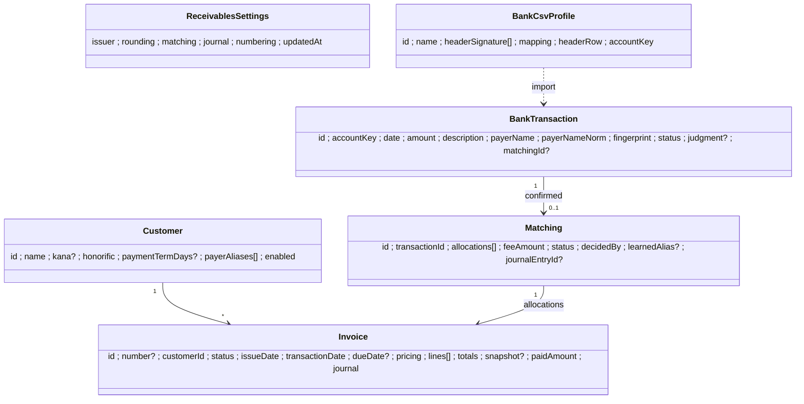
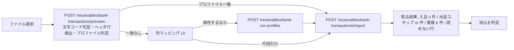

# 22. 請求書発行と入金消込（receivables）

請求書を作って発行し、銀行明細を取り込んで入金を請求に**消し込む**業務テンプレート。消込は仕訳と同じ **2 段階**（① 決定的に一意なら「決定」/ ② そうでなければ候補と理由を付けて人に確かめてもらう）で判定し、発行と消込の結果は仕訳の**下書き**として仕訳側へ渡す。

入口はサイドバー「作る」の **業務テンプレート**（`#/templates`）。画面 ID は `Receivables`、ルートは `/receivables/*`、エージェントツールの公開名は `receivables_` 接頭辞、組込みツール ID は `builtin-receivables-*`。業務を業務別ファイルだけで足す登録点は [ADR-0039](./adr/0039-business-feature-registration.md) に従う（スタブ `src/*/receivables*` を本書で埋める）。

- 関連: [20-journal.md](./20-journal.md)（仕訳。本書は §6 CSV 取込・§8 汎用 CSV・§14 ツールの流儀に揃える）/ [ADR-0041](./adr/0041-receivables-payment-matching.md) / [ADR-0038](./adr/0038-journal-two-stage-judgment.md) / [ADR-0035](./adr/0035-domain-shared-kernel-and-boundary-conversion.md)
- 設計根拠: 国税庁 適格請求書 Q&A（問 45 記載事項 / 問 57 端数処理 / 問 58 簡易適格請求書）、全銀協の振込依頼人名の法人略語、各銀行の明細 CSV。URL は本書末尾。

## 1. 目的とスコープ

| 目的 | 内容 |
|---|---|
| 請求 | 取引先マスタから請求書を作る（手入力）。**適格請求書の記載事項**と**税率ごとに 1 回の端数処理**をドメインの純関数で検査し、違反があれば発行させない（§3） |
| 発行 | `draft` → `issued`。発行時に請求書番号を採番し、発行者情報・端数処理方法・取引先名を**写し取って凍結**する。印刷はブラウザの印刷用レイアウト（「PDF に保存」を含む） |
| 入金 | 銀行明細 CSV を取り込む（プリセット + **保存できる列マッピング**、Shift_JIS 自動判定、重複取込の検出。§5） |
| 消込 | 入金ごとに `decided` / `candidate`（候補付き保留）/ `unmatched`（保留）を判定し、理由コードと「原因・直し方・導線」を出す。**確定は画面から人が押す**（§4） |
| 仕訳連携 | 発行で売上仕訳、消込確定で入金仕訳（手数料差額は支払手数料）の**下書き**を仕訳側へ作る。ポート `JournalDraftSink` 経由（§6） |
| ツール化 | 参照のみの組込みツール 3 本（`receivables_outstanding` / `receivables_match_candidates` / `receivables_invoice_draft`。§10）。発行・消込確定・名義の学習はツール化しない（仕訳 docs/20 §14.1 と同じ理由） |

**固定値にしない**（仕訳の「科目を enum や固定表でハードコードしない」と同じ方針）。振込手数料の許容範囲・端数処理方法・合算の最大件数・仕訳に使う科目 id と税区分コード・請求書番号の書式は、ワークスペース単位の `ReceivablesSettings`（§2.1）に持つ利用者データで、コード中の値は初期値に過ぎない。コードに残す定数は**計算量の安全上限**（§4.4）と法定の記載事項だけ。

### 1.1 今回実装する MVP（フェーズ R1）

規模の目安は仕訳の初回〜2 回目コミット程度。

| 含める | 内容 |
|---|---|
| 設定 | 発行者情報（名称・登録番号・住所・振込先）、端数処理、手数料許容範囲、合算件数、仕訳科目の対応、番号書式 |
| 取引先マスタ | CRUD、振込名義カナ、**振込名義の別名**（手動追加・消込確定時の学習・編集・削除） |
| 請求書 | 手入力で作成・編集（下書き）、記載事項チェックと税率別集計のライブ表示、発行、取消（void）、複製して再作成、印刷用レイアウト |
| 明細取込 | プレビュー（文字コード判定・列名署名によるプリセット判定）、列マッピングの保存と再利用、取込（入金行のみ）、重複検出、行ごとのスキップ理由 |
| 消込 | 一括判定（結果を明細に保存）、候補の表示、確定（単一・合算・手数料差額・一部入金）、`decided` の一括確定、確定の取消、対象外にする |
| 仕訳連携 | 売上 / 入金の下書き作成、取消時の下書き削除（確定済みなら残して案内） |
| ツール | 上記 3 本（`receivables_invoice_draft` は仕訳の vision 読取を再利用） |
| サンプル | `samples/receivables/`（合成の取引先・請求書 JSON・銀行明細 CSV・注文書画像。§11） |

| 後回し（R2 以降） | 理由 |
|---|---|
| サーバー側 PDF 生成・請求書のメール送付 | ADR-0038 と同じくサーバーに PDF 依存を持ち込まない。ブラウザ印刷で当面足りる。送付は SMTP 資格情報（秘密値 → `SecretCipherPort`）が要り別設計 |
| LLM による振込名義の推定 | 決定的な正規化 + 別名学習で MVP の大半は通る。推定は候補の並べ替えにだけ使う形で R2 |
| 過入金（前受金 / 仮受金）・返金・貸倒・相殺 | 仕訳の科目が増え判定分岐も増える。MVP は `overpayment` として保留し、仕訳側で手当てする導線を出す |
| 定期請求・請求書テンプレート・修正請求書（赤黒） | 取消 → 複製で代替できる |
| 全銀協固定長・API 連携（銀行 / 会計ソフト） | CSV で足りる。全銀固定長は仕訳も対象外 |
| 複数通貨・源泉徴収の請求 | 個人への報酬の請求書で要るが、端数・仕訳の分岐が増える |

## 2. 概念モデル



仕訳 `src/domain/journal/` の流儀に揃える: 集約ごとに `create*`（不変条件を検証する唯一の生成点）、状態遷移は純関数（`issueInvoice(invoice, …, at)` のように新しい値を返す）、識別子は Flavor（`src/domain/receivables/ids.ts`: `CustomerId` / `InvoiceId` / `BankTransactionId` / `MatchingId` / `BankCsvProfileId`）、エラーは `src/domain/receivables/errors.ts`、直列化は `serialization.ts`（zod は形だけ、値の不変条件は `create*`）。**金額はすべて整数円**、日付は `YYYY-MM-DD`、時刻は ISO。

**BC 境界**（経費精算 docs/21 §2.8 と同じ規律）: **receivables → journal の一方向のみ**。journal は receivables を一切 import しない。

- receivables **domain** が import してよいのは仕訳 domain の**純関数と値型だけ**: `normalize.ts`（`normalizeDescription` / `normalizeRegistrationNumber` / `parseJapaneseDate` / `parseAmount` / `counterpartyFromDescription`）、`csv.ts`（`parseCsv` / `stripBom` / `rowToRecord` / `toCsv`）、`csv-presets.ts`（`normalizeHeader` / `detectPreset` / `rowToDocument` / `rowToDocumentWithMapping` / `JOURNAL_CSV_PRESETS` / `ColumnMapping`）、`document.ts` の `isIsoDate` / `REGISTRATION_NUMBER_PATTERN`。これらが投げる `JournalCsvImportError` は receivables の application が行単位で受け、`ReceivablesCsvImportError` / `skippedRows` へ写す。
- 仕訳の `tax.ts` は調べた結果**再利用しない**: `taxAmountFromInclusive` は税込額からの切り捨て専用で丸めモードを持たず、`splitTotalsByRate` は `DocumentFacts`（受け取った帳票）を入力に取る。発行側は「税抜 / 税込 × 丸めモード × 税率ごとに 1 回」が要るので `src/domain/receivables/invoice-tax.ts` に持つ（§3.2）。
- receivables **application** は仕訳の application を import しない。仕訳の保存と帳票読取は**ポート**（`JournalDraftSink` / `OrderDocumentReaderPort`）越しに使い、実装は `src/composition/receivables.ts` だけが仕訳ユースケースを包んで注入する（§6・§10.3）。
- 仕訳と共有する**データ**（科目 id `revenue.sales`、税区分コード `JP-OUT-10-S` など）は設定値として持ち、コードに書かない。

### 2.1 ReceivablesSettings（ワークスペースに 1 つ）

保存したことが無いワークスペースでは初期値を返すが**保存しない**（ADR-0038 決定 2 と同じ理由）。

| 項目 | 内容 | 初期値 |
|---|---|---|
| `issuer` | `{ name, registered: boolean, registrationNumber?, address?, tel?, transferAccounts[]: { bankName, branchName, accountType, accountNumber, holderKana } , note? }` | 空（未設定なら発行時に `issuer-name-missing`） |
| `rounding.mode` | `floor` / `round-half-up` / `ceil`（消費税額の 1 円未満） | `floor` |
| `rounding.defaultPricing` | `exclusive`（税抜で明細を書く）/ `inclusive`（税込） | `exclusive` |
| `matching.feeTolerance` | `{ min, max }`（円。`請求残 − 入金額` がこの範囲なら手数料差額候補） | `{ min: 1, max: 880 }` |
| `matching.maxCombinationSize` | 合算入金で探す請求の最大件数（2〜`HARD_MAX_COMBINATION_SIZE`） | `3` |
| `matching.partialNameMinLength` | 部分一致とみなす正規化名の最小文字数 | `4` |
| `journal.enabled` | 仕訳下書きを作るか | `true` |
| `journal.accounts` | `{ sales, receivable, deposit, fee }` の科目 id | `revenue.sales` / `asset.receivables` / `asset.ordinary_deposit` / `expense.fees` |
| `journal.salesTaxCodes` | 税率 → 税区分コード `{ '10', '8', '0' }` | `JP-OUT-10-S` / `JP-OUT-8R-S` / `JP-OUT-EXEMPT` |
| `journal.feeTaxCode` | 手数料の税区分 | `JP-IN-10-S` |
| `journal.nonTaxableTaxCode` | 売掛金・預金の行の税区分（仕訳は全行に税区分を要るが、売掛金の増減に消費税は無い。コードに `JP-NA` を書かないため設定にした） | `JP-NA` |
| `journal.salesEntryDate` | 売上仕訳の日付 `transaction-date` / `issue-date` | `transaction-date` |
| `numbering` | `{ format: 'INV-{YYYY}-{SEQ4}' }`（`{YYYY}` `{YY}` `{MM}` `{SEQ3..6}` のみ）。系列キーは書式から年月部分を展開した文字列 | `INV-{YYYY}-{SEQ4}` |

科目 id・税区分コードは**仕訳の科目マスタを id で参照**するだけで、存在確認は発行・確定時にポート経由で行う（消えていれば `journal-account-missing`。§6.4）。振込先口座番号は請求書に印字して相手に渡す情報であり秘密値ではないので `record_json` に平文で置く（秘密値の方針に反しない）。

### 2.2 Customer（取引先）

| 項目 | 内容 |
|---|---|
| `name` / `honorific` | 請求書の宛名（`御中` / `様`） |
| `kana` | 振込名義カナ（任意。全銀の振込依頼人名に近い形で持つ。照合では正規化して使う） |
| `registrationNumber?` | 相手の登録番号（任意。発行には不要、表示のみ） |
| `paymentTermDays?` / `address?` / `note?` | 支払期日の既定（発行日 + n 日）など |
| `payerAliases[]` | `{ id, text（入金明細に現れた生の名義）, normalized, origin: 'manual' \| 'learned', matchingId?, createdAt, lastMatchedAt? }`。**利用者が一覧で編集・削除できる** |
| `enabled` | 論理削除。請求書・消込から参照されている取引先は物理削除できない |

不変条件: `name` 非空、`payerAliases[].normalized` は取引先内で一意、`normalized` は §4.2 の `normalizePayerName(text)` と一致（保存時に再計算し、クライアントの値を信じない）。**別の取引先と同じ正規化名の別名は保存できるが警告を返す**（判定では `alias-conflict` になる）。

### 2.3 Invoice（請求書）

| 項目 | 内容 |
|---|---|
| `number` | 発行時に採番（下書きは undefined）。ワークスペース内で一意 |
| `status` | `draft` → `issued` → `partially_paid` → `paid`。`issued` / `partially_paid`（入金確定が 1 件も無いときに限り）→ `void`。`draft` は削除のみ |
| `issueDate` / `transactionDate` / `dueDate?` | 取引年月日は期間の請求なら `transactionPeriod: { from, to }` も持てる（印字用。記載事項としては `to` を取引年月日とみなす） |
| `pricing` | `exclusive` / `inclusive`（明細金額が税抜か税込か） |
| `lines[]` | `{ description, quantity?, unit?, unitPrice?, amount, taxRate: 10 \| 8 \| 0, zeroRateKind?: 'exempt' \| 'non-taxable' \| 'export' }`。`amount` は整数（値引行は負可） |
| `declared?` | 外部から持ち込んだ下書き（ツールの `draft_json`・JSON 貼付）が申告していた税額 `{ lineTaxAmounts?: (number \| null)[], taxByRate?: { rate, taxAmount }[], grandTotal? }`。**検査にだけ使い**、発行時に消す |
| `totals` | `{ byRate[]: { rate, taxable（税抜対象額）, tax, inclusive（税込対象額） }, taxTotal, grandTotal }`。**常にドメインが計算した値**（§3.2）。保存時に再計算し、クライアントの値は採らない |
| `snapshot` | 発行時に凍結: `{ issuer（設定の写し）, customer: { name, honorific, address? }, roundingMode, issuedAt }`。以後の設定変更・取引先改名で発行済みの見た目は変わらない |
| `paidAmount` / `outstanding` | 確定済み Matching の配分合計と `grandTotal − paidAmount`（Matching 確定 / 取消の同一トランザクションで更新する非正規化値） |
| `journal` | `{ salesEntryId? }`（売上仕訳の下書き id） |
| `voided?` | `{ at, reason }` |

**期日超過は保存しない**（`isOverdue(invoice, today)` の計算値。`today` はサーバーのローカル日付で、`current_datetime` ツールと同じ時計）。発行済みの明細・日付・宛名は変更不可（`InvoiceStateError` → 409）。直したいときは「取消 → 複製して再作成」。

### 2.4 BankTransaction（入金明細 1 行）

| 項目 | 内容 |
|---|---|
| `accountKey` | どの口座の明細か（取込時に選ぶ / プロファイルの既定）。重複判定のキーに入る |
| `date` / `amount` | 入金日と入金額（正の整数。**出金行は取り込まない**＝件数だけ報告） |
| `description` / `payerName` / `payerNameNorm` | 摘要の原文、そこから切り出した振込依頼人名、正規化名（§4.2） |
| `balance?` | 残高列があれば |
| `source` | `{ fileName?, profileId?, row（生値）, rowNumber }` |
| `fingerprint` | 重複判定キー（§5.4） |
| `status` | `unmatched` → `matched`（Matching 確定）/ `ignored`（利息・返金など消込対象外。戻せる） |
| `judgment?` | 直近の判定（§4.1 の `MatchJudgment` + `judgedAt`）。確定時の前提チェックに使う |

### 2.5 Matching（消込の確定記録）

| 項目 | 内容 |
|---|---|
| `allocations[]` | `{ invoiceId, amount }`（1..`HARD_MAX_COMBINATION_SIZE` 件、各 amount > 0、配分先の請求残以下） |
| `feeAmount` | 手数料差額（0 以上）。不変条件: `Σ allocations.amount = transaction.amount + feeAmount` |
| `decidedBy` | `judgment`（判定の候補をそのまま確定）/ `manual`（利用者が配分を編集） |
| `judgmentReason` | 確定時の判定理由コード（監査・後追い用） |
| `learnedAlias?` | `{ customerId, aliasId }`（この確定で学習した別名。取消時に `origin: learned` かつ他で使われていなければ削除を提案） |
| `status` | `confirmed` → `cancelled`（取消。請求の入金額を戻し、明細を `unmatched` に戻す） |
| `journal` | `{ entryId?, draftResult }`（§6） |

## 3. 請求書の記載事項チェックと端数処理

### 3.1 検査の入口

`checkInvoice(input: { invoice, settings, customer, today }): InvoiceCheck` は**純関数**（`src/domain/receivables/invoice-check.ts`）。

```ts
type InvoiceCheck = {
  readonly totals: InvoiceTotals;                 // §3.2 で計算した値（画面のライブ表示にも使う）
  readonly violations: readonly InvoiceIssue[];   // 1 件でもあれば発行不可
  readonly warnings: readonly InvoiceIssue[];     // 発行できるが確認を促す
};
type InvoiceIssue = { readonly code: InvoiceIssueCode; readonly path?: string; readonly params: Readonly<Record<string, string | number>> };
```

`POST /receivables/invoices/check`（保存しない）と下書き保存（結果を返すだけ）と発行（`violations` が空でなければ `InvoiceComplianceError` → 400、`violations[]` を本文に載せる）が同じ関数を呼ぶ。文言は UI（`receivables-error-messages.ts`）が `code` + `params` から組み立てる。サーバーの `message` は英語の要約で、画面の文言の正本にしない。

### 3.2 税率別集計と端数処理（1 請求書 × 税率ごとに 1 回）

国税庁 Q&A 問 57: 消費税額等の 1 円未満の端数処理は**一の適格請求書につき、税率ごとに 1 回**。明細ごとに丸めて合算してはならない。

税率 `r ∈ {10, 8}` ごとに、その税率の明細金額の合計 `S_r = Σ amount_i`（値引行の負値を含む）を取り、**整数演算だけで**計算する（浮動小数を使わない）。

| pricing | 税額 `T_r` | 税抜対象額 | 税込対象額 |
|---|---|---|---|
| `exclusive` | `R(S_r × r, 100)` | `S_r` | `S_r + T_r` |
| `inclusive` | `R(S_r × r, 100 + r)` | `S_r − T_r` | `S_r` |

`R(n, d)` は丸めモード: `floor` = `⌊n / d⌋`、`ceil` = `⌈n / d⌉`、`round-half-up` = `⌊(2n + d) / (2d)⌋`。`S_r < 0` は `rate-total-negative`（違反）として計算しない。税率 0 の明細は `T_0 = 0`、対象額は `S_0`。`grandTotal = Σ 税込対象額`、`taxTotal = Σ T_r`。

安全域: `|amount| ≤ 10^11`、明細 ≤ 200 行、`grandTotal ≤ 10^12`（`S_r × r` が `Number.MAX_SAFE_INTEGER` を超えない）。超えたら `amount-out-of-range`。

明細の金額: `quantity` と `unitPrice` の両方があり `amount` が省略されたときだけ `unitPrice × quantity` を使う。積が整数にならなければ `line-amount-not-integer`（明細の丸めは税の端数処理ではないので、利用者に金額を入れてもらう。黙って丸めない）。

**例（明細ごとの丸め違反）**: 税抜 10% の明細 1,234 / 2,345 / 3,456 円。1 回の丸め（切り捨て）は `⌊7,035 × 10 / 100⌋ = 703` 円。明細ごとに丸めると 123 + 234 + 345 = **702** 円。

### 3.3 明細ごとの丸めの検出

自前の画面で作る請求書は §3.2 でしか税額を持たないので違反は起きない。起き得るのは**外から持ち込んだ下書き**（`receivables_invoice_draft` の `draft_json`、JSON 貼付）で、申告された税額 `declared` と突き合わせる。

1. `declared.lineTaxAmounts` がある税率 r について `D_r = Σ lineTax_i` を取る。`D_r ≠ T_r` のとき、各明細を同じ丸めモードで個別に丸めた合計 `P_r = Σ R(amount_i × r, 100 または 100 + r)` を計算し、`D_r = P_r` なら **`per-line-rounding`**（違反。params: rate, declared = D_r, perLine = P_r, once = T_r, difference）、そうでなければ `declared-tax-mismatch`（違反）。
2. `declared.taxByRate[r]` が `T_r` と違えば `declared-tax-mismatch`。ただし差が 1 円で、別の丸めモードなら一致するときは `rounding-mode-differs`（警告。params: 一致するモード）にする（持ち込み元が四捨五入だっただけのことが多い）。
3. `declared.grandTotal` が `grandTotal` と違えば `declared-total-mismatch`（警告）。仕訳の抽出整合チェック（docs/20 §6）と同じく**値は補正しない**。発行する値は常に §3.2 の計算値で、差額を文言に入れて人に見せる。

### 3.4 違反・警告コード

「原因」「直し方」「導線」は UI の文言の正本（`receivables-error-messages.ts`）に写す。導線は画面内のフォーム項目へのフォーカス、または設定ダイアログ。

| code | 種別 | 原因（利用者向け） | 直し方 | 導線 |
|---|---|---|---|---|
| `issuer-name-missing` | 違反 | 発行者（自社）の名称が設定されていません | 設定で発行者名を入れる | 設定 › 発行者 |
| `issuer-registration-number-missing` | 違反 | 適格請求書発行事業者として設定されていますが、登録番号がありません | 登録番号（T + 13 桁）を入れる。登録していないなら「登録事業者ではない」に切り替える | 設定 › 発行者 |
| `issuer-registration-number-invalid` | 違反 | 登録番号の形が違います（読み取った値と桁数を表示） | T のあとに数字 13 桁で入れ直す | 設定 › 発行者 |
| `issuer-not-registered` | 警告 | 登録事業者ではない設定なので、この請求書は適格請求書になりません（相手は仕入税額控除を満額受けられません） | 登録済みなら設定で登録番号を入れる | 設定 › 発行者 |
| `recipient-missing` | 違反 | 宛名（取引先名）がありません | 取引先を選ぶ / 取引先名を入れる | 請求書 › 取引先 |
| `customer-disabled` | 違反 | 無効にした取引先です | 取引先を有効に戻すか別の取引先を選ぶ | 取引先 › 該当行 |
| `issue-date-missing` | 違反 | 発行日がありません（ツールの請求書案・JSON 貼付は発行日を空で渡す。画面の新規作成は今日が既定） | 発行日を入れる | 請求書 › 発行日 |
| `transaction-date-missing` | 違反 | 取引年月日がありません（記載事項） | 取引日（期間なら末日）を入れる | 請求書 › 取引日 |
| `lines-empty` | 違反 | 明細がありません | 明細を 1 行以上足す | 請求書 › 明細 |
| `line-description-missing` | 違反 | n 行目の品名（取引内容）が空です | 品名を入れる | 明細 n 行目 |
| `line-amount-missing` | 違反 | n 行目の金額がありません（金額も、数量と単価の組も無い） | 金額か数量と単価を入れる | 明細 n 行目 |
| `line-amount-not-integer` | 違反 | n 行目の単価 × 数量が円未満を含みます | 金額を直接入れる | 明細 n 行目 |
| `line-tax-rate-missing` | 違反 | n 行目の税率がありません | 10% / 8% / 0% を選ぶ | 明細 n 行目 |
| `rate-total-negative` | 違反 | r% の合計が負です（値引が本体を上回る） | 値引の税率・金額を確かめる | 明細 |
| `grand-total-not-positive` | 違反 | 請求額が 0 円以下です | 明細を確かめる | 明細 |
| `amount-out-of-range` | 違反 | 金額・行数が扱える範囲を超えています | 請求書を分ける | 明細 |
| `per-line-rounding` | 違反 | r% の消費税が明細ごとに丸められています（申告 D 円 = 明細ごとの丸め、正しくは税率ごとに 1 回で T 円） | 取り込んだ税額を使わず、計算した税額で発行する（「計算値で置き換える」ボタン） | 請求書 › 税率別集計 |
| `declared-tax-mismatch` | 違反 | 取り込んだ r% の税額（D 円）が計算値（T 円）と合いません | 明細金額・税率・税抜 / 税込の区分を確かめ、計算値で置き換える | 請求書 › 税率別集計 |
| `rounding-mode-differs` | 警告 | 取り込んだ税額は「四捨五入」なら一致します（設定は「切り捨て」） | 設定の端数処理を確かめる（発行済みの請求書と揃える） | 設定 › 端数処理 |
| `declared-total-mismatch` | 警告 | 取り込んだ合計（D 円）と計算した合計（G 円）が差額 n 円で違います | 読み取り誤りか値引の漏れを確かめる | 請求書 › 明細 |
| `zero-rate-lines` | 警告 | 0% の明細があります（非課税 / 不課税 / 輸出の区分を確かめてください） | 区分を選ぶ | 明細 n 行目 |
| `due-date-missing` | 警告 | 支払期日がありません（期日超過の一覧に出ません） | 期日を入れるか取引先の支払条件を設定する | 請求書 › 期日 |
| `due-date-before-issue-date` | 違反 | 支払期日が発行日より前です | 日付を直す | 請求書 › 期日 |
| `transaction-date-after-issue-date` | 警告 | 取引日が発行日より後です | 前払いの請求でなければ日付を直す | 請求書 › 取引日 |

記載事項（適格請求書 6 項目）との対応: ① 発行者名 + 登録番号 → `issuer-*` / ② 取引年月日 → `transaction-date-missing` / ③ 取引内容（軽減対象の旨）→ `line-description-missing`（※印と「※は軽減税率対象」の注記は印刷レイアウトが税率 8% の明細に**必ず**付ける）/ ④ 税率ごとの対価の合計と適用税率・⑤ 税率ごとの消費税額 → §3.2 の `totals`（印刷は常に税率別の表を出す）/ ⑥ 宛名 → `recipient-missing`。

### 3.5 発行（状態遷移）

`IssueInvoiceUseCase`（`src/application/receivables/manage-invoices.ts`）は `unitOfWork.withTransaction` の中で次を行う:

1. 下書きを読む（`draft` 以外は `InvoiceStateError` 409）→ 設定・取引先を読む → `checkInvoice`。違反があれば 400。
2. 系列キーの採番（`receivables_invoice_sequences` を +1。同じ UoW 内なので二重採番しない）→ `issueInvoice(invoice, { number, snapshot, at })`（`declared` を消し、`totals` を再計算して凍結）。
3. `settings.journal.enabled` なら売上仕訳の下書きを `JournalDraftSink.upsertDraft` へ（§6.2）。科目が無ければ**発行ごと巻き戻し**て `journal-account-missing` を返す（発行済みなのに仕訳が無い状態を作らない）。利用者が仕訳連携を切りたいなら設定で `journal.enabled = false`。
4. 保存して返す。

取消（`void`）: 入金確定（confirmed の Matching）が 1 件でもあれば 409（先に消込を取り消す）。売上仕訳が `draft` なら削除、`confirmed` / `exported` なら残して `journalFollowUp: { entryId, action: 'reverse' }` を返し、画面は「仕訳側で取消の仕訳を作ってください」と仕訳を開くボタンを出す（`OpenTarget { internalId: entryId, section: 'entry' }` on `Journal`）。番号は欠番のまま再利用しない。

## 4. 消込判定（2 段階）

### 4.1 結果の形

`judgeTransaction(input: { transaction, openInvoices, customers, settings }): MatchJudgment` は**純関数**（`src/domain/receivables/matching.ts`）。I/O もモデル呼び出しも持たない。

```ts
type MatchJudgment =
  | { stage: 'decided';   reason: 'exact-amount-and-name'; candidates: readonly [MatchCandidate] }
  | { stage: 'candidate'; reason: CandidateReason; candidates: readonly MatchCandidate[] }   // 1 件目が推し。人が確定する
  | { stage: 'unmatched'; reason: UnmatchedReason; candidates: readonly MatchCandidate[] }; // 参考候補（0..5 件）
type MatchCandidate = {
  invoiceIds: readonly string[];            // 合算なら複数（期日の古い順）
  allocations: readonly { invoiceId: string; amount: number }[];
  candidateTotal: number;                   // 対象請求の残高合計
  difference: number;                       // candidateTotal − transaction.amount（正 = 不足）
  feeAmount: number;                        // 手数料差額として扱う額（0 以上。不足が許容範囲のときだけ）
  customerId: string;
  nameMatch: 'alias' | 'kana' | 'name' | 'partial' | 'none';
  nameScore: number;                        // 1.0 / 1.0 / 0.9 / 0.6 / 0
  rank: number;
};
type CandidateReason = 'fee-difference' | 'combined-payment' | 'combined-payment-with-fee' | 'partial-payment' | 'name-partial' | 'amount-only';
type UnmatchedReason = 'no-candidate' | 'no-open-invoice' | 'multiple-candidates' | 'ambiguous-combination' | 'search-limit' | 'alias-conflict' | 'overpayment';
```

`stage` と `reason` は**必ず 1 つ**（仕訳の `reasons[]` と違い、評価順の最初に当たったもの）。1 つの入金に効く理由を並べると画面の「次の一手」が定まらないため。判定しなかった観点（例: 合算を探す前に単独で決まった）は結果に含めない。

### 4.2 振込名義の正規化 `normalizePayerName(text)`

銀行摘要と取引先名・カナ・別名に**同じ関数**を通してから比較する。仕訳の `normalizeDescription`（NFKC・半角カナ→全角・法人略号除去・空白圧縮）を土台に、照合用に次を足す（`src/domain/receivables/payer-name.ts`）:

| 順 | 規則 | 例 |
|---|---|---|
| 1 | 摘要から名義を切り出す: 種別語（`振込` `フリコミ` `ﾌﾘｺﾐ` `振込入金` `テレ` `IB` など。仕訳 `counterpartyFromDescription` の語彙）を先頭から除き、**6 桁以上の数字列（振込依頼人コード）** を除く。プロファイルに `payerName` 列があればその列を使い、切り出しはしない | `ﾌﾘｺﾐ 1234567890 ｶ)ﾔﾏﾀﾞｼｮｳｼﾞ` → `ｶ)ﾔﾏﾀﾞｼｮｳｼﾞ` |
| 2 | `normalizeDescription`（NFKC、半角カナ→全角、`カ)` `(カ` `(株)` `株式会社` 等の除去） | → `ヤマダショウジ` |
| 3 | ひらがな → カタカナ | `やまだ` → `ヤマダ` |
| 4 | **小書きカナ → 並字**（全銀の振込依頼人名は小書きを持たない）: `ァィゥェォッャュョヮヵヶ` → `アイウエオツヤユヨワカケ` | `ヤマダショウジ` → `ヤマダシヨウジ` |
| 5 | 長音・ハイフンの揺れを 1 種に: `ー－―‐-−` → `ー` | |
| 6 | 空白・中黒・読点・ピリオド・括弧・スラッシュを除去 | `ヤマダ　タロウ` → `ヤマダタロウ` |
| 7 | ラテン文字は大文字化（NFKC 済み） | `abc` → `ABC` |

法人略語の追加語彙（全銀の振込依頼人名で使われる略語。仕訳側に無いもの）: `メ)`（合名）、`シ)`（合資）、`ド)`（合同）、`イ)`（医療法人）、`ザイ)` `シヤ)`（財団 / 社団）、`ガク)`（学校）、`フク)`（社会福祉）、`ソ)`（相互）、`トクヒ)`（特定非営利）、`シユウ)`（宗教）、`ドク)`（独立行政）。前置・後置・中置（`(カ)`）の 3 形。この表は法定の略語体系なので**コードの定数**に持ち、設定にはしない。

**漢字 → カナは推測しない**（辞書を持たない）。漢字の取引先名は `kana` か別名が無い限り `name` 一致しない。これが「最初の 1 回は `amount-only` で人が確かめ、確定時に別名を学習する」流れの前提である。

名義一致の段階（取引先ごとに最良のものを採る）:

| nameMatch | 条件（すべて正規化後） | nameScore |
|---|---|---|
| `alias` | 別名の `normalized` と完全一致 | 1.0 |
| `kana` | 取引先 `kana` と完全一致 | 1.0 |
| `name` | 取引先 `name` と完全一致（カナ表記の社名など） | 0.9 |
| `partial` | どちらかがもう一方を含み、短い方が `partialNameMinLength` 文字以上（銀行が名義を 30 桁前後で切り詰めるため、主に前方一致） | 0.6 |
| `none` | 上記なし | 0 |

同じ正規化名が**別の取引先の `alias` / `kana`** にも一致したら `alias-conflict`（§4.3 の 1）。

### 4.3 評価順

入力: 入金 `t`（`status: unmatched`）、未入金請求 `O`（`issued` / `partially_paid`、`outstanding > 0`、`issueDate ≤ t.date`）、有効な取引先、設定。`fee = settings.matching.feeTolerance`、`K = min(settings.matching.maxCombinationSize, HARD_MAX_COMBINATION_SIZE)`。

| # | 評価 | 結果 |
|---|---|---|
| 0 | `O` が空 | `unmatched / no-open-invoice`（名義一致の取引先があれば候補 0 件でも customerId を理由の params に載せる） |
| 1 | 名義一致（`alias` / `kana`）の取引先が 2 社以上 | `unmatched / alias-conflict` |
| 2 | 名義一致（`partial` 以上）の取引先集合 `C` を作る。`C` が空なら #7 へ | |
| 3 | `C` の請求で `outstanding = t.amount` の単独候補 | 1 件かつ nameMatch ∈ {alias, kana, name} → **`decided / exact-amount-and-name`**。1 件かつ `partial` → `candidate / name-partial`。2 件以上 → `unmatched / multiple-candidates`（同額の請求が同じ取引先に複数） |
| 4 | `C` の請求で `fee.min ≤ outstanding − t.amount ≤ fee.max` の単独候補 | 1 件 → `candidate / fee-difference`（`feeAmount = 差額`）。2 件以上 → `unmatched / multiple-candidates` |
| 5 | `C` の取引先ごとに合算（§4.4）: 大きさ 2..K の部分集合で `Σ outstanding = t.amount`（一致）または差が `fee` 内 | 一致がちょうど 1 組 → `candidate / combined-payment`。一致 0 組で手数料内が 1 組 → `candidate / combined-payment-with-fee`。2 組以上 → `unmatched / ambiguous-combination`（上位 5 組を参考候補に）。一致 0 組のまま探索上限に達した（プール超過・評価数超過）→ `unmatched / search-limit`。一致も手数料内も 0 組で上限にも達していない → #6 へ |
| 6 | `C` が 1 社でその未入金請求が 1 件だけ | `t.amount < outstanding − fee.max` → `candidate / partial-payment`（配分 = 入金額、手数料 0）。`t.amount > outstanding` → `unmatched / overpayment` |
| 7 | 名義で絞れない / #3〜#6 で決まらない: **全取引先**の請求で `outstanding = t.amount` の単独候補 | 1 件 → `candidate / amount-only`。2 件以上 → `unmatched / multiple-candidates`。0 件 → `unmatched / no-candidate` |

名義不一致のときは**合算と手数料差額を探さない**（全取引先の組み合わせは偶然一致が多く、候補として見せる価値より誤誘導が大きい）。

**`decided` は「同額 + 名義が別名 / カナ / 社名で一致 + 候補が 1 件」だけ**。手数料差額・合算・一部入金は、計算上一意でも人が確かめる（ADR-0041 決定 1）。

### 4.4 合算の組み合わせ探索と計算量の上限

`findCombinations(invoices, target, fee, K, budget)`（純関数）:

- 対象は**1 取引先の**未入金請求だけ。期日の古い順に最大 `HARD_MAX_POOL = 20` 件（超えた分は探索しない。超えたこと自体を `truncated: true` として結果に残し、一致 0 組なら理由を `search-limit` にする）。
- 深さ優先。残高は正なので、部分和が `target + fee.max` を超えた枝は刈る。
- 評価した部分集合の数が `HARD_MAX_EVALUATIONS = 50,000` に達したら打ち切り（`search-limit`）。`C(20,2) + … + C(20,5) = 21,679` なので既定の上限では通常届かないが、設定や将来の変更で爆発しないための固定の安全弁。
- 一致が 6 組目に達したら探索を止める（`ambiguous-combination` を出すのに 2 組、参考表示に 5 組あれば足りる）。

コード定数（設定にしない）: `HARD_MAX_COMBINATION_SIZE = 5`、`HARD_MAX_POOL = 20`、`HARD_MAX_EVALUATIONS = 50_000`、`MAX_REFERENCE_CANDIDATES = 5`。設定 `maxCombinationSize` はこの範囲に検証で丸めずに**拒否**する（`matching.maxCombinationSize must be between 2 and 5`）。

### 4.5 理由コードと利用者向け文言

画面は入金行ごとに「原因 → 次の一手 → その場所を開くボタン」を出す（docs/20 §3 と同じ形）。

| stage / reason | 原因（利用者向け） | 次の一手 | ボタン（導線） |
|---|---|---|---|
| decided / `exact-amount-and-name` | 「{名義}」は {取引先} の {請求番号}（{金額} 円）と金額・名義が一致しました | 内容を見て確定する（一括確定も可） | 確定 / 請求書を開く |
| candidate / `fee-difference` | {請求番号} の残高より {差額} 円少ない入金です。振込手数料を差し引かれた可能性があります | 差額を支払手数料として確定する。手数料でなければ一部入金として配分を直す | 手数料込みで確定 / 配分を編集 / 設定 › 手数料の許容範囲 |
| candidate / `combined-payment` | {取引先} の請求 {n} 件（{番号一覧}）の合計が入金額と一致しました | 組み合わせを確かめて確定する | 合算で確定 / 請求書を開く |
| candidate / `combined-payment-with-fee` | {n} 件の合計より {差額} 円少ない入金です（合算 + 振込手数料） | 組み合わせと手数料を確かめて確定する | 確定 / 配分を編集 |
| candidate / `partial-payment` | {請求番号}（残高 {残高} 円）に対して {金額} 円の入金です。一部入金の可能性があります | 一部入金として確定する（請求は「一部入金」になる）。別の入金と合わせて払われる予定なら保留のまま | 一部入金で確定 / 取引先に連絡するメモ |
| candidate / `name-partial` | 名義「{名義}」が {取引先} と一部だけ一致し、金額は {請求番号} と一致しました | 同じ相手なら確定し、名義を別名として覚える | 確定して名義を覚える / 取引先を開く |
| candidate / `amount-only` | 名義「{名義}」はどの取引先とも一致しませんが、{取引先} の {請求番号} と金額が一致しました | 同じ相手なら確定し、名義を別名として覚える（次回からは自動で「決定」になります） | 確定して名義を覚える / 取引先の別名を編集 |
| unmatched / `no-candidate` | 金額・名義が一致する未入金の請求がありません | 請求書が未発行なら発行する。消込対象でない入金（利息・返金など）なら「対象外」にする | 請求書を作る / 対象外にする / 手動で配分 |
| unmatched / `no-open-invoice` | 未入金の請求がありません（{取引先} の請求はすべて入金済み、または入金日より後に発行） | 請求書の発行漏れか前受けかを確かめる。前受金は仕訳側で処理する | 請求書を作る / 仕訳を開く / 対象外にする |
| unmatched / `multiple-candidates` | 同じ金額の未入金請求が {n} 件あり、どれか決められません | 候補から選んで確定する。取引先の名義を別名に登録すると次回から絞れます | 候補から選ぶ / 取引先の別名を編集 |
| unmatched / `ambiguous-combination` | 合計が入金額になる請求の組み合わせが {n} 通りあります | 取引先の支払通知で対象を確かめ、候補から選ぶ | 候補から選ぶ / 配分を編集 |
| unmatched / `search-limit` | {取引先} の未入金請求が多すぎて、組み合わせを探しきれませんでした（{上限} 件 / {評価数} 通りで打ち切り） | 対象の請求を選んで手動で配分する | 手動で配分 |
| unmatched / `alias-conflict` | 名義「{名義}」が複数の取引先（{取引先一覧}）の別名 / カナに登録されています | どちらか一方から別名を消す | 取引先の別名を編集（両方へのリンク） |
| unmatched / `overpayment` | {請求番号} の残高 {残高} 円より {超過} 円多い入金です | 請求の不足・二重払いを確かめる。前受金 / 返金は仕訳側で処理する（入金消込では扱いません） | 請求書を開く / 仕訳を開く / 対象外にする |

確定時（判定ではなく**確定の前提チェック**。`ConfirmMatchingUseCase` が投げ、画面は同じ「原因・次の一手・ボタン」の形で出す）:

| code | HTTP | 原因 | 次の一手 / ボタン |
|---|---|---|---|
| `transaction-not-unmatched` | 409 | この入金はすでに消込済みか対象外です | 一覧を再読み込み |
| `invoice-outstanding-changed` | 409 | 判定の後に請求の残高が変わりました（別の入金が確定された） | 「再判定」ボタン |
| `allocation-exceeds-outstanding` | 400 | 配分額が請求の残高を超えています | 配分を編集 |
| `allocation-sum-mismatch` | 400 | 配分合計 − 手数料 が入金額と合いません | 配分を編集 |
| `fee-out-of-tolerance` | 400 | 手数料 {n} 円が設定の許容範囲（{min}〜{max} 円）の外です | 配分を編集 / 設定 › 手数料の許容範囲 |
| `journal-account-missing` | 409 | 仕訳の科目「{設定項目}」（{id}）が科目マスタにないか無効です | 設定 › 仕訳連携 / 仕訳 › 科目 |

楽観的な同時更新の検出: 確定リクエストは判定時点の各請求の `outstanding` を `expectedOutstanding` として送り、UoW 内で読み直した値と違えば `invoice-outstanding-changed`。

### 4.6 判定・確定・取消のユースケース

| ユースケース | 内容 |
|---|---|
| `JudgeTransactionsUseCase` | 対象（省略時は `unmatched` 全件、日付昇順）を読み、未入金請求・取引先・設定を 1 回ずつ読んで `judgeTransaction` を回し、`judgment` を明細に保存。**同じ実行内で `decided` / `candidate` になった請求は後続の入金の候補から外さない**（確定していないので）。代わりに同じ請求を推す入金が 2 件以上あれば、両方の `judgment` に `contendedBy: [transactionId…]` を付け、画面は「同じ請求を推す入金が他にもあります」と出す |
| `ConfirmMatchingUseCase` | §4.5 の前提チェック → UoW 内で Matching 作成・明細 `matched`・請求の `paidAmount` / `status` 更新・（選ばれていれば）別名の学習・入金仕訳の下書き（§6.3） |
| `ConfirmDecidedMatchingsUseCase` | `judgment.stage = decided` かつ `contendedBy` が無い明細だけを 1 件ずつ確定（1 件ごとに UoW。途中の失敗は結果に積んで続行し、`{ confirmed[], failed[{ transactionId, code }] }` を返す） |
| `CancelMatchingUseCase` | UoW 内で Matching を `cancelled`、明細を `unmatched`（`judgment` は消す）、請求の入金額を戻す、入金仕訳の下書きを `discardDraft`（確定済みなら残して `journalFollowUp` を返す）。学習した別名は `removeLearnedAlias: true` のときだけ消す（画面が確認して送る） |
| `IgnoreTransactionUseCase` / `UnignoreTransactionUseCase` | `unmatched` ⇄ `ignored`（理由メモ付き） |

## 5. 銀行明細 CSV の取込

### 5.1 流れ



仕訳の取込（docs/20 §6）と違い、**文字コードの判定とプレビューをサーバーで行う**（銀行 CSV のヘッダ行の前に口座情報の行が数行ある形式が多く、ヘッダ行の検出とプロファイルの判定を同じ規則でテストしたいため）。本文は `contentBase64`（生バイト列、上限 5 MiB）で送る。UI の `TextDecoder` には依存しない。

### 5.2 文字コード

`decodeBankCsv(bytes, hint: 'auto' | 'utf-8' | 'shift_jis')`（`src/application/receivables/bank-csv-decode.ts`）。**Node 標準の `TextDecoder` だけで読む**（依存を増やさない。WHATWG の `shift_jis` は Windows-31J 相当で、NEC 特殊文字・IBM 拡張文字も読める。テストで `①` を確認）:

1. 先頭が UTF-8 BOM なら UTF-8。`hint` が明示されていればそれで読む。
2. `auto`: `TextDecoder('utf-8', { fatal: true })` で例外が出なければ UTF-8。出れば `shift_jis`。
3. 読んだ結果に置換文字（U+FFFD）が残れば、警告 `{ code: 'garbled-rows', params: { rows, count } }` を積む（画面は「文字化けした行があります（n 行目）。文字コードを指定して読み直してください」と文字コードの切替を出す）。

### 5.3 ヘッダ行とプロファイル

`BankCsvProfile`（ワークスペースに複数）:

| 項目 | 内容 |
|---|---|
| `name` | 「○○銀行 本店 普通」など |
| `headerRow` | ヘッダ行の行番号（1 始まり。前置きの行を飛ばす）。`auto` なら「日付列と金額列の候補を両方含む最初の行」を探す（先頭 20 行まで） |
| `headerSignature` | 正規化済み列名（仕訳の `normalizeHeader`）の集合。一致判定は「署名の列がすべて含まれる」 |
| `mapping` | 仕訳の `ColumnMapping`（`date` / `description` / `deposit` / `withdrawal` / `amount`（符号付き 1 列）/ `balance` / `detail`）+ `payerName?`（振込依頼人名が独立した列の銀行向け） |
| `accountKey` | 既定の口座キー（取込時に上書き可） |
| `origin` | `builtin`（仕訳の銀行プリセット 6 種を写したもの。編集不可、複製して編集）/ `user` |

判定順: 利用者プロファイル（`updatedAt` 降順）→ 組込み（仕訳 `detectPreset` と同じ署名）→ 一致なしなら列マッピング UI。行の正規化は仕訳の `rowToDocument`（組込み）/ `rowToDocumentWithMapping`（利用者）に委ね、`facts.direction === 'in'` の行だけを入金明細にする（`transactionDate` → `date`、`grandTotal` → `amount`、`description`、`extra.balance` → `balance`）。`payerName` 列があればそれを、無ければ §4.2 の規則 1 で摘要から切り出す。

列マッピング UI の必須: 日付列と、「入金列」または「符号付き金額列」のどちらか。足りなければ保存ボタンを押せなくし、足りない項目名を出す。

### 5.4 重複取込の検出

`fingerprint = sha256(accountKey | date | amount | payerNameNorm | balance ?? '' | occurrence)` の先頭 32 桁。`occurrence` は**同じファイル内**で `(accountKey, date, amount, payerNameNorm, balance)` が同じ行の出現順（0 始まり）。`receivables_bank_transactions(tenant_id, workspace_id, fingerprint)` に一意索引を張る。

- 期間が重なる明細を取り込み直しても、同じ行は同じ指紋になりスキップされる（`duplicates[]`: 行番号・日付・金額・名義・既存の明細 id）。
- 同じ日に同じ相手から同額が 2 回入る正当なケースは、同じファイル内なら `occurrence` で区別される。
- **残高列が無い**明細で、前回のファイルに 1 件目だけ・今回のファイルに 2 件目だけが入る切れ目では、2 件目を誤って重複と判定し得る。残高列が無いプロファイルでは取込結果に「残高列が無いため、同じ日・同額・同名義の入金を重複と見なすことがあります」を常に出し、重複一覧から行を選んで `forceRows` で取り込み直せるようにする。

### 5.5 取込結果

`POST /receivables/bank-transactions/import` → `{ result: { profileId?, encoding, imported: BankTransaction[]（tenant 抜き）, skippedWithdrawals: number, duplicates: [...], skippedRows: [{ row, reason }], warnings: { code, params }[] } }`。警告は文字列ではなく `code`（`garbled-rows` / `no-balance-column` / `detected-profile` / `skipped-rows`）+ `params` で返し、文言は画面が組み立てる（サーバーの英語を画面の正本にしない方針と揃えた）。行番号はヘッダ行を 1 とする仕訳と同じ数え方に、**前置き行の数を足した**ファイル上の行番号（表計算ソフトの行番号と一致させる）。1 行の失敗で取込全体を捨てない（仕訳 `import-csv.ts` と同じ）。プロファイルが決まらないことだけは全体の前提なので `ReceivablesCsvImportError`（行番号なし）で断る。

**仕訳の取込との二重計上**: 同じ明細を仕訳の取込タブにも入れると、入金が仕訳の文書としても判定される。取込画面に「この明細の入金は消込の確定で入金仕訳の下書きになります。仕訳の取込タブには入れないでください」を常に表示する（仕訳側での検出は §14 の任意の要求）。

## 6. 仕訳連携

### 6.1 ポート

`src/application/receivables/journal-draft-sink.ts`（receivables の application が定義し、実装は composition）:

```ts
export interface JournalDraftLine {
  readonly side: 'debit' | 'credit';
  readonly accountId: string;
  readonly taxCode: string;
  readonly amount: number;            // 税込整数、正
  readonly taxAmount?: number;
  readonly partner?: string;
}
export interface JournalDraftRequest {
  readonly existingEntryId?: string;  // 前回作った下書き（再発行・再確定で差し替える）
  readonly date: string;
  readonly description: string;
  readonly lines: readonly JournalDraftLine[];
  readonly tags: readonly string[];   // 'receivables', 'receivables:invoice:<id>' / 'receivables:matching:<id>'
}
export type JournalDraftResult =
  | { readonly status: 'created' | 'updated'; readonly entryId: string }
  | { readonly status: 'kept'; readonly entryId: string; readonly entryStatus: 'confirmed' | 'exported' };
export interface JournalDraftSink {
  /** 税区分の税率（手数料の税額を「税込からの切り捨て」で出すため。仕訳の税区分マスタから引く）。 */
  taxRateOf(scope: TenantScope, taxCode: string): Promise<number | undefined>;
  /** 科目 id と税区分コードがマスタにあり有効か。無いものを返す（空なら使える）。 */
  checkAccounts(scope: TenantScope, refs: { readonly accountIds: readonly string[]; readonly taxCodes: readonly string[] }): Promise<readonly { readonly kind: 'account' | 'tax'; readonly id: string }[]>;
  upsertDraft(scope: TenantScope, request: JournalDraftRequest): Promise<JournalDraftResult>;
  /** 下書きなら消す。確定 / 出力済みなら残す。無ければ not-found。 */
  discardDraft(scope: TenantScope, entryId: string): Promise<'deleted' | 'kept' | 'not-found'>;
}
```

経費精算（docs/21）も同名のポートを自 BC に持つ。形は各 BC の都合で決め、共有しない（BC ごとに構造的に満たすアダプタを composition に置く）。

### 6.2 実装（`src/composition/receivables.ts` 内のアダプタ）

仕訳の既存ユースケースを調べた結果、**下書き仕訳は `SaveJournalEntryUseCase`（`src/application/journal/manage-entries.ts`）で作れる**: `documentId` は任意、`tags` を持てる、科目名はマスタから写し直し、無効な科目は `JournalDomainError` で拒否、貸借一致は `createJournalEntry` が検証する。削除は `DeleteJournalEntryUseCase`（`documentId` が無い仕訳は文書へ波及しない）。

| メソッド | 実装 |
|---|---|
| `checkAccounts` | 科目マスタを読む（未保存なら標準セット。仕訳の `GetJournalChart` 系ユースケースと同じ規律）→ `findAccount` の有無と `enabled`、`taxCategories` の `code` と `enabled` を見る |
| `upsertDraft` | `existingEntryId` があれば仕訳リポジトリの `findById` で状態を読み、`draft` 以外なら**書かずに** `kept` を返す（`SaveJournalEntryUseCase` は既存 id の更新で状態を保ったまま中身を差し替えるため、この確認がアダプタの責務）。見つからなければ新規。`SaveJournalEntryUseCase.execute({ id?, date, lines（accountName は空で渡し、ユースケースが写し直す）, description, invoiceStatus: 'not_required', tags, decidedBy: 'manual' })` |
| `discardDraft` | `findById` → `draft` なら `DeleteJournalEntryUseCase`、それ以外は `kept` |

呼び出しは receivables のユースケースが開いた `unitOfWork.withTransaction` の内側で行う。仕訳のリポジトリも同じ SQLite 接続（`pickRepository`）なので、発行 / 確定と仕訳の書き込みは 1 トランザクションになる。

`invoiceStatus` は発行側の売上なので `not_required`（仕訳 `resolveInvoiceStatus` の `direction: 'in'` と同じ扱い）。`decidedBy` は仕訳に「連携」を表す値が無いため `manual` とし、出所はタグで示す（§14 の任意の要求）。

### 6.3 仕訳の組み立て（純関数 `src/domain/receivables/journal-lines.ts`）

科目 id・税区分コードはすべて `settings.journal` から取る。

**発行 → 売上**（日付 = `salesEntryDate` に従い取引日か発行日。摘要 `{番号} {取引先名}`、partner = 取引先名）:

| 借方 | 貸方 |
|---|---|
| 売掛金 `grandTotal` | 売上 税率 10% の税込対象額（taxCode `salesTaxCodes['10']`、taxAmount = T_10） |
| | 売上 税率 8% の税込対象額（`salesTaxCodes['8']`、T_8） |
| | 売上 税率 0% の対象額（`salesTaxCodes['0']`） |

対象額 0 の税率の行は作らない。

**消込確定 → 入金**（日付 = 入金日。摘要 `入金 {取引先名} {番号一覧}`）:

| 借方 | 貸方 |
|---|---|
| 普通預金 `transaction.amount` | 売掛金 `Σ allocations.amount`（請求ごとに 1 行、partner = 取引先名） |
| 支払手数料 `feeAmount`（`feeTaxCode`、taxAmount = 税込からの切り捨て。feeAmount > 0 のときだけ） | |

`Σ allocations = amount + feeAmount` なので貸借は一致する（Matching の不変条件）。一部入金は配分額だけ売掛金を減らす。

### 6.4 失敗と導線

| 状況 | 振る舞い | 画面 |
|---|---|---|
| 科目 / 税区分が無い・無効（`checkAccounts` が空でない） | 発行 / 確定を**巻き戻して** 409 `journal-account-missing`（params: 設定項目名・id） | 「設定 › 仕訳連携」と「仕訳 › 科目」を開くボタン |
| 既存の下書きが確定 / 出力済み（`kept`） | 発行 / 確定は成功。`journalFollowUp: { entryId, entryStatus, action: 'review' \| 'reverse' }` を返す | 「仕訳は確定済みのため変更していません。仕訳画面で確認してください」+ 仕訳を開くボタン |
| 利用者が仕訳側で下書きを消していた | `upsertDraft` は新規で作り直す | 通知なし |
| `settings.journal.enabled = false` | ポートを呼ばない | 仕訳連携ステップに「連携は無効です」+ 設定ボタン |

## 7. REST API と認可

ルートは `src/api/receivables-routes.ts`、入力スキーマは `receivables-schemas.ts`、認可の表は `receivables-authorization.ts`（`RECEIVABLES_ROUTE_RULES`）、エラー写像は `receivables-error-mapping.ts`（ADR-0039 の登録点）。リソース種別は仕訳と同じ `workspace`（参照は全ロール、変更は Editor 以上）。**監査（`audit: true`）は「後から必ず問われる操作」だけ**: 設定の保存（端数処理・手数料範囲・仕訳科目という判定と帳簿の前提を変える）、発行・取消（対外的な書類の確定と抹消）、消込の確定・一括確定・取消（売掛金の消滅と仕訳）、取引先の削除、明細の削除。

| Method | Path | 認可 | 監査 | 内容 |
|---|---|---|---|---|
| GET | `/receivables/settings` | read | | 設定（未保存なら初期値 + `saved: false`） |
| PUT | `/receivables/settings` | edit | ✓ | 全体保存 |
| GET | `/receivables/customers` | read | | 一覧（`enabled` で絞り込み） |
| POST | `/receivables/customers` | edit | | 作成 |
| GET | `/receivables/customers/:id` | read | | 取得（別名を含む） |
| PUT | `/receivables/customers/:id` | edit | | 更新（別名の追加・編集・削除を含む。`warnings[]` に別名の衝突） |
| DELETE | `/receivables/customers/:id` | edit | ✓ | 参照が無いときだけ物理削除、あれば 409（無効化を案内） |
| GET | `/receivables/invoices` | read | | 一覧（`status` / `customerId` / `overdue=true` / `from` / `to`。要約で返す） |
| POST | `/receivables/invoices` | edit | | 下書き作成（`check` の結果を同梱） |
| POST | `/receivables/invoices/check` | read | | 保存しない検査と集計（§3.1） |
| GET | `/receivables/invoices/:id` | read | | 取得（入金の配分履歴を含む） |
| PUT | `/receivables/invoices/:id` | edit | | 下書きの更新（発行済みは 409） |
| DELETE | `/receivables/invoices/:id` | edit | | 下書きの削除（発行済みは 409） |
| POST | `/receivables/invoices/:id/issue` | edit | ✓ | 発行（§3.5） |
| POST | `/receivables/invoices/:id/void` | edit | ✓ | 取消（`reason` 必須） |
| POST | `/receivables/invoices/:id/duplicate` | edit | | 複製して下書きを作る |
| GET | `/receivables/bank-csv-profiles` | read | | 組込み + 利用者のプロファイル |
| POST | `/receivables/bank-csv-profiles` | edit | | 保存（id 指定で更新。組込みは 400） |
| DELETE | `/receivables/bank-csv-profiles/:id` | edit | | 削除 |
| POST | `/receivables/bank-transactions/preview` | read | | 文字コード・ヘッダ行・プロファイル判定・先頭 10 行（保存しない） |
| POST | `/receivables/bank-transactions/import` | edit | | 取込（§5.5） |
| GET | `/receivables/bank-transactions` | read | | 一覧（`status` / `from` / `to` / `accountKey`。判定を含む） |
| DELETE | `/receivables/bank-transactions/:id` | edit | ✓ | `unmatched` / `ignored` のみ（取り込み違いの訂正） |
| POST | `/receivables/bank-transactions/:id/ignore` | edit | | 対象外にする（`note`） |
| POST | `/receivables/bank-transactions/:id/unignore` | edit | | 対象外を戻す |
| POST | `/receivables/matching/judge` | edit | | 判定して明細に保存（`transactionIds?`） |
| GET | `/receivables/matching/candidates` | read | | `transactionId` の候補を保存せずに計算（配分編集の画面用） |
| POST | `/receivables/matchings` | edit | ✓ | 確定（`transactionId, allocations[], feeAmount, expectedOutstanding{}, learnAlias?: { customerId }`） |
| POST | `/receivables/matchings/confirm-decided` | edit | ✓ | `decided` の一括確定 |
| GET | `/receivables/matchings` | read | | 一覧（`status` / `invoiceId` / `transactionId`） |
| POST | `/receivables/matchings/:id/cancel` | edit | ✓ | 取消（`removeLearnedAlias?`） |

`GET /runtime/capabilities` には登録点の `receivablesRuntimeCapabilities` から `receivables: { invoiceDraft: { enabled, vision } }` を足す（仕訳の `journal.extraction` と同じ判定。モデル未設定・structured output / vision 非対応なら false）。

**エラー写像**（`receivablesHttpError`）:

| エラー | HTTP | code | 本文の追加 |
|---|---|---|---|
| `ReceivablesDomainError` | 400 | `RECEIVABLES_DOMAIN` | |
| `InvoiceComplianceError` | 400 | `RECEIVABLES_INVOICE_COMPLIANCE` | `violations[]`（§3.4 の code + path + params） |
| `ReceivablesCsvImportError` | 400 | `RECEIVABLES_CSV_IMPORT` | `row?` |
| `Customer/Invoice/BankTransaction/Matching/BankCsvProfileNotFoundError` | 404 | `RECEIVABLES_*_NOT_FOUND` | |
| `ReceivablesStateError` | 409 | `RECEIVABLES_STATE` | `reason`（`transaction-not-unmatched` / `invoice-outstanding-changed` / `invoice-not-draft` / `invoice-has-payments` / `customer-in-use`） |
| `JournalLinkError` | 409 | `RECEIVABLES_JOURNAL_ACCOUNT_MISSING` | `missing[]`（kind, id, settingPath） |
| `ReceivablesExtractionUnavailableError` | 409 | `RECEIVABLES_EXTRACTION_UNAVAILABLE` | （ツール経由のみ。仕訳の `JournalExtractionUnavailableError` を包み直す） |

UI の日本語文言は `src/ui/api/receivables-error-messages.ts`（`code` / `reason` / `violations[].code` から「原因・次の一手」を引く）。

## 8. 画面

入口は業務テンプレートの一覧（`#/templates`）。`src/ui/receivables/receivables-business.ts` の `listed` は R1 の E2E が通ったので `true`（一覧に並ぶ）。上部に共有の `BusinessStepper`（**取引先 → 請求書作成 → 発行 → 明細取込 → 消込 → 仕訳連携**）、右上に「設定」ボタン。最初に開くステップは状態で決める: 設定未保存 → 取引先（設定ダイアログへの案内を出す）、未消込の入金がある → 消込、それ以外 → 請求書作成。ステップのバッジに件数（下書き n / 未入金 n / 未消込 n / 下書き仕訳 n）。

ファイル: `ReceivablesPage.tsx`（ステップの切替とディープリンク）、`SettingsDialog.tsx`、`CustomersStep.tsx`、`InvoiceEditorStep.tsx`、`IssueStep.tsx`、`InvoicePrintView.tsx`、`BankImportStep.tsx`、`MatchingStep.tsx`、`JournalLinkStep.tsx`、`receivables-model.ts`（純関数: 画面表示用の税率別集計のプレビュー、理由コード → 文言とボタン、`OpenTarget` 解決）、`receivables-shared.tsx`、`receivables.css`。API クライアントは `src/ui/api/receivables-api.ts` / `receivables-types.ts`。

ディープリンク: `usePendingOpen('Receivables', target)` で `OpenTarget { internalId, section: 'customer' | 'customer-aliases' | 'invoice' | 'transaction' | 'matching' | 'settings' }`。仕訳画面へは `OpenTarget { internalId: entryId, section: 'entry' }`。

| ステップ | 要素 | 空状態 | エラー時の導線 |
|---|---|---|---|
| 取引先 | 一覧（名称・振込名義カナ・別名数・未入金額）、編集パネル（宛名敬称・支払条件・登録番号・**別名の表**: 生の名義 / 正規化後 / 出所「手動 / 学習」/ 最終一致日 / 削除）。別名入力欄は入力中に正規化後の値を表示 | 「取引先がありません。請求書の宛名になる取引先を追加してください」+ 追加ボタン + サンプル投入の案内 | 別名の衝突は保存後に警告行（衝突先の取引先を開くボタン） |
| 請求書作成 | 取引先選択、日付（発行日・取引日 / 期間・期日。期日は支払条件から既定）、税抜 / 税込、明細表（品名・数量・単位・単価・金額・税率）、**税率別集計のライブ表示**（`/invoices/check` をデバウンスして呼ぶ）、違反・警告の一覧（行クリックで該当欄へフォーカス）、「JSON を貼り付け」（`receivables_invoice_draft` の `draft_json` を受ける） | 取引先が 0 件なら「先に取引先を登録」+ 取引先ステップへ | 取り込んだ税額の違反（`per-line-rounding` 等）に「計算値で置き換える」ボタン |
| 発行 | 下書き一覧（違反の有無）、発行ボタン（違反があれば押せず理由を出す）、発行済み一覧（番号・期日・入金状況・期日超過日数）、印刷プレビュー（`InvoicePrintView`: A4、税率別の表、8% 明細の ※ と注記、登録番号、振込先）、取消 / 複製 | 「発行できる下書きがありません」+ 請求書作成へ | 発行者設定の不足は設定ダイアログの該当欄を開く。`journal-account-missing` は設定 › 仕訳連携と仕訳 › 科目 |
| 明細取込 | 口座（accountKey）選択、ファイル選択 → プレビュー（文字コード切替・検出したヘッダ行・プロファイル名・先頭行）→ 列マッピング（必須項目の充足表示、「このマッピングを保存」）→ 取込結果（入金 n / 出金スキップ m / 重複 k（行を選んで取り込む）/ 読めない行（行番号・理由））。二重計上の注意書き | 「銀行のサイトからダウンロードした入出金明細 CSV を選んでください（UTF-8 / Shift_JIS）」+ サンプル CSV の場所 | 列マッピング不足は欠けている項目名、文字化けは文字コード切替 |
| 消込 | 「消込を判定」ボタン、状態フィルタ（決定 / 候補 / 保留 / 対象外 / 消込済み）、入金行ごとのカード（入金日・金額・名義 → 判定・理由文言・候補一覧（請求番号・取引先・残高・差額・名義一致））、ボタン: 確定 / 確定して名義を覚える（既定でチェック: `amount-only` / `name-partial`）/ 配分を編集（請求の複数選択・金額・手数料、合計の一致をライブ表示）/ 対象外、「決定を一括確定」、消込済みタブで取消 | 未消込 0 件: 「消し込む入金はありません」+ 明細取込へ。未入金請求 0 件: 「未入金の請求がありません」+ 発行へ | 理由ごとのボタン（§4.5）。`invoice-outstanding-changed` は再判定ボタン |
| 仕訳連携 | 作った下書き仕訳の一覧（出所: 発行 / 消込、日付、借方・貸方、状態 draft / confirmed、仕訳を開く）、`journalFollowUp`（確定済みで変更できなかったもの）の要対応一覧 | 「まだ仕訳の下書きはありません。発行または消込の確定で作られます」 | 連携無効 → 設定。仕訳が消えている → 「再作成」 |

設定ダイアログ: 発行者（名称・登録事業者か・登録番号・住所・電話・振込先の複数行）、端数処理（丸めモード・既定の税抜 / 税込。**発行済みの請求書と違う丸めモードへ変えるときは確認**を出す）、消込（手数料の最小・最大・合算件数・部分一致の最小文字数）、仕訳連携（有効・科目 4 つと税区分 4 つを**仕訳の科目マスタから選ぶ**セレクト（`GET /journal/chart`）、売上仕訳の日付）、番号書式（プレビュー付き）。

## 9. 保存（SQLite version 7）

`src/adapters/storage/receivables-migrations.ts`（`RECEIVABLES_STATEMENTS`）。仕訳 v5 と同じく本体は `record_json`（domain の Serialized 型）で、**絞り込み・並び・一意性に使う値だけを列に出す**。

```sql
CREATE TABLE receivables_settings (
  tenant_id TEXT NOT NULL, workspace_id TEXT NOT NULL, record_json TEXT NOT NULL,
  PRIMARY KEY (tenant_id, workspace_id));

CREATE TABLE receivables_customers (
  tenant_id TEXT NOT NULL, workspace_id TEXT NOT NULL, id TEXT NOT NULL,
  enabled INTEGER NOT NULL, created_at TEXT NOT NULL, record_json TEXT NOT NULL,
  PRIMARY KEY (tenant_id, workspace_id, id));

CREATE TABLE receivables_invoices (
  tenant_id TEXT NOT NULL, workspace_id TEXT NOT NULL, id TEXT NOT NULL,
  invoice_number TEXT, customer_id TEXT, status TEXT NOT NULL,
  issue_date TEXT, due_date TEXT, outstanding_amount INTEGER NOT NULL,
  created_at TEXT NOT NULL, record_json TEXT NOT NULL,
  PRIMARY KEY (tenant_id, workspace_id, id));
CREATE UNIQUE INDEX idx_receivables_invoices_number ON receivables_invoices (tenant_id, workspace_id, invoice_number) WHERE invoice_number IS NOT NULL;
CREATE INDEX idx_receivables_invoices_scope_status_due ON receivables_invoices (tenant_id, workspace_id, status, due_date);
CREATE INDEX idx_receivables_invoices_scope_customer ON receivables_invoices (tenant_id, workspace_id, customer_id);

CREATE TABLE receivables_invoice_sequences (
  tenant_id TEXT NOT NULL, workspace_id TEXT NOT NULL, series_key TEXT NOT NULL, next_value INTEGER NOT NULL,
  PRIMARY KEY (tenant_id, workspace_id, series_key));

CREATE TABLE receivables_bank_csv_profiles (
  tenant_id TEXT NOT NULL, workspace_id TEXT NOT NULL, id TEXT NOT NULL,
  updated_at TEXT NOT NULL, record_json TEXT NOT NULL,
  PRIMARY KEY (tenant_id, workspace_id, id));

CREATE TABLE receivables_bank_transactions (
  tenant_id TEXT NOT NULL, workspace_id TEXT NOT NULL, id TEXT NOT NULL,
  account_key TEXT NOT NULL, transaction_date TEXT NOT NULL, amount INTEGER NOT NULL,
  status TEXT NOT NULL, fingerprint TEXT NOT NULL, created_at TEXT NOT NULL, record_json TEXT NOT NULL,
  PRIMARY KEY (tenant_id, workspace_id, id));
CREATE UNIQUE INDEX idx_receivables_bank_transactions_fingerprint ON receivables_bank_transactions (tenant_id, workspace_id, fingerprint);
CREATE INDEX idx_receivables_bank_transactions_scope_status_date ON receivables_bank_transactions (tenant_id, workspace_id, status, transaction_date);

CREATE TABLE receivables_matchings (
  tenant_id TEXT NOT NULL, workspace_id TEXT NOT NULL, id TEXT NOT NULL,
  transaction_id TEXT NOT NULL, status TEXT NOT NULL, confirmed_at TEXT NOT NULL, record_json TEXT NOT NULL,
  PRIMARY KEY (tenant_id, workspace_id, id));
CREATE INDEX idx_receivables_matchings_scope_transaction ON receivables_matchings (tenant_id, workspace_id, transaction_id);

CREATE TABLE receivables_matching_allocations (
  tenant_id TEXT NOT NULL, workspace_id TEXT NOT NULL, matching_id TEXT NOT NULL, invoice_id TEXT NOT NULL,
  amount INTEGER NOT NULL, status TEXT NOT NULL,
  PRIMARY KEY (tenant_id, workspace_id, matching_id, invoice_id));
CREATE INDEX idx_receivables_matching_allocations_scope_invoice ON receivables_matching_allocations (tenant_id, workspace_id, invoice_id);
```

- 設定はワークスペースに 1 つなので id を持たない（`journal_chart` と同じ）。
- 取引先の別名は `record_json` に同梱する（判定は取引先を全件読むので別表にしない。件数は数百規模を想定）。
- すべて `CREATE … IF NOT EXISTS`（ADR-0039 の予約版の規律で、手前の版が埋まるまで開くたびに流し直されるため）。
- `invoice_number` は下書きで NULL。部分一意索引で発行済みだけ一意にする。`customer_id` / `issue_date` も下書きでは NULL になり得る（ツールの請求書案・JSON 貼付は発行日を人に決めてもらい、取引先が未登録のこともあるため。発行済みでは必ず入る）。`outstanding_amount` は期日超過一覧（`status IN (issued, partially_paid) AND due_date < today`）の索引用に列へ出す非正規化値で、Matching の確定 / 取消と同じ UoW で更新する。
- `receivables_matching_allocations` は請求からの逆引き（請求詳細の入金履歴・取消の可否判定）用。Matching の `record_json` の `allocations` と同じ UoW で書き、取消時は `status` を `cancelled` にする。
- 明細の一意索引が重複取込の最後の砦（アプリ側の事前チェックと競合しても二重に入らない）。
- 秘密値は無い（振込先口座は請求書に印字する公開情報）。将来メール送付を入れるときの SMTP 資格情報は `SecretCipherPort` 経由で別表に置く。

リポジトリ: `src/domain/receivables/repositories.ts`（`ReceivablesSettingsRepository` / `CustomerRepository` / `InvoiceRepository`（`nextNumber(scope, seriesKey)` を含む）/ `BankCsvProfileRepository` / `BankTransactionRepository` / `MatchingRepository`）、実装 `src/adapters/storage/sqlite-receivables-repositories.ts` と `in-memory-receivables-repositories.ts`、共有契約 `receivables-*-repository.contract.ts` + `receivables-repository.fixtures.ts`（仕訳と同じ構成）。

## 10. エージェントから呼べるツール（参照のみ）

3 本とも `sideEffect: 'read-only'`、`owner: 'builtin'`。定義は `src/builtin-tools/receivables.ts`（`RECEIVABLES_BUILTIN_TOOLS`）、ソースノードは `src/domain/etl/nodes/receivables-*.ts`（`registerReceivablesNodes`）、実行直前の行の差し込みは `src/application/receivables/row-sources.ts`（`receivablesRowSources(ports)` → `RowSourceResolver[]`。仕訳の `row-sources.ts` と同じ形）で、composition の `composeReceivables` が `rowSources` として返す。ノードは domain から到達できないので、未解決のまま実行されたら空表を返し、拒否は共通の `resolveRowSourceNode` が行う（ADR-0039）。

**発行・取消・消込の確定・名義の学習・仕訳の作成はツールにしない**（docs/20 §14.1 と同じ: 状態を変える操作は承認ゲートと「誰がいつ」が要る。画面から人が押す）。description はすべて「読むだけで何を変えないか」「確定は画面で」を明記する。

### 10.1 `receivables_outstanding`（`builtin-receivables-outstanding`）

| 項目 | 内容 |
|---|---|
| ノード | `receivables-outstanding`（source / arity 0）。config `{ limit?: 1..1000 }`。requirement `none`（保存時の点検でも読む） |
| 行 | `issued` / `partially_paid` の請求、期日の古い順（期日なしは末尾）。`days_overdue` は `today`（サーバーのローカル日付）− 期日、未到来は 0 |
| ポート | `OutstandingInvoiceReadPort.rows(scope, { limit })`（実装 `application/receivables/outstanding-rows.ts`。取引先名は**現在のマスタ**から引き、消えていれば発行時の写し） |

出力スキーマ（固定）:

| 列 | 型 | null |
|---|---|---|
| `invoice_id` / `invoice_number` / `customer_id` / `customer_name` / `issue_date` / `status` | string | 不可 |
| `due_date` | string | 可 |
| `grand_total` / `paid_amount` / `outstanding_amount` / `days_overdue` | number | 不可 |
| `last_payment_date` / `sales_entry_id` | string | 可 |

inputSchema（agent-input と一致）: `{ columns: [{ name: 'customer', type: 'string', nullable: true }, { name: 'min_days_overdue', type: 'number', nullable: true }] }`。

グラフ:

```ts
nodes: [
  { id: 'outstanding', type: 'receivables-outstanding', config: { limit: 500 } },
  { id: 'arguments', type: 'agent-input', config: { schema: OUTSTANDING_ARGUMENTS, sample: { customer: null, min_days_overdue: null } } },
  { id: 'by-customer', type: 'filter', config: { column: 'customer_name', op: 'contains', value: '山田', caseInsensitive: true, valueBinding: { source: 'agent-input', field: 'customer' } } },
  { id: 'by-overdue', type: 'filter', config: { column: 'days_overdue', op: 'gte', value: 1, valueBinding: { source: 'agent-input', field: 'min_days_overdue' } } },
  { id: 'agent-result', type: 'agent-output', config: { shape: 'rows', format: 'json', maxRows: 500, maxBytes: 262_144, overflow: 'error' } },
],
edges: [{ from: 'outstanding', to: 'by-customer' }, { from: 'by-customer', to: 'by-overdue' }, { from: 'by-overdue', to: 'agent-result' }],
```

「期日超過だけ」を真偽値の引数にしないのは、`false` を渡されたとき「未到来だけ」に絞るのか「絞らない」のかが曖昧になるため。数値の下限にすると省略 = 絞らない、1 = 超過のみ、30 = 1 か月超、が一意に読める。

description:

> Returns the unpaid invoices (accounts receivable) of this workspace, one row per invoice that has been issued and is not fully paid (invoice_id, invoice_number, customer_id, customer_name, issue_date, due_date, grand_total, paid_amount, outstanding_amount, days_overdue, last_payment_date, status, sales_entry_id). Call this when the user asks who has not paid yet, how much a customer still owes, or which invoices are past due. Narrow with customer (part of a customer name, case-insensitive) and min_days_overdue (1 for every past-due invoice, 30 for invoices more than a month late); omit an argument to skip that filter. days_overdue counts days from the due date to today on the server clock and is 0 when the invoice is not yet due or has no due date. Amounts are tax-inclusive integers in JPY; rows are sorted by due date, oldest first, at most 500. It only reads: it never issues, voids, or reconciles an invoice and never creates journal entries.

### 10.2 `receivables_match_candidates`（`builtin-receivables-match-candidates`）

| 項目 | 内容 |
|---|---|
| ノード | `receivables-match-candidates`（source / arity 0）。config `{ limit?: 1..200（入金の件数）, maxCandidates?: 1..5 }`。requirement `none` |
| 行 | `unmatched` の入金（日付昇順、`limit` 件）ごとに**その場で** `judgeTransaction` を回し（保存しない）、候補ごとに 1 行。候補 0 件の入金も**候補列が null の 1 行**を返す（空表にすると「入金が無い」と「候補が無い」を区別できない） |
| ポート | `MatchCandidateReadPort.rows(scope, { limit, maxCandidates })`（実装 `application/receivables/match-candidate-rows.ts`） |

出力スキーマ（固定）:

| 列 | 型 | null | 内容 |
|---|---|---|---|
| `transaction_id` / `transaction_date` / `payer_name` | string | 不可 | |
| `amount` | number | 不可 | 入金額 |
| `stage` | string | 不可 | `decided` / `candidate` / `unmatched` |
| `reason` | string | 不可 | §4.1 の理由コード |
| `reason_message` | string | 不可 | §4.5 の「原因」文言（日本語。params 展開済み） |
| `candidate_rank` | number | 可 | 1 始まり |
| `invoice_ids` / `invoice_numbers` | string | 可 | 合算はカンマ区切り（期日の古い順） |
| `customer_id` / `customer_name` | string | 可 | |
| `candidate_total` / `difference` / `fee_amount` / `combination_size` | number | 可 | `difference = candidate_total − amount` |
| `name_match` | string | 可 | `alias` / `kana` / `name` / `partial` / `none` |
| `name_score` | number | 可 | 0..1 |

inputSchema: `{ columns: [{ name: 'transaction_id', type: 'string', nullable: true }, { name: 'customer', type: 'string', nullable: true }] }`。

グラフ:

```ts
nodes: [
  { id: 'candidates', type: 'receivables-match-candidates', config: { limit: 100, maxCandidates: 5 } },
  { id: 'arguments', type: 'agent-input', config: { schema: MATCH_ARGUMENTS, sample: { transaction_id: null, customer: null } } },
  { id: 'by-transaction', type: 'filter', config: { column: 'transaction_id', op: 'eq', value: 'tx-1', valueBinding: { source: 'agent-input', field: 'transaction_id' } } },
  {
    id: 'by-customer', type: 'filter',
    config: {
      conditions: [
        { column: 'customer_name', op: 'contains', value: '山田', caseInsensitive: true, valueBinding: { source: 'agent-input', field: 'customer' } },
        { column: 'payer_name', op: 'contains', value: 'ヤマダ', caseInsensitive: true, valueBinding: { source: 'agent-input', field: 'customer' } },
      ],
      combine: 'or',
    },
  },
  { id: 'agent-result', type: 'agent-output', config: { shape: 'rows', format: 'json', maxRows: 500, maxBytes: 262_144, overflow: 'error' } },
],
edges: [{ from: 'candidates', to: 'by-transaction' }, { from: 'by-transaction', to: 'by-customer' }, { from: 'by-customer', to: 'agent-result' }],
```

`payer_name` は銀行の生の名義（半角カナのことが多い）なので、`customer` の部分一致は取引先名と名義の OR にする。

description:

> Returns the invoices that each unreconciled bank deposit could be paying, with the reason, one row per deposit and candidate (transaction_id, transaction_date, amount, payer_name, stage, reason, reason_message, candidate_rank, invoice_ids, invoice_numbers, customer_id, customer_name, candidate_total, difference, fee_amount, combination_size, name_match, name_score). Call this when the user asks which invoice a payment belongs to, why a deposit was not reconciled, or what is left to reconcile. stage is decided (exactly one invoice with the same amount and a recognized payer name), candidate (a likely match that a person must confirm: a bank transfer fee deducted, several invoices paid together, a partial payment, a partial payer-name match, or an amount-only match) or unmatched (no candidate, or several equally likely ones). reason is a fixed code such as exact-amount-and-name, fee-difference, combined-payment, partial-payment, amount-only, no-candidate, multiple-candidates, ambiguous-combination or alias-conflict, and reason_message explains it in Japanese. difference is candidate_total minus amount, so a positive value is the shortfall, usually a transfer fee; invoice_ids lists several ids separated by commas for a combined payment. A deposit without any candidate still returns one row whose candidate columns are null. Narrow with transaction_id (exact) and customer (part of the customer name or the payer name); omit an argument to skip that filter. Amounts are integers in JPY. It only reads and recomputes: it never confirms a match, marks an invoice as paid, learns a payer name, or creates journal entries, so tell the user to confirm matches on the Receivables screen.

### 10.3 `receivables_invoice_draft`（`builtin-receivables-invoice-draft`）

| 項目 | 内容 |
|---|---|
| ノード | `receivables-invoice-draft`（source / arity 0）。config `{ limit?: 1..4 }`。requirement `attachments`（`missingAttachmentsMessage`: `no document is attached to this message; attach the purchase order or quotation image and ask again`） |
| 読み取り | ポート `OrderDocumentReaderPort.read({ image, fileName })` → `{ issuerName?, recipientName?, registrationNumber?, issueDate?, transactionDate?, dueDate?, grandTotal?, totalsByRate?, lines[], warnings[] }`（receivables が定義する最小の形）。composition が仕訳の `ExtractJournalDocumentUseCase`（`hintKind: 'quotation'`。docs/20 §6 と同じ vision 読取・正規化・整合チェック）を包んで実装する。**1 枚ずつ**読む |
| 組み立て | 純関数 `draftInvoiceFromOrder(read, settings, customers, today)`（`src/domain/receivables/invoice-draft.ts`）: **取引先の決め方** — 読み取った発行者の登録番号が自社の登録番号と一致する、または正規化した発行者名が自社名と一致するなら「自社の見積書」として宛名側を、そうでなければ「相手の注文書」として発行者側を取引先名にする。取引先マスタと `normalizePayerName` で照合し、一致が 1 件なら `customer_id`。明細は数量・単価・金額・税率を写し、`amountIncludesTax` から `pricing`。発行日 = 空（人が決める）、取引日 = 読み取れた取引日、期日 = 取引先の支払条件から。読み取った税額・合計は `declared` に入れ、`checkInvoice` を回す（§3.3 の違反がここで出る） |
| 行 | 1 行 = 1 明細（請求書全体の列は各行に繰り返す）。明細が読めなければ明細列が null の 1 行 |
| 保存 | **しない**。取引先も請求書も作らない。`draft_json` を画面の「JSON を貼り付け」に渡すと下書きフォームに載る |

出力スキーマ（固定）:

| 列 | 型 | null |
|---|---|---|
| `file_name` / `pricing` / `violations` / `warnings` / `draft_json` | string | 不可（違反・警告が無ければ空文字） |
| `customer_name` / `customer_id` / `transaction_date` / `due_date` | string | 可 |
| `line_no` / `quantity` / `unit_price` / `amount` / `tax_rate` | number | 可 |
| `description` | string | 可 |
| `taxable_10` / `tax_10` / `taxable_8` / `tax_8` / `taxable_0` / `grand_total` | number | 不可（計算値） |
| `document_total` / `total_difference` | number | 可（添付に合計が無ければ null） |

inputSchema: なし（`journal_read_attachment` と同じく、添付は実行文脈から供給する）。

グラフ: `receivables-invoice-draft`（config `{}`）→ `agent-output`（`shape: 'rows'`, `maxRows: 200`, `maxBytes: 262_144`, `overflow: 'error'`）。

description:

> Reads the purchase order or quotation image attached to the current message and returns a draft invoice built from it, one row per invoice line (file_name, customer_name, customer_id, transaction_date, due_date, pricing, line_no, description, quantity, unit_price, amount, tax_rate, taxable_10, tax_10, taxable_8, tax_8, taxable_0, grand_total, document_total, total_difference, violations, warnings, draft_json). Call this when the user attaches an order or a quotation and asks to prepare the invoice for it. Takes no arguments: it always reads the attachments of this message. Consumption tax is recomputed once per tax rate for the whole invoice with the rounding set in this workspace, so grand_total can differ from document_total, the total printed on the attachment; report total_difference and warnings instead of trusting either value silently. customer_id is null when no saved customer matches the name. violations lists, comma-separated, the invoice requirement codes that must be fixed before the invoice can be issued (for example issuer-registration-number-missing, transaction-date-missing or per-line-rounding); the issue date is always left for the user to decide. It only proposes: it does not save a customer or an invoice, issue anything, or create journal entries; the user pastes draft_json into the invoice form on the Receivables screen. If nothing is attached it fails and says so, so ask the user to attach the image.

**12B 級 vision の既知の誤読**（仕訳の実測）: 登録番号の桁誤りと税率別金額の誤読。前者は `normalizeRegistrationNumber` で落として警告、後者は `declared` と計算値の差（`declared-total-mismatch` / `declared-tax-mismatch`）で必ず表に出す。値は自動補正しない。

## 11. サンプルデータ

`samples/receivables/`（すべて架空。会社名・人名・登録番号は仕訳サンプルの規約に揃え、`T1234567890123` のように規則的な番号を使う。README に期待結果の表）:

| ファイル | 内容 |
|---|---|
| `settings.json` | 発行者「株式会社サンプルソフト」（`T9876543210987`）、切り捨て、手数料 1〜880 円、合算 3 件 |
| `customers.json` | 山田商事株式会社（kana 未設定）、株式会社サンプル商事（kana `サンプルシヨウジ`）、テスト工業株式会社（kana `テストコウギヨウ`）、山田デザイン事務所（個人。別名なし）、同額請求の確認用に 2 社 |
| `invoices/*.json` | 下表の請求 7 件の下書き（`SaveInvoiceDto` 形）+ `invoice-per-line-rounding.json`（`declared.lineTaxAmounts` が明細ごとの丸め = §3.2 の例 1,234 / 2,345 / 3,456）+ `invoice-inclusive-8-10.json`（税込・軽減税率混在、四捨五入なら 1 円違う） |
| `bank-deposits-generic.csv` | 汎用プリセット（UTF-8 BOM / CRLF）。入金 8 件 + 出金 2 件 + 利息 1 件 |
| `bank-deposits-mufg.sjis.csv` | MUFG 型の Shift_JIS（CP932）。同じ取引 |
| `bank-deposits-custom-preamble.csv` | 未知の列構成（先頭 3 行が口座情報、`振込依頼人名` 列が独立）→ 列マッピング + ヘッダ行検出の確認用 |
| `bank-deposits-overlap.csv` | `generic` と期間が 3 日重なる（重複 3 件の検出と、残高列ありでの同日同額 2 件の区別） |
| `purchase-order.json` / `templates/purchase-order.html` / `rendered/purchase-order.png` | テスト工業からの注文書（10% 3 行 + 8% 1 行、税抜、合計欄あり）。仕訳の `render-journal-samples.mts` と同じ手順で描画し、JSON を vision の正解データにする |
| `README.md` | 取り込み順（設定 → 取引先 → 請求 JSON 貼付と発行 → CSV 取込 → 判定）と各入金の期待結果 |

期待結果（README の表）:

| 入金（摘要） | 金額 | 対応する請求 | 期待する判定 |
|---|---|---|---|
| `ﾌﾘｺﾐ ｻﾝﾌﾟﾙｼﾖｳｼﾞ` | 110,000 | サンプル商事 INV-2026-0001 110,000 | `decided / exact-amount-and-name`（kana 一致） |
| `ﾌﾘｺﾐ ｶ)ﾔﾏﾀﾞｼﾖｳｼﾞ` | 54,560 | 山田商事 INV-2026-0002 55,000 | `unmatched / no-candidate`（初回。kana 未設定で名義不一致、同額なし）→ 取引先に kana `ヤマダシヨウジ` を入れて再判定 → `candidate / fee-difference`（440 円） |
| `ﾌﾘｺﾐ ﾃｽﾄｺｳｷﾞﾖｳ` | 55,000 | テスト工業 INV-0003 33,000 + INV-0004 22,000 | `candidate / combined-payment`（別社の 55,000 円の請求があっても名義で絞られる） |
| `ﾌﾘｺﾐ ﾔﾏﾀﾞ ﾀﾛｳ` | 88,000 | 山田デザイン事務所 INV-0005 88,000 | `candidate / amount-only` → 確定して名義を覚える → 翌月分は `decided` |
| `ﾌﾘｺﾐ ﾃｽﾄｺｳｷﾞﾖｳ` | 30,000 | （上の合算確定後）テスト工業 INV-0006 50,000 のみ | `candidate / partial-payment` |
| `ﾌﾘｺﾐ ｶ)ﾌﾒｲ` | 12,345 | なし | `unmatched / no-candidate` → 対象外 |
| `ﾌﾘｺﾐ ｼﾖｳﾋﾝ ﾀﾞｲｷﾝ` | 44,000 | 別々の 2 社に 44,000 円の請求 | `unmatched / multiple-candidates` |
| `ﾘｿｸ` | 3 | なし | `unmatched / no-open-invoice` 相当 → 対象外 |

## 12. テスト計画

| 層 | テスト | 観点（正常 / 異常 / 境界 / 例外） |
|---|---|---|
| domain | `invoice-tax.test.ts` | 税抜 / 税込 × floor / half-up / ceil の表。**§3.2 の例（702 vs 703）**、ちょうど .5（half-up で繰上げ・floor で切捨て）、値引行で税率合計 0、負になる税率（違反）、税率 0 のみ、`amount-out-of-range` の境界（10^11 ちょうど / +1）、`unitPrice × quantity` が非整数 |
| domain | `invoice-check.test.ts` | §3.4 の全コードが出ること / 出ないこと。`per-line-rounding` と `declared-tax-mismatch` の区別、`rounding-mode-differs`（1 円差でモード違い）、登録事業者でない設定での警告、期日 = 発行日（違反にならない）/ 前日（違反） |
| domain | `payer-name.test.ts` | 半角カナ・濁点合成、小書き、法人略語の前置 / 後置 / 中置（全語彙）、`カ)` と `カ` で終わる名前（`ヤマダカ` を削らない）、依頼人コード 6 桁（除去）/ 5 桁（残す）、長音の揺れ、ひらがな、空文字 |
| domain | `matching.test.ts` | §4.3 の評価順を 1 行 1 ケースで固定。手数料 `min − 1` / `min` / `max` / `max + 1`、`decided` と `name-partial` の境目（部分一致の最小文字数ちょうど）、`alias-conflict` が他の一致より先に出る、名義不一致では合算を探さない、`overpayment`、同額 2 件 |
| domain | `combinations.test.ts` | 一意 / 2 組 / 0 組、K = 2 と 5、プール 20 件ちょうど / 21 件（`truncated`）、評価数上限ちょうどで `search-limit`、6 組目で停止、刈り込みで結果が変わらないこと（全列挙との比較をプロパティテストで） |
| domain | `journal-lines.test.ts` | 売上（税率行の省略）・入金（手数料あり / なし・合算・一部）の貸借一致 |
| domain | `customer.test.ts` / `invoice.test.ts` / `matching-aggregate.test.ts` / `serialization.test.ts` | 不変条件・状態遷移（発行済みの編集拒否、入金ありの取消拒否）、保存データの読み戻し |
| application | 各ユースケース | 発行の採番（同時 2 件で重複しない）、`journal-account-missing` で**発行が巻き戻る**、`kept`（確定済み仕訳を上書きしない）、確定の `invoice-outstanding-changed`、一括確定の途中失敗、取消で請求残高と明細状態が戻る、別名の学習と取消時の削除 |
| application | `import-bank-csv.test.ts` / `bank-csv-decode.test.ts` | BOM / 厳格 UTF-8 / CP932（`samples` の sjis）、置換文字の警告、ヘッダ行検出（前置き 0 / 3 / 20 / 21 行）、出金スキップ、重複（重なり期間・同日同額 2 件・残高なしの警告・`forceRows`）、1 行の失敗で全体を捨てない |
| application | `*-rows.test.ts`（3 本） | 固定スキーマと列の一致、候補 0 件で null 行、名義の現在のマスタ引き直し、添付 0 件は `resolveRowSourceNode` が理由付きで落とす |
| adapters | `receivables-*-repository.contract.ts` を SQLite / InMemory 両方で | upsert・一覧の並び・絞り込み・部分一意索引（下書きの番号 NULL が複数可）・指紋の一意違反・逆引き。`migrations.test.ts` に v7 |
| composition | `receivables-journal-bridge.test.ts` | 実物の仕訳ユースケースで下書きが作られ、`draft` なら差し替え、`confirmed` なら `kept`、科目無効で拒否。**組込み CSV プロファイルの署名が仕訳の `JOURNAL_CSV_PRESETS` と一致**すること |
| api | `receivables-routes.test.ts` | 全ルートが `RECEIVABLES_ROUTE_RULES` に載る（登録点の網羅テスト）、Viewer で変更系 403、監査対象の記録、エラー写像（`violations[]` / `row` / `reason`） |
| ui | `receivables-model.test.ts` / 各 Step の jsdom テスト | 理由コード → 文言とボタンの全網羅、ライブ集計、違反行クリックでフォーカス、空状態、列マッピングの必須不足で保存不可、一括確定の結果表示 |
| e2e（composition） | `receivables-agent.e2e.test.ts` | 台本模型で 3 ツールを呼び、**呼んだ後もデータが変わっていない**こと（仕訳の `journal-agent.e2e.test.ts` と同じ形） |
| e2e（Playwright） | `receivables.spec.ts` | サンプルで: 設定 → 取引先 → JSON 貼付 → 発行 → 印刷プレビュー → Shift_JIS CSV 取込 → 判定 → 確定して名義を覚える → 仕訳画面に下書きが出る → 消込取消で下書きが消える |

`vitest` は `E:\` の大文字ドライブで実行する。新しいテストは修正前（スタブ）のコードで赤になることを確認する（`test-completeness-check`）。

## 13. フェーズとリスク

| フェーズ | 内容 | 状態 |
|---|---|---|
| R1（MVP） | §1.1 のすべて: 設定・取引先・請求書（手入力・検査・発行・取消・印刷）・明細 CSV 取込（プロファイル・Shift_JIS・重複）・消込（判定・確定・一括・取消・名義学習）・仕訳下書き連携・ツール 3 本・サンプル・E2E。完了時に `listed: true` | 実装済み（2026-09-15。差分は §16） |
| R2 | LLM による名義候補の並べ替え、過入金（前受金 / 仮受金）と返金、請求書の定期作成とテンプレート、請求書の CSV 出力、仕訳画面から請求書への導線（§14 の任意要求が入れば） | |
| R3 | サーバー側 PDF・メール送付（`SecretCipherPort`）、全銀協固定長、源泉徴収の請求、複数通貨 | |

| リスク | 影響 | 手当て |
|---|---|---|
| 同じ銀行明細を仕訳の取込にも入れる | 入金の二重計上 | 両画面に注意書き。消込の入金仕訳にタグを付け、仕訳側での検出は §14 の任意要求 |
| 使い始めは漢字名と振込名義が一致しない | `decided` がほぼ出ず手作業が多い | 取引先登録時に振込名義カナを促す。「確定して名義を覚える」を既定オン。サンプルで 2 回目に `decided` になる体験を示す |
| 残高列の無い CSV の切れ目で正当な入金を重複と判定 | 取り込み漏れ | 常に警告を出し、重複一覧から取り込めるようにする（§5.4） |
| 仕訳の科目マスタが変わる（改名は追従、無効化・削除は不可） | 発行・確定が止まる | `journal-account-missing` で巻き戻し、設定と科目マスタへの導線。設定画面で無効な科目を赤く示す |
| 仕訳コードの並行変更で `SaveJournalEntryUseCase` の意味が変わる | 下書きの上書き規律が崩れる | 規律（確定済みを書かない）はアダプタ側に持ち、composition のテストで実物の仕訳ユースケースと突き合わせる |
| 丸めモードを発行後に変える | 同じ取引先で請求ごとに端数が変わる | 発行済みの請求は丸めモードを写して凍結。変更時に確認ダイアログ |
| 合算の偶然一致 | 誤消込 | 1 取引先内に限定し、合算は常に `candidate`（人が確定） |
| vision の誤読（登録番号の桁・税率別金額） | 誤った請求書案 | 保存しない。`declared` との差を違反 / 警告で必ず表に出し、補正しない |
| 請求書番号の欠番 | 監査で問われる | 取消は欠番のまま残し、取消理由を記録（監査ログ） |
| 一括確定の途中失敗 | 一部だけ確定 | 1 件ずつ UoW、結果に失敗理由を返す。再実行で残りだけ確定される（冪等） |

## 14. 仕訳側への変更要求

**R1 に必須の変更は無い**。既存の `SaveJournalEntryUseCase` / `DeleteJournalEntryUseCase` / 科目マスタの読み取り / 仕訳リポジトリの `findById` と、仕訳 domain の純関数（`normalize.ts` / `csv.ts` / `csv-presets.ts` / `document.ts` の日付・登録番号パターン）の**読み取り利用だけ**で足りる（receivables → journal の一方向。journal は receivables を import しない）。

仕訳側のコードを変更中の作業者に影響するのは、次の**公開 API を変えないで欲しい**という点だけ:

| 使うもの | 期待する契約 |
|---|---|
| `SaveJournalEntryUseCase.execute` | `documentId` 省略可、`tags` 保存、`accountName` はマスタから写し直す、無効科目は拒否 |
| `DeleteJournalEntryUseCase.execute` | `documentId` の無い仕訳を消せる |
| `JournalEntryRepository.findById` | 状態（`draft` / `confirmed` / `exported`）が読める |
| `rowToDocument` / `rowToDocumentWithMapping` / `detectPreset` / `normalizeHeader` / `JOURNAL_CSV_PRESETS` | 入金行が `direction: 'in'`、`grandTotal` 正、`extra.balance` |
| `normalizeDescription` / `counterpartyFromDescription` / `parseJapaneseDate` / `parseAmount` / `normalizeRegistrationNumber` | 現在の意味 |
| `ExtractJournalDocumentUseCase.execute({ images, fileName, hintKind })` | 保存しない、正規化・警告を返す |

任意（R2 以降。優先度順）:

1. **仕訳の出所の表現**: `DecidedBy` に `integration` を足すか、仕訳に `origin: { business, refId }` を持たせる。今はタグ `receivables:*` で代用しており、仕訳画面から請求書・消込へ戻る導線（`OpenTarget` on `Receivables`）が作れない。
2. **二重計上の検出**: 仕訳の銀行 CSV 取込で、同じ口座・日付・金額の入金について `receivables:matching:*` タグの仕訳が既にあれば警告する。
3. **共有カーネルへの移設**: `normalize.ts` / `csv.ts` を `domain/shared` へ（経費精算 docs/21 §2.8 と同じ候補）。移しても receivables は import 先を変えるだけ。
4. **UI の CSV デコードの共通化**: 仕訳 `journal-model.ts` の `decodeCsvText` と receivables のサーバー側判定（§5.2）の規則を揃える（仕訳は置換文字を見て Shift_JIS に切り替える、receivables は厳格 UTF-8 の例外で切り替える。結果はほぼ同じだが一致はしない）。

## 15. 作るファイル（層ごと）

| 層 | ファイル | 責務 |
|---|---|---|
| domain | `src/domain/receivables/ids.ts`, `errors.ts`, `settings.ts`, `customer.ts`, `payer-name.ts`, `invoice.ts`, `invoice-tax.ts`, `invoice-check.ts`, `invoice-draft.ts`, `bank-transaction.ts`, `bank-csv-profile.ts`, `fingerprint.ts`, `matching.ts`（判定）, `combinations.ts`, `matching-aggregate.ts`, `journal-lines.ts`, `numbering.ts`, `repositories.ts`, `serialization.ts` | 純関数と集約。I/O なし |
| etl | `src/domain/etl/nodes/receivables-outstanding.ts`, `receivables-match-candidates.ts`, `receivables-invoice-draft.ts`, `receivables-nodes.ts`（登録） | 固定スキーマのソースノード |
| application | `src/application/receivables/manage-settings.ts`, `manage-customers.ts`, `manage-invoices.ts`（作成・検査・発行・取消・複製）, `manage-bank-csv-profiles.ts`, `bank-csv-decode.ts`, `import-bank-csv.ts`（preview / import）, `judge-transactions.ts`, `manage-matchings.ts`（確定・一括・取消・対象外）, `journal-draft-sink.ts`（ポート）, `order-document-reader.ts`（ポート）, `outstanding-rows.ts`, `match-candidate-rows.ts`, `invoice-draft-rows.ts`, `row-sources.ts`, `capabilities.ts`, `errors.ts` | ユースケース。ポートは定義のみ |
| adapters | `src/adapters/storage/receivables-migrations.ts`（v7）, `sqlite-receivables-repositories.ts`, `in-memory-receivables-repositories.ts`, `receivables-*-repository.contract.ts`, `receivables-repository.fixtures.ts` | 永続化と共有契約 |
| api | `src/api/receivables-routes.ts`, `receivables-schemas.ts`, `receivables-authorization.ts`, `receivables-error-mapping.ts` | REST・認可・エラー写像 |
| composition | `src/composition/receivables.ts`（`composeReceivables`: リポジトリ・ユースケース・`JournalDraftSink` / `OrderDocumentReaderPort` のアダプタ・`rowSources`） | 仕訳への橋渡しは**ここだけ** |
| builtin-tools | `src/builtin-tools/receivables.ts` | ツール 3 本のシード |
| ui | `src/ui/receivables/*`（§8）, `src/ui/api/receivables-api.ts`, `receivables-types.ts`, `receivables-error-messages.ts` | 画面 |
| docs / samples | 本書、ADR-0041、`docs/04-api-spec.md` に receivables 節、`samples/receivables/*`、CHANGELOG | |

## 16. 実装で決めた細部（R1。本文との差分）

| 項目 | 本文の記述 | 実装 | 理由 |
|---|---|---|---|
| ファイル構成 | `journal-draft-sink.ts` / `order-document-reader.ts` / `outstanding-rows.ts` / `match-candidate-rows.ts` / `invoice-draft-rows.ts` | ポートは `application/receivables/ports.ts`、行の組み立ては `rows.ts`、理由文言は `reason-messages.ts` に寄せた | どちらも「composition が仕訳を包んで注入する境界」「ツールの表」という同じ性質で、1 ファイルずつに分けても中身が薄い |
| 共有契約テスト | `receivables-*-repository.contract.ts` | `receivables-repository.contract.ts` 1 本に 6 集約の契約、`receivables-repositories.test.ts` が InMemory / SQLite の両方へかける | 仕訳と同じ構成を保ったまま、ファイル数を抑えた |
| 設定 | §2.1 | `journal.nonTaxableTaxCode` を追加（初期値 `JP-NA`） | 売掛金・預金の行の税区分をコードに書かないため |
| ポート | §6.1 | `taxRateOf(scope, taxCode)` を追加 | 手数料の税額を「税込からの切り捨て」で出すのに税率が要る。税率は仕訳の税区分マスタにある |
| 違反コード | §3.4 | `line-amount-missing` を追加 | 金額も数量 × 単価も無い明細を「円未満」と区別して案内するため |
| 状態の理由 | §7 `reason` 5 種 | `invoice-not-issued` / `matching-not-confirmed` / `transaction-not-ignored` / `allocation-exceeds-outstanding` / `allocation-sum-mismatch` / `fee-out-of-tolerance` / `profile-builtin` を追加。入力の誤り（配分・手数料・組込みプロファイル）は 400、それ以外は 409 | §4.5 の確定の前提チェックを同じ `RECEIVABLES_STATE` で返し、画面が reason で「次の一手」を選ぶ |
| 名義の正規化の順 | §4.2 規則 2 → 3 → 4 → 略語 | NFKC → ひらがな → カタカナ → 小書き → 並字 → **全銀の略語** → 仕訳の `normalizeDescription` → 長音 → 記号除去 → 大文字 | 仕訳の略号表は `ヒ)` など短い略号を位置を問わず落とすので、先に通すと `トクヒ)` が `トク` だけ残る。両側に同じ関数を通す点は同じ |
| 合算探索と上限 | §4.3 #5 | 一致 2 組以上 → 曖昧、一致 1 組 → 合算、一致 0 組で上限到達 → `search-limit`（手数料内の組より先に見る）、手数料内 2 組以上 → 曖昧、1 組 → 合算 + 手数料 | 上限に達した探索で手数料内の 1 組だけを推すと、見ていない一致を見落として誤誘導するため |
| 取込の警告 | `warnings: string[]` | `{ code, params }[]` | 文言の正本を画面に置く方針と揃えた |
| ツールの請求書案 | §10.3 期日 = 取引先の支払条件 | 読み取った期日、無ければ **取引日** + 支払条件（発行日は空なので） | 発行日を人が決める前でも期日の目安を出すため |
| `draft_json` | SaveInvoiceDto | 取引先が見つからないときは画面用の `customerNameHint` を足す（サーバーは受け取っても無視する） | 「読み取った宛先に一致する取引先がありません」と画面で案内するため |
| 仕訳連携ステップ | §8 | 仕訳の一覧は既存の `GET /journal/entries` をタグ `receivables:*` で絞って表示（新しいルートは足していない） | 仕訳側の変更をしないため |
| サンプル | §11 請求 7 件 | 請求 9 件（翌月分 88,000 円・44,000 円を 2 社）。利息は最初の請求より前の日付にして実際に `no-open-invoice` になる形。期待結果の表は `samples/receivables/README.md` に実測で記載 | 表の各行を実データで再現するため |
| テストファイル | §12 | `domain/receivables/aggregates.test.ts`（明細・消込・プロファイル・設定・番号・指紋）、`composition/receivables-journal-bridge.test.ts`、`composition/receivables-agent.e2e.test.ts`、`ui/receivables/receivables-steps.test.tsx` など | Playwright の `receivables.spec.ts` は未作成（残課題） |

## 参考 URL

国税庁 適格請求書等保存方式 Q&A（問 45 記載事項 / 問 57 端数処理 / 問 58 簡易適格請求書）<https://www.nta.go.jp/taxes/shiraberu/zeimokubetsu/shohi/keigenzeiritsu/qa_invoice_mokuji.htm> / 国税庁 No.6625 適格請求書等の記載事項 <https://www.nta.go.jp/taxes/shiraberu/taxanswer/shohi/6625.htm> / 全国銀行協会 振込依頼人名の法人略語（全銀協フォーマット）<https://www.zenginkyo.or.jp/> / 楽天銀行 入出金明細 CSV <https://help-business.rakuten-bank.net/> / 仕訳の銀行プリセットの出典は [docs/20 参考 URL](./20-journal.md#参考-url)
