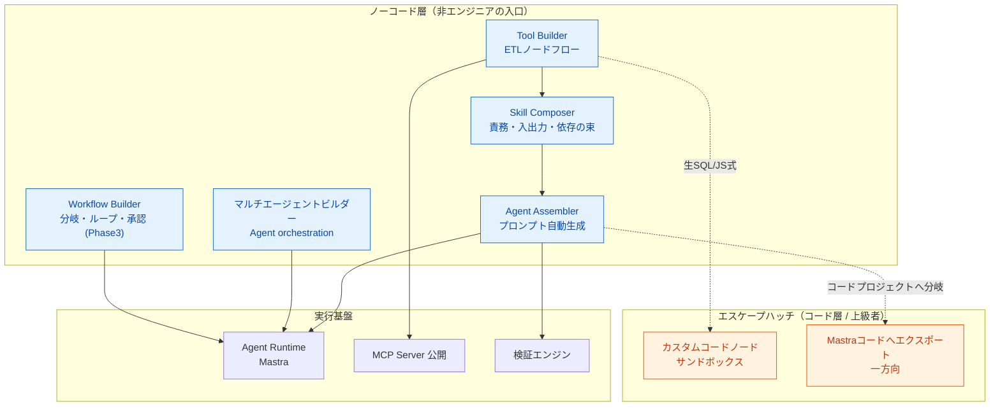

# agentblume 仕様書（ノーコード・エージェントIDE）

> 本ドキュメント群はノーコード・エージェントIDEの初期構想から起こした仕様書である。
> **agentblume** はプロジェクト名。

---

## 1. 一言サマリ

**非エンジニアがノーコードで「ツール開発 → スキル構成 → エージェント作成 → 検証」までを一気通貫で行え、上級者は任意の箇所からコードへ降りられる二層構造のエージェントIDE。**

心臓部は **ETLノードベースのツールビルダー**。LLMには要約・意図解釈・タスク計画だけを担わせ、計算・データ処理・外部実行は検証可能な境界を持つツール側へ委譲する。

---

## 2. ドキュメント索引

| # | ドキュメント | 内容 |
|---|---|---|
| — | [README.md](./README.md) | 本ファイル。製品概要・設計原則・用語集 |
| 01 | [01-architecture.md](./01-architecture.md) | アーキテクチャ図（レイヤ / ヘキサゴナル / コンポーネント / 画面構成） |
| 02 | [02-tech-stack.md](./02-tech-stack.md) | 技術スタックと選定理由 |
| 03 | [03-domain-model.md](./03-domain-model.md) | ドメインモデル（Tool / Skill / Agent / Workflow / Node のER・クラス図） |
| 04 | [04-api-spec.md](./04-api-spec.md) | API仕様（Portインターフェース / REST API / Tool Callingスキーマ） |
| 05 | [05-dependency-graph.md](./05-dependency-graph.md) | 依存グラフとレイヤ依存ルール |
| 06 | [06-etl-tool-builder.md](./06-etl-tool-builder.md) | ETLツールビルダー詳細仕様 |
| 07 | [07-execution-model.md](./07-execution-model.md) | 実行モデル・データフロー（シーケンス図） |
| 08 | [08-security-auth.md](./08-security-auth.md) | セキュリティ・認証認可設計 |
| 09 | [09-roadmap.md](./09-roadmap.md) | ロードマップと検証指標 |
| 10 | [10-memory.md](./10-memory.md) | 長期記憶（LLM Wiki + Skillsベース、`ideas-v3` 由来） |
| 11 | [11-scenario-validation.md](./11-scenario-validation.md) | シナリオ検証（種別疑似ユーザー × 複数ターン会話 × アンケート/感想） |
| 12 | [12-multi-agent.md](./12-multi-agent.md) | マルチエージェント（サブエージェント委譲・単一チャット面・均一Agent抽象） |
| 13 | [13-demo-operation-manual.md](./13-demo-operation-manual.md) | デモデータ操作マニュアル |
| 14 | [14-agent-harness-builder.md](./14-agent-harness-builder.md) | マルチエージェントビルダー仕様（Sequential / Concurrent / Handoff / Group Chat / Magentic） |
| 15 | [15-agent-harness-tutorial.md](./15-agent-harness-tutorial.md) | マルチエージェントの操作チュートリアル |
| 16 | [16-agent-factory.md](./16-agent-factory.md) | Agent Factory（データソース+目的からの自動生成 × 疑似ユーザー検証による自動改善ループ） |
| 17 | [17-operations-runbook.md](./17-operations-runbook.md) | 運用 runbook（バックアップ / 復元 / 引っ越し / ディスク管理 / トラブルシュート） |
| 18 | [18-quickstart.md](./18-quickstart.md) | **クイックスタート**（インストール → 起動 → モデル設定 → サンプル → 自分のデータ） |
| 19 | [19-troubleshooting.md](./19-troubleshooting.md) | **トラブルシューティング**（症状別の対処） |

> **凡例**: 本ドキュメント群では、アイデアに明記された内容を「✅ 記載あり」、本仕様書が補う未決定の提案を「🔷 提案」、採用を決定した提案を「🔶 採用決定」として区別する。

### 読む順のおすすめ

| 立場 | 順路 |
|---|---|
| **はじめて使う** | [18 クイックスタート](./18-quickstart.md) → [13 デモデータ操作](./13-demo-operation-manual.md) → 困ったら [19 トラブルシューティング](./19-troubleshooting.md) |
| **機能を深く知りたい** | [06 ツールビルダー](./06-etl-tool-builder.md) / [16 Agent Factory](./16-agent-factory.md) / [15 マルチエージェント](./15-agent-harness-tutorial.md) / [11 シナリオ検証](./11-scenario-validation.md) |
| **運用する** | [17 運用 runbook](./17-operations-runbook.md) → [08 セキュリティ](./08-security-auth.md) |
| **コードを読む・書く** | 本ファイル → [01 アーキテクチャ](./01-architecture.md) → [05 依存グラフ](./05-dependency-graph.md) → [03 ドメインモデル](./03-domain-model.md) → [04 API仕様](./04-api-spec.md) |

### 用語の注意（Harness / マルチエージェント / 実行オプション）

UIでは「Harness」という語を使わない。設計文書と型名にだけ残っている。

| 概念 | 画面表記（日 / 英） | 設計文書・コード上の名前 |
|---|---|---|
| 複数エージェントのオーケストレーション | **マルチエージェント** / `Multi-Agent` | `AgentHarness` / `HarnessRun` / `/harnesses`（画面ID `Harness`、URL `#/harness`） |
| エージェント1件の実行時機能トグル | **実行オプション** / `Runtime options` | `harness` フィールド（`HarnessSettingsDialog.tsx`） |

この2つは**別の機能**である。ファイル `14-agent-harness-builder.md` / `15-agent-harness-tutorial.md` が旧称のままなのは、バックエンドのソースコメントがこのパスを参照しているため。

---

## 3. 製品コンセプト

- **ノーコード → コードは一方向**。往復同期はしない（設計上の割り切り）。
- カスタムコードノードは「ノーコードプロジェクト内の不透明な1ノード」として再編集可能。
- Mastraコードへのエクスポートは「コードプロジェクトとして分岐」し、以降はIDEの管理対象外。

---

## 4. 設計を貫く5原則（全画面共通）

| # | 原則 | 内容 |
|---|---|---|
| 1 | **プレビュー駆動 (Preview-first)** | 常にサンプルデータを見ながら組む。ノード接続・設定変更のたびに出力スキーマとサンプル行を更新。書き込みはプレビューで実行しない |
| 2 | **エスケープハッチ (Escape hatch)** | ノーコードで詰まった箇所は必ずコードに落とせる出口を用意。ただし一方向 |
| 3 | **段階的開示 (Progressive disclosure)** | 初期は最小フォーム。温度・リトライ・モデルルーティング等は「詳細」に畳む |
| 4 | **即時バリデーション (Inline validation)** | スキーマ不一致・未接続・必須未設定をその場で赤表示。実行前に潰す |
| 5 | **SDK境界の分離 (SDK isolation)** | 外部SDKはPort/Adapterで隔離。ドメイン層・ユースケース層はSDKを直接参照しない |

詳細は [01-architecture.md](./01-architecture.md) と [05-dependency-graph.md](./05-dependency-graph.md) を参照。

---

## 5. 対象ユーザー

| 区分 | 説明 |
|---|---|
| **主対象** | データ加工や業務手順は理解しているが、アプリケーションコードを日常的には書かない業務担当者・アナリスト |
| **副対象** | ノーコードで開始し、必要な部分だけ式・SQL・コードへ降りたい開発者 |
| **運用担当者** | 接続先・権限・公開範囲・実行履歴を管理する管理者 |

---

## 6. 5つのビルダーと責務分離

| ビルダー | 責務 | 実行規則 |
|---|---|---|
| **Tool Builder** | 入力→変換→出力の、可能な限り決定的で再実行可能なデータ変換 | ETL（データ変換） |
| **Workflow Builder** | 複数Toolの接続・分岐・反復・再試行・承認・スケジュール実行 | 制御フロー |
| **マルチエージェントビルダー** (Harness Builder) | 図上の役割へAgent versionを割り当て、複数Agentの制御方式と実行Policyを構成 | マルチエージェント制御 |
| **Agent Builder** | LLMによるSkill/Tool選択・引数生成・構造化応答 | 非決定的（LLM） |
| **Skill Composer** | 責務・入力・出力・依存ツールの束を再利用単位として定義 | 構成（メタデータ） |

> **重要な境界**: 制御ノード（分岐/ループ/try-catch）は実行規則がETLと異なるため、Tool Builderへ混在させず Workflow Builder の責務とする。

---

## 7. v1スコープ（縦切り一本）

`ideas-v2.md §7` の代表ジャーニーをv1で完結させる：

1. CSV/JSONの固定サンプルを読み込む
2. select / filter / rename / cast でデータを変換する
3. 各ノードでサンプル行とスキーマ変化を確認する
4. Tool の Input Schema と Output Schema を確定する
5. Tool を Agent へ接続し、横並びチャットから試す
6. Tool選択・入力・各ノード出力・エラーをトレースで確認する
7. 検証済み構成をバージョン付きで保存する

**v1非目標**: DB直接接続 / MCP外部公開 / カスタムコード実行 / Workflow制御ノード / cron / Webhook / 複数人同時編集。拡張点は先に用意するが機能は詰め込まない。

詳細なフェーズ計画は [09-roadmap.md](./09-roadmap.md) を参照。

---

## 8. 用語集

### 8.1 画面で目にする言葉（利用者向け）

| 用語 | 画面での表れ方 | 定義 |
|---|---|---|
| **Tool（ツール）** | 左ナビ「ツール」 | 「入力 → 変換 → 出力」の検証済みデータ処理部品。LLMを使わず決まった手順で動くので、結果が毎回同じになる。エージェントはこれを呼んで確実な数字や一覧を得る |
| **Skill（スキル）** | 左ナビ「スキル」 | エージェントに渡す軽量なコンテキスト（責務・判断規則）。名前・説明・内容だけで作れる |
| **Agent（エージェント）** | 左ナビ「エージェント」 | システムプロンプト + 構造化出力 + Skill + Tool + Wiki の構成体。チャットの相手になる単位 |
| **マルチエージェント** | 左ナビ「マルチエージェント」 | 複数のエージェントを型付きの連携パターン（Sequential / Concurrent / Handoff / Group Chat / Magentic / Agent as tools）へ組み立てた1つの実行対象。設計文書では `AgentHarness` と呼ぶ |
| **実行オプション（Runtime options）** | エージェント画面のボタン | **エージェント1件**に対する実行時機能のトグル（ファイルメモリ・TODOリスト・コンパクション・Web検索・ツール承認・ツール自動実行）。マルチエージェントとは別物 |
| **データソース** | 左ナビ「データソース」 | ツールが読む元データ。CSV/JSONのアップロード、またはバックエンドで構成済みのDB接続 |
| **Wiki（記憶）** | 左ナビ「記憶」 | エージェントが実行時に検索する長期記憶のページ群。エージェントにチェックしたWikiだけが対象になる |
| **Run（実行）** | チャット・動作確認・ステータス | 1回のエージェント実行。トレース（モデル要求 → ツール呼び出し → ツール結果 → 応答）・トークン数・所要時間を持つ |
| **Trace（トレース）** | 動作確認画面 | 1つのRunの中で起きたイベントの並び。何をどの順で呼んだかを追える |
| **Persona（ペルソナ）** | 検証画面 | 検証で使う疑似ユーザーの人物像（知識レベル・トーン・詳細度・言語など） |
| **Scenario（シナリオ）** | 検証画面 | ペルソナ × 複数ターン会話の検証台本 |
| **Dataset（評価データセット）** | 検証画面 | 評価ケース（入力・参照解答・期待するツール・タグ）の集まり |
| **Evaluator Profile（評価プロファイル）** | 検証画面 | どの指標をどの重みで採点するかの定義。コード採点とLLM judgeを混ぜられる |
| **Judge Rubric** | 検証画面 | LLMに採点させるときの基準表（評価軸・重み・スコア段階） |
| **Experiment（実験）** | 検証画面 | 「エージェント版 × データセット × 評価プロファイル」を一括実行して採点する単位 |
| **品質ゲート（Gate policy / Gate report）** | 検証画面 | 昇格してよいかを判定する閾値ルールと、その判定結果 |
| **昇格（Promotion）** | 検証画面 | ゲート判定に通った版を公開版へ上げる申請と承認 |
| **draft / published** | 各画面のバージョン表示 | 保存直後は draft。検証と品質ゲートを通して人が承認したものだけが published になる。Factoryの生成物はすべて draft |
| **バージョン（`name@1.0.0`）** | 各画面 | ツール・スキル・エージェント・マルチエージェントは保存のたびに新しい版が発行される。参照は版で固定されるので、後から新版を作っても既存の動作は変わらない |
| **checkpoint（チェックポイント）** | チャット・Factory | 承認や追加入力を待って実行が止まっている地点。24時間保存され、応答すると同じ実行が再開する |
| **Artifact（成果物）** | チャット・ツールの出力 | 実行中に作られた表・グラフの実体。DB本体ではなく `<DBファイル>.session-artifacts/` に置かれる |
| **副作用（read-only / session-write / write / external-action）** | ツール画面 | ツールが外部へ与える影響の分類。プレビュー実行は書き込み系を拒否する |
| **下書き（draft restore）** | ツール・スキル・エージェント・マルチエージェント画面 | 編集途中の内容のブラウザ内自動保存。次に開くと「復元」「破棄」を選べる |
| **スコープ（`local / default`）** | 設定画面 | テナントIDとワークスペースIDの組。ローカル実行では固定 |
| **main / judge スロット** | 設定画面 | モデルの用途別の置き場。main はエージェント実行、judge は評価のLLM採点に使う |

### 8.2 設計・実装の言葉（開発者向け）

| 用語 | 定義 |
|---|---|
| **Agent Harness** | バージョン固定Agentを型付きオーケストレーション図へ割り当て、計画・記憶・承認・予算・観測Policyとともに1つの実行対象へ合成する定義。**UI表記は「マルチエージェント」** |
| **Workflow（ワークフロー）** | 複数Toolを接続し分岐・反復・承認・スケジュールで束ねる制御フロー（Phase3） |
| **Node（ノード）** | ETLフロー上の1変換単位（source / transform / analyze / sink / control / custom-code） |
| **Port** | アプリケーションが所有する外部SDK境界のインターフェース |
| **Adapter** | Portの実装。外部SDK固有の型・例外・設定を内部型へ変換 |
| **Composition Root** | Adapterの選択・初期化・依存注入を集約する単一の組み立て地点 |
| **Escape hatch** | ノーコードで表現できない箇所をコードに落とす一方向の出口 |
| **Input Schema** | LLMがToolを呼ぶための Tool Calling 用引数スキーマ |
| **Output Schema** | Tool実行後にアプリ側で検証する出力スキーマ |
| **副作用宣言** | Toolを `read-only / write / external-action` に分類するメタデータ |
| **Principal** | 認証済み主体の内部正規化表現（subject / tenant / groups / claims 等） |
| **Capability** | SDK・認証機能などの対応可否を明示する宣言。暗黙のフォールバックをしない |
| **internalId / workingName / displayName / publishName** | 資産の4つの名前。`internalId`は保存後に変更できない識別子、`publishName`はモデルがツールを呼ぶときの名前、`displayName`は画面表示名 |
