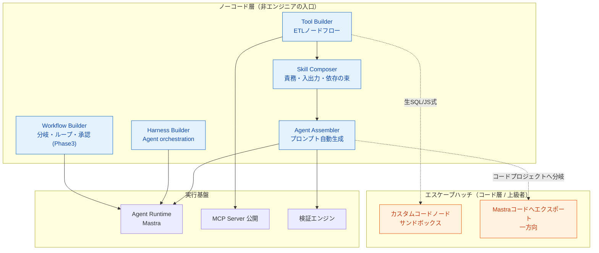

# agentblume 仕様書（ノーコード・エージェントIDE）

> 本ドキュメント群はノーコード・エージェントIDEの初期構想から起こした仕様書である。
> **agentblume** はプロジェクト名。

---

## 1. 一言サマリ

**非エンジニアがノーコードで「ツール開発 → スキル構成 → エージェント作成 → 検証」までを一気通貫で行え、上級者は任意の箇所からコードへ降りられる二層構造のエージェントIDE。**

心臓部は **ETLノードベースのツールビルダー**。LLMには要約・意図解釈・タスク計画だけを担わせ、計算・データ処理・外部実行は検証可能な境界を持つツール側へ委譲する。

---

## 2. ドキュメント索引

| # | ドキュメント | 内容 |
|---|---|---|
| — | [README.md](./README.md) | 本ファイル。製品概要・設計原則・用語集 |
| 01 | [01-architecture.md](./01-architecture.md) | アーキテクチャ図（レイヤ / ヘキサゴナル / コンポーネント / 画面構成） |
| 02 | [02-tech-stack.md](./02-tech-stack.md) | 技術スタックと選定理由 |
| 03 | [03-domain-model.md](./03-domain-model.md) | ドメインモデル（Tool / Skill / Agent / Workflow / Node のER・クラス図） |
| 04 | [04-api-spec.md](./04-api-spec.md) | API仕様（Portインターフェース / REST API / Tool Callingスキーマ） |
| 05 | [05-dependency-graph.md](./05-dependency-graph.md) | 依存グラフとレイヤ依存ルール |
| 06 | [06-etl-tool-builder.md](./06-etl-tool-builder.md) | ETLツールビルダー詳細仕様 |
| 07 | [07-execution-model.md](./07-execution-model.md) | 実行モデル・データフロー（シーケンス図） |
| 08 | [08-security-auth.md](./08-security-auth.md) | セキュリティ・認証認可設計 |
| 09 | [09-roadmap.md](./09-roadmap.md) | ロードマップと検証指標 |
| 10 | [10-memory.md](./10-memory.md) | 長期記憶（LLM Wiki + Skillsベース、`ideas-v3` 由来） |
| 11 | [11-scenario-validation.md](./11-scenario-validation.md) | シナリオ検証（種別疑似ユーザー × 複数ターン会話 × アンケート/感想） |
| 12 | [12-multi-agent.md](./12-multi-agent.md) | マルチエージェント（サブエージェント委譲・単一チャット面・均一Agent抽象） |
| 13 | [13-demo-operation-manual.md](./13-demo-operation-manual.md) | デモデータ操作マニュアル |
| 14 | [14-agent-harness-builder.md](./14-agent-harness-builder.md) | Agent Harness Builder（Sequential / Concurrent / Handoff / Group Chat / Magentic） |
| 15 | [15-agent-harness-tutorial.md](./15-agent-harness-tutorial.md) | マルチエージェントHarnessの操作チュートリアル |
| 16 | [16-agent-factory.md](./16-agent-factory.md) | Agent Factory（データソース+目的からの自動生成 × 疑似ユーザー検証による自動改善ループ） |

> **凡例**: 本ドキュメント群では、アイデアに明記された内容を「✅ 記載あり」、本仕様書が補う未決定の提案を「🔷 提案」、採用を決定した提案を「🔶 採用決定」として区別する。

---

## 3. 製品コンセプト

- **ノーコード → コードは一方向**。往復同期はしない（設計上の割り切り）。
- カスタムコードノードは「ノーコードプロジェクト内の不透明な1ノード」として再編集可能。
- Mastraコードへのエクスポートは「コードプロジェクトとして分岐」し、以降はIDEの管理対象外。

---

## 4. 設計を貫く5原則（全画面共通）

| # | 原則 | 内容 |
|---|---|---|
| 1 | **プレビュー駆動 (Preview-first)** | 常にサンプルデータを見ながら組む。ノード接続・設定変更のたびに出力スキーマとサンプル行を更新。書き込みはプレビューで実行しない |
| 2 | **エスケープハッチ (Escape hatch)** | ノーコードで詰まった箇所は必ずコードに落とせる出口を用意。ただし一方向 |
| 3 | **段階的開示 (Progressive disclosure)** | 初期は最小フォーム。温度・リトライ・モデルルーティング等は「詳細」に畳む |
| 4 | **即時バリデーション (Inline validation)** | スキーマ不一致・未接続・必須未設定をその場で赤表示。実行前に潰す |
| 5 | **SDK境界の分離 (SDK isolation)** | 外部SDKはPort/Adapterで隔離。ドメイン層・ユースケース層はSDKを直接参照しない |

詳細は [01-architecture.md](./01-architecture.md) と [05-dependency-graph.md](./05-dependency-graph.md) を参照。

---

## 5. 対象ユーザー

| 区分 | 説明 |
|---|---|
| **主対象** | データ加工や業務手順は理解しているが、アプリケーションコードを日常的には書かない業務担当者・アナリスト |
| **副対象** | ノーコードで開始し、必要な部分だけ式・SQL・コードへ降りたい開発者 |
| **運用担当者** | 接続先・権限・公開範囲・実行履歴を管理する管理者 |

---

## 6. 5つのビルダーと責務分離

| ビルダー | 責務 | 実行規則 |
|---|---|---|
| **Tool Builder** | 入力→変換→出力の、可能な限り決定的で再実行可能なデータ変換 | ETL（データ変換） |
| **Workflow Builder** | 複数Toolの接続・分岐・反復・再試行・承認・スケジュール実行 | 制御フロー |
| **Harness Builder** | 図上の役割へAgent versionを割り当て、複数Agentの制御方式と実行Policyを構成 | マルチエージェント制御 |
| **Agent Builder** | LLMによるSkill/Tool選択・引数生成・構造化応答 | 非決定的（LLM） |
| **Skill Composer** | 責務・入力・出力・依存ツールの束を再利用単位として定義 | 構成（メタデータ） |

> **重要な境界**: 制御ノード（分岐/ループ/try-catch）は実行規則がETLと異なるため、Tool Builderへ混在させず Workflow Builder の責務とする。

---

## 7. v1スコープ（縦切り一本）

`ideas-v2.md §7` の代表ジャーニーをv1で完結させる：

1. CSV/JSONの固定サンプルを読み込む
2. select / filter / rename / cast でデータを変換する
3. 各ノードでサンプル行とスキーマ変化を確認する
4. Tool の Input Schema と Output Schema を確定する
5. Tool を Agent へ接続し、横並びチャットから試す
6. Tool選択・入力・各ノード出力・エラーをトレースで確認する
7. 検証済み構成をバージョン付きで保存する

**v1非目標**: DB直接接続 / MCP外部公開 / カスタムコード実行 / Workflow制御ノード / cron / Webhook / 複数人同時編集。拡張点は先に用意するが機能は詰め込まない。

詳細なフェーズ計画は [09-roadmap.md](./09-roadmap.md) を参照。

---

## 8. 用語集

| 用語 | 定義 |
|---|---|
| **Tool（ツール）** | 「入力スキーマ → 変換 → 出力スキーマ」の検証済み実行単位 |
| **Skill（スキル）** | 責務・入力・出力・依存ツールの束。再利用単位 |
| **Agent（エージェント）** | システムプロンプト + 構造化出力 + Skill + Tool の構成体 |
| **Agent Harness（ハーネス）** | バージョン固定Agentを型付きオーケストレーション図へ割り当て、計画・記憶・承認・予算・観測Policyとともに1つの実行対象へ合成する定義 |
| **Workflow（ワークフロー）** | 複数Toolを接続し分岐・反復・承認・スケジュールで束ねる制御フロー |
| **Node（ノード）** | ETLフロー上の1変換単位（source / transform / analyze / sink / control / custom-code） |
| **Port** | アプリケーションが所有する外部SDK境界のインターフェース |
| **Adapter** | Portの実装。外部SDK固有の型・例外・設定を内部型へ変換 |
| **Composition Root** | Adapterの選択・初期化・依存注入を集約する単一の組み立て地点 |
| **Escape hatch** | ノーコードで表現できない箇所をコードに落とす一方向の出口 |
| **Input Schema** | LLMがToolを呼ぶための Tool Calling 用引数スキーマ |
| **Output Schema** | Tool実行後にアプリ側で検証する出力スキーマ |
| **副作用宣言** | Toolを `read-only / write / external-action` に分類するメタデータ |
| **Principal** | 認証済み主体の内部正規化表現（subject / tenant / groups / claims 等） |
| **Capability** | SDK・認証機能などの対応可否を明示する宣言。暗黙のフォールバックをしない |
