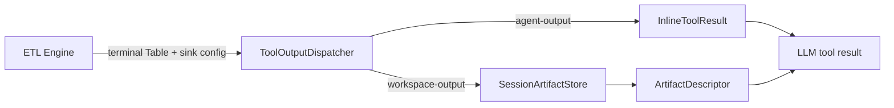

# ADR-0027: Tool出力を明示し、Agent Session Workspaceへ大容量Artifactを退避する

- Status: Accepted
- Date: 2026-07-11
- Context: [06-etl-tool-builder.md](../06-etl-tool-builder.md), [07-execution-model.md](../07-execution-model.md)
- Implementation contract: [implementation/v28-tool-output-session-workspace.md](../../implementation/v28-tool-output-session-workspace.md)
- Related UI decision: [ADR-0028](./0028-structured-node-configuration-ui.md)

## Context

現在のToolグラフは入力・変換ノードを持つが、出次数0のTransformを暗黙の出力として扱う。Agent実行時は終端`Table`全体をJSON化してTool resultへ入れるため、次の問題がある。

- Tool作成者が「何をAgentへ返すか」を明示できない。
- 大量データをLLMコンテキストへ載せる危険があり、token量と応答時間を制御しにくい。
- 後続ToolやサブAgentが中間生成物を再利用する共有場所がない。
- Chat画面の会話履歴はクライアント状態だけで、複数Runを束ねるサーバー側Sessionがない。
- `TenantScope.workspaceId`はプロジェクト分離のための永続Workspaceであり、一時データ置き場に流用すると意味が衝突する。
- 現行`Table`と同期`EtlNode.execute()`は全行をメモリへ展開するため、そのままでは大容量データを安全に扱えない。

設計文書では以前から「LLMへ渡す」と「ワークスペース格納」の2系統を予定していたが、実行契約・保存境界・Session寿命は未定義だった。

## Decision

### 1. Project WorkspaceとSession Workspaceを分離する

`TenantScope.workspaceId`が指す既存のWorkspaceを **Project Workspace** と呼ぶ。新しく導入する一時領域は **Agent Session Workspace** と呼び、コード上は`AgentSession`と`SessionArtifact`で表現する。

- Agent Sessionは1つのルート会話または評価ケースを表し、複数の`RunRecord`を束ねる。
- Sessionは会話履歴を自動的にLLMへ再注入する仕組みではない。履歴管理とArtifact管理は別責務とし、必要な履歴だけを従来どおり明示的に渡す。
- 「新しいチャット」で新Sessionを作る。Agent版の変更時も新Sessionとする。
- サブAgentは親と同じ`sessionId`を継承する。Artifactには作成Agent・Run・Tool・nodeを記録する。
- Sessionは`active -> closed | expired`の状態を持つ。closed/expired後は書き込めない。
- Session Workspaceはプロセス再起動後もTTL内は復元できるが、長期知識ではない。
- Wikiは人手管理された長期知識、Session Workspaceは実行中の作業データとし、自動で相互昇格しない。

### 2. 出力ノードを2種類の明示的なsinkとして追加する

Tool Builderのパレットを`Input / Transform / Output`に分け、次のsinkを追加する。

#### `agent-output`

上流データを決定的に整形し、Tool resultとしてAgentへ直接返す。

```ts
interface AgentOutputConfig {
  readonly shape: 'rows' | 'first-row' | 'single-value' | 'summary';
  readonly format: 'json' | 'markdown-table' | 'chartjs';
  readonly columns?: readonly string[];
  readonly valueColumn?: string;
  readonly maxRows: number;
  readonly maxBytes: number;
  readonly overflow: 'error' | 'store-and-reference';
}
```

- 列選択や行数制限、表現形式の変更だけを担う。filter/join/集計などデータ意味を変える処理はTransformへ置く。
- `maxRows`と`maxBytes`を必須にし、LLMへ無制限に載せない。
- `overflow:'store-and-reference'`は同じSessionへArtifactを書き、参照を返す。暗黙動作になるためUIで明示表示する。
- `chartjs`は可視化用データであり、後述のプロパティグラフとは別物とする。

#### `workspace-output`

上流データをSession WorkspaceへArtifactとして保存し、Agentへは小さな参照だけを返す。

```ts
interface WorkspaceOutputConfig {
  readonly name: string;
  readonly artifactKind: 'table' | 'json' | 'chart' | 'graph' | 'blob';
  readonly writeMode: 'create' | 'replace' | 'append';
  readonly onConflict: 'fail' | 'new-revision';
  readonly previewRows: number;
}
```

Tool resultは次の`ArtifactDescriptor`とし、payload本体は含めない。

```ts
interface ArtifactDescriptor {
  readonly artifactId: string;
  readonly sessionId: string;
  readonly name: string;
  readonly kind: SessionArtifactKind;
  readonly revision: number;
  readonly contentType: string;
  readonly schema?: Schema;
  readonly sizeBytes: number;
  readonly checksum: string;
  readonly counts?: { readonly rows?: number; readonly nodes?: number; readonly edges?: number };
  readonly preview?: unknown;
}
```

### 3. 初期版は終端sinkをちょうど1つにする

- 新規Toolは終端に`agent-output`または`workspace-output`をちょうど1つ持つ。
- sinkは`inputArity:1`、`kind:'sink'`で、出力ハンドルを持たない。
- 既存Toolは出次数0のノードに暗黙の`agent-output`があるものとして読み込み、次回編集時にUI上で明示ノードへ正規化する。
- 1回の実行で複数sinkへfan-outする機能は初期版に含めない。必要ならTransform結果をWorkspaceへ保存してから参照するか、将来Workflowで複数Toolを接続する。

この制約により、現行Engineの「終端ちょうど1つ」を維持できる。

### 4. ETL EngineをI/Oへ依存させない

sinkノードのschema推論と`execute()`は上流Tableをそのまま通す純粋処理とする。実際の整形・保存はApplication層の`ToolOutputDispatcher`がEngine実行後に行う。



これによりdomainのETLノードは外部SDK・ファイル・DBに依存せず、previewでは保存計画だけを返せる。

### 5. Session WorkspaceはNoSQL DBではなくArtifact Storeとする

Session Workspaceは次の2層で構成する。

1. **Artifact Catalog**: ID、名前、kind、schema、サイズ、checksum、作成元、revision、TTLを検索するメタデータ層。
2. **Payload Store**: 大容量payloadをstream/chunkで読み書きする層。

```ts
interface SessionArtifactStore {
  put(input: PutArtifactInput, payload: AsyncIterable<Uint8Array>): Promise<SessionArtifact>;
  open(scope: TenantScope, sessionId: string, artifactId: string): Promise<ArtifactReadHandle>;
  list(scope: TenantScope, sessionId: string, filter?: ArtifactFilter): Promise<readonly SessionArtifact[]>;
  delete(scope: TenantScope, sessionId: string, artifactId: string): Promise<void>;
}
```

- ローカルadapterはSQLite catalog + filesystem payloadを使う。大きなpayloadをSQLite JSON列やRun traceへ埋め込まない。
- 将来adapterはobject storage、document store、graph DBへ差し替えられる。
- `table`はJSONLから開始し、将来Arrow/Parquetへ拡張する。
- `graph`はproperty graphとして`nodes`と`edges`を別streamで保持する。グラフ走査が必要になった段階でGraphQueryPortを追加する。
- 任意JSONを扱える点はNoSQLに近いが、汎用DBの更新・索引・トランザクションをSession Workspaceの責務にはしない。

### 6. LLMへWorkspace全体を注入しない

Agentには組み込みのSession Workspace Toolを公開する。

- `workspace_list`: Artifactの一覧と概要。
- `workspace_describe`: schema、件数、由来、preview。
- `workspace_read`: 表またはproperty graphの範囲読み取り。常にpage/byte上限あり。graphでは`nodes`/`edges`を指定する。
- `workspace_query`: 表のページに対する列選択、単一filter、単一aggregate。任意SQL・任意コードは受け付けない安全な構造化DSLだけ。
- 複数hopの走査やpattern matchは、graph codecとGraphQueryPortを導入する将来段階まで提供しない。

モデルのsystem promptにはWorkspaceの利用規則と小さなmanifestだけを入れる。payloadはモデルが明示的にToolを呼んだ範囲だけ返す。Artifact内の文字列は命令ではなく非信頼データとして区切る。

別のユーザー定義ToolがArtifact全体を入力として処理する経路は、将来の`session-artifact-source`ノードで`artifactId`を解決する。初期版では組み込み`workspace_query`を使い、巨大payloadをAgent引数へ戻して受け渡す方法は許可しない。

### 7. 大容量対応はstream境界から段階導入する

現行Engineは`Table.rows`を全件メモリ保持するため、最初の増分だけで「大量データ処理済み」とはしない。

- M1では既存Tableをstreamへ変換して保存する。inline上限とSession quotaを導入する。
- M2でPayload Storeのchunk read/write、JSONL/graph codec、範囲読み取りを実装する。
- M3でETL内部に`DataHandle`/row batchまたはspill-to-diskを導入し、Transform間の全件materializeを解消する。
- M4でParquet/object storage/query pushdown等をadapterとして追加する。

外部契約をstream基準にしておくことで、M1からM3への移行時にAPIとArtifact参照を壊さない。

### 8. Tool契約をpayload schemaとAgent返却schemaに分ける

既存`Tool.outputSchema`は終端データのpayload schemaとして維持する。追加する`resultContract`がAgentへ返る値を表す。

- `agent-output`: 設定したshape/formatから導出したinline result contract。
- `workspace-output`: 固定の`ArtifactDescriptor` contract。
- 保存時はpayload schemaとsink configの整合性を検証する。
- 実行時は終端Tableを`outputSchema`で検証してからdispatchする。

### 9. Session writeを副作用分類へ追加する

既存の`read-only | write | external-action`へ`session-write`を追加する。

- `agent-output`かつ`overflow:'error'`だけのToolは`read-only`。
- `workspace-output`またはoverflow退避を持つToolは最低`session-write`。
- `session-write`はpreview/testで許可するが、Session境界・quota・traceを必須にする。
- Project Workspaceや外部システムへの永続書き込みは従来どおり`write`/`external-action`で承認対象とする。

### 10. SessionとArtifactの不変条件

- すべての操作を`tenantId + workspaceId + sessionId`で分離する。
- Sessionは固定されたroot Agent versionを持つ。
- Runは必ず`sessionId`を記録する。後方互換APIで省略された場合はRun限定Sessionを自動作成する。
- 書き込みのidempotency keyを`runId + toolCallId + sinkNodeId`とし、retryで重複Artifactを作らない。
- 同名更新はrevisionを増やし、`replace`でも過去revisionをTTL内保持する。
- payloadサイズ、Artifact数、読み取りbyte数、query時間にquotaを設ける。
- traceにはArtifact ID、kind、size、checksum、処理時間だけを保存し、payload本体は保存しない。
- 評価はcase/repetitionごとにSessionを分離し、ケース間でArtifactを共有しない。

## API boundary

```text
POST   /agent-sessions
GET    /agent-sessions/:sessionId
POST   /agent-sessions/:sessionId/close
POST   /runs                              # sessionId optional for compatibility
GET    /agent-sessions/:sessionId/artifacts
GET    /agent-sessions/:sessionId/artifacts/:artifactId
GET    /agent-sessions/:sessionId/artifacts/:artifactId/content?offset&limit
DELETE /agent-sessions/:sessionId/artifacts/:artifactId
```

Chat画面はAgent選択後または初回送信時にSessionを作り、各`POST /runs`へ`sessionId`を渡す。「新しいチャット」は現在Sessionをcloseし、新しいSessionを開始する。

## Defaults and limits

初期ローカルprofileの既定値とし、設定でより小さくできる。無制限設定は認めない。

| 項目 | 既定 |
|---|---:|
| Session TTL | 最終アクセスから24時間 |
| Session総容量 | 1 GiB |
| 1 Artifact | 256 MiB |
| Artifact数 | 1,000 |
| inline Tool result | 64 KiB / 200 rows |
| workspace_read 1回 | 1 MiB |
| workspace_query | tableの最大100行ページに対し実行。列選択、単一filter、単一aggregateのみ |

## Security and lifecycle

- モデルはfilesystem pathやstorage keyを指定しない。opaqueな`artifactId`だけを扱う。
- Artifact名は表示用であり識別・認可には使わない。
- payload codecはpath traversal、zip bomb、巨大JSON、循環参照を拒否する。
- secret-like fieldのtraceマスキングを維持し、Artifact previewにも同じpolicyを適用する。
- Session close/expiry後はGC対象にする。Pin/exportによる長期保存は別の明示的な永続化機能として設計する。
- WorkspaceからWiki、EvaluationDataset、外部DBへの昇格はレビューまたは承認付き操作とし、自動化しない。

## Consequences

### Positive

- Agentへ返す値と一時保存する値がToolグラフ上で明確になる。
- 大量データをLLMコンテキストやRun traceへ混入させず再利用できる。
- root AgentとサブAgentが同一Session内でArtifactを受け渡せる。
- ローカルfilesystemからobject storage/graph DBへPort単位で拡張できる。
- preview/testの一時書き込みと外部副作用を別分類で統制できる。

### Negative

- Chat、Run、Tool executionへ`sessionId`を通す横断変更が必要になる。
- Toolの出力schemaがpayloadとAgent resultの2層になり、UI表示項目が増える。
- 大容量の完全対応にはETLのmaterialize前提を後続で変更する必要がある。
- TTL、quota、GC、同時更新、retry idempotencyの運用責務が増える。

## Rejected alternatives

### 既存`TenantScope.workspaceId`へ一時データを保存する

プロジェクト境界とSession寿命が混ざり、Agent間・会話間の漏洩を防ぎにくいため採用しない。

### すべてのTool resultを自動的にNoSQLへ保存する

保存コストと寿命が不透明になり、Tool作者の意図も表現できないため採用しない。

### ETL sinkからRepositoryを直接呼ぶ

純粋なdomain engineがI/O adapterへ依存し、previewとruntimeの差し替えが困難になるため採用しない。

### 大量データをそのままLLMへ返す

token上限、prompt injection、trace肥大、レイテンシの面で成立しないため採用しない。
