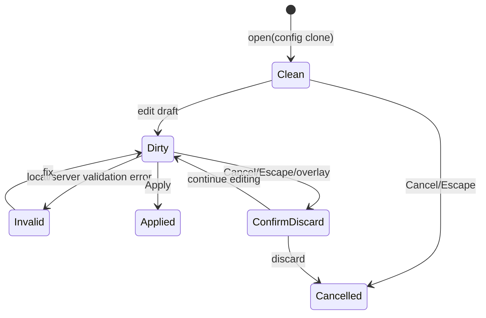

# ADR-0028: Tool node設定を構造化コントロールと段階的ダイアログで編集する

- Status: Proposed
- Date: 2026-07-11
- Context: [06-etl-tool-builder.md](../06-etl-tool-builder.md), [ADR-0027](./0027-tool-output-and-session-workspace.md)
- Implementation contract: [implementation/v28-tool-output-session-workspace.md §7](../../implementation/v28-tool-output-session-workspace.md#7-tool-builder-ui)

## Context

現在のTool Builderは中央Canvasの右に幅290pxのNode Inspectorを置き、多くの設定を文字列として入力させている。

- `select` / `distinct`: `id, name`のカンマ区切り。
- `rename`: 1行に`from:to`。
- `cast`: 1行に`column:type`。
- `sort`: 1行に`column:direction:nulls`。
- `replace`: 1行に`column:from:to`。
- Agent input schema: 1行に`name:type:required|optional`。
- JSON/CSV source: payload全体をtextareaへ直接入力。

この方式は実装量が少ない一方、利用者が構文を覚える必要があり、列名・型・演算子の候補を十分に活用できない。区切り文字を値として使う場合の曖昧さ、途中入力による大量のvalidation error、290px内での横幅不足も生じる。Output nodeとSession Workspace設定を追加すると、単一sidebarへすべて詰め込む設計はさらに成立しにくい。

## Decision

### 1. Sidebarは概要とQuick settings、Dialogは本編集を担う

設定UIを次の2層に分ける。

#### Node Inspector sidebar

- node名、kind、説明、schema状態、上流/出力schemaの概要。
- 1〜3個で完結する単純な設定。
- 現在設定の人間向けsummary。
- validation issueと該当項目への導線。
- `設定を開く`ボタン。

#### Node Configuration dialog

- 反復行、複数列、schema、payload、previewを伴う設定。
- 2列以上を必要とするrule editor。
- Basic / Advanced / Previewの段階的開示。
- Apply / Cancelによるtransactional edit。

Dialog利用は画面幅だけではなく設定の複雑さで決める。反復項目、4項目以上、表形式、source payload、左右入力を扱うeditorは広い画面でもDialogを既定とする。狭い画面では本来inlineのeditorもDialogへ昇格できる。

### 2. 文字列構文をprimary UIから除去する

通常操作では次の構造化コントロールを使う。

| 設定 | Primary control |
|---|---|
| 上流列1つ | 検索可能なsingle-select combobox |
| 上流列複数 | multi-select combobox + 並べ替え可能chip |
| 型 | enum select (`string/number/boolean/date/null/unknown`) |
| 演算子 | 選択列の型で絞ったselect |
| boolean | checkboxまたはtrue/false select |
| number | `input[type=number]` |
| date | `input[type=date|datetime-local]` |
| null | 明示的な`null`選択肢。空文字と区別 |
| join key | 左列combobox + 右列comboboxのrule row |
| rename | 元列combobox + 新しい列名input |
| cast | 列combobox + 変換先型select |
| sort | 列combobox + asc/desc + null first/last |
| fill-null | 列combobox + strategy + typed value |
| replace | 列combobox + typed from + typed to |
| Agent input schema | name、type、required、sampleのschema table |
| JSON source | row table editor。Advancedでraw JSON |
| CSV source | file/paste、delimiter select、header/infer toggle、table preview |
| Output shape/format/kind | enum combobox + 条件付きfield |

raw JSON/CSVや文字列構文は削除せず、Advancedタブのエスケープハッチにする。AdvancedからBasicへ戻れるのは構造化値へ正しくparseできた場合だけとする。

### 3. Comboboxは候補選択を既定にし、不明schemaだけ手入力を許す

- upstream schemaが`confirmed/inferred/partial`なら既知列だけを候補にする。
- 100列を超える場合は検索を常時表示し、200列を超える場合は候補listをvirtualizeする。
- schemaが`unknown`ならdisabled explanationを表示し、「上流を接続・設定してください」を第一導線にする。
- 推論不能な外部source等で必要な場合だけAdvancedの`Custom column name`を許可し、warningを付ける。
- 上流変更で選択済み列が消えても値を黙って削除しない。invalid chipとして保持し、置換を要求する。
- joinの左右候補を混ぜず、型互換な候補を上位表示する。

### 4. TypedValueInputを共通化する

filter、fill-null、replace、sample valueは同じ`TypedValueInput`を使う。

```ts
interface TypedValueInputProps {
  readonly dataType: DataType;
  readonly nullable: boolean;
  readonly value: JsonCell | undefined;
  readonly allowUndefined?: boolean;
  readonly onChange: (value: JsonCell | undefined) => void;
}
```

- 数値文字列を暗黙に文字列として保存しない。
- 空文字、null、未指定を別状態として扱う。
- dateはUI表示と保存形式（ISO 8601）を分離する。
- column type変更時は値を無断変換せず、互換なら明示変換、非互換ならerrorにする。

### 5. 反復設定はRule Tableで編集する

rename/cast/join/sort/fill-null/replaceを共通の`RuleTable` shellで扱う。

- 行追加、削除、複製、ドラッグまたは上下ボタンによる並べ替え。
- 行単位errorと全体errorを分離。
- keyboardだけで行追加・移動・削除ができる。
- 列幅が足りなければ横スクロールではなくDialog幅を使う。
- rule順序に意味があるnodeは番号を表示する。
- bulk paste/importはAdvanced機能とし、通常入力に構文を要求しない。

個別node editorは共通shellを使うが、すべてを汎用JSON Schema formへ押し込まない。joinの左右schemaやreplaceの型連動など、node固有の振る舞いは専用componentが所有する。

### 6. Dialog編集はtransactionalにする

Dialogを開いた時点でnode configをlocal draftへ複製する。



- 編集途中の不完全configをZustandの正式graphへ逐次反映しない。
- Apply時に1回の`updateNodeConfig`で原子的に反映し、undo履歴も1操作にする。
- Applyはlocal validationとserver infer-schemaが成功した場合だけ有効。
- Previewタブはdialog draftを非永続draft APIへ送り、Canvasの正式previewとは区別して表示する。
- 別node選択、version load、画面遷移時にdirty draftがあればdiscard確認を出す。

単純なsidebar quick settingは従来どおり即時反映してよい。ただし同じ設定をDialogでも編集する場合は単一のconfig serializer/validatorを共有する。

### 7. UI editor registryを導入する

巨大な条件分岐になっている`NodeInspector.tsx`を、UI層のregistryとnode別editorへ分割する。

```ts
interface NodeEditorDefinition {
  readonly nodeType: ToolNodeType;
  readonly preferredMode: 'inline' | 'dialog';
  readonly summary: (config: NodeConfig, context: NodeEditorContext) => readonly SummaryItem[];
  readonly validateDraft: (config: NodeConfig, context: NodeEditorContext) => readonly FieldIssue[];
  readonly Editor: React.ComponentType<NodeEditorProps>;
}
```

予定component:

```text
src/ui/tool-builder/config/
  NodeConfigDialog.tsx
  node-editor-registry.ts
  controls/
    ColumnCombobox.tsx
    MultiColumnCombobox.tsx
    TypedValueInput.tsx
    RuleTable.tsx
    SchemaTable.tsx
  editors/
    AgentInputEditor.tsx
    SourceEditors.tsx
    SelectFilterEditors.tsx
    JoinUnionEditors.tsx
    ColumnRuleEditors.tsx
    OutputEditors.tsx
```

UIは引き続きwire DTOだけを所有し、domain/applicationをimportしない。最終的なconfig正当性はserver側`EtlNode.validateConfig`を権威とする。UI validationは即時feedbackのための補助であり、server検証を置き換えない。

### 8. Dialog layout

- native `<dialog>`のtop layerを使用し、builderのgrid幅から独立させる。
- 幅は`min(960px, calc(100vw - 48px))`、高さは最大`calc(100vh - 48px)`。
- Header: node kind、node名、node id、schema state、close。
- Body: 左側section navigationまたはtabs、中央editor、必要時に右側preview。狭い画面では縦積み。
- Footer: validation summary、Cancel、Apply。
- 長いrule listはBodyだけをscrollし、Header/Footerを固定する。
- error発生時は最初のinvalid fieldへ移動できる。

### 9. Accessibility and keyboard

- Dialogは`aria-labelledby`と説明を持ち、open時に先頭field、close時に呼び出しbuttonへfocusを戻す。
- Escapeはcleanならclose、dirtyならdiscard確認。
- ComboboxはWAI-ARIA combobox/listbox pattern、上下キー・Enter・Escape・typeaheadに対応する。
- chipとrule rowの削除buttonには対象を含むaccessible nameを付ける。
- 色だけでinvalid/selected/schema stateを伝えない。
- pointer操作を要求せず、rule順変更に上下buttonも用意する。

### 10. Validation UX

- field errorは該当control直下、node errorはDialog上部summaryとCanvas node badgeへ表示する。
- error messageには構文ではなく修正方法を記載する。
- server issueの`column`をfield pathへmapし、可能なら該当rule rowをfocusする。
- Apply前のwarningは許可するが、確認が必要なwarning（型損失、inline overflow、列消失）は明示する。
- Output editorではLLMへ渡るbyte/token概算とWorkspaceへ保存される推定sizeを常時表示する。

## Node-specific placement

| Node | Sidebar quick settings | Dialog editor |
|---|---|---|
| agent-input | 列数、required数 | schema table、sample values |
| json-source | row数、schema概要 | row table、raw JSON、preview |
| csv-source | filename/row数 | upload/paste、delimiter、preview |
| select | 選択列chips（少数時） | searchable multi-select、順序 |
| filter | column/operator/value | 条件拡張時のみDialog |
| rename/cast | rule数summary | Rule Table |
| join | mode、key数summary | 左右key Rule Table、suffix、preview |
| union | strict toggle | schema差分preview |
| sort | key数summary | ordered Rule Table |
| distinct | 対象列summary | multi-select |
| fill-null/replace | rule数summary | typed Rule Table |
| agent-output | delivery summary、limit | shape/format/columns/overflow/preview |
| workspace-output | artifact名、kind | write/conflict/schema/size/descriptor preview |

## Consequences

### Positive

- 構文を覚えず、schema候補から安全に設定できる。
- 複雑なrule編集に十分な幅を確保できる。
- Apply単位の変更となり、編集中の無効graphによるpreview requestを削減できる。
- node別editorを分割し、Node Inspectorの保守性が上がる。
- Output nodeのsize、delivery、Artifact設定を理解しやすくなる。

### Negative

- draft state、discard確認、Dialog内previewの状態管理が増える。
- accessible comboboxとRule Tableには相応の実装・テストコストがある。
- UI DTOとdomain configの二重表現が残るため、contract testが必要になる。
- raw textの一括編集に慣れた利用者はAdvancedタブへ1段多く移動する。

## Rejected alternatives

### Sidebarを単純に広げる

Canvas領域を圧迫し、反復ruleやsource previewには依然不十分なため採用しない。

### すべてをDialogにする

単純toggleや1項目変更までmodal操作になり、作業速度を落とすため採用しない。

### JSON Schemaからすべてのformを自動生成する

基本fieldには有効だが、左右schemaを持つjoin、型連動value、preview、rule順序などのnode固有UXを表現しにくいため、初期設計の中心にはしない。

### datalistを全項目で使う

複数選択、invalid option保持、virtualization、詳細なkeyboard制御が不足するため、検索可能comboboxを共通componentとして実装する。
