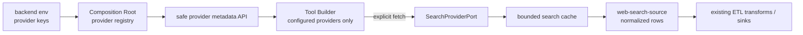

# ADR-0030: Optional Web Search Providers for ETL

> Status: Accepted (2026-07-12)

## Context

ETL Tool BuilderへWeb検索を入力ノードとして加える。Tavily、TinyFish、Google Custom Searchは有用な検索結果を返せる一方、APIキー、従量課金、レート制限、外部送信する検索語、結果の再現性を管理する必要がある。特に通常のETLプレビューを編集のたびに自動実行すると、利用者の意図に反して外部アクセスと課金が発生する。

このADRは「環境に設定されたproviderだけを安全に見せ、検索結果を再利用可能な表としてETLへ渡す」境界を定める。初期実装は明示取得、プロセス内TTLキャッシュ、Tool graphからのcacheKey参照までを扱う。

## Decision

### Providerの有効化と画面表示

Composition Rootは環境変数を読み、必要な値が揃うproviderだけを`SearchProviderPort`の実装として登録する。

| Provider | 必須環境変数 | UI表示 |
|---|---|---|
| Tavily | `TAVILY_API_KEY` | `Tavily Search` |
| TinyFish | `TINYFISH_API_KEY` | `TinyFish Search` |
| Google Custom Search | `GOOGLE_CUSTOM_SEARCH_API_KEY`、`GOOGLE_CUSTOM_SEARCH_ENGINE_ID` | `Google Custom Search (legacy)` |

- `GET /search-providers`は、有効providerの`id`、表示名、対応する任意filterだけを返す。キー、接続設定、残高、完全な環境変数名は返さない。
- 有効providerがない場合、UIはWeb検索ノード、source種別、設定Dialogを描画しない。
- 無効providerを参照する過去のTool定義や直接API呼出は、実行時に`provider_not_configured`として拒否する。UIの非表示は認可・安全性の代替にしない。
- provider一覧は起動時固定とする。キーの変更・削除はbackend再起動または明示的な設定再読込で反映する。



この経路により、ブラウザはキーに触れず、未設定providerは選択肢にも現れない。検索の結果だけが、通常のsourceノードと同じ表形式で後続の変換へ渡る。

### Tool graph契約

新しいsourceノードを`web-search-source`とし、概念上の設定を次のようにする。

```ts
type WebSearchSourceConfig = {
  provider: 'tavily' | 'tinyfish' | 'google-custom-search';
  query:
    | { source: 'literal'; value: string }
    | { source: 'agent-input'; field: string };
  maxResults: number; // 1..10
  includeDomains?: string[];
  freshness?: 'day' | 'week' | 'month';
};
```

- Agent Input bindingは既存の条件バインドと同じ保存時検証を行う。`field`がToolの入力schemaになければ保存できない。
- provider固有レスポンスをTool graphに持ち込まず、`title`、`url`、`snippet`、`score`、`provider`、`retrievedAt`の行へ正規化する。未提供の値は`null`とする。
- 初期範囲は検索だけであり、任意URLの本文取得、ブラウザ自動操作、検索結果からの追跡収集は含めない。これはSSRF、サイズ無制限、コンテンツ取得ポリシーを別途設計するためである。

### 明示取得、キャッシュ、実行モード

`web-search-source`は外部I/Oであり、通常の自動draft previewでは呼び出さない。

| モード | 検索provider呼出 | 使用データ |
|---|---|---|
| 編集中の自動preview | 禁止 | 既存キャッシュ。なければ空schema preview |
| `検索結果を取得`操作 | 明示時だけ許可 | backendが取得し、TTL付きキャッシュへ保存 |
| test / production | 初期実装では禁止 | 有効キャッシュのみ |

キャッシュにはprovider、query hash、取得時刻、TTL、結果件数、正規化済み行だけを保持する。キーや認可headerは保存・表示・trace出力しない。queryそのものは利用者データになり得るため、telemetryでは既定でhashだけを記録する。

初期実装はproviderごとに10秒timeout、最大10件、64KiB応答サイズ上限を強制する。キャッシュはプロセス内にだけ保持し、15分で失効する。同時実行数、時間あたりの呼出上限、利用量・予算の上限、永続キャッシュは将来の組織ポリシーで追加する。

### Provider adapter

`SearchProviderPort`は`search(request): Promise<NormalizedSearchResult[]>`だけを公開し、HTTP、認証、provider固有query、レスポンス形式、エラー分類をadapterへ閉じ込める。

- Tavily adapterは公式のSearch APIを使う。
- TinyFish adapterは公式のSearch APIだけを対象にする。Fetch、Agent、Browser APIは初期範囲外とする。
- Google adapterはCustom Search JSON APIを使うが、Googleが既存顧客の移行期限を案内しているため、他providerと置換可能なlegacy adapterとして隔離する。新規環境の推奨値にしない。

## Consequences

- 利用者は設定済み検索providerだけを選べるため、利用不能な選択肢やキー入力欄を見ない。
- 自動プレビューが検索を起動しないため、編集中の課金・外部アクセスを避けられる。一方、最新結果を使うには明示取得または本番実行の承認が必要になる。
- 正規化した小さな検索結果だけをETLへ渡すため、後続ノードのschema契約はproviderに依存しない。
- provider固有の検索品質・課金・利用規約は統一できない。利用可能なfilterはcapabilityとして返し、未対応filterを暗黙に無視しない。

## Implementation sequence

1. ✅ `SearchProviderPort`、environment provider registry、`GET /search-providers`を追加し、キーがない環境で検索UIが出ないことをテストする。
2. ✅ `web-search-source`を`json-source`へ解決し、provider未設定・cache不一致時をfail closedにする。
3. ✅ Tavily / TinyFish / Google legacy adapter、明示取得API、15分TTL付きプロセス内キャッシュ、件数・サイズ・timeout制限を追加する。
4. キャッシュ永続化、テナント別の同時実行数・利用量上限、監査用のquery hashを追加する。
5. Agent Inputで検索語をbindし、本番実行での明示更新を`external-action`承認と接続する。

## References

- [Tavily Search API](https://docs.tavily.com/documentation/api-reference/endpoint/search)
- [TinyFish developer documentation](https://docs.tinyfish.ai/)
- [Google Custom Search JSON API overview](https://developers.google.com/custom-search/v1/overview)
