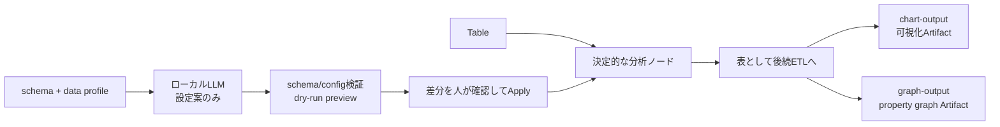

# ADR-0031: 分析計算・可視化出力・ローカルLLM設定補助を分離する

- Status: Accepted (initial implementation in progress)
- Date: 2026-07-13
- Context: [06-etl-tool-builder.md](../06-etl-tool-builder.md), [ADR-0027](./0027-tool-output-and-session-workspace.md), [ADR-0028](./0028-structured-node-configuration-ui.md)
- Implementation contract: [implementation/v31-analytics-chart-output-llm-assistance.md](../../implementation/v31-analytics-chart-output-llm-assistance.md)

## Context

Tool Builderには列選択・行フィルターなどの決定的なETLノードと、Agent/Session Workspaceへの出力ノードがある。一方、データを調査するための次の機能は未実装である。

- 基本統計量
- 相関分析
- 時系列集計・移動統計
- 外れ値の検出と除外
- 分析結果に適したヒストグラム、箱ひげ図、相関ヒートマップ、時系列グラフ

これらは列型、欠損値、集計単位、閾値などの設定項目が多い。設定をLLMへ全面委任すると、同じToolでも結果が変わる、存在しない列を参照する、任意コードを生成する、入力データ中の命令文に影響される、といった問題が生じる。

また、日本語UIでいう「グラフ」には、可視化チャートとproperty graphの2つの意味がある。既存`graph-output`は後者であり、時系列チャートを同じ契約へ追加するとArtifactとUIの責務が曖昧になる。

## Decision

### 1. 計算、可視化、LLM補助を別の境界にする



- 分析ノードの実行結果は常に通常の`Table`とし、後続ノードから再利用できる。
- 数値計算は純粋関数で実装し、保存済みToolの実行時にLLMを呼ばない。
- `chart-output`は可視化用Chart Artifactを保存する専用sinkとする。
- `graph-output`はproperty graph専用のまま維持し、相関ネットワーク用presetを追加する。
- ローカルLLMは設定案を厳格なJSONで返すだけとし、graphを直接変更・保存・実行しない。

### 2. 追加する分析ノード

すべて`kind: 'analyze'`、`inputArity: 1`とする。設定には`configVersion: 1`を持たせる。

#### `summary-statistics`

設定:

```ts
interface SummaryStatisticsConfigV1 {
  readonly configVersion: 1;
  readonly columns: readonly string[];
  readonly groupBy: readonly string[];
  readonly metrics: readonly ('valid-count' | 'missing-count' | 'unique-count' |
    'sum' | 'mean' | 'stddev' | 'min' | 'q1' | 'median' | 'q3' | 'max')[];
  readonly variance: 'sample' | 'population';
}
```

出力は1グループ・1対象列につき1行のlong形式とする。`groupBy`列に続けて`column`、`rowCount`、選択したmetric列を持つ。動的な列名を対象列名から生成しないため、後続schemaとチャート設定が安定する。

- 平均・分散は浮動小数点誤差を抑えるオンラインアルゴリズムを使う。
- 四分位数はR-7相当のlinear interpolationで固定し、実装差をなくす。
- 数値へ暗黙castせず、非数値列は保存前のschema検証で拒否する。

#### `correlation-analysis`

設定:

```ts
interface CorrelationAnalysisConfigV1 {
  readonly configVersion: 1;
  readonly columns: readonly string[];
  readonly method: 'pearson' | 'spearman';
  readonly missing: 'pairwise' | 'listwise';
  readonly minPairs: number;
  readonly includeDiagonal: boolean;
}
```

出力は`columnX`、`columnY`、`coefficient`、`absoluteCoefficient`、`pairCount`のlong形式とする。描画側が対称セルを補い、property graph化では対角成分を除く。

- Spearmanの同順位はaverage rankとする。
- 分散0、データ不足、非有限値だけの組み合わせは`coefficient: null`と警告を返す。
- `pairwise`を既定とするが、欠損処理はTool定義に保存され、実行ごとに変えない。

#### `time-series-analysis`

設定:

```ts
interface TimeSeriesAnalysisConfigV1 {
  readonly configVersion: 1;
  readonly timeColumn: string;
  readonly valueColumns: readonly string[];
  readonly groupBy: readonly string[];
  readonly timezone: string;
  readonly interval: 'minute' | 'hour' | 'day' | 'week' | 'month';
  readonly aggregate: 'count' | 'sum' | 'mean' | 'min' | 'max';
  readonly fill: 'none' | 'zero' | 'forward';
  readonly window?: { readonly operation: 'moving-mean' | 'moving-sum'; readonly size: number };
  readonly comparison?: { readonly lag: number; readonly output: readonly ('delta' | 'percent-change')[] };
}
```

出力は`groupBy`列、`bucketStart`、`series`、`value`、`sampleCount`と、設定された`movingValue`、`delta`、`percentChange`を持つlong形式とする。

- `timeColumn`はdate/datetime型を必須とし、文字列は先に`cast`で明示変換する。
- timezoneはIANA名で保存し、未指定のローカルtimezoneへ依存しない。
- 月・週は固定ミリ秒ではなくカレンダー境界で集計する。
- 初期版では予測、季節分解、補間、DSTを無視した固定時差処理を行わない。

#### `outlier-filter`

設定:

```ts
interface OutlierFilterConfigV1 {
  readonly configVersion: 1;
  readonly columns: readonly string[];
  readonly groupBy: readonly string[];
  readonly method: 'iqr' | 'z-score' | 'mad';
  readonly threshold: number;
  readonly action: 'flag' | 'exclude';
  readonly nulls: 'keep' | 'exclude';
  readonly flagColumns?: {
    readonly isOutlier: string;
    readonly score: string;
    readonly reason: string;
  };
}
```

複数列のうち1列でも条件を満たせばその行を外れ値とする。`flag`は入力列へ判定列を追加し、`exclude`は対象行を除く。除外時もpreview/traceへ入力行数、出力行数、除外行数、method、thresholdを診断情報として残す。

- IQRの既定thresholdは`1.5`、z-scoreは`3`、MADは`3.5`とする。
- MADは中央値からの絶対偏差を使い、正規分布との比較用scale factorを`1.4826`で固定する。
- 外れ値の削除を不可逆な前処理として隠さない。UIではまず`flag`を推奨し、除外前後を比較表示する。
- 時系列の季節性を考慮した異常検知は別ノードとし、初期版へ含めない。

### 3. 分析診断をTableとは別に返す

`EtlNode.execute()`の戻り値は後方互換のため`Table`のまま維持する。分析固有の警告と件数はEngineの実行診断へ追加する。

```ts
interface NodeExecutionDiagnostic {
  readonly nodeId: string;
  readonly code: string;
  readonly severity: 'info' | 'warning';
  readonly message: string;
  readonly details?: Readonly<Record<string, unknown>>;
}
```

診断はAgentへ無制限に渡さず、Tool traceとBuilder previewに表示する。エラーは従来どおりfail closedとする。

### 4. 可視化は`chart-output`で型付けする

`workspace-output`の`artifactKind: 'chart'`へ任意JSONを入れる方式は後方互換として残す。新規UIでは専用`chart-output`を使い、`ChartSpecV1`を生成する。

```ts
type ChartMappingV1 =
  | { readonly chartType: 'histogram'; readonly valueColumn: string; readonly bins: number }
  | { readonly chartType: 'box-plot'; readonly categoryColumn?: string; readonly valueColumn: string }
  | { readonly chartType: 'scatter'; readonly xColumn: string; readonly yColumn: string; readonly seriesColumn?: string }
  | { readonly chartType: 'correlation-heatmap'; readonly xColumn: string; readonly yColumn: string; readonly coefficientColumn: string }
  | { readonly chartType: 'time-series'; readonly timeColumn: string; readonly valueColumn: string; readonly seriesColumn?: string }
  | { readonly chartType: 'outlier-overlay'; readonly xColumn: string; readonly valueColumn: string; readonly flagColumn: string };

interface ChartOutputConfigV1 {
  readonly configVersion: 1;
  readonly name: string;
  readonly mapping: ChartMappingV1;
  readonly title?: string;
  readonly maxPoints: number;
  readonly downsample: 'none' | 'lttb';
  readonly writeMode: 'create' | 'replace';
  readonly onConflict: 'fail' | 'new-revision';
}
```

`ChartSpecV1`はChart.js固有JSONではなく、chart type、軸、series、bounded data、警告を持つアプリ内部契約とする。UI adapterがChart.jsへ変換する。これにより保存形式をrendererから分離し、任意JavaScriptをArtifactへ保存しない。

分析ノードごとの推奨chartは次とする。

| 分析 | 推奨chart | 必須mapping |
|---|---|---|
| 基本統計・分布確認 | histogram / box-plot | raw表の対象列、または集計済み四分位値 |
| 相関 | correlation-heatmap / scatter | `columnX`, `columnY`, `coefficient` |
| 時系列 | time-series | `bucketStart`, `series`, `value` |
| 外れ値 | outlier-overlay / box-plot | 軸、値、外れ値flag |

大量データは`maxPoints`で制限する。時系列はLTTB、散布図は決定的samplingを利用し、切り詰め・sampling方法・元件数をArtifact metadataへ記録する。AgentへはArtifact descriptorと小さなpreviewだけを返す。

### 5. `graph-output`は相関ネットワークを扱えるようにする

property graph側には`mode: 'edge-list' | 'correlation-network'`を追加する。

- `edge-list`は現在のsource/target列mappingと同じで後方互換を維持する。
- `correlation-network`は`columnX`/`columnY`をnode、相関係数をedge propertyとして保存する。
- `minimumAbsoluteCoefficient`、`minimumPairCount`でedgeを絞り、自己edgeと対称重複を除く。
- edgeには`coefficient`、`absoluteCoefficient`、`pairCount`、`method`を保存する。

時系列線グラフをproperty graphへ変換しない。可視化は`chart-output`、関係探索は`graph-output`という区別をUIの名称と説明に明記する。

### 6. ローカルLLMは検証可能な設定案だけを返す

新しいapplication use case `SuggestAnalysisConfigUseCase`とAPIを追加する。

```http
POST /tool-drafts/suggest-analysis-config
```

要求はscope、未保存graph、対象node ID、ユーザーの目的、任意のsample利用許可を含む。backendは対象node直前までをpreviewし、次の情報だけをLLMへ渡す。

- 上流schemaと型
- backendで決定的に計算したnull率、distinct数、最小・最大、時刻範囲などのprofile
- 現在の対象node設定
- ユーザーが入力した分析目的
- 明示許可された場合だけ、最大20行かつ8 KiBまでのマスキング済みsample

応答は`responseFormat.strict = true`のJSON Schemaで固定する。

```ts
interface AnalysisConfigProposalV1 {
  readonly proposalVersion: 1;
  readonly nodeId: string;
  readonly nodeType: string;
  readonly config: Readonly<Record<string, unknown>>;
  readonly rationale: readonly string[];
  readonly assumptions: readonly string[];
  readonly warnings: readonly string[];
  readonly suggestedChart?: {
    readonly mapping: ChartMappingV1;
  };
}
```

backendはLLM応答を次の順に検証する。

1. JSON Schema/Zod検証
2. 対象node ID/type一致
3. nodeの`validateConfig`
4. Engineによるschema伝播
5. bounded dry-run preview

成功時もgraphへ自動適用しない。UIは現在値との差分、理由、仮定、警告、previewをDialogで表示し、ユーザーの`Apply`で初めてlocal draftへ反映する。保存はさらに既存のTool保存操作を必要とする。

LLMに新規node作成、任意コード、SQL、式、秘密情報、DB接続情報の生成を許可しない。入力データの文字列は非信頼データとして区切り、そこに含まれる命令へ従わないようsystem promptと構造を固定する。

### 7. 機能の表示条件とフォールバック

backendはruntime capabilityとして次を返す。

```ts
interface AnalysisAssistantCapability {
  readonly enabled: boolean;
  readonly provider: 'lm-studio';
  readonly structuredOutput: boolean;
  readonly includeSamplesDefault: false;
}
```

`LM_STUDIO_MODEL`が空、providerがstructured output非対応、または`ANALYSIS_ASSISTANT_ENABLED=false`の場合、LLM補助ボタンを非表示にする。分析ノードと手動設定UIは常に利用できる。LLMを使わない「推奨初期値」ボタンはschema/profileに基づく決定的ルールで提供する。

### 8. UI

- node paletteに「分析」groupを設け、4つの分析ノードを配置する。
- 右Inspectorには選択済み列、method、主要な警告だけを表示する。
- 詳細設定はADR-0028のtransactional Dialogで、基本/詳細タブ、schema連動combobox、multi-selectを使う。
- Dialogに「推奨初期値」と、capabilityがある場合だけ「ローカルLLMで設定案」を表示する。
- 外れ値は除外前後の件数、相関は有効pair数、時系列は解釈したtimezoneとbucket数をpreviewに表示する。
- chart previewとproperty graph previewは見出し、アイコン、説明を分ける。
- 新規フォームは空値と日本語placeholderの原則を維持し、実データ値を初期値にしない。

## Limits

初期の安全上限はbackendで強制し、UIだけに依存しない。

- 分析対象列: 基本統計50、相関30、時系列10、外れ値20
- group数: 1,000
- 相関pair数: 435（30列の非対角上三角）と、設定時は最大30の対角成分
- chart点数: 5,000
- LLMへ渡すsample: 20行かつ8 KiB
- preview: 現行のdraft preview上限内

上限超過は暗黙切り捨てではなく、設定エラーまたは明示的なsampling警告にする。ETL全体は現在`Table`をmaterializeするため、ストリーミング統計とspill-to-diskは後続課題とする。

## Consequences

### Positive

- 保存済みToolはLLMの有無にかかわらず再現可能になる。
- 分析表をAgent出力、Chart、property graphのいずれにも再利用できる。
- 設定の難しさをLLMで補助しつつ、誤った列参照や無検証の自動変更を防げる。
- Chart Artifactがrenderer非依存となり、大量データをLLM contextから退避できる。

### Negative

- node計算、診断、ChartSpec、LLM提案の契約が増える。
- histogram用binningなど、分析表から直接得られない可視化変換が必要になる。
- local modelによって提案品質は変わるため、提案の正しさは保証できず、previewと人手確認が必須になる。

## Rejected alternatives

- **実行時にLLMが分析方法を選ぶ:** 再現性、監査性、テスト可能性を失うため不採用。
- **LLMにPython/SQLを生成させて実行する:** 任意コード実行とデータ漏洩の境界が大きすぎるため不採用。
- **Chart.js JSONを直接保存する:** rendererへ永続形式が密結合し、任意optionの検証が困難なため不採用。
- **可視化も`graph-output`へ統合する:** property graphとチャートの意味・保存形式・閲覧方法が異なるため不採用。
- **外れ値を常に自動削除する:** 分析者が除外理由と影響を確認できないため不採用。
