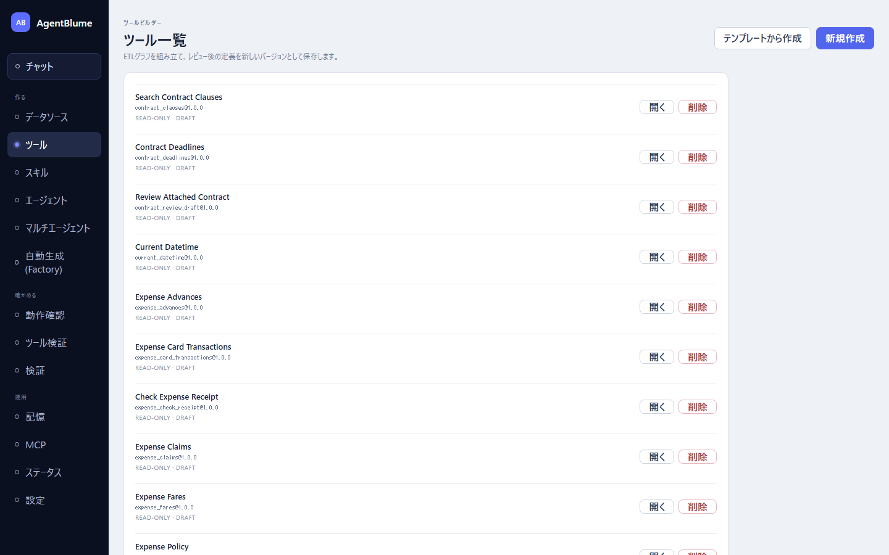

# 01 ツールとは

この節を読むと、AgentBlume の「ツール」が何で、エージェントとどう関わるか、作る前に何を決めればよいかが分かる。

## ツール = エージェントが呼ぶ「検証済みの実行単位」

エージェント（LLM）は文章を書くのは得意だが、表を正確に絞り込んだり合計したりするのは苦手で、数字をそれらしく作ってしまうことがある。そこで、**データの読み取りと計算はツールに任せ、エージェントはツールを呼んで結果を読む**、という役割分担にする。

ツールは次の性質を持つ。

- **決まった手順で動く**: 同じ引数なら同じ結果を返す。途中で LLM に計算させない（例外は後述の「AI判定」ノードだけで、それも判定値を列として付けるだけ）。
- **保存する前に確かめられる**: キャンバスで組んでいる間、各ノードの出力がプレビューに出る。保存時にも、引数・出力の形・グラフのつながりが検査され、壊れたツールは保存できない。
- **版（バージョン）を持つ**: 保存するたびに `1.0.0`, `1.0.1` … と新しい版になり、前の版は残る。

## 入口 → ノード → 出口

ツールは左から右へデータが流れる図（グラフ）で表す。

```
[入口: 引数]  エージェントが呼ぶときに渡す値（例: region = "East"）
      ↓ （値として条件に差し込む）
[入力ノード] → [変換ノード] → [分析ノード] → [出口: 出力ノード]
 CSV を読む     地域で絞る      月ごとに集計     エージェントへ返す
```

| 部分 | 画面での呼び名 | 役割 |
|---|---|---|
| 入口 | 「エージェント入力」ノード / 「Tool Calling契約」の「引数」 | エージェントが渡す値（引数）の名前と型を宣言する |
| 途中 | 「入力」「変換」「分析」のノード | データを読む・絞る・並べる・計算する |
| 出口 | 「出力」のノード（ふつうは「エージェント出力」） | 結果を上限つきでエージェントへ返す。**1 つのツールに 1 つだけ**、最後に置く |

エージェントから見えるのは入口と出口だけで、途中のノードは見えない。エージェントには「ツール名」「説明」「引数の一覧」が渡され、それを読んで「いつ・どんな引数で呼ぶか」を決める（[06 引数と Tool Calling 契約](./06-arguments-and-contract.md)）。

### 具体例

同梱サンプル `sample-monthly-sales.csv`（列: `month`, `region`, `revenue`, `units`）から、地域別の月次売上を返すツールを考える。

| 部品 | 中身 |
|---|---|
| 引数 | `region`（文字列・任意）… East / West |
| 入力 | CSV入力: `sample-monthly-sales.csv` |
| 変換 | 行フィルター: `region` = 引数 `region` の値 |
| 変換 | 並べ替え: `month` の降順 |
| 出口 | エージェント出力: 行をそのまま JSON で返す（最大 100 行） |

エージェントは「East の直近の売上は？」と聞かれると、このツールを `region = "East"` で呼び、返ってきた行を読んで答える。この例の作り方は [02 キャンバスで組む](./02-build-on-canvas.md) で順に説明する。

## 読み取り専用と副作用

ツールは「何を書き換えうるか」を「副作用」として宣言する（「メタデータ」の中の「副作用」）。エージェント実行時の安全性（承認が要るか）がこれで決まる。

| 値 | 意味 | 使う場面 |
|---|---|---|
| `read-only` | 読むだけ。何も書き換えない | **ほとんどのツールはこれ**（新規作成時の既定） |
| `session-write` | その会話だけの一時置き場（セッションワークスペース）に成果物を書く | 「ワークスペース出力」「グラフ出力」「チャート出力」を終端に置いたとき、または「エージェント出力」の「上限超過時」を `store-and-reference` にしたとき |
| `write` | 外部のデータを書き換える | 承認を挟む運用が前提 |
| `external-action` | 外部に作用する（送信など） | 同上 |

一時置き場へ書く出力ノードを置くと、副作用は自動で `session-write` に上がる（`read-only` のままだと保存できないため）。

## ツールでできないこと

- 条件で分岐する・繰り返す（if / ループ）。1 本の流れの中で、行を絞る・列を足す・集計する、までがツールの範囲。
- 任意の SQL やプログラムを書く。データベースは許可されたテーブル/ビューを上限つきで読むだけ。
- 実行のたびに LLM に計算させる（関数電卓の式を AI に書かせるのは**設計時だけ**で、保存されるのは固定の式）。

## ツール画面の場所

左ナビの「作る」→「**ツール**」。最初に「ツール一覧」が出る。



- 各行は「表示名」「公開名@最新の版」「副作用 · 状態」を示す。「開く」で編集画面へ、「削除」は確認のうえ削除する（削除したツールはエージェントから参照できなくなる）。
- 業務テンプレート用の組み込みツール（仕訳・経費精算などが使うもの）も同じ一覧に並ぶ。

## 作る前に決めておくこと

1. **エージェントに何を聞かれたときに使うツールか**（例:「地域別の最近の売上」）。これが説明文になる。
2. **エージェントに渡させる値**（例: 地域・期間）。これが引数になる。省略されたら全件にするか、必ず渡させるかも決める。
3. **返す形と量**（例: 月・地域・売上の 3 列、多くて 36 行）。多すぎる行は返さず、ツール側で絞る・集計する。

## 次に読む

- 自分で組む: [02 キャンバスで組む](./02-build-on-canvas.md)
- 言葉で頼んで作る: [05 設計アシスタントと一緒に設計する](./05-design-assistant.md)
- よくある形から作る: [04 テンプレートから作る](./04-from-templates.md)
- 詳しくは（開発者向け）: [06 ETL ツールビルダー詳細仕様](../../06-etl-tool-builder.md)
