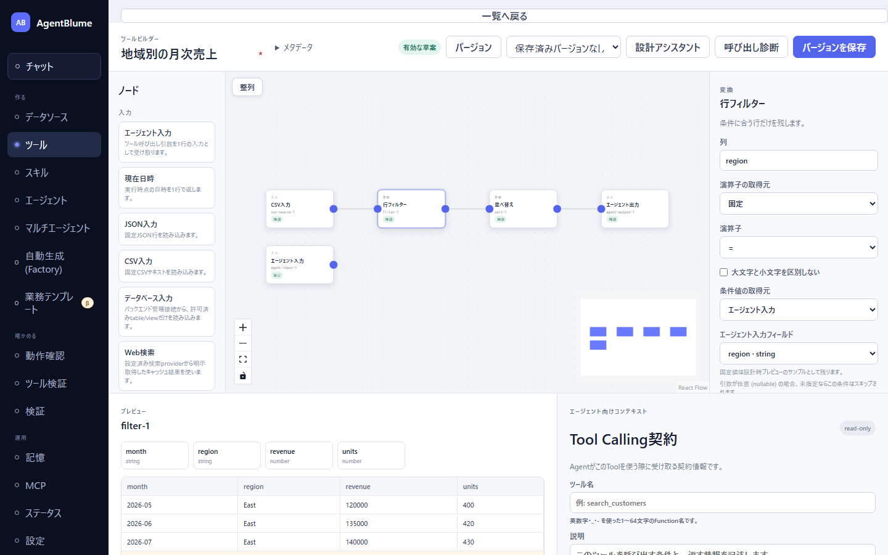

# 02 キャンバスで組む

この節を読むと、ツール画面のキャンバスにノードを置いてつなぎ、設定し、プレビューで結果を確かめながら 1 本のツールを組めるようになる。例として、同梱サンプル `sample-monthly-sales.csv` から「地域別の月次売上」を返すツールを作る。

> ノードの名前が分からない・どうつなぐか迷うときは、同じ画面の「設計アシスタント」に日本語で頼むほうが早い（[05 設計アシスタントと一緒に設計する](./05-design-assistant.md)）。この節の操作は、アシスタントが置いたノードを手直しするときにもそのまま使う。

## 画面の見方

> 画像は v53 以前の表示。ノードのカードの区分（`SOURCE` 等）と型名（`CSV source` 等）は、現在は本文のとおりパレットと同じ日本語（「入力」「変換」「分析」「出力」、「CSV入力」「行フィルター」「並べ替え」等）で出る。

| 場所 | 名前 | 何をするか |
|---|---|---|
| 最上部 | 「一覧へ戻る」 | ツール一覧へ戻る |
| 上の帯 | 表示名・「メタデータ」・状態表示・「バージョン」・「設計アシスタント」・「呼び出し診断」・「バージョンを保存」 | ツールの名前と保存（[07](./07-check-save-versions.md)） |
| 左 | 「ノード」（ノードパレット） | 押すとノードがキャンバスに置かれる。「入力」「変換」「分析」「出力」の 4 分類 |
| 中央 | キャンバス | ノードを並べてつなぐ。左上に「整列」、左下に拡大・縮小・全体表示、右下に全体図（ミニマップ） |
| 右 | インスペクター | 選んだノードの説明と設定 |
| 下左 | 「プレビュー」 | 選んだノードの出力（列と型、サンプル行） |
| 下右 | 「エージェント向けコンテキスト」（Tool Calling契約） | エージェントに見せるツール名・説明・引数・返却データ（[06](./06-arguments-and-contract.md)） |

キャンバス上のノードのカードには、区分（「入力」「変換」「分析」「出力」。パレットと同じ日本語）、ノードの型名（パレットと同じ日本語表記。例 `CSV入力`・`行フィルター`）、ノードID（例 `csv-source-1`）、出力の列がどこまで確定しているかのバッジ（「確定」「推論」「部分」「不明」「不一致」）が出る。問題があればカードの下に赤い文、つながっていなければ「未接続」が出る。

## 手順: 地域別の月次売上ツールを組む

前提: 「データソース」に `sample-monthly-sales.csv` が登録済み（サンプルデータを読み込んでいれば入っている。自分のファイルなら [02 データを登録する](../02-data/01-register-data.md)）。

### 1. 新規作成する

1. 左ナビ「ツール」を開き、右上の「**新規作成**」を押す。
   → 編集画面が開く。キャンバスには見本として「JSON入力」と「行フィルター」（`age ≥ 18`）が置かれ、下のプレビューに 1 行出る。
2. 見本は使わないので消す。見本のノードをクリックして選び、`Delete`（または `Backspace`）を押す。2 つとも消す。

### 2. データを読むノードを置く

1. キャンバスの何もない所をクリックして、選択を外す。
2. 左の「入力」から「**CSV入力**」を押す。
   → キャンバスに「CSV入力」が置かれ、右のインスペクターに「CSV入力」の説明が出る。
3. インスペクターの「**設定を開く**」を押す。
   → 「設定」ダイアログが開く。
4. 「**登録済みデータソース**」で `sample-monthly-sales.csv` を選び、「**設定を適用**」を押す。
   → プレビューに `month` / `region` / `revenue` / `units` の列と 6 行が出る。

> JSON ファイルなら「JSON入力」を使う。「登録済みデータソース」には、そのノードの形式（CSV / JSON）のファイルだけが並ぶ。

### 3. 変換ノードをつなぐ

**ノードを選んだ状態でパレットのノードを押すと、選んだノードの右に置かれ、自動でつながる。** 上流から順に押していけば、一本道はつなぐ操作なしで組める。

1. 「CSV入力」を選んだまま、「変換」の「**行フィルター**」を押す。
   → 「行フィルター」が右に置かれ、線でつながる。インスペクターに条件の欄が出る。
2. インスペクターの「列」に `region`、「演算子」は `=`、「値」に `East` を入れる。
   → プレビューが East の 3 行になる。
3. 「行フィルター」を選んだまま「**並べ替え**」を押し、「設定を開く」→「**キーを追加**」→「対象列」で `month`、「順序」で `desc` を選び、「設定を適用」を押す。
   → 新しい月から順に並ぶ。
4. 「並べ替え」を選んだまま、「出力」の「**エージェント出力**」を押す。
   → 終端に「エージェント出力」がつながる。インスペクターに「直接返却 · rows · 100行」と出る。

ここまでで、固定の条件（East）で絞るツールができた。地域をエージェントに選ばせるには、次の「エージェント入力」を足す。

### 4. 引数を足して条件に差し込む

1. キャンバスの何もない所をクリックして選択を外し、「入力」の「**エージェント入力**」を押す。
   → 「エージェント入力」が置かれる。これは**どこにもつながない**。引数の宣言として置いておくノードである。
2. 下右の「Tool Calling契約」の「引数」で、最初の行の名前を `region` に変え、「必須」のチェックを外す（省略されたら全地域を返したいので）。
3. 「エージェント入力」を選び、インスペクターの「詳細テキスト編集」を開いて、「サンプル引数」を `{"region": "East"}` にする（プレビューで使う見本の値）。
4. 「行フィルター」をクリックして選び、インスペクターの「**条件値の取得元**」を「**エージェント入力**」に変え、「**エージェント入力フィールド**」で `region` を選ぶ。
   → 実行時は、エージェントが渡した `region` で絞る。`region` を省略した呼び出しでは、この条件ごと飛ばされる（全地域が返る）。プレビューは、先に入れた固定値 `East` を見本として使い続ける。

引数と束縛の詳しい決まりは [06 引数と Tool Calling 契約](./06-arguments-and-contract.md) にある。

### 5. 名前を付けて保存する

1. 上の帯の「例: 顧客検索」とある欄に表示名（例 `地域別の月次売上`）を入れる。
2. 「**メタデータ**」を開き、「内部ID」（例 `regional-sales`）・「作業名」・「公開名」（例 `regional_sales`）を入れる。「所有者」は空欄でよい。
3. 「Tool Calling契約」の「ツール名」（例 `get_regional_sales`）と「説明」を書く（書き方は [06](./06-arguments-and-contract.md)）。
4. 状態表示が「有効な草案」になっているのを確かめ、「**バージョンを保存**」を押す。
   → 「保存しました バージョン 1.0.0」と出る（[07 確認・保存・版](./07-check-save-versions.md)）。

## 操作の早見表

| やりたいこと | 操作 |
|---|---|
| ノードを置く | 左のパレットのノードを押す。選んでいるノードがあれば、その右に置いて自動でつなぐ。空きが無ければ空いている位置へずらす |
| つなぐ | ノード右端の丸（出口）から、つなぎたいノード左端の丸（入口）へドラッグする |
| つなぎ替える | 線の端をドラッグして別の丸へ移す |
| 線を消す | 線をクリックして `Delete` / `Backspace` |
| ノードを消す | ノードをクリックして `Delete` / `Backspace` |
| ノードを動かす | ノードをドラッグ（位置は保存され、開き直しても保たれる） |
| 全体を見る | キャンバス左下の全体表示ボタン。ノードを置く・整列するたびに自動でも全体が収まるよう表示が合う |
| 設定する | ノードを選び、インスペクターで直接入力するか「設定を開く」でダイアログを開く |

つなげられない組み合わせは、ドラッグしても線が付かない。

- 入力ノード（CSV入力など）には何もつなげない（入口の丸が無い）。
- 1 つの入口の丸には 1 本だけ。2 本入れたいのは「結合」「縦結合」で、この 2 つには「左」「右」2 つの入口がある。
- 出力ノードの後ろには何もつなげない（出口の丸が無い）。

「結合」「縦結合」をパレットから置いたときは、選んでいたノードが「左」の入口に自動でつながる。「右」の入口は手でつなぐ。

## 設定パネル（インスペクター）と設定ダイアログ

ノードを選ぶと、右のインスペクターに分類・名前・説明が出る。設定の置き場所はノードによって 2 通りある。

- **インスペクターで直接**: 行フィルター・列選択・行数制限・グループ集計・期間の解釈・重複排除・現在日時など、項目の少ないもの。入力するとすぐ反映される。
- **「設定を開く」のダイアログ**: 結合・並べ替え・列名変更・型変換・関数電卓・AI判定・分析ノード・出力ノード・入力ノードなど、行を足していくもの。ダイアログ内の変更は「**設定を適用**」を押したときに反映され、「キャンセル」なら元のまま。

列を選ぶ欄には、上流のノードが出す列が型つきで並ぶ。上流がまだつながっていないと「列を選ぶには上流のノードを接続してください。」と出る。インスペクターの下には「上流の列」（2 入力のノードは「左入力の列」「右入力の列」）が一覧で出る。

「詳細テキスト編集」「詳細JSON編集」などの折りたたみは、まとめて書き換えたい人向けの逃げ道で、ふだんは開かなくてよい。

## プレビュー

下左の「プレビュー」は、**選んでいるノードの出力**を見せる。何も選んでいなければ終端のノードを見せる。

- 列の帯: 列名と型（`string` / `number` / `date` など。`nullable` は空がありうる列）。
- サンプル行: 最大 100 行まで表示する。計算は全行で行っているので、行数が多いときは「全 1,250 行のうち 100 行を表示」のように全体の行数が添えられる。
- 編集するたびに自動で計算し直す（「更新中…」が出る）。モデルは使わないので、LLM が止まっていても確認できる。
- グラフに問題があるときは「グラフが有効になるとサンプル行が表示されます。」と出て、原因がノードのカードとプレビューの上に出る。

**ノードを 1 つずつ選んで、行が期待どおりに減る・増える・並ぶかを上流から順に確かめる**のが、作ったツールが正しいかを見る一番確実な方法である。

## 「整列」と「元に戻す」

ノードが増えて見づらくなったら、キャンバス左上の「**整列**」を押す。

- 処理の順番（上流からの段数）ごとに列へ並べ、キャンバスの幅に収まらない分は下の段へ折り返す。どこにもつながっていないノード（「エージェント入力」など）は最上段にまとめる。
- 押した直後に「**整列しました**」と「**元に戻す**」が出る。「元に戻す」を押すと整列前の位置へ戻る（1 回だけ）。
- 次にノードを動かす・足す・消す・つなぐ・設定を変えると、「元に戻す」は消える。

テンプレートから作ったとき、設計アシスタントが空のキャンバスに組んだとき、位置の記録が無いツールを開いたときは、自動で同じ並べ方をする。手で動かした位置があるツールは、開いても動かさない。

> キャンバス全体の「元に戻す（undo）」は無い。戻せるのは「整列」の直後の 1 回と、設計アシスタントの各ターン（「この変更を取り消す」）だけである。大きく変える前に一度「バージョンを保存」しておくと、前の版をいつでも開き直せる（[07](./07-check-save-versions.md)）。

## 編集途中の内容（下書き）

編集中の内容はブラウザに自動で退避される。保存せずに画面を閉じて戻ると「未保存の編集内容があります（日時）。復元しますか？」と出るので、「復元」か「破棄」を選ぶ。保存すると退避は消える。

## うまくいかないとき

| 症状 | 原因 | 直し方（直す場所） |
|---|---|---|
| ノードを押したのにつながらない | 何も選んでいなかった、または選んでいたのが出力ノード | 線を手でドラッグしてつなぐ（キャンバス） |
| カードに「未接続」、プレビューに「未接続のノード: …。出力ノードへ至る流れにつなげてください」 | 入口が空のノードがある、または終端が 2 つ以上ある | 名指しされたノードを流れにつなぐか消す。「エージェント入力」はつながなくてよい（キャンバス） |
| 「グラフの終端ノードは1つだけにしてください」 | 出力ノードが 2 つある、または途中で切れた枝がある | 最後の出力ノード以外を下流へつなぐか消す（キャンバス） |
| 「終端ノード(出力)がありません」 | 出力ノードが無い | 「出力」から「エージェント出力」を置き、最後のノードにつなぐ |
| 「列が見つかりません: …」 | 上流を変えて、参照していた列が無くなった | そのノードの列の指定を、上流に実在する列へ選び直す（インスペクター / 設定ダイアログ） |
| 行フィルターの結果が 0 行 | 値の綴り・大文字小文字が違う、日付の書き方が違う | 上流のプレビューで実在する値を確かめて入れ直す。文字列なら「大文字と小文字を区別しない」も使える（インスペクター） |
| 「登録済みデータソース」に目的のファイルが無い | ノードの形式が違う（CSV入力に JSON ファイルなど）、または未登録 | 形式に合うノードを置き直す。未登録なら「データソース」画面で登録する |

## 次に読む

- 各ノードで何ができるか: [03 ノード一覧](./03-node-reference.md)
- 引数と説明文: [06 引数と Tool Calling 契約](./06-arguments-and-contract.md)
- 保存と版: [07 確認・保存・版](./07-check-save-versions.md)
