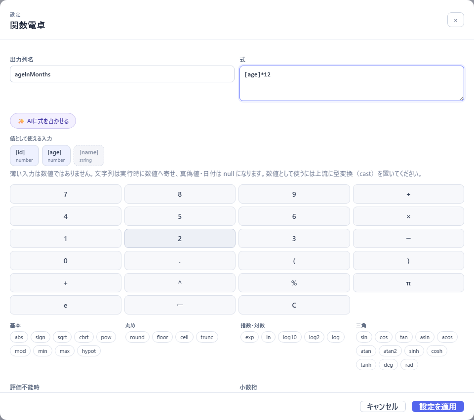

# 03 ノード一覧

この節は辞書として引く。ツール画面の左「ノード」に並ぶ全ノードについて、何ができるか・主な設定・よくある使い方・注意をまとめる。名前はパレット・キャンバスのカードと同じ日本語表記（括弧内は開発者向け資料で使う英語名。設計アシスタントの変更一覧は日本語で出るので、通常はこの英語名を見る場面はない）。

ノードは 4 分類ある。

| 分類 | カードの表示 | 役割 |
|---|---|---|
| 入力 | 「入力」 | データを読む・引数を宣言する。入口の丸は無い |
| 変換 | 「変換」 | 行を絞る・列を変える・つなぐ・並べる |
| 分析 | 「分析」 | 集計・統計を計算する。結果は普通の表として次のノードへ渡る |
| 出力 | 「出力」 | 結果の渡し方を決める。**1 つのツールに 1 つだけ、最後に置く** |

設定が「設定を開く」のダイアログにあるノードと、インスペクターに直接並ぶノードがある（見分け方は [02 キャンバスで組む](./02-build-on-canvas.md#設定パネルインスペクターと設定ダイアログ)）。

---

## 入力

| ノード | 何ができるか | 主な設定 |
|---|---|---|
| **エージェント入力**（Agent input） | エージェントが呼ぶときに渡す引数（名前・型・必須/任意）を宣言する | 「入力スキーマ」（列名・型・「任意」）、「詳細サンプルJSON」（プレビュー用の見本の値） |
| **現在日時**（Current datetime） | 実行した時点の日時を 1 行で返す。列は `now`・`date`（YYYY-MM-DD）・`yearMonth`・`time`・`weekday` | 「タイムゾーン（任意）」（例 `Asia/Tokyo`。空欄ならサーバーのタイムゾーン） |
| **JSON入力**（JSON source） | JSON の行を読む | 「登録済みデータソース」（JSON ファイル）、または「インライン編集」で行を直接書く |
| **CSV入力**（CSV source） | CSV を読む | 「登録済みデータソース」（CSV ファイル）、または「インライン編集」で「CSVテキスト」「区切り文字」「ヘッダー行」「型を推論」 |
| **データベース入力**（Database source） | 管理者が許可したテーブル/ビューを、読み取り専用・上限つきで読む | 「登録済みデータソース」（DB 接続）、「許可済みtable/view」（例 `reporting.sales_daily`）、「最大行数」（1〜10,000） |
| **Web検索**（Web search） | 検索サービスの結果を行として使う。**検索サービスが設定されているときだけパレットに出る** | 「検索provider」「検索語」「最大取得件数」（1〜10）→「検索結果を取得」 |

- **エージェント入力は、ふつうどこにもつながない。** 引数の宣言として置いておき、行フィルターなどの「条件値の取得元」を「エージェント入力」にして値を差し込む。1 つのツールに 1 つだけ置く（複数置いて引数が食い違うと保存できない）。詳しくは [06 引数と Tool Calling 契約](./06-arguments-and-contract.md)。
- 登録済みデータソースを選んだ入力ノードは、ファイルの中身をツールに写さない。プレビュー・保存時の検査・実行のたびに、登録済みのファイルをサーバーが読む。
- 現在日時は「今月」「昨日」のような相対の日付に答えるためのもの。
- Web検索は、自動プレビューでは検索しない。「検索結果を取得」を押したときだけ検索し、その結果（15 分保持）をプレビューと実行が使う。

## 変換

### 行を絞る・並べる

| ノード | 何ができるか | 主な設定 |
|---|---|---|
| **行フィルター**（Filter） | 条件に合う行だけ残す | 「列」「演算子」「値」。「条件を追加」で複数条件にし、「条件の結合」で「すべて満たす (AND)」/「いずれかを満たす (OR)」 |
| **並べ替え**（Sort） | 1 つ以上のキーで並べる | 「キーを追加」→「対象列」「順序」（`asc` / `desc`）「null位置」（`first` / `last`） |
| **行数制限**（Limit） | 先頭から N 行だけ残す | 「残す行数」（1〜10,000）、「スキップする行数」 |
| **重複排除**（Distinct） | 重複する行を取り除く（最初の行を残す） | 「重複判定の列を選択」（未選択なら全列） |
| **AI判定**（AI judgment） | ローカル LLM が各行を判定基準に照らして はい/いいえ または分類し、判定列を付けるか行を絞る | 後述 |

**行フィルターの演算子**: `=`・`≠`・`>`・`≥`・`<`・`≤`・「含む」・「いずれかに一致」・「いずれにも一致しない」・「が空」・「が空でない」。

- 大小比較（`>` など）は数値か日付の列だけ。
- 日付の列では「値」が日付ピッカーになり、`YYYY-MM-DD` で比べる。
- 「いずれかに一致」「いずれにも一致しない」は値を複数とる。カンマ・読点（、）・セミコロン・改行のどれで区切ってもよい（最大 100 件）。
- 文字列の `=`・`≠`・「含む」などでは「大文字と小文字を区別しない」を選べる。
- 「条件値の取得元」を「エージェント入力」にすると、値をエージェントの引数から受け取る。「演算子の取得元」を「エージェント入力」にすると、比べ方（以上・以下など）もエージェントに選ばせられる（「AIに許可する演算子」で選べる範囲を絞る）。

**よくある使い方**: 上位 N 件 = 「並べ替え」（`desc`）→「行数制限」。行数制限だけでは「先頭の N 行」なので、上位にはならない。

### 列を変える

| ノード | 何ができるか | 主な設定 |
|---|---|---|
| **列選択**（Select） | 必要な列だけ残す | 「列を選択」（複数選択） |
| **列名変更**（Rename） | 列名を変える | 「列名変更を追加」→「元の列」「新しい列名」 |
| **型変換**（Cast） | 列の型を `string` / `number` / `boolean` / `date` に変える。変換できない値は空（null）になる | 「型変換を追加」→「対象列」「変換先型」 |
| **関数電卓**（Calculator） | 入力列を使った数式で新しい列を 1 つ計算する | 後述 |
| **期間の解釈**（Parse period） | 「1975年10月」「2024年1-3月期」「2024年度」のような期間ラベルから、開始日と粒度の 2 列を足す | 後述 |
| **null処理**（Fill null） | 空のセルを定数で埋める（`constant`）か、その行を削除する（`drop-row`） | 「ルールを追加」→「対象列」「戦略」「埋める値」 |
| **値置換**（Replace） | 一致するセルの値を置き換える | 「置換を追加」→「対象列」「置換前」「置換後」 |

- 列名に日本語や空白があっても使える。エージェントに返す列名は、意味の分かる名前にしておくと誤読が減る（列名変更で整える）。
- 数値のつもりの列が `string` になっている（CSV の値に単位や桁区切りがある等）と、関数電卓や大小比較で困る。上流で「型変換」を置く。

### 2 つの入力をつなぐ

| ノード | 何ができるか | 主な設定 |
|---|---|---|
| **結合**（Join） | 2 つの入力をキー列で横につなぐ | 「結合モード」（`inner` / `left` / `right` / `full`）、「キーペア」（「左キー」「右キー」を「キーを追加」で増やす）、「右列サフィックス」（既定 `_right`）、「キーを文字列として比較 (001と1を結合)」、「最大行数」 |
| **縦結合**（Union） | 2 つの入力を列名で縦に連ねる（重複は取らない） | 「列名の完全一致を要求」 |

- 2 入力のノードには「左」「右」2 つの入口がある。パレットから置くと、選んでいたノードが「左」につながる。「右」は手でつなぐ。
- 結合で、左右に同じ名前の列があると、右側の列名に「右列サフィックス」が付く。
- **結合の「最大行数」**: 結合の結果がこの行数を超えたら止める安全弁。空欄なら既定の 100,000 行、指定できるのは 1〜10,000,000。キーの指定漏れで行が掛け算的に増える事故を早く止めるためのものなので、**キーが正しいのに止まるときだけ上げる**。サーバー側の実行上限（既定 250,000 行）より大きくしても、その上限で止まる。
- 縦結合で「列名の完全一致を要求」を外している（既定）と、片側にしか無い列は空で埋めて連ねる。

## 分析

分析ノードの設定は「設定を開く」のダイアログで行う。結果は決まった計算で出す普通の表なので、後ろに行フィルターや並べ替えをつなげられる。モデルが設定されていれば、ダイアログに「ローカルLLM設定補助」が出て、「分析したいこと」を書いて「設定案を作成」を押すと設定の案が出る（「このダイアログへ提案を適用」で取り込む。自動では適用しない）。

| ノード | 何ができるか | 主な設定 | 出る列 |
|---|---|---|---|
| **グループ集計**（Group by） | グループごとに件数・合計などを集計する。1 グループが 1 行 | 「グループ列」、「集計を追加」→「集計方法」（`count` / `count-distinct` / `sum` / `mean` / `min` / `max` / `first`）「集計する列」「出力列名」 | グループ列 + 集計の出力列 |
| **基本統計量**（Summary statistics） | 数値列の件数・平均・標準偏差・四分位・最小・最大などをグループごとに計算する | 「数値列」「グループ列」（任意）「統計量」「標準偏差」（`sample` / `population`） | `column`・`rowCount`・選んだ統計量 |
| **相関分析**（Correlation analysis） | 数値列どうしの相関係数（Pearson / Spearman）を計算する | 「数値列」（2 列以上）「方法」「欠損値」「最小ペア数」「対角成分を含める」 | `columnX`・`columnY`・`coefficient`・`absoluteCoefficient`・`pairCount`・`method` |
| **時系列分析**（Time series analysis） | 日時を「間隔」ごとの区間にまとめて集計する | 「日時列」（`date` 型の列）「値列」「グループ列」「タイムゾーン」「間隔」（`minute`〜`month`）「集計」 | `bucketStart`・`series`・`value`・`sampleCount` |
| **外れ値の検出・除外**（Outlier filter） | IQR・z-score・MAD で外れ値に印を付けるか除く | 「数値列」「グループ列」「方法」「閾値」「操作」（「行にフラグを付ける」/「行を除外する」）「null値」 | 印を付けると `isOutlier`・`outlierScore`・`outlierReason` が増える |

- 時系列分析の「日時列」には `date` 型の列だけが並ぶ。「2026-05」や「1975年10月」のような文字列の期間は、先に「期間の解釈」か「型変換」で日付にする。
- 外れ値は、まず「行にフラグを付ける」で何が外れ値になるかを見てから、除外に切り替えるのが安全。

## 出力

**出力ノードはグラフの終端に 1 つだけ置ける。** 迷ったら「エージェント出力」を使う。

| ノード | 何ができるか | 主な設定 |
|---|---|---|
| **エージェント出力**（Agent output） | 上限つきの結果をエージェントへ直接返す | 「返却形式」「形式」「返却する列」「最大行数」「最大バイト数」「上限超過時」 |
| **ワークスペース出力**（Workspace output） | 結果をその会話だけの一時置き場（セッションワークスペース）に保存し、エージェントには参照を返す | 「Artifact名」「Artifact種別」（`table` / `json` / `chart` / `blob`）「書き込み方法」「同名時」「プレビュー行数」 |
| **グラフ出力**（Graph output） | 行を「始点 → 終点」の辺として、関係のグラフ（プロパティグラフ）を一時置き場に保存する | 「対応モード」（「エッジリスト」/「相関ネットワーク」）、「始点列」「終点列」など |
| **チャート出力**（Chart output） | 可視化用のチャートを一時置き場に保存する | 「チャート種別」（`histogram` / `box-plot` / `scatter` / `correlation-heatmap` / `time-series` / `outlier-overlay`）、種別ごとの列の割り当て、「最大ポイント数」「間引き」 |

- **エージェント出力**の「返却形式」: `rows`（行をそのまま）/ `first-row`（先頭 1 行）/ `single-value`（先頭行の 1 つの値。「値の列」が必須）/ `summary`（行数・列・先頭 10 行の要約）。「形式」: `json` / `markdown-table` / `chartjs`。「最大行数」は 1〜10,000（既定 100）、「最大バイト数」は 1,024〜1,048,576（既定 65,536）。溢れたときの動きは [06 引数と Tool Calling 契約](./06-arguments-and-contract.md#出力の形と溢れ方) を参照。
- ワークスペース・グラフ・チャートの出力を置くと、ツールの副作用が自動で `session-write` になる。一時置き場のデータは、その会話の間だけ使える。

---

## 関数電卓（Calculator）

表計算のセルに書く程度の計算（税込金額・単価・比率・対数など）で、列を 1 つ足す。



1. 「出力列名」に足す列の名前を入れる（上流に同名の列があれば置き換える）。
2. 「値として使える入力」のキーを押すと、式に `[列名]` が入る。数値の列が先に並び、数値でない列は薄く出る。
3. キーパッド（数字・`+ − × ÷`・`^` べき乗・`%` 剰余・`π`・`e`・`←` 1 文字削除・`C` 全消去）と関数（「基本」「丸め」「指数・対数」「三角」）で式を組む。式の欄に直接打ってもよい。ボタンはカーソルの位置に入る。
4. 「評価不能時」: `null（行は残す）`（既定）か `fail（実行を止める）`。「小数桁」: 指定すると四捨五入（空なら丸めない）。
5. 「設定を適用」。プレビューに新しい列が出る。

- 列は `[金額]` のように角括弧で囲む。例: 税込金額 `[金額] * 1.1`、単価 `[金額] / [数量]`、小数 0 桁に丸めた比率 `round([revenue] / [units], 0)`。
- 0 で割る・参照した列が空などで計算できない行は、結果が空になる（`fail` なら止まり、行番号と理由が出る）。
- 比較・条件分岐・文字列・日付の計算はできない。行を絞るのは行フィルター、集計はグループ集計の役目。
- **「✨ AIに式を書かせる」**: 押すと「計算したいこと」の欄が開く。「単価×数量の税込金額を小数 0 桁で」のように書いて「式を提案」を押すと、検証済みの式と根拠が出る。「この式をダイアログへ適用」で取り込む。すでに式があれば、AI はその式を直す。モデル未設定のときはボタンが押せず、「ローカルLLMが未設定です。設定 > モデル で main スロットを設定して再読み込みすると、AIに式を書かせられます。」と出る。

## 期間の解釈（Parse period）

e-Stat などの統計データは、1 つの「時点」列に「1975年10月」（月）・「2024年1-3月期」（四半期）・「2024年」（年）・「2024年度」（年度）が混ざることが多い。文字列のままでは、期間で絞れない・正しい時系列順に並ばない・年と月の行を二重に足してしまう。このノードはその列を読んで 2 列を足す。

| 設定 | 既定 | 内容 |
|---|---|---|
| 期間ラベルの列 | （必須） | 読み取る列 |
| 開始日の列 | `periodStart` | 足す列（期間の初日。`date` 型。読めなければ空） |
| 粒度の列 | `periodGranularity` | 足す列（`day` / `month` / `quarter` / `half` / `year` / `fiscal-year` / `unknown`） |
| 年度の開始月 | `4` | 「2024年度」などが何月から始まるか（4 = 日本の年度） |

和暦（「平成20年4月」「令和元年度」）、`2024-03`、`202403`、`2024Q2`、`FY2024` なども読める。読めないラベルでも止まらず、開始日が空・粒度が `unknown` になる。

**定石の並び**（粒度の絞り込みを先に置くのが要点）:

```
期間の解釈 → 行フィルター  periodGranularity = month   ← 粒度の違う行を落とす
           → 行フィルター  periodStart ≥ / ≤ 日付        ← 期間で絞る
           → 並べ替え      periodStart desc              ← 正しい時系列順
```

## AI判定（AI judgment）

ローカル LLM が、各行を人が書いた判定基準（例:「この問い合わせはクレームですか？」）に照らして判定し、判定列を付けるか行を絞る。LLM が使われるのはこの判定だけで、集計や計算はしない。

| 設定 | 内容 |
|---|---|
| 判定基準（質問） | 各行を何で判断するか |
| 判定モード | 「はい/いいえ」または「分類」（「分類カテゴリ」を名前と説明で最大 20 個） |
| モデルに見せる列 | 未選択なら全列 |
| 操作 | `flag`（判定列を付けて全行を通す）/ `keep`（一致する行だけ残す）/ `exclude`（一致する行を除く） |
| 判定列・理由列 | `flag` のときの列名（既定 `aiVerdict`・`aiReason`） |
| 一致とみなす判定 | `keep` / `exclude` のとき、どの判定を一致とするか |
| 1回の実行で判定する行数の上限 | 既定 50、最大 200 |

- 判断できない行は `unclear` になり、「一致とみなす判定」に入れない限り一致しない（不確かな行が黙って通らない）。
- 同じ内容の行は 1 回だけ判定する。行数が上限を超えるとエラーで止まるので、上流の行フィルターや行数制限で絞る。
- `flag` の後ろに行フィルター（`aiVerdict` = `yes` など）を置くと、判定で決まった形に分岐できる。
- モデル未設定のときは「ローカルLLMが未設定です。設定 > モデル で main スロットを設定すると、この判定を実行できます。」と出る。
- 判定はプレビュー・実行のたびに走る（同じモデル・同じ内容ならキャッシュを使う）。

## うまくいかないとき

| 症状 | 原因 | 直し方（直す場所） |
|---|---|---|
| 「結合結果が N 行を超えました。結合キーが正しいか確認し、正しければこの結合ノードの「最大行数」を上げてください」 | キーが足りず、行が掛け算的に増えた | まずキーペアを見直す（共通のキーはすべて入れる）。正しければ結合の「最大行数」を上げる（結合の設定ダイアログ） |
| 「結合キーの列が見つかりません」 | 左右の入力に無い列をキーにしている | 「左入力の列」「右入力の列」を見て選び直す |
| 時系列分析の「日時列」に候補が無い | 日付の列が `string` のまま | 上流に「期間の解釈」か「型変換」（`date`）を置く |
| 期間で並べたのに順番がおかしい | 期間ラベルの文字列で並べている | 「期間の解釈」を置き、`periodStart` で並べる |
| 年と月の値が合計に混ざる | 粒度の違う行が残っている | 「期間の解釈」の直後に `periodGranularity` を 1 つの粒度に絞る行フィルターを置く |
| 関数電卓の結果が空の行がある | 0 で割った・参照列が空・数値にできない | 上流の「null処理」で既定値を入れるか、行フィルターで除く。止めたいなら「評価不能時」を `fail` に |
| AI判定が行数の上限で止まる | 判定する行が多すぎる | 上流で行を絞る。必要なら上限を上げる（最大 200） |

## 次に読む

- 引数・束縛・出力の形: [06 引数と Tool Calling 契約](./06-arguments-and-contract.md)
- 言葉で頼んでノードを置かせる: [05 設計アシスタントと一緒に設計する](./05-design-assistant.md)
- 詳しくは（開発者向け）: [06 ETL ツールビルダー詳細仕様](../../06-etl-tool-builder.md)
