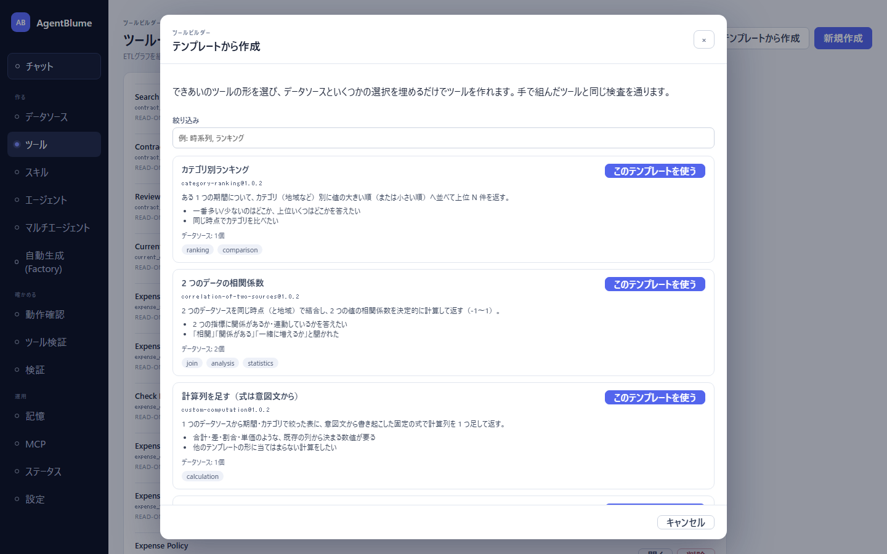
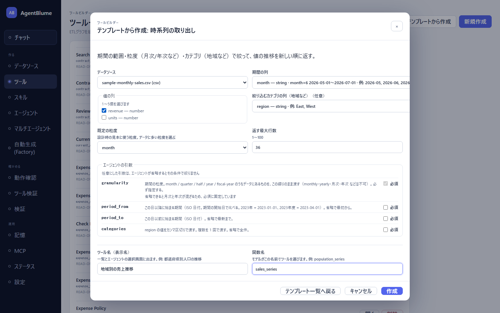
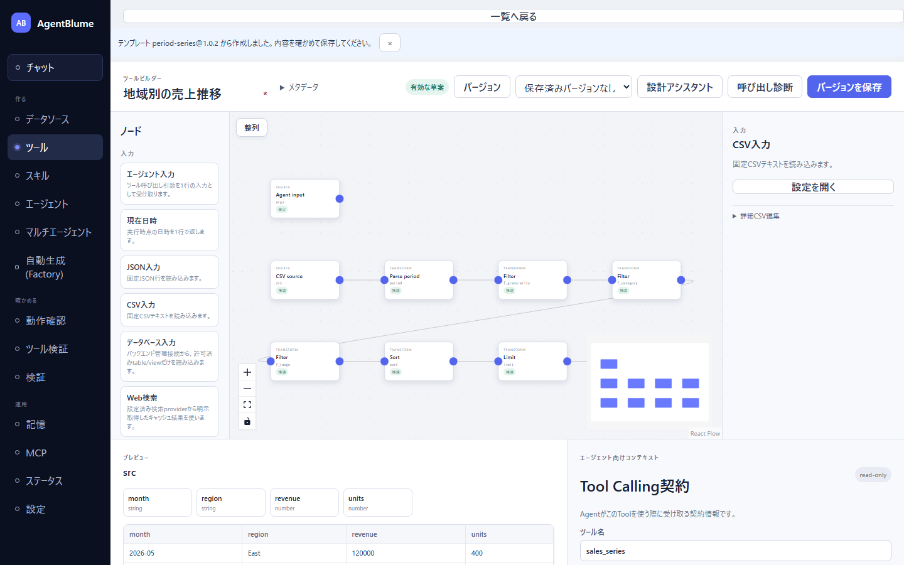

# 04 テンプレートから作る

この節を読むと、「テンプレートから作成」でよくある形のツール（時系列の取り出し・ランキング・前期比・2 つのデータの比など）を、データソースと列を選ぶだけで作れるようになる。作ったツールはキャンバスに展開されるので、確かめてから保存する。

空のキャンバスから前期比や期間内の統計を正しく組むのは、慣れた人にも難しい。テンプレートは、そうした形を**手で組んだツールと同じ検査を通る状態**で組み立ててくれる。

## 同梱のテンプレート

| テンプレート（id） | 何を作るか | データソースの数 |
|---|---|---|
| 時系列の取り出し（`period-series`） | 期間の範囲・粒度（月次/年次など）・カテゴリ（地域など）で絞って、値の推移を新しい順に返す | 1 |
| 最新の値（`latest-values`） | 指定した粒度の最新 N 期ぶんの値を新しい順に返す（「いま幾つか」「直近はどうか」用） | 1 |
| カテゴリ別ランキング（`category-ranking`） | ある 1 つの期間について、カテゴリ別に値の大きい順（または小さい順）に上位 N 件を返す | 1 |
| 前期比・前年同期比（`period-change`） | 月次の値の前月比・前年同月比の増減（`delta`）と増減率（`percentChange`）を計算して返す | 1 |
| 期間内の統計（`period-statistics`） | 期間の範囲について、件数・平均・最小・中央値・最大・合計を計算して返す（カテゴリ別も可） | 1 |
| 計算列を足す（`custom-computation`） | 期間・カテゴリで絞った表に、意図文から AI が書いた固定の式で計算列を 1 つ足す | 1 |
| 2 つのデータを横に並べる（`join-side-by-side`） | 2 つのデータソースを同じ時点（と地域）で結合し、両方の値を 1 行に並べる | 2 |
| 3 つのデータを横に並べる（`join-three-side-by-side`） | 3 つのデータソースを同じ時点（と地域）で結合する | 3 |
| 2 つのデータの比（`ratio-of-two-sources`） | 2 つのデータを結合し、分子 ÷ 分母を固定の式で計算する（一人当たり・率など） | 2 |
| 2 つのデータの相関係数（`correlation-of-two-sources`） | 2 つのデータを結合し、2 つの値の相関係数（-1〜1）を計算する | 2 |

時系列のテンプレートは、e-Stat のような「時点」列に期間ラベルが入ったデータを想定している（`YYYY-MM` の列でも使える）。

## 手順

例として、同梱サンプル `sample-monthly-sales.csv`（列: `month`, `region`, `revenue`, `units`）から「時系列の取り出し」でツールを作る。

### 1. テンプレートを選ぶ

1. 左ナビ「ツール」を開き、右上の「**テンプレートから作成**」を押す。
   → 「テンプレートから作成」ダイアログが開き、テンプレートが並ぶ。

   

2. 「絞り込み」に `時系列` などと入れると、タイトル・要約・タグ・id で絞れる。
3. 「時系列の取り出し」の「**このテンプレートを使う**」を押す。
   → 入力欄（スロット）が並んだ画面に変わる。

### 2. データソースとスロットを埋める

1. 「データソース」で `sample-monthly-sales.csv (csv)` を選ぶ。
   → 列を選ぶ欄に候補が入る。候補には**選ぶ根拠**が添えてある（列の型、実在する値の例、期間の列なら粒度ごとの行数と範囲）。
2. 「期間の列」で `month` を選ぶ（`month — string · month×6 2026-05-01〜2026-07-01 · 例: 2026-05, …` のように、月次の行が 6 行あると分かる）。
3. 「値の列」で `revenue` にチェックを入れる（「1〜5個を選びます」）。
4. 「絞り込むカテゴリの列（地域など）（任意）」で `region` を選ぶ。
5. 「既定の粒度」で `month` を選ぶ（候補はデータにある粒度だけ）。
6. 「返す最大行数」はそのまま（36）。

スロットの種類ごとの入力欄:

| 入力欄 | 使われ方 |
|---|---|
| ドロップダウン | 列を 1 つ選ぶ・選択肢から選ぶ。「（任意）」の欄には「（指定しない）」がある |
| チェックボックス | 列を複数選ぶ（何個選べるかが出る）。結合キーは値の重なり（%）が出る |
| 数値 | 範囲（例「1〜100」）が出る |
| 文章 | 「計算列を足す」の「何を計算するか」など。1 文で書く |

結合キーを選ぶテンプレートでは、共通のキーを選び残すと「共通のキー列を選び残しています。結合で行が増えることがあるので、共通のキーはすべて選んでください。」、キーの組で行が一意にならないと「このキーの組み合わせでは行が一意になりません（結合で行が増えます）。」と注意が出る。

### 3. エージェントの引数の必須/任意を決める

スロットを埋めると「**エージェントの引数**」の区画に、このツールが受け取る引数が 1 行ずつ並ぶ（引数名・説明・「必須」のチェック）。

- 初期値はテンプレートの既定。「必須」を外した（任意にした）引数は、**エージェントが省略するとその条件で絞らない**（例: `categories` を省略 → 全地域）。
- 「必須」にした引数は、エージェントが必ず渡すことになる。「いつも地域を指定して聞かれる」なら必須にしておくと、全件を返してしまう事故が減る。
- 切り替えられない引数もある。「時系列の取り出し」の `granularity` は「省略できると月次と年次が混ざるため、必須に固定しています」と理由が出て、チェックが押せない。
- ここで決めた必須/任意は、作成後でも「Tool Calling契約」の「引数」で変えられる（[06](./06-arguments-and-contract.md)）。

### 4. 名前を決めて作成する

1. 「**ツール名（表示名）**」を入れる（例 `地域別の売上推移`。一覧やエージェントの選択画面に出る。日本語でよい。1〜80 文字）。
2. 「**関数名**」を入れる（例 `sales_series`。モデルはこの名前でツールを選ぶ。英数字・`_`・`-` で 1〜64 文字）。
3. 「**作成**」を押す。
   → サーバーが組み立てと検査を行い、キャンバスへ展開する。上に「テンプレート period-series@1.0.2 から作成しました。内容を確かめて保存してください。」と出る。

名前はどちらも必須で、空欄なら「作成」は押せない。**テンプレート名を既定にしないのは**、同じテンプレートから 2 本目を作ったときに 1 本目と同じ名前になり、保存すると別のツールのつもりが 1 本目の新しい版になってしまうのを防ぐため。保存済みのツールと同じ関数名は、その場で「この関数名はツール「…」が使っています。別の名前にしてください」と弾かれる。

作成すると、名前は次のように入る（あとで「メタデータ」で直せる）。

| 入力した名前 | 入る欄 |
|---|---|
| ツール名（表示名） | 表示名・作業名 |
| 関数名 | 内部ID・公開名・「Tool Calling契約」のツール名 |

説明文（「Tool Calling契約」の「説明」）はテンプレートが書き、末尾に引数の説明が付く。

### 5. 確かめて保存する

**作成はまだ保存ではない。** キャンバスで確かめてから保存する。

1. ノードは処理順に自動で並ぶ（折り返しあり）。各ノードを上流から順に選び、プレビューで行が期待どおりか確かめる。
2. 「Tool Calling契約」の説明と引数を読み、エージェントに誤解されない書き方か確かめる（[06](./06-arguments-and-contract.md)）。
3. 必要なら「呼び出し診断」を押す（[07](./07-check-save-versions.md)）。
4. 「**バージョンを保存**」を押す。所有者は空欄のままでよい（保存時にログイン中の利用者名が入る）。

手直ししたいときは、ノードの設定を直接変えるか、「設計アシスタント」に「地域を複数渡せるように」「上位10件だけにして」のように頼む（[05](./05-design-assistant.md)）。

## 「計算列を足す」テンプレート

「計算列を足す」（`custom-computation`）には「何を計算するか」を 1 文で書く欄がある（例「revenue を units で割った単価を小数 0 桁で」）。作成すると、関数電卓ノードは**式が空のまま**選ばれた状態で開き、設定ダイアログを開くと「AIに式を書かせる」の欄にその文が入っている。「式を提案」を押し、出た式を確かめて「この式をダイアログへ適用」→「設定を適用」とする（[03 ノード一覧の関数電卓](./03-node-reference.md#関数電卓calculator)）。モデルが未設定のときは文は入らない。モデルを設定してから開き直せば、そのとき入る。

## 自分のテンプレートを足す

テンプレートはリポジトリの `templates/tools/` にある JSON ファイルで、同じフォルダに置くか、環境変数 `AGENTCONTEXT_TOOL_TEMPLATES_DIR` で別のフォルダを足せる（再起動不要。ダイアログを開き直せば反映）。書き方は開発者向けの [`templates/tools/README.md`](../../../templates/tools/README.md) を参照。壊れたファイルは一覧の下の「読み込めなかったテンプレート（N件）」に、ファイル名と理由つきで出る。

## うまくいかないとき

| 症状 | 原因 | 直し方（直す場所） |
|---|---|---|
| 「データソース」に選択肢が無い／「ファイルのデータソースがまだありません」 | ファイルのデータソースが未登録 | 「データソース」画面で CSV / JSON を登録してから開き直す（テンプレートはファイルのデータソースだけを使う） |
| 列の欄に「先にデータソースを選んでください。」 | データソース未選択 | 先に「データソース」を選ぶ |
| 「作成」を押せない | 「ツール名（表示名）」か「関数名」が空・形が違う・重複 | 欄の真下の指摘に従って直す（ダイアログの名前欄） |
| 作成すると欄の下に赤い指摘が出る | 選んだ値がデータに合わない（数値でない列を値にした、粒度を選んでいない等） | 指摘の出た欄を選び直す。その欄を触ると指摘は消える |
| 作成後、プレビューが 0 行 | 既定の粒度や見本の値がデータと合っていない | 期間の解釈の後の行フィルター（粒度）と、エージェント入力のサンプル値を確かめる（キャンバス） |
| 「作成」したのに一覧に出ない | 作成しただけで保存していない | キャンバスで「バージョンを保存」を押す |

## 次に読む

- 作ったツールを言葉で直す: [05 設計アシスタントと一緒に設計する](./05-design-assistant.md)
- 引数と説明文: [06 引数と Tool Calling 契約](./06-arguments-and-contract.md)
- 保存と版: [07 確認・保存・版](./07-check-save-versions.md)
- 目的とデータを渡してツールとエージェントをまとめて作らせる: [07 Factory](../07-factory/01-factory.md)
