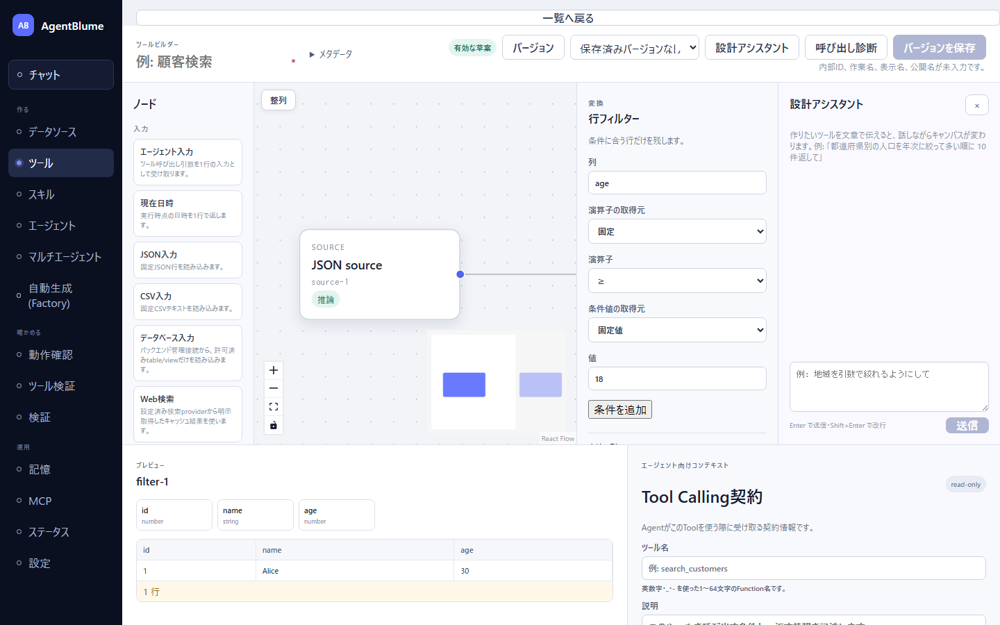
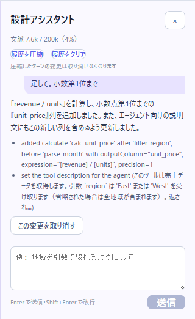
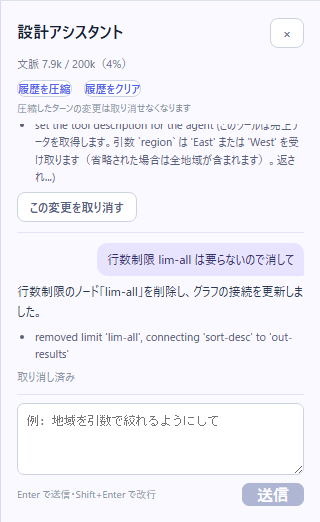
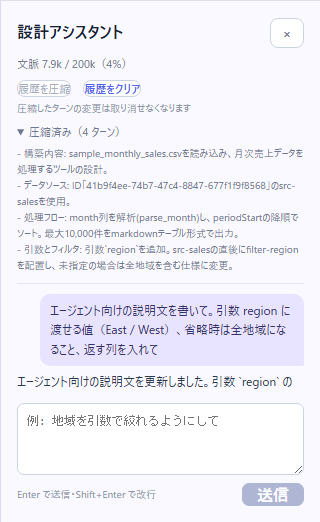

# 設計アシスタントと一緒にツールを設計する

ツール作成画面の「設計アシスタント」に日本語で指示すると、アシスタントがキャンバスのノードを足したり直したりする。この節を読むと、指示の書き方・返答の読み方・取り消し方がわかり、会話しながらツールを組み上げられるようになる。

設計アシスタントはツールの「形」を作るだけで、**保存はしない**。できたら自分で内容を確かめて「バージョンを保存」する。

> 本節の会話例と所要時間は、LM Studio の `google/gemma-4-12b`（12B 級）と同梱サンプル `sample-monthly-sales.csv` で実際に試した結果である。モデルの返答は毎回少しずつ変わるので、**文面は例**として読むこと。

## 使う前に

- 「設定」画面の「モデルプロバイダ」で「メインモデル」を設定しておく（[モデルの設定](../01-getting-started/02-model-settings.md)）。設計アシスタントはメインモデルを使う。構造化出力（JSON で答える機能）に対応したモデルが要る。
- 使うデータは先に「データソース」画面で登録しておく（[データを登録する](../02-data/01-register-data.md)）。アシスタントは新しいファイルを登録できない。

## 開き方

1. 左ナビの「ツール」を開き、「新規作成」を押す（作ってあるツールを直すなら、一覧の「開く」を押す）。
2. 画面上部の「設計アシスタント」を押す。キャンバスと設定欄（インスペクター）の右に「設計アシスタント」の欄が開く。
3. 閉じるときは欄の右上の「×」か、もう一度「設計アシスタント」を押す。開いたか閉じたかはブラウザが覚えていて、次にツールを開いたときも同じ状態で始まる。



「新規作成」で開いたキャンバスには、見本として「JSON source」と「行フィルター」の 2 つのノードが置いてある。アシスタントはいまのキャンバスに**足したり直したり**するので、空から作るときは、先にこの 2 つを選んで `Delete` キーで消しておく（本節の例はそうしている）。

## 指示の送り方

- 欄の下の入力欄（「例: 地域を引数で絞れるようにして」と薄く出ている）に書き、`Enter` で送る。改行は `Shift+Enter`。日本語入力の変換を確定する `Enter` では送られない。
- 送ると「考えています…」と出て、返答が来るまで入力欄は使えない。
- 返答にキャンバスの変更が含まれていれば、**確認なしにすぐキャンバスへ反映**される。変えたノードは 4 秒ほど光り、最初に変えたノードが選ばれて設定欄に開く。
- 前の会話を踏まえて指示できる（「続けて」「さっきの引数を」のように書いてよい）。

### 所要時間の目安

実測（12B 級、ローカル）では 1 回の指示に **数秒〜3 分**かかった。

| 指示の種類 | 実測 |
|---|---|
| 質問だけ（キャンバスを変えない） | 6〜44 秒 |
| 1 ノードの追加・削除・設定の変更 | 7〜60 秒 |
| 空のキャンバスから 5 ノード前後を組む | 約 2 分 |
| 2 つのデータの結合と計算列 | 約 2 分 |
| アシスタントが自分の案を 1 回直した（下の「自動で直してくれる」） | 約 1.5〜3 分 |

## 指示の書き方

コツは 4 つある。

1. **1 回の指示で頼むことは 1 つ**にする。「読んで・絞って・並べて・引数も」とまとめると、どれかが抜けやすい。
2. **データソース名と列名をそのまま書く**。`sample-monthly-sales.csv`、`region`、`revenue` のように、画面に出ている綴りで書く。列名を日本語に言い換えない。
3. **引数は「省略したときどうなるか」まで言う**。「省略したら全地域」「省略したら全期間」のように書くと、省略できる引数（省略可）として作られる。
4. **並べ替えの向き・件数・何の列かをはっきり言う**。「上位だけにして」のようにあいまいだと、アシスタントは何もせずに聞き返してくる。

| 悪い例 | 良い例 |
|---|---|
| 売上のツールを作って | sample-monthly-sales.csv を読んで、month の新しい順に並べて全行を返すツールにして |
| 地域で絞れるように | region を引数で絞れるようにして。省略したら全地域を返す |
| 上位だけにして | revenue の多い順に並べて、上位 3 件だけ返して |
| 単価も出して、あと地域別に集計して並べ替えも直して | revenue を units で割った単価の列 unit_price を足して。小数第1位まで（集計は次の指示で頼む） |

## パターン別の頼み方

以下はすべて実機で試した指示と返答の例である（引用の返答は原文のまま、表は要旨。所要時間は実測）。

### 質問だけする

キャンバスを変えずに、データやツールについて聞ける。「まだ何も作らないで」「質問だけ」と添えると確実である。

> 指示: sample-monthly-sales.csv にはどんな列があり、何行ある？まだ何も作らないで
>
> 返答（6 秒）: sample-monthly-sales.csv には「month」「region」「revenue」「units」の4つの列があり、合計で6行のデータが含まれています。

> 指示: 質問だけ。引数を省略して呼ぶと何行返る？出力が溢れる心配はある？
>
> 返答（20 秒）: 引数を省略して呼び出した場合、フィルタリングの条件に合致するすべての行（現在データソースには6件あります）が抽出されます。出力ノードおよびリミットノードの両方が最大10,000行まで許容しているため、この構成ではデータが溢れる心配はありません。

### 空のキャンバスから作る

> 指示: sample-monthly-sales.csv を読んで、month の新しい順に並べて全行を返すツールにして
>
> 返答（114 秒）: sample-monthly-sales.csv を読み込み、month（期間）を解析した上で、新しい順に並べ替えて全件を表示する構成に修正しました。

このとき、「CSV入力」→「期間の解釈」→「並べ替え」→「行数制限」→「エージェント出力」の 5 ノードが置かれた（ノード一覧と設定欄での名前。キャンバスのノードには `CSV source`、`Parse period`、`Sort`、`Limit`、`Agent output` のように英語名と、`src-sales` のようなノード ID が出る）。`2026-05` のような期間の文字列はそのままでは正しく並ばないので、アシスタントは「期間の解釈」ノードで開始日の列 `periodStart` を作り、それで並べている。空のキャンバスに置いたノードは自動で折り返して並ぶ。

### 途中で直す（引数を足す）

> 指示: region を引数で絞れるようにして。省略したら全地域を返す
>
> 返答（127 秒）: 地域（region）をオプションの引数として追加し、フィルタを追加しました。指定がない場合はすべての地域が含まれます。

**この例では、返答の文には「フィルタを追加しました」とあるのに、変更一覧には「エージェント入力」の追加しか無かった**（行フィルターは作られていなかった）。返答の文ではなく、変更一覧とキャンバスを信じること。足りない分は、ノード名を挙げて頼み直す。

> 指示: 変更一覧に行フィルターが無い。region 列を引数 region で絞る行フィルターを src-sales の直後に足して
>
> 返答（43 秒）: src-sales の直後に、引数 region を使用した行フィルタを追加しました。

引数につないだ行フィルターは、引数が省略されるとその条件を飛ばす（設定欄に「引数が任意 (nullable) の場合、未指定ならこの条件はスキップされます。」と出る）。設定欄の「値」に入っている値（この例では `East`）は、画面下のプレビューのための見本である。

### 計算の列を足す

> 指示: revenue を units で割った単価の列 unit_price を足して。小数第1位まで
>
> 返答（19 秒）: 「revenue / units」を計算し、小数点第1位までの『unit_price』列を追加しました。また、エージェント向けの説明文にもこの新しい列を含めるよう更新しました。

「関数電卓」ノード（式 `[revenue] / [units]`、小数 1 桁）が足された。

### 2 つのデータを結合して計算する

地域ごとの売上目標を別の CSV（`region,target` の 2 列）として登録しておき、次のように頼んだ。

> 指示: sample-monthly-sales.csv と region-targets.csv を region で結合して、達成率 achievement = revenue / target の列を足し、month の新しい順に返して
>
> 返答（115 秒）: 「sample-monthly-sales.csv」と「region-targets.cm」を「region」で結合し、達成率（achievement = revenue / target）の計算と、期間の解析を含めた最新順への並べ替えを構成に追加しました。

2 つの「CSV入力」、「結合」（左右の入力と結合キー `region`）、「関数電卓」、「期間の解釈」、「並べ替え」、「エージェント出力」が置かれ、プレビューに 6 行が出た。返答の文にファイル名の書き間違い（`region-targets.cm`）があるが、変更一覧とキャンバスは正しかった。

### 日付の引数を足す

> 指示: 日付の引数 from を足して、periodStart が from 以降の行だけに絞れるようにして。省略したら全期間
>
> 返答（57 秒）: 「from」引数を使用したフィルタリングを追加しました。これにより、指定された日付（ISO 8601形式）以降のデータのみを抽出できるようになります。省略した場合は全期間が対象となります。

引数 `from` は日付型（省略可）で宣言され、`periodStart` に「以上」で当てる行フィルターが入った。同じ返答で、エージェント向けの説明文にも「ISO 8601 形式の日付」と書き足された。日付の引数は、`2026-06-01` のような ISO 8601 の日付で渡す約束になる。

### 集計する

集計すると元の列（`month` など）は消えるので、集計のあとにある並べ替えも一緒に変える必要がある。**集計と、その後ろの並べ替えの変更は 1 回の指示で頼む**とよい。

> 指示: region ごとに集計して、revenue の合計 total_revenue と achievement の平均 avg_achievement を返すようにして。並べ替えは total_revenue の多い順に変えて
>
> 返答（84 秒）: region ごとに集計する処理を追加し、revenue を total_revenue（合計）、achievement を avg_achievement（平均）として算出するように変更しました。また、最終的な並べ替えを total_revenue の降順に変更しました。

プレビューには `East 395000`、`West 309000` の 2 行が出た。

先に「並べ替えの前に、region ごとに revenue の合計と achievement の平均を出す集計を入れて」とだけ頼んだときは、並べ替えが使う `periodStart` を残すために、アシスタントが**勝手に `periodStart` もグループのキーに加えた**（地域ごとではなく地域×月の集計になった。約 3 分）。返答の文にそう書いてあったので、「この変更を取り消す」で戻してから上の指示で頼み直した。

### ノードを消す

> 指示: 行数制限 lim-all は要らないので消して
>
> 返答（7 秒）: 行数制限のノード「lim-all」を削除し、グラフの接続を更新しました。

途中のノードを消すと、前後のノードは自動でつなぎ直される。ノード名（キャンバスのノードに小さく出ている `lim-all` のような ID）を書くと確実である。

### 壊れたツールを直させる

並べ替えの列を手で存在しない `sales` に書き換えると、ノードに「不一致」と `sort: column not found: sales` が出て、画面上部の表示が「問題あり」になった。この状態で頼んだ。

> 指示: 並べ替えがエラーになっている。直して
>
> 返答（11 秒）: 並べ替えの基準を `sales` から、集計後の列である `total_revenue` に修正しました。

エラーのあるキャンバスでも、アシスタントはいまの列と設定を読んで直せる。

### アシスタントが何もしない返答

次のようなときは、キャンバスを変えずに説明や聞き返しだけが返る（取り消しボタンも出ない）。

| 指示の例 | 返答（要旨） |
|---|---|
| 上位だけにして | 「上位10件のみ表示するように制限を設ける」ことか、「売上が高いものだけで絞り込む」ことか、意図を教えてほしい（44 秒） |
| 都道府県別の人口データも結合して、1 人あたり売上を出して | 人口データが現在のデータソース一覧に含まれていないため、まずはデータソース画面にて該当のファイルを登録してほしい（20 秒） |
| region が North の行だけに固定で絞って | データに「North」は無く（あるのは East と West だけ）、この条件だと結果が空になる。別の値を指定してほしい（58 秒） |
| sort-m の並べ替えキーを month 列（文字列のまま）の昇順にして | 集計のあとには month 列が無いので並べ替えられない。月ごとに並べたいなら集計のキーに month を足す必要がある（38 秒） |

聞き返されたら、答えを具体的に書いて送り直す。データが足りないと言われたら、「データソース」画面で登録してからもう一度頼む。

## 返答の読み方



1 回の返答は、上から次の順に並ぶ。

1. **自分の指示**（色付きの吹き出し）
2. **アシスタントの説明**（指示と同じ言語）
3. **変更一覧**（箇条書き）— 実際にキャンバスへ当てた変更の記録。`added filter 'filter-region' after 'src-sales'`（ノード `filter-region` を `src-sales` の後ろに追加した）、`removed limit 'lim-all'`（削除した）、`set config of sort 'sort-m': …`（設定を変えた）、`connected …`（つないだ）、`set the tool description for the agent (…)`（エージェント向けの説明文を書き換えた）のように、英語の決まった形で出る。
4. **赤い枠**（出たときだけ）— 適用しなかった理由。アシスタントの案が検査に通らなかったので、**キャンバスは変わっていない**。理由を読んで指示を直す。
5. **黄色い注記**（出たときだけ）— 適用はしたが気をつけてほしい点。たとえば、月次と年次の行が混ざった期間の列を粒度で絞っていない、など。指示どおりなら（「全行を」と頼んだ等）そのままでよい。
6. **「この変更を取り消す」**— キャンバスか説明文を変えた返答にだけ出る。

**説明の文と変更一覧が食い違うことがある**（上の「途中で直す」の例）。何が起きたかは変更一覧と、キャンバスのノード、画面下のプレビューで確かめる。

## 「この変更を取り消す」

1. 戻したい返答の下の「この変更を取り消す」を押す。
2. キャンバス（と、その返答が書き換えていれば説明文も）が、その指示を送る前の状態に戻る。その返答には「取り消し済み」と出る。



- それより**後の返答で加えた変更も一緒に戻る**（後の返答にも「取り消し済み」が付く）。
- 会話そのものは消えない。
- 「履歴を圧縮」で畳んだ返答は、取り消せなくなる。
- アシスタントは確認なしに変更を当てるので、「思ったのと違う」と感じたらまず取り消してから、指示を直して送り直すのが早い。

## 自動で直してくれる書き間違い

アシスタント（モデル）の案は、キャンバスに当てる前に検査される。

- **機械的な書き間違いは黙って直る**: ノード ID の `_` や大文字の揺れ、結合キーの書き方の揺れ、引数につないだ行フィルターの「値」が空（データに実在する値を見本として入れる。日付なら期間の最小・最大）、引数の取得元の綴り違い、「エージェント出力」の設定の書き忘れ。上の「途中で直す」の例で、行フィルターの値に `East` が入っていたのはこれである。
- **答えが間違う形は 1 回だけアシスタント自身に直させる**: 期間の文字列（`2025年9月` など）のまま並べ替えている、プレビューが 0 行になる、グラフとして成り立たない、など。直した案が通れば普通の返答として出る（直させたことは画面には出ないが、そのぶん時間がかかる）。
- 直させても通らなければ、**キャンバスは変えずに**赤い枠で理由を出す。

## 文脈メーターと履歴の圧縮・クリア



見出しの下に「文脈 7.6k / 200k（4%）」のようなメーターが出る。直前の返答でモデルが読んだ量（トークン数）と、モデルが一度に読める量である。

- 最初の返答が来るまでは出ない。読める量を取れないモデルでは「文脈 約 7.6k トークン」とだけ出る。
- 70% を超えると黄色、90% を超えると赤になり、赤のときは「履歴を圧縮するか、クリアしてください」と出る。赤のまま続けると古い会話から切り捨てられる。
- 量の大半はキャンバスの中身とノードの説明で、会話そのものは小さい。実測では 10 回ほど話しても 3〜4% だった。

会話が 1 回以上あると、メーターの下に「履歴を圧縮」「履歴をクリア」が出る。

- **「履歴を圧縮」**: 会話が 5 回以上のときに押せる（それまではボタンにマウスを載せると理由が出る）。直近 4 回はそのまま残し、それより古い会話をモデルに箇条書きの要約にさせる。要約は会話の先頭に「圧縮済み（N ターン）」として畳まれ、開くと読める。実測では 8 回の会話のうち 4 回を 16 秒で要約した。**圧縮した回の変更は取り消せなくなる**。メーターの数字は次の返答で更新される。
- **「履歴をクリア」**: 会話・要約・メーターを消す。キャンバスは変わらない。別の作業を頼みたいとき、話が込み入ってきたときに使う。

アシスタントが読むのは直近の会話（最大 12 件の発言。指示と返答で 1 回あたり 2 件）と、圧縮した要約である。別のツールを開く・「新規作成」・「テンプレートから作成」をすると、会話は消える。

## エージェント向けの説明文を書かせる

エージェントがツールを呼ぶ前に読むのは、画面下の「エージェント向けコンテキスト」（Tool Calling契約）の「ツール名」と「説明」だけである（詳しくは [引数と Tool Calling 契約](./06-arguments-and-contract.md)）。説明文もアシスタントに書かせられる。

> 指示: エージェント向けの説明文を書いて。引数 region に渡せる値（East / West）、省略時は全地域になること、返す列を入れて
>
> 返答（47 秒）: エージェント向けの説明文を更新しました。引数 `region` の許容値（East / West）、省略時の挙動（全地域を含むこと）、および返却される列の情報を説明文に含めています。

「説明」欄には次の文が入った（例）。

```text
このツールは売上データを取得します。引数 `region` は 'East' または 'West' を受け取ります（省略された場合は全地域が含まれます）。返される列は、month, region, revenue, units, periodStart, periodGranularity です。
```

- 引数や列を足した返答で、頼まなくても説明文が書き換わることがある（実測: 日付の引数 `from` と計算列 `unit_price` を足したとき）。書き換わらないこともある（実測: 引数 `region` を足したとき）。変更一覧に `set the tool description for the agent` が無ければ、上のように頼む。
- 「この変更を取り消す」は説明文も戻す。
- **保存の前に「ツール名」が空でないか確かめる**。「説明」だけ書かれて「ツール名」が空のまま保存すると、**説明文は保存されない**（実測: 保存したツールを読み直すと説明が消えていた）。「ツール名」には公開名と同じ `monthly_sales_by_region` のような英数字・`_`・`-` の名前を入れる。

## 保存は自分で

アシスタントはキャンバスを変えるだけで、保存はしない。

1. 画面下の「プレビュー」で、最後のノードに期待した行が出ているかを見る（ノードを選ぶとそのノードの結果が出る）。
2. キャンバスが見づらければ、キャンバス左上の「整列」を押す（直後の「元に戻す」で 1 回だけ戻せる）。アシスタントが既存のキャンバスに足したノードは、表示範囲の外に置かれることがある。
3. 表示名と「メタデータ」（内部ID・作業名・公開名）を入れ、「エージェント向けコンテキスト」の「ツール名」も入れる。
4. 「呼び出し診断」で、エージェントから呼べる状態かを確かめる（任意）。
5. 「バージョンを保存」を押す。

詳しくは [確認・保存・版](./07-check-save-versions.md)。

## モデルが設定されていないとき

「設計アシスタント」のボタンは押せるが、欄の入力欄と「送信」が使えず、「ローカルLLMが未設定です。設定 > モデル で main スロットを設定して再読み込みすると、AIに式を書かせられます。」と出る。

1. 左ナビの「設定」を開き、「モデルプロバイダ」の「メインモデル」を設定して「保存」する（[モデルの設定](../01-getting-started/02-model-settings.md)）。
2. ブラウザを再読み込みする（使えるかどうかは、ツール画面を開いたときに 1 度だけ調べるため）。

## うまくいかないとき

| 症状 | 原因 | 直し方（直す場所） |
|---|---|---|
| 入力欄が灰色で打てない | メインモデルが未設定か、構造化出力に対応していない | 「設定」→「モデルプロバイダ」でメインモデルを設定し、再読み込みする |
| 「考えています…」が数分続く | ローカルモデルは 1 回に数秒〜3 分かかる。アシスタントが自分の案を直しているとさらに延びる | 待つ。1 回の指示を小さくすると速い。ほかの機能（Factory など）が同じモデルを使っていると遅くなる |
| 会話の下、入力欄の上に赤い帯（リクエストの失敗）が出る | モデルとの通信が失敗した | 「設定」の「テスト」でモデルにつながるか確かめてから、同じ指示を送り直す |
| 返答に赤い枠が出てキャンバスが変わらない | アシスタントの案が検査に通らなかった | 赤い枠の理由を読み、列名・データソース名・値をはっきり書いて送り直す |
| 返答は「追加しました」なのにノードが増えていない | 説明の文と実際の変更が食い違った | 変更一覧を見て、足りないノードをノード名つきで頼み直す |
| 頼んだのと違う形になった（例: 地域ごとの集計が地域×月になった） | 前後のノードとの辻つまを合わせるため、アシスタントが指示を変えて当てた。返答の文に理由が書いてある | 「この変更を取り消す」で戻し、関係する変更（例: 集計と並べ替え）を 1 回の指示でまとめて頼む |
| 何も変えずに聞き返される | 指示があいまい（どの列か・どの向きか・何件か） | 列名・向き・件数を書いて送り直す |
| 「データソース画面にて登録してください」と言われる | そのデータが登録されていない | 「データソース」画面で登録してから頼み直す（[データを登録する](../02-data/01-register-data.md)） |
| ノードが画面の外にある・重なって見えない | 既存のキャンバスに足したノードは上流の隣に置かれる | キャンバス左上の「整列」を押す |
| プレビューが空（0 行） | 見本の値がデータに無い | 行フィルターの「値」をデータにある値にする（データに無い値を頼むと、アシスタントはその旨を答えて何もしない。上の「North」の例） |
| 保存したら説明文が消えた | 「ツール名」が空のまま保存した | 「エージェント向けコンテキスト」の「ツール名」を入れて、説明を書き直して保存し直す |
| 「履歴を圧縮」が押せない | 会話が 4 回以下 | 5 回目以降に押せる。すぐ消したいなら「履歴をクリア」 |

## 次に読む

- [チュートリアル: データからエージェントを作る](../11-tutorials/01-build-an-agent-end-to-end.md) — この節の流れでツールを作り、エージェントに持たせて検証するまでを通す
- [引数と Tool Calling 契約](./06-arguments-and-contract.md)
- [ノード一覧](./03-node-reference.md) — アシスタントが置いたノードの意味を調べる
- 開発者向けの詳細: [docs/06 §3.17 設計アシスタント](../../06-etl-tool-builder.md#317-設計アシスタント文章で指示するとノードが増える)
