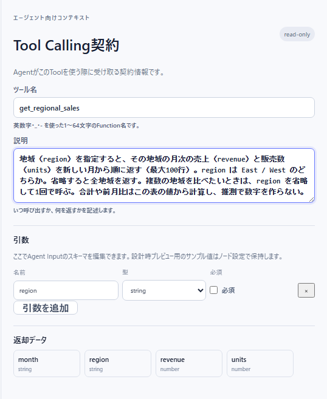

# 06 引数と Tool Calling 契約

この節を読むと、ツールにエージェントから値（引数）を受け取らせ、その値で行を絞る方法と、エージェントに見せる「ツール名」「説明」の決め方、結果をどんな形・量で返すかが分かる。エージェントがツールを正しく選び、正しい引数で呼べるかどうかは、ほぼこの節の内容で決まる。

## Tool Calling 契約とは

エージェント（LLM）はツールの中身（ノード）を見ない。見えるのは次の 4 つだけで、これを「Tool Calling 契約」と呼ぶ。

| 項目 | 画面の場所 | エージェントにとっての意味 |
|---|---|---|
| ツール名 | 「Tool Calling契約」の「ツール名」 | 呼ぶときの名前（function 名） |
| 説明 | 同「説明」 | **いつ呼ぶか・何を返すか・引数の渡し方を知る唯一の文章** |
| 引数 | 同「引数」（= エージェント入力ノード） | 渡す値の名前・型・必須かどうか |
| 返却データ | 同「返却データ」 | 返ってくる列（参考表示。出力ノードの手前の列が出る） |

ツール画面の下右「エージェント向けコンテキスト」が、この契約の編集欄である。右上には副作用（`read-only` など）が出る。



## 引数（エージェント入力）

### 引数を宣言する

引数は「エージェント入力」ノードで宣言する。「Tool Calling契約」の「引数」は、このノードの中身をそのまま編集する欄である。

1. パレットの「入力」から「**エージェント入力**」を置く（どこにもつながない）。
   → 見本として `query`（string・必須）が 1 つ入っている。
2. 「Tool Calling契約」の「引数」で、名前・型を直す。行を足すなら「**引数を追加**」（任意の string として足される）、消すなら行の「×」。
3. 「必須」のチェックで、必ず渡させるか（必須）、省略してよいか（任意）を決める。
4. 「エージェント入力」ノードを選び、インスペクターの「詳細テキスト編集」の「サンプル引数」に、プレビュー用の見本の値を JSON で書く（例 `{"region": "East"}`）。「設定を開く」のダイアログの「詳細サンプルJSON」でも同じ。

| 型 | 使う値 | エージェントが渡す形 |
|---|---|---|
| `string` | 地域名・コード・キーワード | `"East"` |
| `number` | 件数・金額の下限 | `100` |
| `boolean` | はい/いいえ | `true` |
| `date` | 日付の範囲 | `"2026-05-01"`（ISO 形式の日付。実行時に日付へ変換される） |

- **必須の引数には、サンプル引数に見本の値が要る。** 無いとノードに問題が出てプレビューが止まる。
- 「エージェント入力」ノードは 1 つだけ置く。2 つ置いて宣言が食い違うと「Agent Inputノードが複数あり引数が一致しません。1つに統合してください」で保存できない。
- 引数の説明を書く欄は無い。**引数の意味や取りうる値は「説明」に書く**（後述）。

### 値を条件に差し込む（束縛）

宣言しただけの引数は何にも使われない。行フィルターの条件に差し込んで初めて効く。

1. 行フィルターを選ぶ。
2. 「**条件値の取得元**」を「固定値」から「**エージェント入力**」に変える。
3. 「**エージェント入力フィールド**」で引数を選ぶ。

このとき次のように動く。

- 設計中のプレビューは、「値」に入れていた固定値を見本として使う（「固定値は設計時プレビューのサンプルとして残ります。」）。
- 実行時は、エージェントが渡した値で絞る。
- **任意の引数が省略されたら、その条件ごと飛ばす**（絞らない）。「省略したら全件」を作りたいときは任意にする。

**比べ方もエージェントに選ばせる**: 「演算子の取得元」を「エージェント入力」にし、「エージェント入力フィールド（演算子）」で string 型の引数を選ぶ。「AIに許可する演算子」で選ばせてよい演算子を絞り、「既定の演算子」は、引数が省略されたときに使う演算子になる。値の引数と演算子の引数は別々に宣言する（1 つの引数を両方には使えない）。

**複数の値を 1 回で渡させる**: 演算子を「いずれかに一致」に固定し、値の取得元をエージェント入力にする。引数は **string 型**で宣言し、エージェントは `"East,West"` のようにカンマ区切りで渡す（読点・セミコロン・改行でもよい。最大 100 件）。「サンプルの値」はプレビューの見本で、エージェントへの説明の例としても使われる。

### 期間で絞る引数の例

「期間の解釈」で作った `periodStart`（日付）で絞るときは、`period_from` / `period_to` を `date` 型・任意で宣言し、行フィルターの `periodStart ≥ period_from`・`periodStart ≤ period_to` に束縛する。エージェントは `"2024-04-01"` のような ISO 日付を渡す。

## ツール名と説明

### ツール名

- 英数字・`_`・`-` の 1〜64 文字（例 `get_regional_sales`）。日本語や空白は使えない。
- 他のツールと重ならない、何をするか分かる名前にする（動詞 + 対象がよい）。
- 「ツール名」と「説明」は両方入れるのが基本。**片方だけでも保存できる**（v53）: 「ツール名」が空なら、保存時に代わりに「公開名」が使われる。「説明」が空なら、既定の説明（`表示名 (副作用)`）で補われる。ただし補った名前（公開名）がモデルへ公開できない形（日本語・空白・記号を含む）だと保存が止まるので、結局は英数字・`_`・`-` のツール名か公開名のどちらかを用意することになる。

### 説明の書き方

エージェントはこの説明だけを読んで、どのツールをいつ・どう呼ぶかを決める。次の 5 点を入れる。

1. **何を返すか**（列と並び順・最大行数）
2. **いつ使うか**（どんな質問のとき）
3. **引数ごとの意味と渡し方**（取りうる値を綴りのまま。形式。省略したときどうなるか）
4. **返った値の扱い**（「合計や差はこの表から計算し、推測しない」など）
5. **使わないとき**（紛らわしい別のツールがあるなら）

良い例（「地域別の月次売上」ツール）:

```
地域（region）を指定すると、その地域の月次の売上（revenue）と販売数（units）を
新しい月から順に返す（最大100行）。
region は East / West のどちらかを英字のまま渡す。省略すると全地域を返す。
複数の地域を比べたいときは、region を省略して1回で呼ぶ。
合計や前月比はこの表の値から計算し、推測で数字を作らない。
```

誤解されやすい書き方と直し方:

| 書き方 | 起きること | 直し方 |
|---|---|---|
| 「売上データを返す」だけ | どの質問で呼ぶか・引数に何を入れるか分からない | 返す列・並び・引数の意味を書く |
| 取りうる値を書かない | `東`・`east`・`Eastern` などを渡して 0 行になる | 「East / West のどちらか」と綴りのまま書く |
| 粒度を「月次」と書く | 引数に `月次` や `monthly` を渡してくる | 「`month` / `year` をこの綴りで渡す」と書く |
| 日付の形式を書かない | `2024/4/1` や `昨年` を渡してくる | 「ISO 日付（例 2024-04-01）」と書く |
| 省略時の動きを書かない | 毎回すべての引数を埋めようとする、または大事な引数を省く | 「省略すると全件」「必ず指定する」を書く |

> 設計アシスタントに「説明文に引数の書式と粒度の綴りを書いて」と頼むと、説明を書き直してくれる。引数を足した・変えたときは、頼まなくても説明が更新される（[05 設計アシスタントと一緒に設計する](./05-design-assistant.md)）。

## 出力の形と溢れ方

結果の返し方は、終端の出力ノードで決まる。ふつうは「エージェント出力」を使う。

### エージェント出力の「返却形式」

| 返却形式 | エージェントが受け取るもの | 向いている用途 |
|---|---|---|
| `rows` | 行の一覧（既定） | 一覧・推移 |
| `first-row` | 先頭の 1 行だけ | 「最新の 1 件」「該当する 1 件」 |
| `single-value` | 先頭行の 1 つの値（「値の列」で指定） | 合計値・件数など 1 つの数 |
| `summary` | 行数・列の一覧・先頭 10 行 | 行が多い表の概要だけを渡したいとき |

「形式」は `json`（既定）・`markdown-table`・`chartjs` から選ぶ。「返却する列」を選ぶと、その列だけを返す（未選択なら全列）。

### 溢れたとき

| 超えたもの | 起きること |
|---|---|
| 「最大行数」（既定 100） | 先頭から最大行数ぶんだけ返し、「全 N 行のうち M 行を表示、残りは省略」という注記と全行数を添える（エージェントが「見えている行がすべて」と誤解しないように）。実行は失敗しない |
| 「最大バイト数」（既定 65,536） | 「上限超過時」が `error`（既定）なら、ツールの呼び出しが失敗する。`store-and-reference` なら、全体をその会話の一時置き場に保存し、エージェントには参照とプレビューを返す（副作用は自動で `session-write` になる） |

- 行がたくさんある表をそのまま返すと、エージェントは先頭しか読めず、上限にも当たりやすい。**ツールの中で絞る・並べ替えて上位だけにする・集計する**のが基本。
- 結果が 0 行のときは、どの条件で 0 行になったかと、その列に実在する値の例がエージェントへ添えられる。エージェントはそれを見て引数を直して呼び直せる。

### そのほかの出力ノード

表を一時置き場に置いてエージェントには参照だけ渡す「ワークスペース出力」、関係のグラフを作る「グラフ出力」、可視化用の「チャート出力」もある（[03 ノード一覧](./03-node-reference.md#出力)）。

## うまくいかないとき

| 症状 | 原因 | 直し方（直す場所） |
|---|---|---|
| 保存ボタンの下に「「…」はモデルへ公開できる function 名ではありません。…」 | ツール名（未入力なら公開名）に日本語・空白・記号が入っている | 「Tool Calling契約」の「ツール名」を英数字・`_`・`-` の 1〜64 文字にする |
| 「Agent Inputノードが複数あり引数が一致しません。1つに統合してください」 | エージェント入力ノードが 2 つある | 片方を消し、引数を 1 つのノードにまとめる（キャンバス） |
| 「エージェント入力フィールド」に候補が無い／「先にAgent Inputノードを追加し、スキーマを定義してください。」 | エージェント入力ノードが無い、または引数が無い | エージェント入力を置き、引数を宣言する |
| 演算子の取得元で「先にAgent Inputノードで string 型の引数を宣言してください。」 | 演算子に使える string 型の引数が無い | string 型の引数を足す（「Tool Calling契約」の「引数」） |
| エージェント入力ノードに問題が出てプレビューが止まる | 必須の引数に見本の値が無い／見本の型が違う | 「サンプル引数」に正しい型の値を入れるか、引数を任意にする |
| エージェントが引数を省いて全件を受け取ってしまう | 引数が任意で、説明に「必ず指定」と書いていない | 必須にするか、説明に使い方を書く |
| エージェントの実行で「ツールの出力（N バイト）がエージェント出力の上限（M バイト）を超えました…」 | 返す量が多すぎる | 行数制限・集計で減らすか、出力ノードの「上限超過時」を `store-and-reference` にする／「ワークスペース出力」に切り替える（出力ノードの設定） |
| エージェントが 0 行を受け取り続ける | 引数の綴り・形式が実データと合っていない | 説明に取りうる値と形式を綴りのまま書く。ツール検証で同じ引数を試す |

## 次に読む

- 保存前の検査と保存: [07 確認・保存・版](./07-check-save-versions.md)
- 保存したツールを引数つきで試す: [08 ツール検証](../08-validation/01-tool-check.md)
- エージェントに持たせる: [04 ツール・スキル・Wiki・MCP を持たせる](../04-agents/03-attach-tools-and-more.md)
