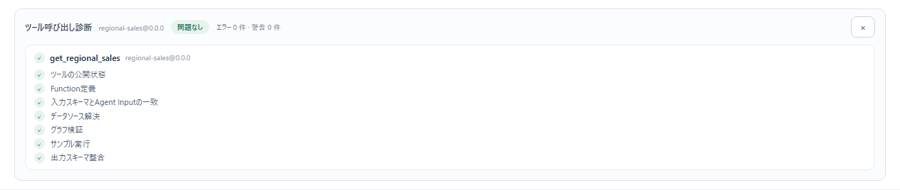

# 07 確認・保存・版

この節を読むと、組んだツールがエージェントから呼べる状態かを保存前に確かめ（「呼び出し診断」）、保存できない理由を直し、「バージョンを保存」で版として残し、前の版を開き直せるようになる。

ここで使うのは、ツール編集画面の上の帯にあるボタンである。

## 1. 状態表示を見る

帯の左側の小さな表示は、編集のたびに自動で行う検査の結果である。

| 表示 | 意味 |
|---|---|
| 「確認中…」 | 自動の検査をしている |
| 「有効な草案」 | グラフに問題が無い。保存できる（名前などがそろっていれば） |
| 「問題あり」 | どこかのノードに問題がある。赤い文がノードのカードとプレビューに出ている |
| 「草案に問題あり」 | 設定が途中で検査まで進めない、または検査そのものが失敗した。理由はプレビューの上に出る |

## 2. 「呼び出し診断」で確かめる

「**呼び出し診断**」は、**保存せずに**、今の内容でエージェントから呼び出せるかを検査する（エージェントが実行するときと同じ事前検査）。

1. 表示名・内部ID・作業名・公開名を入れる（未入力だとボタンが押せない）。
2. 「**呼び出し診断**」を押す。
   → 「診断中…」の後、プレビューの上に「ツール呼び出し診断」が出る。

見出しの横に全体の判定（「問題なし」「要確認」「呼び出し不可あり」）と「エラー N 件 · 警告 N 件」が出る。検査項目は次のとおり（ツールの中身によって出ない項目もある）。

| 検査項目 | 見ていること |
|---|---|
| ツールの公開状態 | エージェントから使える状態か |
| Function定義 | ツール名（function 名）と説明が正しい形か |
| 入力スキーマとAgent Inputの一致 | 引数の宣言が 1 つにまとまっているか |
| データソース解決 | 読むデータソースが見つかるか |
| グラフ検証 | つながり・設定・列の参照に問題が無いか |
| サンプル実行 | 見本の引数で実際に最後まで動くか |
| 出力スキーマ整合 | 返す列の形が定まっているか |
| 演算子引数 | 演算子をエージェントに選ばせる設定が正しいか |
| 複数値の引数 | 複数の値を渡させる引数が正しい型か |
| 副作用と承認 | 副作用の宣言と出力ノードが合っているか |

問題のある行には、原因と直し方の文、問題のノードID、そして**直す場所へ移るボタン**が付く。

| ボタン | 押すと |
|---|---|
| 「ノード「…」を開いて直す」 | キャンバスでそのノードを選び、インスペクターを開く（行のどこをクリックしても同じ） |
| 「エージェント向けコンテキストへ移動」 | 「Tool Calling契約」のツール名の欄へ移る |
| 「出力ノードを選択」 | 終端の出力ノードを選ぶ |

診断の結果は、直している間も「×」で閉じるまで残る。直したらもう一度「呼び出し診断」を押して確かめる。

## 3. 保存できない理由を直す

「**バージョンを保存**」が押せないときは、ボタンの下に理由が出る（ボタンにマウスを重ねても出る）。上から順に確かめる。

| 表示 | 直し方（直す場所） |
|---|---|
| 「内部ID、作業名、表示名、公開名が未入力です。」（足りない項目だけ出る） | 表示名は帯の左の欄、ほかは「メタデータ」を開いて入れる |
| 「「…」はモデルへ公開できる function 名ではありません。「エージェント向けコンテキスト」で英数字・_・- の1〜64文字のツール名を設定してください」 | 「Tool Calling契約」の「ツール名」を直す |
| 「Agent Inputノードが複数あり引数が一致しません。1つに統合してください」 | エージェント入力ノードを 1 つにする（キャンバス） |
| 「グラフ検証の完了を待っています…」 | 自動の検査が終わるのを待つ（数秒） |
| 「グラフにエラーがあるため出力スキーマを確定できません。エラーを直してから保存してください」 | 赤い文の出ているノードを直す。「呼び出し診断」で場所へ移れる |

### メタデータの各欄

「メタデータ」を開くと、次の欄がある（`*` は必須）。

| 欄 | 入れるもの | 例 |
|---|---|---|
| 内部ID `*` | ツールを見分ける ID。**同じ内部IDで保存すると、そのツールの新しい版になる** | `regional-sales` |
| 作業名 `*` | 自分用の呼び名 | `地域別の月次売上（作業中）` |
| 公開名 `*` | 公開用の名前。ツール名を入れていないときは、これがエージェントに見える名前になる | `regional_sales` |
| 所有者 | **省略可**。空欄なら保存時にログイン中の利用者名が入る（単一利用者モードでは `Local operator`） | |
| テナント / ワークスペース | 表示だけ（保存先はサーバーが決める） | |
| 副作用 | `read-only` / `session-write` / `write` / `external-action`（[01 ツールとは](./01-what-is-a-tool.md#読み取り専用と副作用)） | `read-only` |

表示名（帯の左の欄）は一覧やエージェントの選択画面に出る名前で、日本語でよい。

## 4. 「バージョンを保存」する

1. 状態表示が「有効な草案」であることを確かめる。
2. 「**バージョンを保存**」を押す。
   → 「保存中…」の後、「保存しました バージョン 1.0.0」と出る。版の選択欄に `1.0.0` が入る。

- 最初の保存は `1.0.0`。以後、同じ内部IDで保存するたびに `1.0.1`、`1.0.2` … と新しい版が増える。**前の版は上書きされずに残る。**
- 保存すると、ブラウザに退避していた編集途中の内容（下書き）は消える。
- 保存したツールは「ツール一覧」に `公開名@最新の版` で並び、エージェントの「ツール」で選べるようになる。

## 5. 版を見る・前の版を開く

- 「**バージョン**」を押すと、そのツールの保存済みの版の一覧を読み直す。
- 横の選択欄（「バージョン履歴」）で版を選ぶと、その版の内容がキャンバスに読み込まれる。
- 前の版を開いて直し、「バージョンを保存」すると、**最新の版の次の番号**で新しい版として保存される（前の版を書き換えるのではない）。
- 「内部ID」を別の値に変えると、版の一覧は空になり、保存すると**別のツール**として `1.0.0` から始まる。既存のツールを複製して別物を作りたいときに使える。

> エージェントは、選んだツールの版を使う。ツールを直して新しい版を保存したら、エージェント側で使う版を確かめる（[04 ツール・スキル・Wiki・MCP を持たせる](../04-agents/03-attach-tools-and-more.md)）。

## 6. 保存したツールを試す（ツール検証へ）

キャンバスのプレビューは、見本の引数での結果しか見せない。保存したら、いろいろな引数で試しておく。

1. 左ナビの「確かめる」→「**ツール検証**」を開く。
2. 「ツール」で保存したツールを選ぶ。引数の欄が自動で出る。
3. 引数を入れて「実行」を押す。出力と行数が出る。エラーのときは「ツール「…」のノード「…」を開いて直す」ボタンで、このツール画面の該当ノードへ戻れる。
4. 期待する結果を書いて「ケースとして保存」しておくと、ツールを直したあとに同じ確認をまとめてやり直せる。

詳しくは [08 ツール検証](../08-validation/01-tool-check.md)。

## うまくいかないとき

| 症状 | 原因 | 直し方（直す場所） |
|---|---|---|
| 「呼び出し診断」が押せない | 表示名・内部ID・作業名・公開名のどれかが空 | 帯の表示名と「メタデータ」を埋める |
| 「診断に失敗しました: …」 | サーバーに届かなかった、など診断そのものが失敗した | サーバーが動いているか確かめ、もう一度押す |
| 診断で「データソース解決」が赤 | 入力ノードのデータソースが削除された・未選択 | 入力ノードの「設定を開く」で登録済みデータソースを選び直す |
| 診断で「サンプル実行」が赤 | 見本の引数で実行すると止まる（0 除算の `fail`、結合の上限、AI判定のモデル未設定など） | 行の文と「ノード「…」を開いて直す」に従う |
| 保存したら別のツールの版が増えた | 内部IDが既存のツールと同じだった | 別物にしたいなら内部IDを変えて保存し直す。増えた版は残るので、元のツールの版を選んで開き直せる |
| 保存後に一覧へ戻っても出ない | 保存に失敗している（ボタンの下に赤い文） | 赤い文の内容を直して保存し直す |
| 編集中の内容が消えた | 別のツールを開いた・画面を閉じた | ツールを開き直し、「未保存の編集内容があります（…）。復元しますか？」で「復元」を押す |

## 次に読む

- 保存したツールを試す: [08 ツール検証](../08-validation/01-tool-check.md)
- エージェントに持たせる: [04 ツール・スキル・Wiki・MCP を持たせる](../04-agents/03-attach-tools-and-more.md)
- 困ったとき全般: [困ったとき](../10-operations/04-troubleshooting.md)
