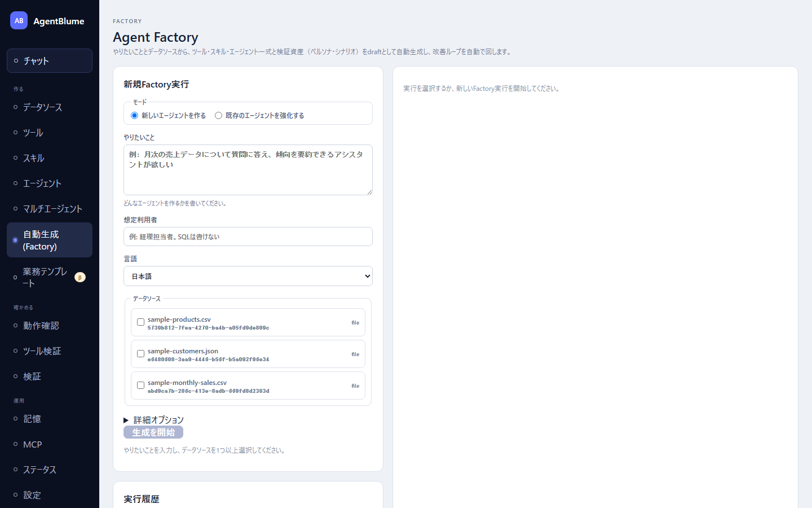

# Factoryで作る

「Factory」は、やりたいこととデータソースを渡すだけで、ツール・スキル・エージェント一式と検証用の資産（ペルソナ・シナリオ）を自動で作り、疑似ユーザーで検証してから自動で改善する画面。左ナビ「作る → **自動生成 (Factory)**」から開く。

この節を読むと、Factoryに何を入力すればよいか、実行中の画面が何を表しているか、できあがったものをどう受け取って使い始めるかが分かるようになる。

## Factoryは何をしてくれるか

「ツールを1から組む」「エージェントにシステムプロンプトを書く」を自分でやる代わりに、Factoryへ**目的の文章**と**使いたいデータソース**を渡すと、次を自動で行う。

1. データソースの中身（列・型・値の例）を調べる。
2. 計画を立てる（どんなツールを何本作るか・どんなスキルを持たせるか）。
3. ツール・スキルを実際に作る。
4. エージェントを組み立てる。
5. 検証用のペルソナ（疑似ユーザー）とシナリオを作る。
6. その疑似ユーザーとエージェントを会話させて検証し、結果を見て**自動で改訂**する（これを目標達成か上限に達するまで繰り返す）。

できあがるものはすべて**下書き（draft）**であり、Factoryの画面からそのまま公開されることはない。「ツール」「エージェント」「検証」など、いつもの画面を開いて中身を確認・編集し、公開するかどうかは自分で決める。

## 始め方

1. 「新規Factory実行」カードの「**モード**」で選ぶ。
   - 「**新しいエージェントを作る**」… 何も無いところから一式を作る。
   - 「**既存のエージェントを強化する**」… 既にあるエージェントに、足りないツールや改善したプロンプトを追加する。「**強化する対象エージェント**」でエージェントを選ぶ。
2. 「**やりたいこと**」に、作りたい（または改善したい）内容を日本語で書く。
   - 新規作成の例: 「月次の売上データについて質問に答え、傾向を要約できるアシスタントが欲しい」
   - 強化の例: 「集計の精度を上げたい、期間指定に対応させたい」
3. 「**想定利用者**」に、使う人の背景を書く（例: 「経理担当者。SQLは書けない」）。任意項目。
4. 「**データソース**」で、使わせたいデータソースにチェックを入れる（最大5件）。新規作成では1件以上が必須。強化では任意（新しいツールが要らなければ選ばなくてよい）。
5. 必要なら「**詳細オプション**」を開いて調整する。
   - 「**最大イテレーション数**」（1〜10、既定3）… 検証→改善を繰り返す回数の上限。
   - 「**ペルソナ数**」（1〜5、既定2）・「**シナリオ数**」（1〜10、既定4）… 検証に使う疑似ユーザーとシナリオの数。
   - 「**生成前に計画承認を必須にする**」… オンにすると、計画ができた時点で一度止まり、内容を確認してから先へ進められる。
   - 「**ツールの作り方**」… 「**段階的（推奨）**」は判断を小さく分けてから決まった手順で組み立てるので、小さいモデルでも失敗しにくい（失敗したときは自動で「一括」に切り替わる）。「**一括**」は従来どおり1回でグラフ全体を作らせる。
   - （強化のときだけ）「**システムプロンプト**」… 「**既存プロンプトを保つ（ツール・スキルのガイドのみ更新）**」が既定。「**モデルに役割・ルールを書き直させる**」を選ぶと、役割文・実行規則ごと書き直させる（手で書き足した文言は引き継がれない）。
6. 「**生成を開始**」を押す。

「生成を開始」が押せないときは、その理由（「やりたいことを入力してください。」「データソースを1つ以上選択してください。」など）がボタンの下に出る。

## 計画承認を使う場合

「生成前に計画承認を必須にする」をオンにしていると、計画ができた時点で「**計画の承認が必要です**」（強化では「**変更計画の承認が必要です**」）というカードが出て止まる。作る予定のツール・スキル・ペルソナ・シナリオの件数（複数のデータソースを結合するツールがあればその件数も）を確認し、次のいずれかを選ぶ。

- 「**承認**」… そのまま先へ進める。
- 「**修正を依頼**」… 「修正フィードバック」欄に直してほしい内容を書いてから押す。計画を作り直す。
- 「**却下**」… この実行を止める。

## 実行タイムラインの見方

実行を選ぶと、右側に「**タイムライン**」が段階ごとに並ぶ。ステージは次の10段階。

データ把握 → 計画 → ツール生成 → スキル生成 → エージェント組み立て → 検証資産の生成 → 検証 → 分析 → 改善 → レポート作成

検証・分析・改善はイテレーションのたびに繰り返される。タイムラインの各行には「開始」「完了」「ツールを生成」「シナリオ実行が完了」「提案を適用」のような出来事と、どのイテレーション（it.1 など）かが出る。実行中は「**経過**」に経過時間が出る。

実行の状態は「**キュー待ち**」「**実行中**」「**承認待ち**」「**成功**」「**失敗**」「**取消済み**」のいずれかで表示される。実行中に止めたいときは「**取消**」を押す（確認ダイアログが出る）。失敗した実行は「**再実行**」で同じ入力のまま新しい実行として起票できる（失敗した実行の続きからではなく、最初からやり直す）。

## 結果の受け取り方（生成物は編集して使う）

実行が「**成功**」すると「**レポート**」が出る。ここで必ず確認してほしいのが、**実行の状態（成功）と、できあがったものの質は別物**だということ。レポートの先頭に「**品質判定**」が出る。

| 品質判定 | 意味 |
|---|---|
| 目標達成 | 設定した目標（達成率・満足度）を満たした |
| 目標未達 | 測れたが、目標に届かなかった |
| 検証できず | 会話がすべて失敗した等の理由でそもそも測れていない |

「成功」と出ていても品質判定が「目標未達」や「検証できず」のことがある。品質判定のすぐ下に、その根拠となる短い理由が並ぶので必ず読む。

続けて、最良イテレーションの番号と候補（エージェントID@バージョン）、イテレーションごとの指標の表（目標達成率・平均満足度・ツール命中率・アンケート未回収の件数）、未解決の指摘、生成された資産の件数（ツール・スキル・エージェント版・ペルソナ・シナリオ）が出る。

**生成物はすべて下書き（draft）である。** レポートの下には次の一文がある。

> すべての生成資産はdraftです。エージェント・ツール・スキル・検証の各画面から開いて確認・編集し、既存の検証／品質ゲート画面から昇格してください。この画面に昇格操作はありません。

つまりFactory画面から直接「公開」することはできない。レポート末尾の「エージェント」「ツール」「スキル」「検証」「チャット」のリンクから該当画面へ移り、中身を確認・修正したうえで、[08 検証する](../08-validation/README.md)の品質ゲートを通してから使い始める。

## 時間とモデルの目安

- 実行前に時間やコストの見積もりは出ない。実行中は「経過」に経過時間だけが表示される。
- Factory全体（会話・シナリオ実行・LLM採点を含む）はモデルを必要とする。特に計画・ツール生成・スキル生成・検証（疑似ユーザーとの会話）のすべてでモデルを呼ぶため、モデル未設定のままでは実行できない。先に「設定」画面でメインモデルを保存しておく（[01 はじめに](../01-getting-started/README.md)を参照）。
- 「ツールの作り方」を「段階的（推奨）」にしておくと、小さいモデルでも失敗しにくい。うまくいかないときはまず一括ToolSmithへ自動でフォールバックするので、様子を見てからモデルを大きくするかを判断するとよい。

## うまくいかないとき

| 症状 | 原因 | 直し方 |
|---|---|---|
| 「生成を開始」が押せない | やりたいこと・データソース・（強化なら）対象エージェントのいずれかが未入力 | ボタン下に出る不足項目の文言に従って埋める |
| データソースのチェックがそれ以上入らない | 1回の実行で選べる上限（5件）に達している | 不要なものを外してから他を選ぶ |
| 実行の状態は「成功」なのに使えそうにない | 品質判定が「目標未達」または「検証できず」 | レポート先頭の理由を読み、[08 検証する](../08-validation/README.md)でシナリオやツールを個別に確認する。必要なら「強化する」モードで同じエージェントを再度Factoryにかける |
| 実行が「失敗」になった | データソースの解決失敗・ツール生成の修復上限超過など | タイムラインの失敗行にある理由を読む。「再実行」で同じ入力のままやり直せる |
| ツールが1件も作られなかった（強化モード） | 既存エージェントが既にその能力を持っていると判断された、または計画で追加不要と判断された | 異常ではない。レポートの「新しい能力の追加はなく、コンテキストの改善のみ行われました。」を確認する |

## 次に読む

- [08 検証する](../08-validation/README.md) — Factoryが作ったシナリオ・ツールを個別に確認し、品質ゲートを通す
- [09 業務テンプレート](../09-business-templates/README.md) — 自分でFactoryを回さなくても使える、あらかじめ用意されたアプリ
