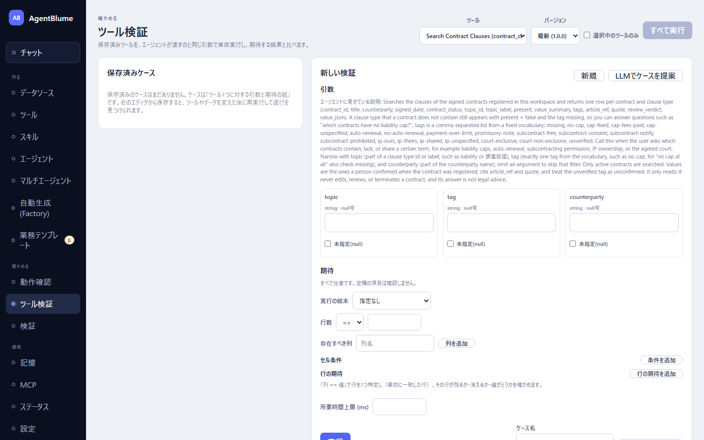

# ツールを検証する

保存したツールが、エージェントに使わせる前に期待どおりの表を返すかを確認する画面。左ナビ「確かめる → **ツール検証**」から開く。

この節を読むと、ツールに期待値付きのテストケースを作って保存し、ツールやデータを変えるたびに再実行して壊れていないかを確かめられるようになる。

## 画面の見方

画面上部で「**ツール**」と「**バージョン**」（既定は「**最新**」）を選ぶ。「**選択中のツールのみ**」にチェックを入れると、左の「**保存済みケース**」一覧がそのツールのケースだけに絞られる。

- 左「保存済みケース」… これまで保存したケースの一覧。行ごとに「**実行**」「**開く**」「**削除**」ができ、直近の結果（合格・不合格・エラー・未実行）がバッジで出る。ヘッダーの「**すべて実行**」で一覧をまとめて実行できる。
- 右のエディタ… 新規なら「**新しい検証**」、既存ケースを開いていれば「**ケース: {ケース名}**」の見出しになる。「**引数**」「**期待**」「**結果**」の3節がある。

まだ何も保存していないときは「保存済みのケースはまだありません。ケースは「ツール1つに対する引数と期待の組」です。右のエディタから保存すると、ツールやデータを変えた後に再実行して退行を見つけられます。」と出る。これがケースの定義そのものである。

## 手順

1. 上部で対象の「ツール」を選ぶ。
2. 「**引数**」節で値を入れる。ツールの入力スキーマから自動でフォームが作られる。引数を受け取らないツールでは「引数なし（このツールは引数を受け取りません）」と出るので、そのまま次へ進む。
3. 「**実行**」を押す。実行中は「実行中… N秒」と経過秒数が出て、右に「**中断**」ボタンが現れる。
4. 結果（出力の表・行数・ノード別の行数）を確認する。エラーになったときは、引数が原因なら「引数「…」の欄へ」ボタンで該当欄へ戻れる。ツール自体の問題なら、直す場所への案内が出る。
5. 必要なら「**期待**」を入れる（すべて任意。空欄の項目は確認しない）。
   - 「**実行の結末**」… 「指定なし」「成功すること」「失敗すること（異常系）」から選ぶ。「失敗すること」を選ぶと、実行がエラーになれば合格になり、他の期待は見ない（異常系のテストに使う）。
   - 「**行数**」… 演算子（`==` `>=` `<=`）と期待する行数。
   - 「**存在すべき列**」… 「列を追加」で列名を足す（出力スキーマが分かっていれば選択式）。
   - 「**セル条件**」… 「条件を追加」で列・演算子（`==` `!=` `>=` `<=` `contains`）・値・範囲（「いずれかの行」/「すべての行」）を指定する。
   - 「**行の期待**」… 「行の期待を追加」で「列 == 値」で行を1つ特定し、その行が「存在する」か「存在しない」かを確かめる。「存在する」を選んだ場合はその行にさらに条件を足せる（最大20件）。
   - 「**AI判定の期待**」… ツールに「AI判定」ノードが含まれるときだけ出る。判定対象の行を「列 == 値」で特定し、その行につけられた判定値のうち「合格として許容する値」をチェックで選ぶ（AIの判定は毎回ぶれるので複数選べる）。理由文に含まれるべき文字列も任意で指定できる。
   - 「**所要時間上限 (ms)**」… 実行時間の上限。
6. もう一度「実行」を押すと、期待と照らし合わせた合否（「**合格**」「**不合格**」「**エラー**」）が出る。
7. 「**ケース名**」を入れて「**ケースとして保存**」（既存ケースを開いていれば「**上書き保存**」）。以後は一覧から「実行」、または「すべて実行」でまとめて再確認できる。

> 「実行の結末」を「失敗すること（異常系）」にしたケースは、実行がエラーで終わっても結果は「合格」と表示される（「期待どおり実行が失敗しました。直すものはありません。」という注記が出る）。エラー表示イコール不合格ではないので注意する。

## ケースを自分で考えるのが面倒なとき（LLMでケースを提案）

エディタ上部の「**LLMでケースを提案**」を押すと、設定中のモデルがツール定義を読み、「**正常**」「**境界**」「**異常**」の3カテゴリでケース案を作る。

1. 「**カテゴリごとの件数**」（1〜5、既定2）と、必要なら「**重点（任意）**」（例: 「価格の境界、空の地域」）を入れて「**提案を作成**」。
2. カード1件ずつ「**実行して確認**」で結果を見て、残したいものを「**保存**」する。内容を直してから残したいときは「**エディタに読み込む**」でエディタへ移してから保存する。
3. まとめて扱いたいときは「**すべて実行**」「**すべて保存**」も使える。

提案はそのままでは保存されない。保存を押すまでケースにはならない。

「LLMでケースを提案」ボタンが押せないときは、設定中のモデルが構造化出力に対応していない。「設定中のモデルが構造化出力に対応していないため使えません。設定画面で対応モデルを選んでください」と出るので、リンクから設定画面の対応モデルへ切り替える。

## うまくいかないとき

| 症状 | 原因 | 直し方 |
|---|---|---|
| 実行がエラーになる | 引数の値が不正、またはツール自体の設計に問題がある | 引数が原因なら「引数「…」の欄へ」ボタンで該当欄を直す。ツール側なら案内されたノードを開いて直す |
| 「失敗すること」を選んだのに不合格になる | 実行がエラーにならず成功してしまった | ツールの挙動を見直すか、期待を「成功すること」に変える |
| 「LLMでケースを提案」が押せない | 設定中のモデルが構造化出力に非対応 | 「設定画面を開く」から対応モデルへ切り替える |
| 保存できない | ケース名が未入力 | 「ケース名を入力してから保存してください」に従ってケース名を入れる |

## 次に読む

- [02 シナリオとペルソナ](./02-scenarios-and-personas.md) — ツール単体ではなく、エージェントを会話で検証する
- [09 業務テンプレート](../09-business-templates/README.md) — 業務テンプレートが内蔵するツールも同じ画面で検証できる
