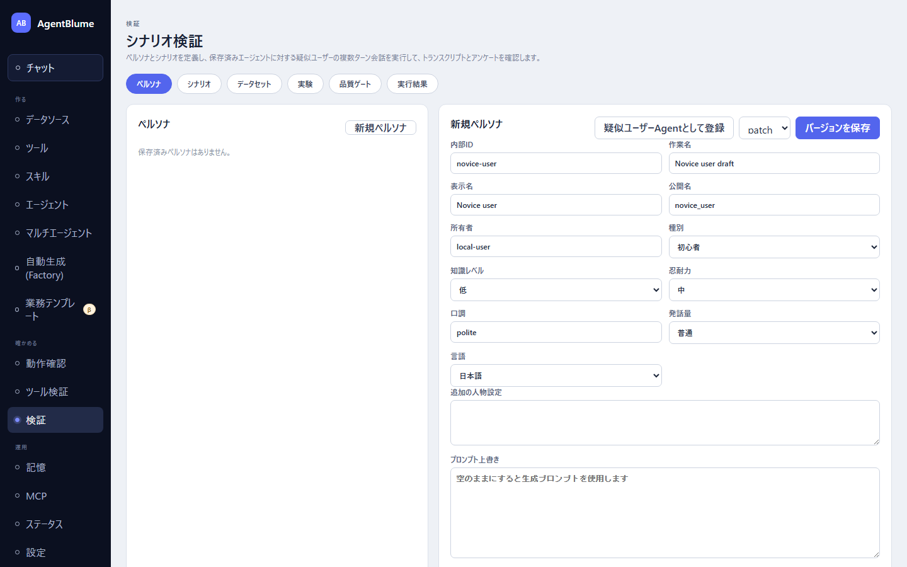

# シナリオとペルソナ（擬似ユーザーとの会話で検証）

保存したエージェントに、種別を持つ**擬似ユーザー**が複数ターンの会話でタスクを試み、会話の終わりにアンケートと感想を答えさせて検証する仕組み。左ナビ「確かめる → **検証**」の「**ペルソナ**」「**シナリオ**」「**実行結果**」の3タブを使う。

この節を読むと、擬似ユーザー（ペルソナ）を作って疑似ユーザーエージェントとして登録し、シナリオを組んで実行し、会話の記録とアンケート結果を読めるようになる。

## ペルソナを作る（「ペルソナ」タブ）

ペルソナは擬似ユーザーの人物設定。「**新規ペルソナ**」を押して次を入力する。

- 「**内部ID**」「**作業名**」「**表示名**」「**公開名**」… 他の資産と同じ命名。
- 「**所有者**」… 省略可（空欄なら自分の名前になる）。
- 「**種別**」… 「**初心者**」「**上級者**」「**多忙**」「**曖昧**」「**懐疑的**」「**カスタム**」から選ぶ。会話の振る舞いの型を決める。
- 「**知識レベル**」「**忍耐力**」… それぞれ「低」「中」「高」。
- 「**口調**」… 自由記述（例: 丁寧）。
- 「**発話量**」… 「簡潔」「普通」「饒舌」。
- 「**言語**」… 「日本語」「英語」。
- 「**追加の人物設定**」… 自由記述の補足。**エージェントへの指示ではなく、この人物がどんな人かだけを書く**（指示文を書くと、擬似ユーザーがそれをそのまま自分の要求として話してしまう）。
- 「**プロンプト上書き**」… 空欄のままでよい。空なら、種別と属性からシステムプロンプトが自動で組み立てられる。完全に自分の文章に置き換えたいときだけ入力する。

「**バージョンを保存**」で保存したら、「**疑似ユーザーAgentとして登録**」を押す。これで種別`pseudo-user`のエージェントとして実体化し、以後シナリオから選べるようになる（保存前はボタンが押せない）。

## シナリオを作る（「シナリオ」タブ）

シナリオは「誰が」「何を目指して」「どのエージェントと」会話するかの定義。「**新規シナリオ**」を押して次を入力する。

- 「**対象エージェント**」＋「**エージェントバージョン**」… 検証したいエージェントとその版。
- 「**疑似ユーザーAgent**」… 先にペルソナタブで登録した疑似ユーザーエージェントから選ぶ。1件も無ければ「疑似ユーザーAgentがありません。Personasタブでペルソナを疑似ユーザーAgentとして登録してください。」と出る。
- 「**目標**」… 擬似ユーザーが達成したいこと（例: 「先月の売上サマリを得る」）。
- 「**状況設定**」… 任意。急いでいる、といった状況。
- 「**上限ユーザーターン (1-8)**」… 会話が何ターンで終わるかの上限。
- 「**期待するツール（カンマ区切り）**」… 任意。エージェントが呼ぶはずのツールの公開名。呼んだツールとの一致率（ツール適合率）の算出に使う。
- 「**アンケート設問**」… 会話終了後に擬似ユーザーへ聞く設問。既定で8問入っている（そのまま使ってよい）。

  1. 目的を達成できましたか（はい/いいえ）
  2. 総合満足度（5段階）
  3. 回答のわかりやすさ（5段階）
  4. 手間の少なさ（手間が少なかったほど高い点）（5段階）
  5. 回答をどの程度信頼できましたか（5段階）
  6. 良かった点（自由記述）
  7. 不満・困った点（自由記述）
  8. 感想（自由記述）

  「**設問を追加**」で増やせる。設問ごとに日本語文・英語文・型（5段階／はい・いいえ／自由記述）を編集できる。

「**バージョンを保存**」を押してから「**シナリオを実行**」を押す。実行が終わると「**実行結果**」タブに結果が出る。

> Factoryが作ったシナリオの「状況設定」には、対象エージェントが持つデータの範囲を伝える「検証の前提」という文章が自動で付く。手で作るシナリオにはこの文章は付かないので、対象エージェントの守備範囲（どんなデータを持つか）は自分で「状況設定」に書く。

## 実行結果を読む（「実行結果」タブ）

一覧から実行を選ぶと、右に詳細が出る。

- 「**トランスクリプト**」… 疑似ユーザーとエージェントの会話全文。エージェントのターンには「**実行トレースを開く**」があり、そのターンのツール呼び出し・応答を1件ずつ確認できる。
- 「**アンケート**」… 5段階の設問はバー表示、はい/いいえは○×で出る。
- 「**感想**」… 自由記述。
- 「**メトリクス**」… ユーザーターン数・エージェント実行数・ツール呼び出し数・期待ツール適合率・所要時間・合計トークン。

一覧の各行には「**目標達成**」「**目標未達**」の表示（疑似ユーザー自身の申告）と、取れていれば満足度が出る。会話やアンケートが失敗した実行には、どの段階（疑似ユーザー／エージェント／アンケート）で何が起きたかの注記が付く。アンケートだけ回収できなかった場合は会話自体は失敗として扱われない。

## うまくいかないとき

| 症状 | 原因 | 直し方 |
|---|---|---|
| シナリオの「疑似ユーザーAgent」に選択肢が出ない | ペルソナを疑似ユーザーAgentとして登録していない | 「ペルソナ」タブでペルソナを保存し、「疑似ユーザーAgentとして登録」を押す |
| 古いシナリオが「旧ペルソナ参照」と表示される | 疑似ユーザーAgentへ統合される前の形式で保存されている | 保存し直すには「疑似ユーザーAgent」欄で改めて選び直す必要がある |
| 「シナリオを実行」が押せない | バージョンをまだ保存していない | 先に「バージョンを保存」を押す |
| 目標を達成しているはずなのに「目標未達」になる | 擬似ユーザーが自分で数値を作って照合している、範囲外の年を尋ねている等 | シナリオの「状況設定」に、対象エージェントが持つデータの範囲（期間・カテゴリ）を書き足す |

## 次に読む

- [03 評価データセットと実験](./03-datasets-and-experiments.md) — 会話やターンの記録を事例として集め、LLMで採点する
- [01 ツールを検証する](./01-tool-check.md) — ツール単体を検証する
