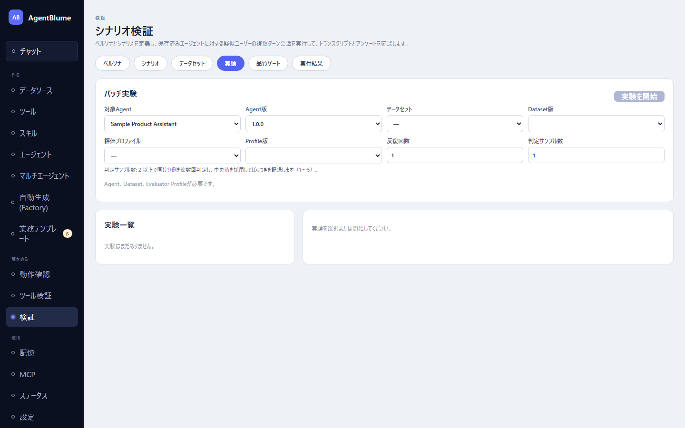

# 評価データセットと実験

エージェントの回答を、事例（ケース）の集まりに対してまとめて実行し、コード採点やLLM採点（judge）でスコアを付ける画面。左ナビ「確かめる → 検証」の「**データセット**」「**実験**」タブを使う。

この節を読むと、評価に使う事例を集めてデータセットにし、採点の仕方（評価プロファイル・Judge Rubric）を決め、実験を回してスコアを読めるようになる。

## データセットタブでできること

「データセット」タブには、実は3種類の編集画面がまとまっている。

### 評価データセット（事例の集まり）

「**内部ID**」「**作業名**」「**表示名**」「**公開名**」「**所有者**」（省略可、空欄なら自分の名前）を入れて、「**評価ケース**」を足していく。ケースには2種類ある。

- 「**turnを追加**」… 単発の質問と参照解答（任意）、期待するツールをカンマ区切りで入れる。
- 「**scenarioを追加**」… 既存の「シナリオ」（[02 シナリオとペルソナ](./02-scenarios-and-personas.md)で作ったもの）を1件選ぶ。会話形式の事例になる。

いずれも「**タグ**」を付けられる（品質ゲートの必須タグと合わせて使う）。「**データセットを保存**」で保存する。

インポート/エクスポートは、JSON または CSV（turn事例のみ対応）をテキストボックスに貼り付け・貼り出しする形（ファイル選択ではない）。「**ケースを読込**」「**保存版を出力**」で行う。

### 評価プロファイル（何をどう採点するか）

「**メトリクスを追加**」で採点項目を足す。項目ごとに「**種別**」を選ぶ。

- 「code」… 決まったロジックで採点する。「**スコアラー**」から選ぶ（`keyword-coverage`・`completeness`・`tone-consistency`・`content-similarity`）。
- 「judge」… LLMに採点させる。保存済みの「**Judge Rubric**」から選ぶ。

それぞれ「**重み**」と「**必須**」チェックを設定する。

### Judge Rubric（LLM採点の基準）

LLMに何を・どう見せて・どう採点させるかを決める。

- 「**参照ポリシー**」… 正解例（参照解答）が必要かどうか。「任意」「必須」「禁止」。
- 「**判定者に見せる実行履歴**」（トレースポリシー）… 判定者にツール呼び出しの履歴をどこまで見せるか。
  - 「任意: ツール呼び出し列があれば見せる」（既定）
  - 「必須: 実行履歴が無ければ判定を失敗にする」… **ターン事例だけで使える**。シナリオ事例（疑似ユーザー会話）は実行履歴を持たないため、シナリオ事例を含むデータセットで実験を起票すると拒否される。
  - 「禁止: 実行履歴は見せない」
- 「**指示文**」… 判定者への指示。
- 「**基準**」（criteria）… 基準ごとに「ID」「ラベル」「重み」「説明」と、採点の段階（レベル）を「スコア」「ラベル」「説明」の組で複数登録する。「**二値にする**」ボタンを押すと、段階を「0=未達」「1=達成」の2値に一括で置き換えられる。**基準は0/1の二値にするのが推奨**（順序尺度より判定の一致率が高い）。

合成スコアは「Σ 重み×水準 / Σ 重み」（判定できなかった基準は分母からも除く）で計算される。

## 実験を回す（「実験」タブ）

1. 「**対象Agent**」＋「**Agent版**」、「**データセット**」＋「**Dataset版**」、「**評価プロファイル**」＋「**Profile版**」を選ぶ。
2. 「**反復回数**」（1〜10）… 同じケースを何回繰り返すか。
3. 「**判定サンプル数**」（1〜5）… 2以上にすると、同じケースをLLMで複数回採点し、中央値を採用する。差が大きい場合は結果に「**ばらつき大**」の印が付く。
4. 「**実験を開始**」を押す。

**先に評価モデル（judge）を設定しておく。** ルーブリックを含む評価プロファイルで実験を始めるには、設定画面のjudgeスロットにモデルが必要。未設定だと「実験を開始」の上に「**判定モデルが未設定です**」の注意が出て、「**設定で判定モデルを設定**」ボタンから設定画面の該当カードへ飛べる。

トレースポリシーを「必須」にしたルーブリックを、シナリオ事例を含むデータセットで使おうとすると、「ルーブリックが必須にしている軌跡がシナリオ事例では得られません」と出て起票を拒否される。「**ルーブリックを開く**」からそのルーブリックの編集へ移り、ポリシーを「任意」にするか、ターン事例だけのデータセットにする。

## 結果の読み方

実験を選ぶと、ケースごとの結果が表に並ぶ。各行の「**スコア / Judge記録**」列に、コード採点のスコアとJudge採点の内訳が出る。

Judge採点の内訳（基準別スコア）:

- 「**合成**」チップ… 合成スコア（判定できた基準の重み付き平均）。
- 基準ごとのチップ… `{基準ID}: {スコア}`。判定できなかった基準は「**判定不能**」と表示され、マウスを載せると理由が出る。
- 「**ばらつき大**」チップ… 判定サンプル間の差が大きいとき（判定サンプル数を2以上にしたときだけ出る）。このスコアは慎重に扱う。

失敗した判定には原因コードと直し方（ポリシーの変更・基準の具体化・判定モデルの変更）が表示される。

## うまくいかないとき

| 症状 | 原因 | 直し方 |
|---|---|---|
| 「実験を開始」の上に「判定モデルが未設定です」と出る | 評価プロファイルがJudge Rubricを使うのに、judgeスロットにモデルが無い | 「設定で判定モデルを設定」から設定画面へ行き、judgeスロットにモデルを保存する |
| 起票時に「ルーブリックが必須にしている軌跡がシナリオ事例では得られません」と出る | トレースポリシーが「必須」のルーブリックを、シナリオ事例を含むデータセットで使おうとした | 「ルーブリックを開く」でポリシーを「任意」にするか、ターン事例だけのデータセットを使う |
| 同じ事例なのに毎回スコアが違う | LLM採点は温度ありで動くことがあり、ぶれが出る | 「判定サンプル数」を2以上にして中央値を見る。「ばらつき大」が出た事例はルーブリックの基準を具体化する |

## 次に読む

- [04 品質ゲート](./04-quality-gate.md) — 実験結果をしきい値で合否判定し、公開の可否を決める
- [02 シナリオとペルソナ](./02-scenarios-and-personas.md) — scenario事例のもとになるシナリオを作る
