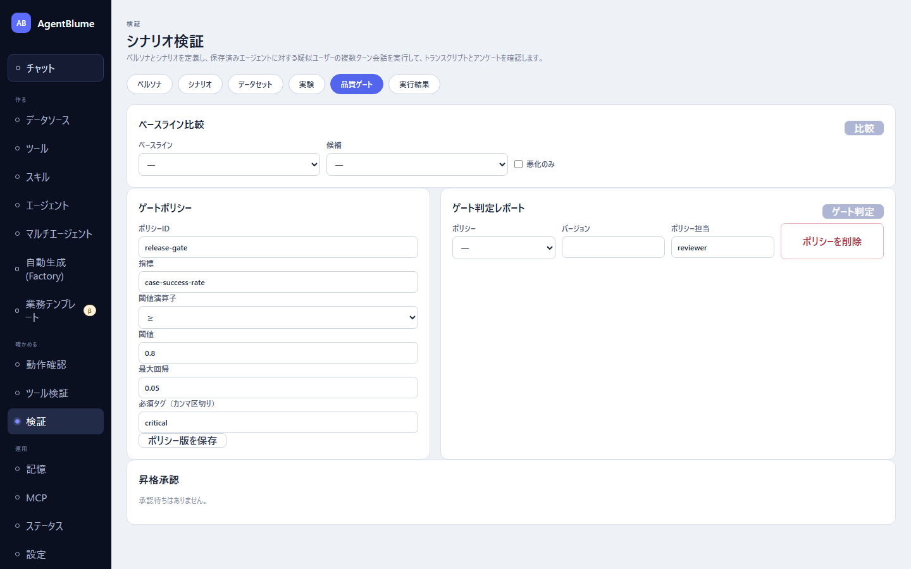

# 品質ゲート

実験の結果をしきい値と比べて合否を判定し、公開してよいかを決める画面。左ナビ「確かめる → 検証」の「**品質ゲート**」タブから使う。

この節を読むと、2つの実験を比較し、ゲートポリシー（合格ライン）を決め、判定してから昇格を申請・承認する流れが分かるようになる。

## ベースラインと候補を比較する

「**ベースライン比較**」で「**ベースライン**」（比較のもとになる実験）と「**候補**」（比較したい新しい実験）を選び、「**比較**」を押す。「**悪化のみ**」にチェックすると悪化した項目だけに絞れる。

指標ごとの表に「**ベースライン平均**」「**候補平均**」「**差分**」「**p50 / p95**」「**標準偏差 / 件数**」「**判定**」（「**改善**」「**悪化**」「**変化なし**」「**比較不可**」）が並ぶ。Judge Rubricの基準別スコアは、対応する合成指標のすぐ下に `指標 › 基準`（例 `judge › accuracy`）の形でインデントして表示される。ケースごとの比較表も別に出る。

## ゲートポリシー（合格ラインを決める）

「**ゲートポリシー**」で次を入力し、「**ポリシー版を保存**」する。

- 「**ID**」
- 「**指標**」… しきい値をかける指標名（自由入力。候補が下に出る）。基準別スコアを指定するときは `judge:accuracy` のように書く。
- 「**閾値演算子**」（`≥` / `≤`）と「**閾値**」… 例えば「`case-success-rate` が `≥` `0.8`」。
- 「**最大回帰**」… ベースラインからの悪化がこの値を超えたら不合格にする。
- 「**必須タグ（カンマ区切り）**」… 指定すると、そのタグを持つケースは必ず合格していなければならないというルールが加わる。

1つのポリシーに、しきい値の条件・最大回帰の条件・必須タグの条件をまとめて持たせられる。

## ゲート判定を実行する

「**ゲート判定**」で「**ポリシー**」を選び（バージョンは自動表示）、必要なら「**ポリシー担当**」（省略可、空欄なら自分の名前）を入れて「**ゲート判定**」を押す。

結果は大きな文字で `PASS` または `FAIL`（英語表記のまま出る）が出て、ルールごとに ✓（合格）/ ×（不合格）とメッセージが並ぶ。`PASS` のときだけ「**昇格申請**」ボタンが現れる。

不要になったポリシーは「**ポリシーを削除**」で消せる。

## 昇格を承認する

「昇格申請」を押すと「**昇格承認**」の一覧に並ぶ。承認する人は一覧から対象を選び、次のいずれかを押す。

- 「**承認**」… 昇格を認める。
- 「**差し戻し**」… 昇格を認めず申請を戻す。

承認待ちが無いときは「承認待ちはありません。」と出る。

## うまくいかないとき

| 症状 | 原因 | 直し方 |
|---|---|---|
| 「比較」が押せない | ベースラインと候補が未選択、または同じ実験を選んでいる | 異なる2つの実験を選ぶ |
| ゲート判定が `FAIL` になる | しきい値未達・回帰が大きい・必須タグのケースが不合格、のいずれか | ×が付いたルールのメッセージを読み、[03 評価データセットと実験](./03-datasets-and-experiments.md)で対象のケースやエージェントを見直す |
| 「昇格申請」ボタンが出ない | ゲート判定が `PASS` になっていない | 先に判定を `PASS` にしてから申請する |

## 次に読む

- [03 評価データセットと実験](./03-datasets-and-experiments.md) — 比較の元になる実験を回す
- [07 Factory](../07-factory/README.md) — Factoryのレポートも、生成物の質はこの品質ゲートで最終確認する
