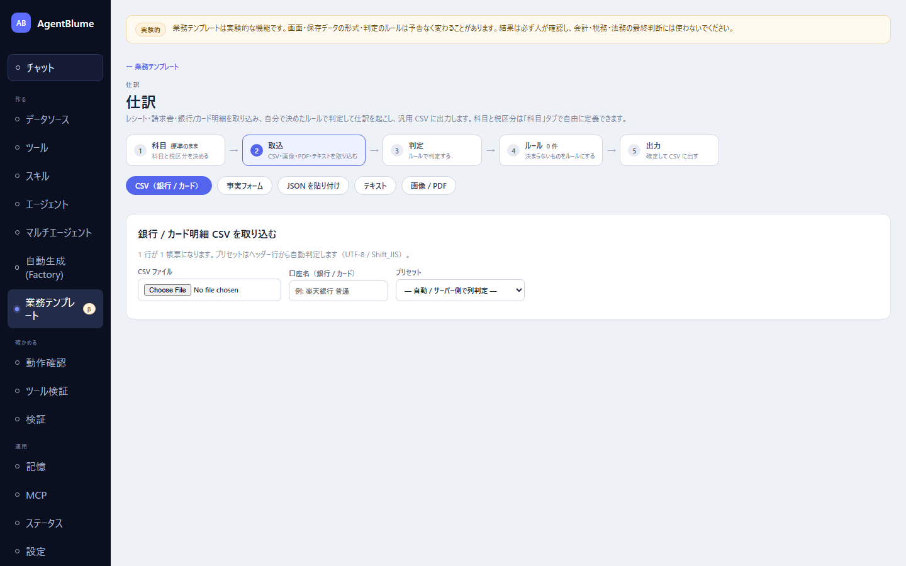

# 仕訳

レシート・請求書・銀行/カード明細から仕訳を起こし、会計ソフト用のCSVを出すアプリ。左ナビ「作る → **業務テンプレート**」の一覧から「**仕訳**」を選ぶ（`#/journal`）。

> 業務テンプレートは実験的な機能。初期状態では左ナビに出ないので、先に「運用 → 設定」の「**実験的な機能を表示する**」をオンにする。

この節を読むと、伝票を取り込んでから仕訳が確定し、CSVで出すまでの流れと、各タブで何をするかが分かるようになる。

## 画面の構成

上部に5つのタブが並ぶ（設定する順に「科目」「取込」「判定」「ルール」「出力」だが、初期表示は「**取込**」。科目には既定値が入っているので、いきなり伝票を取り込んで始めてよい）。

「**科目**」タブで、勘定科目・税区分・補助軸（部門やプロジェクトなど）を自社に合わせて編集できる。**科目と税区分は自分で決める**（初期セットは入っているが、名前も区分も自由に変えられる。「標準に戻す」でいつでも初期セットへ戻せる）。ルールや仕訳はIDで科目を参照するので、名前は後から変えてもよい。削除の代わりに「有効」を外して無効化する。

## 取込タブ — 伝票を入れる

「**取込方法**」として5つのボタンが並ぶ。

1. 「**CSV（銀行 / カード）**」… 銀行やカードの明細CSVを選ぶ。ヘッダー行から自動でプリセットを判定する（判定できないときは手動で選ぶ）。Shift-JISのCSVもそのまま読める。「取り込む」を押すと1行＝1帳票になり、取り込めなかった行は理由付きで表に出る。
2. 「**事実フォーム**」… 手入力の画面。項目（種別・方向・取引日・合計・発行者・登録番号など）を直接入力する。AIで読み取った内容の確認・修正もここで行う。
3. 「**JSON を貼り付け**」… 決まった形のJSONをそのまま貼り付ける。
4. 「**テキスト**」… メール本文やメモを貼り付け、「AI で読み取る」で事実フォームへ変換できる（そのまま「テキストを保存する」だけでもよい）。
5. 「**画像 / PDF**」… レシートの写真やPDFの請求書を選ぶ（ドラッグ&ドロップ可、複数枚まとめて可）。「AI で読み取る」を押すと、読み取り結果が事実フォームに入るので、**内容を確かめてから保存する**。PDFは**ブラウザ側**でページ画像にしてから送るので、PDFそのものはサーバーに渡らない。

どの方法でも、保存を押すまで何も記録されない。AIが読み取った項目のうち信頼度の低いものには「**要確認**」の印が付き、マウスを載せると根拠にした原文の断片が出る。

読み取りの時間の目安: ローカルの12B級モデルで1枚あたり十数秒、より大きいモデルでは数分かかることもある（大きいモデルほど正確だが遅い）。画像は長辺2000pxに縮めて送られる。**長辺1200pxを下回ると読み間違いが増える**ので、注意が出たら帳票が画面いっぱいになるように撮り直す。

## 判定タブ — ルールで仕訳を起こす

「**未判定を判定**」を押すと、保存済みのルールが自動で当てはめられる（1件だけ一致すれば仕訳ドラフトができて「**確定**」になる）。これが自動判定の段階。

自動で決まらなかった帳票を選ぶと、右側に「**原因 → 次の一手 → 直す場所へのボタン**」が出る。これが2段目の確認段階で、状況に応じて次のいずれかになる。

| 未確定の理由 | 意味 | 次の一手 |
|---|---|---|
| 該当ルール無し | 一致する有効なルールが無い | 「ルールを作る」（摘要から条件を事前入力してくれる） |
| 複数ルールが同点 | 同じ強さのルールが2つ以上当たった | 優先度を上げるか条件を具体的にする |
| 必要項目の不足 | ルールが要求する項目が帳票に無い | 「項目を編集」で補ってから再判定する |
| 追加質問あり | ルールの確認質問に該当した | その場で回答する（回答は帳票に保存され再判定される） |
| 推測ルールのみ一致 | 当たったのが推測モードのルールだけ | 信頼できるなら自動モードに切り替える |
| 科目がマスタに無い | ルールの科目が消えた・無効になっている | 「科目マスタを開く」で有効化するか作り直す |
| 貸借不一致 | ルールの行の借方合計と貸方合計が違う | 片側の金額指定を「残額」にする |

どのルールにも当たらないときは「**ヒアリングを開始**」が使える（main モデルが構造化出力に対応しているとき）。用途・相手先・資産かどうかなどを1〜3問聞かれて答えると、**ルール案と仕訳のプレビュー**が出る。新しい科目や税区分が要るときは登録候補が並ぶが、**既定ではすべて未チェック**で、チェックしたものだけが登録される。「ルールを編集してから登録」を押すとその内容のままルール編集フォームが開く。登録すると仕訳ができて帳票が確定になり、「ヒアリングをやめる」を押せば帳票は未確定のまま戻る。

## ルールタブ — 自動仕訳のルールを作る・直す

「**新規**」から作るか、判定タブの「ルールを作る」・ヒアリングの「ルールを編集してから登録」から下書き入りで開く。

主な項目: 「**モード**」（「自動（Stage 1で確定）」= 自動で確定させる／「推測（常にStage 2へ）」= 必ず確認を挟む）、「優先度」、「条件」（帳票の項目に対する一致条件を複数、すべて満たす）、「仕訳行」（貸方・借方・科目・税区分・金額の指定方法）、「摘要テンプレート」、「確認質問」（確定させず質問する条件）など。「**文書でテスト**」で、保存前に既存の帳票に対して一致するか・どんな仕訳になるかを確かめられる。

## 出力タブ — CSVに出す

状態と期間を絞って「**出力する**」を押すと、選んだ形式でCSVがダウンロードされる。形式は4つから選べる。

- 「**汎用 CSV**」（UTF-8 BOM・CRLF・1行＝1仕訳行）
- 「**弥生会計（Shift-JIS）**」
- 「**freee会計**」
- 「**マネーフォワード クラウド会計**」

「**出力した仕訳を『出力済』にする**」を選べば二重出力を防げる。手入力の仕訳もこのタブで足せる（貸借が合わないと保存できない）。

## 試してみる

架空のサンプル帳票一式が [`samples/journal/`](../../../samples/journal/README.md) にある。汎用CSVは `samples/journal/bank-generic.csv`、Shift-JISは `bank-mufg.sjis.csv`、画像は `rendered/invoice-qualified.png` などで一通り試せる。

## うまくいかないとき

| 症状 | 原因 | 直し方 |
|---|---|---|
| 「該当ルール無し」で未確定のまま | まだそのパターンのルールが無い | 「ルールを作る」または「ヒアリングを開始」で作る |
| 画像の読み取りが登録番号や税率別金額を間違える | 画像の解像度が低い（長辺1200px未満） | 帳票が画面いっぱいになるように撮り直す |
| CSV取込で行が取り込まれない | ヘッダーがどのプリセットにも一致しない | プリセットを手動で選ぶか、汎用プリセットの列でCSVを出し直す |
| 貸借が合わずに保存できない | 手入力仕訳の借方・貸方合計が一致していない | 金額を直すか、ルール側の金額指定を「残額」にする |

## 次に読む

- [02 経費精算](./02-expense.md)
- 詳しい仕様: [docs/20-journal.md](../../20-journal.md)
