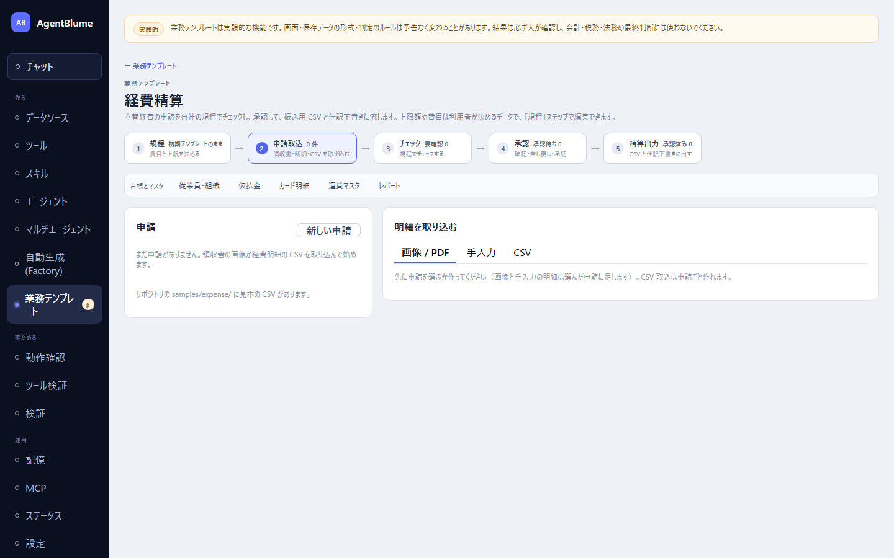

# 経費精算

立替経費の申請を自社の規程でチェックし、承認して、振込用CSVと仕訳下書きに流すアプリ。左ナビ「作る → **業務テンプレート**」の一覧から「**経費精算**」を選ぶ（`#/expense`）。上限額や費目は利用者が決めるデータで、「規程」タブで編集できる。

この節を読むと、規程を決めてから領収書を取り込み、チェック・承認・精算までの流れと、各タブで何をするかが分かるようになる。

## 画面の構成

主な流れは5つのタブ（初期表示は「**申請取込**」。規程には初期テンプレートが入っているので、いきなり申請から始めてよい）。

1. 「**規程**」… 費目と上限を決める
2. 「**申請取込**」… 領収書・明細・CSVを取り込む
3. 「**チェック**」… 規程でチェックする
4. 「**承認**」… 確認・差し戻し・承認
5. 「**精算出力**」… CSVと仕訳下書きに出す

その下にもう1段、いつでも編集できる台帳が並ぶ: 「**従業員・組織**」「**仮払金**」「**カード明細**」「**運賃マスタ**」「**レポート**」。

## 規程タブ — 自社のルールを決める

初期状態では「初期テンプレートのままです」と出る。次を自社に合わせて編集し、「**規程を保存**」する。

- 「**費目**」… 費目ごとに、必要な領収書・登録番号の要件、必須項目（目的・人数・参加者名）、上限額（1件・申請・人・日ごと、税込/税抜）などを設定する。
- 「**申請ルール**」… 提出期限、立替対象外の支払方法、自分の申請を自分で承認することを禁止するかどうかなど。
- 「**事前承認条件**」… 一定額以上は事前承認を必須にする、といった条件。
- 「**承認経路**」… 誰がどの順番で承認するかの多段階の承認フローを定義する。
- 「**理由ごとの重さ**」… チェックで見つかった項目ごとに、既定／要確認／差し戻し／無効を調整する。
- 「**仕訳設定**」… 承認済み申請を仕訳の下書きにするときの科目・税区分・摘要のひな形。
- 「**交通費**」… 運賃マスタや定期区間との照合を使うかどうかと許容誤差。
- 「**カード・仮払の設定**」… カード明細・仮払金との突き合わせに使う科目と許容誤差。

画面下部の「**初期テンプレート**」から、規程全体をいつでも初期状態に戻せる。

## 申請取込タブ — 経費を入れる

「**新しい申請**」で申請者・部署・期間を入力してから、明細を「**取込の方法**」3種類で足す。

1. 「**画像 / PDF**」… 領収書の写真やPDFを選ぶ。「AI で読み取る」を押すと内容が読み取られ、確認フォームに入る。
2. 「**手入力**」… 「新しい明細」から空欄のフォームを開いて直接入力する。
3. 「**CSV**」… 経費明細のCSVを取り込む（列は見出し名と別名で自動判定。Shift-JISも自動変換）。

どの方法でも、最後は共通の「**明細の確認フォーム**」に集約される。費目・取引日・支払先・金額・目的・参加人数などを確認し、「**明細を保存**」を押すまでは何も保存されない。AIの読み取りに確信度が低いものがあると注意が出る。

## チェックタブ — 規程と照らし合わせる

「**未チェックをチェック**」（またはケースごとの「この申請をチェック」）を押す。**この判定はAIを使わず、保存済みの規程との機械的な照合だけを行う。** 結果は「通過」「要確認」「差し戻し」「対象外」に分かれる。

規程や明細を変えた後は「規程か明細が変わりました。再チェックが必要です」と出るので、承認前にもう一度チェックする。

## 承認タブ — 確認して承認する

「要確認」の理由は、承認者が1件ずつ「**確認の根拠コメント（必須）**」を書いてから「**確認済みにする**」を押す必要がある。「差し戻し」の理由は確認では消せず、申請者に差し戻すか明細を直して再チェックするしかない。

問題がなければ「**承認する**」。差し戻す場合は「**差し戻し文言を作る**」で下書きを作り、必要なら直してから「**差し戻す**」を押す（この画面から申請者への通知は送られないので、文言はコピーして別途連絡する）。

## 精算出力タブ — 振込とCSV

承認済みの申請を選んで「**仕訳下書きを作成**」すると、経費精算から仕訳へ引き渡す下書きができる（実際の確定は仕訳画面で行う）。

「**精算CSV**」は2つの形式から選べる。

- 「**振込用（申請ごとの合計）**」
- 「**明細（明細ごと・監査用）**」

CSVを出しても申請の状態は変わらない。**実際に振込が済んだら「精算済みにする」を押して初めて完了扱いになる。**

## 台帳とマスタ

必要になったときに設定すればよい台帳が5つある。

| 台帳 | 何をするか |
|---|---|
| 従業員・組織 | 従業員・部署・承認者グループと振込先口座を管理する |
| 仮払金 | 出張前などに渡した仮払いを申請と突き合わせて精算する |
| カード明細 | 法人カードの明細を取り込み、経費との二重払いを防ぐ |
| 運賃マスタ | 交通費チェックに使う区間と運賃のマスタ |
| レポート | 月・部署・費目などで申請を集計する |

## 試してみる

架空のサンプルデータが [`samples/expense/`](../../../samples/expense/README.md) にある。

## うまくいかないとき

| 症状 | 原因 | 直し方 |
|---|---|---|
| チェックで「規程が未保存」と出る | 規程タブでまだ保存していない | 規程タブで内容を確認し「規程を保存」を押す |
| 承認画面で「確認済みにする」が押せない | 根拠コメントが未入力 | 確認の根拠コメントを書いてから押す |
| 承認できない | 差し戻し理由が残っている、または承認経路の順番と合っていない | 差し戻し理由を解消するか、承認経路の設定を確認する |
| CSVを出したのに申請が精算済みにならない | CSV出力と「精算済みにする」は別操作 | 振込が済んだら改めて「精算済みにする」を押す |

## 次に読む

- [01 仕訳](./01-journal.md)
- [03 請求・消込](./03-receivables.md)
- 詳しい仕様: [docs/21-expense.md](../../21-expense.md)
