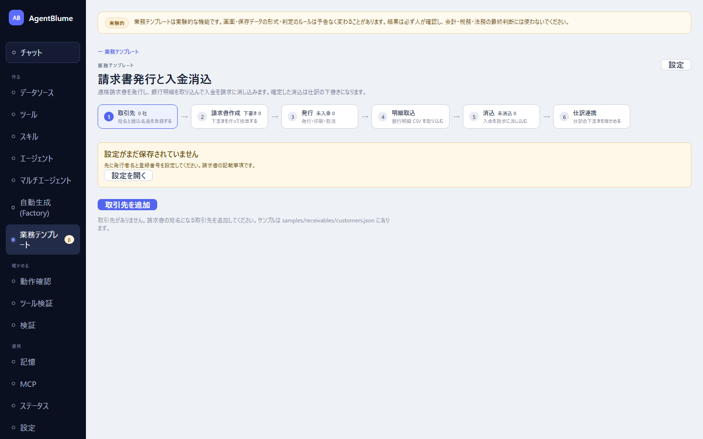

# 請求・消込

適格請求書を発行し、銀行明細を取り込んで入金を請求に消し込むアプリ。確定した消込は仕訳の下書きになる。左ナビ「作る → **業務テンプレート**」の一覧から「**請求・消込**」を選ぶ（`#/receivables`）。

この節を読むと、取引先の登録から請求書の発行、入金の消込、仕訳への引き渡しまでの流れが分かるようになる。

## 画面の構成

6つのタブが順に並ぶ（最初に開くタブは状態次第で変わる: 設定が未保存なら「取引先」、未消込の入金があれば「消込」、それ以外は「請求書作成」）。

1. 「**取引先**」… 宛名と振込名義を登録する
2. 「**請求書作成**」… 下書きを作って検査する
3. 「**発行**」… 発行・印刷・取消
4. 「**明細取込**」… 銀行明細CSVを取り込む
5. 「**消込**」… 入金を請求に消し込む
6. 「**仕訳連携**」… 仕訳の下書きを確かめる

右上の「**設定**」に、発行者情報・端数処理・消込の許容範囲・仕訳連携・請求書番号の書式をまとめてある。

## 取引先タブ

「**取引先を追加**」で、名称・敬称（御中/様）・「**振込名義カナ（銀行明細に出る名義）**」・支払条件（発行日から何日）・登録番号（相手の適格請求書発行事業者番号、任意）を登録する。

銀行明細に出てくる名前が正式名と違うことがあるので、「**振込名義の別名**」に登録しておくと、消込での自動照合の精度が上がる。別名は消込のときに「学習」で自動追加されることもある。

## 請求書作成タブ

「**新しい請求書**」で取引先・発行日・取引日・支払期日を選び、明細（品名・数量・単位・単価・金額・税率）を入力する。税率別の合計は税率ごとに1回だけ端数処理される（明細ごとに丸めると警告が出る）。

登録番号が未設定、または「適格請求書発行事業者として登録している」がオフだと、「この請求書は適格請求書になりません」という警告が出る。警告が残っている間は次の「発行」タブでその請求書を発行できない。「**下書きを保存**」で保存する。

## 発行タブ

下書き一覧の「**検査**」列が「発行可」になっているものだけ「**発行**」できる。発行すると請求書番号が採番され、内容がその時点でスナップショットされる。

発行済みの請求書は「**印刷プレビュー**」からブラウザの印刷機能（PDF保存を含む）で出力する。取消すときは「**取消**」（理由の入力が必須。番号は欠番のまま残る）、同じ内容から作り直すときは「**複製**」を使う。

## 明細取込タブ

銀行サイトからダウンロードした入出金明細CSVを選ぶ（UTF-8・Shift-JIS対応、自動判定）。**入金だけ**が取り込まれ、出金は自動でスキップされる。列の対応（日付・入金・振込依頼人名など）は「**このマッピングを保存**」でプロファイルとして残し、次回から使い回せる。

> この明細の入金は、消込の確定で入金仕訳の下書きになる。**同じ明細を仕訳（[01 仕訳](./01-journal.md)）の取込タブにも入れると二重計上になるので入れないこと。**

## 消込タブ — 入金を請求に当てはめる

「**消込を判定**」を押すと、入金ごとに自動で候補が判定される。1件の入金が1枚のカードになり、状態のチップ（「**決定**」「**候補**」「**保留**」「**対象外**」）と、原因・次の一手の説明が出る。

- 金額・名義とも一致 → 「**確定**」ボタンで確定できる（複数まとめて確定したいときは「**決定を一括確定**」）。
- 手数料分だけ少ない・複数請求の合算・一部入金などの場合 → それぞれ専用のボタン（「手数料込みで確定」「合算で確定」「一部入金で確定」など）が出る。
- 候補が複数あるとき → 候補一覧（請求書番号・取引先・残高・差額・名義一致）から選ぶ。
- どの請求とも一致しないとき → 「請求書を作る」か、消込の対象でない入金（利息・返金など）なら「**対象外にする**」。

**自動で確定されることはない。** 判定はあくまで候補を出すだけで、確定ボタンを押した時点で初めて請求の残高が減る。1つの入金を複数の請求へ割り振りたいときは「**配分を編集**」を使う（差額がゼロにならないと確定できない）。

前受金・過入金・返金は消込では扱わない。案内に従って仕訳側で処理する。

## 仕訳連携タブ

発行・消込の確定で自動生成された仕訳の下書きを一覧で確認する。ここでは編集せず、「**仕訳を開く**」で仕訳画面へ移って直す。

## 試してみる

架空のサンプルデータが [`samples/receivables/`](../../../samples/receivables/README.md) にある。

## うまくいかないとき

| 症状 | 原因 | 直し方 |
|---|---|---|
| 発行ボタンが押せない | 請求書作成タブの検査に違反が残っている | 「請求書作成」タブへ戻り、警告の内容を直す |
| 入金がどの請求とも一致しない | 取引先が未登録、または請求書が未発行 | 取引先・請求書を確認する。利息や返金なら「対象外にする」 |
| 名義が一部しか一致しない | 銀行明細の名義表記が正式名と違う | 「確定して名義を覚える」で別名として登録すると次回から自動一致する |
| 配分編集で確定ボタンが押せない | 配分合計と手数料の差額がゼロになっていない | 金額を調整して差額を0にする |

## 次に読む

- [01 仕訳](./01-journal.md)
- [04 契約書レビュー](./04-contract.md)
- 詳しい仕様: [docs/22-receivables.md](../../22-receivables.md)
