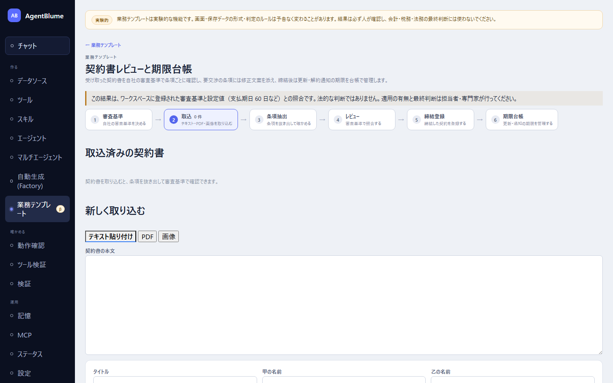

# 契約書レビュー

受け取った契約書を自社の審査基準で条項ごとに確認し、要交渉の条項には修正文案を添え、締結後は更新・解約通知の期限を台帳で管理するアプリ。左ナビ「作る → **業務テンプレート**」の一覧から「**契約書レビュー**」を選ぶ（`#/contract`）。

> **この結果は、ワークスペースに登録された審査基準と設定値（支払期日60日など）との照合であり、法的な判断ではない。** 適用の有無と最終判断は担当者・専門家が行う（この注記はレビュー系の画面に常に表示される）。

この節を読むと、審査基準を決めてから契約書を取り込み、条項を抽出・レビューし、締結登録して期限を管理するまでの流れが分かるようになる。

## 画面の構成

6つのタブが順に並ぶ（初期表示は「**取込**」。審査基準は未保存でも既定テンプレートで判定できる）。

1. 「**審査基準**」… 自社の審査基準を決める
2. 「**取込**」… テキスト・PDF・画像を取り込む
3. 「**条項抽出**」… 条項を抜き出して確かめる
4. 「**レビュー**」… 審査基準で照合する
5. 「**締結登録**」… 締結した契約を登録する
6. 「**期限台帳**」… 更新・通知の期限を管理する

## 審査基準タブ — 自社の合格ラインを作る

初回は「テンプレートから作る」ボタンで、業務委託契約・秘密保持契約の一般的な論点が入った状態から始められる。**同梱テンプレートは発注者側のみ**。受注者側で使う場合は基準を自分で反転させて作る（例: 損害賠償の上限があることを求める、に変える）。

条項の種類（支払期日・契約期間など、値の型やAIへの読み取り指示を持つ）と、基準（条項が必要か・値を比べるか・支払期日などの法令チェックか・AIへのはい/いいえ質問か）を編集する。法令設定タブには支払期日の上限日数などの初期値が入っており、**法改正時は自分で更新する**（自動更新はされない）。印紙税表タブも同様に初期値なので、最新の税額表と照らして更新する。

## 取込タブ

「**テキスト貼り付け**」「**PDF**」「**画像**」の3つの方法で契約書を取り込む。PDFにテキスト層があればブラウザ側で自動抽出、スキャンPDFや画像は「**スキャンページを文字起こし**」でAIに読み取らせる（1ページ20秒ほどの目安）。文字起こし結果は必ず編集できる。

「**自社は甲・乙のどちらですか**」「**相手方の区分（取適法の中小受託事業者か・フリーランス法の特定受託事業者か）**」は、**AIが推定するのではなく利用者が申告する**。ここで入れた内容が、後のレビューでの法令照合（支払期日の上限など）に使われる。

## 条項抽出タブ

「**条項を抽出**」を押すと、AIが本文を読んで、審査基準で定義した条項の種類ごとに値と根拠の引用を自動抽出する。**引用文が実際に本文にあるかは機械的に検証**され、見つからない場合は「（本文に見つかりません）」と警告が出る。本文中のテキストを選択して「**このトピックの根拠にする**」を押せば、根拠を手動で指定・修正できる。実在しない条項は「**条項なしにする**」で明示する。内容を確かめたら「**確認して確定**」を押す（それまでは何も確定しない）。

## レビュータブ — 判定の見方

「**レビューを実行**」を押すと、確定した条項を審査基準と照合する。条項ごとに次の4段階の判定（リスクレベル）が付く。

- 「**受け入れ可**」
- 「**要交渉**」
- 「**不可**」
- 「**要確認**」

判定ごとに「**原因**」と「**次にやること**」が示され、押すと直す場所（審査基準・条項抽出など）へ移動できるボタンが付く。要交渉の条項には「**推奨修正文案**」が添えられ、「**コピー**」でそのまま使える。

**最終的な判定は人が決める。** 各条項の「人の判断」欄で、AIやルールが出した判定を上書きして選び直し、メモを添えて「**判定を確定**」する（確定後は編集がロックされる）。

## 締結登録タブ

締結日・締結方法（紙/電子/不明）・契約金額を入力する。紙の契約では印紙税の候補が提示され（電子契約は課税文書の作成に当たらないとされる）、金額を入れると税額が決まる。入力に応じて満了日・更新拒絶の通知期限・更新日が自動計算されてプレビューされる。「**締結登録する**」で期限台帳に登録される。レビューが未実施・未確定でも登録はできるが、その旨の注意が出る。

## 期限台帳タブ

締結登録した契約の期限が一覧に並ぶ。状態は「**期限切れ**」「**期限が近い**」「**予定**」の3段階で、今日の日付から自動で計算される。通知を済ませたら「**通知済みにする**」を押す（自動では完了にならない）。契約が終わったら「**終了にする**」で理由と終了日を記録する。

## 試してみる

架空のサンプル契約書一式が [`samples/contract/`](../../../samples/contract/README.md) にある。

## うまくいかないとき

| 症状 | 原因 | 直し方 |
|---|---|---|
| 画像の文字起こしができない | 画像を読める main モデルが設定されていない | 「設定でmainモデルを設定」から画像対応モデルへ切り替える |
| 抽出した根拠に「本文に見つかりません」と出る | AIが引用を言い換えた・読み違えた | 本文で該当箇所を選び「このトピックの根拠にする」で根拠を付け直す |
| レビューの判定が古いままに見える | 判定の後に条項またはプレイブックが変わった | 「再レビュー」を押す |
| 締結登録の期限が計算されない | 契約期間や更新条件の条項が確定していない | 条項抽出・レビューへ戻り、該当する条項を確定させる |

## 次に読む

- [03 請求・消込](./03-receivables.md)
- 詳しい仕様: [docs/23-contract.md](../../23-contract.md)
