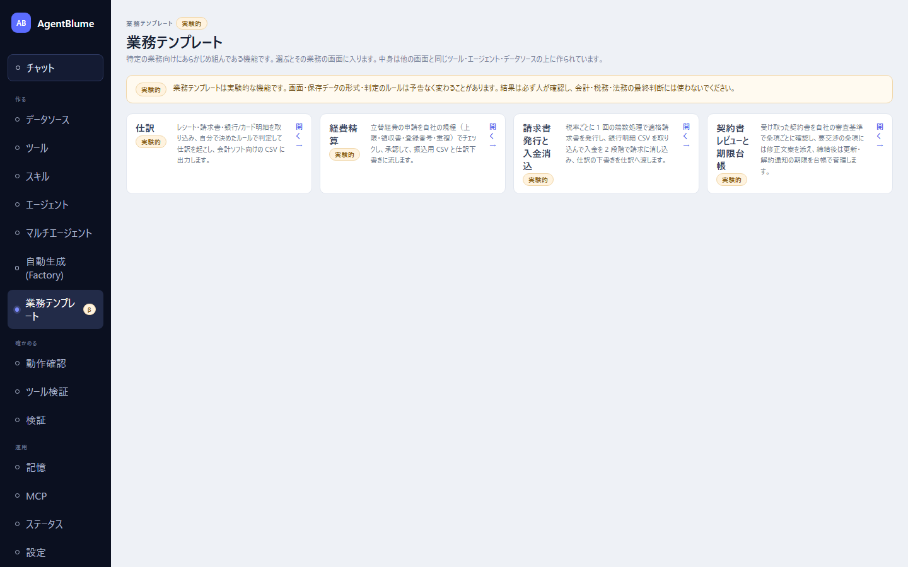

# 09 業務テンプレート

AgentBlumeにあらかじめ組み込まれている4つの業務アプリの章。特定の業務向けにあらかじめ組んである機能で、自分でツールやエージェントを組まなくても、選ぶとその業務の画面にそのまま入れる（中身は他の画面と同じツール・エージェント・データソースの上に作られている）。左ナビ「作る → **業務テンプレート**」から開く（実験的な機能なので、先に「運用 → 設定」の「**実験的な機能を表示する**」をオンにする）。

> **業務テンプレートは実験的な機能です。画面・保存データの形式・判定のルールは予告なく変わることがあります。結果は必ず人が確認し、会計・税務・法務の最終判断には使わないでください。** この注記は一覧画面と各アプリの画面に常に表示される。

- [01 仕訳](./01-journal.md) — 領収書・請求書・明細から仕訳を起こし、会計ソフト用のCSVを出す
- [02 経費精算](./02-expense.md) — 領収書の取込から規程チェック・承認・精算まで
- [03 請求・消込](./03-receivables.md) — 請求書の発行と入金の消込
- [04 契約書レビュー](./04-contract.md) — 契約書のレビューと期限管理

各アプリの詳しい仕様（データ構造・自動判定のルールなど）は開発者向けdocsにある。本章は画面の使い方に絞る。
